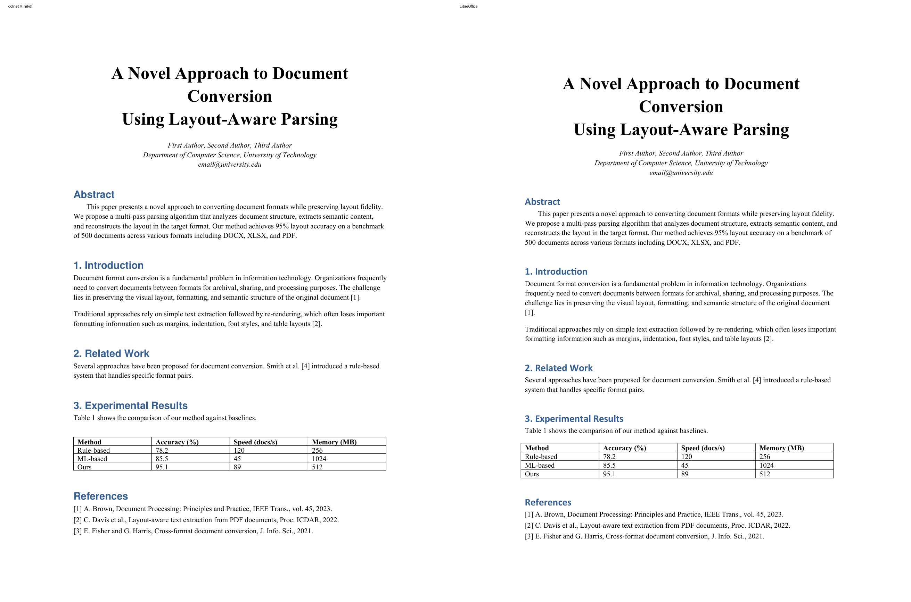
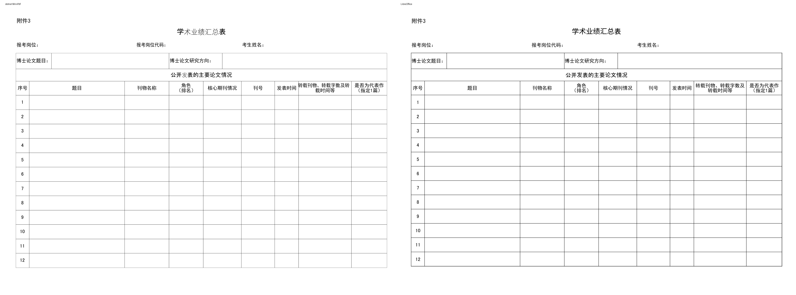
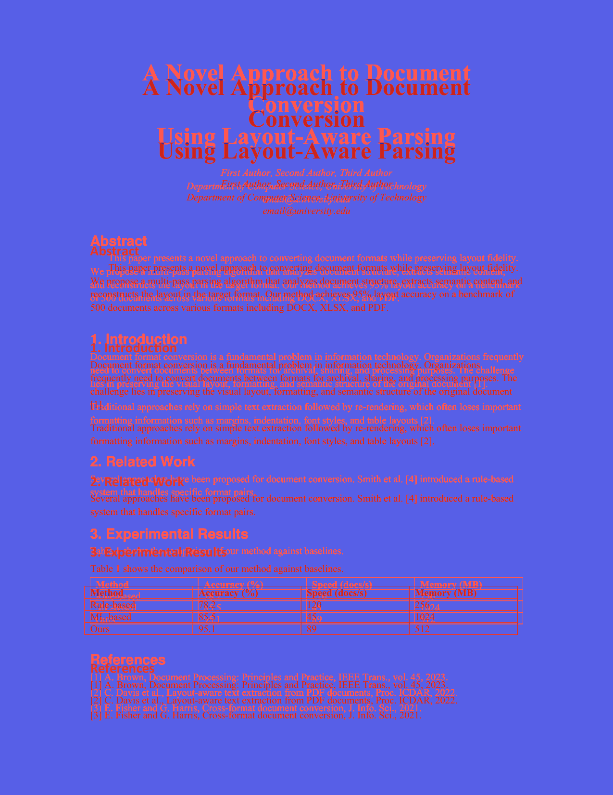
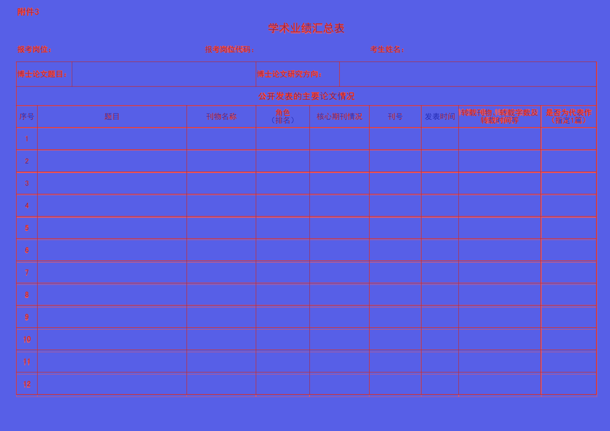
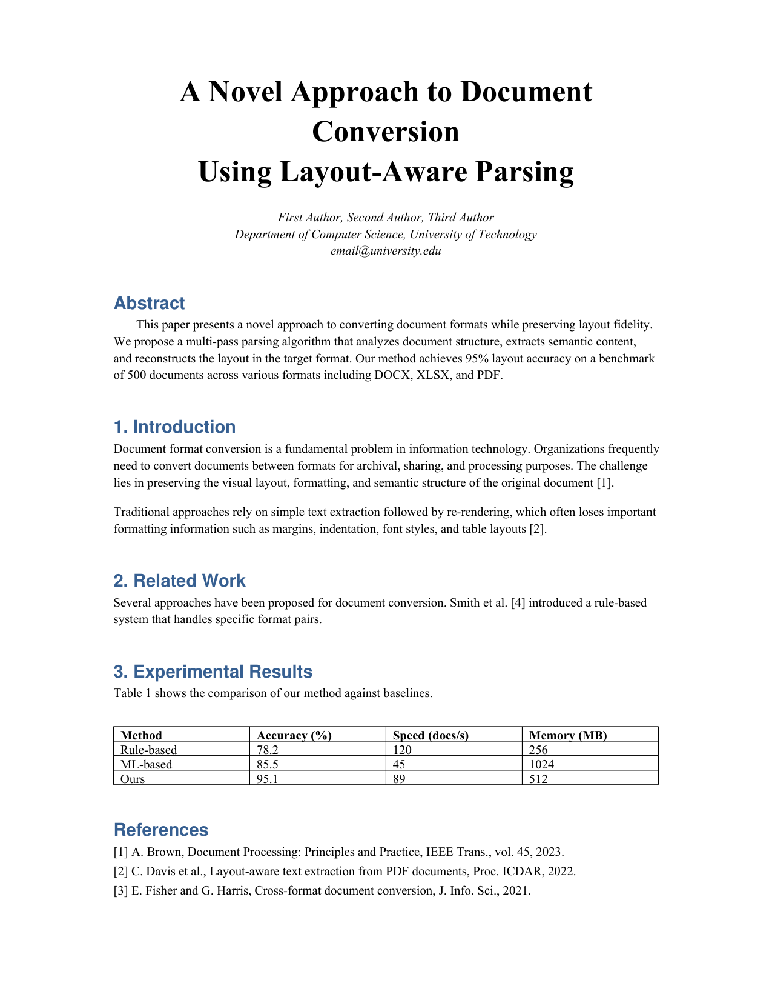
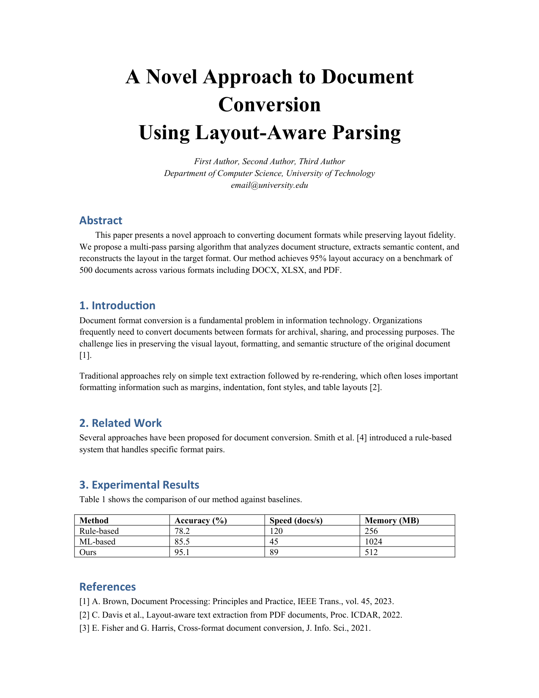

# dotnet MiniPdf vs LibreOffice PDF Comparison Report

Generated: 2026-09-04T13:35:53.301056

## Summary

| # | Test Case | Valid | Text Sim | Visual Avg | Pages (M/R) | Overall |
|---|-----------|-------|----------|------------|-------------|--------|
| 1 | 🟢 docx--13_IEEE_Style_Paper--ca9e946269 | ✅ | 1.0 | 0.9352 | 2/2 | **0.9741** |
| 2 | 🟢 pptx--Asian_Pacific--acd15a1f08 | ✅ | 1.0 | 0.9218 | 12/12 | **0.9687** |
| 3 | 🟢 xlsx--Academic_Achievement_Summary_Table--71937e39c9 | ✅ | 0.9905 | 0.9687 | 2/2 | **0.9837** |

**Average Overall Score: 0.9755**

## Labeled Side-by-Side Comparison

<table>
<tr><th>Case</th><th>Comparison</th></tr>
<tr>
  <td><b>13_IEEE_Style_Paper<br><small>format: docx | case: docx--13_IEEE_Style_Paper--ca9e946269 | scope: dotnet-shared-office</small></b><br>Page 1</td>
  <td></td>
</tr>
<tr>
  <td><b>Asian Pacific<br><small>format: pptx | case: pptx--Asian_Pacific--acd15a1f08 | scope: dotnet-shared-office</small></b><br>Page 1</td>
  <td></td>
</tr>
<tr>
  <td><b>Academic Achievement Summary Table<br><small>format: xlsx | case: xlsx--Academic_Achievement_Summary_Table--71937e39c9 | scope: dotnet-shared-office</small></b><br>Page 1</td>
  <td></td>
</tr>
</table>

## Difference Heatmaps

Blue areas are below the configured difference threshold; red areas have stronger pixel differences. The reference rendering is retained as faint context.

<table>
<tr><th>Case</th><th>Heatmap</th><th>Metrics</th></tr>
<tr>
  <td><b>13_IEEE_Style_Paper</b><br>Page 1</td>
  <td></td>
  <td>changed: 229245 px (10.90%)<br>bbox: [175, 133, 1089, 1496]<br>mean abs RGB: 17.0372<br>RMSE RGB: 58.2292<br>threshold: 12, gain: 5.0</td>
</tr>
<tr>
  <td><b>Asian Pacific</b><br>Page 1</td>
  <td></td>
  <td>changed: 125177 px (5.56%)<br>bbox: [0, 0, 2000, 1125]<br>mean abs RGB: 3.3345<br>RMSE RGB: 17.1019<br>threshold: 12, gain: 5.0</td>
</tr>
<tr>
  <td><b>Academic Achievement Summary Table</b><br>Page 1</td>
  <td></td>
  <td>changed: 130722 px (6.01%)<br>bbox: [46, 21, 1717, 1143]<br>mean abs RGB: 7.9206<br>RMSE RGB: 37.0882<br>threshold: 12, gain: 5.0</td>
</tr>
</table>

## Visual Comparison

<table>
<tr><th>dotnet MiniPdf</th><th>LibreOffice</th></tr>
<tr>
  <td><b>13_IEEE_Style_Paper<br><small>format: docx | case: docx--13_IEEE_Style_Paper--ca9e946269 | scope: dotnet-shared-office</small></b></td>
  <td colspan="1">13_IEEE_Style_Paper <span style="color:#3fb950">⬤</span> 97.4%</td>
</tr>
<tr>
  <td></td>
  <td></td>
</tr>
<tr>
  <td><b>Asian Pacific<br><small>format: pptx | case: pptx--Asian_Pacific--acd15a1f08 | scope: dotnet-shared-office</small></b></td>
  <td colspan="1">Asian Pacific <span style="color:#3fb950">⬤</span> 96.9%</td>
</tr>
<tr>
  <td></td>
  <td></td>
</tr>
<tr>
  <td><b>Academic Achievement Summary Table<br><small>format: xlsx | case: xlsx--Academic_Achievement_Summary_Table--71937e39c9 | scope: dotnet-shared-office</small></b></td>
  <td colspan="1">Academic Achievement Summary Table <span style="color:#3fb950">⬤</span> 98.4%</td>
</tr>
<tr>
  <td></td>
  <td></td>
</tr>
</table>

## Detailed Results

### 13_IEEE_Style_Paper

- **Case Metadata:** format: docx | case: docx--13_IEEE_Style_Paper--ca9e946269 | scope: dotnet-shared-office
- **Source:** tests/Issue_Files/docx/13_IEEE_Style_Paper.docx
- **Text Similarity:** 1.0
- **Visual Average:** 0.9352
- **Overall Score:** 0.9741
- **Pages:** MiniPdf=2, Reference=2
- **File Size:** MiniPdf=478407 bytes, Reference=117598 bytes

<details><summary>Text Diff</summary>

```diff
--- minipdf/docx--13_IEEE_Style_Paper--ca9e946269.pdf
+++ reference/docx--13_IEEE_Style_Paper--ca9e946269.pdf
@@ -6,13 +6,14 @@
 email@university.edu

 Abstract

 This paper presents a novel approach to converting document formats while preserving layout fidelity.

-We propose a multi-pass parsing algorithm that analyzes document structure, extracts semantic content,

-and reconstructs the layout in the target format. Our method achieves 95% layout accuracy on a benchmark

-of 500 documents across various formats including DOCX, XLSX, and PDF.

+We propose a multi-pass parsing algorithm that analyzes document structure, extracts semantic content, and

+reconstructs the layout in the target format. Our method achieves 95% layout accuracy on a benchmark of

+500 documents across various formats including DOCX, XLSX, and PDF.

 1. Introduction

-Document format conversion is a fundamental problem in information technology. Organizations frequently

-need to convert documents between formats for archival, sharing, and processing purposes. The challenge

-lies in preserving the visual layout, formatting, and semantic structure of the original document [1].

+Document format conversion is a fundamental problem in information technology. Organizations

+frequently need to convert documents between formats for archival, sharing, and processing purposes. The

+challenge lies in preserving the visual layout, formatting, and semantic structure of the original document

+[1].

 Traditional approaches rely on simple text extraction followed by re-rendering, which often loses important

 formatting information such as margins, indentation, font styles, and table layouts [2].

 2. Related Work
```
</details>

### Asian Pacific

- **Case Metadata:** format: pptx | case: pptx--Asian_Pacific--acd15a1f08 | scope: dotnet-shared-office
- **Source:** tests/Issue_Files/pptx/Asian Pacific.pptx
- **Text Similarity:** 1.0
- **Visual Average:** 0.9218
- **Overall Score:** 0.9687
- **Pages:** MiniPdf=12, Reference=12
- **File Size:** MiniPdf=745429 bytes, Reference=355585 bytes

Text content: ✅ Identical

### Academic Achievement Summary Table

- **Case Metadata:** format: xlsx | case: xlsx--Academic_Achievement_Summary_Table--71937e39c9 | scope: dotnet-shared-office
- **Source:** tests/Issue_Files/xlsx/Academic Achievement Summary Table.xlsx
- **Text Similarity:** 0.9905
- **Visual Average:** 0.9687
- **Overall Score:** 0.9837
- **Pages:** MiniPdf=2, Reference=2
- **File Size:** MiniPdf=373862 bytes, Reference=168612 bytes

<details><summary>Text Diff</summary>

```diff
--- minipdf/xlsx--Academic_Achievement_Summary_Table--71937e39c9.pdf
+++ reference/xlsx--Academic_Achievement_Summary_Table--71937e39c9.pdf
@@ -2,10 +2,10 @@
 学 术业绩汇总 表

 报考岗位： 报考岗位代码： 考生姓名：

 博士论文题目： 博士论文研究方向：

-公开 发 表的主要 论文情况

-角色 转载刊物、转载字数及转 是否为代表作

+公开 发 表的主要 论 文情况

+角色 转载刊物、转载字数及 是否为代表作

 序号 题目 刊物名称 核心期刊情况 刊号 发表时间

-（排名） 载时间等 （指定1篇）

+（排名） 转载时间等 （指定1篇）

 1

 2

 3
```
</details>

## Improvement Suggestions

All test cases scored 0.8 or above. 🎉
