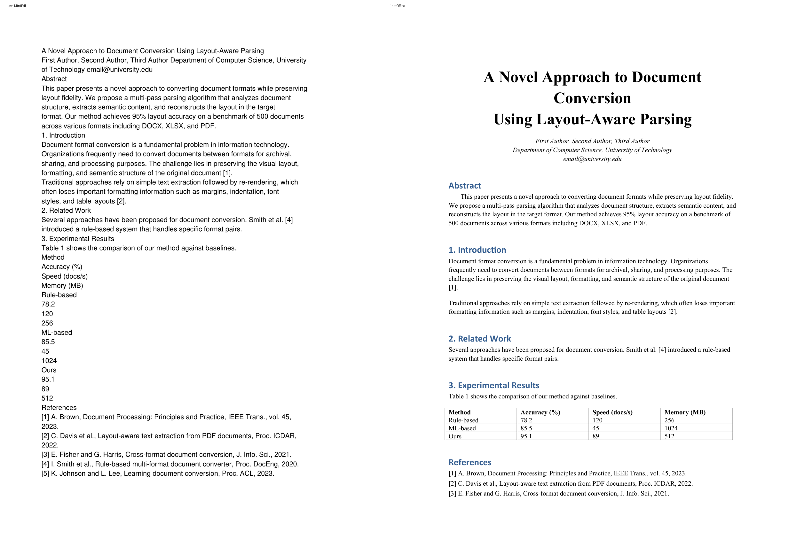
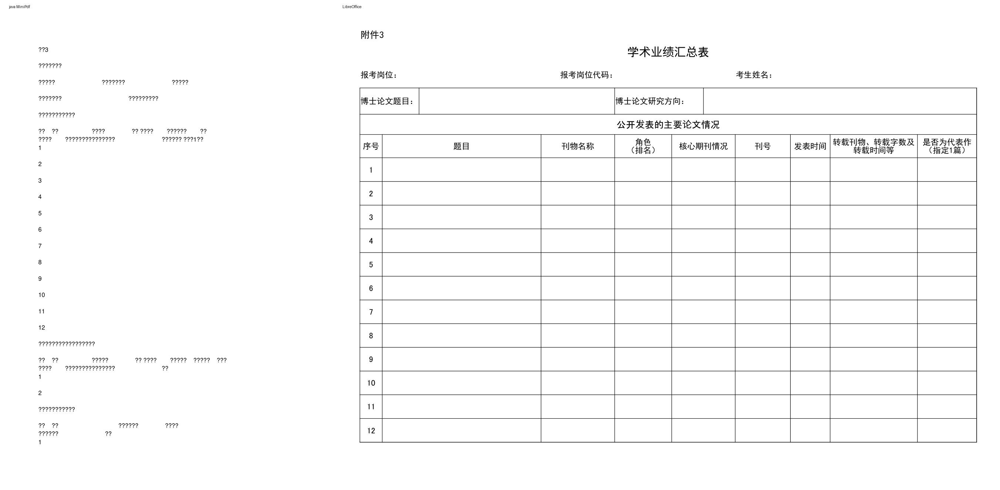
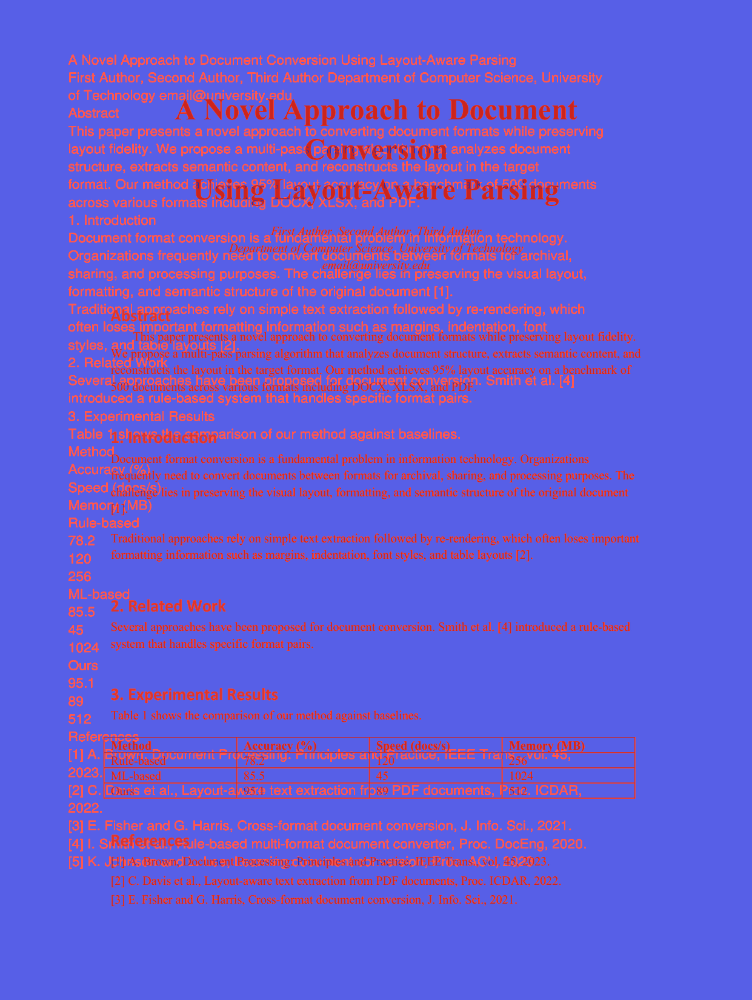
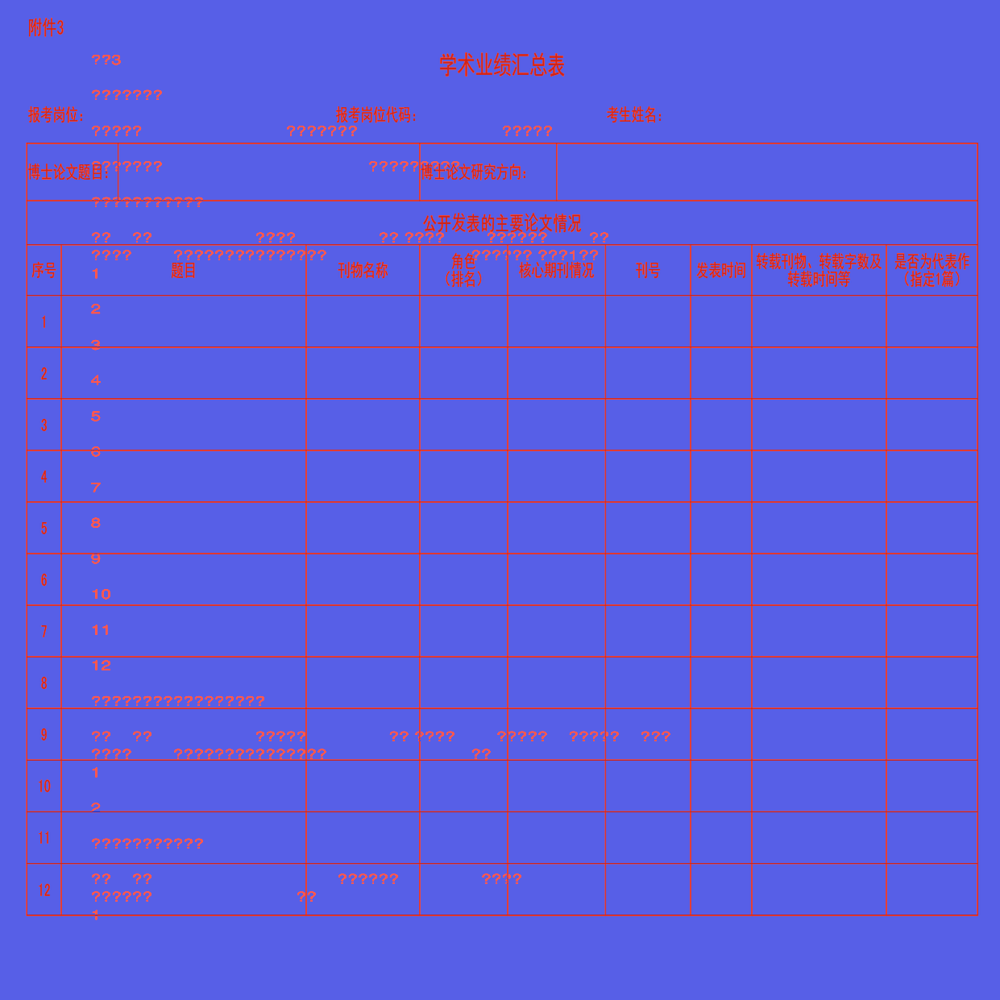
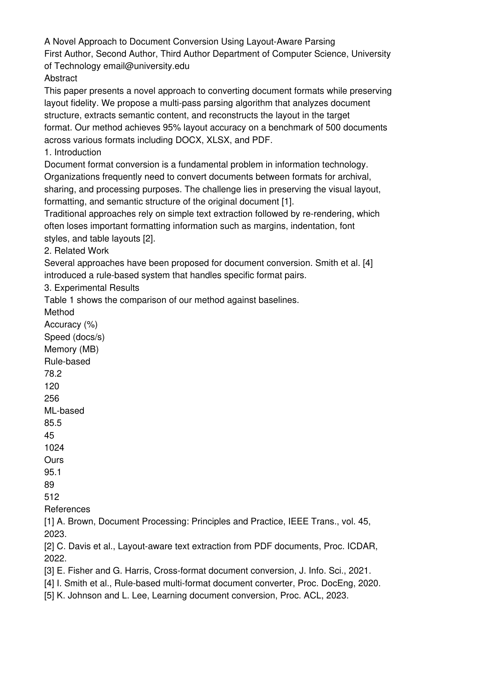
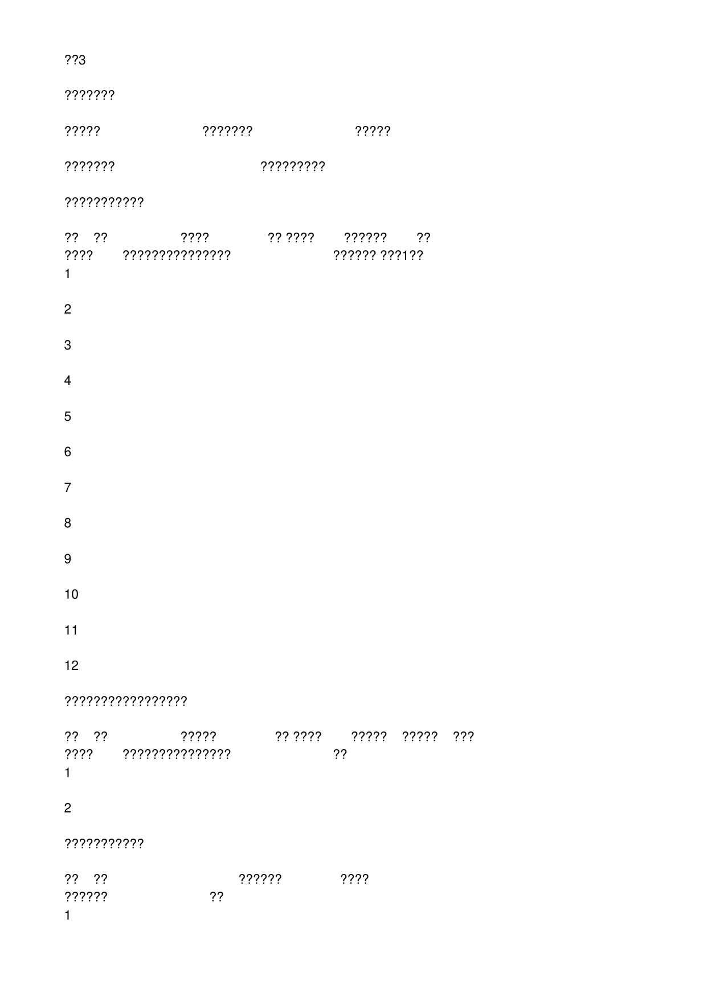

# java MiniPdf vs LibreOffice PDF Comparison Report

Generated: 2026-09-04T13:36:11.196590

## Summary

| # | Test Case | Valid | Text Sim | Visual Avg | Pages (M/R) | Overall |
|---|-----------|-------|----------|------------|-------------|--------|
| 1 | 🟡 docx--13_IEEE_Style_Paper--ca9e946269 | ❌ | 0.9533 | 0.8651 | 1/2 | **0.8274** |
| 2 | 🟡 pptx--Asian_Pacific--acd15a1f08 | ❌ | 1.0 | 0.3961 | 12/12 | **0.7584** |
| 3 | 🔴 xlsx--Academic_Achievement_Summary_Table--71937e39c9 | ❌ | 0.2637 | 0.7028 | 3/2 | **0.4866** |

**Average Overall Score: 0.6908**

## Labeled Side-by-Side Comparison

<table>
<tr><th>Case</th><th>Comparison</th></tr>
<tr>
  <td><b>13_IEEE_Style_Paper<br><small>format: docx | case: docx--13_IEEE_Style_Paper--ca9e946269 | scope: java-shared-office</small></b><br>Page 1</td>
  <td></td>
</tr>
<tr>
  <td><b>Asian Pacific<br><small>format: pptx | case: pptx--Asian_Pacific--acd15a1f08 | scope: java-shared-office</small></b><br>Page 1</td>
  <td></td>
</tr>
<tr>
  <td><b>Academic Achievement Summary Table<br><small>format: xlsx | case: xlsx--Academic_Achievement_Summary_Table--71937e39c9 | scope: java-shared-office</small></b><br>Page 1</td>
  <td></td>
</tr>
</table>

## Difference Heatmaps

Blue areas are below the configured difference threshold; red areas have stronger pixel differences. The reference rendering is retained as faint context.

<table>
<tr><th>Case</th><th>Heatmap</th><th>Metrics</th></tr>
<tr>
  <td><b>13_IEEE_Style_Paper</b><br>Page 1</td>
  <td></td>
  <td>changed: 246928 px (12.06%)<br>bbox: [112, 90, 1058, 1496]<br>mean abs RGB: 18.548<br>RMSE RGB: 60.458<br>threshold: 12, gain: 5.0</td>
</tr>
<tr>
  <td><b>Asian Pacific</b><br>Page 1</td>
  <td></td>
  <td>changed: 370749 px (16.48%)<br>bbox: [0, 0, 1999, 1125]<br>mean abs RGB: 14.6752<br>RMSE RGB: 44.0329<br>threshold: 12, gain: 5.0</td>
</tr>
<tr>
  <td><b>Academic Achievement Summary Table</b><br>Page 1</td>
  <td></td>
  <td>changed: 88376 px (5.74%)<br>bbox: [32, 22, 1215, 1142]<br>mean abs RGB: 8.2376<br>RMSE RGB: 38.5433<br>threshold: 12, gain: 5.0</td>
</tr>
</table>

## Visual Comparison

<table>
<tr><th>java MiniPdf</th><th>LibreOffice</th></tr>
<tr>
  <td><b>13_IEEE_Style_Paper<br><small>format: docx | case: docx--13_IEEE_Style_Paper--ca9e946269 | scope: java-shared-office</small></b></td>
  <td colspan="1">13_IEEE_Style_Paper <span style="color:#d29922">⬤</span> 82.7%</td>
</tr>
<tr>
  <td></td>
  <td></td>
</tr>
<tr>
  <td><b>Asian Pacific<br><small>format: pptx | case: pptx--Asian_Pacific--acd15a1f08 | scope: java-shared-office</small></b></td>
  <td colspan="1">Asian Pacific <span style="color:#d29922">⬤</span> 75.8%</td>
</tr>
<tr>
  <td></td>
  <td></td>
</tr>
<tr>
  <td><b>Academic Achievement Summary Table<br><small>format: xlsx | case: xlsx--Academic_Achievement_Summary_Table--71937e39c9 | scope: java-shared-office</small></b></td>
  <td colspan="1">Academic Achievement Summary Table <span style="color:#f85149">⬤</span> 48.7%</td>
</tr>
<tr>
  <td></td>
  <td></td>
</tr>
</table>

## Detailed Results

### 13_IEEE_Style_Paper

- **Case Metadata:** format: docx | case: docx--13_IEEE_Style_Paper--ca9e946269 | scope: java-shared-office
- **Source:** tests/Issue_Files/docx/13_IEEE_Style_Paper.docx
- **Text Similarity:** 0.9533
- **Visual Average:** 0.8651
- **Overall Score:** 0.8274
- **Pages:** MiniPdf=1, Reference=2
- **File Size:** MiniPdf=4962 bytes, Reference=117598 bytes

<details><summary>Text Diff</summary>

```diff
--- minipdf/docx--13_IEEE_Style_Paper--ca9e946269.pdf
+++ reference/docx--13_IEEE_Style_Paper--ca9e946269.pdf
@@ -1,46 +1,31 @@
-A Novel Approach to Document Conversion Using Layout-Aware Parsing

-First Author, Second Author, Third Author Department of Computer Science, University

-of Technology email@university.edu

+A Novel Approach to Document

+Conversion

+Using Layout-Aware Parsing

+First Author, Second Author, Third Author

+Department of Computer Science, University of Technology

+email@university.edu

 Abstract

-This paper presents a novel approach to converting document formats while preserving

-layout fidelity. We propose a multi-pass parsing algorithm that analyzes document

-structure, extracts semantic content, and reconstructs the layout in the target

-format. Our method achieves 95% layout accuracy on a benchmark of 500 documents

-across various formats including DOCX, XLSX, and PDF.

+This paper presents a novel approach to converting document formats while preserving layout fidelity.

+We propose a multi-pass parsing algorithm that analyzes document structure, extracts semantic content, and

+reconstructs the layout in the target format. Our method achieves 95% layout accuracy on a benchmark of

+500 documents across various formats including DOCX, XLSX, and PDF.

 1. Introduction

-Document format conversion is a fundamental problem in information technology.

-Organizations frequently need to convert documents between formats for archival,

-sharing, and processing purposes. The challenge lies in preserving the visual layout,

-formatting, and semantic structure of the original document [1].

-Traditional approaches rely on simple text extraction followed by re-rendering, which

-often loses important formatting information such as margins, indentation, font

-styles, and table layouts [2].

+Document format conversion is a fundamental problem in information technology. Organizations

+frequently need to convert documents between formats for archival, sharing, and processing purposes. The

+challenge lies in preserving the visual layout, formatting, and semantic structure of the original document

+[1].

+Traditional approaches rely on simple text extraction followed by re-rendering, which often loses important

+formatting information such as margins, indentation, font styles, and table layouts [2].

 2. Related Work

-Several approaches have been proposed for document conversion. Smith et al. [4]

-introduced a rule-based system that handles specific format pairs.

+Several approaches have been proposed for document conversion. Smith et al. [4] introduced a rule-based

+system that handles specific format pairs.

 3. Experimental Results

 Table 1 shows the comparison of our method against baselines.

-Method

-Accuracy (%)

-Speed (docs/s)

-Memory (MB)

-Rule-based

-78.2

-120

-256

-ML-based

-85.5

-45

-1024

-Ours

-95.1

-89

-512

+Method Accuracy (%) Speed (docs/s) Memory (MB)

+Rule-based 78.2 120 256

+M
... (752 more characters)

```
</details>

### Asian Pacific

- **Case Metadata:** format: pptx | case: pptx--Asian_Pacific--acd15a1f08 | scope: java-shared-office
- **Source:** tests/Issue_Files/pptx/Asian Pacific.pptx
- **Text Similarity:** 1.0
- **Visual Average:** 0.3961
- **Overall Score:** 0.7584
- **Pages:** MiniPdf=12, Reference=12
- **File Size:** MiniPdf=8908 bytes, Reference=355585 bytes

<details><summary>Text Diff</summary>

```diff
--- minipdf/pptx--Asian_Pacific--acd15a1f08.pdf
+++ reference/pptx--Asian_Pacific--acd15a1f08.pdf
@@ -1 +1,2 @@
-Asian Pacific  Heritage Month
+Asian Pacific

+Heritage Month
```
</details>

### Academic Achievement Summary Table

- **Case Metadata:** format: xlsx | case: xlsx--Academic_Achievement_Summary_Table--71937e39c9 | scope: java-shared-office
- **Source:** tests/Issue_Files/xlsx/Academic Achievement Summary Table.xlsx
- **Text Similarity:** 0.2637
- **Visual Average:** 0.7028
- **Overall Score:** 0.4866
- **Pages:** MiniPdf=3, Reference=2
- **File Size:** MiniPdf=11185 bytes, Reference=168612 bytes

<details><summary>Text Diff</summary>

```diff
--- minipdf/xlsx--Academic_Achievement_Summary_Table--71937e39c9.pdf
+++ reference/xlsx--Academic_Achievement_Summary_Table--71937e39c9.pdf
@@ -1,10 +1,11 @@
-??3

-???????

-?????                            ???????                            ?????

-???????                                        ?????????

-???????????

-??    ??                    ????                ?? ????        ??????        ??

-????        ???????????????                            ?????? ???1??

+附件3

+学 术业绩汇总 表

+报考岗位： 报考岗位代码： 考生姓名：

+博士论文题目： 博士论文研究方向：

+公开 发 表的主要 论 文情况

+角色 转载刊物、转载字数及 是否为代表作

+序号 题目 刊物名称 核心期刊情况 刊号 发表时间

+（排名） 转载时间等 （指定1篇）

 1

 2

 3

@@ -16,13 +17,4 @@
 9

 10

 11

-12

-?????????????????

-??    ??                    ?????                ?? ????        ?????    ?????    ???

-????        ???????????????                            ??

-1

-2

-???????????

-??    ??                                    ??????                ????

-??????                            ??

-1
+12
```
</details>

## Improvement Suggestions

### ⚠ Low-Score Test Cases (below 0.8)

1. **xlsx--Academic_Achievement_Summary_Table--71937e39c9** (score: 0.4866)
1. **pptx--Asian_Pacific--acd15a1f08** (score: 0.7584)

Review the text diffs and visual comparisons above to identify specific rendering issues.
