# go MiniPdf vs Microsoft 365 Excel Reference PDF Comparison Report

Generated: 2026-09-05T15:55:02.085284

## Summary

| # | Test Case | Valid | Text Sim | Visual Avg | Pages (M/R) | Overall |
|---|-----------|-------|----------|------------|-------------|--------|
| 1 | 🔴 Issue202609031340 | ❌ | 0.175 | 0.5866 | 3/4 | **0.4046** |

**Average Overall Score: 0.4046**

## Labeled Side-by-Side Comparison

<table>
<tr><th>Case</th><th>Comparison</th></tr>
<tr>
  <td><b>Issue202609031340<br><small>format: xlsx | case: Issue202609031340 | scope: go-issue-xlsx</small></b><br>Page 1</td>
  <td>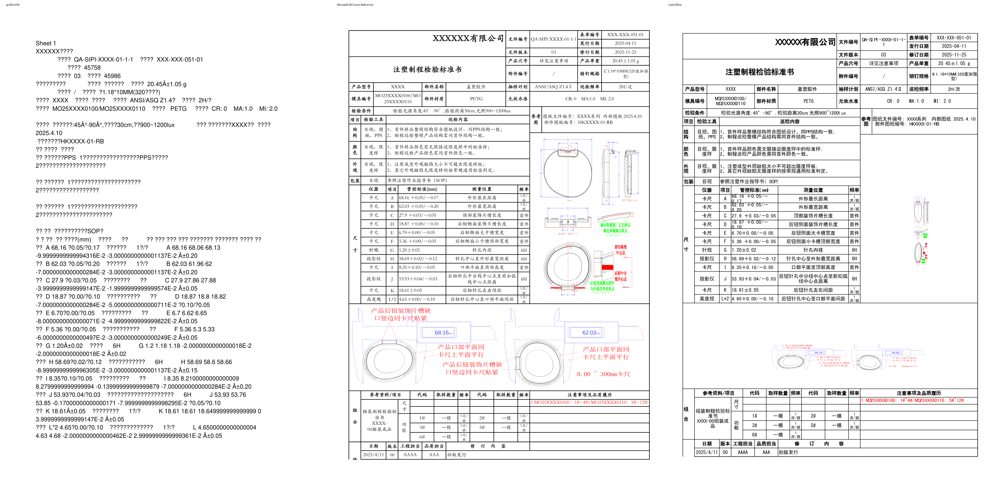</td>
</tr>
<tr>
  <td><b>Issue202609031340<br><small>format: xlsx | case: Issue202609031340 | scope: go-issue-xlsx</small></b><br>Page 2</td>
  <td>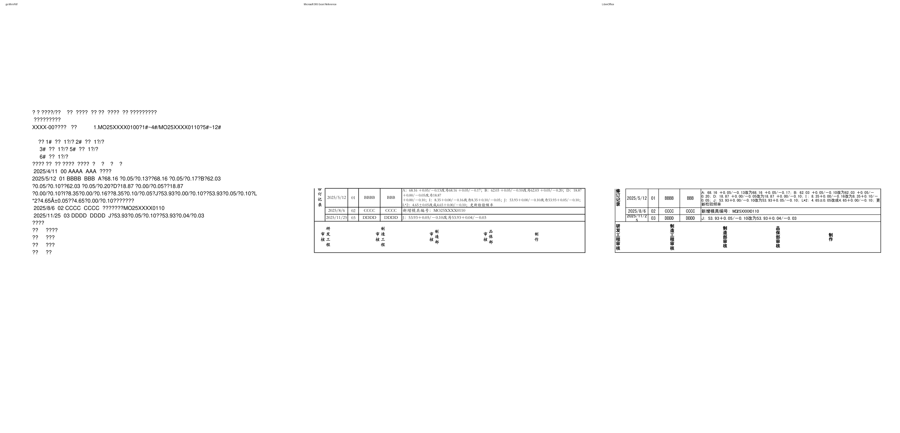</td>
</tr>
<tr>
  <td><b>Issue202609031340<br><small>format: xlsx | case: Issue202609031340 | scope: go-issue-xlsx</small></b><br>Page 3</td>
  <td>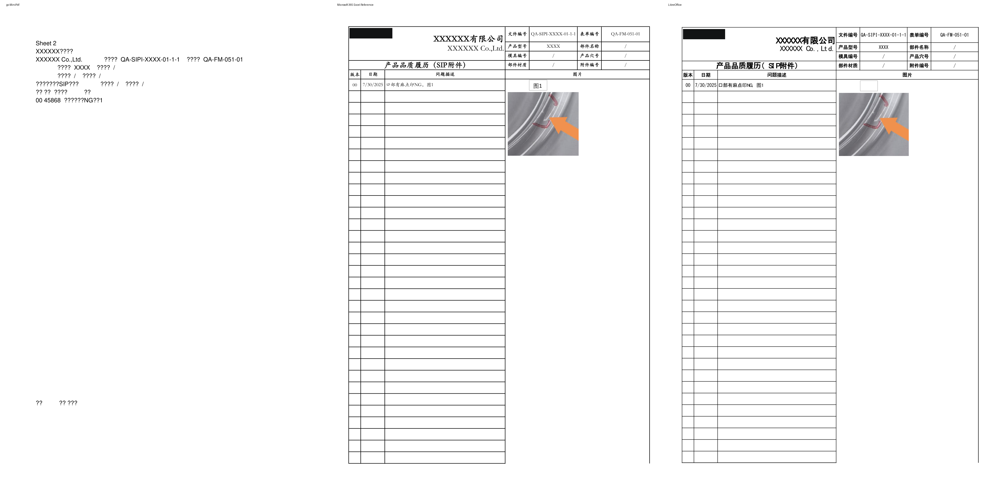</td>
</tr>
<tr>
  <td><b>Issue202609031340<br><small>format: xlsx | case: Issue202609031340 | scope: go-issue-xlsx</small></b><br>Page 4</td>
  <td>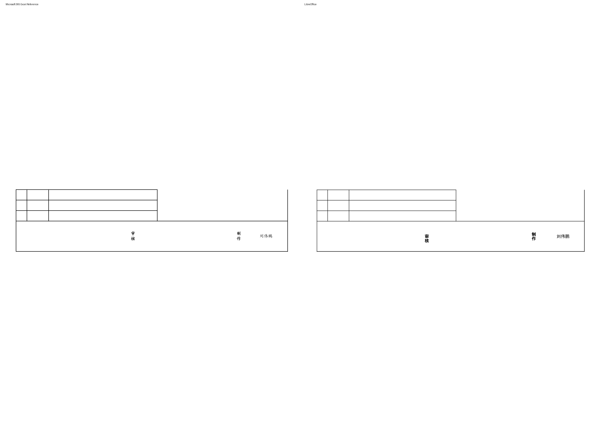</td>
</tr>
</table>

## Difference Heatmaps

Blue areas are below the configured difference threshold; red areas have stronger pixel differences. The reference rendering is retained as faint context.

<table>
<tr><th>Case</th><th>Heatmap</th><th>Metrics</th></tr>
<tr>
  <td><b>Issue202609031340</b><br>Page 1</td>
  <td>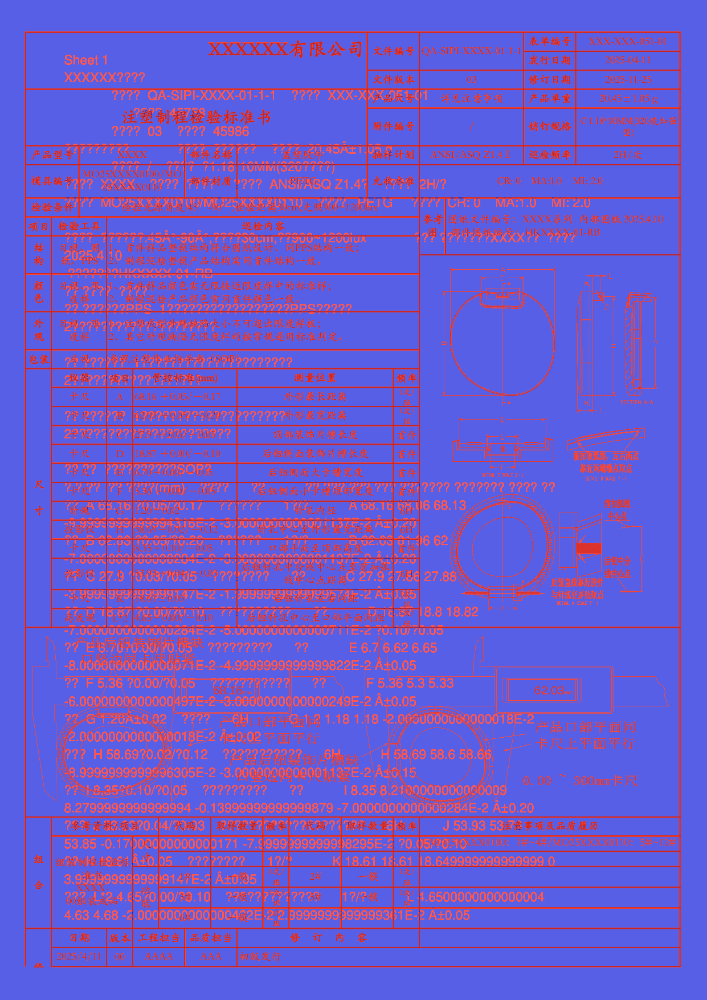</td>
  <td>changed: 393040 px (18.06%)<br>bbox: [43, 55, 1195, 1697]<br>mean abs RGB: 27.4393<br>RMSE RGB: 73.7664<br>threshold: 12, gain: 5.0</td>
</tr>
<tr>
  <td><b>Issue202609031340</b><br>Page 2</td>
  <td>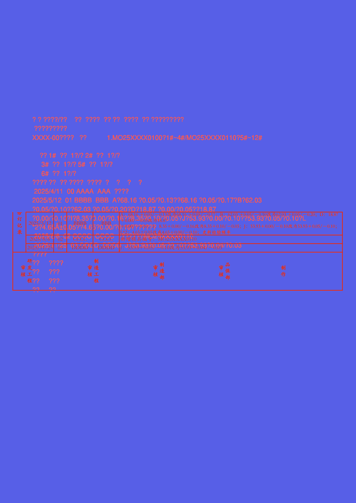</td>
  <td>changed: 79842 px (3.67%)<br>bbox: [43, 408, 1195, 1019]<br>mean abs RGB: 5.9656<br>RMSE RGB: 34.6037<br>threshold: 12, gain: 5.0</td>
</tr>
<tr>
  <td><b>Issue202609031340</b><br>Page 3</td>
  <td>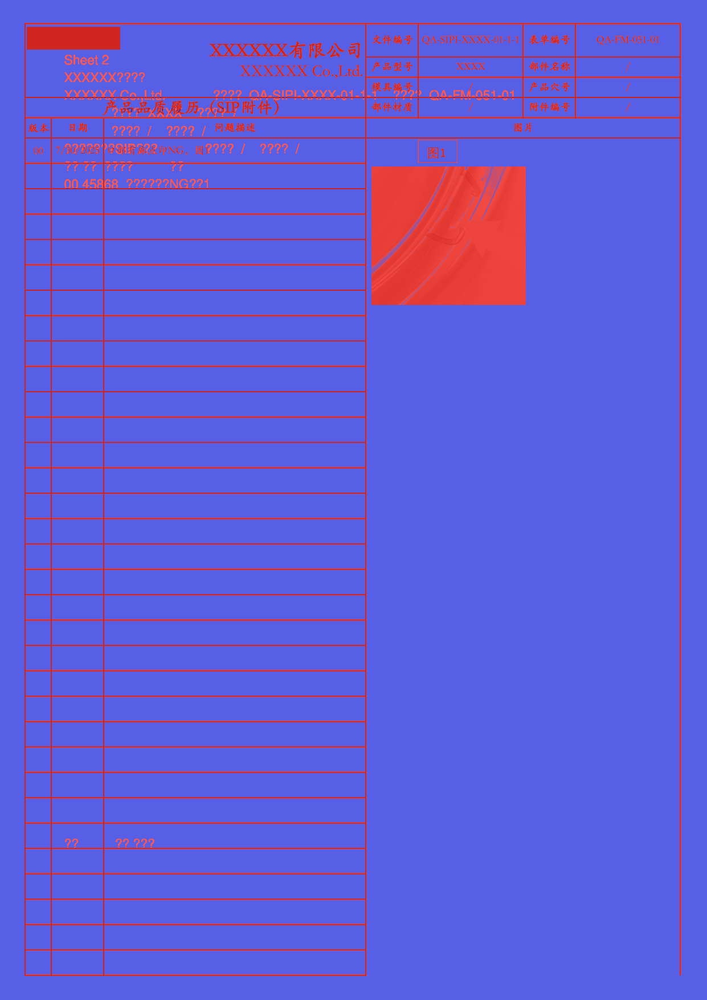</td>
  <td>changed: 195416 px (8.98%)<br>bbox: [42, 40, 1196, 1712]<br>mean abs RGB: 13.8327<br>RMSE RGB: 51.7867<br>threshold: 12, gain: 5.0</td>
</tr>
</table>

## Visual Comparison

Scores compare go MiniPdf against Microsoft 365 Excel Reference. LibreOffice is an auxiliary rendering and does not affect scores.

<table>
<tr><th>go MiniPdf</th><th>Microsoft 365 Excel Reference</th><th>LibreOffice</th></tr>
<tr>
  <td><b>Issue202609031340<br><small>format: xlsx | case: Issue202609031340 | scope: go-issue-xlsx</small></b></td>
  <td colspan="2">Issue202609031340 <span style="color:#f85149">⬤</span> 40.5%</td>
</tr>
<tr>
  <td>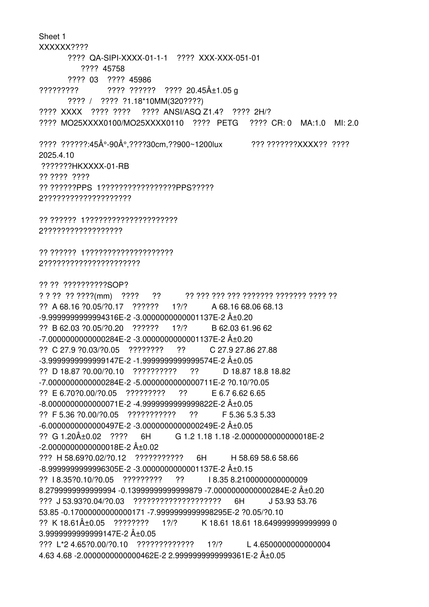</td>
  <td></td>
  <td>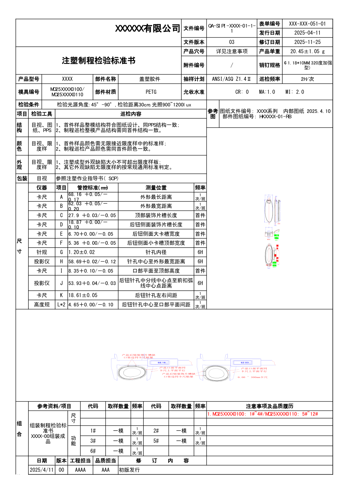</td>
</tr>
<tr>
  <td>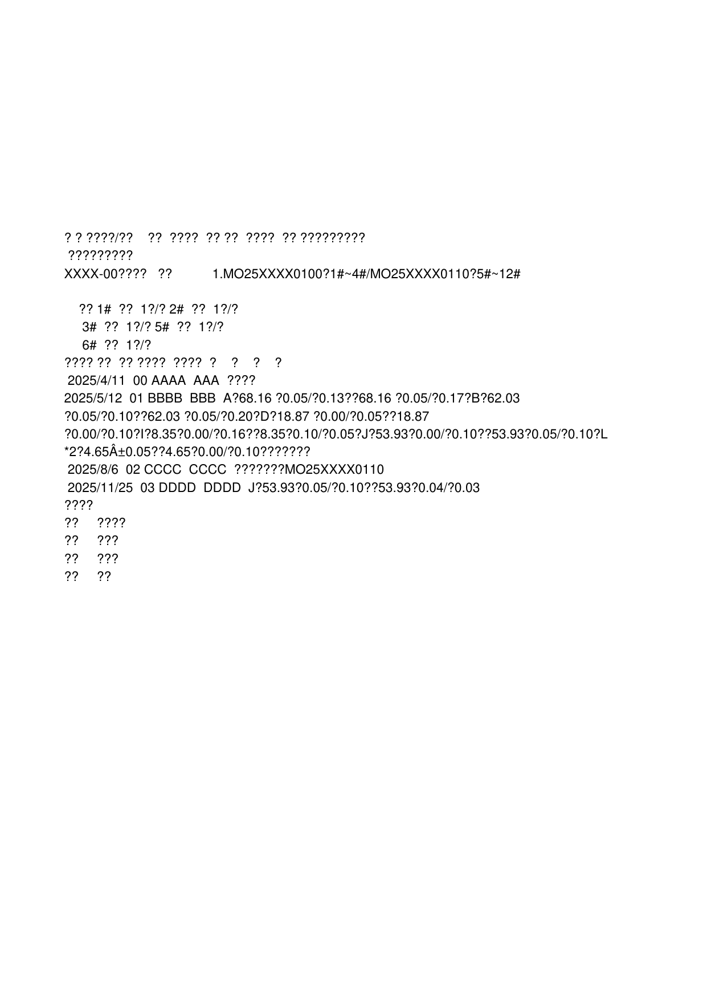</td>
  <td></td>
  <td>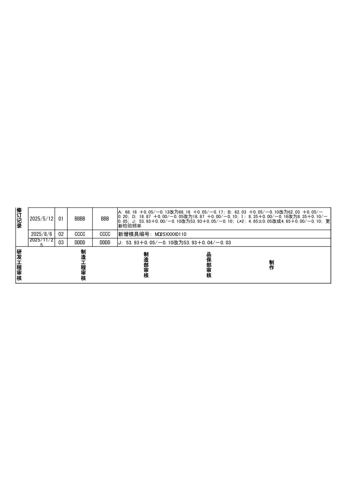</td>
</tr>
<tr>
  <td>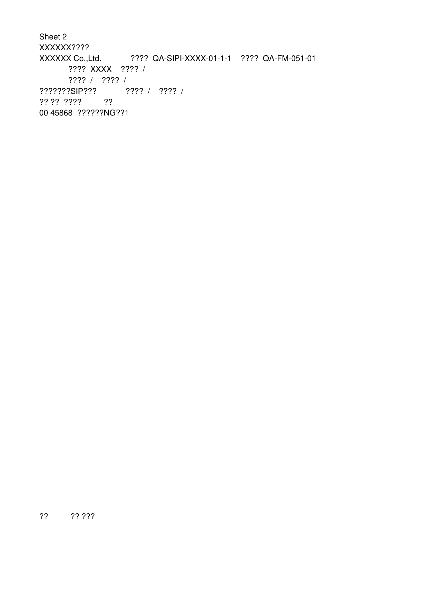</td>
  <td></td>
  <td>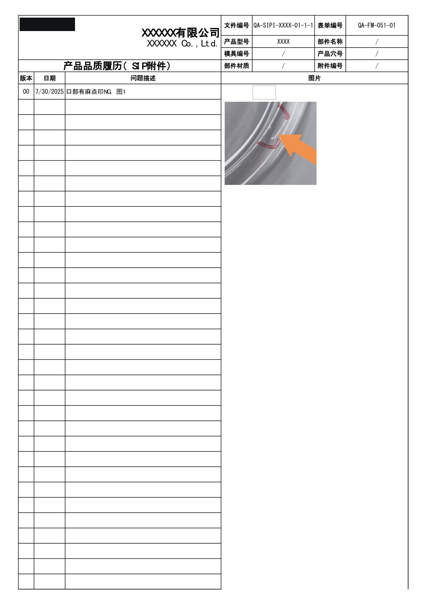</td>
</tr>
<tr>
  <td><i>missing</i></td>
  <td></td>
  <td>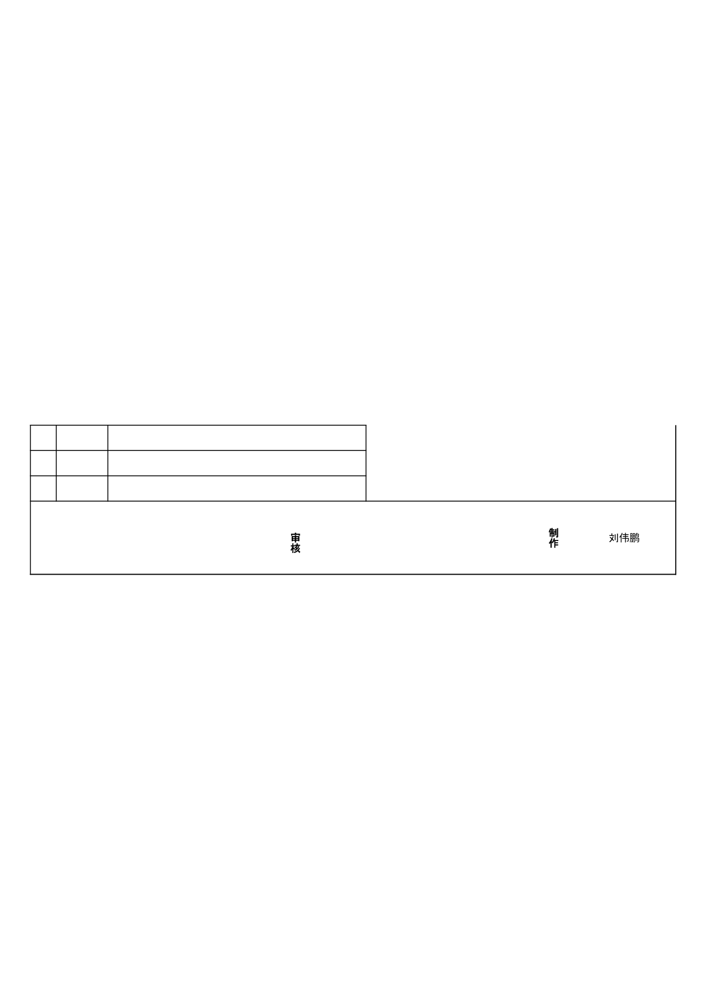</td>
</tr>
</table>

## Detailed Results

### Issue202609031340

- **Case Metadata:** format: xlsx | case: Issue202609031340 | scope: go-issue-xlsx
- **Source:** tests/Issue_Files/xlsx/Issue202609031340.xlsx
- **Text Similarity:** 0.175
- **Visual Average:** 0.5866
- **Overall Score:** 0.4046
- **Pages:** MiniPdf=3, Reference=4
- **File Size:** MiniPdf=12125 bytes, Reference=346206 bytes

<details><summary>Text Diff</summary>

```diff
--- minipdf/Issue202609031340.pdf
+++ reference/Issue202609031340.pdf
@@ -1,75 +1,113 @@
-Sheet 1

-XXXXXX????

-????  QA-SIPI-XXXX-01-1-1    ????  XXX-XXX-051-01

-????  45758

-????  03    ????  45986

-?????????             ????  ??????    ????  20.45±1.05 g

-????  /    ????  ?1.18*10MM(320????)

-????  XXXX    ????  ????     ????  ANSI/ASQ Z1.4?    ????  2H/?

-????  MO25XXXX0100/MO25XXXX0110    ????   PETG     ????  CR: 0    MA:1.0    MI: 2.0

-????  ??????:45°-90°,????30cm,??900~1200lux             ??? ???????XXXX??  ????

-2025.4.10

-???????HKXXXX-01-RB

-?? ????  ????

-?? ??????PPS  1?????????????????PPS?????

-2????????????????????

-?? ??????  1?????????????????????

-2??????????????????

-?? ??????  1????????????????????

-2??????????????????????

-?? ??  ??????????SOP?

-? ? ??  ?? ????(mm)    ????      ??           ?? ??? ??? ??? ??????? ??????? ???? ??

-??  A 68.16 ?0.05/?0.17    ??????      1?/?           A 68.16 68.06 68.13

--9.9999999999994316E-2 -3.0000000000001137E-2 ±0.20

-??  B 62.03 ?0.05/?0.20    ??????      1?/?           B 62.03 61.96 62

--7.0000000000000284E-2 -3.0000000000001137E-2 ±0.20

-??  C 27.9 ?0.03/?0.05    ????????      ??           C 27.9 27.86 27.88

--3.9999999999999147E-2 -1.9999999999999574E-2 ±0.05

-??  D 18.87 ?0.00/?0.10    ??????????      ??           D 18.87 18.8 18.82

--7.0000000000000284E-2 -5.0000000000000711E-2 ?0.10/?0.05

-??  E 6.70?0.00/?0.05    ?????????      ??           E 6.7 6.62 6.65

--8.0000000000000071E-2 -4.9999999999999822E-2 ±0.05

-??  F 5.36 ?0.00/?0.05    ???????????      ??           F 5.36 5.3 5.33

--6.0000000000000497E-2 -3.0000000000000249E-2 ±0.05

-??  G 1.20±0.02    ????      6H           G 1.2 1.18 1.18 -2.0000000000000018E-2

--2.0000000000000018E-2 ±0.02

-???  H 58.69?0.02/?0.12    ???????????      6H           H 58.69 58.6 58.66

--8.9999999999996305E-2 -3.0000000000001137E-2 ±0.15

-??  I 8.35?0.10/?0.05    ?????????      ??           I 8.35 8.2100000000000009

-8.2799999999999994 -0.13999999999999879 -7.0000000000000284E-2 ±0.20

-???  J 53.93?0.04/?0.03    ????????????????????      6H           J 53.93 53.76

-53.85 -0.17000000000000171 -7.9999999999998295E-2 ?0.05/?0.10

-??  K 18.61±0.05    ????????      1?/?           K 18.61 18.61 18.649999999999999 0

-3.9999999999999147E-2 ±0.05

-???  L*2 4.65?0.00/?0.10    ?????????????      1?/?           L 4.6500000000000004

-4.63 4.68 -2.0000000000000462E-2 2.9999999999999361E-2 ±0.05

+表单编号 XXX-XXX-051-01

+XXXXXX有限公司 文件编号QA-SIPI-XXXX-01-1-1

+发行日期 2025-04-11

+文件版本 03 修订日期 2025-11-25

+产品穴号 详见注意事项 产品单重 20.45±1.05 g

+注塑制程检验标准书

+￠1.18*10MM(320度加强

+附件编号 / 销钉规格

+型)

+产品型号 XXXX 部件名称 盖塑胶件 抽样计划 ANSI/ASQ Z1.4Ⅱ 巡检频率 2H/次

+MO25XXXX0100/MO

+模具编号 部件材质 PETG 允收水准 CR: 0    MA:1.0    MI: 2.0

+25XXXX0110

+检验条件 检验光源角度:45°-90°,检验距离30cm,光照900~1200lux

+参考 图纸文件编号：XXXX系列  内部图纸 2025.4.10

+项目 检验工具 巡检内容

+图 部件图纸编号：HKXXXX-01-RB

+结 目视、图 1、首件样品整模结构符合图纸设计、同PPS结构一致；

+构 纸、PPS 2、制程巡检整模产品结构需同首件结构一致。

+颜 目视、限 1、首件样品
... (2714 more characters)

```
</details>

## Improvement Suggestions

### ⚠ Low-Score Test Cases (below 0.8)

1. **Issue202609031340** (score: 0.4046)

Review the text diffs and visual comparisons above to identify specific rendering issues.
