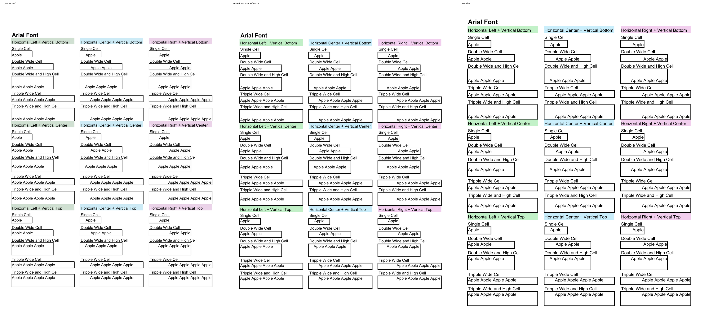
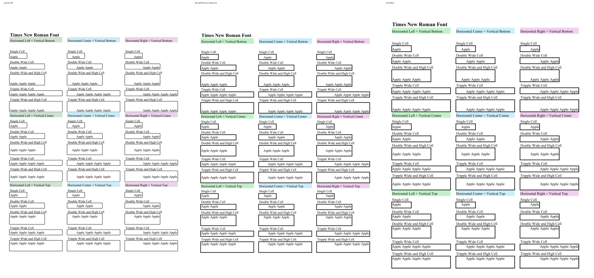
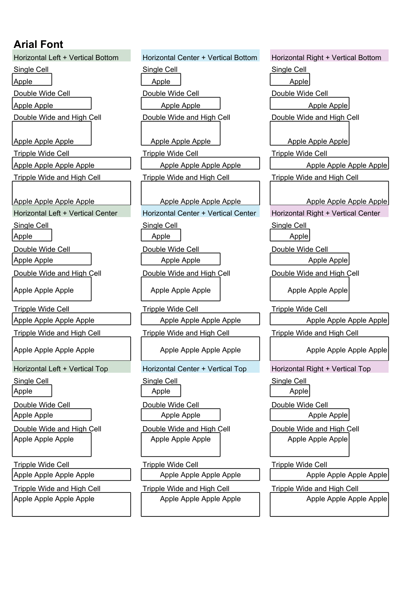
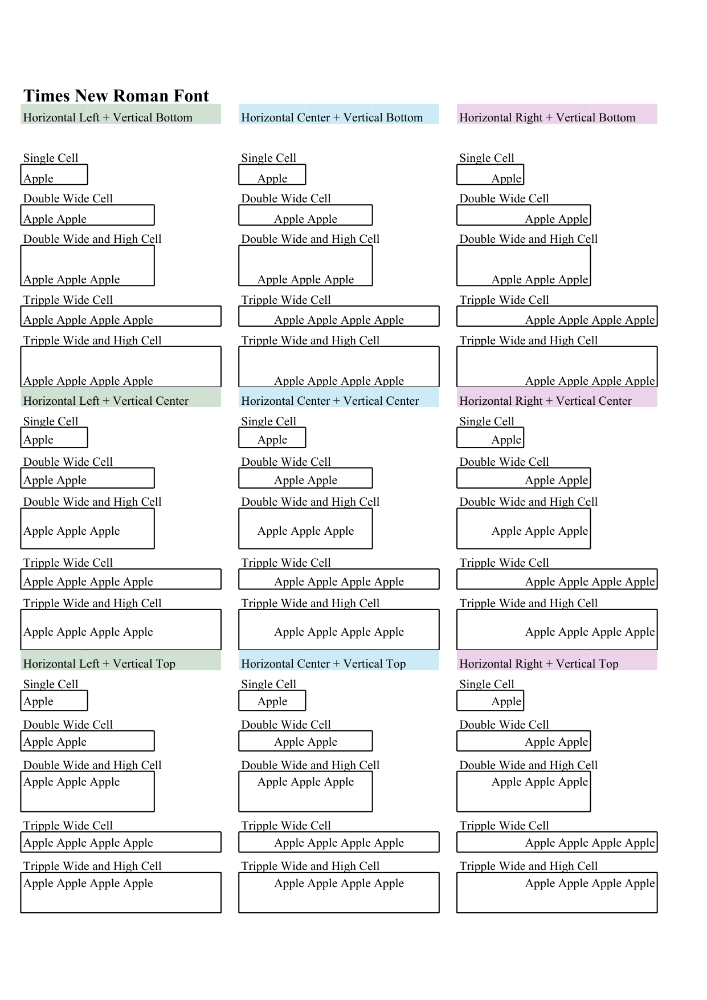

# java MiniPdf vs Microsoft 365 Excel Reference PDF Comparison Report

Generated: 2026-09-06T20:42:47.973286

## Summary

| # | Test Case | Valid | Text Sim | Visual Avg | Pages (M/R) | Overall |
|---|-----------|-------|----------|------------|-------------|--------|
| 1 | 🟢 XlsxIssue77_MergedCellAlignment | ✅ | 1.0 | 0.891 | 2/2 | **0.9564** |

**Average Overall Score: 0.9564**

## Labeled Side-by-Side Comparison

<table>
<tr><th>Case</th><th>Comparison</th></tr>
<tr>
  <td><b>XlsxIssue77_MergedCellAlignment <small>format: xlsx | case: XlsxIssue77_MergedCellAlignment | scope: java-issue-xlsx</small></b> Page 1</td>
  <td></td>
</tr>
<tr>
  <td><b>XlsxIssue77_MergedCellAlignment <small>format: xlsx | case: XlsxIssue77_MergedCellAlignment | scope: java-issue-xlsx</small></b> Page 2</td>
  <td></td>
</tr>
</table>

## Difference Heatmaps

Blue areas are below the configured difference threshold; red areas have stronger pixel differences. The reference rendering is retained as faint context.

<table>
<tr><th>Case</th><th>Heatmap</th><th>Metrics</th></tr>
<tr>
  <td><b>XlsxIssue77_MergedCellAlignment</b> Page 1</td>
  <td></td>
  <td>changed: 474317 px (21.79%) bbox: [35, 119, 1163, 1541] mean abs RGB: 33.3008 RMSE RGB: 82.9184 threshold: 12, gain: 5.0</td>
</tr>
<tr>
  <td><b>XlsxIssue77_MergedCellAlignment</b> Page 2</td>
  <td></td>
  <td>changed: 443109 px (20.36%) bbox: [35, 156, 1163, 1612] mean abs RGB: 30.2766 RMSE RGB: 78.5097 threshold: 12, gain: 5.0</td>
</tr>
</table>

## Visual Comparison

Scores compare java MiniPdf against Microsoft 365 Excel Reference. LibreOffice is an auxiliary rendering and does not affect scores.

<table>
<tr><th>java MiniPdf</th><th>Microsoft 365 Excel Reference</th><th>LibreOffice</th></tr>
<tr>
  <td><b>XlsxIssue77_MergedCellAlignment <small>format: xlsx | case: XlsxIssue77_MergedCellAlignment | scope: java-issue-xlsx</small></b></td>
  <td colspan="2">XlsxIssue77_MergedCellAlignment ⬤ 95.6%</td>
</tr>
<tr>
  <td></td>
  <td></td>
  <td></td>
</tr>
<tr>
  <td></td>
  <td></td>
  <td></td>
</tr>
</table>

## Detailed Results

### XlsxIssue77_MergedCellAlignment

- **Case Metadata:** format: xlsx | case: XlsxIssue77_MergedCellAlignment | scope: java-issue-xlsx
- **Source:** tests/Issue_Files/xlsx/XlsxIssue77_MergedCellAlignment.xlsx
- **Text Similarity:** 1.0
- **Visual Average:** 0.891
- **Overall Score:** 0.9564
- **Pages:** MiniPdf=2, Reference=2
- **File Size:** MiniPdf=71248 bytes, Reference=172385 bytes

Text content: ✅ Identical

## Improvement Suggestions

All test cases scored 0.8 or above. 🎉
