# Rust MiniPdf vs Microsoft 365 Excel Reference PDF Comparison Report

Generated: 2026-08-24T14:10:30.335433

## Summary

| # | Test Case | Valid | Text Sim | Visual Avg | Pages (M/R) | Overall |
|---|-----------|-------|----------|------------|-------------|--------|
| 1 | 🟢 classic191_payroll_calculator | ✅ | 0.9456 | 0.9786 | 9/9 | **0.9697** |

**Average Overall Score: 0.9697**

## Labeled Side-by-Side Comparison

<table>
<tr><th>Case</th><th>Comparison</th></tr>
<tr>
  <td><b>classic191_payroll_calculator<br><small>format: xlsx | case: classic191_payroll_calculator | scope: rust-classic-xlsx</small></b><br>Page 1</td>
  <td>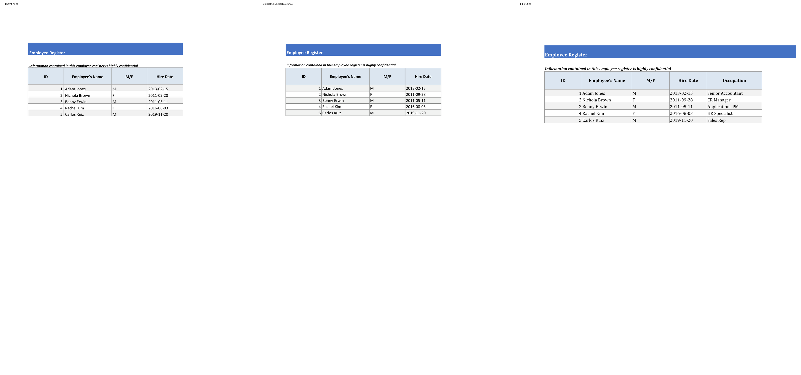</td>
</tr>
<tr>
  <td><b>classic191_payroll_calculator<br><small>format: xlsx | case: classic191_payroll_calculator | scope: rust-classic-xlsx</small></b><br>Page 2</td>
  <td>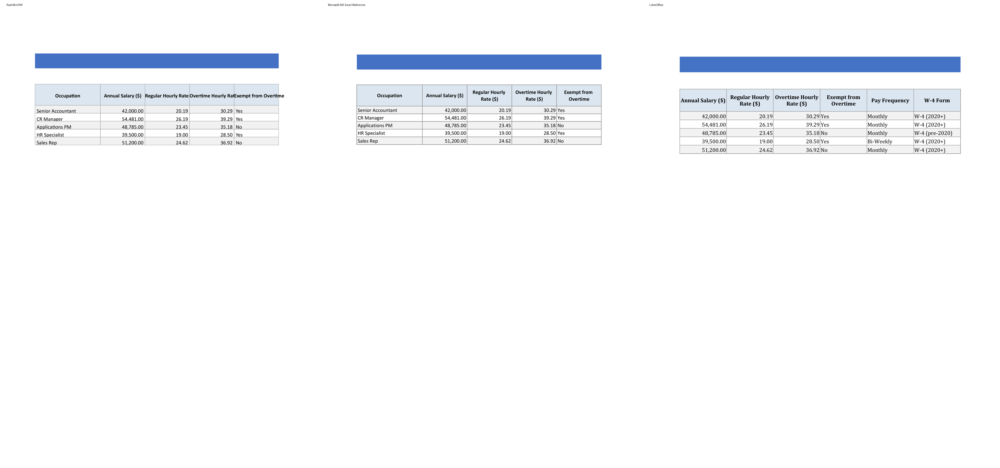</td>
</tr>
<tr>
  <td><b>classic191_payroll_calculator<br><small>format: xlsx | case: classic191_payroll_calculator | scope: rust-classic-xlsx</small></b><br>Page 3</td>
  <td>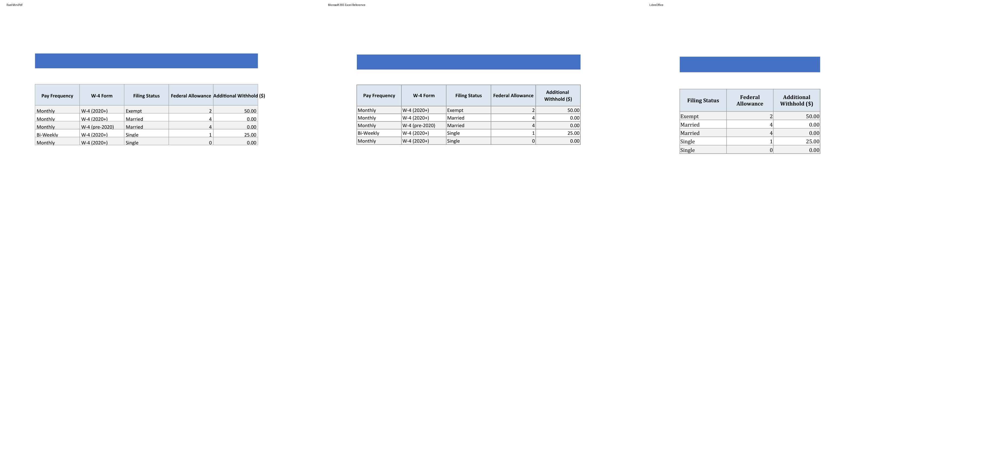</td>
</tr>
<tr>
  <td><b>classic191_payroll_calculator<br><small>format: xlsx | case: classic191_payroll_calculator | scope: rust-classic-xlsx</small></b><br>Page 4</td>
  <td>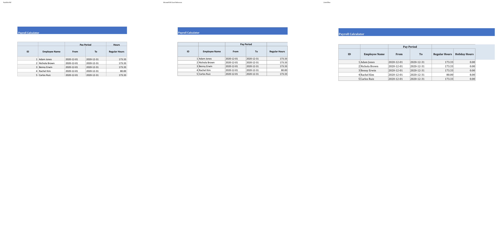</td>
</tr>
<tr>
  <td><b>classic191_payroll_calculator<br><small>format: xlsx | case: classic191_payroll_calculator | scope: rust-classic-xlsx</small></b><br>Page 5</td>
  <td>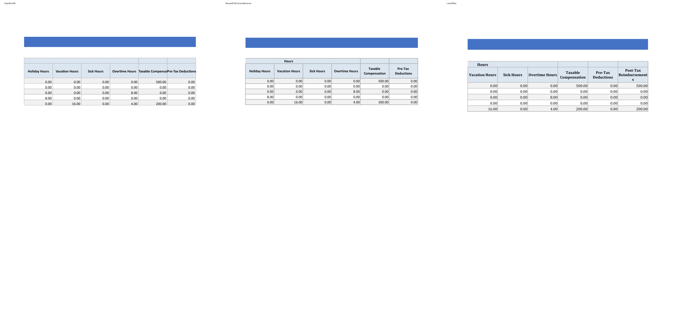</td>
</tr>
<tr>
  <td><b>classic191_payroll_calculator<br><small>format: xlsx | case: classic191_payroll_calculator | scope: rust-classic-xlsx</small></b><br>Page 6</td>
  <td>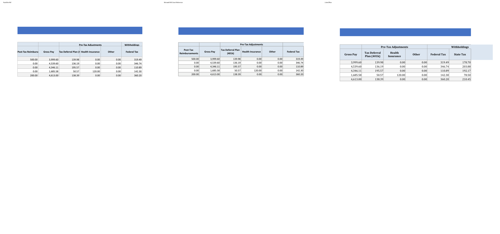</td>
</tr>
<tr>
  <td><b>classic191_payroll_calculator<br><small>format: xlsx | case: classic191_payroll_calculator | scope: rust-classic-xlsx</small></b><br>Page 7</td>
  <td>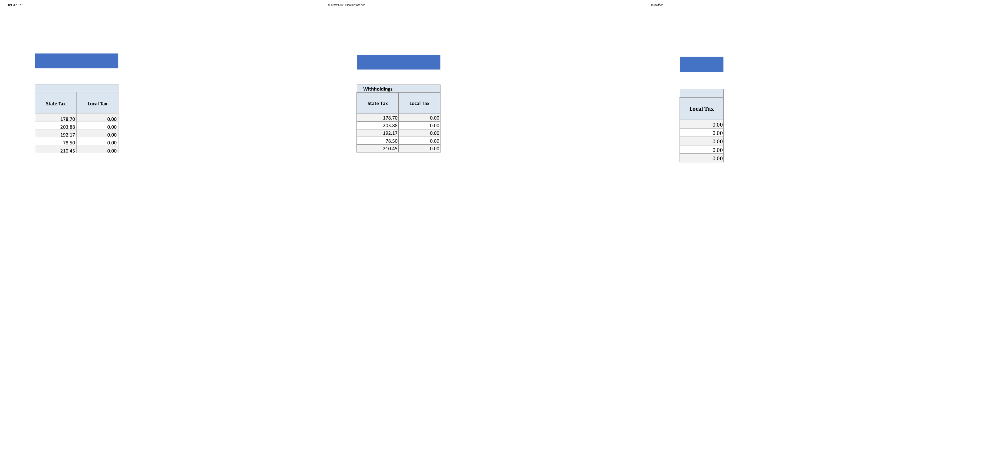</td>
</tr>
<tr>
  <td><b>classic191_payroll_calculator<br><small>format: xlsx | case: classic191_payroll_calculator | scope: rust-classic-xlsx</small></b><br>Page 8</td>
  <td>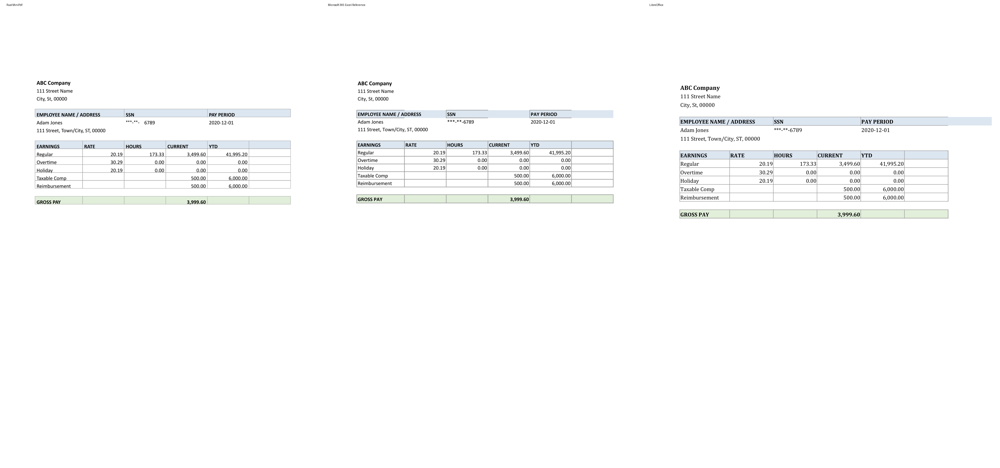</td>
</tr>
<tr>
  <td><b>classic191_payroll_calculator<br><small>format: xlsx | case: classic191_payroll_calculator | scope: rust-classic-xlsx</small></b><br>Page 9</td>
  <td>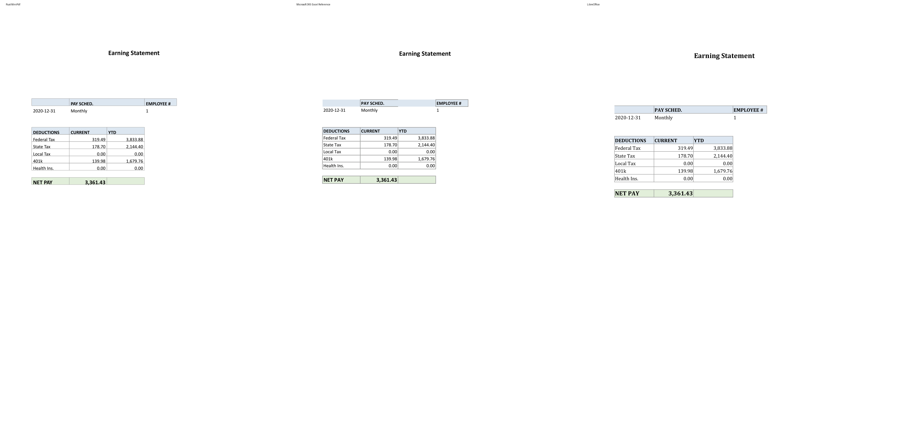</td>
</tr>
</table>

## Difference Heatmaps

Blue areas are below the configured difference threshold; red areas have stronger pixel differences. The reference rendering is retained as faint context.

<table>
<tr><th>Case</th><th>Heatmap</th><th>Metrics</th></tr>
<tr>
  <td><b>classic191_payroll_calculator</b><br>Page 1</td>
  <td></td>
  <td>changed: 54000 px (2.48%)<br>bbox: [112, 146, 879, 508]<br>mean abs RGB: 2.5135<br>RMSE RGB: 19.3931<br>threshold: 12, gain: 5.0</td>
</tr>
<tr>
  <td><b>classic191_payroll_calculator</b><br>Page 2</td>
  <td></td>
  <td>changed: 70315 px (3.23%)<br>bbox: [112, 146, 1094, 509]<br>mean abs RGB: 3.4222<br>RMSE RGB: 23.0062<br>threshold: 12, gain: 5.0</td>
</tr>
<tr>
  <td><b>classic191_payroll_calculator</b><br>Page 3</td>
  <td></td>
  <td>changed: 61984 px (2.85%)<br>bbox: [112, 146, 1018, 509]<br>mean abs RGB: 2.9178<br>RMSE RGB: 20.8932<br>threshold: 12, gain: 5.0</td>
</tr>
<tr>
  <td><b>classic191_payroll_calculator</b><br>Page 4</td>
  <td></td>
  <td>changed: 67488 px (3.10%)<br>bbox: [112, 146, 985, 540]<br>mean abs RGB: 3.0522<br>RMSE RGB: 21.1361<br>threshold: 12, gain: 5.0</td>
</tr>
<tr>
  <td><b>classic191_payroll_calculator</b><br>Page 5</td>
  <td></td>
  <td>changed: 72371 px (3.32%)<br>bbox: [112, 146, 1102, 540]<br>mean abs RGB: 3.282<br>RMSE RGB: 21.8857<br>threshold: 12, gain: 5.0</td>
</tr>
<tr>
  <td><b>classic191_payroll_calculator</b><br>Page 6</td>
  <td></td>
  <td>changed: 78491 px (3.61%)<br>bbox: [112, 146, 1102, 540]<br>mean abs RGB: 3.7008<br>RMSE RGB: 23.6935<br>threshold: 12, gain: 5.0</td>
</tr>
<tr>
  <td><b>classic191_payroll_calculator</b><br>Page 7</td>
  <td></td>
  <td>changed: 24311 px (1.12%)<br>bbox: [112, 146, 444, 540]<br>mean abs RGB: 1.0727<br>RMSE RGB: 12.3629<br>threshold: 12, gain: 5.0</td>
</tr>
<tr>
  <td><b>classic191_payroll_calculator</b><br>Page 8</td>
  <td>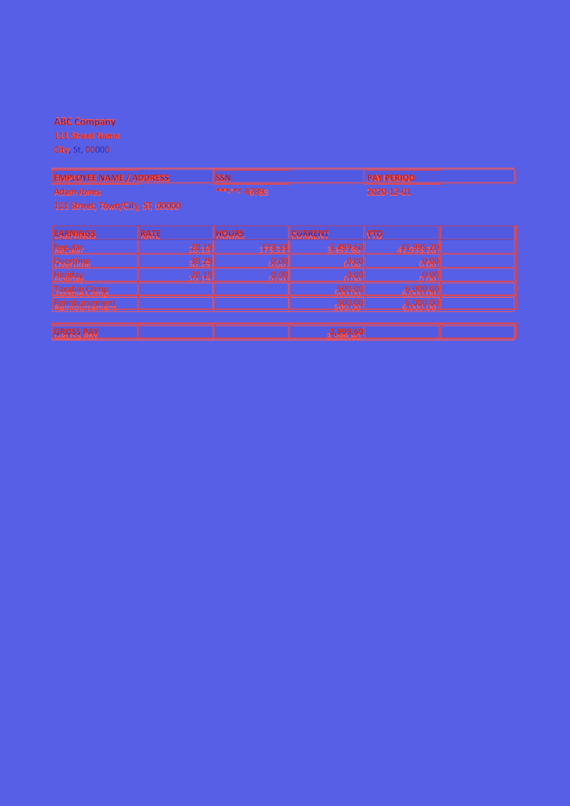</td>
  <td>changed: 92962 px (4.27%)<br>bbox: [112, 255, 1126, 742]<br>mean abs RGB: 3.9656<br>RMSE RGB: 24.1765<br>threshold: 12, gain: 5.0</td>
</tr>
<tr>
  <td><b>classic191_payroll_calculator</b><br>Page 9</td>
  <td>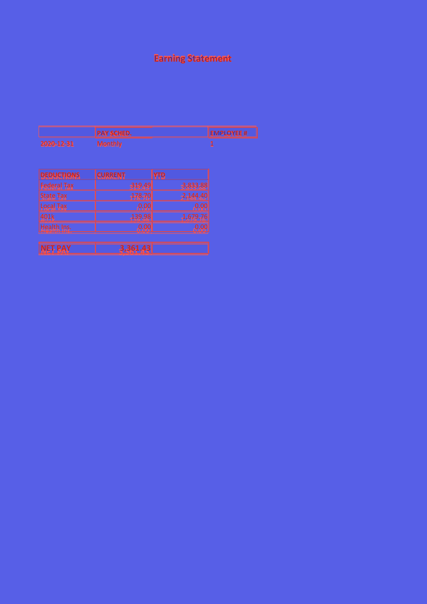</td>
  <td>changed: 53311 px (2.45%)<br>bbox: [112, 156, 750, 743]<br>mean abs RGB: 2.4521<br>RMSE RGB: 19.6928<br>threshold: 12, gain: 5.0</td>
</tr>
</table>

## Visual Comparison

Scores compare Rust MiniPdf against Microsoft 365 Excel Reference. LibreOffice is an auxiliary rendering and does not affect scores.

<table>
<tr><th>Rust MiniPdf</th><th>Microsoft 365 Excel Reference</th><th>LibreOffice</th></tr>
<tr>
  <td><b>classic191_payroll_calculator<br><small>format: xlsx | case: classic191_payroll_calculator | scope: rust-classic-xlsx</small></b></td>
  <td colspan="2">classic191_payroll_calculator <span style="color:#3fb950">⬤</span> 97.0%</td>
</tr>
<tr>
  <td></td>
  <td></td>
  <td></td>
</tr>
<tr>
  <td></td>
  <td></td>
  <td></td>
</tr>
<tr>
  <td>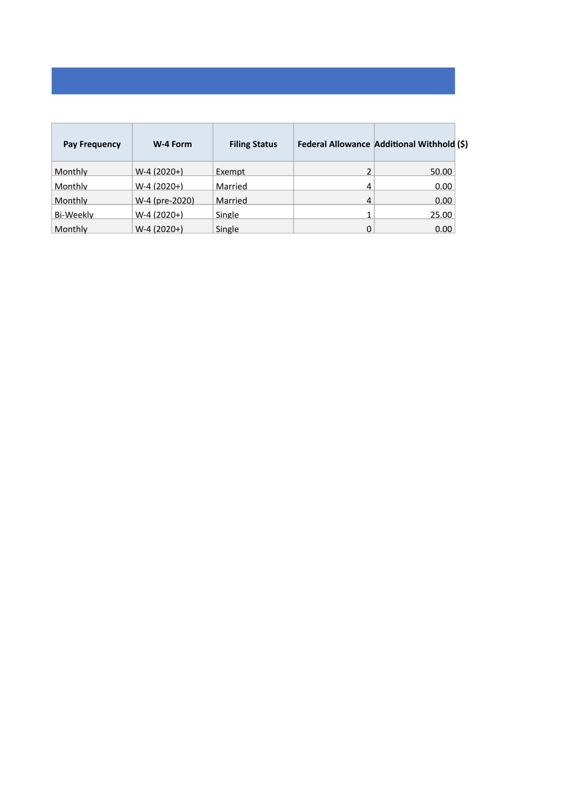</td>
  <td></td>
  <td></td>
</tr>
<tr>
  <td>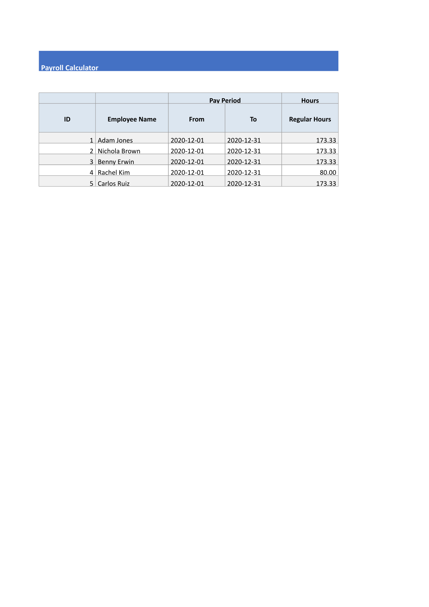</td>
  <td></td>
  <td></td>
</tr>
<tr>
  <td>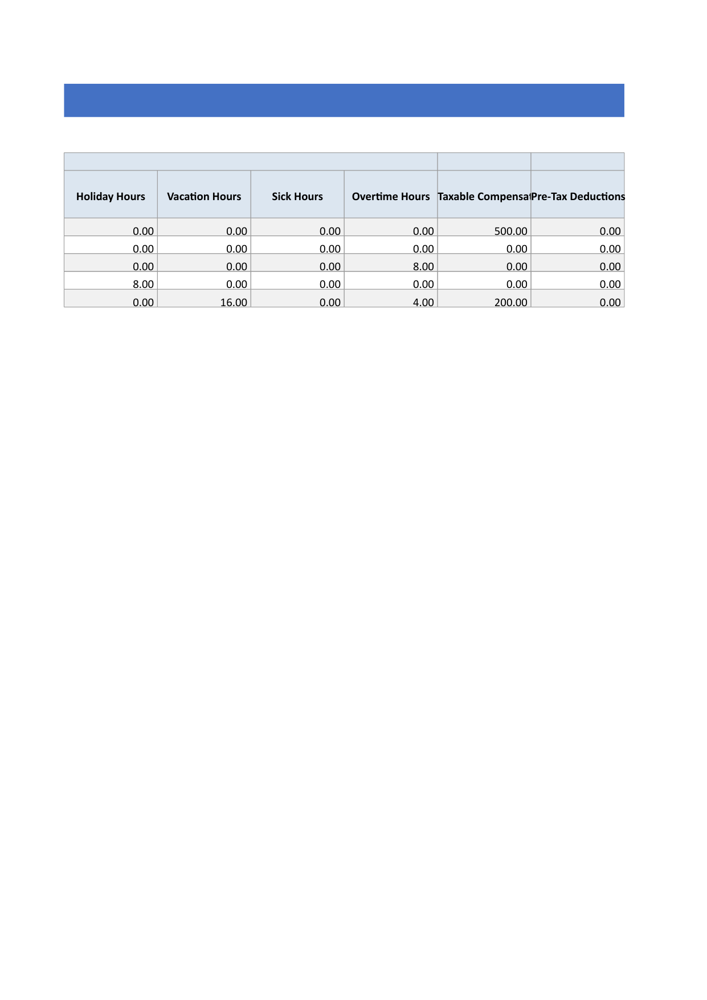</td>
  <td></td>
  <td></td>
</tr>
<tr>
  <td>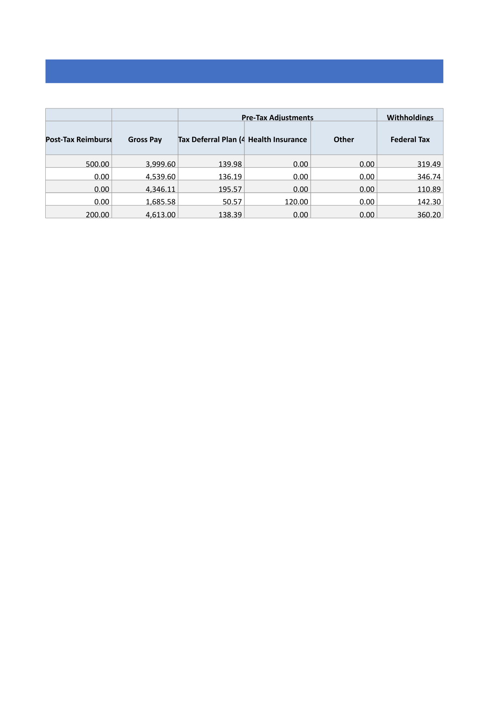</td>
  <td></td>
  <td></td>
</tr>
<tr>
  <td></td>
  <td></td>
  <td></td>
</tr>
<tr>
  <td>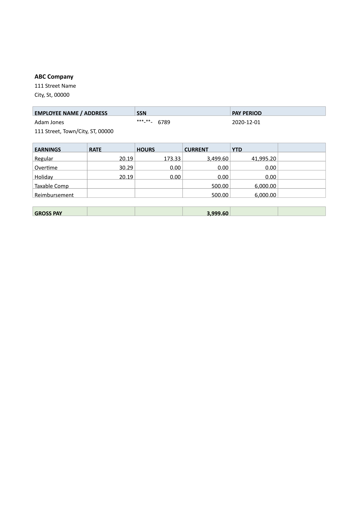</td>
  <td></td>
  <td></td>
</tr>
<tr>
  <td>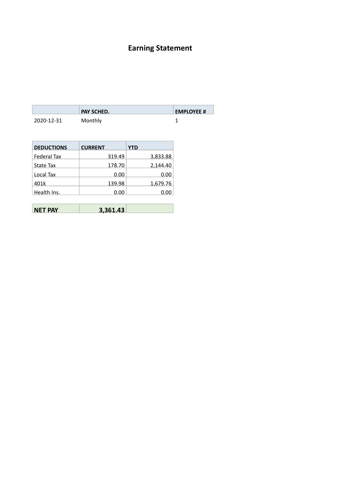</td>
  <td></td>
  <td></td>
</tr>
</table>

## Detailed Results

### classic191_payroll_calculator

- **Case Metadata:** format: xlsx | case: classic191_payroll_calculator | scope: rust-classic-xlsx
- **Source:** tests/MiniPdf.Scripts/output/classic191_payroll_calculator.xlsx
- **Text Similarity:** 0.9456
- **Visual Average:** 0.9786
- **Overall Score:** 0.9697
- **Pages:** MiniPdf=9, Reference=9
- **File Size:** MiniPdf=369196 bytes, Reference=189742 bytes

<details><summary>Text Diff</summary>

```diff
--- minipdf/classic191_payroll_calculator.pdf
+++ reference/classic191_payroll_calculator.pdf
@@ -7,14 +7,18 @@
 4 Rachel Kim F 2016-08-03

 5 Carlos Ruiz M 2019-11-20

 ---PAGE---

-Occupation Annual Salary ($) Regular Hourly Rate Overtime Hourly RatExempt from Overtime

+Regular Hourly Overtime Hourly Exempt from

+Occupation Annual Salary ($)

+Rate ($) Rate ($) Overtime

 Senior Accountant 42,000.00 20.19 30.29 Yes

 CR Manager 54,481.00 26.19 39.29 Yes

 Applications PM 48,785.00 23.45 35.18 No

 HR Specialist 39,500.00 19.00 28.50 Yes

 Sales Rep 51,200.00 24.62 36.92 No

 ---PAGE---

-Pay Frequency W-4 Form Filing Status Federal Allowance Additional Withhold ($)

+Additional

+Pay Frequency W-4 Form Filing Status Federal Allowance

+Withhold ($)

 Monthly W-4 (2020+) Exempt 2 50.00

 Monthly W-4 (2020+) Married 4 0.00

 Monthly W-4 (pre-2020) Married 4 0.00

@@ -22,7 +26,7 @@
 Monthly W-4 (2020+) Single 0 0.00

 ---PAGE---

 Payroll Calculator

-Pay Period Hours

+Pay Period

 ID Employee Name From To Regular Hours

 1 Adam Jones 2020-12-01 2020-12-31 173.33

 2 Nichola Brown 2020-12-01 2020-12-31 173.33

@@ -30,21 +34,27 @@
 4 Rachel Kim 2020-12-01 2020-12-31 80.00

 5 Carlos Ruiz 2020-12-01 2020-12-31 173.33

 ---PAGE---

-Holiday Hours Vacation Hours Sick Hours Overtime Hours Taxable CompensatiPre-Tax Deductions

+Hours

+Taxable Pre-Tax

+Holiday Hours Vacation Hours Sick Hours Overtime Hours

+Compensation Deductions

 0.00 0.00 0.00 0.00 500.00 0.00

 0.00 0.00 0.00 0.00 0.00 0.00

 0.00 0.00 0.00 8.00 0.00 0.00

 8.00 0.00 0.00 0.00 0.00 0.00

 0.00 16.00 0.00 4.00 200.00 0.00

 ---PAGE---

-Pre-Tax Adjustments Withholdings

-Post-Tax Reimburse Gross Pay Tax Deferral Plan (4 Health Insurance Other Federal Tax

+Pre-Tax Adjustments

+Post-Tax Tax Deferral Plan

+Gross Pay Health Insurance Other Federal Tax

+Reimbursements (401k)

 500.00 3,999.60 139.98 0.00 0.00 319.49

 0.00 4,539.60 136.19 0.00 0.00 346.74

 0.00 4,346.11 195.57 0.00 0.00 110.89

 0.00 1,685.58 50.57 120.00 0.00 142.30

 200.00 4,613.00 138.39 0.00 0.00 360.20

 ---PAGE---

+Withholdings

 State Tax Local Tax

 178.70 0.00

 203.88 0.00

@@ -56,7 +66,7 @@
 111 Street Name

 City, St, 00000

 EMPLOYEE NAME / ADDRESS SSN PAY PERIOD

-Adam Jones ***-**- 6789 2020-12-01

+Adam Jones ***-**-6789 2020-12-01

 111 Street, Town/City, ST, 00000

 EARNINGS RATE HOURS CURRENT YTD

 Regular 20.19 173.33 3,499.60 41,995.20

```
</details>

## Improvement Suggestions

All test cases scored 0.8 or above. 🎉
