# Rust MiniPdf vs Microsoft 365 Excel Reference PDF Comparison Report

Generated: 2026-08-25T00:54:01.842537

## Summary

| # | Test Case | Valid | Text Sim | Visual Avg | Pages (M/R) | Overall |
|---|-----------|-------|----------|------------|-------------|--------|
| 1 | 🟢 XlsxIssue77_Template1 | ✅ | 0.9969 | 0.9389 | 6/6 | **0.9743** |

**Average Overall Score: 0.9743**

## Labeled Side-by-Side Comparison

<table>
<tr><th>Case</th><th>Comparison</th></tr>
<tr>
  <td><b>XlsxIssue77_Template1<br><small>format: xlsx | case: XlsxIssue77_Template1 | scope: rust-issue-xlsx</small></b><br>Page 1</td>
  <td></td>
</tr>
<tr>
  <td><b>XlsxIssue77_Template1<br><small>format: xlsx | case: XlsxIssue77_Template1 | scope: rust-issue-xlsx</small></b><br>Page 2</td>
  <td>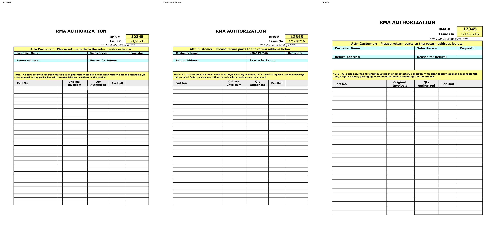</td>
</tr>
<tr>
  <td><b>XlsxIssue77_Template1<br><small>format: xlsx | case: XlsxIssue77_Template1 | scope: rust-issue-xlsx</small></b><br>Page 3</td>
  <td></td>
</tr>
<tr>
  <td><b>XlsxIssue77_Template1<br><small>format: xlsx | case: XlsxIssue77_Template1 | scope: rust-issue-xlsx</small></b><br>Page 4</td>
  <td>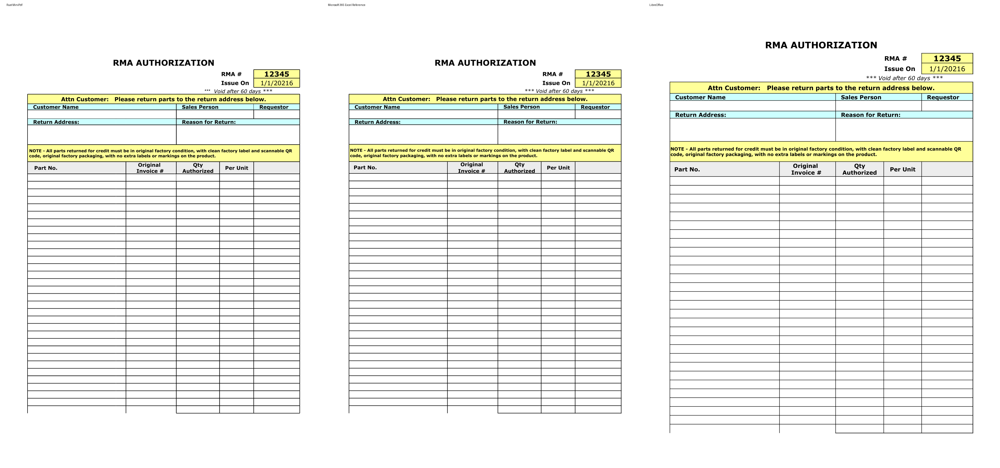</td>
</tr>
<tr>
  <td><b>XlsxIssue77_Template1<br><small>format: xlsx | case: XlsxIssue77_Template1 | scope: rust-issue-xlsx</small></b><br>Page 5</td>
  <td></td>
</tr>
<tr>
  <td><b>XlsxIssue77_Template1<br><small>format: xlsx | case: XlsxIssue77_Template1 | scope: rust-issue-xlsx</small></b><br>Page 6</td>
  <td>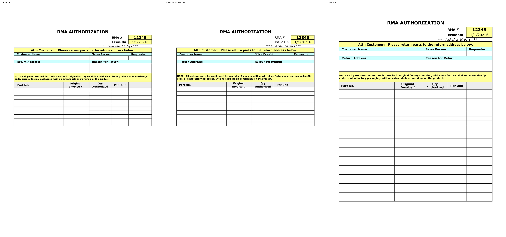</td>
</tr>
</table>

## Difference Heatmaps

Blue areas are below the configured difference threshold; red areas have stronger pixel differences. The reference rendering is retained as faint context.

<table>
<tr><th>Case</th><th>Heatmap</th><th>Metrics</th></tr>
<tr>
  <td><b>XlsxIssue77_Template1</b><br>Page 1</td>
  <td>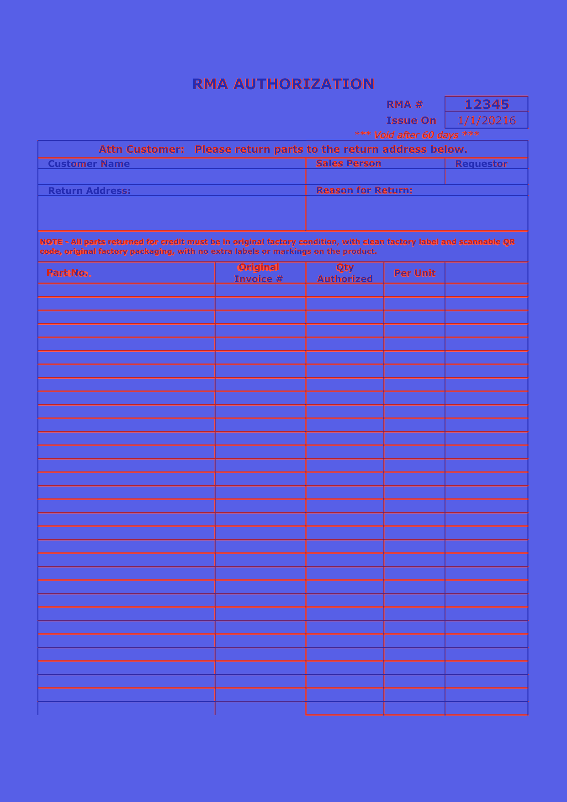</td>
  <td>changed: 279334 px (12.83%)<br>bbox: [82, 171, 1157, 1569]<br>mean abs RGB: 20.3669<br>RMSE RGB: 64.0095<br>threshold: 12, gain: 5.0</td>
</tr>
<tr>
  <td><b>XlsxIssue77_Template1</b><br>Page 2</td>
  <td>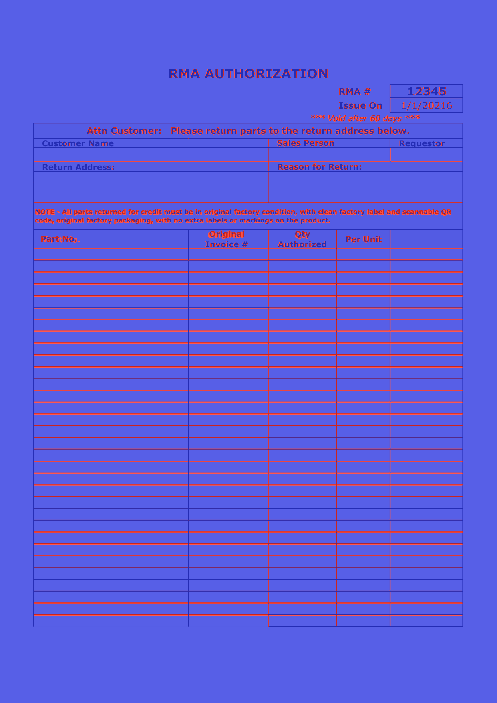</td>
  <td>changed: 279328 px (12.83%)<br>bbox: [82, 171, 1157, 1569]<br>mean abs RGB: 20.3367<br>RMSE RGB: 63.8803<br>threshold: 12, gain: 5.0</td>
</tr>
<tr>
  <td><b>XlsxIssue77_Template1</b><br>Page 3</td>
  <td>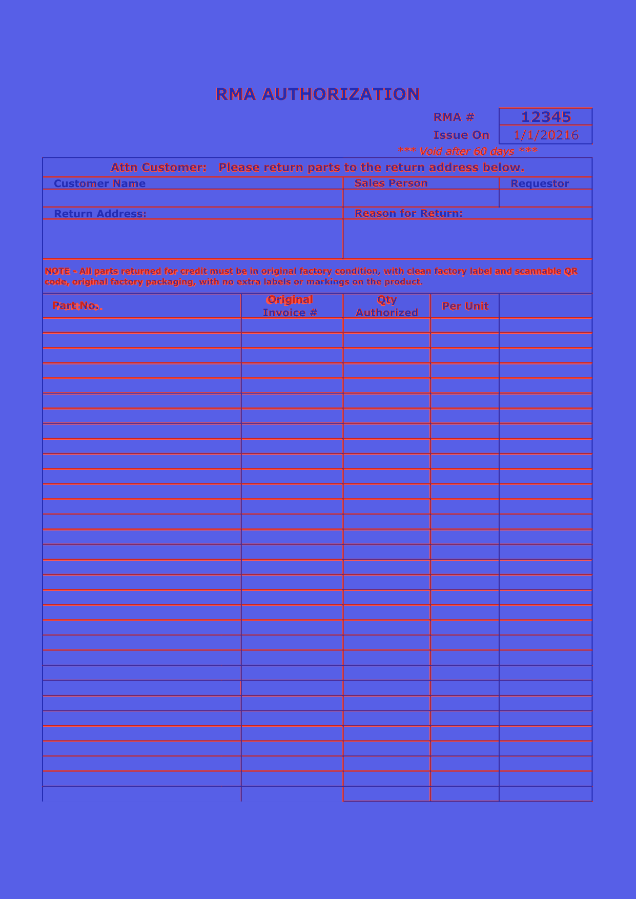</td>
  <td>changed: 279321 px (12.83%)<br>bbox: [82, 171, 1157, 1569]<br>mean abs RGB: 20.2564<br>RMSE RGB: 63.7043<br>threshold: 12, gain: 5.0</td>
</tr>
<tr>
  <td><b>XlsxIssue77_Template1</b><br>Page 4</td>
  <td></td>
  <td>changed: 279322 px (12.83%)<br>bbox: [82, 171, 1157, 1569]<br>mean abs RGB: 20.2684<br>RMSE RGB: 63.727<br>threshold: 12, gain: 5.0</td>
</tr>
<tr>
  <td><b>XlsxIssue77_Template1</b><br>Page 5</td>
  <td>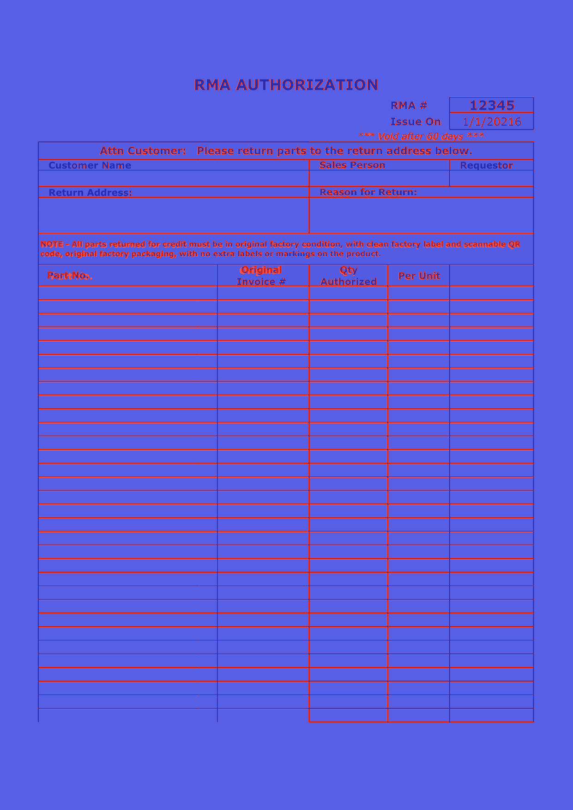</td>
  <td>changed: 279321 px (12.83%)<br>bbox: [82, 171, 1157, 1569]<br>mean abs RGB: 20.2508<br>RMSE RGB: 63.6956<br>threshold: 12, gain: 5.0</td>
</tr>
<tr>
  <td><b>XlsxIssue77_Template1</b><br>Page 6</td>
  <td>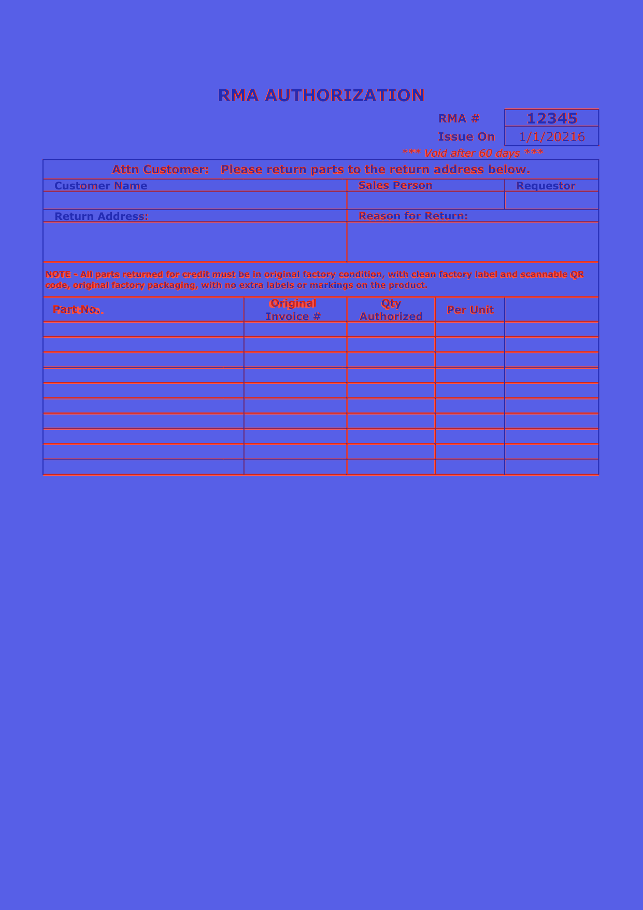</td>
  <td>changed: 154476 px (7.10%)<br>bbox: [82, 171, 1157, 919]<br>mean abs RGB: 11.3203<br>RMSE RGB: 47.5455<br>threshold: 12, gain: 5.0</td>
</tr>
</table>

## Visual Comparison

Scores compare Rust MiniPdf against Microsoft 365 Excel Reference. LibreOffice is an auxiliary rendering and does not affect scores.

<table>
<tr><th>Rust MiniPdf</th><th>Microsoft 365 Excel Reference</th><th>LibreOffice</th></tr>
<tr>
  <td><b>XlsxIssue77_Template1<br><small>format: xlsx | case: XlsxIssue77_Template1 | scope: rust-issue-xlsx</small></b></td>
  <td colspan="2">XlsxIssue77_Template1 <span style="color:#3fb950">⬤</span> 97.4%</td>
</tr>
<tr>
  <td>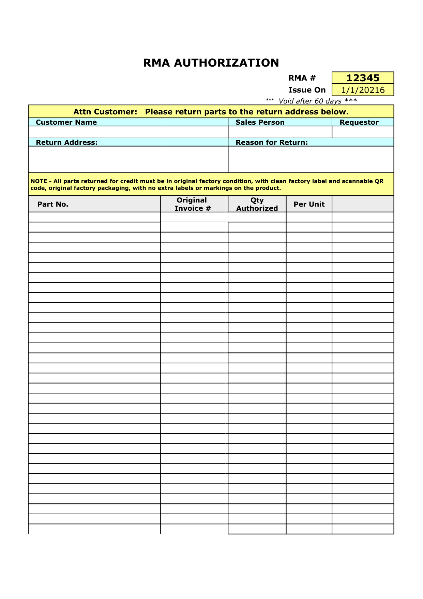</td>
  <td></td>
  <td>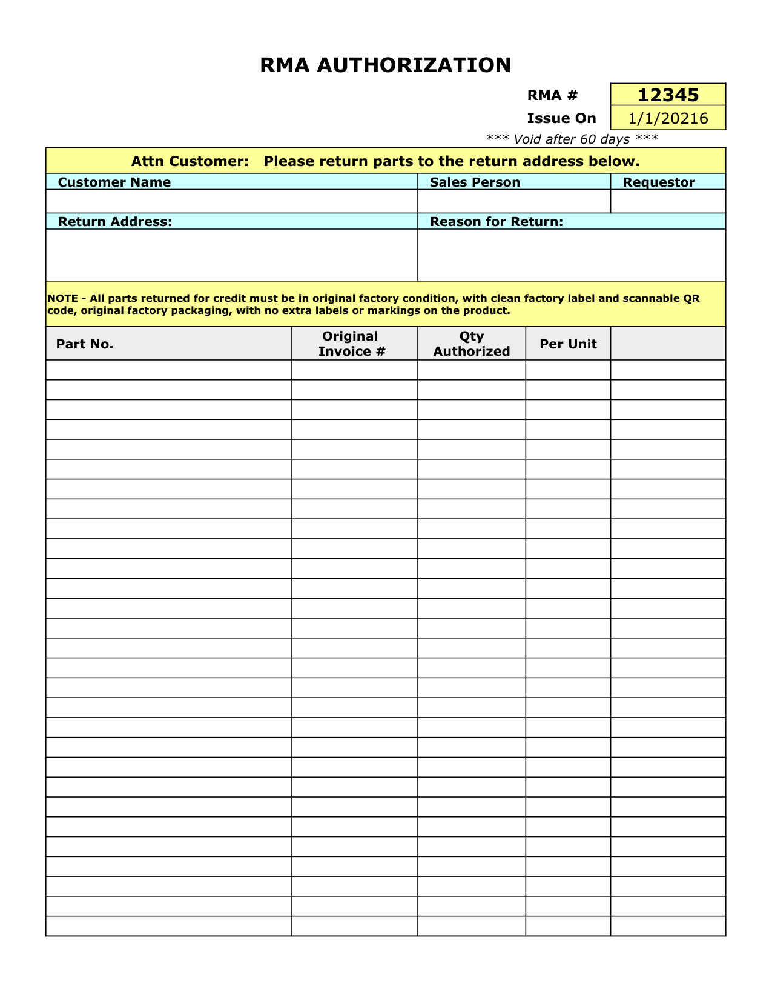</td>
</tr>
<tr>
  <td>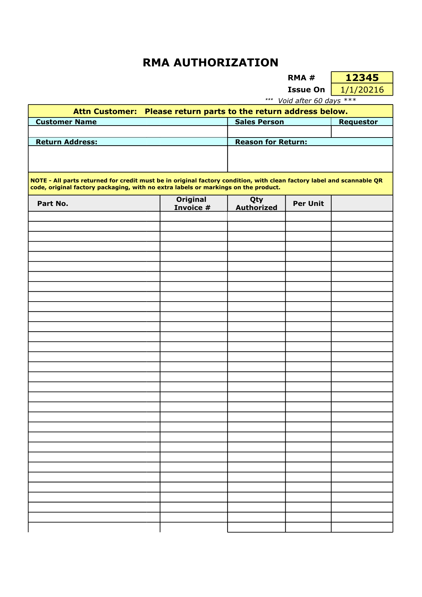</td>
  <td></td>
  <td></td>
</tr>
<tr>
  <td>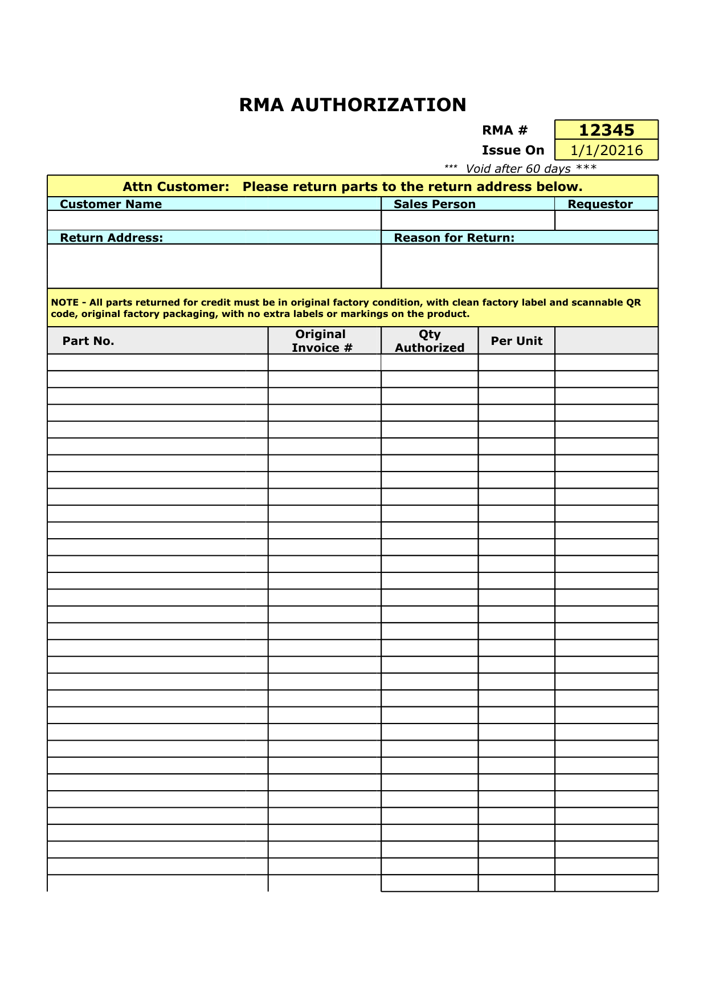</td>
  <td></td>
  <td></td>
</tr>
<tr>
  <td>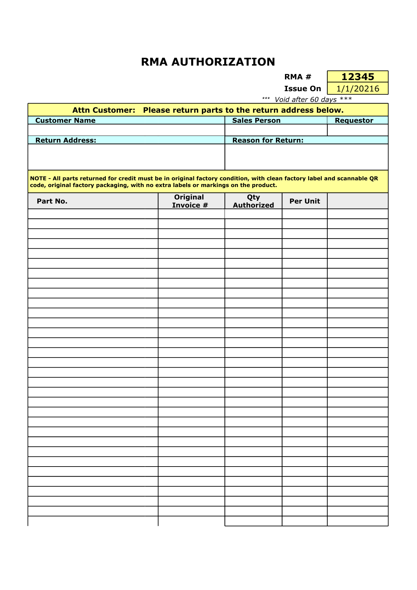</td>
  <td></td>
  <td></td>
</tr>
<tr>
  <td></td>
  <td></td>
  <td></td>
</tr>
<tr>
  <td>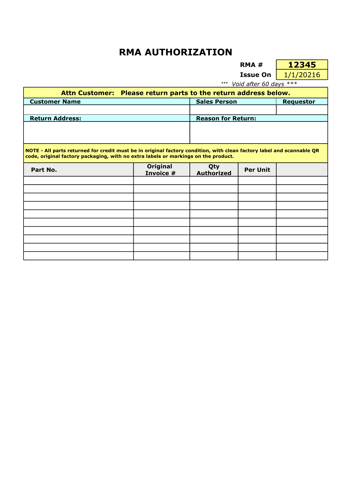</td>
  <td>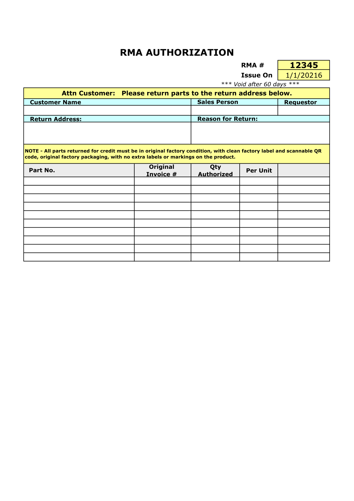</td>
  <td></td>
</tr>
</table>

## Detailed Results

### XlsxIssue77_Template1

- **Case Metadata:** format: xlsx | case: XlsxIssue77_Template1 | scope: rust-issue-xlsx
- **Source:** tests/Issue_Files/xlsx/XlsxIssue77_Template1.xlsx
- **Text Similarity:** 0.9969
- **Visual Average:** 0.9389
- **Overall Score:** 0.9743
- **Pages:** MiniPdf=6, Reference=6
- **File Size:** MiniPdf=613804 bytes, Reference=64464 bytes

<details><summary>Text Diff</summary>

```diff
--- minipdf/XlsxIssue77_Template1.pdf
+++ reference/XlsxIssue77_Template1.pdf
@@ -6,8 +6,8 @@
 Attn Customer:   Please return parts to the return address below.

 Customer Name Sales Person Requestor

 Return Address: Reason for Return:

-NOTE - All parts returned for credit must be in original factory condition, with clean factory label and scannable QR code, original factory packaging, with no ext

-ra labels or markings on the product.

+NOTE - All parts returned for credit must be in original factory condition, with clean factory label and scannable QR

+code, original factory packaging, with no extra labels or markings on the product.

 Original Qty

 Part No. Per Unit

 Invoice # Authorized

@@ -20,8 +20,8 @@
 Attn Customer:   Please return parts to the return address below.

 Customer Name Sales Person Requestor

 Return Address: Reason for Return:

-NOTE - All parts returned for credit must be in original factory condition, with clean factory label and scannable QR code, original factory packaging, with no ext

-ra labels or markings on the product.

+NOTE - All parts returned for credit must be in original factory condition, with clean factory label and scannable QR

+code, original factory packaging, with no extra labels or markings on the product.

 Original Qty

 Part No. Per Unit

 Invoice # Authorized

@@ -34,8 +34,8 @@
 Attn Customer:   Please return parts to the return address below.

 Customer Name Sales Person Requestor

 Return Address: Reason for Return:

-NOTE - All parts returned for credit must be in original factory condition, with clean factory label and scannable QR code, original factory packaging, with no ext

-ra labels or markings on the product.

+NOTE - All parts returned for credit must be in original factory condition, with clean factory label and scannable QR

+code, original factory packaging, with no extra labels or markings on the product.

 Original Qty

 Part No. Per Unit

 Invoice # Authorized

@@ -48,8 +48,8 @@
 Attn Customer:   Please return parts to the return address below.

 Customer Name Sales Person Requestor

 Return Address: Reason for Return:

-NOTE - All parts returned for credit must be in original factory condition, with clean factory label and scannable QR code, original factory packaging, with no ext

-ra labels or markings on the product.

+NOTE - All parts returned for credit must be in original factory condition, with clean factory label and scannable QR

+code, original factory packaging, with no extra labels or markings on the product.

 Original Qty

 Part No. Per Unit

 Invoice # Authorized

@@ -62,8 +62,8 @@
 Attn Customer:   Please return parts to the return address below.

 Customer Name Sales Person Requestor

 Return Address: Reason for Return:

-NOTE - All parts returned for credit must be in original factory condition, with clean factory label and scannable QR code, original factory packaging, with no ext

-ra labels or markings on the product.

+NOTE - All parts returned for c
... (860 more characters)

```
</details>

## Improvement Suggestions

All test cases scored 0.8 or above. 🎉
