# MiniPdf vs Reference PDF Comparison Report

Generated: 2026-08-23T12:37:15.079722

## Summary

| # | Test Case | Valid | Text Sim | Visual Avg | Pages (M/R) | Overall |
|---|-----------|-------|----------|------------|-------------|--------|
| 1 | 🔴 Academic Achievement Summary Table | ✅ | 0.2857 | 0.7282 | 3/2 | **0.5056** |
| 2 | 🔴 AcademicAchievement_temp | ✅ | 0.2857 | 0.7282 | 3/2 | **0.5056** |
| 3 | 🔴 Business expense budget1 | ✅ | 0.4633 | 0.5287 | 2/4 | **0.4968** |
| 4 | 🔴 Business expenses budget2 | ✅ | 0.2299 | 0.0996 | 8/4 | **0.2318** |
| 5 | 🔴 Business plan checklist with SWOT analysis1 | ✅ | 0.7612 | 0.215 | 1/1 | **0.5905** |
| 6 | 🟡 Event budget1 | ✅ | 0.9061 | 0.7938 | 4/5 | **0.78** |
| 7 | 🔴 Expense report basic1 | ✅ | 0.7218 | 0.0874 | 2/1 | **0.4237** |
| 8 | 🔴 Grocery list1 | ✅ | 0.5867 | 0.3194 | 1/1 | **0.5624** |
| 9 | 🔴 payroll-calculator_f | ✅ | 0.4677 | 0.1296 | 53/27 | **0.3389** |
| 10 | 🔴 PO_anonymized | ✅ | 0.5614 | 0.295 | 72/8 | **0.4426** |
| 11 | 🔴 Simple invoice1 | ✅ | 0.9001 | 0.0991 | 1/1 | **0.5997** |
| 12 | 🔴 Small business cash flow forecast1 | ✅ | 0.3115 | 0.269 | 6/5 | **0.3322** |
| 13 | 🔴 Wedding_timeline_planner1_copy | ✅ | 0.5871 | 0.6931 | 3/5 | **0.6121** |
| 14 | 🔴 Weekly schedule planner1 | ✅ | 0.3876 | 0.174 | 5/1 | **0.3246** |
| 15 | 🔴 XlsxIssue75 | ✅ | 0.4778 | 0.838 | 86/144 | **0.6263** |
| 16 | 🟡 XlsxIssue77_MergedCellAlignment | ✅ | 0.9724 | 0.7471 | 4/2 | **0.7878** |
| 17 | 🔴 XlsxIssue77_Template1 | ✅ | 0.8489 | 0.5299 | 1/6 | **0.6515** |
| 18 | 🔴 XlsxIssue77_Template2_Workaround | ✅ | 0.8489 | 0.5257 | 1/6 | **0.6498** |
| 19 | 🔴 XlsxIssue81_LayoutOptions | ✅ | 0.3221 | 0.7289 | 6/16 | **0.5204** |
| 20 | 🔴 XlsxIssue82_5mb | ✅ | 0.203 | 0.7283 | 419/766 | **0.4725** |
| 21 | 🔴 XlsxIssue82_SampleTestData5mb | ✅ | 0.4896 | 0.7883 | 466/1668 | **0.6112** |
| 22 | 🔴 XlsxIssue82_WideTable | ✅ | 0.7623 | 0.4935 | 7/13 | **0.6023** |

**Average Overall Score: 0.5304**

## Labeled Side-by-Side Comparison

<table>
<tr><th>Case</th><th>Comparison</th></tr>
<tr>
  <td><b>Academic Achievement Summary Table<br><small>format: xlsx | case: Academic Achievement Summary Table | scope: rust-issue-xlsx</small></b><br>Page 1</td>
  <td></td>
</tr>
<tr>
  <td><b>AcademicAchievement_temp<br><small>format: xlsx | case: AcademicAchievement_temp | scope: rust-issue-xlsx</small></b><br>Page 1</td>
  <td>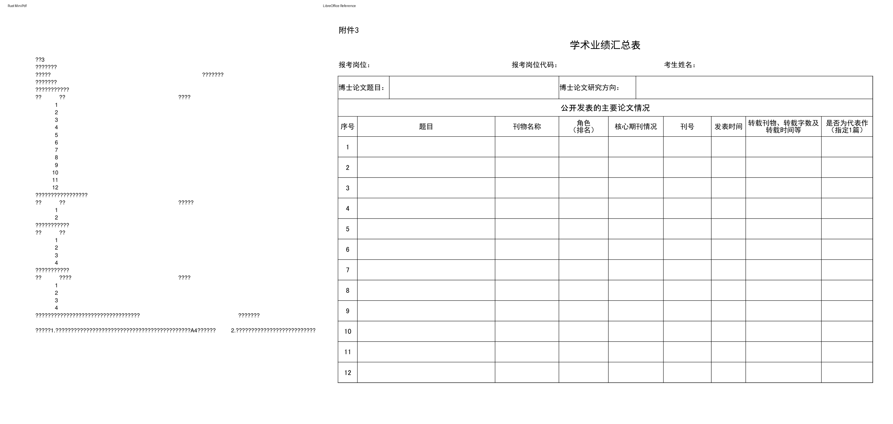</td>
</tr>
<tr>
  <td><b>Business expense budget1<br><small>format: xlsx | case: Business expense budget1 | scope: rust-issue-xlsx</small></b><br>Page 1</td>
  <td></td>
</tr>
<tr>
  <td><b>Business expenses budget2<br><small>format: xlsx | case: Business expenses budget2 | scope: rust-issue-xlsx</small></b><br>Page 1</td>
  <td></td>
</tr>
<tr>
  <td><b>Business plan checklist with SWOT analysis1<br><small>format: xlsx | case: Business plan checklist with SWOT analysis1 | scope: rust-issue-xlsx</small></b><br>Page 1</td>
  <td></td>
</tr>
<tr>
  <td><b>Event budget1<br><small>format: xlsx | case: Event budget1 | scope: rust-issue-xlsx</small></b><br>Page 1</td>
  <td></td>
</tr>
<tr>
  <td><b>Expense report basic1<br><small>format: xlsx | case: Expense report basic1 | scope: rust-issue-xlsx</small></b><br>Page 1</td>
  <td></td>
</tr>
<tr>
  <td><b>Grocery list1<br><small>format: xlsx | case: Grocery list1 | scope: rust-issue-xlsx</small></b><br>Page 1</td>
  <td></td>
</tr>
<tr>
  <td><b>payroll-calculator_f<br><small>format: xlsx | case: payroll-calculator_f | scope: rust-issue-xlsx</small></b><br>Page 1</td>
  <td>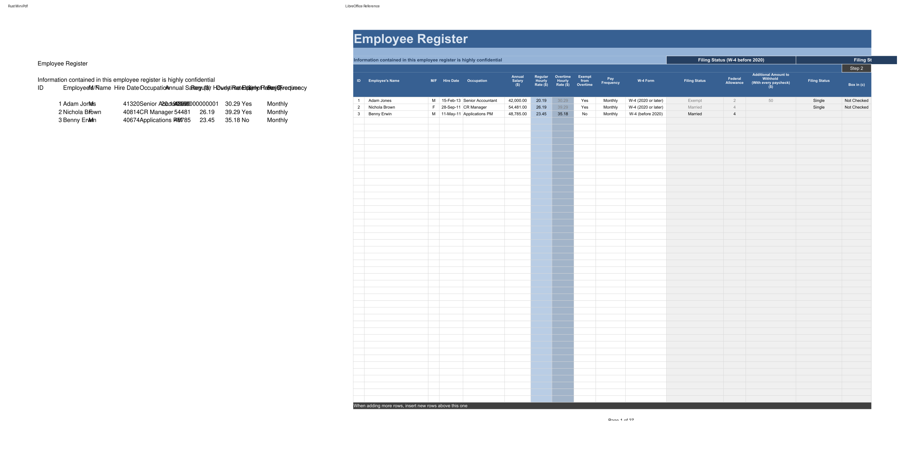</td>
</tr>
<tr>
  <td><b>PO_anonymized<br><small>format: xlsx | case: PO_anonymized | scope: rust-issue-xlsx</small></b><br>Page 1</td>
  <td>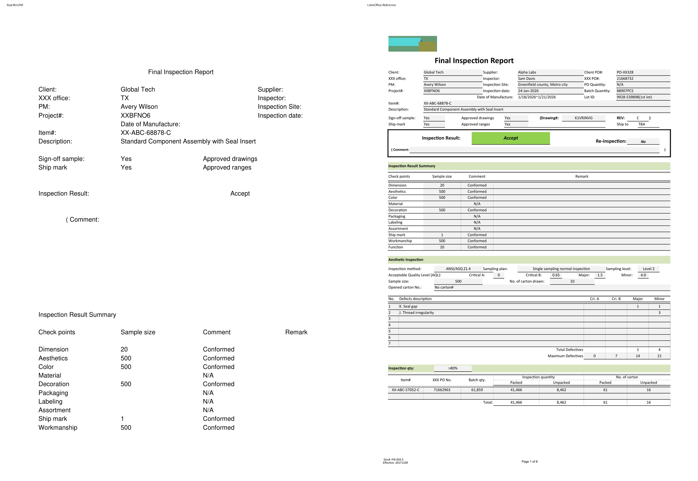</td>
</tr>
<tr>
  <td><b>Simple invoice1<br><small>format: xlsx | case: Simple invoice1 | scope: rust-issue-xlsx</small></b><br>Page 1</td>
  <td></td>
</tr>
<tr>
  <td><b>Small business cash flow forecast1<br><small>format: xlsx | case: Small business cash flow forecast1 | scope: rust-issue-xlsx</small></b><br>Page 1</td>
  <td></td>
</tr>
<tr>
  <td><b>Wedding_timeline_planner1_copy<br><small>format: xlsx | case: Wedding_timeline_planner1_copy | scope: rust-issue-xlsx</small></b><br>Page 1</td>
  <td>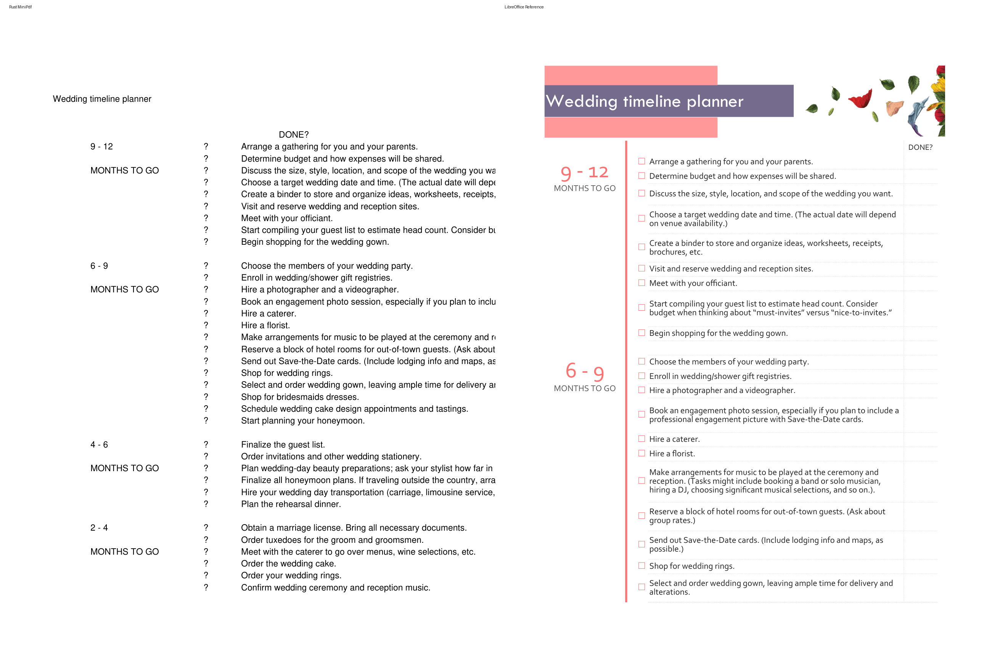</td>
</tr>
<tr>
  <td><b>Weekly schedule planner1<br><small>format: xlsx | case: Weekly schedule planner1 | scope: rust-issue-xlsx</small></b><br>Page 1</td>
  <td></td>
</tr>
<tr>
  <td><b>XlsxIssue75<br><small>format: xlsx | case: XlsxIssue75 | scope: rust-issue-xlsx</small></b><br>Page 1</td>
  <td>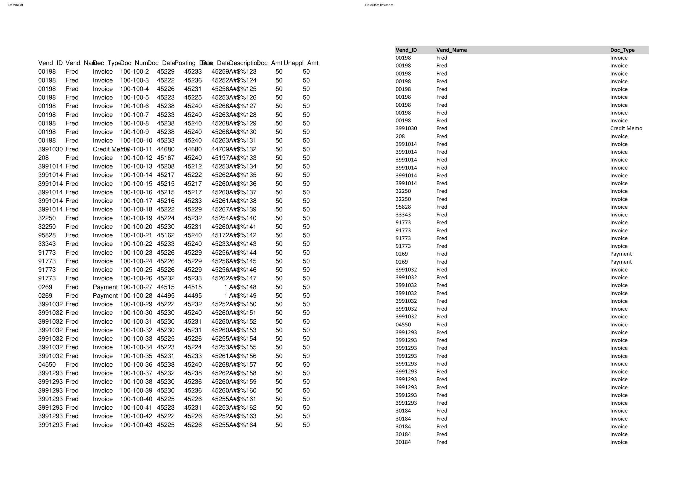</td>
</tr>
<tr>
  <td><b>XlsxIssue77_MergedCellAlignment<br><small>format: xlsx | case: XlsxIssue77_MergedCellAlignment | scope: rust-issue-xlsx</small></b><br>Page 1</td>
  <td>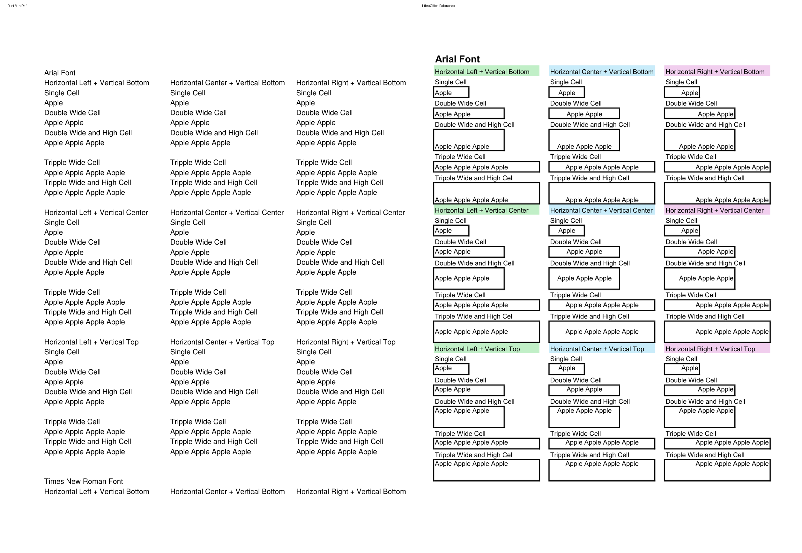</td>
</tr>
<tr>
  <td><b>XlsxIssue77_Template1<br><small>format: xlsx | case: XlsxIssue77_Template1 | scope: rust-issue-xlsx</small></b><br>Page 1</td>
  <td>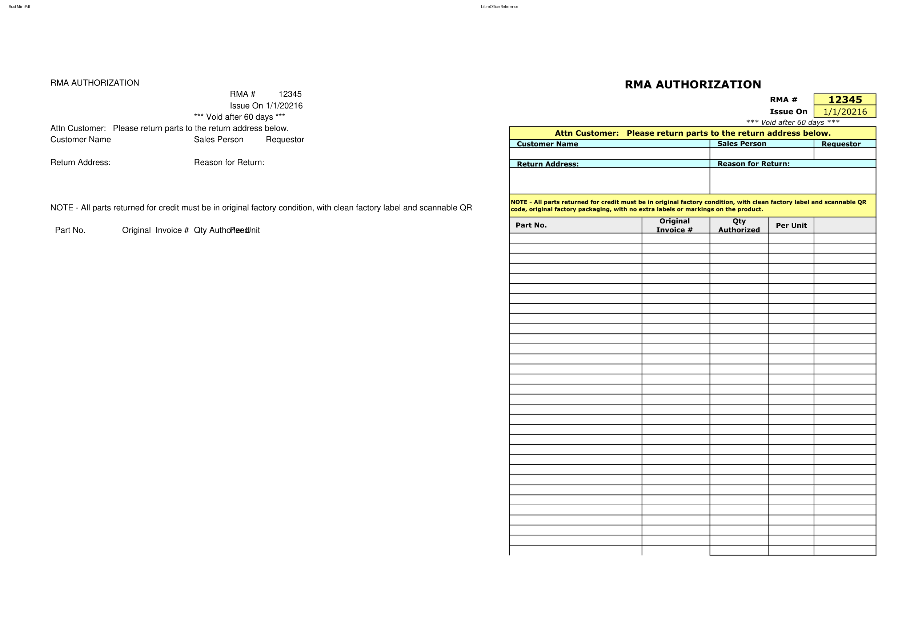</td>
</tr>
<tr>
  <td><b>XlsxIssue77_Template2_Workaround<br><small>format: xlsx | case: XlsxIssue77_Template2_Workaround | scope: rust-issue-xlsx</small></b><br>Page 1</td>
  <td>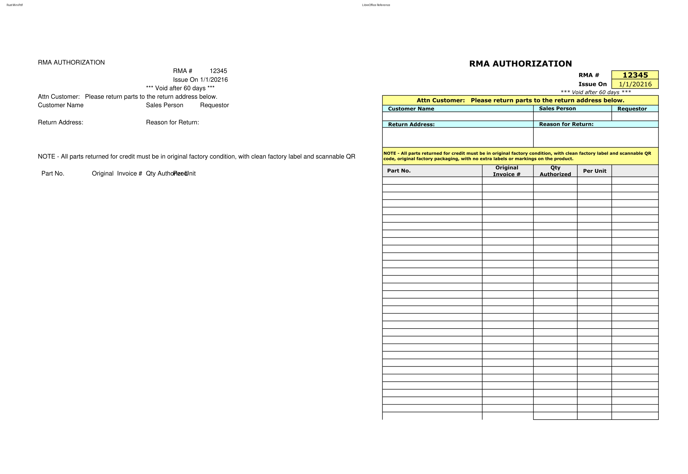</td>
</tr>
<tr>
  <td><b>XlsxIssue81_LayoutOptions<br><small>format: xlsx | case: XlsxIssue81_LayoutOptions | scope: rust-issue-xlsx</small></b><br>Page 1</td>
  <td>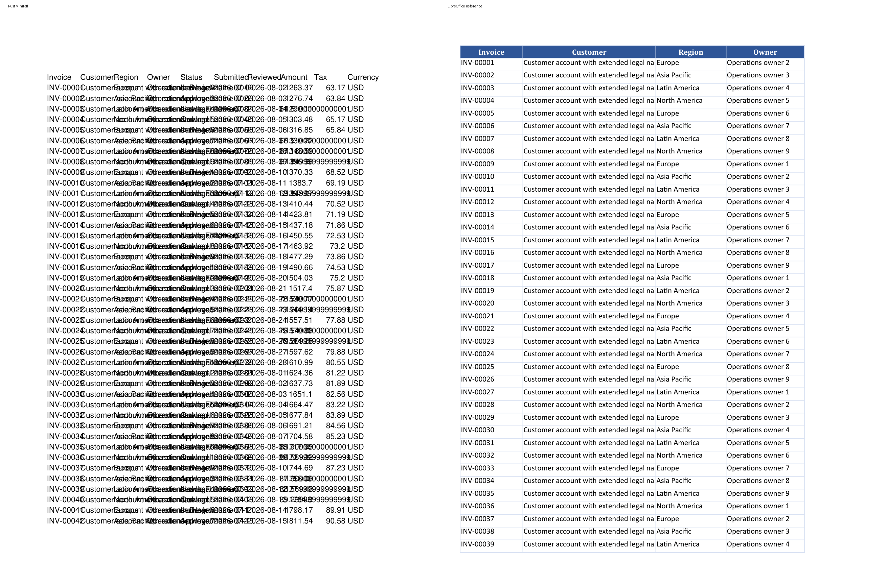</td>
</tr>
<tr>
  <td><b>XlsxIssue82_5mb<br><small>format: xlsx | case: XlsxIssue82_5mb | scope: rust-issue-xlsx</small></b><br>Page 1</td>
  <td>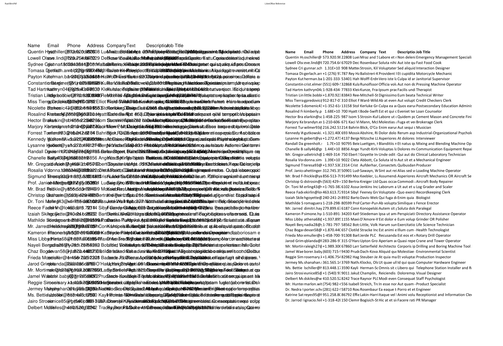</td>
</tr>
<tr>
  <td><b>XlsxIssue82_SampleTestData5mb<br><small>format: xlsx | case: XlsxIssue82_SampleTestData5mb | scope: rust-issue-xlsx</small></b><br>Page 1</td>
  <td>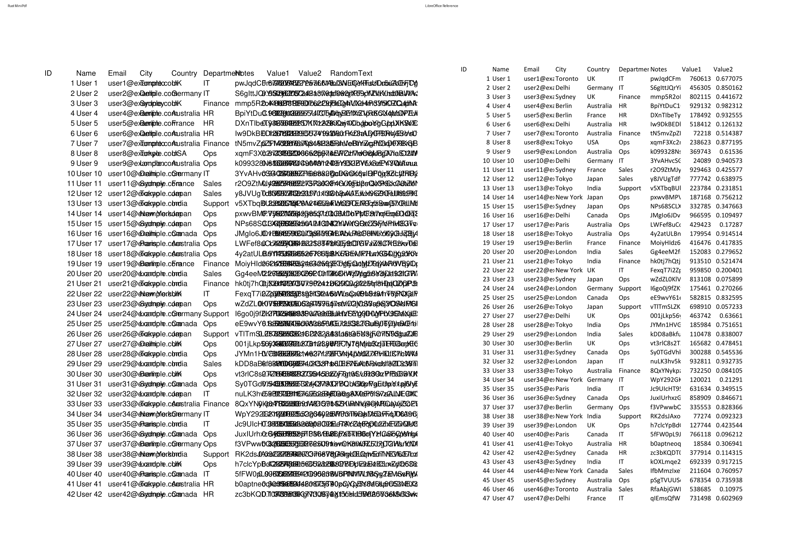</td>
</tr>
<tr>
  <td><b>XlsxIssue82_WideTable<br><small>format: xlsx | case: XlsxIssue82_WideTable | scope: rust-issue-xlsx</small></b><br>Page 1</td>
  <td>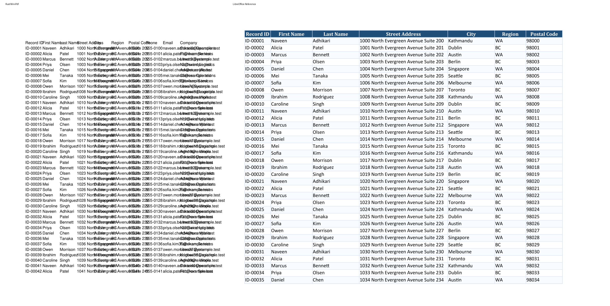</td>
</tr>
</table>

## Difference Heatmaps

Blue areas are below the configured difference threshold; red areas have stronger pixel differences. The reference rendering is retained as faint context.

<table>
<tr><th>Case</th><th>Heatmap</th><th>Metrics</th></tr>
<tr>
  <td><b>Academic Achievement Summary Table</b><br>Page 1</td>
  <td></td>
  <td>changed: 93995 px (5.94%)<br>bbox: [33, 22, 1275, 1137]<br>mean abs RGB: 8.4853<br>RMSE RGB: 39.4484<br>threshold: 12, gain: 5.0</td>
</tr>
<tr>
  <td><b>AcademicAchievement_temp</b><br>Page 1</td>
  <td>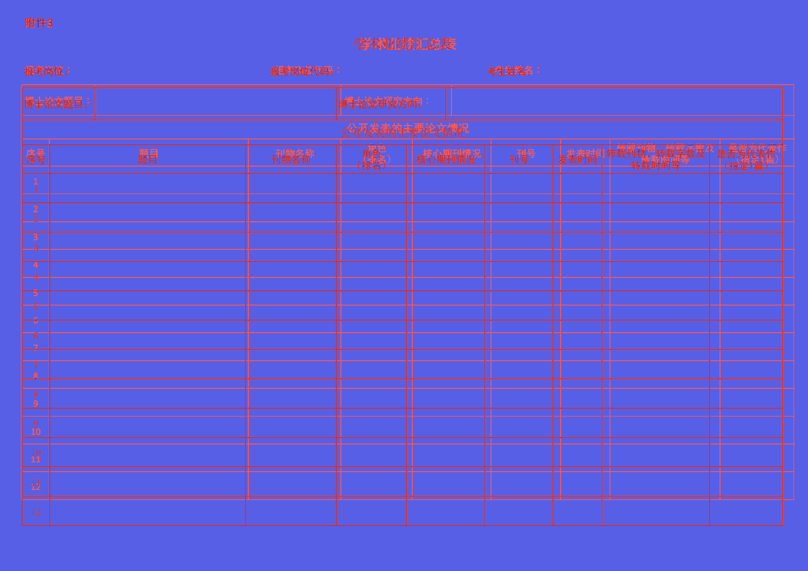</td>
  <td>changed: 93995 px (5.94%)<br>bbox: [33, 22, 1275, 1137]<br>mean abs RGB: 8.4853<br>RMSE RGB: 39.4484<br>threshold: 12, gain: 5.0</td>
</tr>
<tr>
  <td><b>Business expense budget1</b><br>Page 1</td>
  <td></td>
  <td>changed: 568740 px (27.03%)<br>bbox: [115, 159, 965, 1427]<br>mean abs RGB: 32.7151<br>RMSE RGB: 76.4321<br>threshold: 12, gain: 5.0</td>
</tr>
<tr>
  <td><b>Business expenses budget2</b><br>Page 1</td>
  <td></td>
  <td>changed: 1431092 px (68.03%)<br>bbox: [104, 96, 1169, 1512]<br>mean abs RGB: 35.696<br>RMSE RGB: 63.7649<br>threshold: 12, gain: 5.0</td>
</tr>
<tr>
  <td><b>Business plan checklist with SWOT analysis1</b><br>Page 1</td>
  <td></td>
  <td>changed: 903080 px (42.93%)<br>bbox: [101, 60, 1275, 1411]<br>mean abs RGB: 28.3526<br>RMSE RGB: 64.2551<br>threshold: 12, gain: 5.0</td>
</tr>
<tr>
  <td><b>Event budget1</b><br>Page 1</td>
  <td></td>
  <td>changed: 132943 px (6.49%)<br>bbox: [73, 144, 1241, 683]<br>mean abs RGB: 6.5343<br>RMSE RGB: 35.1511<br>threshold: 12, gain: 5.0</td>
</tr>
<tr>
  <td><b>Expense report basic1</b><br>Page 1</td>
  <td></td>
  <td>changed: 916847 px (57.94%)<br>bbox: [46, 62, 1229, 853]<br>mean abs RGB: 13.5019<br>RMSE RGB: 32.8083<br>threshold: 12, gain: 5.0</td>
</tr>
<tr>
  <td><b>Grocery list1</b><br>Page 1</td>
  <td></td>
  <td>changed: 616646 px (29.31%)<br>bbox: [48, 74, 1227, 871]<br>mean abs RGB: 22.8715<br>RMSE RGB: 62.0104<br>threshold: 12, gain: 5.0</td>
</tr>
<tr>
  <td><b>payroll-calculator_f</b><br>Page 1</td>
  <td>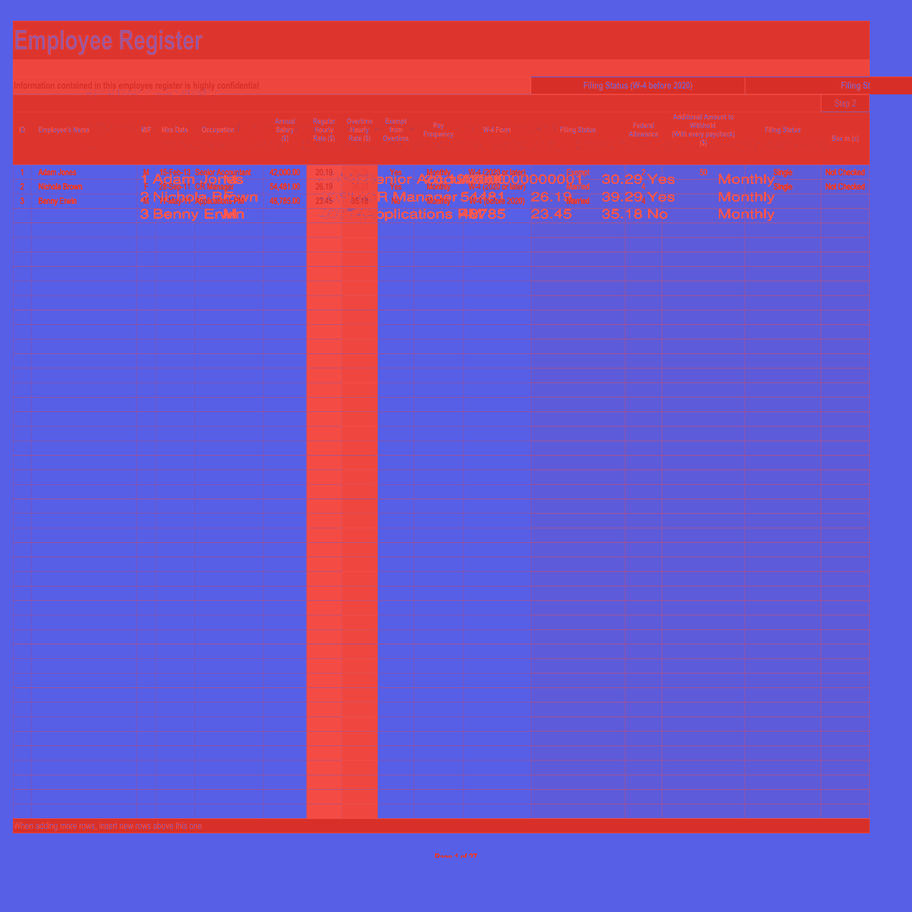</td>
  <td>changed: 851358 px (52.37%)<br>bbox: [17, 29, 1275, 1199]<br>mean abs RGB: 32.8134<br>RMSE RGB: 64.9587<br>threshold: 12, gain: 5.0</td>
</tr>
<tr>
  <td><b>PO_anonymized</b><br>Page 1</td>
  <td>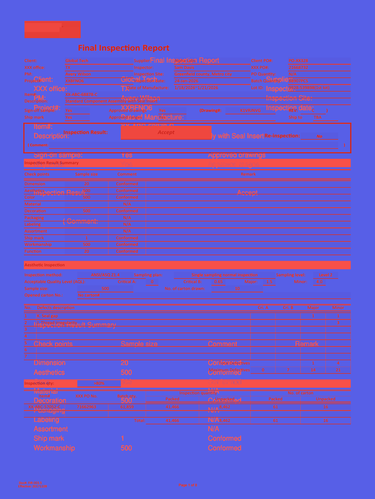</td>
  <td>changed: 819145 px (40.00%)<br>bbox: [61, 69, 1163, 1612]<br>mean abs RGB: 22.4487<br>RMSE RGB: 57.0209<br>threshold: 12, gain: 5.0</td>
</tr>
<tr>
  <td><b>Simple invoice1</b><br>Page 1</td>
  <td></td>
  <td>changed: 1264510 px (60.11%)<br>bbox: [38, 112, 1236, 1489]<br>mean abs RGB: 17.9061<br>RMSE RGB: 44.8669<br>threshold: 12, gain: 5.0</td>
</tr>
<tr>
  <td><b>Small business cash flow forecast1</b><br>Page 1</td>
  <td></td>
  <td>changed: 806309 px (38.33%)<br>bbox: [99, 74, 1175, 1557]<br>mean abs RGB: 29.1765<br>RMSE RGB: 68.6838<br>threshold: 12, gain: 5.0</td>
</tr>
<tr>
  <td><b>Wedding_timeline_planner1_copy</b><br>Page 1</td>
  <td></td>
  <td>changed: 324356 px (15.42%)<br>bbox: [104, 112, 1275, 1521]<br>mean abs RGB: 20.4011<br>RMSE RGB: 59.867<br>threshold: 12, gain: 5.0</td>
</tr>
<tr>
  <td><b>Weekly schedule planner1</b><br>Page 1</td>
  <td></td>
  <td>changed: 766620 px (36.44%)<br>bbox: [93, 124, 1182, 1503]<br>mean abs RGB: 25.6701<br>RMSE RGB: 61.9877<br>threshold: 12, gain: 5.0</td>
</tr>
<tr>
  <td><b>XlsxIssue75</b><br>Page 1</td>
  <td>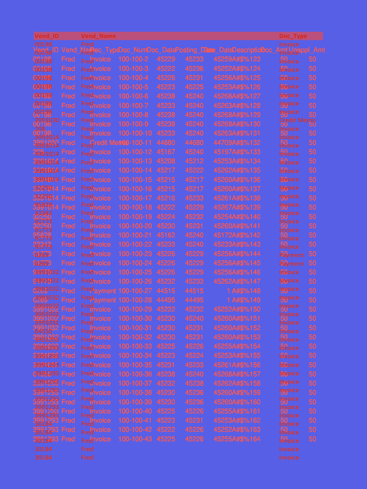</td>
  <td>changed: 311326 px (15.20%)<br>bbox: [112, 107, 1099, 1551]<br>mean abs RGB: 22.7131<br>RMSE RGB: 66.8201<br>threshold: 12, gain: 5.0</td>
</tr>
<tr>
  <td><b>XlsxIssue77_MergedCellAlignment</b><br>Page 1</td>
  <td>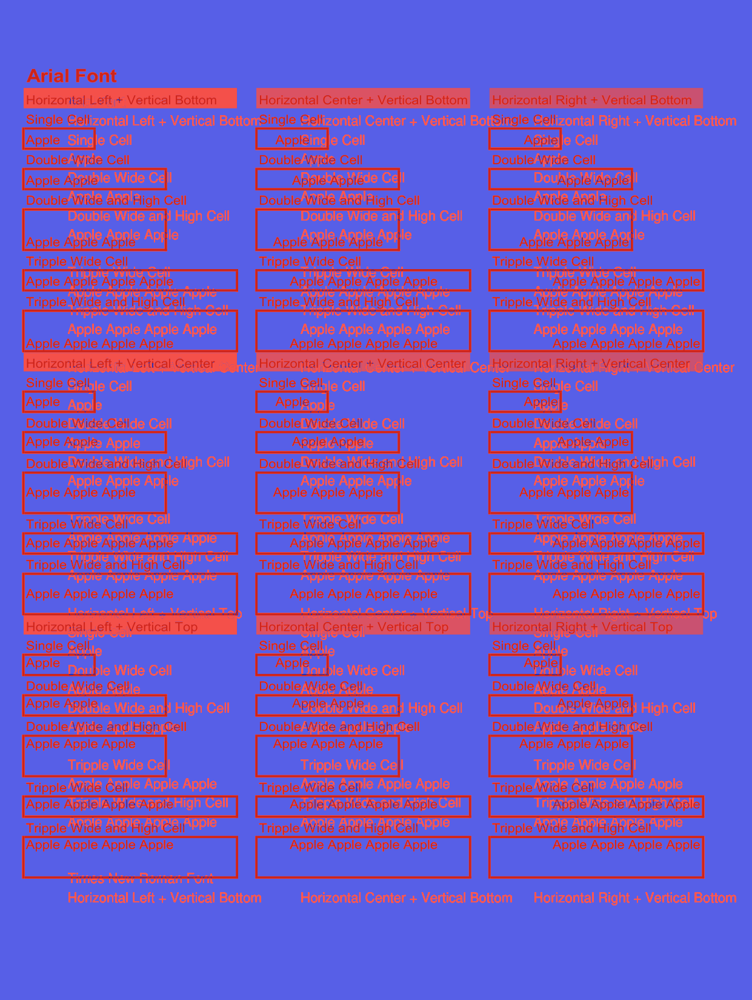</td>
  <td>changed: 473845 px (23.14%)<br>bbox: [36, 113, 1215, 1494]<br>mean abs RGB: 33.537<br>RMSE RGB: 82.1393<br>threshold: 12, gain: 5.0</td>
</tr>
<tr>
  <td><b>XlsxIssue77_Template1</b><br>Page 1</td>
  <td></td>
  <td>changed: 356002 px (17.39%)<br>bbox: [82, 159, 1240, 1473]<br>mean abs RGB: 18.8664<br>RMSE RGB: 60.0983<br>threshold: 12, gain: 5.0</td>
</tr>
<tr>
  <td><b>XlsxIssue77_Template2_Workaround</b><br>Page 1</td>
  <td></td>
  <td>changed: 360540 px (17.61%)<br>bbox: [78, 159, 1240, 1476]<br>mean abs RGB: 19.0513<br>RMSE RGB: 60.5328<br>threshold: 12, gain: 5.0</td>
</tr>
<tr>
  <td><b>XlsxIssue81_LayoutOptions</b><br>Page 1</td>
  <td>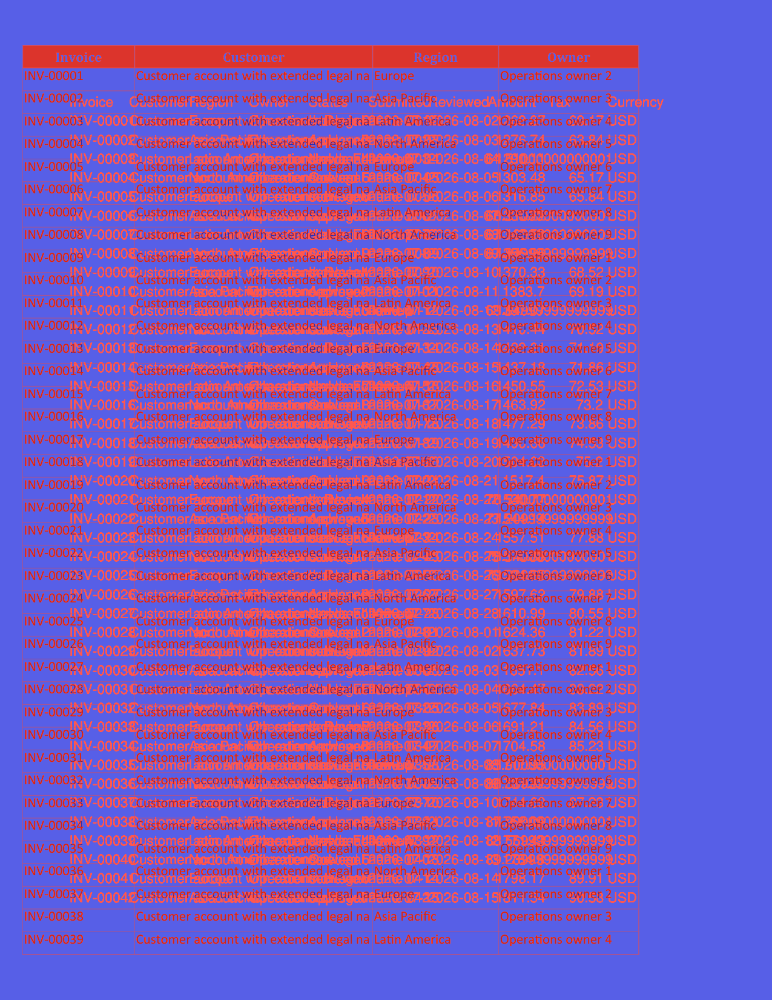</td>
  <td>changed: 622250 px (29.58%)<br>bbox: [36, 74, 1096, 1576]<br>mean abs RGB: 45.2706<br>RMSE RGB: 96.2687<br>threshold: 12, gain: 5.0</td>
</tr>
<tr>
  <td><b>XlsxIssue82_5mb</b><br>Page 1</td>
  <td>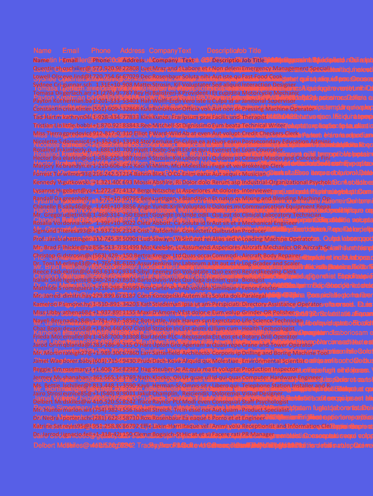</td>
  <td>changed: 717055 px (35.02%)<br>bbox: [109, 159, 1241, 1494]<br>mean abs RGB: 58.6097<br>RMSE RGB: 110.0334<br>threshold: 12, gain: 5.0</td>
</tr>
<tr>
  <td><b>XlsxIssue82_SampleTestData5mb</b><br>Page 1</td>
  <td></td>
  <td>changed: 579782 px (28.31%)<br>bbox: [113, 147, 1241, 1505]<br>mean abs RGB: 46.7996<br>RMSE RGB: 97.9662<br>threshold: 12, gain: 5.0</td>
</tr>
<tr>
  <td><b>XlsxIssue82_WideTable</b><br>Page 1</td>
  <td>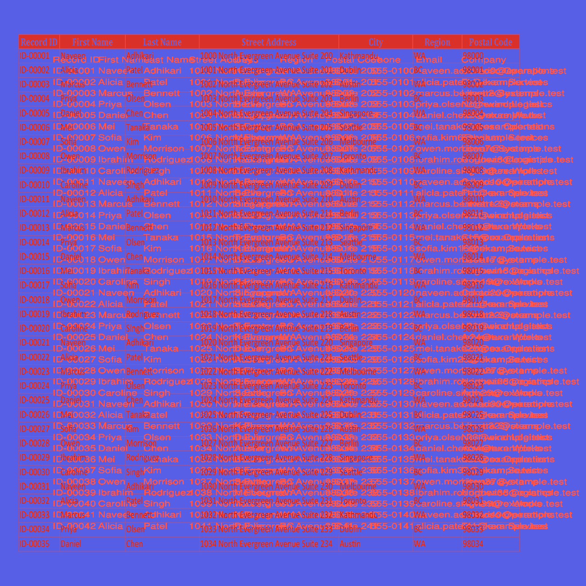</td>
  <td>changed: 549101 px (33.78%)<br>bbox: [39, 74, 1260, 1201]<br>mean abs RGB: 47.2165<br>RMSE RGB: 94.9806<br>threshold: 12, gain: 5.0</td>
</tr>
</table>

## Visual Comparison

<table>
<tr><th>MiniPdf</th><th>LibreOffice (Reference)</th></tr>
<tr>
  <td><b>Academic Achievement Summary Table<br><small>format: xlsx | case: Academic Achievement Summary Table | scope: rust-issue-xlsx</small></b></td>
  <td colspan="1">Academic Achievement Summary Table <span style="color:#f85149">⬤</span> 50.6%</td>
</tr>
<tr>
  <td></td>
  <td></td>
</tr>
<tr>
  <td><b>AcademicAchievement_temp<br><small>format: xlsx | case: AcademicAchievement_temp | scope: rust-issue-xlsx</small></b></td>
  <td colspan="1">AcademicAchievement_temp <span style="color:#f85149">⬤</span> 50.6%</td>
</tr>
<tr>
  <td>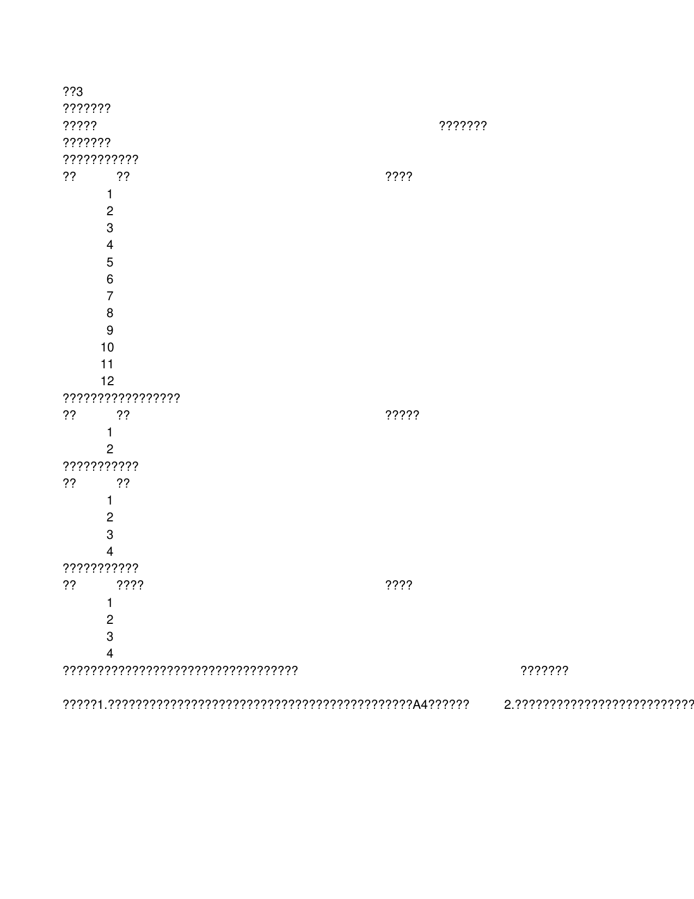</td>
  <td></td>
</tr>
<tr>
  <td><b>Business expense budget1<br><small>format: xlsx | case: Business expense budget1 | scope: rust-issue-xlsx</small></b></td>
  <td colspan="1">Business expense budget1 <span style="color:#f85149">⬤</span> 49.7%</td>
</tr>
<tr>
  <td></td>
  <td></td>
</tr>
<tr>
  <td><b>Business expenses budget2<br><small>format: xlsx | case: Business expenses budget2 | scope: rust-issue-xlsx</small></b></td>
  <td colspan="1">Business expenses budget2 <span style="color:#f85149">⬤</span> 23.2%</td>
</tr>
<tr>
  <td></td>
  <td></td>
</tr>
<tr>
  <td><b>Business plan checklist with SWOT analysis1<br><small>format: xlsx | case: Business plan checklist with SWOT analysis1 | scope: rust-issue-xlsx</small></b></td>
  <td colspan="1">Business plan checklist with SWOT analysis1 <span style="color:#f85149">⬤</span> 59.1%</td>
</tr>
<tr>
  <td></td>
  <td></td>
</tr>
<tr>
  <td><b>Event budget1<br><small>format: xlsx | case: Event budget1 | scope: rust-issue-xlsx</small></b></td>
  <td colspan="1">Event budget1 <span style="color:#d29922">⬤</span> 78.0%</td>
</tr>
<tr>
  <td></td>
  <td></td>
</tr>
<tr>
  <td><b>Expense report basic1<br><small>format: xlsx | case: Expense report basic1 | scope: rust-issue-xlsx</small></b></td>
  <td colspan="1">Expense report basic1 <span style="color:#f85149">⬤</span> 42.4%</td>
</tr>
<tr>
  <td></td>
  <td></td>
</tr>
<tr>
  <td><b>Grocery list1<br><small>format: xlsx | case: Grocery list1 | scope: rust-issue-xlsx</small></b></td>
  <td colspan="1">Grocery list1 <span style="color:#f85149">⬤</span> 56.2%</td>
</tr>
<tr>
  <td></td>
  <td></td>
</tr>
<tr>
  <td><b>payroll-calculator_f<br><small>format: xlsx | case: payroll-calculator_f | scope: rust-issue-xlsx</small></b></td>
  <td colspan="1">payroll-calculator_f <span style="color:#f85149">⬤</span> 33.9%</td>
</tr>
<tr>
  <td></td>
  <td></td>
</tr>
<tr>
  <td><b>PO_anonymized<br><small>format: xlsx | case: PO_anonymized | scope: rust-issue-xlsx</small></b></td>
  <td colspan="1">PO_anonymized <span style="color:#f85149">⬤</span> 44.3%</td>
</tr>
<tr>
  <td>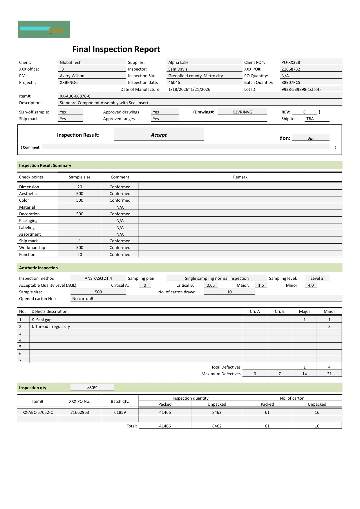</td>
  <td></td>
</tr>
<tr>
  <td><b>Simple invoice1<br><small>format: xlsx | case: Simple invoice1 | scope: rust-issue-xlsx</small></b></td>
  <td colspan="1">Simple invoice1 <span style="color:#f85149">⬤</span> 60.0%</td>
</tr>
<tr>
  <td></td>
  <td></td>
</tr>
<tr>
  <td><b>Small business cash flow forecast1<br><small>format: xlsx | case: Small business cash flow forecast1 | scope: rust-issue-xlsx</small></b></td>
  <td colspan="1">Small business cash flow forecast1 <span style="color:#f85149">⬤</span> 33.2%</td>
</tr>
<tr>
  <td></td>
  <td></td>
</tr>
<tr>
  <td><b>Wedding_timeline_planner1_copy<br><small>format: xlsx | case: Wedding_timeline_planner1_copy | scope: rust-issue-xlsx</small></b></td>
  <td colspan="1">Wedding_timeline_planner1_copy <span style="color:#f85149">⬤</span> 61.2%</td>
</tr>
<tr>
  <td>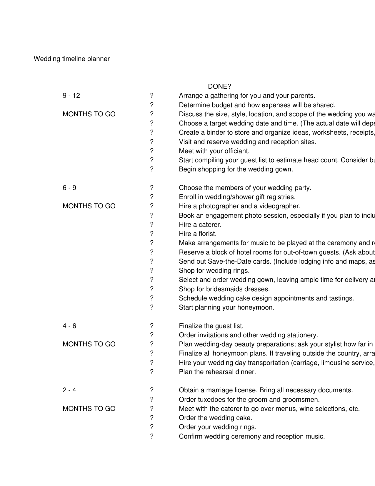</td>
  <td></td>
</tr>
<tr>
  <td><b>Weekly schedule planner1<br><small>format: xlsx | case: Weekly schedule planner1 | scope: rust-issue-xlsx</small></b></td>
  <td colspan="1">Weekly schedule planner1 <span style="color:#f85149">⬤</span> 32.5%</td>
</tr>
<tr>
  <td></td>
  <td></td>
</tr>
<tr>
  <td><b>XlsxIssue75<br><small>format: xlsx | case: XlsxIssue75 | scope: rust-issue-xlsx</small></b></td>
  <td colspan="1">XlsxIssue75 <span style="color:#f85149">⬤</span> 62.6%</td>
</tr>
<tr>
  <td>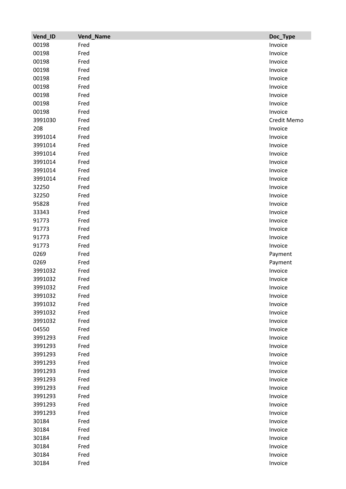</td>
  <td>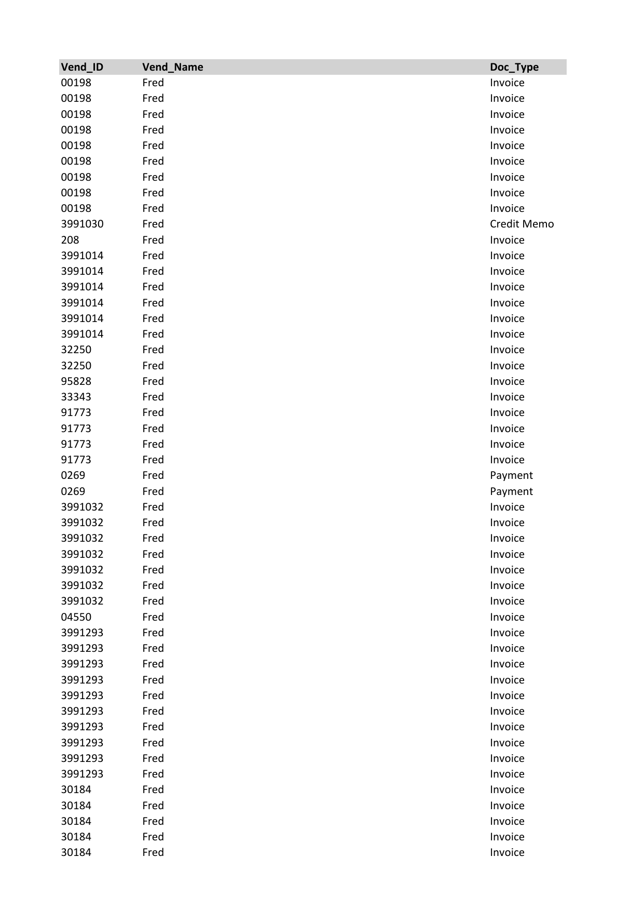</td>
</tr>
<tr>
  <td><b>XlsxIssue77_MergedCellAlignment<br><small>format: xlsx | case: XlsxIssue77_MergedCellAlignment | scope: rust-issue-xlsx</small></b></td>
  <td colspan="1">XlsxIssue77_MergedCellAlignment <span style="color:#d29922">⬤</span> 78.8%</td>
</tr>
<tr>
  <td>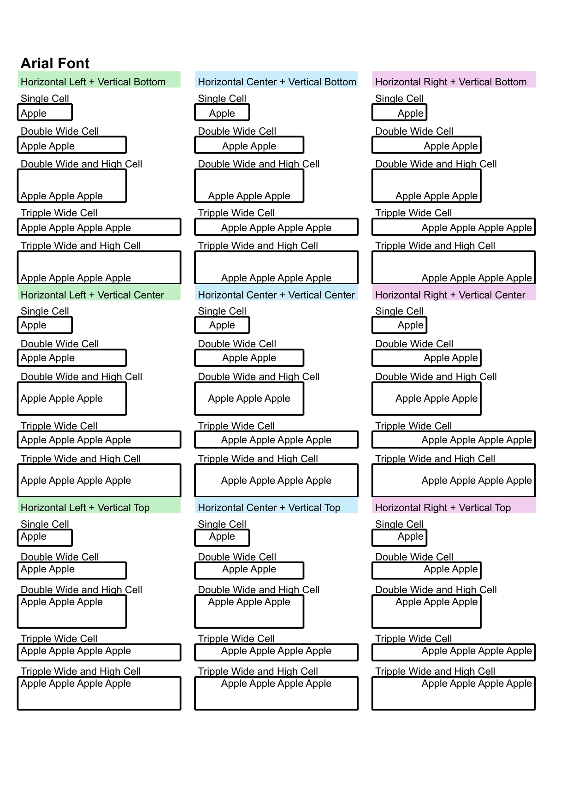</td>
  <td></td>
</tr>
<tr>
  <td><b>XlsxIssue77_Template1<br><small>format: xlsx | case: XlsxIssue77_Template1 | scope: rust-issue-xlsx</small></b></td>
  <td colspan="1">XlsxIssue77_Template1 <span style="color:#f85149">⬤</span> 65.1%</td>
</tr>
<tr>
  <td></td>
  <td></td>
</tr>
<tr>
  <td><b>XlsxIssue77_Template2_Workaround<br><small>format: xlsx | case: XlsxIssue77_Template2_Workaround | scope: rust-issue-xlsx</small></b></td>
  <td colspan="1">XlsxIssue77_Template2_Workaround <span style="color:#f85149">⬤</span> 65.0%</td>
</tr>
<tr>
  <td>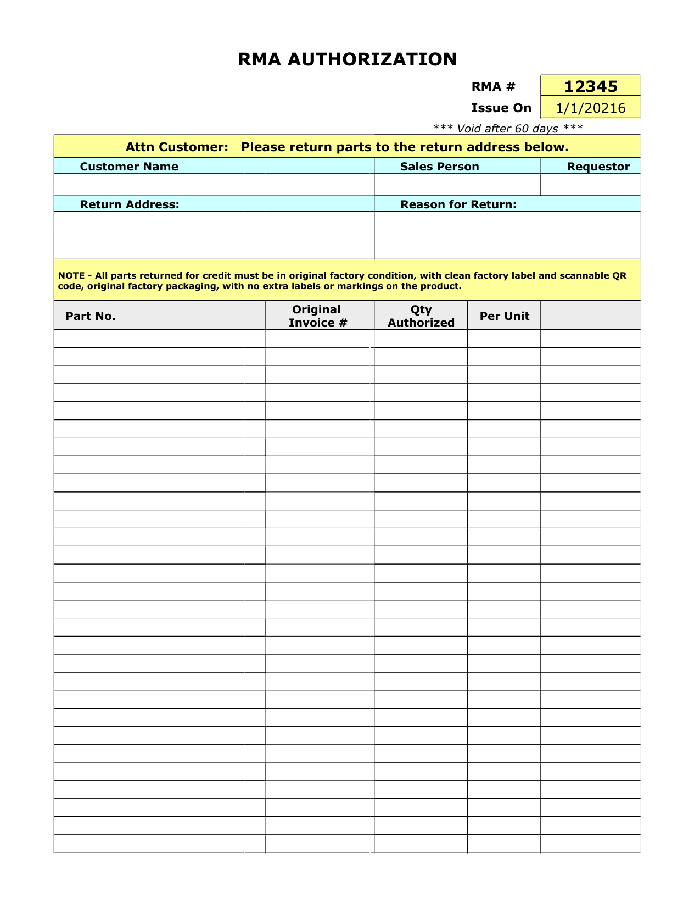</td>
  <td></td>
</tr>
<tr>
  <td><b>XlsxIssue81_LayoutOptions<br><small>format: xlsx | case: XlsxIssue81_LayoutOptions | scope: rust-issue-xlsx</small></b></td>
  <td colspan="1">XlsxIssue81_LayoutOptions <span style="color:#f85149">⬤</span> 52.0%</td>
</tr>
<tr>
  <td>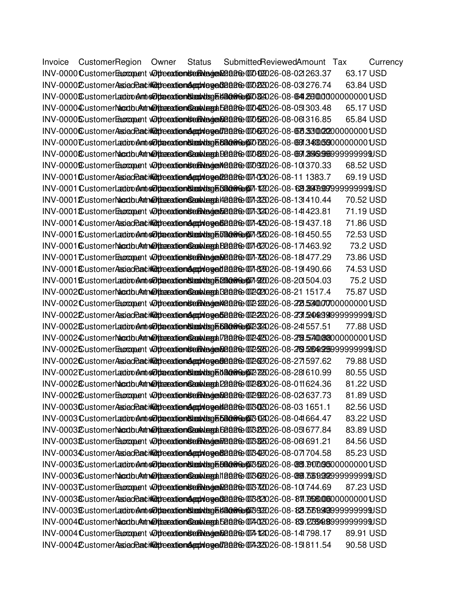</td>
  <td></td>
</tr>
<tr>
  <td><b>XlsxIssue82_5mb<br><small>format: xlsx | case: XlsxIssue82_5mb | scope: rust-issue-xlsx</small></b></td>
  <td colspan="1">XlsxIssue82_5mb <span style="color:#f85149">⬤</span> 47.2%</td>
</tr>
<tr>
  <td></td>
  <td></td>
</tr>
<tr>
  <td><b>XlsxIssue82_SampleTestData5mb<br><small>format: xlsx | case: XlsxIssue82_SampleTestData5mb | scope: rust-issue-xlsx</small></b></td>
  <td colspan="1">XlsxIssue82_SampleTestData5mb <span style="color:#f85149">⬤</span> 61.1%</td>
</tr>
<tr>
  <td></td>
  <td></td>
</tr>
<tr>
  <td><b>XlsxIssue82_WideTable<br><small>format: xlsx | case: XlsxIssue82_WideTable | scope: rust-issue-xlsx</small></b></td>
  <td colspan="1">XlsxIssue82_WideTable <span style="color:#f85149">⬤</span> 60.2%</td>
</tr>
<tr>
  <td>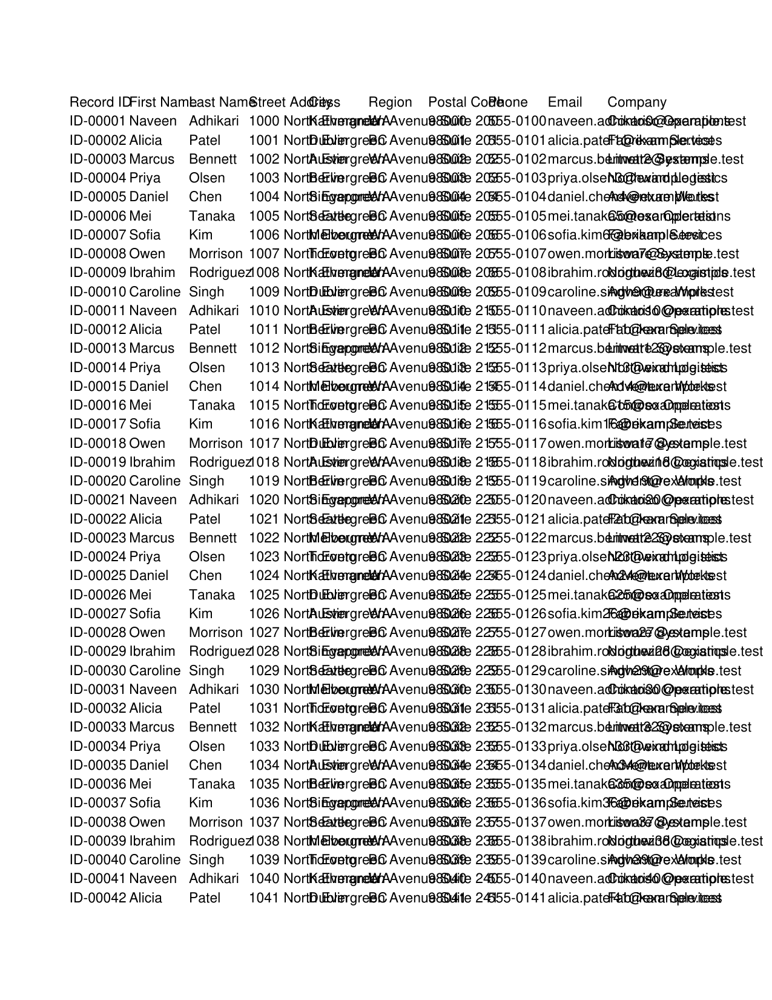</td>
  <td></td>
</tr>
</table>

## Detailed Results

### Academic Achievement Summary Table

- **Case Metadata:** format: xlsx | case: Academic Achievement Summary Table | scope: rust-issue-xlsx
- **Source:** tests/Issue_Files/xlsx/Academic Achievement Summary Table.xlsx
- **Text Similarity:** 0.2857
- **Visual Average:** 0.7282
- **Overall Score:** 0.5056
- **Pages:** MiniPdf=3, Reference=2
- **File Size:** MiniPdf=62996 bytes, Reference=168612 bytes

<details><summary>Text Diff</summary>

```diff
--- minipdf/Academic Achievement Summary Table.pdf
+++ reference/Academic Achievement Summary Table.pdf
@@ -1,9 +1,11 @@
-??3

-???????

-????? ???????

-???????

-???????????

-?? ?? ????

+附件3

+学 术业绩汇总 表

+报考岗位： 报考岗位代码： 考生姓名：

+博士论文题目： 博士论文研究方向：

+公开 发 表的主要 论 文情况

+角色 转载刊物、转载字数及 是否为代表作

+序号 题目 刊物名称 核心期刊情况 刊号 发表时间

+（排名） 转载时间等 （指定1篇）

 1

 2

 3

@@ -15,22 +17,4 @@
 9

 10

 11

-12

-?????????????????

-?? ?? ?????

-1

-2

-???????????

-?? ??

-1

-2

-3

-4

-???????????

-?? ???? ????

-1

-2

-3

-4

-??????????????????????????????????                                                                ???????

-?????1.????????????????????????????????????????????A4??????          2.??????????????????????????
+12
```
</details>

### AcademicAchievement_temp

- **Case Metadata:** format: xlsx | case: AcademicAchievement_temp | scope: rust-issue-xlsx
- **Source:** tests/Issue_Files/xlsx/AcademicAchievement_temp.xlsx
- **Text Similarity:** 0.2857
- **Visual Average:** 0.7282
- **Overall Score:** 0.5056
- **Pages:** MiniPdf=3, Reference=2
- **File Size:** MiniPdf=62996 bytes, Reference=168612 bytes

<details><summary>Text Diff</summary>

```diff
--- minipdf/AcademicAchievement_temp.pdf
+++ reference/AcademicAchievement_temp.pdf
@@ -1,9 +1,11 @@
-??3

-???????

-????? ???????

-???????

-???????????

-?? ?? ????

+附件3

+学 术业绩汇总 表

+报考岗位： 报考岗位代码： 考生姓名：

+博士论文题目： 博士论文研究方向：

+公开 发 表的主要 论 文情况

+角色 转载刊物、转载字数及 是否为代表作

+序号 题目 刊物名称 核心期刊情况 刊号 发表时间

+（排名） 转载时间等 （指定1篇）

 1

 2

 3

@@ -15,22 +17,4 @@
 9

 10

 11

-12

-?????????????????

-?? ?? ?????

-1

-2

-???????????

-?? ??

-1

-2

-3

-4

-???????????

-?? ???? ????

-1

-2

-3

-4

-??????????????????????????????????                                                                ???????

-?????1.????????????????????????????????????????????A4??????          2.??????????????????????????
+12
```
</details>

### Business expense budget1

- **Case Metadata:** format: xlsx | case: Business expense budget1 | scope: rust-issue-xlsx
- **Source:** tests/Issue_Files/xlsx/Business expense budget1.xlsx
- **Text Similarity:** 0.4633
- **Visual Average:** 0.5287
- **Overall Score:** 0.4968
- **Pages:** MiniPdf=2, Reference=4
- **File Size:** MiniPdf=18382 bytes, Reference=173721 bytes

<details><summary>Text Diff</summary>

```diff
--- minipdf/Business expense budget1.pdf
+++ reference/Business expense budget1.pdf
@@ -1,35 +1,34 @@
 BUSINESS EXPENSE BUDGET

 Fiscal Year 2026 - Quarterly Report

-CATEGORY Q1 BUDGET Q1 ACTUAL Q2 BUDGET Q2 ACTUAL VARIANCE

+CATEGORY Q1 BUDGET Q1 ACTUAL Q2 BUDGET

 PERSONNEL

-Salaries & Wages 45000 44200 46000 45800 1000

-Benefits & Insurance 12000 11850 12500 12400 250

-Training & Development 3000 2800 3200 3500 -100

-Recruitment 2000 1500 2500 2200 800

-Personnel Subtotal

+Salaries & Wages 45,000.00 44,200.00 46,000.00

+Benefits & Insurance 12,000.00 11,850.00 12,500.00

+Training & Development 3,000.00 2,800.00 3,200.00

+Recruitment 2,000.00 1,500.00 2,500.00

+Personnel Subtotal 62,000.00 60,350.00 64,200.00

 OPERATIONS

-Rent & Utilities8000 8000 8200 8150 50

-Office Supplies1500 1650 1500 1400 -50

-Equipment & Maintenance 3000 2700 3500 3800 0

-IT & Software 4000 4200 4500 4300 0

-Telecommunications 2000 1900 2100 2050 150

-Operations Subtotal

+Rent & Utilities 8,000.00 8,000.00 8,200.00

+Office Supplies 1,500.00 1,650.00 1,500.00

+Equipment & Maintenance 3,000.00 2,700.00 3,500.00

+IT & Software 4,000.00 4,200.00 4,500.00

+Telecommunications 2,000.00 1,900.00 2,100.00

+Operations Subtotal 18,500.00 18,450.00 19,800.00

 MARKETING

-Advertising 5000 4800 6000 5500 700

-Digital Marketing 3000 3200 3500 3600 -300

-Events & Sponsorships 2000 1800 2500 2800 -100

-Printing & Design 1000 950 1200 1100 150

-Marketing Subtotal

+Advertising 5,000.00 4,800.00 6,000.00

+Digital Marketing 3,000.00 3,200.00 3,500.00

+Events & Sponsorships 2,000.00 1,800.00 2,500.00

+Printing & Design 1,000.00 950.00 1,200.00

+Marketing Subtotal 11,000.00 10,750.00 13,200.00

 TRAVEL & ENTERTAINMENT

-Domestic Travel 3000 2500 3500 3200 800

-International Travel 5000 4000 6000 5500 1500

-Meals & Entertainment 2000 1800 2200 2100 300

-Vehicle Expenses 1500 1400 1500 1600 0

-Travel & Entertainment Subtotal

+Domestic Travel 3,000.00 2,500.00 3,500.00

+International Travel 5,000.00 4,000.00 6,000.00

+Meals & Entertainment 2,000.00 1,800.00 2,200.00

+Vehicle Expenses 1,500.00 1,400.00 1,500.00

+Travel & Entertainment Subtotal 11,500.00 9,700.00 13,200.00

 PROFESSIONAL SERVICES

-Legal Fees 3000 2800 3500 3200 500

-Accounting & Audit 2500 2500 2500 2500 0

-Consulting 4000 3500 5000 4800 700

-Insurance 2000 2000 2100 2100 0

-Professional Services Subtotal

-GRAND TOTAL
+Legal Fees 3,000.00 2,800.00 3,500.00

+Accounting & Audit 2,500.00 2,500.00 2,500.00

+Consulting 4,000.00 3,500.00 5,000.00

+Insurance 2,000.00 2,000.00 2,100.00

+Professional Services Subtotal 11,500.00 10,800.00 13,100.00
```
</details>

### Business expenses budget2

- **Case Metadata:** format: xlsx | case: Business expenses budget2 | scope: rust-issue-xlsx
- **Source:** tests/Issue_Files/xlsx/Business expenses budget2.xlsx
- **Text Similarity:** 0.2299
- **Visual Average:** 0.0996
- **Overall Score:** 0.2318
- **Pages:** MiniPdf=8, Reference=4
- **File Size:** MiniPdf=110139 bytes, Reference=402762 bytes

<details><summary>Text Diff</summary>

```diff
--- minipdf/Business expenses budget2.pdf
+++ reference/Business expenses budget2.pdf
@@ -1,30 +1,26 @@
 Market Financial Consulting

 PLANNED EXPENSES

-January February March April May June July August

-EMPLOYEE COSTS 107950 107950 107950 111125 111125 111125 111125 117348

-EMPLOYEE COSTS JANUARYFEBRUARY MARCH APRIL MAY JUNE JULY AUGUST

-Wages 85000 85000 85000 87500 87500 87500 87500 92400

-Benefits 22950 22950 22950 23625 23625 23625 23625 24948

-OFFICE COSTS 11370 11770 11770 11470 11470 11470 11470 11470

-OFFICE COSTS JANUARYFEBRUARY MARCH APRIL MAY JUNE JULY AUGUST

-Office lease 9800 9800 9800 9800 9800 9800 9800 9800

-Gas 0 400 400 100 100 100 100 100

-Electric 300 300 300 300 300 300 300 300

-Water 40 40 40 40 40 40 40 40

-Telephone 250 250 250 250 250 250 250 250

-Internet access180 180 180 180 180 180 180 180

-Office supplies 200 200 200 200 200 200 200 200

-Security 600 600 600 600 600 600 600 600

-MARKETING COSTS 8100 3100 3100 11100 3100 3900 8100 6100

-MARKETING COSTS JANUARYFEBRUARY MARCH APRIL MAY JUNE JULY AUGUST

-Web site hosting500 500 500 500 500 500 500 500

-Web site updates 200 200 200 200 200 1000 200 200

-Collateral preparation 5000 0 0 5000 0 0 5000 0

-Collateral printing 200 200 200 200 200 200 200 200

-Marketing events 2000 2000 2000 5000 2000 2000 2000 5000

-Miscellaneous expenses 200 200 200 200 200 200 200 200

-TRAINING / TRAVEL 4000 4000 4000 4000 4000 4000 4000 4000

-TRAINING/TRAVEL JANUARYFEBRUARY MARCH APRIL MAY JUNE JULY AUGUST

-Training classes 2000 2000 2000 2000 2000 2000 2000 2000

-Travel costs 2000 2000 2000 2000 2000 2000 2000 2000

-MONTHLY TOTAL 131420 126820 126820 137695 129695 130495 134695 138918
+January February March April May June July August September October November December Total

+EMPLOYEE COSTS $ 107,950.00 $ 107,950.00 $ 107,950.00 $ 111,125.00 $ 111,125.00 $ 111,125.00 $ 111,125.00 $ 117,348.00 $ 117,348.00 $ 117,348.00 $ 117,348.00 $ 117,348.00 $ 1,355,090.00

+Wages $ 85,000.00 $ 85,000.00 $ 85,000.00 $ 87,500.00 $ 87,500.00 $ 87,500.00 $ 87,500.00 $ 92,400.00 $ 92,400.00 $ 92,400.00 $ 92,400.00 $ 92,400.00 $ 1,067,000.00

+Benefits $ 22,950.00 $ 22,950.00 $ 22,950.00 $ 23,625.00 $ 23,625.00 $ 23,625.00 $ 23,625.00 $ 24,948.00 $ 24,948.00 $ 24,948.00 $ 24,948.00 $ 24,948.00 $ 288,090.00

+OFFICE COSTS $ 11,370.00 $ 11,770.00 $ 11,770.00 $ 11,470.00 $ 11,470.00 $ 11,470.00 $ 11,470.00 $ 11,470.00 $ 11,470.00 $ 11,470.00 $ 11,770.00 $ 11,770.00 $ 138,740.00

+Office lease $ 9,800.00 $ 9,800.00 $ 9,800.00 $ 9,800.00 $ 9,800.00 $ 9,800.00 $ 9,800.00 $ 9,800.00 $ 9,800.00 $ 9,800.00 $ 9,800.00 $ 9,800.00 $ 117,600.00

+Gas $ - $ 400.00 $ 400.00 $ 100.00 $ 100.00 $ 100.00 $ 100.00 $ 100.00 $ 100.00 $ 100.00 $ 400.00 $ 400.00 $ 2,300.00

+Electric $ 300.00 $ 300.00 $ 300.00 $ 300.00 $ 300.00 $ 300.00 $ 300.00 $ 300.00 $ 300.00 $ 300.00 $ 300.00 $ 300.00 $ 3,600.00

+Water $ 40.00 $ 40.00 $ 40.00 $ 40.00 $ 40.00 $ 40.00 $ 40.00 $ 40.00 $ 40.00 $ 40.00 $ 40.00 $ 40.00 
... (2220 more characters)

```
</details>

### Business plan checklist with SWOT analysis1

- **Case Metadata:** format: xlsx | case: Business plan checklist with SWOT analysis1 | scope: rust-issue-xlsx
- **Source:** tests/Issue_Files/xlsx/Business plan checklist with SWOT analysis1.xlsx
- **Text Similarity:** 0.7612
- **Visual Average:** 0.215
- **Overall Score:** 0.5905
- **Pages:** MiniPdf=1, Reference=1
- **File Size:** MiniPdf=5833 bytes, Reference=64357 bytes

<details><summary>Text Diff</summary>

```diff
--- minipdf/Business plan checklist with SWOT analysis1.pdf
+++ reference/Business plan checklist with SWOT analysis1.pdf
@@ -1,14 +1,35 @@
 Northwind Traders

 Business planning checklist

-Using the strength, weakness, opportunity, and threat (SWOT) analysis framework, develop a checklist of

+Using the strength, weakness, opportunity, and threat (SWOT) analysis framework, develop a checklist of the key activities

+that need to be performed when preparing a formal business plan in the table, below.

 Activity Owner Completion date

-Strengths: Define the company’s current mission statement. Luca Richter 44935

-Strengths: Identify market segments in which the company will participate by conducting primary and sec Dylan Williams44935

-Strengths: Identify the company’s value proposition and how it will differentiate itself within the marketplac Kristin Orav 44942

-Weaknesses: Identify any barriers to market entry (for example, capital requirements, technical barriers, p Flora Berggren 44932

-Weaknesses: Identify any risks inherent to the organization that need to be mitigated so that the company Flora Berggren 44932

-Opportunities: Identify areas where the current market is underserved that provide an opportunity for the c Kristin Orav 44932

-Opportunities: Identify any key processes, intellectual capital, or other resources that the company can us Ian Hansson 44935

-Threats: Identify primary competitors, and then analyze competitor performance by using all available dat Gaurav Cheema 44935

-Threats: Identify secondary and potential future competitors that might affect the business plan. Chela Arapelli44942

-Threats: Develop strategies for mitigating primary and secondary competitive threats. Gaurav Cheema 44942
+Strengths: Define the company's current mission

+Luca Richter 1/9/2023

+statement.

+Strengths: Identify market segments in which the company

+will participate by conducting primary and secondary market Dylan Williams 1/9/2023

+research.

+Strengths: Identify the company's value proposition and

+Kristin Orav 1/16/2023

+how it will differentiate itself within the marketplace.

+Weaknesses: Identify any barriers to market entry (for

+example, capital requirements, technical barriers, patents, Flora Berggren 1/6/2023

+and process barriers) that the company needs to overcome.

+Weaknesses: Identify any risks inherent to the

+organization that need to be mitigated so that the company Flora Berggren 1/6/2023

+can realize the business plan.

+Opportunities: Identify areas where the current market is

+Kristin Orav 1/6/2023

+underserved that provide an opportunity for the company.

+Opportunities: Identify any key processes, intellectual

+capital, or other resources that the company can use to its Ian Hansson 1/9/2023

+advantage in the marketplace.

+Threats: Identify primary competitors, and then analyze

+competitor performance by using all available data and Gaurav Cheema 1/9/2023

+additional data that can be verified.

... (244 more characters)

```
</details>

### Event budget1

- **Case Metadata:** format: xlsx | case: Event budget1 | scope: rust-issue-xlsx
- **Source:** tests/Issue_Files/xlsx/Event budget1.xlsx
- **Text Similarity:** 0.9061
- **Visual Average:** 0.7938
- **Overall Score:** 0.78
- **Pages:** MiniPdf=4, Reference=5
- **File Size:** MiniPdf=34606 bytes, Reference=121226 bytes

<details><summary>Text Diff</summary>

```diff
--- minipdf/Event budget1.pdf
+++ reference/Event budget1.pdf
@@ -1,8 +1,11 @@
 ABOUT THIS TEMPLATE

-Use this event budget workbook to track expenses incurred on and income earned from an event.

+Use this event budget workbook to track expenses incurred on and income earned from an

+event.

 Enter details in tables in expenses worksheet and income worksheet.

 Total expenses and total income are auto-calculated.

 Profit & loss summary and chart are auto-updated in profit-loss summary worksheet.

-Note:?

-Additional instructions have been provided in column A in each worksheet. This text has been intentionall

-To learn more about tables, press SHIFT and then F10 within a table, select the TABLE option, and then
+Note:

+Additional instructions have been provided in column A in each worksheet. This text has been

+intentionally hidden. To remove text, select column A, then select DELETE.

+To learn more about tables, press SHIFT and then F10 within a table, select the TABLE option, and

+then select ALTERNATIVE TEXT
```
</details>

### Expense report basic1

- **Case Metadata:** format: xlsx | case: Expense report basic1 | scope: rust-issue-xlsx
- **Source:** tests/Issue_Files/xlsx/Expense report basic1.xlsx
- **Text Similarity:** 0.7218
- **Visual Average:** 0.0874
- **Overall Score:** 0.4237
- **Pages:** MiniPdf=2, Reference=1
- **File Size:** MiniPdf=15456 bytes, Reference=47897 bytes

<details><summary>Text Diff</summary>

```diff
--- minipdf/Expense report basic1.pdf
+++ reference/Expense report basic1.pdf
@@ -1,10 +1,23 @@
+For Office Use Only

 EXPENSE REPORT

 GENERAL INFORMATION

-Purpose Budget overview preparation Statement Number 1123 Pay Periodfrom: 10/1/2023 to: 11/1/2023

+Purpose Budget overview preparation Statement Number 1123 Pay Period from: 10/1/2023 to: 11/1/2023

 EMPLOYEE INFORMATION

 Name Cora Thomas Position Sales rep SSN 123-45-****

 Department Marketing & sales Manager Liane Cormier Employee ID 8675309

-Date Account DescriptionHotel TransportFuel Meals Phone Entertainment

-45204Wide World Importers Networking 111 250 60 50 0 300

-Total 111 250 60 50 0 300

-APPROVED NOTES
+Date Account Description Hotel Transport Fuel Meals Phone Entertainment Misc. Total

+10/5/2023 Wide World Importers Networking $111.00 $250.00 $60.00 $50.00 $0.00 $300.00 $25.00 $796.00

+$0.00

+$0.00

+$0.00

+$0.00

+$0.00

+$0.00

+$0.00

+$0.00

+Total $111.00 $250.00 $60.00 $50.00 $0.00 $300.00 $25.00 $796.00

+Subtotal $796.00

+Advances $0.00

+APPROVED

+NOTES

+Total $796.00
```
</details>

### Grocery list1

- **Case Metadata:** format: xlsx | case: Grocery list1 | scope: rust-issue-xlsx
- **Source:** tests/Issue_Files/xlsx/Grocery list1.xlsx
- **Text Similarity:** 0.5867
- **Visual Average:** 0.3194
- **Overall Score:** 0.5624
- **Pages:** MiniPdf=1, Reference=1
- **File Size:** MiniPdf=15697 bytes, Reference=86288 bytes

<details><summary>Text Diff</summary>

```diff
--- minipdf/Grocery list1.pdf
+++ reference/Grocery list1.pdf
@@ -1,22 +1,41 @@
+ORCHARD GROCERY HOME DELIVERY LOCAL MARKET OTHER GRAND TOTAL

 GROCERY LIST

-ORCHARDGROCERYHOME DELIVERY LOCAL MARKET OTHER GRAND TOTAL

-Customize this list. Replace the entries above with your own to track your most frequently used categories. 6.1150000000000002 11.95 216.60000000000002 31.85 3.99 270.505

+Customize this list. Replace the entries above with your own to track your most $11.95 $6.12 $31.85 $216.60 $3.99 $270.51

+frequently used categories.

 DONE? ITEM STORE CATEGORY QTY UNIT UNIT PRICE TOTAL NOTE

-Yes Peaches Azure River Farm ORCHARD 2 lbs 2.99 5.98

-Yes Apples Azure River Farm ORCHARD 3 lbs 1.99 5.97 Have coupon

-Bananas Wide World Importers OTHER 1 bunch 3.99 3.99

-Yes Lettuce Market LOCAL MARKET2 head 2.29 4.58

-TomatoesMarket LOCAL MARKET4 lbs 3.49 13.96

-Yes Squash Market LOCAL MARKET2 each 1.5 3

-Yes Celery Wide World Importers LOCAL MARKET2 bunch 1.99 3.98

-CucumberMarket LOCAL MARKET1 lbs 2.29 2.29

-Mushrooms Wide World Importers GROCERY 0.5 lbs 2.25 1.125

-Yes Milk Local Farmer HOME DELIVERY2 gal 3.99 7.98

-Yes Cheese Local Farmer HOME DELIVERY1 lbs 9.99 9.99 Variety of block cheeses

-Yes Eggs Local Farmer HOME DELIVERY2 doz 3.5 7

-Yes Cottage cheese Local Farmer HOME DELIVERY1 16 oz 3.89 3.89

-Yes Sour cream Local Farmer HOME DELIVERY1 8 oz 2.99 2.99

-Yogurt Wide World Importers GROCERY 1 16 oz 4.99 4.99 Greek with honey

-Beef Farmer’s Market LOCAL MARKET10 lbs 79.900000000000006Bacon wrapped filets 7.99

-Wild Salmon Fish Market LOCAL MARKET6 lbs 8.99 53.94

-Alaskan King Crab Legs Fish Market LOCAL MARKET5 lbs 10.99 54.95
+Yes Peaches Azure River Farm ORCHARD 2 lbs $2.99 $5.98

+Yes Apples Azure River Farm ORCHARD 3 lbs $1.99 $5.97 Have coupon

+Bananas Wide World Importers OTHER 1 bunch $3.99 $3.99

+LOCAL

+Yes Lettuce Market 2 head $2.29 $4.58

+MARKET

+Tomatoes Market LOCAL MARKET 4 lbs $3.49 $13.96

+LOCAL

+Yes Squash Market 2 each $1.50 $3.00

+MARKET

+LOCAL

+Yes Celery Wide World Importers 2 bunch $1.99 $3.98

+MARKET

+Cucumber Market LOCAL MARKET 1 lbs $2.29 $2.29

+Mushrooms Wide World Importers GROCERY 0.5 lbs $2.25 $1.13

+HOME

+Yes Milk Local Farmer 2 gal $3.99 $7.98

+DELIVERY

+HOME Variety of

+Yes Cheese Local Farmer 1 lbs $9.99 $9.99

+DELIVERY block cheeses

+HOME

+Yes Eggs Local Farmer 2 doz $3.50 $7.00

+DELIVERY

+HOME

+Yes Cottage cheese Local Farmer 1 16 oz $3.89 $3.89

+DELIVERY

+HOME

+Yes Sour cream Local Farmer 1 8 oz $2.99 $2.99

+DELIVERY

+Yogurt Wide World Importers GROCERY 1 16 oz $4.99 $4.99 Greek with honey

+Bacon wrapped

+Beef Farmer's Market LOCAL MARKET 10 lbs $7.99 $79.90

+filets

+Wild Salmon Fish Market LOCAL MARKET 6 lbs $8.99 $53.94

+Alaskan King Crab Legs Fish Market LOCAL MARKET 5 lbs $10.99 $54.95
```
</details>

### payroll-calculator_f

- **Case Metadata:** format: xlsx | case: payroll-calculator_f | scope: rust-issue-xlsx
- **Source:** tests/Issue_Files/xlsx/payroll-calculator_f.xlsx
- **Text Similarity:** 0.4677
- **Visual Average:** 0.1296
- **Overall Score:** 0.3389
- **Pages:** MiniPdf=53, Reference=27
- **File Size:** MiniPdf=209436 bytes, Reference=540676 bytes

<details><summary>Text Diff</summary>

```diff
--- minipdf/payroll-calculator_f.pdf
+++ reference/payroll-calculator_f.pdf
@@ -1,6 +1,15 @@
 Employee Register

-Information contained in this employee register is highly confidential

-ID Employee’s Name M/F Hire DateOccupationAnnual Salary ($) Regular Hourly Rate ($) Overtime Hourly Rate ($) Exempt from Overtime Pay Frequency

-1 Adam Jones M 41320Senior Accountant 20.190000000000001 42000 30.29 Yes Monthly

-2 Nichola Brown F 40814CR Manager 54481 26.19 39.29 Yes Monthly

-3 Benny Erwin M 40674Applications PM 48785 23.45 35.18 No Monthly
+Information contained in this employee register is highly confidential Filing Status (W-4 before 2020) Filing St

+Step 2

+Additional Amount to

+Annual Regular Overtime Exempt

+Pay Federal Withhold

+ID Employee's Name M/F Hire Date Occupation Salary Hourly Hourly from W-4 Form Filing Status Filing Status

+Frequency Allowance (With every paycheck)

+($) Rate ($) Rate ($) Overtime Box in (c)

+($)

+1 Adam Jones M 15-Feb-13 Senior Accountant 42,000.00 20.19 30.29 Yes Monthly W-4 (2020 or later) Exempt 2 50 Single Not Checked

+2 Nichola Brown F 28-Sep-11 CR Manager 54,481.00 26.19 39.29 Yes Monthly W-4 (2020 or later) Married 4 Single Not Checked

+3 Benny Erwin M 11-May-11 Applications PM 48,785.00 23.45 35.18 No Monthly W-4 (before 2020) Married 4

+When adding more rows, insert new rows above this one

+Page 1 of 27
```
</details>

### PO_anonymized

- **Case Metadata:** format: xlsx | case: PO_anonymized | scope: rust-issue-xlsx
- **Source:** tests/Issue_Files/xlsx/PO_anonymized.xlsx
- **Text Similarity:** 0.5614
- **Visual Average:** 0.295
- **Overall Score:** 0.4426
- **Pages:** MiniPdf=72, Reference=8
- **File Size:** MiniPdf=829664 bytes, Reference=338357 bytes

<details><summary>Text Diff</summary>

```diff
--- minipdf/PO_anonymized.pdf
+++ reference/PO_anonymized.pdf
@@ -1,15 +1,16 @@
 Final Inspection Report

-Client: Global Tech Supplier:

-XXX office: TX Inspector:

-PM: Avery Wilson Inspection Site:

-Project#: XXBFNO6 Inspection date:

-Date of Manufacture:

+Client: Global Tech Supplier: Alpha Labs Client PO#: PO-XX328

+XXX office: TX Inspector: Sam Davis XXX PO#: 21668732

+PM: Avery Wilson Inspection Site: Greenfield county, Metro city PO Quantity: N/A

+Project#: XXBFNO6 Inspection date: 24-Jan-2026 Batch Quantity: 88907PCS

+Date of Manufacture:    1/18/2026~1/21/2026 Lot ID: 9928-539898(1st lot)

 Item#: XX-ABC-68878-C

 Description: Standard Component Assembly with Seal Insert

-Sign-off sample: Yes Approved drawings

-Ship mark Yes Approved ranges

+Sign-off sample: Yes Approved drawings Yes (Drawing#: K1VRJNVG REV: C )

+Ship mark Yes Approved ranges Yes Ship to TBA

 Inspection Result: Accept

-( Comment:

+Re-inspection: No

+( Comment: )

 Inspection Result Summary

 Check points Sample size Comment Remark

 Dimension 20 Conformed

@@ -21,4 +22,29 @@
 Labeling N/A

 Assortment N/A

 Ship mark 1 Conformed

-Workmanship 500 Conformed
+Workmanship 500 Conformed

+Function 20 Conformed

+Aesthetic Inspection

+Inspection method: ANSI/ASQ Z1.4 Sampling plan: Single sampling normal inspection Sampling level: Level 2

+Acceptable Quality Level (AQL): Critical A: 0 Critical B: 0.65 Major: 1.5 Minor: 4.0

+Sample size: 500 No. of carton drawn: 10

+Opened carton No.: No carton#

+No. Defects description Cri. A Cri. B Major Minor

+1 K. Seal gap 1 1

+2 J. Thread irregularity 3

+3

+4

+5

+6

+7

+Total Defectives 1 4

+Maximum Defectives 0 7 14 21

+Inspection qty: >80%

+Inspection quantity No. of carton

+Item# XXX PO No. Batch qty.

+Packed Unpacked Packed Unpacked

+XX-ABC-57052-C 71662963 61,859 41,466 8,462 61 16

+Total: 41,466 8,462 61 16

+Doc#: FIR-003.5

+Page 1 of 8

+Effective: 20171109
```
</details>

### Simple invoice1

- **Case Metadata:** format: xlsx | case: Simple invoice1 | scope: rust-issue-xlsx
- **Source:** tests/Issue_Files/xlsx/Simple invoice1.xlsx
- **Text Similarity:** 0.9001
- **Visual Average:** 0.0991
- **Overall Score:** 0.5997
- **Pages:** MiniPdf=1, Reference=1
- **File Size:** MiniPdf=11852 bytes, Reference=78344 bytes

<details><summary>Text Diff</summary>

```diff
--- minipdf/Simple invoice1.pdf
+++ reference/Simple invoice1.pdf
@@ -1,21 +1,22 @@
-Elegant INVOICE

-Embrace Invoice #: 10654

-Invoice date: 46097

+INVOICE

+Elegant

+Invoice #: 10654

+Embrace Invoice date: 3/17/2026

 Job: Wedding florals

 345 W Main Bill to: Hailey Clark

 Los Angeles, CA 14151 Address: 123 Avenue A,

 P: 915-555-0195 Burbank, CA 56789

 F: 915-555-0105 Phone: 805-555-0185

 elegantembrace@example.com Fax: NA

-Item # DescriptionQty Unit priceDiscount Price

-A875 Peonies 35 1.05 36.75

-K245 Tulips 25 2 50

-U123 Buttercup 30 1.35 40.5

-Invoice Subtotal 127.25

-Tax Rate 0.06

-7.6349999999999998 Sales Tax

-Deposit Received50

-TOTAL 77.25

+Item # Description Qty Unit price Discount Price

+A875 Peonies 35 $1.05 $36.75

+K245 Tulips 25 $2.00 $50.00

+U123 Buttercup 30 $1.35 $40.50

+Invoice Subtotal $127.25

+Tax Rate 6.00%

+Sales Tax $7.64

+Deposit Received $50.00

+TOTAL $77.25

 Please make all checks payable to Elegant Embrace.

 Total due in 90 days. Overdue accounts subject to a service charge of 1.5% per month.

 elegantembrace@example.com | www.interestingsite.com
```
</details>

### Small business cash flow forecast1

- **Case Metadata:** format: xlsx | case: Small business cash flow forecast1 | scope: rust-issue-xlsx
- **Source:** tests/Issue_Files/xlsx/Small business cash flow forecast1.xlsx
- **Text Similarity:** 0.3115
- **Visual Average:** 0.269
- **Overall Score:** 0.3322
- **Pages:** MiniPdf=6, Reference=5
- **File Size:** MiniPdf=70692 bytes, Reference=126373 bytes

<details><summary>Text Diff</summary>

```diff
--- minipdf/Small business cash flow forecast1.pdf
+++ reference/Small business cash flow forecast1.pdf
@@ -1,36 +1,57 @@
 ELBIDE REALTY

 Cash flow forecast

-Starting cash on hand 10000 Starting date 46113 Cash minimum balance alert 2000

-46113 46143 46174 46204 46235 46266 46296 46327

-Cash on hand (beginning of month) 10000 8050 9350 890 2190 13590 13790 15290

+Starting cash on hand $     10,000.00 Starting date Apr 2026 Cash minimum balance alert $        2,000.00

+Apr 2026 May 2026 Jun 2026 Jul 2026 Aug 2026 Sep 2026 Oct 2026 Nov 2026 Dec 2026 Jan 2027 Feb 2027 Mar 2027

+Total

+Cash on hand (beginning of month) $     10,000.00  $        8,050.00  $        9,350.00 $           890.00 $        2,190.00  $     13,590.00  $     13,790.00  $     15,290.00  $     16,410.00  $     14,360.00  $     16,560.00  $     18,780.00

 Cash receipts

-Cash sales 2500 3000 3600 3000 14000 6000 3000 2800

-Returns and allowances 200

-Collections on accounts receivable

-Interest, other income

-Loan proceeds

-Owner contributions

-Other receipts

-Total cash receipts 2500 3000 3400 3000 14000 6000 3000 2800

-Total cash available 12500 11050 12750 3890 16190 19590 16790 18090

+Cash sales $        2,500.00  $        3,000.00  $        3,600.00  $        3,000.00  $     14,000.00  $        6,000.00  $        3,000.00  $        2,800.00  $        3,500.00  $        4,000.00  $        3,800.00  $        4,200.00  $         53,400.00

+Returns and allowances $           200.00 $               200.00

+Collections on accounts receivable $                      -

+Interest, other income $                      -

+Loan proceeds $                      -

+Owner contributions $                      -

+Other receipts $                      -

+Total cash receipts $        2,500.00  $        3,000.00  $        3,400.00  $        3,000.00  $     14,000.00  $        6,000.00  $        3,000.00  $        2,800.00  $        3,500.00  $        4,000.00  $        3,800.00  $        4,200.00  $         53,600.00

+Total cash available $     12,500.00  $     11,050.00  $     12,750.00  $        3,890.00  $     16,190.00  $     19,590.00  $     16,790.00  $     18,090.00  $     19,910.00  $     18,360.00  $     20,360.00  $     22,980.00

 Cash paid out

-Advertising 3000

-Commissions and fees 250 300 360 300 1400 400 300 280

-Contract labor 200 200 200 200

-Employee benefit programs

-Insurance (other than health) 4000 4000

-Interest expense

-Materials and supplies (in COGS) 1200 1200 7500 1200 1200 1200 1200 1200

-Meals and entertainment

-Mortgage interest

-Office expense

-Other interest expense

-Pension and profit-sharing plan

-Purchases for resale

-Rent or lease

-Rent or lease: vehicles, equipment

-Repairs and maintenance

-Supplies (not in COGS)

-Taxes and licenses

-Travel

-Utilities
+Advertising $        3,000.00 $           3,000.00

+Commissions and fees $           250.00  $           300.00  $           360.00  $           300.00  $        1,4
... (2827 more characters)

```
</details>

### Wedding_timeline_planner1_copy

- **Case Metadata:** format: xlsx | case: Wedding_timeline_planner1_copy | scope: rust-issue-xlsx
- **Source:** tests/Issue_Files/xlsx/Wedding_timeline_planner1_copy.xlsx
- **Text Similarity:** 0.5871
- **Visual Average:** 0.6931
- **Overall Score:** 0.6121
- **Pages:** MiniPdf=3, Reference=5
- **File Size:** MiniPdf=45100 bytes, Reference=126603 bytes

<details><summary>Text Diff</summary>

```diff
--- minipdf/Wedding_timeline_planner1_copy.pdf
+++ reference/Wedding_timeline_planner1_copy.pdf
@@ -1,37 +1,42 @@
 Wedding timeline planner

 DONE?

-9 - 12 ? Arrange a gathering for you and your parents.

-? Determine budget and how expenses will be shared.

-MONTHS TO GO ? Discuss the size, style, location, and scope of the wedding you wa

-? Choose a target wedding date and time. (The actual date will depe

-? Create a binder to store and organize ideas, worksheets, receipts,

-? Visit and reserve wedding and reception sites.

-? Meet with your officiant.

-? Start compiling your guest list to estimate head count. Consider bu

-? Begin shopping for the wedding gown.

-6 - 9 ? Choose the members of your wedding party.

-? Enroll in wedding/shower gift registries.

-MONTHS TO GO ? Hire a photographer and a videographer.

-? Book an engagement photo session, especially if you plan to inclu

-? Hire a caterer.

-? Hire a florist.

-? Make arrangements for music to be played at the ceremony and re

-? Reserve a block of hotel rooms for out-of-town guests. (Ask about

-? Send out Save-the-Date cards. (Include lodging info and maps, as

-? Shop for wedding rings.

-? Select and order wedding gown, leaving ample time for delivery an

-? Shop for bridesmaids dresses.

-? Schedule wedding cake design appointments and tastings.

-? Start planning your honeymoon.

-4 - 6 ? Finalize the guest list.

-? Order invitations and other wedding stationery.

-MONTHS TO GO ? Plan wedding-day beauty preparations; ask your stylist how far in

-? Finalize all honeymoon plans. If traveling outside the country, arra

-? Hire your wedding day transportation (carriage, limousine service,

-? Plan the rehearsal dinner.

-2 - 4 ? Obtain a marriage license. Bring all necessary documents.

-? Order tuxedoes for the groom and groomsmen.

-MONTHS TO GO ? Meet with the caterer to go over menus, wine selections, etc.

-? Order the wedding cake.

-? Order your wedding rings.

-? Confirm wedding ceremony and reception music.
+☐ Arrange a gathering for you and your parents.

+9 - 12

+☐ Determine budget and how expenses will be shared.

+MONTHS TO GO

+☐ Discuss the size, style, location, and scope of the wedding you want.

+Choose a target wedding date and time. (The actual date will depend

+☐

+on venue availability.)

+Create a binder to store and organize ideas, worksheets, receipts,

+☐

+brochures, etc.

+☐ Visit and reserve wedding and reception sites.

+☐ Meet with your officiant.

+Start compiling your guest list to estimate head count. Consider

+☐

+budget when thinking about “must-invites” versus “nice-to-invites.”

+☐ Begin shopping for the wedding gown.

+☐ Choose the members of your wedding party.

+6 - 9

+☐ Enroll in wedding/shower gift registries.

+MONTHS TO GO

+☐ Hire a photographer and a videographer.

+Book an engagement photo session, especially if you plan to include a

+☐

+professional engagement picture with Save-the-Date cards.

+☐ Hire a caterer.

+☐ H
... (503 more characters)

```
</details>

### Weekly schedule planner1

- **Case Metadata:** format: xlsx | case: Weekly schedule planner1 | scope: rust-issue-xlsx
- **Source:** tests/Issue_Files/xlsx/Weekly schedule planner1.xlsx
- **Text Similarity:** 0.3876
- **Visual Average:** 0.174
- **Overall Score:** 0.3246
- **Pages:** MiniPdf=5, Reference=1
- **File Size:** MiniPdf=41501 bytes, Reference=96071 bytes

<details><summary>Text Diff</summary>

```diff
--- minipdf/Weekly schedule planner1.pdf
+++ reference/Weekly schedule planner1.pdf
@@ -1,12 +1,16 @@
 Weekly schedule planner

-Weekly objectives

-Run 3 miles

-Read 30 min/day

-Stretch

-23 Monday 24

-March

-? Run ? Run

-? Read ? Read

-? Stretch ? Stretch

-? Go to vet

+Week of: 3/23/2026

+Weekly objectives To do items Deadlines this week

+Run 3 miles Take FiFi to vet Presentation on Thursday

+Read 30 min/day Go grocery shopping

+Stretch Pick up dry cleaning

+Monday Tuesday Wednesday Thursday Friday Saturday Sunday

+23

+24 25 26 27 28 29

+March March March March March March March

+✔ Run ✔ Run ✖ Run Run Run Run Run

+✖ Read ✔ Read ✔ Read Read Read Read Read

+✔ Stretch ✔ Stretch ✖ Stretch Stretch Stretch Stretch Stretch

+✔ Go to vet ✔ Shopping Present

+✔ Rehearse

 Notes
```
</details>

### XlsxIssue75

- **Case Metadata:** format: xlsx | case: XlsxIssue75 | scope: rust-issue-xlsx
- **Source:** tests/Issue_Files/xlsx/XlsxIssue75.xlsx
- **Text Similarity:** 0.4778
- **Visual Average:** 0.838
- **Overall Score:** 0.6263
- **Pages:** MiniPdf=86, Reference=144
- **File Size:** MiniPdf=1744632 bytes, Reference=5896167 bytes

<details><summary>Text Diff</summary>

```diff
--- minipdf/XlsxIssue75.pdf
+++ reference/XlsxIssue75.pdf
@@ -1,43 +1,51 @@
-Vend_ID Vend_Name Doc_TypeDoc_NumDoc_DatePosting_Date Due_DateDescriptionDoc_Amt Unappl_Amt

-00198 Fred Invoice 100-100-2 45229 45233 45259A#$%123 50 50

-00198 Fred Invoice 100-100-3 45222 45236 45252A#$%124 50 50

-00198 Fred Invoice 100-100-4 45226 45231 45256A#$%125 50 50

-00198 Fred Invoice 100-100-5 45223 45225 45253A#$%126 50 50

-00198 Fred Invoice 100-100-6 45238 45240 45268A#$%127 50 50

-00198 Fred Invoice 100-100-7 45233 45240 45263A#$%128 50 50

-00198 Fred Invoice 100-100-8 45238 45240 45268A#$%129 50 50

-00198 Fred Invoice 100-100-9 45238 45240 45268A#$%130 50 50

-00198 Fred Invoice 100-100-10 45233 45240 45263A#$%131 50 50

-3991030 Fred Credit Memo 100-100-11 44680 44680 44709A#$%132 50 50

-208            Fred Invoice 100-100-12 45167 45240 45197A#$%133 50 50

-3991014 Fred Invoice 100-100-13 45208 45212 45253A#$%134 50 50

-3991014 Fred Invoice 100-100-14 45217 45222 45262A#$%135 50 50

-3991014 Fred Invoice 100-100-15 45215 45217 45260A#$%136 50 50

-3991014 Fred Invoice 100-100-16 45215 45217 45260A#$%137 50 50

-3991014 Fred Invoice 100-100-17 45216 45233 45261A#$%138 50 50

-3991014 Fred Invoice 100-100-18 45222 45229 45267A#$%139 50 50

-32250 Fred Invoice 100-100-19 45224 45232 45254A#$%140 50 50

-32250 Fred Invoice 100-100-20 45230 45231 45260A#$%141 50 50

-95828 Fred Invoice 100-100-21 45162 45240 45172A#$%142 50 50

-33343 Fred Invoice 100-100-22 45233 45240 45233A#$%143 50 50

-91773 Fred Invoice 100-100-23 45226 45229 45256A#$%144 50 50

-91773 Fred Invoice 100-100-24 45226 45229 45256A#$%145 50 50

-91773 Fred Invoice 100-100-25 45226 45229 45256A#$%146 50 50

-91773 Fred Invoice 100-100-26 45232 45233 45262A#$%147 50 50

-0269 Fred Payment 100-100-27 44515 44515 1 A#$%148 50 50

-0269 Fred Payment 100-100-28 44495 44495 1 A#$%149 50 50

-3991032 Fred Invoice 100-100-29 45222 45232 45252A#$%150 50 50

-3991032 Fred Invoice 100-100-30 45230 45240 45260A#$%151 50 50

-3991032 Fred Invoice 100-100-31 45230 45231 45260A#$%152 50 50

-3991032 Fred Invoice 100-100-32 45230 45231 45260A#$%153 50 50

-3991032 Fred Invoice 100-100-33 45225 45226 45255A#$%154 50 50

-3991032 Fred Invoice 100-100-34 45223 45224 45253A#$%155 50 50

-3991032 Fred Invoice 100-100-35 45231 45233 45261A#$%156 50 50

-04550 Fred Invoice 100-100-36 45238 45240 45268A#$%157 50 50

-3991293 Fred Invoice 100-100-37 45232 45238 45262A#$%158 50 50

-3991293 Fred Invoice 100-100-38 45230 45236 45260A#$%159 50 50

-3991293 Fred Invoice 100-100-39 45230 45236 45260A#$%160 50 50

-3991293 Fred Invoice 100-100-40 45225 45226 45255A#$%161 50 50

-3991293 Fred Invoice 100-100-41 45223 45231 45253A#$%162 50 50

-3991293 Fred Invoice 100-100-42 45222 45226 45252A#$%163 50 50

-3991293 Fred Invoice 100-100-43 45225 45226 45255A#$%164 50 50
+Vend_ID Vend_Name Doc_Type

+00198 Fred Invoice

+00198 Fred Invoice

+00198 Fred Invoice

+00198 Fred Invoice

+00198 Fred Invoice

+00198 Fred 
... (979 more characters)

```
</details>

### XlsxIssue77_MergedCellAlignment

- **Case Metadata:** format: xlsx | case: XlsxIssue77_MergedCellAlignment | scope: rust-issue-xlsx
- **Source:** tests/Issue_Files/xlsx/XlsxIssue77_MergedCellAlignment.xlsx
- **Text Similarity:** 0.9724
- **Visual Average:** 0.7471
- **Overall Score:** 0.7878
- **Pages:** MiniPdf=4, Reference=2
- **File Size:** MiniPdf=49486 bytes, Reference=172385 bytes

<details><summary>Text Diff</summary>

```diff
--- minipdf/XlsxIssue77_MergedCellAlignment.pdf
+++ reference/XlsxIssue77_MergedCellAlignment.pdf
@@ -31,6 +31,4 @@
 Tripple Wide Cell Tripple Wide Cell Tripple Wide Cell

 Apple Apple Apple Apple Apple Apple Apple Apple Apple Apple Apple Apple

 Tripple Wide and High Cell Tripple Wide and High Cell Tripple Wide and High Cell

-Apple Apple Apple Apple Apple Apple Apple Apple Apple Apple Apple Apple

-Times New Roman Font

-Horizontal Left + Vertical Bottom Horizontal Center + Vertical Bottom Horizontal Right + Vertical Bottom
+Apple Apple Apple Apple Apple Apple Apple Apple Apple Apple Apple Apple
```
</details>

### XlsxIssue77_Template1

- **Case Metadata:** format: xlsx | case: XlsxIssue77_Template1 | scope: rust-issue-xlsx
- **Source:** tests/Issue_Files/xlsx/XlsxIssue77_Template1.xlsx
- **Text Similarity:** 0.8489
- **Visual Average:** 0.5299
- **Overall Score:** 0.6515
- **Pages:** MiniPdf=1, Reference=6
- **File Size:** MiniPdf=5077 bytes, Reference=64464 bytes

<details><summary>Text Diff</summary>

```diff
--- minipdf/XlsxIssue77_Template1.pdf
+++ reference/XlsxIssue77_Template1.pdf
@@ -1,9 +1,13 @@
 RMA AUTHORIZATION

-RMA # 12345

+RMA #

+12345

 Issue On 1/1/20216

 *** Void after 60 days ***

 Attn Customer:   Please return parts to the return address below.

 Customer Name Sales Person Requestor

 Return Address: Reason for Return:

 NOTE - All parts returned for credit must be in original factory condition, with clean factory label and scannable QR

-Part No. Original  Invoice # Qty Authorized Per Unit
+code, original factory packaging, with no extra labels or markings on the product.

+Original Qty

+Part No. Per Unit

+Invoice # Authorized
```
</details>

### XlsxIssue77_Template2_Workaround

- **Case Metadata:** format: xlsx | case: XlsxIssue77_Template2_Workaround | scope: rust-issue-xlsx
- **Source:** tests/Issue_Files/xlsx/XlsxIssue77_Template2_Workaround.xlsx
- **Text Similarity:** 0.8489
- **Visual Average:** 0.5257
- **Overall Score:** 0.6498
- **Pages:** MiniPdf=1, Reference=6
- **File Size:** MiniPdf=5644 bytes, Reference=64466 bytes

<details><summary>Text Diff</summary>

```diff
--- minipdf/XlsxIssue77_Template2_Workaround.pdf
+++ reference/XlsxIssue77_Template2_Workaround.pdf
@@ -1,9 +1,13 @@
 RMA AUTHORIZATION

-RMA # 12345

+RMA #

+12345

 Issue On 1/1/20216

 *** Void after 60 days ***

 Attn Customer:   Please return parts to the return address below.

 Customer Name Sales Person Requestor

 Return Address: Reason for Return:

 NOTE - All parts returned for credit must be in original factory condition, with clean factory label and scannable QR

-Part No. Original  Invoice # Qty Authorized Per Unit
+code, original factory packaging, with no extra labels or markings on the product.

+Original Qty

+Part No. Per Unit

+Invoice # Authorized
```
</details>

### XlsxIssue81_LayoutOptions

- **Case Metadata:** format: xlsx | case: XlsxIssue81_LayoutOptions | scope: rust-issue-xlsx
- **Source:** tests/Issue_Files/xlsx/XlsxIssue81_LayoutOptions.xlsx
- **Text Similarity:** 0.3221
- **Visual Average:** 0.7289
- **Overall Score:** 0.5204
- **Pages:** MiniPdf=6, Reference=16
- **File Size:** MiniPdf=135850 bytes, Reference=455225 bytes

<details><summary>Text Diff</summary>

```diff
--- minipdf/XlsxIssue81_LayoutOptions.pdf
+++ reference/XlsxIssue81_LayoutOptions.pdf
@@ -1,43 +1,40 @@
-Invoice CustomerRegion Owner Status SubmittedReviewedAmount Tax Currency

-INV-00001Customer account with extended legal name 001 Europe Operations owner 2 In Review2026-07-02 2026-08-021263.37 63.17 USD

-INV-00002Customer account with extended legal name 002 Asia Pacific Operations owner 3 Approved2026-07-03 2026-08-031276.74 63.84 USD

-INV-00003Customer account with extended legal name 003 Latin America Operations owner 4 Needs Follow-up 2026-07-04 2026-08-041290.11 64.51000000000001USD

-INV-00004Customer account with extended legal name 004 North America Operations owner 5 Queued 2026-07-05 2026-08-051303.48 65.17 USD

-INV-00005Customer account with extended legal name 005 Europe Operations owner 6 In Review2026-07-06 2026-08-061316.85 65.84 USD

-INV-00006Customer account with extended legal name 006 Asia Pacific Operations owner 7 Approved2026-07-07 2026-08-071330.22 66.51000000000001USD

-INV-00007Customer account with extended legal name 007 Latin America Operations owner 8 Needs Follow-up 2026-07-08 2026-08-081343.59 67.18000000000001USD

-INV-00008Customer account with extended legal name 008 North America Operations owner 9 Queued 2026-07-09 2026-08-091356.96 67.84999999999999USD

-INV-00009Customer account with extended legal name 009 Europe Operations owner 1 In Review2026-07-10 2026-08-101370.33 68.52 USD

-INV-00010Customer account with extended legal name 010 Asia Pacific Operations owner 2 Approved2026-07-11 2026-08-11 1383.7 69.19 USD

-INV-00011Customer account with extended legal name 011 Latin America Operations owner 3 Needs Follow-up 2026-07-12 2026-08-121397.07 69.84999999999999USD

-INV-00012Customer account with extended legal name 012 North America Operations owner 4 Queued 2026-07-13 2026-08-131410.44 70.52 USD

-INV-00013Customer account with extended legal name 013 Europe Operations owner 5 In Review2026-07-14 2026-08-141423.81 71.19 USD

-INV-00014Customer account with extended legal name 014 Asia Pacific Operations owner 6 Approved2026-07-15 2026-08-151437.18 71.86 USD

-INV-00015Customer account with extended legal name 015 Latin America Operations owner 7 Needs Follow-up 2026-07-16 2026-08-161450.55 72.53 USD

-INV-00016Customer account with extended legal name 016 North America Operations owner 8 Queued 2026-07-17 2026-08-171463.92 73.2 USD

-INV-00017Customer account with extended legal name 017 Europe Operations owner 9 In Review2026-07-18 2026-08-181477.29 73.86 USD

-INV-00018Customer account with extended legal name 018 Asia Pacific Operations owner 1 Approved2026-07-19 2026-08-191490.66 74.53 USD

-INV-00019Customer account with extended legal name 019 Latin America Operations owner 2 Needs Follow-up 2026-07-20 2026-08-201504.03 75.2 USD

-INV-00020Customer account with extended legal name 020 North America Operations owner 3 Queued 2026-07-21 2026-08-21 1517.4 75.87 USD

-INV-00021Customer account w
... (6342 more characters)

```
</details>

### XlsxIssue82_5mb

- **Case Metadata:** format: xlsx | case: XlsxIssue82_5mb | scope: rust-issue-xlsx
- **Source:** tests/Issue_Files/xlsx/XlsxIssue82_5mb.xlsx
- **Text Similarity:** 0.203
- **Visual Average:** 0.7283
- **Overall Score:** 0.4725
- **Pages:** MiniPdf=419, Reference=766
- **File Size:** MiniPdf=22803828 bytes, Reference=21494385 bytes

<details><summary>Text Diff</summary>

```diff
--- minipdf/XlsxIssue82_5mb.pdf
+++ reference/XlsxIssue82_5mb.pdf
@@ -1,43 +1,47 @@
-Name Email Phone Address CompanyText DescriptionJob Title

-Quentin Hyatt oschiller@huels.com 573.920.9800 22808 Lueilwitz Street Apt. 357 Elysemouth, FL 79081 Mraz and Sons Labore et modi cupiditate ratione quisquam aliquid porro. Quia lab Non deleniti aut necessitatibus sint. Minus sed nihil repre Emergency Management Specialist

-Lowell Olson eve.lind@braun.info 720.754.6402 67029 Deckow View Lake Marvin, NJ 39600 Rosenbaum, Bechtelar and Leannon Soluta nihil quia voluptate quia quae. Est ut quia deleniti qui ex vo Aut iste quibusdam inventore et. Consectetur ad molesti Fast Food Cook

-Sydnee Crist gunnar.schowalter@hotmail.com 13128126117908 Matteo Terrace Suite 323 Kirlintown, MA 47741 Strosin, Kilback and Cummings Voluptatem quia dolor cum. Consectetur qui ut aliquid possimus re Sed aliquid natus et iusto amet quisquam ullam. Consec Interaction Designer

-Tomasa Dietrich gerlach.arnold@gmail.com +1 (276) 970-4523 787 Rey Haven Keeblermouth, WA 08523-9305 Balistreri-Koepp Provident hic ad sed autem praesentium. Alias fugit eveniet nihil d Et cupiditate quia animi labore sit quisquam nostrum. Qu Motorcycle Mechanic

-Payton Kutch herman.bartell@yahoo.com 1-201-333-0688 53401 Hahn Drives Suite 920 North Jaquelinville, MO 72241-6424 Wolff-Erdman Vero iste laborum placeat quia. Ut explicabo quasi error. Dolore ex Culpa id amet qui. Nisi dolor tempore possimus officia ac Janitorial Supervisor

-Constantin Berge crist.elmer@runolfsson.info (551) 609-5462 32868 Kulas Via Randalltown, CA 90194 Runolfsson Inc Officia voluptatem magni a. In ea consequatur ipsam. Ut qui volup Aut non doloribus molestiae. Enim eum tempore neque v Pressing Machine Operator

-Tad Hartmann kathryn04@gmail.com 1-928-434-0830 77833 Klein Islands Suite 594 Waelchiside, TN 14442-0489 Kunze, Frami and Metz Ipsum praesentium qui necessitatibus ut natus quo. Incidunt temp Facilis unde id temporibus tenetur veniam. Et qui asperio Therapist

-Tristian Lindgren I little.bobbie@hotmail.com +1.870.923.9785 83843 Reed Hills Apt. 054 Douglasberg, MI 27750-7472 Mitchell-Stiedemann Dignissimos at aperiam quia porro. Voluptatum sapiente laudantiu Eum beatae neque animi quaerat explicabo. Ipsa alias n Technical Writer

-Miss Tierra Cruickshank MD gpredovic@hayes.com 912-817-0782 310 Elliot Field Suite 766 Kaiachester, NJ 78553 Ward-Wilderman Ab at eveniet quia minima id quo eveniet. Autem enim laudantium Aut voluptatibus earum harum et amet. Harum repudiand Credit Checkers Clerk

-Nicolette Stokes domenic43@dibbert.info +1-352-614-3553 13158 Stoltenberg Drive Suite 965 Gulgowskihaven, NY 27709 Kerluke Group Culpa ea amet ab voluptate voluptas dolorem. Iste at id illum libero Quos earum necessitatibus qui omnis eum cupiditate qu Postsecondary Education Administrators

-Rosalind Franecki kimberly.price@gmail.com 16786269653700 Hyatt Centers Apt. 867 O’Harahaven, NV 46656 Bode-SwiftEst et qui quo quia sit nul
... (13069 more characters)

```
</details>

### XlsxIssue82_SampleTestData5mb

- **Case Metadata:** format: xlsx | case: XlsxIssue82_SampleTestData5mb | scope: rust-issue-xlsx
- **Source:** tests/Issue_Files/xlsx/XlsxIssue82_SampleTestData5mb.xlsx
- **Text Similarity:** 0.4896
- **Visual Average:** 0.7883
- **Overall Score:** 0.6112
- **Pages:** MiniPdf=466, Reference=1668
- **File Size:** MiniPdf=21365572 bytes, Reference=32924505 bytes

<details><summary>Text Diff</summary>

```diff
--- minipdf/XlsxIssue82_SampleTestData5mb.pdf
+++ reference/XlsxIssue82_SampleTestData5mb.pdf
@@ -1,43 +1,48 @@
-ID Name Email City Country Department Notes Value1 Value2 RandomText

-1 User 1 user1@example.com Toronto UK IT pwJqdCFmi9f3VNV2YwaLNAb0WECYRuULuoi2bEFCg 0.6770745572576615aJ3NulIjekFszDr5uAOvjTW 760613

-2 User 2 user2@example.com Delhi Germany IT S6gIttJQrYiSzyLY3QuHactwcdkwqjtRFxYZlaYhd0BWAJ 0.8501621724213791pf092rX59pMVKusbfiaJYvS 456305

-3 User 3 user3@example.com Sydney UK Finance mmp5R2oKHsB8RROlbucOqdeD4iUl2Hm3V5OZQ4lhAz 0.4416719890762297FICghVXe4Pd3hKRCupNh 802115

-4 User 4 user4@example.com Berlin Australia HR BpiYtDuC1OUgu2u865UICTyVhEEIX51px6CXqaolV7Ub 0.9823118697747054Dqy4YfhZVRKoU4MQPEw 929132

-5 User 5 user5@example.com Berlin France HR DXnTIbeTy46702rrKDKNzASnQw4ChJpuYhLJzUiKWX2 0.9325545257171228KXaj1XiogboogGppXhSvE 178492

-6 User 6 user6@example.com Delhi Australia HR Iw9DkBEDhz7cDHI9CUJV9xWexFnDhADCR0wyErovU9 0.1261322195574193U601Kz3aUylPSRV6SVs0t 518412

-7 User 7 user7@example.com Toronto Australia Finance tN5mvZpZFMcUmvaApxAHahRhVeRmwgPDvDFRKGB 0.5143867370818228GuleIeBIYZczfrOqI0XBrqF4 72218

-8 User 8 user8@example.com Tokyo USA Ops xqmF3Xc2nJ3TGOXl6w8pjktccWZzMdO8IJcgAnoIO2W 0.8771951486525974kEPOh7wmqkRjD7laS1MA 238623

-9 User 9 user9@example.com London Australia Ops k099328Ns8OnNYJCuMWnHI9rr952ZY5xreEYYWAvua 0.6153598149049124D5YOUBWJGzP43Qafmuu 369743

-10 User 10 user10@example.com Delhi Germany IT 3YvAHvcSGOSeakZF6emxuQclrGOc6siQF0jr9ZLyfRR2 0.9405732921668827goDwaKqvlHPqqXocf2nUy 24089

-11 User 11 user11@example.com Sydney France Sales r2O9ZtMJy9mYmdZcIGRuXXmGu9FbpsQe5kCkC8tZbN 0.4255768927573623F4rYXgsl2m3XP9ocAJxMN 929463

-12 User 12 user12@example.com Tokyo Japan Sales y8JVUgTdffvDfzZQz3UYuxhlCu9wU7JLx9G9QeU8URO 0.6389745993571132wNpAAEwHvkZhFUlh99tH 777742

-13 User 13 user13@example.com Tokyo India Support v5XTbqBUbm0ClqLWw1iBJukWQ9QuRTzzSwG7QsIHq 0.2318513291246594FlobOTEN9qfliiewj5lxRLMH 223784

-14 User 14 user14@example.com New YorkJapan Ops pxwvBMPVyk2tWkpzjymq7zQGMDhPpCzt7rnEqeQdfq3 0.7562123493853101cJSx1oYMF9mqkznD1QT8 187168

-15 User 15 user15@example.com Sydney Japan Ops NPs68SCLXqP8eTzmAIMQNOYJwtQQtzZkyVPIvlEJTce 0.347662945012130482hWYSRrOSFlomH3Gvv1 332785

-16 User 16 user16@example.com Delhi Canada Ops JMgIo6JDvHzm5tkCuQpEMGrLWwR8OHMko0yGJZByI 0.10949718079843974BAbUAcF8HLYK9JHq3jj4 966595

-17 User 17 user17@example.com Paris Australia Ops LWFef8uCcecZjQKHkUSJTPnh0y9OIGVxZXJTr32kv0sD 0.1728704422218843UQEtbOYiFJw9CXErvuTiE 429423

-18 User 18 user18@example.com Tokyo Australia Ops 4y2atULBnYl1lJDlv9keFK1ilp8hxAmvJPHwXG4JXudKk5 0.9145142852678655AKEBEMk7LmS6Dgg9YcY 179954

-19 User 19 user19@example.com Berlin France Finance MoiyHIdz62odP8iKsytaGdwlpETVtyQcMD9fywPdVq9Op 0.4178345524642597yKogEsvtgjzTqXNVWBylLq 416476

-20 User 20 user20@example.com London India Sales Gg4eeM2fr6idcyhJfXZ6PCnTiK8kWjDpgz8YdDa93It7R7 0.27965205099210124bCh4zWg5rIe3yJ1k2lGW6 152083

-21 User 21
... (6243 more characters)

```
</details>

### XlsxIssue82_WideTable

- **Case Metadata:** format: xlsx | case: XlsxIssue82_WideTable | scope: rust-issue-xlsx
- **Source:** tests/Issue_Files/xlsx/XlsxIssue82_WideTable.xlsx
- **Text Similarity:** 0.7623
- **Visual Average:** 0.4935
- **Overall Score:** 0.6023
- **Pages:** MiniPdf=7, Reference=13
- **File Size:** MiniPdf=140816 bytes, Reference=506241 bytes

<details><summary>Text Diff</summary>

```diff
--- minipdf/XlsxIssue82_WideTable.pdf
+++ reference/XlsxIssue82_WideTable.pdf
@@ -1,43 +1,36 @@
-Record IDFirst NameLast NameStreet Address City Region Postal Code Phone Email Company

-ID-00001 Naveen Adhikari 1000 North Evergreen Avenue Suite 200 Kathmandu WA 98000 555-0100naveen.adhikari0@example.test Contoso Operations

-ID-00002 Alicia Patel 1001 North Evergreen Avenue Suite 201 Dublin BC 98001 555-0101alicia.patel1@example.test Fabrikam Services

-ID-00003 Marcus Bennett 1002 North Evergreen Avenue Suite 202 Austin WA 98002 555-0102marcus.bennett2@example.test Litware Systems

-ID-00004 Priya Olsen 1003 North Evergreen Avenue Suite 203 Berlin BC 98003 555-0103priya.olsen3@example.test Northwind Logistics

-ID-00005 Daniel Chen 1004 North Evergreen Avenue Suite 204 SingaporeWA 98004 555-0104daniel.chen4@example.test Adventure Works

-ID-00006 Mei Tanaka 1005 North Evergreen Avenue Suite 205 Seattle BC 98005 555-0105mei.tanaka5@example.test Contoso Operations

-ID-00007 Sofia Kim 1006 North Evergreen Avenue Suite 206 MelbourneWA 98006 555-0106sofia.kim6@example.test Fabrikam Services

-ID-00008 Owen Morrison 1007 North Evergreen Avenue Suite 207 Toronto BC 98007 555-0107owen.morrison7@example.test Litware Systems

-ID-00009 Ibrahim Rodriguez1008 North Evergreen Avenue Suite 208 Kathmandu WA 98008 555-0108ibrahim.rodriguez8@example.test Northwind Logistics

-ID-00010 Caroline Singh 1009 North Evergreen Avenue Suite 209 Dublin BC 98009 555-0109caroline.singh9@example.test Adventure Works

-ID-00011 Naveen Adhikari 1010 North Evergreen Avenue Suite 210 Austin WA 98010 555-0110naveen.adhikari10@example.test Contoso Operations

-ID-00012 Alicia Patel 1011 North Evergreen Avenue Suite 211 Berlin BC 98011 555-0111alicia.patel11@example.test Fabrikam Services

-ID-00013 Marcus Bennett 1012 North Evergreen Avenue Suite 212 SingaporeWA 98012 555-0112marcus.bennett12@example.test Litware Systems

-ID-00014 Priya Olsen 1013 North Evergreen Avenue Suite 213 Seattle BC 98013 555-0113priya.olsen13@example.test Northwind Logistics

-ID-00015 Daniel Chen 1014 North Evergreen Avenue Suite 214 MelbourneWA 98014 555-0114daniel.chen14@example.test Adventure Works

-ID-00016 Mei Tanaka 1015 North Evergreen Avenue Suite 215 Toronto BC 98015 555-0115mei.tanaka15@example.test Contoso Operations

-ID-00017 Sofia Kim 1016 North Evergreen Avenue Suite 216 Kathmandu WA 98016 555-0116sofia.kim16@example.test Fabrikam Services

-ID-00018 Owen Morrison 1017 North Evergreen Avenue Suite 217 Dublin BC 98017 555-0117owen.morrison17@example.test Litware Systems

-ID-00019 Ibrahim Rodriguez1018 North Evergreen Avenue Suite 218 Austin WA 98018 555-0118ibrahim.rodriguez18@example.test Northwind Logistics

-ID-00020 Caroline Singh 1019 North Evergreen Avenue Suite 219 Berlin BC 98019 555-0119caroline.singh19@example.test Adventure Works

-ID-00021 Naveen Adhikari 1020 North Evergreen Avenue Suite 220 SingaporeWA 98020 555-0120naveen.adhikari20@example.test Contoso Operations

-ID-0
... (5677 more characters)

```
</details>

## Improvement Suggestions

### ⚠ Low-Score Test Cases (below 0.8)

1. **Business expenses budget2** (score: 0.2318)
1. **Weekly schedule planner1** (score: 0.3246)
1. **Small business cash flow forecast1** (score: 0.3322)
1. **payroll-calculator_f** (score: 0.3389)
1. **Expense report basic1** (score: 0.4237)
1. **PO_anonymized** (score: 0.4426)
1. **XlsxIssue82_5mb** (score: 0.4725)
1. **Business expense budget1** (score: 0.4968)
1. **Academic Achievement Summary Table** (score: 0.5056)
1. **AcademicAchievement_temp** (score: 0.5056)
1. **XlsxIssue81_LayoutOptions** (score: 0.5204)
1. **Grocery list1** (score: 0.5624)
1. **Business plan checklist with SWOT analysis1** (score: 0.5905)
1. **Simple invoice1** (score: 0.5997)
1. **XlsxIssue82_WideTable** (score: 0.6023)
1. **XlsxIssue82_SampleTestData5mb** (score: 0.6112)
1. **Wedding_timeline_planner1_copy** (score: 0.6121)
1. **XlsxIssue75** (score: 0.6263)
1. **XlsxIssue77_Template2_Workaround** (score: 0.6498)
1. **XlsxIssue77_Template1** (score: 0.6515)
1. **Event budget1** (score: 0.78)
1. **XlsxIssue77_MergedCellAlignment** (score: 0.7878)

Review the text diffs and visual comparisons above to identify specific rendering issues.
