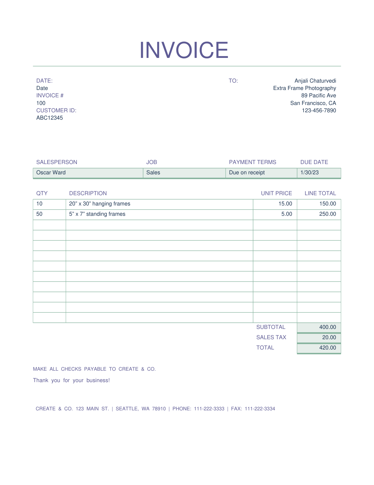
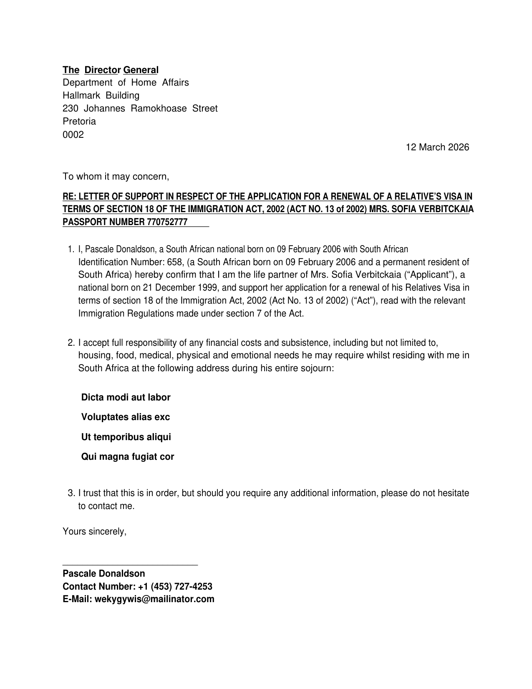

# MiniPdf vs Reference PDF Comparison Report

Generated: 2026-03-13T14:53:35.322538

## Summary

| # | Test Case | Text Sim | Visual Avg | Pages (M/R) | Overall |
|---|-----------|----------|------------|-------------|--------|
| 1 | 🟢 Invoice | 0.9570 | 0.9139 | 1/1 | **0.9484** |
| 2 | 🟢 Support_Letter | 1.0000 | 0.9555 | 1/1 | **0.9822** |

**Average Overall Score: 0.9653**

## Visual Comparison

<table>
<tr><th>MiniPdf</th><th>LibreOffice (Reference)</th></tr>
<tr>
  <td><b>Invoice</b></td>
  <td>Invoice ⬤ 94.8%</td>
</tr>
<tr>
  <td></td>
  <td></td>
</tr>
<tr><th>MiniPdf</th><th>LibreOffice (Reference)</th></tr>
<tr>
  <td><b>Support_Letter</b></td>
  <td>Support_Letter ⬤ 98.2%</td>
</tr>
<tr>
  <td></td>
  <td></td>
</tr>
</table>

