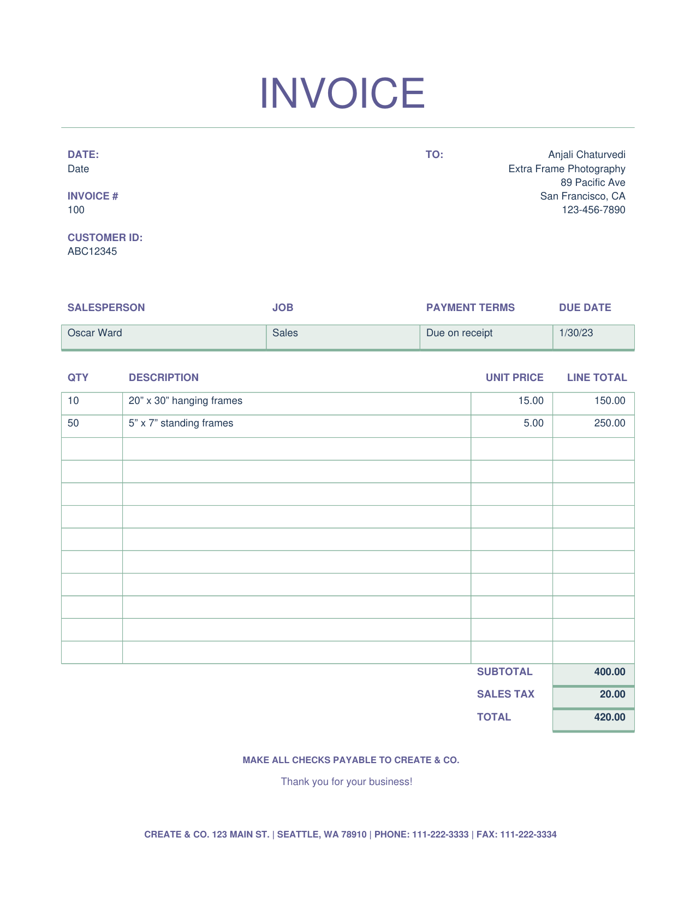
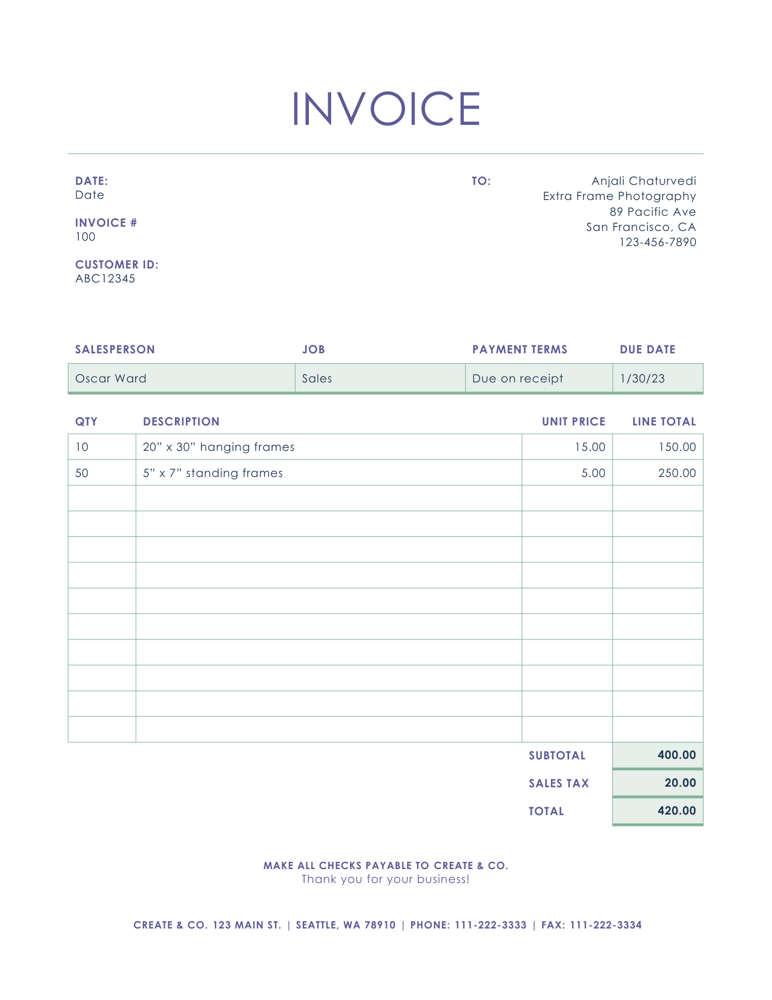
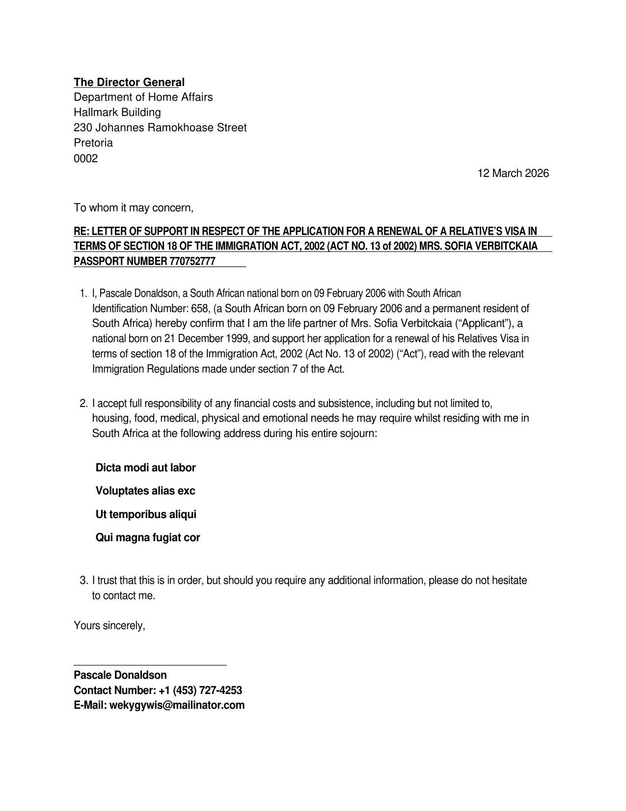
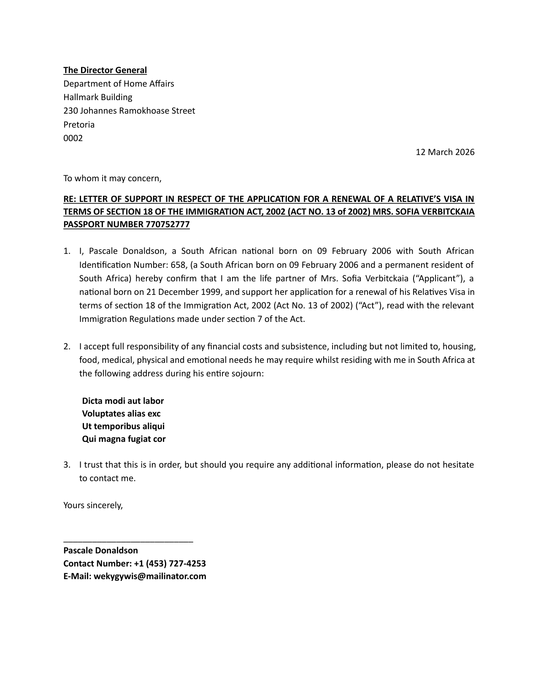

# MiniPdf vs Reference PDF Comparison Report

Generated: 2026-03-14T10:10:14.746128

## Summary

| # | Test Case | Text Sim | Visual Avg | Pages (M/R) | Overall |
|---|-----------|----------|------------|-------------|--------|
| 1 | 🟢 Invoice | 1.0 | 0.9518 | 1/1 | **0.9807** |
| 2 | 🟡 MODERN LIVING | 0.8326 | 0.7903 | 2/2 | **0.8492** |
| 3 | 🟢 SA8000 ch sample | 0.9362 | 0.9194 | 3/3 | **0.9422** |
| 4 | 🟢 Support_Letter | 1.0 | 0.9545 | 1/1 | **0.9818** |

**Average Overall Score: 0.9385**

## Visual Comparison

<table>
<tr><th>MiniPdf</th><th>LibreOffice (Reference)</th></tr>
<tr>
  <td><b>Invoice</b></td>
  <td>Invoice <span style="color:#3fb950">⬤</span> 98.1%</td>
</tr>
<tr>
  <td></td>
  <td></td>
</tr>
<tr>
  <td><b>MODERN LIVING</b></td>
  <td>MODERN LIVING <span style="color:#d29922">⬤</span> 84.9%</td>
</tr>
<tr>
  <td></td>
  <td></td>
</tr>
<tr>
  <td></td>
  <td></td>
</tr>
<tr>
  <td><b>SA8000 ch sample</b></td>
  <td>SA8000 ch sample <span style="color:#3fb950">⬤</span> 94.2%</td>
</tr>
<tr>
  <td></td>
  <td></td>
</tr>
<tr>
  <td></td>
  <td></td>
</tr>
<tr>
  <td></td>
  <td></td>
</tr>
<tr>
  <td><b>Support_Letter</b></td>
  <td>Support_Letter <span style="color:#3fb950">⬤</span> 98.2%</td>
</tr>
<tr>
  <td></td>
  <td></td>
</tr>
</table>

## Detailed Results

### Invoice

- **Text Similarity:** 1.0
- **Visual Average:** 0.9518
- **Overall Score:** 0.9807
- **Pages:** MiniPdf=1, Reference=1
- **File Size:** MiniPdf=20079 bytes, Reference=65867 bytes

<details><summary>Text Diff</summary>

```diff
--- minipdf/Invoice.pdf
+++ reference/Invoice.pdf
@@ -1,9 +1,12 @@
 INVOICE

 DATE: TO: Anjali Chaturvedi

-Date Extra Frame Photography

+Date

+Extra Frame Photography

 89 Pacific Ave

-INVOICE # San Francisco, CA

-100 123-456-7890

+INVOICE #

+San Francisco, CA

+100

+123-456-7890

 CUSTOMER ID:

 ABC12345

 SALESPERSON JOB PAYMENT TERMS DUE DATE

```
</details>

### MODERN LIVING

- **Text Similarity:** 0.8326
- **Visual Average:** 0.7903
- **Overall Score:** 0.8492
- **Pages:** MiniPdf=2, Reference=2
- **File Size:** MiniPdf=321328 bytes, Reference=220316 bytes

<details><summary>Text Diff</summary>

```diff
--- minipdf/MODERN LIVING.pdf
+++ reference/MODERN LIVING.pdf
@@ -1,22 +1,30 @@
-MODERN LIVING

 OCTOBER / 20XX / ISSUE #10

+M O D E R N  L I V I N G

 Your guide to buy or rent

 Ready to settle? WHAT’S NEW

 By Peyton Davis

-TAKE A LOOK INSIDE

+Newsletters are periodicals used to advertise or update your subscribers with TAKE A LOOK INSIDE

+information about your product or blog. They can be printed or emailed and

+Add description text here to get your

+are an excellent way to maintain regular contact with your subscribers and

+subscribers interested in your topic

+drive traffic to your site. Type the content of your newsletter here.

+PROPERTY TRENDS

 Newsletters are periodicals used to advertise or update your subscribers with

 Add description text here to get your

-information about your product or blog. They can be printed or emailed and

+information about your product or blog. They are an excellent way to

 subscribers interested in your topic

-are an excellent way to maintain regular contact with your subscribers and

-drive traffic to your site. Type the content of your newsletter here.

-PROPERTY TRENDS

-Newsletters are periodicals used to advertise or update your subscribers with Add description text here to get your

+maintain regular contact with your subscribers. Type the content of your

+newsletter here.

+ARE YOU READY TO

+Newsletters are periodicals used to advertise or update your subscribers with LIST?

+information about your product or blog. Type the content of your newsletter

+Add description text here to get your

+here.

 subscribers interested in your topic

-information about your product or blog. They are an excellent way to

-maintain regular contact with your subscribers. Type the content of your

 ---PAGE---

-Take a look inside Property trends

+Take a look inside

+Property trends

 By Vanja Jovanovic

 By Kemen Ikaztegieta

 Newsletters are periodicals used to advertise or update your

@@ -27,15 +35,15 @@
 Newsletters are periodicals use to advertise or update your

 subscribers with information about your product or blog. They

 can be printed or emailed and are an excellent way to maintain

-regular contact with your subscribers and drive traffic to your Newsletters are periodicals used to

-site. Type your content here. advertise or update your subscribers with

+Newsletters are periodicals used to

+regular contact with your subscribers and drive traffic to your

+advertise or update your subscribers with

+site. Type your content here.

 information about your product or blog.

-Newsletters are periodicals use to advertise or update your

-They can be printed or emailed and are an

+Newsletters are periodicals use to advertise or update your They can be printed or emailed and are an

+excellent way to maintain regular contact

 subscribers with information about your product or blog. Type

-excellent way to maintain regular contact

-the content of your newsletter here.

-with your subscriber
... (871 more characters)

```
</details>

### SA8000 ch sample

- **Text Similarity:** 0.9362
- **Visual Average:** 0.9194
- **Overall Score:** 0.9422
- **Pages:** MiniPdf=3, Reference=3
- **File Size:** MiniPdf=4178933 bytes, Reference=159484 bytes

<details><summary>Text Diff</summary>

```diff
--- minipdf/SA8000 ch sample.pdf
+++ reference/SA8000 ch sample.pdf
@@ -1,55 +1,55 @@
 SA8000 基础知识培训考试题

-部门： 工号： 姓名： 得分：

+部门：                工号：           姓名：            得分：

 一、判断题（共20 分，每题2 分）

-1、公司应在新员工入厂后一个月内与之签定劳动合同。（ √ ）

-2、劳动合同签订后如果员工需要则发给其一份，否公司可代为保管。（ × ）

-3、一般地说，公司的招聘广告不可有性别限制，法规允许的情形除外。（ √ ）

-4、公司员工每周至少要有一天休息。（ √ ）

-5、童工是指年龄在16 周岁以下的人（按照我国法律规定）。（ √ ）

-6、公司在员工辞职或解雇时应一次性把工资结算并支付。（ √ ）

-7、公司法定节假日安排上班的话，可以在其他时间安排调休。（ × ）

-8、当不同的法规、规章与SA8000 标准同一议题时，公司应遵守最严格的要求。（ √ ）

-9、根据劳动法规定，员工每月加班时间最多不超过36 小时。（ √ ）

-10、 某公司将职工食堂的饭票作为工资支付给职工。（ × ）

+1、公司应在新员工入厂后一个月内与之签定劳动合同。（ √  ）

+2、劳动合同签订后如果员工需要则发给其一份，否公司可代为保管。（  × ）

+3、一般地说，公司的招聘广告不可有性别限制，法规允许的情形除外。（  √   ）

+4、公司员工每周至少要有一天休息。（  √   ）

+5、 童工是指年龄在16 周岁以下的人（按照我国法律规定）。（  √   ）

+6、 公司在员工辞职或解雇时应一次性把工资结算并支付。（  √   ）

+7、 公司法定节假日安排上班的话，可以在其他时间安排调休。（  ×   ）

+8、 当不同的法规、规章与SA8000 标准同一议题时，公司应遵守最严格的要求。（  √    ）

+9、 根据劳动法规定，员工每月加班时间最多不超过36 小时。（  √    ）

+10、某公司将职工食堂的饭票作为工资支付给职工。（  ×   ）

 二、不定项选择题（共20 分，每题2 分）

-1、以下哪些形式属于强迫劳工（ ABD ）

-A、工厂对新员工要求扣押身份证一星期 B、工厂使用监狱劳工

-C、工厂只给1.2 倍的加班费 D、工厂要求员工晚上都加班，如果不加班就要罚款

-2、以下哪些属于特种作业，需要操作人员具有特种设备作业证（ ABCD ）

-A、电工作业 B、叉车 C、锅炉 D、电梯 E、冲床操作

-3、公司推行社会责任的好处（ ABC ）

-A、保护公司品牌形象 B、改善公司守法表现

-C、提高生产效率 D、避免股价上涨

-4、劳工标准包括（ ABCDE ）

-A、结社自由与集体谈判权 B、就业的自由选择权、禁止强迫劳动

-C、男女同工同酬的权利 D、禁止童工 E、合理的工作条件的权利

+1、以下哪些形式属于强迫劳工（ ABD  ）

+A、工厂对新员工要求扣押身份证一星期       B、工厂使用监狱劳工

+C、工厂只给1.2 倍的加班费                 D、工厂要求员工晚上都加班，如果不加班就要罚款

+2、以下哪些属于特种作业，需要操作人员具有特种设备作业证（ ABCD  ）

+A、电工作业      B、叉车    C、锅炉      D、电梯     E、冲床操作

+3、公司推行社会责任的好处（  ABC  ）

+A、保护公司品牌形象              B、改善公司守法表现

+C、提高生产效率                  D、避免股价上涨

+4、劳工标准包括（ ABCDE  ）

+A、结社自由与集体谈判权           B、就业的自由选择权、禁止强迫劳动

+C、男女同工同酬的权利      D、禁止童工      E、合理的工作条件的权利

 5、以下属于SA8000 标准要素的是（ ABCD ）

-A、童工 B、强迫性劳动 C、歧视 D、工作时间

-6、中国规定，未成年工是指任何年满 周岁但不满 周岁的工人（ B ）。

-A、14 , 16 B、16 , 18 C、16 ， 17 D、17 ， 18

-7、SA8000 标准中，强迫劳动说法正确的是（ B ）

-A、监狱劳动 B、标准禁止一切形式的强迫劳动

-C、契约劳动合法 D、抵债劳动

-8、社会责任管理体系审核的准则包括（ ABCD ）

-A、SA8000 社会责任国际标准； B、客户提供的供应商社会责任守则；

+A、童工     B、强迫性劳动        C、歧视          D、工作时间

+6、中国规定，未成年工是指任何年满     周岁但不满    周岁的工人（ B ）。

+A、14 , 16       B、16 , 18        C、16 ， 17      D、17 ， 18

+7、SA8000 标准中，强迫劳动说法正确的是（  B  ）

+A、监狱劳动                 B、标准禁止一切形式的强迫劳动

+C、契约劳动合法             D、抵债劳动

+8、社会责任管理体系审核的准则包括（  ABCD  ）

+A、SA8000 社会责任国际标准；    B、客户提供的供应商社会责任守则；

 C、适用的劳动保护及职业安全卫生法律法规和其他要求；

 D、公司社会责任管理手册，程序文件及其他社会责任管理体系文件。

-9、SA8000 现场审核包括（ ABCDE ）

-A、首次会议； B、收集审核证据； C、确定不符合项并编写不符合项报告；

-D、召开末次会议； E、宣布审核结果。

-10、公司应在新员工入厂后 ( A )个月内与之签定合同

-A、1 个月 B、二个月 C、3 个月 D、6 个月

+9、SA8000 现场审核包括（  ABCDE  ）

+A、首次会议；    B、收集审核证据； C、确定不符合项并编写不符合项报告；

+D、召开末次会议；  E、宣布审核结果。

+10、公司应在新员工入厂后 (  A  )个月内与之签定合同

+A、1 个月   B、二个月  C、3 个月   D、6 个月

 三、案例分析题（共10 分，每题5 分）

 针对以下事实描述分析是否违反社会责任要求，如果违反的话，请写出SA8000 的哪一条款。

-1、公司在运行SA8000 社会责任管理体系过程中，内审发现使用了2 名童工，公司的纠正措施是将2

-名童工立即开除。

+1、公司在运行SA8000 社会责任管理体系过程中，内审发现使用了2 名童工，公司的纠正措施

+是将2 名童工立即开除。

 STP 小组的含义是什么？

 ---PAGE---

 ISO45001 基础知识培训考试题

 一、 判断题（共20 分，每题2 分）

-1、一个管理十分严谨、设备精良并经消防主管部门审批合格的油库，在加强日常管理
... (2036 more characters)

```
</details>

### Support_Letter

- **Text Similarity:** 1.0
- **Visual Average:** 0.9545
- **Overall Score:** 0.9818
- **Pages:** MiniPdf=1, Reference=1
- **File Size:** MiniPdf=4145 bytes, Reference=61824 bytes

<details><summary>Text Diff</summary>

```diff
--- minipdf/Support_Letter.pdf
+++ reference/Support_Letter.pdf
@@ -9,15 +9,15 @@
 RE: LETTER OF SUPPORT IN RESPECT OF THE APPLICATION FOR A RENEWAL OF A RELATIVE’S VISA IN

 TERMS OF SECTION 18 OF THE IMMIGRATION ACT, 2002 (ACT NO. 13 of 2002) MRS. SOFIA VERBITCKAIA

 PASSPORT NUMBER 770752777

-1. I, Pascale Donaldson, a South African national born on 09 February 2006 with South African

+1. I,  Pascale Donaldson, a South African national born on 09 February 2006 with South African

 Identification Number: 658, (a South African born on 09 February 2006 and a permanent resident of

 South Africa) hereby confirm that I am the life partner of Mrs. Sofia Verbitckaia (“Applicant”), a

 national born on 21 December 1999, and support her application for a renewal of his Relatives Visa in

 terms of section 18 of the Immigration Act, 2002 (Act No. 13 of 2002) (“Act”), read with the relevant

 Immigration Regulations made under section 7 of the Act.

-2. I accept full responsibility of any financial costs and subsistence, including but not limited to,

-housing, food, medical, physical and emotional needs he may require whilst residing with me in

-South Africa at the following address during his entire sojourn:

+2. I accept full responsibility of any financial costs and subsistence, including but not limited to, housing,

+food, medical, physical and emotional needs he may require whilst residing with me in South Africa at

+the following address during his entire sojourn:

 Dicta modi aut labor

 Voluptates alias exc

 Ut temporibus aliqui

```
</details>

## Improvement Suggestions

All test cases scored 0.8 or above. 🎉
