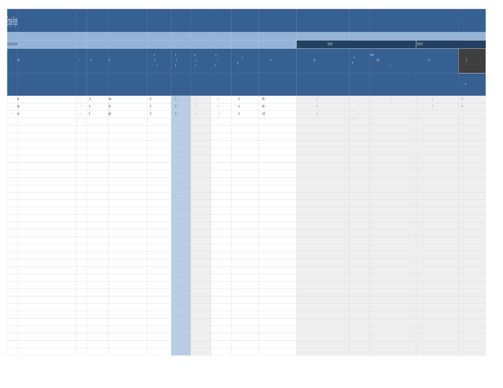
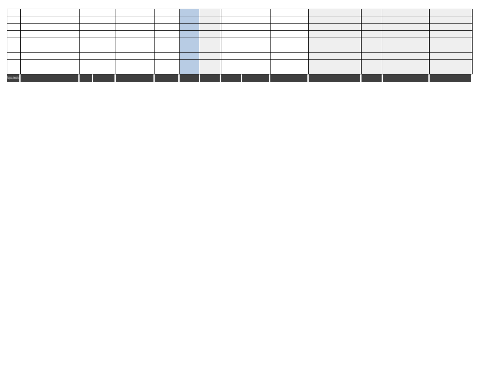
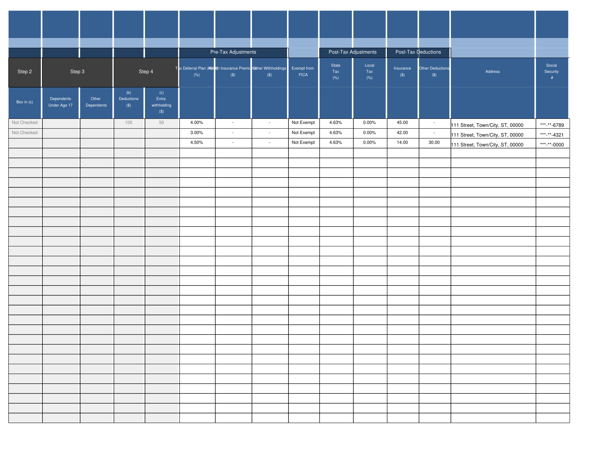
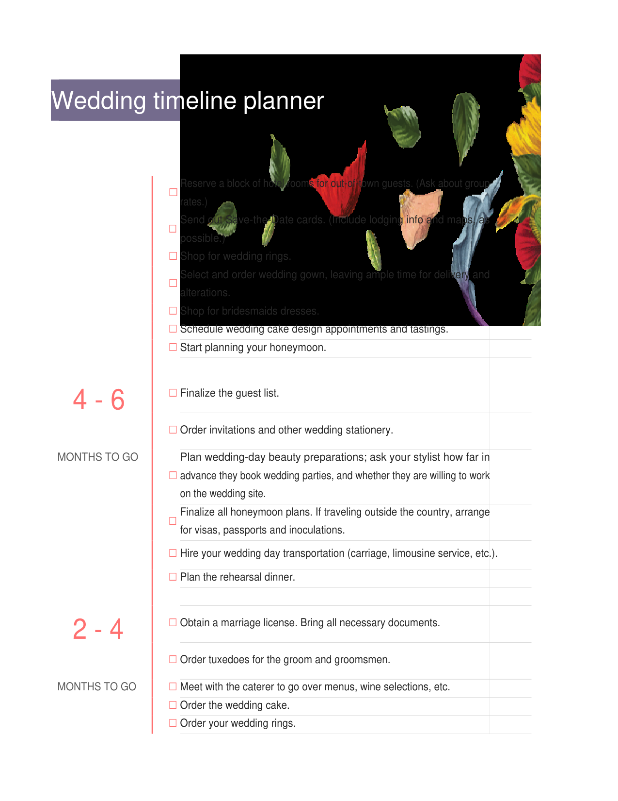
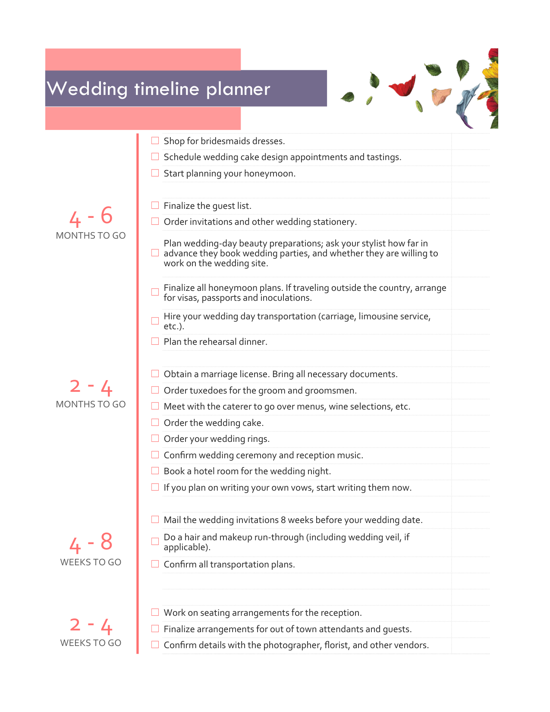
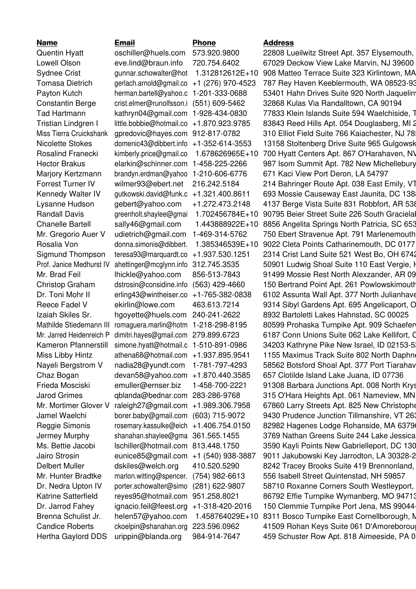
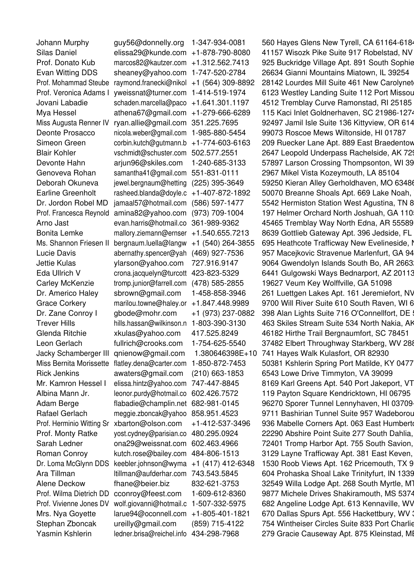

# MiniPdf vs Reference PDF Comparison Report

Generated: 2026-08-09T01:57:44.974922

## Summary

| # | Test Case | Valid | Text Sim | Visual Avg | Pages (M/R) | Overall |
|---|-----------|-------|----------|------------|-------------|--------|
| 1 | 🟢 Academic Achievement Summary Table | ✅ | 0.9785 | 0.9563 | 2/2 | **0.9739** |
| 2 | 🟢 AcademicAchievement_temp | ✅ | 0.9785 | 0.9563 | 2/2 | **0.9739** |
| 3 | 🟢 Business expense budget1 | ✅ | 0.9659 | 0.862 | 4/4 | **0.9312** |
| 4 | 🟡 Business expenses budget2 | ✅ | 0.9809 | 0.7259 | 4/4 | **0.8827** |
| 5 | 🟡 Business plan checklist with SWOT analysis1 | ✅ | 0.9915 | 0.5465 | 1/1 | **0.8152** |
| 6 | 🔴 Event budget1 | ✅ | 0.7597 | 0.6756 | 4/5 | **0.6741** |
| 7 | 🟡 Expense report basic1 | ✅ | 1.0 | 0.6359 | 1/1 | **0.8544** |
| 8 | 🟡 Grocery list1 | ✅ | 0.9231 | 0.7854 | 1/1 | **0.8834** |
| 9 | 🔴 payroll-calculator_f | ✅ | 0.7919 | 0.489 | 25/27 | **0.6124** |
| 10 | 🟡 PO_anonymized | ✅ | 0.9579 | 0.8221 | 9/8 | **0.812** |
| 11 | 🟡 Simple invoice1 | ✅ | 0.9223 | 0.7642 | 1/1 | **0.8746** |
| 12 | 🟡 Small business cash flow forecast1 | ✅ | 0.9739 | 0.5409 | 2/5 | **0.7059** |
| 13 | 🟡 Wedding_timeline_planner1_copy | ✅ | 0.9628 | 0.9046 | 4/5 | **0.847** |
| 14 | 🟡 Weekly schedule planner1 | ✅ | 0.9375 | 0.7364 | 1/1 | **0.8696** |
| 15 | 🟡 XlsxIssue75 | ✅ | 0.9672 | 0.953 | 114/144 | **0.8681** |
| 16 | 🟢 XlsxIssue77_MergedCellAlignment | ✅ | 1.0 | 0.8013 | 2/2 | **0.9205** |
| 17 | 🟢 XlsxIssue77_Template1 | ✅ | 1.0 | 0.8535 | 6/6 | **0.9414** |
| 18 | 🟢 XlsxIssue77_Template2_Workaround | ✅ | 1.0 | 0.8461 | 6/6 | **0.9384** |
| 19 | 🟢 XlsxIssue81_LayoutOptions | ✅ | 0.9879 | 0.889 | 16/16 | **0.9508** |
| 20 | 🔴 XlsxIssue82_5mb | ✅ | 0.1277 | 0.8157 | 722/766 | **0.4774** |
| 21 | 🔴 XlsxIssue82_SampleTestData5mb | ✅ | 0.4255 | 0.9146 | 834/1668 | **0.636** |
| 22 | 🟢 XlsxIssue82_WideTable | ✅ | 1.0 | 0.8648 | 13/13 | **0.9459** |

**Average Overall Score: 0.8359**

## Visual Comparison

<table>
<tr><th>MiniPdf</th><th>LibreOffice (Reference)</th></tr>
<tr>
  <td><b>Academic Achievement Summary Table<br><small>format: xlsx | case: Academic Achievement Summary Table | scope: issue-xlsx</small></b></td>
  <td colspan="1">Academic Achievement Summary Table <span style="color:#3fb950">⬤</span> 97.4%</td>
</tr>
<tr>
  <td></td>
  <td></td>
</tr>
<tr>
  <td></td>
  <td></td>
</tr>
<tr>
  <td><b>AcademicAchievement_temp<br><small>format: xlsx | case: AcademicAchievement_temp | scope: issue-xlsx</small></b></td>
  <td colspan="1">AcademicAchievement_temp <span style="color:#3fb950">⬤</span> 97.4%</td>
</tr>
<tr>
  <td></td>
  <td></td>
</tr>
<tr>
  <td></td>
  <td></td>
</tr>
<tr>
  <td><b>Business expense budget1<br><small>format: xlsx | case: Business expense budget1 | scope: issue-xlsx</small></b></td>
  <td colspan="1">Business expense budget1 <span style="color:#3fb950">⬤</span> 93.1%</td>
</tr>
<tr>
  <td></td>
  <td></td>
</tr>
<tr>
  <td></td>
  <td></td>
</tr>
<tr>
  <td></td>
  <td></td>
</tr>
<tr>
  <td><b>Business expenses budget2<br><small>format: xlsx | case: Business expenses budget2 | scope: issue-xlsx</small></b></td>
  <td colspan="1">Business expenses budget2 <span style="color:#d29922">⬤</span> 88.3%</td>
</tr>
<tr>
  <td></td>
  <td></td>
</tr>
<tr>
  <td></td>
  <td></td>
</tr>
<tr>
  <td></td>
  <td></td>
</tr>
<tr>
  <td></td>
  <td></td>
</tr>
<tr>
  <td><b>Business plan checklist with SWOT analysis1<br><small>format: xlsx | case: Business plan checklist with SWOT analysis1 | scope: issue-xlsx</small></b></td>
  <td colspan="1">Business plan checklist with SWOT analysis1 <span style="color:#d29922">⬤</span> 81.5%</td>
</tr>
<tr>
  <td></td>
  <td></td>
</tr>
<tr>
  <td><b>Event budget1<br><small>format: xlsx | case: Event budget1 | scope: issue-xlsx</small></b></td>
  <td colspan="1">Event budget1 <span style="color:#f85149">⬤</span> 67.4%</td>
</tr>
<tr>
  <td></td>
  <td></td>
</tr>
<tr>
  <td></td>
  <td></td>
</tr>
<tr>
  <td></td>
  <td></td>
</tr>
<tr>
  <td><b>Expense report basic1<br><small>format: xlsx | case: Expense report basic1 | scope: issue-xlsx</small></b></td>
  <td colspan="1">Expense report basic1 <span style="color:#d29922">⬤</span> 85.4%</td>
</tr>
<tr>
  <td></td>
  <td></td>
</tr>
<tr>
  <td><b>Grocery list1<br><small>format: xlsx | case: Grocery list1 | scope: issue-xlsx</small></b></td>
  <td colspan="1">Grocery list1 <span style="color:#d29922">⬤</span> 88.3%</td>
</tr>
<tr>
  <td></td>
  <td></td>
</tr>
<tr>
  <td><b>payroll-calculator_f<br><small>format: xlsx | case: payroll-calculator_f | scope: issue-xlsx</small></b></td>
  <td colspan="1">payroll-calculator_f <span style="color:#f85149">⬤</span> 61.2%</td>
</tr>
<tr>
  <td></td>
  <td></td>
</tr>
<tr>
  <td></td>
  <td></td>
</tr>
<tr>
  <td></td>
  <td></td>
</tr>
<tr>
  <td><b>PO_anonymized<br><small>format: xlsx | case: PO_anonymized | scope: issue-xlsx</small></b></td>
  <td colspan="1">PO_anonymized <span style="color:#d29922">⬤</span> 81.2%</td>
</tr>
<tr>
  <td></td>
  <td></td>
</tr>
<tr>
  <td></td>
  <td></td>
</tr>
<tr>
  <td></td>
  <td></td>
</tr>
<tr>
  <td><b>Simple invoice1<br><small>format: xlsx | case: Simple invoice1 | scope: issue-xlsx</small></b></td>
  <td colspan="1">Simple invoice1 <span style="color:#d29922">⬤</span> 87.5%</td>
</tr>
<tr>
  <td></td>
  <td></td>
</tr>
<tr>
  <td><b>Small business cash flow forecast1<br><small>format: xlsx | case: Small business cash flow forecast1 | scope: issue-xlsx</small></b></td>
  <td colspan="1">Small business cash flow forecast1 <span style="color:#d29922">⬤</span> 70.6%</td>
</tr>
<tr>
  <td></td>
  <td></td>
</tr>
<tr>
  <td></td>
  <td></td>
</tr>
<tr>
  <td><i>missing</i></td>
  <td></td>
</tr>
<tr>
  <td><b>Wedding_timeline_planner1_copy<br><small>format: xlsx | case: Wedding_timeline_planner1_copy | scope: issue-xlsx</small></b></td>
  <td colspan="1">Wedding_timeline_planner1_copy <span style="color:#d29922">⬤</span> 84.7%</td>
</tr>
<tr>
  <td></td>
  <td></td>
</tr>
<tr>
  <td></td>
  <td></td>
</tr>
<tr>
  <td></td>
  <td></td>
</tr>
<tr>
  <td><b>Weekly schedule planner1<br><small>format: xlsx | case: Weekly schedule planner1 | scope: issue-xlsx</small></b></td>
  <td colspan="1">Weekly schedule planner1 <span style="color:#d29922">⬤</span> 87.0%</td>
</tr>
<tr>
  <td></td>
  <td></td>
</tr>
<tr>
  <td><b>XlsxIssue75<br><small>format: xlsx | case: XlsxIssue75 | scope: issue-xlsx</small></b></td>
  <td colspan="1">XlsxIssue75 <span style="color:#d29922">⬤</span> 86.8%</td>
</tr>
<tr>
  <td></td>
  <td></td>
</tr>
<tr>
  <td></td>
  <td></td>
</tr>
<tr>
  <td></td>
  <td></td>
</tr>
<tr>
  <td><b>XlsxIssue77_MergedCellAlignment<br><small>format: xlsx | case: XlsxIssue77_MergedCellAlignment | scope: issue-xlsx</small></b></td>
  <td colspan="1">XlsxIssue77_MergedCellAlignment <span style="color:#3fb950">⬤</span> 92.0%</td>
</tr>
<tr>
  <td></td>
  <td></td>
</tr>
<tr>
  <td></td>
  <td></td>
</tr>
<tr>
  <td><b>XlsxIssue77_Template1<br><small>format: xlsx | case: XlsxIssue77_Template1 | scope: issue-xlsx</small></b></td>
  <td colspan="1">XlsxIssue77_Template1 <span style="color:#3fb950">⬤</span> 94.1%</td>
</tr>
<tr>
  <td></td>
  <td></td>
</tr>
<tr>
  <td></td>
  <td></td>
</tr>
<tr>
  <td></td>
  <td></td>
</tr>
<tr>
  <td><b>XlsxIssue77_Template2_Workaround<br><small>format: xlsx | case: XlsxIssue77_Template2_Workaround | scope: issue-xlsx</small></b></td>
  <td colspan="1">XlsxIssue77_Template2_Workaround <span style="color:#3fb950">⬤</span> 93.8%</td>
</tr>
<tr>
  <td></td>
  <td></td>
</tr>
<tr>
  <td></td>
  <td></td>
</tr>
<tr>
  <td></td>
  <td></td>
</tr>
<tr>
  <td><b>XlsxIssue81_LayoutOptions<br><small>format: xlsx | case: XlsxIssue81_LayoutOptions | scope: issue-xlsx</small></b></td>
  <td colspan="1">XlsxIssue81_LayoutOptions <span style="color:#3fb950">⬤</span> 95.1%</td>
</tr>
<tr>
  <td></td>
  <td></td>
</tr>
<tr>
  <td></td>
  <td></td>
</tr>
<tr>
  <td></td>
  <td></td>
</tr>
<tr>
  <td><b>XlsxIssue82_5mb<br><small>format: xlsx | case: XlsxIssue82_5mb | scope: issue-xlsx</small></b></td>
  <td colspan="1">XlsxIssue82_5mb <span style="color:#f85149">⬤</span> 47.7%</td>
</tr>
<tr>
  <td></td>
  <td></td>
</tr>
<tr>
  <td></td>
  <td></td>
</tr>
<tr>
  <td></td>
  <td></td>
</tr>
<tr>
  <td><b>XlsxIssue82_SampleTestData5mb<br><small>format: xlsx | case: XlsxIssue82_SampleTestData5mb | scope: issue-xlsx</small></b></td>
  <td colspan="1">XlsxIssue82_SampleTestData5mb <span style="color:#f85149">⬤</span> 63.6%</td>
</tr>
<tr>
  <td></td>
  <td></td>
</tr>
<tr>
  <td></td>
  <td></td>
</tr>
<tr>
  <td></td>
  <td></td>
</tr>
<tr>
  <td><b>XlsxIssue82_WideTable<br><small>format: xlsx | case: XlsxIssue82_WideTable | scope: issue-xlsx</small></b></td>
  <td colspan="1">XlsxIssue82_WideTable <span style="color:#3fb950">⬤</span> 94.6%</td>
</tr>
<tr>
  <td></td>
  <td></td>
</tr>
<tr>
  <td></td>
  <td></td>
</tr>
<tr>
  <td></td>
  <td></td>
</tr>
</table>

## Detailed Results

### Academic Achievement Summary Table

- **Case Metadata:** format: xlsx | case: Academic Achievement Summary Table | scope: issue-xlsx
- **Text Similarity:** 0.9785
- **Visual Average:** 0.9563
- **Overall Score:** 0.9739
- **Pages:** MiniPdf=2, Reference=2
- **File Size:** MiniPdf=373862 bytes, Reference=168612 bytes

<details><summary>Text Diff</summary>

```diff
--- minipdf/Academic Achievement Summary Table.pdf
+++ reference/Academic Achievement Summary Table.pdf
@@ -2,10 +2,10 @@
 学 术业绩汇总 表

 报考岗位： 报考岗位代码： 考生姓名：

 博士论文题目： 博士论文研究方向：

-公开 发 表的主要 论文情况

-角色 转载刊物、转载字数及转 是否为代表作

+公开 发 表的主要 论 文情况

+角色 转载刊物、转载字数及 是否为代表作

 序号 题目 刊物名称 核心期刊情况 刊号 发表时间

-（排名） 载时间等 （指定1篇）

+（排名） 转载时间等 （指定1篇）

 1

 2

 3

@@ -19,19 +19,19 @@
 11

 12

 ---PAGE---

-公开出版的主要 专 （ 译 ）著、教材情况

-角色 全书文字 本人写作 转载刊物、转载字数及转

+公开出版的主要 专译 （ ）著、教材情况

+角色 全书文 本人写 转载刊物、转载字数及

 序号 题目 出版社名称 出版号 出版时间 备注

-（排名） 数 量 载时间等

+（排名） 字数 作量 转载时间等

 1

 2

-获 批的决策咨 询 报 告情况

+获 批的决策咨 询报 告情况

 序号 题目 批示领导级别 获批时间 角色（排名） 备注

 1

 2

 3

 4

-承担的主要科研 课 题情况

+承担的主要科研 课题 情况

 项目

 序号 课题名称 项目来源 课题编号 角色（排名） 起止时间 成果鉴定（评价） 备注

 级别

@@ -40,8 +40,8 @@
 3

 4

 本人承 诺 以上情况属 实 ，并有相 应证 明。如有不 实 之 处 ，愿意承担相 应责 任。

-报名人 员签 名：

+报 名人 员签 名：

 日期：    年   月   日

-填表 说 明：1. 请 将各 类 学 术 成果按等 级、 层 次及水平自高到低 顺 序填写。不加行、减行，不加 页 、减 页 ，本表采用A4正反面打印。

-2.核心期刊是指北京大学 图 书 馆 “中文核心期刊”、南京大学“中文社会科学引文索引（CSSCI）来源期刊”（含 扩 展版、集刊）、中国科学技 术 信息研究所

-“中国科技 论文 统计 源期刊”和科学引文索引（SCI）、社会科学引文索引（SSCI）。其中，被SCI、SSCI收 录 的期刊要求 进 入所在学科 领 域Q1、Q2。
+填表 说 明： 1. 请 将各 类 学 术 成果按等 级层 、 次及水平自高到低 顺 序填写。不加行、减行，不加 页 、减 页 ，本表采用 A4正反面打印。

+2.核心期刊是指北京大学 图书馆 “中文核心期刊”、南京大学“中文社会科学引文索引（ CSSCI）来源期刊”（含 扩 展版、集刊）、中国科学技 术 信息研究所

+“中国科技 论 文 统计 源期刊”和科学引文索引（ SCI）、社会科学引文索引（SSCI）。其中，被SCI、SSCI收 录 的期刊要求 进 入所在学科 领 域 Q1、Q2。
```
</details>

### AcademicAchievement_temp

- **Case Metadata:** format: xlsx | case: AcademicAchievement_temp | scope: issue-xlsx
- **Text Similarity:** 0.9785
- **Visual Average:** 0.9563
- **Overall Score:** 0.9739
- **Pages:** MiniPdf=2, Reference=2
- **File Size:** MiniPdf=373862 bytes, Reference=168612 bytes

<details><summary>Text Diff</summary>

```diff
--- minipdf/AcademicAchievement_temp.pdf
+++ reference/AcademicAchievement_temp.pdf
@@ -2,10 +2,10 @@
 学 术业绩汇总 表

 报考岗位： 报考岗位代码： 考生姓名：

 博士论文题目： 博士论文研究方向：

-公开 发 表的主要 论文情况

-角色 转载刊物、转载字数及转 是否为代表作

+公开 发 表的主要 论 文情况

+角色 转载刊物、转载字数及 是否为代表作

 序号 题目 刊物名称 核心期刊情况 刊号 发表时间

-（排名） 载时间等 （指定1篇）

+（排名） 转载时间等 （指定1篇）

 1

 2

 3

@@ -19,19 +19,19 @@
 11

 12

 ---PAGE---

-公开出版的主要 专 （ 译 ）著、教材情况

-角色 全书文字 本人写作 转载刊物、转载字数及转

+公开出版的主要 专译 （ ）著、教材情况

+角色 全书文 本人写 转载刊物、转载字数及

 序号 题目 出版社名称 出版号 出版时间 备注

-（排名） 数 量 载时间等

+（排名） 字数 作量 转载时间等

 1

 2

-获 批的决策咨 询 报 告情况

+获 批的决策咨 询报 告情况

 序号 题目 批示领导级别 获批时间 角色（排名） 备注

 1

 2

 3

 4

-承担的主要科研 课 题情况

+承担的主要科研 课题 情况

 项目

 序号 课题名称 项目来源 课题编号 角色（排名） 起止时间 成果鉴定（评价） 备注

 级别

@@ -40,8 +40,8 @@
 3

 4

 本人承 诺 以上情况属 实 ，并有相 应证 明。如有不 实 之 处 ，愿意承担相 应责 任。

-报名人 员签 名：

+报 名人 员签 名：

 日期：    年   月   日

-填表 说 明：1. 请 将各 类 学 术 成果按等 级、 层 次及水平自高到低 顺 序填写。不加行、减行，不加 页 、减 页 ，本表采用A4正反面打印。

-2.核心期刊是指北京大学 图 书 馆 “中文核心期刊”、南京大学“中文社会科学引文索引（CSSCI）来源期刊”（含 扩 展版、集刊）、中国科学技 术 信息研究所

-“中国科技 论文 统计 源期刊”和科学引文索引（SCI）、社会科学引文索引（SSCI）。其中，被SCI、SSCI收 录 的期刊要求 进 入所在学科 领 域Q1、Q2。
+填表 说 明： 1. 请 将各 类 学 术 成果按等 级层 、 次及水平自高到低 顺 序填写。不加行、减行，不加 页 、减 页 ，本表采用 A4正反面打印。

+2.核心期刊是指北京大学 图书馆 “中文核心期刊”、南京大学“中文社会科学引文索引（ CSSCI）来源期刊”（含 扩 展版、集刊）、中国科学技 术 信息研究所

+“中国科技 论 文 统计 源期刊”和科学引文索引（ SCI）、社会科学引文索引（SSCI）。其中，被SCI、SSCI收 录 的期刊要求 进 入所在学科 领 域 Q1、Q2。
```
</details>

### Business expense budget1

- **Case Metadata:** format: xlsx | case: Business expense budget1 | scope: issue-xlsx
- **Text Similarity:** 0.9659
- **Visual Average:** 0.862
- **Overall Score:** 0.9312
- **Pages:** MiniPdf=4, Reference=4
- **File Size:** MiniPdf=78716 bytes, Reference=173721 bytes

<details><summary>Text Diff</summary>

```diff
--- minipdf/Business expense budget1.pdf
+++ reference/Business expense budget1.pdf
@@ -41,17 +41,7 @@
 Travel & Entertainment 24700 22100

 Professional Services 24600 23400

 Budget vs Actual by Category

-Total Budget Total Actual

-140000

-120000

-100000

-80000

-60000

 Amount (\$)

-40000

-20000

-0

-Personnel Operations Marketing Travel & Entertainment Professional Services

 Category

 ---PAGE---

 Q2 ACTUAL VARIANCE

```
</details>

### Business expenses budget2

- **Case Metadata:** format: xlsx | case: Business expenses budget2 | scope: issue-xlsx
- **Text Similarity:** 0.9809
- **Visual Average:** 0.7259
- **Overall Score:** 0.8827
- **Pages:** MiniPdf=4, Reference=4
- **File Size:** MiniPdf=641382 bytes, Reference=402762 bytes

<details><summary>Text Diff</summary>

```diff
--- minipdf/Business expenses budget2.pdf
+++ reference/Business expenses budget2.pdf
@@ -1,109 +1,109 @@
 Market Financial Consulting

 PLANNED EXPENSES

 January February March April May June July August September October November December Total

-EMPLOYEE COSTS $ 107,950.00 $ 107,950.00 $ 107,950.00 $ 111,125.00 $ 111,125.00 $ 111,125.00 $ 111,125.00 $ 117,348.00 $ 117,348.00 $ 117,348.00 $ 117,348.00 $ 117,348.00 $1,355,090.00

-Wages $ 85,000.00 $ 85,000.00 $ 85,000.00 $ 87,500.00 $ 87,500.00 $ 87,500.00 $ 87,500.00 $ 92,400.00 $ 92,400.00 $ 92,400.00 $ 92,400.00 $ 92,400.00 $1,067,000.00

+EMPLOYEE COSTS $ 107,950.00 $ 107,950.00 $ 107,950.00 $ 111,125.00 $ 111,125.00 $ 111,125.00 $ 111,125.00 $ 117,348.00 $ 117,348.00 $ 117,348.00 $ 117,348.00 $ 117,348.00 $ 1,355,090.00

+Wages $ 85,000.00 $ 85,000.00 $ 85,000.00 $ 87,500.00 $ 87,500.00 $ 87,500.00 $ 87,500.00 $ 92,400.00 $ 92,400.00 $ 92,400.00 $ 92,400.00 $ 92,400.00 $ 1,067,000.00

 Benefits $ 22,950.00 $ 22,950.00 $ 22,950.00 $ 23,625.00 $ 23,625.00 $ 23,625.00 $ 23,625.00 $ 24,948.00 $ 24,948.00 $ 24,948.00 $ 24,948.00 $ 24,948.00 $ 288,090.00

 OFFICE COSTS $ 11,370.00 $ 11,770.00 $ 11,770.00 $ 11,470.00 $ 11,470.00 $ 11,470.00 $ 11,470.00 $ 11,470.00 $ 11,470.00 $ 11,470.00 $ 11,770.00 $ 11,770.00 $ 138,740.00

-Office lease $ 9,800.00  $ 9,800.00  $ 9,800.00  $ 9,800.00  $ 9,800.00  $ 9,800.00  $ 9,800.00  $ 9,800.00  $ 9,800.00  $ 9,800.00  $ 9,800.00  $ 9,800.00  $ 117,600.00

-Gas $ -    $ 400.00  $ 400.00  $ 100.00  $ 100.00  $ 100.00  $ 100.00  $ 100.00  $ 100.00  $ 100.00  $ 400.00  $ 400.00  $ 2,300.00

-Electric $ 300.00  $ 300.00  $ 300.00  $ 300.00  $ 300.00  $ 300.00  $ 300.00  $ 300.00  $ 300.00  $ 300.00  $ 300.00  $ 300.00  $ 3,600.00

-Water $ 40.00  $ 40.00  $ 40.00  $ 40.00  $ 40.00  $ 40.00  $ 40.00  $ 40.00  $ 40.00  $ 40.00  $ 40.00  $ 40.00  $ 480.00

-Telephone $ 250.00  $ 250.00  $ 250.00  $ 250.00  $ 250.00  $ 250.00  $ 250.00  $ 250.00  $ 250.00  $ 250.00  $ 250.00  $ 250.00  $ 3,000.00

-Internet access $ 180.00  $ 180.00  $ 180.00  $ 180.00  $ 180.00  $ 180.00  $ 180.00  $ 180.00  $ 180.00  $ 180.00  $ 180.00  $ 180.00  $ 2,160.00

-Office supplies $ 200.00  $ 200.00  $ 200.00  $ 200.00  $ 200.00  $ 200.00  $ 200.00  $ 200.00  $ 200.00  $ 200.00  $ 200.00  $ 200.00  $ 2,400.00

-Security $ 600.00  $ 600.00  $ 600.00  $ 600.00  $ 600.00  $ 600.00  $ 600.00  $ 600.00  $ 600.00  $ 600.00  $ 600.00  $ 600.00  $ 7,200.00

-MARKETING COSTS $ 8,100.00  $ 3,100.00  $ 3,100.00  $ 11,100.00 $ 3,100.00  $ 3,900.00  $ 8,100.00  $ 6,100.00  $ 3,100.00  $ 8,100.00  $ 3,100.00  $ 6,900.00  $ 67,800.00

-Web site hosting $ 500.00  $ 500.00  $ 500.00  $ 500.00  $ 500.00  $ 500.00  $ 500.00  $ 500.00  $ 500.00  $ 500.00  $ 500.00  $ 500.00  $ 6,000.00

-Web site updates $ 200.00  $ 200.00  $ 200.00  $ 200.00  $ 200.00  $ 1,000.00  $ 200.00  $ 200.00  $ 200.00  $ 200.00  $ 200.00  $ 1,000.00  $ 4,000.00

-Collateral preparation $ 5,000.00  $ -    $ -    $ 5,000.00  $ -    
... (13476 more characters)

```
</details>

### Business plan checklist with SWOT analysis1

- **Case Metadata:** format: xlsx | case: Business plan checklist with SWOT analysis1 | scope: issue-xlsx
- **Text Similarity:** 0.9915
- **Visual Average:** 0.5465
- **Overall Score:** 0.8152
- **Pages:** MiniPdf=1, Reference=1
- **File Size:** MiniPdf=43874 bytes, Reference=64357 bytes

<details><summary>Text Diff</summary>

```diff
--- minipdf/Business plan checklist with SWOT analysis1.pdf
+++ reference/Business plan checklist with SWOT analysis1.pdf
@@ -6,9 +6,9 @@
 Strengths: Define the company's current mission

 Luca Richter 1/9/2023

 statement.

-Strengths: Identify market segments in which the

-company will participate by conducting primary and Dylan Williams 1/9/2023

-secondary market research.

+Strengths: Identify market segments in which the company

+will participate by conducting primary and secondary market Dylan Williams 1/9/2023

+research.

 Strengths: Identify the company's value proposition and

 Kristin Orav 1/16/2023

 how it will differentiate itself within the marketplace.

```
</details>

### Event budget1

- **Case Metadata:** format: xlsx | case: Event budget1 | scope: issue-xlsx
- **Text Similarity:** 0.7597
- **Visual Average:** 0.6756
- **Overall Score:** 0.6741
- **Pages:** MiniPdf=4, Reference=5
- **File Size:** MiniPdf=136354 bytes, Reference=121226 bytes

<details><summary>Text Diff</summary>

```diff
--- minipdf/Event budget1.pdf
+++ reference/Event budget1.pdf
@@ -1,16 +1,16 @@
 ABOUT THIS TEMPLATE

-Use this event budget workbook to track expenses incurred on and income earned from an event.

+Use this event budget workbook to track expenses incurred on and income earned from an

+event.

 Enter details in tables in expenses worksheet and income worksheet.

 Total expenses and total income are auto-calculated.

 Profit & loss summary and chart are auto-updated in profit-loss summary worksheet.

 Note:

-Additional instructions have been provided in column A in each worksheet. This text has been intentionally hidden. To

-remove text, select column A, then select DELETE.

-To learn more about tables, press SHIFT and then F10 within a table, select the TABLE option, and then select

-ALTERNATIVE TEXT

+Additional instructions have been provided in column A in each worksheet. This text has been

+intentionally hidden. To remove text, select column A, then select DELETE.

+To learn more about tables, press SHIFT and then F10 within a table, select the TABLE option, and

+then select ALTERNATIVE TEXT

 ---PAGE---

-EXPENSES

-Event budget

+Event budget EXPENSES

 Estimated Actual

 TOTAL EXPENSES

 $882.00 $333.00

@@ -38,34 +38,4 @@
 Stationery supplies

 Fax services

 Total $12.00 $13.00

----PAGE---

-INCOME

-Event budget

-Estimated Actual

-TOTAL INCOME

-$1,936.00 $1,831.00

-ADMISSIONS

-Estimated no. Actual no. Type Price Estimated income Actual income

-300 278 Adults @ $5.00 $1,500.00 $1,390.00

-197 195 Children @ $2.00 $394.00 $390.00

-42 51 Other @ $1.00 $42.00 $51.00

-Total $1,936.00 $1,831.00

-ADS IN PROGRAM

-Estimated no. Actual no. Type Price Estimated income Actual income

-Covers @ $0.00 $0.00

-Half-pages @ $0.00 $0.00

-Quarter-pages @ $0.00 $0.00

-Total $0.00 $0.00

-EXHIBITORS/VENDORS

-Estimated no. Actual no. Type Price Estimated income Actual income

-Large booths @ $0.00 $0.00

-Med. booths @ $0.00 $0.00

-Small booths @ $0.00 $0.00

-Total $0.00 $0.00

-SALE OF ITEMS

-Estimated no. Actual no. Type Price Estimated income Actual income

-Items @ $0.00 $0.00

-Items @ $0.00 $0.00

-Items @ $0.00 $0.00

-Items @ $0.00 $0.00

-Total $0.00 $0.00
+---PAGE---
```
</details>

### Expense report basic1

- **Case Metadata:** format: xlsx | case: Expense report basic1 | scope: issue-xlsx
- **Text Similarity:** 1.0
- **Visual Average:** 0.6359
- **Overall Score:** 0.8544
- **Pages:** MiniPdf=1, Reference=1
- **File Size:** MiniPdf=60976 bytes, Reference=47897 bytes

Text content: ✅ Identical

### Grocery list1

- **Case Metadata:** format: xlsx | case: Grocery list1 | scope: issue-xlsx
- **Text Similarity:** 0.9231
- **Visual Average:** 0.7854
- **Overall Score:** 0.8834
- **Pages:** MiniPdf=1, Reference=1
- **File Size:** MiniPdf=107230 bytes, Reference=86288 bytes

<details><summary>Text Diff</summary>

```diff
--- minipdf/Grocery list1.pdf
+++ reference/Grocery list1.pdf
@@ -1,25 +1,38 @@
 ORCHARD GROCERY HOME DELIVERY LOCAL MARKET OTHER GRAND TOTAL

 GROCERY LIST

-Customize this list. Replace the entries above with your own to track your most frequently

-$11.95 $6.12 $31.85 $216.60 $3.99 $270.51

-used categories.

+Customize this list. Replace the entries above with your own to track your most $11.95 $6.12 $31.85 $216.60 $3.99 $270.51

+frequently used categories.

 DONE? ITEM STORE CATEGORY QTY UNIT UNIT PRICE TOTAL NOTE

 Yes Peaches Azure River Farm ORCHARD 2 lbs $2.99 $5.98

 Yes Apples Azure River Farm ORCHARD 3 lbs $1.99 $5.97 Have coupon

 Bananas Wide World Importers OTHER 1 bunch $3.99 $3.99

-Yes Lettuce Market LOCAL MARKET 2 head $2.29 $4.58

+LOCAL

+Yes Lettuce Market 2 head $2.29 $4.58

+MARKET

 Tomatoes Market LOCAL MARKET 4 lbs $3.49 $13.96

-Yes Squash Market LOCAL MARKET 2 each $1.50 $3.00

-Yes Celery Wide World Importers LOCAL MARKET 2 bunch $1.99 $3.98

+LOCAL

+Yes Squash Market 2 each $1.50 $3.00

+MARKET

+LOCAL

+Yes Celery Wide World Importers 2 bunch $1.99 $3.98

+MARKET

 Cucumber Market LOCAL MARKET 1 lbs $2.29 $2.29

 Mushrooms Wide World Importers GROCERY 0.5 lbs $2.25 $1.13

-Yes Milk Local Farmer HOME DELIVERY 2 gal $3.99 $7.98

-Variety of block

-Yes Cheese Local Farmer HOME DELIVERY 1 lbs $9.99 $9.99

-cheeses

-Yes Eggs Local Farmer HOME DELIVERY 2 doz $3.50 $7.00

-Yes Cottage cheese Local Farmer HOME DELIVERY 1 16 oz $3.89 $3.89

-Yes Sour cream Local Farmer HOME DELIVERY 1 8 oz $2.99 $2.99

+HOME

+Yes Milk Local Farmer 2 gal $3.99 $7.98

+DELIVERY

+HOME Variety of

+Yes Cheese Local Farmer 1 lbs $9.99 $9.99

+DELIVERY block cheeses

+HOME

+Yes Eggs Local Farmer 2 doz $3.50 $7.00

+DELIVERY

+HOME

+Yes Cottage cheese Local Farmer 1 16 oz $3.89 $3.89

+DELIVERY

+HOME

+Yes Sour cream Local Farmer 1 8 oz $2.99 $2.99

+DELIVERY

 Yogurt Wide World Importers GROCERY 1 16 oz $4.99 $4.99 Greek with honey

 Bacon wrapped

 Beef Farmer's Market LOCAL MARKET 10 lbs $7.99 $79.90

```
</details>

### payroll-calculator_f

- **Case Metadata:** format: xlsx | case: payroll-calculator_f | scope: issue-xlsx
- **Text Similarity:** 0.7919
- **Visual Average:** 0.489
- **Overall Score:** 0.6124
- **Pages:** MiniPdf=25, Reference=27
- **File Size:** MiniPdf=3129731 bytes, Reference=540676 bytes

<details><summary>Text Diff</summary>

```diff
--- minipdf/payroll-calculator_f.pdf
+++ reference/payroll-calculator_f.pdf
@@ -1,40 +1,48 @@
 Employee Register

-Information contained in this employee register is highly confidential Filing Status (W-4 before 2020) Filing Status (W-4 from 2020 or later)

-Step 2 Step 3 Step 4

-Annual Regular Overtime Exempt Additional Amount to Withhold

-(b)

-Pay Federal

-ID Employee's Name M/F Hire Date Occupation Salary Hourly Hourly from W-4 Form Filing Status (With every paycheck) Filing Status

-Dependents Other Deductions

-Frequency Allowance

-Box in (c)

-($) Rate ($) Rate ($) Overtime ($)

-Under Age 17 Dependents ($)

-1 Adam Jones M 15-Feb-13 Senior Accountant 42,000.00 20.19 30.29 Yes Monthly W-4 (2020 or later) Exempt 2 50 Single Not Checked 100

+Information contained in this employee register is highly confidential Filing Status (W-4 before 2020) Filing St

+Step 2

+Additional Amount to

+Annual Regular Overtime Exempt

+Pay Federal Withhold

+ID Employee's Name M/F Hire Date Occupation Salary Hourly Hourly from W-4 Form Filing Status Filing Status

+Frequency Allowance (With every paycheck)

+($) Rate ($) Rate ($) Overtime Box in (c)

+($)

+1 Adam Jones M 15-Feb-13 Senior Accountant 42,000.00 20.19 30.29 Yes Monthly W-4 (2020 or later) Exempt 2 50 Single Not Checked

 2 Nichola Brown F 28-Sep-11 CR Manager 54,481.00 26.19 39.29 Yes Monthly W-4 (2020 or later) Married 4 Single Not Checked

 3 Benny Erwin M 11-May-11 Applications PM 48,785.00 23.45 35.18 No Monthly W-4 (before 2020) Married 4

+When adding more rows, insert new rows above this one

+Page 1 of 27

 ---PAGE---

-When adding more rows, insert new rows above this one

+tatus (W-4 from 2020 or later) Pre-Tax Adjustments Post-Tax Adjustments Post-Tax Deductions

+Step 3 Step 4

+Tax Deferral Plan Health Insurance Other State Local Other Social

+(b) (c) Exempt from Insurance

+(401k) Premiums Withholdings Tax Tax Deductions Address Security

+Dependents Other Deductions Extra FICA ($)

+(%) ($) ($) (%) (%) ($) #

+Under Age 17 Dependents ($) withholding

+($)

+100 50 4.00% - - Not Exempt 4.63% 0.00% 45.00 - 111 Street, Town/City, ST, 00000 ***-**-6789

+3.00% - - Not Exempt 4.63% 0.00% 42.00 - 111 Street, Town/City, ST, 00000 ***-**-4321

+4.50% - - Not Exempt 4.63% 0.00% 14.00 30.00 111 Street, Town/City, ST, 00000 ***-**-0000

+Page 2 of 27

 ---PAGE---

 © 2013 - 2026 Spreadsheet123 LTD

-Pre-Tax Adjustments Post-Tax Adjustments Post-Tax Deductions Payroll Calculator

-State Local Social

-(c)

-Tax Deferral Plan (401k) Health Insurance Premiums Other Withholdings Exempt from Insurance Other Deductions

-Tax Tax Address Security

-Extra

-(%) ($) ($) FICA ($) ($)

-(%) (%) #

-withholding

-($)

-50 4.00% - - Not Exempt 4.63% 0.00% 45.00 -

-111 Street, Town/City, ST, 00000 ***-**-6789

-3.00% - - Not Exempt 4.63% 0.00% 42.00 -

-111 Street, Town/City, ST, 00000 ***-**-4321

-4.50% - - Not Exempt 4.63% 0.00% 14.00 30.00

-111 Street, Town/City, ST, 00000 ***-**-0000

+Payrol
... (1041 more characters)

```
</details>

### PO_anonymized

- **Case Metadata:** format: xlsx | case: PO_anonymized | scope: issue-xlsx
- **Text Similarity:** 0.9579
- **Visual Average:** 0.8221
- **Overall Score:** 0.812
- **Pages:** MiniPdf=9, Reference=8
- **File Size:** MiniPdf=430094 bytes, Reference=338357 bytes

<details><summary>Text Diff</summary>

```diff
--- minipdf/PO_anonymized.pdf
+++ reference/PO_anonymized.pdf
@@ -9,7 +9,7 @@
 Sign-off sample: Yes Approved drawings Yes (Drawing#: K1VRJNVG REV: C )

 Ship mark Yes Approved ranges Yes Ship to TBA

 Inspection Result: Accept

-Re-i No

+Re-inspection: No

 ( Comment: )

 Inspection Result Summary

 Check points Sample size Comment Remark

@@ -46,7 +46,8 @@
 XX-ABC-57052-C 71662963 61,859 41,466 8,462 61 16

 Total: 41,466 8,462 61 16

 Doc#: FIR-003.5

-Effective: 20171109 Page 1 of 9

+Page 1 of 8

+Effective: 20171109

 ---PAGE---

 Final Inspection Report

 Client: Global Tech Supplier: Alpha Labs Client PO#: PO-XX328

@@ -61,7 +62,7 @@
 Quantity per carton: Part C & Insert 619

 Dimension of carton (cm): L x W X H x x 47 x 32 x 43

 Weight of carton (Kg): Gross/Net / 15.3 / 14

-Scan the barcode number: (Res N/A )

+Scan the barcode number: (Result: N/A )

 Dimension and Function check - Sampling level: S-2

 Sample size: 13+7

 Dimension chart

@@ -84,10 +85,10 @@
 21.49 21.04 20.84 20.86 20 21.08 21.4 21.08 20.41 20.89 20.43 21.64 21.52 21.44 20.8 20.45 21.49 21.62 20.53 21.01

 47.06±0.14(in)

 Part C ID

-126.15 131.5 131.5 126.6 129.3 129.91 127.6 132.2 128.9 127.2 129.8 131.3 127.2 128.0 133.2 130.6 129.0 129.7 126.6 127.4

+126.15 131.51 131.49 126.58 129.29 129.91 127.64 132.23 128.91 127.19 129.78 131.35 127.22 128.01 133.22 130.59 129.02 129.68 126.57 127.38

 19.14±0.17(mm)

 Part D Height

-checked by ø4.56 and ø4.64 pin gaug , all within spec.

+checked by ø4.56 and ø4.64 pin gauges , all within spec.

 35.23±0.18(cm)

 Part D Width

 46.81±0.47(mm)

@@ -124,17 +125,20 @@
 13.64 14.08 14.11 13.75 13.88 13.32 13.63 14.19 13.87 13.73 13.9 13.43 13.77 13.7 13.99 13.32 14.08 13.35 13.44 13.78

 29.9±0.17(in)

 Date: 3/6/2026

+Authorized QC Inspector of XXX

 Doc#: FIR-003.5

-Effective: 20171109 Page 2 of 9

+Page 2 of 8

+Effective: 20171109

 ---PAGE---

 Final Inspection Report

 Client: Global Tech Supplier: Alpha Labs Client PO#: PO-XX328

 XXX office: TX Inspector: Sam Davis XXX PO#: 21668732

 PM: Avery Wilson Inspection Site: Greenfield county, Metro city PO Quantity: N/A

 Project#: XXBFNO6 Inspection date: 24-Jan-2026 Batch Quantity: 88907PCS

-Date of Manufacture:    1/18/2026~1/21/2026 Lot ID: 9928-539898(1st lot)

+Lot ID: 9928-539898(1st lot)

 Item#: XX-ABC-68878-C

 Description: Standard Component Assembly with Seal Insert

-Authorized QC Inspector of XXX

+Photos

 Doc#: FIR-003.5

-Effective: 20171109 Page 3 of 9
+Page 3 of 8

+Effective: 20171109
```
</details>

### Simple invoice1

- **Case Metadata:** format: xlsx | case: Simple invoice1 | scope: issue-xlsx
- **Text Similarity:** 0.9223
- **Visual Average:** 0.7642
- **Overall Score:** 0.8746
- **Pages:** MiniPdf=1, Reference=1
- **File Size:** MiniPdf=63921 bytes, Reference=78344 bytes

<details><summary>Text Diff</summary>

```diff
--- minipdf/Simple invoice1.pdf
+++ reference/Simple invoice1.pdf
@@ -1,16 +1,13 @@
-Elegant INVOICE

+INVOICE

+Elegant

 Invoice #: 10654

-Invoice date: 7/19/2026

-Embrace

+Embrace Invoice date: 3/17/2026

 Job: Wedding florals

-Hailey Clark

-345 W Main Bill to:

+345 W Main Bill to: Hailey Clark

 Los Angeles, CA 14151 Address: 123 Avenue A,

-Burbank, CA 56789

-P: 915-555-0195

+P: 915-555-0195 Burbank, CA 56789

 F: 915-555-0105 Phone: 805-555-0185

-elegantembrace@example.com NA

-Fax:

+elegantembrace@example.com Fax: NA

 Item # Description Qty Unit price Discount Price

 A875 Peonies 35 $1.05 $36.75

 K245 Tulips 25 $2.00 $50.00

```
</details>

### Small business cash flow forecast1

- **Case Metadata:** format: xlsx | case: Small business cash flow forecast1 | scope: issue-xlsx
- **Text Similarity:** 0.9739
- **Visual Average:** 0.5409
- **Overall Score:** 0.7059
- **Pages:** MiniPdf=2, Reference=5
- **File Size:** MiniPdf=380774 bytes, Reference=126373 bytes

<details><summary>Text Diff</summary>

```diff
--- minipdf/Small business cash flow forecast1.pdf
+++ reference/Small business cash flow forecast1.pdf
@@ -1,53 +1,53 @@
 ELBIDE REALTY

 Cash flow forecast

-Starting cash on hand $ 10,000.00 Starting date Apr 2026 Cash minimum balance alert $ 2,000.00

+Starting cash on hand $     10,000.00 Starting date Apr 2026 Cash minimum balance alert $        2,000.00

 Apr 2026 May 2026 Jun 2026 Jul 2026 Aug 2026 Sep 2026 Oct 2026 Nov 2026 Dec 2026 Jan 2027 Feb 2027 Mar 2027

 Total

-Cash on hand (beginning of month) $ 10,000.00  $ 8,050.00  $ 9,350.00 $ 890.00 $ 2,190.00  $ 13,590.00  $ 13,790.00  $ 15,290.00  $ 16,410.00  $ 14,360.00  $ 16,560.00  $ 18,780.00

+Cash on hand (beginning of month) $     10,000.00  $        8,050.00  $        9,350.00 $           890.00 $        2,190.00  $     13,590.00  $     13,790.00  $     15,290.00  $     16,410.00  $     14,360.00  $     16,560.00  $     18,780.00

 Cash receipts

-Cash sales $ 2,500.00  $ 3,000.00  $ 3,600.00  $ 3,000.00  $ 14,000.00  $ 6,000.00  $ 3,000.00  $ 2,800.00  $ 3,500.00  $ 4,000.00  $ 3,800.00  $ 4,200.00  $ 53,400.00

-Returns and allowances $ 200.00 $ 200.00

-Collections on accounts receivable $ -

-Interest, other income $ -

-Loan proceeds $ -

-Owner contributions $ -

-Other receipts $ -

-Total cash receipts $ 2,500.00  $ 3,000.00  $ 3,400.00  $ 3,000.00  $ 14,000.00  $ 6,000.00  $ 3,000.00  $ 2,800.00  $ 3,500.00  $ 4,000.00  $ 3,800.00  $ 4,200.00  $ 53,600.00

-Total cash available $ 12,500.00  $ 11,050.00  $ 12,750.00  $ 3,890.00  $ 16,190.00  $ 19,590.00  $ 16,790.00  $ 18,090.00  $ 19,910.00  $ 18,360.00  $ 20,360.00  $ 22,980.00

+Cash sales $        2,500.00  $        3,000.00  $        3,600.00  $        3,000.00  $     14,000.00  $        6,000.00  $        3,000.00  $        2,800.00  $        3,500.00  $        4,000.00  $        3,800.00  $        4,200.00  $         53,400.00

+Returns and allowances $           200.00 $               200.00

+Collections on accounts receivable $                      -

+Interest, other income $                      -

+Loan proceeds $                      -

+Owner contributions $                      -

+Other receipts $                      -

+Total cash receipts $        2,500.00  $        3,000.00  $        3,400.00  $        3,000.00  $     14,000.00  $        6,000.00  $        3,000.00  $        2,800.00  $        3,500.00  $        4,000.00  $        3,800.00  $        4,200.00  $         53,600.00

+Total cash available $     12,500.00  $     11,050.00  $     12,750.00  $        3,890.00  $     16,190.00  $     19,590.00  $     16,790.00  $     18,090.00  $     19,910.00  $     18,360.00  $     20,360.00  $     22,980.00

 Cash paid out

-Advertising $ 3,000.00 $ 3,000.00

-Commissions and fees $ 250.00  $ 300.00  $ 360.00  $ 300.00  $ 1,400.00  $ 400.00  $ 300.00  $ 280.00  $ 350.00  $ 400.00  $ 380.00  $ 420.00  $ 5,140.00

-Contract labor $ 200.00 $ 200.00 $ 200.00 $ 200.00 $ 200.00 $ 200.00  $ 1,200.00

-Employee be
... (5608 more characters)

```
</details>

### Wedding_timeline_planner1_copy

- **Case Metadata:** format: xlsx | case: Wedding_timeline_planner1_copy | scope: issue-xlsx
- **Text Similarity:** 0.9628
- **Visual Average:** 0.9046
- **Overall Score:** 0.847
- **Pages:** MiniPdf=4, Reference=5
- **File Size:** MiniPdf=702961 bytes, Reference=126603 bytes

<details><summary>Text Diff</summary>

```diff
--- minipdf/Wedding_timeline_planner1_copy.pdf
+++ reference/Wedding_timeline_planner1_copy.pdf
@@ -1,37 +1,38 @@
 Wedding timeline planner

 DONE?

 ☐ Arrange a gathering for you and your parents.

+9 - 12

 ☐ Determine budget and how expenses will be shared.

-9 - 12

 MONTHS TO GO

 ☐ Discuss the size, style, location, and scope of the wedding you want.

-Choose a target wedding date and time. (The actual date will depend on

+Choose a target wedding date and time. (The actual date will depend

 ☐

-venue availability.)

+on venue availability.)

 Create a binder to store and organize ideas, worksheets, receipts,

 ☐

 brochures, etc.

 ☐ Visit and reserve wedding and reception sites.

 ☐ Meet with your officiant.

-Start compiling your guest list to estimate head count. Consider budget

+Start compiling your guest list to estimate head count. Consider

 ☐

-when thinking about “must-invites” versus “nice-to-invites.”

+budget when thinking about “must-invites” versus “nice-to-invites.”

 ☐ Begin shopping for the wedding gown.

 ☐ Choose the members of your wedding party.

+6 - 9

 ☐ Enroll in wedding/shower gift registries.

-6 - 9

-MONTHS TO GO ☐ Hire a photographer and a videographer.

+MONTHS TO GO

+☐ Hire a photographer and a videographer.

 Book an engagement photo session, especially if you plan to include a

 ☐

 professional engagement picture with Save-the-Date cards.

 ☐ Hire a caterer.

 ☐ Hire a florist.

 Make arrangements for music to be played at the ceremony and

-☐ reception. (Tasks might include booking a band or solo musician, hiring a

-DJ, choosing significant musical selections, and so on.).

-Reserve a block of hotel rooms for out-of-town guests. (Ask about group

+☐ reception. (Tasks might include booking a band or solo musician,

+hiring a DJ, choosing significant musical selections, and so on.).

+Reserve a block of hotel rooms for out-of-town guests. (Ask about

 ☐

-rates.)

+group rates.)

 Send out Save-the-Date cards. (Include lodging info and maps, as

 ☐

 possible.)

@@ -45,33 +46,40 @@
 ☐ Schedule wedding cake design appointments and tastings.

 ☐ Start planning your honeymoon.

 ☐ Finalize the guest list.

+4 - 6

 ☐ Order invitations and other wedding stationery.

-4 - 6

-MONTHS TO GO Plan wedding-day beauty preparations; ask your stylist how far in

-☐ advance they book wedding parties, and whether they are willing to work

-on the wedding site.

-Finalize all honeymoon plans. If traveling outside the country, arrange for

+MONTHS TO GO

+Plan wedding-day beauty preparations; ask your stylist how far in

+☐ advance they book wedding parties, and whether they are willing to

+work on the wedding site.

+Finalize all honeymoon plans. If traveling outside the country, arrange

 ☐

-visas, passports and inoculations.

-☐ Hire your wedding day transportation (carriage, limousine service, etc.).

+for visas, passports and inoculations.

+Hire your wedding day transportation (carriage, limousine service,

+☐

... (2605 more characters)

```
</details>

### Weekly schedule planner1

- **Case Metadata:** format: xlsx | case: Weekly schedule planner1 | scope: issue-xlsx
- **Text Similarity:** 0.9375
- **Visual Average:** 0.7364
- **Overall Score:** 0.8696
- **Pages:** MiniPdf=1, Reference=1
- **File Size:** MiniPdf=828209 bytes, Reference=96071 bytes

<details><summary>Text Diff</summary>

```diff
--- minipdf/Weekly schedule planner1.pdf
+++ reference/Weekly schedule planner1.pdf
@@ -6,7 +6,8 @@
 Stretch Pick up dry cleaning

 Monday Tuesday Wednesday Thursday Friday Saturday Sunday

 23

-March 24 March 25 March 26 March 27 March 28 March 29 March

+24 25 26 27 28 29

+March March March March March March March

 ✔ Run ✔ Run ✖ Run Run Run Run Run

 ✖ Read ✔ Read ✔ Read Read Read Read Read

 ✔ Stretch ✔ Stretch ✖ Stretch Stretch Stretch Stretch Stretch

```
</details>

### XlsxIssue75

- **Case Metadata:** format: xlsx | case: XlsxIssue75 | scope: issue-xlsx
- **Text Similarity:** 0.9672
- **Visual Average:** 0.953
- **Overall Score:** 0.8681
- **Pages:** MiniPdf=114, Reference=144
- **File Size:** MiniPdf=1955664 bytes, Reference=5896167 bytes

<details><summary>Text Diff</summary>

```diff
--- minipdf/XlsxIssue75.pdf
+++ reference/XlsxIssue75.pdf
@@ -8,14 +8,14 @@
 00198 Fred Invoice

 00198 Fred Invoice

 00198 Fred Invoice

-3991030        Fred Credit Memo

+3991030 Fred Credit Memo

 208 Fred Invoice

-3991014        Fred Invoice

-3991014        Fred Invoice

-3991014        Fred Invoice

-3991014        Fred Invoice

-3991014        Fred Invoice

-3991014        Fred Invoice

+3991014 Fred Invoice

+3991014 Fred Invoice

+3991014 Fred Invoice

+3991014 Fred Invoice

+3991014 Fred Invoice

+3991014 Fred Invoice

 32250 Fred Invoice

 32250 Fred Invoice

 95828 Fred Invoice

@@ -26,30 +26,30 @@
 91773 Fred Invoice

 0269 Fred Payment

 0269 Fred Payment

-3991032        Fred Invoice

-3991032        Fred Invoice

-3991032        Fred Invoice

-3991032        Fred Invoice

-3991032        Fred Invoice

-3991032        Fred Invoice

-3991032        Fred Invoice

+3991032 Fred Invoice

+3991032 Fred Invoice

+3991032 Fred Invoice

+3991032 Fred Invoice

+3991032 Fred Invoice

+3991032 Fred Invoice

+3991032 Fred Invoice

 04550 Fred Invoice

-3991293        Fred Invoice

-3991293        Fred Invoice

-3991293        Fred Invoice

-3991293        Fred Invoice

-3991293        Fred Invoice

-3991293        Fred Invoice

-3991293        Fred Invoice

-3991293        Fred Invoice

-3991293        Fred Invoice

-3991293        Fred Invoice

+3991293 Fred Invoice

+3991293 Fred Invoice

+3991293 Fred Invoice

+3991293 Fred Invoice

+3991293 Fred Invoice

+3991293 Fred Invoice

+3991293 Fred Invoice

+3991293 Fred Invoice

+3991293 Fred Invoice

+3991293 Fred Invoice

+30184 Fred Invoice

+30184 Fred Invoice

+30184 Fred Invoice

 30184 Fred Invoice

 30184 Fred Invoice

 ---PAGE---

-30184 Fred Invoice

-30184 Fred Invoice

-30184 Fred Invoice

 30184 Fred Invoice

 30184 Fred Invoice

 30184 Fred Invoice

@@ -95,13 +95,13 @@
 BLAC002 Fred Invoice

 BLAC002 Fred Invoice

 BLAC002 Fred Invoice

----PAGE---

 BLAC002 Fred Invoice

 BLAC002 Fred Credit Memo

 BLAC002 Fred Credit Memo

 BLAC002 Fred Invoice

 BLAC002 Fred Invoice

 BLAC002 Fred Invoice

+---PAGE---

 BLAC002 Fred Credit Memo

 BLAC002 Fred Invoice

 BLAC002 Fred Invoice

@@ -143,4 +143,13 @@
 26202 Fred Invoice

 26202 Fred Invoice

 26202 Fred Invoice

-26202 Fred Invoice
+26202 Fred Invoice

+26202 Fred Invoice

+26202 Fred Invoice

+26202 Fred Invoice

+12011 Fred Invoice

+011299 Fred Credit Memo

+48105 Fred Credit Memo

+48105 Fred Credit Memo

+12112 Fred Invoice

+14449 Fred Invoice
```
</details>

### XlsxIssue77_MergedCellAlignment

- **Case Metadata:** format: xlsx | case: XlsxIssue77_MergedCellAlignment | scope: issue-xlsx
- **Text Similarity:** 1.0
- **Visual Average:** 0.8013
- **Overall Score:** 0.9205
- **Pages:** MiniPdf=2, Reference=2
- **File Size:** MiniPdf=354719 bytes, Reference=172385 bytes

Text content: ✅ Identical

### XlsxIssue77_Template1

- **Case Metadata:** format: xlsx | case: XlsxIssue77_Template1 | scope: issue-xlsx
- **Text Similarity:** 1.0
- **Visual Average:** 0.8535
- **Overall Score:** 0.9414
- **Pages:** MiniPdf=6, Reference=6
- **File Size:** MiniPdf=308766 bytes, Reference=64464 bytes

<details><summary>Text Diff</summary>

```diff
--- minipdf/XlsxIssue77_Template1.pdf
+++ reference/XlsxIssue77_Template1.pdf
@@ -6,8 +6,8 @@
 Attn Customer:   Please return parts to the return address below.

 Customer Name Sales Person Requestor

 Return Address: Reason for Return:

-NOTE - All parts returned for credit must be in original factory condition, with clean factory label and scannable QR code, original

-factory packaging, with no extra labels or markings on the product.

+NOTE - All parts returned for credit must be in original factory condition, with clean factory label and scannable QR

+code, original factory packaging, with no extra labels or markings on the product.

 Original Qty

 Part No. Per Unit

 Invoice # Authorized

@@ -20,8 +20,8 @@
 Attn Customer:   Please return parts to the return address below.

 Customer Name Sales Person Requestor

 Return Address: Reason for Return:

-NOTE - All parts returned for credit must be in original factory condition, with clean factory label and scannable QR code, original

-factory packaging, with no extra labels or markings on the product.

+NOTE - All parts returned for credit must be in original factory condition, with clean factory label and scannable QR

+code, original factory packaging, with no extra labels or markings on the product.

 Original Qty

 Part No. Per Unit

 Invoice # Authorized

@@ -34,8 +34,8 @@
 Attn Customer:   Please return parts to the return address below.

 Customer Name Sales Person Requestor

 Return Address: Reason for Return:

-NOTE - All parts returned for credit must be in original factory condition, with clean factory label and scannable QR code, original

-factory packaging, with no extra labels or markings on the product.

+NOTE - All parts returned for credit must be in original factory condition, with clean factory label and scannable QR

+code, original factory packaging, with no extra labels or markings on the product.

 Original Qty

 Part No. Per Unit

 Invoice # Authorized
```
</details>

### XlsxIssue77_Template2_Workaround

- **Case Metadata:** format: xlsx | case: XlsxIssue77_Template2_Workaround | scope: issue-xlsx
- **Text Similarity:** 1.0
- **Visual Average:** 0.8461
- **Overall Score:** 0.9384
- **Pages:** MiniPdf=6, Reference=6
- **File Size:** MiniPdf=311159 bytes, Reference=64466 bytes

<details><summary>Text Diff</summary>

```diff
--- minipdf/XlsxIssue77_Template2_Workaround.pdf
+++ reference/XlsxIssue77_Template2_Workaround.pdf
@@ -6,8 +6,8 @@
 Attn Customer:   Please return parts to the return address below.

 Customer Name Sales Person Requestor

 Return Address: Reason for Return:

-NOTE - All parts returned for credit must be in original factory condition, with clean factory label and scannable QR code, original

-factory packaging, with no extra labels or markings on the product.

+NOTE - All parts returned for credit must be in original factory condition, with clean factory label and scannable QR

+code, original factory packaging, with no extra labels or markings on the product.

 Original Qty

 Part No. Per Unit

 Invoice # Authorized

@@ -20,8 +20,8 @@
 Attn Customer:   Please return parts to the return address below.

 Customer Name Sales Person Requestor

 Return Address: Reason for Return:

-NOTE - All parts returned for credit must be in original factory condition, with clean factory label and scannable QR code, original

-factory packaging, with no extra labels or markings on the product.

+NOTE - All parts returned for credit must be in original factory condition, with clean factory label and scannable QR

+code, original factory packaging, with no extra labels or markings on the product.

 Original Qty

 Part No. Per Unit

 Invoice # Authorized

@@ -34,8 +34,8 @@
 Attn Customer:   Please return parts to the return address below.

 Customer Name Sales Person Requestor

 Return Address: Reason for Return:

-NOTE - All parts returned for credit must be in original factory condition, with clean factory label and scannable QR code, original

-factory packaging, with no extra labels or markings on the product.

+NOTE - All parts returned for credit must be in original factory condition, with clean factory label and scannable QR

+code, original factory packaging, with no extra labels or markings on the product.

 Original Qty

 Part No. Per Unit

 Invoice # Authorized
```
</details>

### XlsxIssue81_LayoutOptions

- **Case Metadata:** format: xlsx | case: XlsxIssue81_LayoutOptions | scope: issue-xlsx
- **Text Similarity:** 0.9879
- **Visual Average:** 0.889
- **Overall Score:** 0.9508
- **Pages:** MiniPdf=16, Reference=16
- **File Size:** MiniPdf=582078 bytes, Reference=455225 bytes

<details><summary>Text Diff</summary>

```diff
--- minipdf/XlsxIssue81_LayoutOptions.pdf
+++ reference/XlsxIssue81_LayoutOptions.pdf
@@ -1,122 +1,122 @@
 Invoice Customer Region Owner

-INV-00001 Customer account with extended legal name Europe Operations owner 2

-INV-00002 Customer account with extended legal name Asia Pacific Operations owner 3

-INV-00003 Customer account with extended legal name Latin America Operations owner 4

-INV-00004 Customer account with extended legal name North America Operations owner 5

-INV-00005 Customer account with extended legal name Europe Operations owner 6

-INV-00006 Customer account with extended legal name Asia Pacific Operations owner 7

-INV-00007 Customer account with extended legal name Latin America Operations owner 8

-INV-00008 Customer account with extended legal name North America Operations owner 9

-INV-00009 Customer account with extended legal name Europe Operations owner 1

-INV-00010 Customer account with extended legal name Asia Pacific Operations owner 2

-INV-00011 Customer account with extended legal name Latin America Operations owner 3

-INV-00012 Customer account with extended legal name North America Operations owner 4

-INV-00013 Customer account with extended legal name Europe Operations owner 5

-INV-00014 Customer account with extended legal name Asia Pacific Operations owner 6

-INV-00015 Customer account with extended legal name Latin America Operations owner 7

-INV-00016 Customer account with extended legal name North America Operations owner 8

-INV-00017 Customer account with extended legal name Europe Operations owner 9

-INV-00018 Customer account with extended legal name Asia Pacific Operations owner 1

-INV-00019 Customer account with extended legal name Latin America Operations owner 2

-INV-00020 Customer account with extended legal name North America Operations owner 3

-INV-00021 Customer account with extended legal name Europe Operations owner 4

-INV-00022 Customer account with extended legal name Asia Pacific Operations owner 5

-INV-00023 Customer account with extended legal name Latin America Operations owner 6

-INV-00024 Customer account with extended legal name North America Operations owner 7

-INV-00025 Customer account with extended legal name Europe Operations owner 8

-INV-00026 Customer account with extended legal name Asia Pacific Operations owner 9

-INV-00027 Customer account with extended legal name Latin America Operations owner 1

-INV-00028 Customer account with extended legal name North America Operations owner 2

-INV-00029 Customer account with extended legal name Europe Operations owner 3

-INV-00030 Customer account with extended legal name Asia Pacific Operations owner 4

-INV-00031 Customer account with extended legal name Latin America Operations owner 5

-INV-00032 Customer account with extended legal name North America Operations owner 6

-INV-00033 Customer account with extended legal name Europe Operations owner 7

-INV-00034 Customer account with extended legal name Asia Paci
... (16871 more characters)

```
</details>

### XlsxIssue82_5mb

- **Case Metadata:** format: xlsx | case: XlsxIssue82_5mb | scope: issue-xlsx
- **Text Similarity:** 0.1277
- **Visual Average:** 0.8157
- **Overall Score:** 0.4774
- **Pages:** MiniPdf=722, Reference=766
- **File Size:** MiniPdf=13447950 bytes, Reference=21494385 bytes

<details><summary>Text Diff</summary>

```diff
--- minipdf/XlsxIssue82_5mb.pdf
+++ reference/XlsxIssue82_5mb.pdf
@@ -1,152 +1,143 @@
-Name Email Phone Address

-Quentin Hyatt oschiller@huels.com 573.920.9800 22808 Lueilwitz Street Apt. 357 Elysemouth,

-Lowell Olson eve.lind@braun.info 720.754.6402 67029 Deckow View Lake Marvin, NJ 39600

-Sydnee Crist gunnar.schowalter@hot 1.312812612E+10 908 Matteo Terrace Suite 323 Kirlintown, MA

-Tomasa Dietrich gerlach.arnold@gmail.co +1 (276) 970-4523 787 Rey Haven Keeblermouth, WA 08523-93

-Payton Kutch herman.bartell@yahoo.c 1-201-333-0688 53401 Hahn Drives Suite 920 North Jaquelinv

-Constantin Berge crist.elmer@runolfsson.i (551) 609-5462 32868 Kulas Via Randalltown, CA 90194

-Tad Hartmann kathryn04@gmail.com 1-928-434-0830 77833 Klein Islands Suite 594 Waelchiside, T

-Tristian Lindgren I little.bobbie@hotmail.co +1.870.923.9785 83843 Reed Hills Apt. 054 Douglasberg, MI 2

-Miss Tierra Cruickshank gpredovic@hayes.com 912-817-0782 310 Elliot Field Suite 766 Kaiachester, NJ 785

-Nicolette Stokes domenic43@dibbert.info +1-352-614-3553 13158 Stoltenberg Drive Suite 965 Gulgowsk

-Rosalind Franecki kimberly.price@gmail.co 1.678626965E+10 700 Hyatt Centers Apt. 867 O'Harahaven, NV

-Hector Brakus elarkin@schinner.com 1-458-225-2266 987 Isom Summit Apt. 782 New Michellebury

-Marjory Kertzmann brandyn.erdman@yahoo 1-210-606-6776 671 Kaci View Port Deron, LA 54797

-Forrest Turner IV wilmer93@ebert.net 216.242.5184 214 Bahringer Route Apt. 038 East Emily, VT

-Kennedy Walter IV gutkowski.david@funk.c +1.321.400.8611 693 Mossie Causeway East Jaunita, DC 1388

-Lysanne Hudson gebert@yahoo.com +1.272.473.2148 4137 Berge Vista Suite 831 Robbfort, AR 538

-Randall Davis greenholt.shaylee@gmai 1.702456784E+10 90795 Beier Street Suite 226 South Gracielab

-Chanelle Bartell sally46@gmail.com 1.443888922E+10 8856 Angelita Springs North Patricia, SC 653

-Mr. Gregorio Auer V udietrich@gmail.com 1-469-314-5762 750 Ebert Stravenue Apt. 791 Marlenemouth

-Rosalia Von donna.simonis@dibbert. 1.385346539E+10 9022 Cleta Points Catharinemouth, DC 0177

-Sigmund Thompson teresa93@marquardt.co +1.937.530.1251 2314 Crist Land Suite 521 West Bo, OH 6742

-Prof. Janice Medhurst IV ahettinger@mcglynn.info 312.745.3535 50901 Ludwig Shoal Suite 110 East Vergie, H

-Mr. Brad Feil lhickle@yahoo.com 856-513-7843 91499 Mossie Rest North Alexzander, AR 09

-Christop Graham dstrosin@considine.info (563) 429-4660 150 Bertrand Point Apt. 261 Powlowskimouth

-Dr. Toni Mohr II erling43@wintheiser.co +1-765-382-0838 6102 Assunta Wall Apt. 377 North Julianhave

-Reece Fadel V ekirlin@lowe.com 463.613.7214 9314 Sibyl Gardens Apt. 695 Angelicaport, O

-Izaiah Skiles Sr. hgoyette@huels.com 240-241-2622 8932 Bartoletti Lakes Hahnstad, SC 00025

-Mathilde Stiedemann III romaguera.marlin@hotm 1-218-298-8195 80599 Prohaska Turnpike Apt. 909 Schaeferv

-Mr. Jarred Heidenreich P dimitri.hayes@gmail.com 279.899.6723 6187 Conn Unions Suite 062 Lake Kellifort, C

-Kameron Pfannerstill simone.hyatt@hot
... (25112 more characters)

```
</details>

### XlsxIssue82_SampleTestData5mb

- **Case Metadata:** format: xlsx | case: XlsxIssue82_SampleTestData5mb | scope: issue-xlsx
- **Text Similarity:** 0.4255
- **Visual Average:** 0.9146
- **Overall Score:** 0.636
- **Pages:** MiniPdf=834, Reference=1668
- **File Size:** MiniPdf=17310030 bytes, Reference=32924505 bytes

<details><summary>Text Diff</summary>

```diff
--- minipdf/XlsxIssue82_SampleTestData5mb.pdf
+++ reference/XlsxIssue82_SampleTestData5mb.pdf
@@ -1,146 +1,146 @@
-ID Name Email City Country Departme Notes Value1 Value2

-1 User 1 user1@exToronto UK IT pwJqdCF 7606130.6770746

-2 User 2 user2@exDelhi Germany IT S6gIttJQr 4563050.8501622

-3 User 3 user3@exSydney UK Finance mmp5R2o 8021150.4416720

-4 User 4 user4@exBerlin Australia HR BpiYtDuC 9291320.9823119

-5 User 5 user5@exBerlin France HR DXnTIbeT 1784920.9325545

-6 User 6 user6@exDelhi Australia HR Iw9DkBE 5184120.1261322

-7 User 7 user7@exToronto Australia Finance tN5mvZp 722180.5143867

-8 User 8 user8@exTokyo USA Ops xqmF3Xc 2386230.8771951

-9 User 9 user9@exLondon Australia Ops k099328N 3697430.6153598

-10 User 10 user10@eDelhi Germany IT 3YvAHvc 240890.9405733

-11 User 11 user11@eSydney France Sales r2O9ZtMJ 9294630.4255769

-12 User 12 user12@eTokyo Japan Sales y8JVUgT 7777420.6389746

-13 User 13 user13@eTokyo India Support v5XTbqB 2237840.2318513

-14 User 14 user14@e New York Japan Ops pxwvBMP 1871680.7562123

-15 User 15 user15@eSydney Japan Ops NPs68SC 3327850.3476629

-16 User 16 user16@eDelhi Canada Ops JMgIo6JD 9665950.1094972

-17 User 17 user17@eParis Australia Ops LWFef8u 4294230.1728704

-18 User 18 user18@eTokyo Australia Ops 4y2atULB 1799540.9145143

-19 User 19 user19@eBerlin France Finance MoiyHIdz 4164760.4178346

-20 User 20 user20@eLondon India Sales Gg4eeM2 1520830.2796521

-21 User 21 user21@eTokyo India Finance hk0tj7hQtj 9135100.5214738

-22 User 22 user22@e New York UK IT FexqT7i2 9598500.2004014

-23 User 23 user23@eSydney Japan Ops wZdZL0Kl 8131080.0758994

-24 User 24 user24@eLondon Germany Support I6go0j9fZ 1754610.2702659

-25 User 25 user25@eLondon Canada Ops eE9wvY6 5828150.8325951

-26 User 26 user26@eTokyo Japan Support vTlTmSLZ 6989100.0572326

-27 User 27 user27@eDelhi UK Ops 001jLkp56 4637420.6366096

-28 User 28 user28@eTokyo India Ops JYMn1HV 1859840.7516507

-29 User 29 user29@eLondon India Sales kDD8aBkf 1104780.8380068

-30 User 30 user30@eBerlin UK Ops vt3rlC8s2 1656820.4784514

-31 User 31 user31@eSydney Canada Ops Sy0TGdV 3002880.5455363

-32 User 32 user32@eLondon Japan IT nuLK3hv5 9328110.9327352

-33 User 33 user33@eTokyo Australia Finance 8QxYNyk 7322500.0841050

-34 User 34 user34@e New York Germany IT WpY292G 1200210.2129103

-35 User 35 user35@eParis India IT Jc9UIcHT 6316340.3495153

-36 User 36 user36@eSydney Canada Ops JuxIUrhxz 8589090.8466705

-37 User 37 user37@eBerlin Germany Ops f3VPwwb 3355530.8283657

-38 User 38 user38@e New York India Support RK2dsJA 772740.0923227

-39 User 39 user39@eLondon UK Ops h7clcYpB 1277440.4235435

-40 User 40 user40@eParis Canada IT 5fFW0pL9 7661180.0962124

-41 User 41 user41@eTokyo Australia HR b0aptneo 185840.3069412

-42 User 42 user42@eSydney Canada HR zc3bKQD 3779140.1143154

-43 User 43 user43@eSydney India IT kOXLmqe 6923390.9172149

-44 User 44 user44@e New York Canada Sales IfbMmzIxe 2116040.7609570

-45 User 45 user45@eSydney 
... (16011 more characters)

```
</details>

### XlsxIssue82_WideTable

- **Case Metadata:** format: xlsx | case: XlsxIssue82_WideTable | scope: issue-xlsx
- **Text Similarity:** 1.0
- **Visual Average:** 0.8648
- **Overall Score:** 0.9459
- **Pages:** MiniPdf=13, Reference=13
- **File Size:** MiniPdf=631576 bytes, Reference=506241 bytes

Text content: ✅ Identical

## Improvement Suggestions

### ⚠ Low-Score Test Cases (below 0.8)

1. **XlsxIssue82_5mb** (score: 0.4774)
1. **payroll-calculator_f** (score: 0.6124)
1. **XlsxIssue82_SampleTestData5mb** (score: 0.636)
1. **Event budget1** (score: 0.6741)
1. **Small business cash flow forecast1** (score: 0.7059)

Review the text diffs and visual comparisons above to identify specific rendering issues.
