# MiniPdf vs LibreOffice Reference PDF Comparison Report

Generated: 2026-09-07T00:03:30.228650

## Summary

| # | Test Case | Valid | Text Sim | Visual Avg | Pages (M/R) | Overall |
|---|-----------|-------|----------|------------|-------------|--------|
| 1 | 🟢 Academic Achievement Summary Table | ✅ | 0.9436 | 0.9425 | 2/2 | **0.9544** |
| 2 | 🟢 AcademicAchievement_temp | ✅ | 0.9436 | 0.9425 | 2/2 | **0.9544** |
| 3 | 🟢 Business expense budget1 | ✅ | 0.9539 | 0.9057 | 4/4 | **0.9438** |
| 4 | 🟡 Business expenses budget2 | ✅ | 0.9809 | 0.6613 | 4/4 | **0.8569** |
| 5 | 🟡 Business plan checklist with SWOT analysis1 | ✅ | 1.0 | 0.5527 | 1/1 | **0.8211** |
| 6 | 🟢 classic01_basic_table_with_headers | ✅ | 1.0 | 0.9965 | 1/1 | **0.9986** |
| 7 | 🟢 classic02_multiple_worksheets | ✅ | 0.9942 | 0.9972 | 3/3 | **0.9966** |
| 8 | 🟢 classic03_empty_workbook | ✅ | 1.0 | 1.0 | 1/1 | **1.0** |
| 9 | 🟢 classic04_single_cell | ✅ | 1.0 | 0.9994 | 1/1 | **0.9998** |
| 10 | 🟢 classic05_wide_table | ✅ | 0.8846 | 0.9899 | 3/3 | **0.9498** |
| 11 | 🟢 classic06_tall_table | ✅ | 1.0 | 0.9226 | 5/5 | **0.969** |
| 12 | 🟢 classic07_numbers_only | ✅ | 1.0 | 0.9976 | 1/1 | **0.999** |
| 13 | 🟢 classic08_mixed_text_and_numbers | ✅ | 1.0 | 0.9969 | 1/1 | **0.9988** |
| 14 | 🔴 classic09_long_text | ✅ | 0.2972 | 0.7757 | 12/12 | **0.6292** |
| 15 | 🟢 classic10_special_xml_characters | ✅ | 1.0 | 0.9951 | 1/1 | **0.998** |
| 16 | 🟢 classic11_sparse_rows | ✅ | 1.0 | 0.9982 | 2/2 | **0.9993** |
| 17 | 🔴 classic12_sparse_columns | ✅ | 1.0 | 0.4976 | 1/2 | **0.699** |
| 18 | 🟢 classic13_date_strings | ✅ | 0.9751 | 0.9952 | 1/1 | **0.9881** |
| 19 | 🟢 classic14_decimal_numbers | ✅ | 1.0 | 0.9962 | 1/1 | **0.9985** |
| 20 | 🟢 classic15_negative_numbers | ✅ | 0.9375 | 0.9954 | 1/1 | **0.9732** |
| 21 | 🟢 classic16_percentage_strings | ✅ | 0.9939 | 0.9953 | 1/1 | **0.9957** |
| 22 | 🟢 classic17_currency_strings | ✅ | 1.0 | 0.9946 | 1/1 | **0.9978** |
| 23 | 🟢 classic18_large_dataset | ✅ | 1.0 | 0.898 | 42/42 | **0.9592** |
| 24 | 🟢 classic19_single_column_list | ✅ | 1.0 | 0.9947 | 1/1 | **0.9979** |
| 25 | 🟢 classic20_all_empty_cells | ✅ | 1.0 | 1.0 | 1/1 | **1.0** |
| 26 | 🟢 classic21_header_only | ✅ | 1.0 | 0.9977 | 1/1 | **0.9991** |
| 27 | 🟢 classic22_long_sheet_name | ✅ | 1.0 | 0.9969 | 1/1 | **0.9988** |
| 28 | 🟢 classic23_unicode_text | ✅ | 0.8971 | 0.9919 | 1/1 | **0.9556** |
| 29 | 🟢 classic24_red_text | ✅ | 1.0 | 0.9959 | 1/1 | **0.9984** |
| 30 | 🟢 classic25_multiple_colors | ✅ | 0.9978 | 0.9925 | 1/1 | **0.9961** |
| 31 | 🟢 classic26_inline_strings | ✅ | 1.0 | 0.9945 | 1/1 | **0.9978** |
| 32 | 🟢 classic27_single_row | ✅ | 1.0 | 0.9972 | 1/1 | **0.9989** |
| 33 | 🟢 classic28_duplicate_values | ✅ | 1.0 | 0.996 | 1/1 | **0.9984** |
| 34 | 🟢 classic29_formula_results | ✅ | 1.0 | 0.9956 | 1/1 | **0.9982** |
| 35 | 🟢 classic30_mixed_empty_and_filled_sheets | ✅ | 1.0 | 0.9973 | 2/2 | **0.9989** |
| 36 | 🟢 classic31_bold_header_row | ✅ | 1.0 | 0.9927 | 1/1 | **0.9971** |
| 37 | 🟢 classic32_right_aligned_numbers | ✅ | 1.0 | 0.9969 | 1/1 | **0.9988** |
| 38 | 🟢 classic33_centered_text | ✅ | 1.0 | 0.9962 | 1/1 | **0.9985** |
| 39 | 🟢 classic34_explicit_column_widths | ✅ | 1.0 | 0.9939 | 1/1 | **0.9976** |
| 40 | 🟢 classic35_explicit_row_heights | ✅ | 0.9574 | 0.9968 | 1/1 | **0.9817** |
| 41 | 🟢 classic36_merged_cells | ✅ | 0.9643 | 0.993 | 1/1 | **0.9829** |
| 42 | 🟢 classic37_freeze_panes | ✅ | 1.0 | 0.9852 | 1/1 | **0.9941** |
| 43 | 🟢 classic38_hyperlink_cell | ✅ | 1.0 | 0.9932 | 1/1 | **0.9973** |
| 44 | 🟢 classic39_financial_table | ✅ | 1.0 | 0.9924 | 1/1 | **0.997** |
| 45 | 🟢 classic40_scientific_notation | ✅ | 0.8636 | 0.9928 | 1/1 | **0.9426** |
| 46 | 🟢 classic41_integer_vs_float | ✅ | 1.0 | 0.9957 | 1/1 | **0.9983** |
| 47 | 🟢 classic42_boolean_values | ✅ | 0.9744 | 0.9938 | 1/1 | **0.9873** |
| 48 | 🟢 classic43_inventory_report | ✅ | 1.0 | 0.9833 | 1/1 | **0.9933** |
| 49 | 🟢 classic44_employee_roster | ✅ | 0.8067 | 0.9727 | 1/1 | **0.9118** |
| 50 | 🟢 classic45_sales_by_region | ✅ | 1.0 | 0.9972 | 4/4 | **0.9989** |
| 51 | 🟢 classic46_grade_book | ✅ | 1.0 | 0.9889 | 1/1 | **0.9956** |
| 52 | 🟢 classic47_time_series | ✅ | 1.0 | 0.9748 | 1/1 | **0.9899** |
| 53 | 🟢 classic48_survey_results | ✅ | 0.9831 | 0.9885 | 1/1 | **0.9886** |
| 54 | 🟡 classic49_contact_list | ✅ | 0.6658 | 0.9751 | 1/1 | **0.8564** |
| 55 | 🟢 classic50_budget_vs_actuals | ✅ | 0.9933 | 0.9874 | 3/3 | **0.9923** |
| 56 | 🟡 classic51_product_catalog | ✅ | 0.6341 | 0.9633 | 1/1 | **0.839** |
| 57 | 🟢 classic52_pivot_summary | ✅ | 0.9978 | 0.9858 | 1/1 | **0.9934** |
| 58 | 🟢 classic53_invoice | ✅ | 0.9444 | 0.9773 | 1/1 | **0.9687** |
| 59 | 🟢 classic54_multi_level_header | ✅ | 1.0 | 0.9892 | 1/1 | **0.9957** |
| 60 | 🟢 classic55_error_values | ✅ | 1.0 | 0.9931 | 1/1 | **0.9972** |
| 61 | 🟢 classic56_alternating_row_colors | ✅ | 1.0 | 0.9765 | 1/1 | **0.9906** |
| 62 | 🟢 classic57_cjk_only | ✅ | 0.9945 | 0.9904 | 1/1 | **0.994** |
| 63 | 🟢 classic58_mixed_numeric_formats | ✅ | 0.9726 | 0.9908 | 1/1 | **0.9854** |
| 64 | 🟢 classic59_multi_sheet_summary | ✅ | 1.0 | 0.9955 | 4/4 | **0.9982** |
| 65 | 🔴 classic60_large_wide_table | ✅ | 0.852 | 0.6012 | 4/6 | **0.6813** |
| 66 | 🟢 classic61_product_card_with_image | ✅ | 1.0 | 0.9889 | 1/1 | **0.9956** |
| 67 | 🟢 classic62_company_logo_header | ✅ | 0.9879 | 0.9893 | 1/1 | **0.9909** |
| 68 | 🟢 classic63_two_products_side_by_side | ✅ | 1.0 | 0.9823 | 1/1 | **0.9929** |
| 69 | 🟢 classic64_employee_directory_with_photo | ✅ | 0.9803 | 0.9825 | 1/1 | **0.9851** |
| 70 | 🟢 classic65_inventory_with_product_photos | ✅ | 0.9809 | 0.987 | 1/1 | **0.9872** |
| 71 | 🟢 classic66_invoice_with_logo | ✅ | 0.9801 | 0.9866 | 1/1 | **0.9867** |
| 72 | 🟢 classic67_real_estate_listing | ✅ | 0.9966 | 0.9839 | 1/1 | **0.9922** |
| 73 | 🟢 classic68_restaurant_menu | ✅ | 0.9858 | 0.9516 | 1/1 | **0.975** |
| 74 | 🟢 classic69_image_only_sheet | ✅ | 1.0 | 0.9767 | 1/1 | **0.9907** |
| 75 | 🟢 classic70_product_catalog_with_images | ✅ | 0.9829 | 0.9693 | 1/1 | **0.9809** |
| 76 | 🟢 classic71_multi_sheet_with_images | ✅ | 0.9896 | 0.9925 | 3/3 | **0.9928** |
| 77 | 🟢 classic72_bar_chart_image_with_data | ✅ | 1.0 | 0.9655 | 1/1 | **0.9862** |
| 78 | 🟢 classic73_event_flyer_with_banner | ✅ | 0.9344 | 0.9672 | 1/1 | **0.9606** |
| 79 | 🟢 classic74_dashboard_with_kpi_image | ✅ | 0.9874 | 0.9704 | 1/1 | **0.9831** |
| 80 | 🟢 classic75_certificate_with_seal | ✅ | 1.0 | 0.982 | 1/1 | **0.9928** |
| 81 | 🟢 classic76_product_image_grid | ✅ | 1.0 | 0.9698 | 1/1 | **0.9879** |
| 82 | 🟢 classic77_news_article_with_hero_image | ✅ | 1.0 | 0.9627 | 1/1 | **0.9851** |
| 83 | 🟢 classic78_small_icon_per_row | ✅ | 0.9797 | 0.9897 | 1/1 | **0.9878** |
| 84 | 🟢 classic79_wide_panoramic_banner | ✅ | 1.0 | 0.9599 | 1/1 | **0.984** |
| 85 | 🟢 classic80_portrait_tall_image | ✅ | 1.0 | 0.987 | 1/1 | **0.9948** |
| 86 | 🟢 classic81_step_by_step_with_images | ✅ | 1.0 | 0.9663 | 1/1 | **0.9865** |
| 87 | 🟢 classic82_before_after_images | ✅ | 0.9926 | 0.9653 | 1/1 | **0.9832** |
| 88 | 🟢 classic83_color_swatch_palette | ✅ | 0.9699 | 0.9798 | 1/1 | **0.9799** |
| 89 | 🟢 classic84_travel_destination_cards | ✅ | 1.0 | 0.9907 | 1/1 | **0.9963** |
| 90 | 🟢 classic85_lab_results_with_image | ✅ | 0.9911 | 0.978 | 1/1 | **0.9876** |
| 91 | 🟢 classic86_software_screenshot_features | ✅ | 0.9797 | 0.9849 | 1/1 | **0.9858** |
| 92 | 🟢 classic87_sports_results_with_logos | ✅ | 1.0 | 0.9885 | 1/1 | **0.9954** |
| 93 | 🟢 classic88_image_after_data | ✅ | 1.0 | 0.9742 | 1/1 | **0.9897** |
| 94 | 🟢 classic89_nutrition_label_with_image | ✅ | 0.9806 | 0.9881 | 1/1 | **0.9875** |
| 95 | 🟢 classic90_project_status_with_milestones | ✅ | 0.9813 | 0.9671 | 1/1 | **0.9794** |
| 96 | 🟡 classic91_simple_bar_chart | ✅ | 0.8732 | 0.7369 | 2/2 | **0.844** |
| 97 | 🟡 classic92_horizontal_bar_chart | ✅ | 0.6833 | 0.7472 | 2/2 | **0.7722** |
| 98 | 🟡 classic93_line_chart | ✅ | 0.8542 | 0.7805 | 2/2 | **0.8539** |
| 99 | 🟡 classic94_pie_chart | ✅ | 0.8679 | 0.8744 | 2/2 | **0.8969** |
| 100 | 🟡 classic95_area_chart | ✅ | 0.9 | 0.7524 | 2/2 | **0.861** |
| 101 | 🟡 classic96_scatter_chart | ✅ | 0.7626 | 0.7733 | 2/2 | **0.8144** |
| 102 | 🟡 classic97_doughnut_chart | ✅ | 0.872 | 0.8415 | 2/2 | **0.8854** |
| 103 | 🟡 classic98_radar_chart | ✅ | 0.7305 | 0.9869 | 2/2 | **0.887** |
| 104 | 🟡 classic99_bubble_chart | ✅ | 0.8278 | 0.7655 | 2/2 | **0.8373** |
| 105 | 🟡 classic100_stacked_bar_chart | ✅ | 0.825 | 0.9056 | 1/1 | **0.8922** |
| 106 | 🟡 classic101_percent_stacked_bar | ✅ | 0.8298 | 0.8863 | 1/1 | **0.8864** |
| 107 | 🟡 classic102_line_chart_with_markers | ✅ | 0.7322 | 0.7822 | 2/2 | **0.8058** |
| 108 | 🟡 classic103_pie_chart_with_labels | ✅ | 0.5474 | 0.9425 | 2/2 | **0.796** |
| 109 | 🟡 classic104_combo_bar_line_chart | ✅ | 0.7402 | 0.7388 | 2/2 | **0.7916** |
| 110 | 🟡 classic105_3d_bar_chart | ✅ | 0.6962 | 0.7309 | 2/2 | **0.7708** |
| 111 | 🟡 classic106_3d_pie_chart | ✅ | 0.929 | 0.7468 | 2/2 | **0.8703** |
| 112 | 🟡 classic107_multi_series_line | ✅ | 0.8379 | 0.7608 | 2/2 | **0.8395** |
| 113 | 🔴 classic108_stacked_area_chart | ✅ | 0.8431 | 0.4364 | 1/2 | **0.6118** |
| 114 | 🟡 classic109_scatter_with_trendline | ✅ | 0.7037 | 0.7764 | 2/2 | **0.792** |
| 115 | 🟡 classic110_chart_with_legend | ✅ | 0.7447 | 0.7603 | 2/2 | **0.802** |
| 116 | 🟡 classic111_chart_with_axis_labels | ✅ | 0.735 | 0.7691 | 2/2 | **0.8016** |
| 117 | 🟡 classic112_multiple_charts | ✅ | 0.6715 | 0.7402 | 2/2 | **0.7647** |
| 118 | 🟡 classic113_chart_sheet | ✅ | 0.7442 | 0.7306 | 2/2 | **0.7899** |
| 119 | 🟢 classic114_chart_large_dataset | ✅ | 0.9379 | 0.879 | 4/4 | **0.9268** |
| 120 | 🟡 classic115_chart_negative_values | ✅ | 0.8421 | 0.759 | 2/2 | **0.8404** |
| 121 | 🔴 classic116_percent_stacked_area | ✅ | 0.8235 | 0.4232 | 1/2 | **0.5987** |
| 122 | 🟡 classic117_stock_ohlc_chart | ✅ | 0.7882 | 0.7103 | 2/2 | **0.7994** |
| 123 | 🟡 classic118_bar_chart_custom_colors | ✅ | 0.8344 | 0.7529 | 2/2 | **0.8349** |
| 124 | 🟡 classic119_dashboard_multi_charts | ✅ | 0.7958 | 0.7056 | 2/2 | **0.8006** |
| 125 | 🟡 classic120_chart_with_date_axis | ✅ | 0.7917 | 0.7689 | 2/2 | **0.8242** |
| 126 | 🟢 classic121_thin_borders | ✅ | 1.0 | 0.9808 | 1/1 | **0.9923** |
| 127 | 🟢 classic122_thick_outer_thin_inner | ✅ | 1.0 | 0.9762 | 1/1 | **0.9905** |
| 128 | 🟢 classic123_dashed_borders | ✅ | 0.9655 | 0.9911 | 1/1 | **0.9826** |
| 129 | 🟢 classic124_colored_borders | ✅ | 1.0 | 0.9868 | 1/1 | **0.9947** |
| 130 | 🟢 classic125_solid_fills | ✅ | 0.9873 | 0.9736 | 1/1 | **0.9844** |
| 131 | 🟢 classic126_dark_header | ✅ | 0.9908 | 0.9795 | 1/1 | **0.9881** |
| 132 | 🟢 classic127_font_styles | ✅ | 0.9195 | 0.9827 | 1/1 | **0.9609** |
| 133 | 🟢 classic128_font_sizes | ✅ | 1.0 | 0.9904 | 1/1 | **0.9962** |
| 134 | 🟢 classic129_alignment_combos | ✅ | 1.0 | 0.9907 | 1/1 | **0.9963** |
| 135 | 🟢 classic130_wrap_and_indent | ✅ | 1.0 | 0.9885 | 1/1 | **0.9954** |
| 136 | 🟢 classic131_number_formats | ✅ | 1.0 | 0.9849 | 1/1 | **0.994** |
| 137 | 🟢 classic132_striped_table | ✅ | 0.9984 | 0.9571 | 1/1 | **0.9822** |
| 138 | 🟢 classic133_gradient_rows | ✅ | 1.0 | 0.9716 | 1/1 | **0.9886** |
| 139 | 🟢 classic134_heatmap | ✅ | 1.0 | 0.9409 | 1/1 | **0.9764** |
| 140 | 🟢 classic135_bottom_border_only | ✅ | 1.0 | 0.9882 | 1/1 | **0.9953** |
| 141 | 🟢 classic136_financial_report_styled | ✅ | 1.0 | 0.9575 | 1/1 | **0.983** |
| 142 | 🟢 classic137_checkerboard | ✅ | 1.0 | 0.9557 | 1/1 | **0.9823** |
| 143 | 🟢 classic138_color_grid | ✅ | 1.0 | 0.9683 | 1/1 | **0.9873** |
| 144 | 🟢 classic139_pattern_fills | ✅ | 1.0 | 0.9589 | 1/1 | **0.9836** |
| 145 | 🟢 classic140_rotated_text | ✅ | 0.9583 | 0.9911 | 1/1 | **0.9798** |
| 146 | 🟢 classic141_mixed_edge_borders | ✅ | 1.0 | 0.9853 | 1/1 | **0.9941** |
| 147 | 🟢 classic142_styled_invoice | ✅ | 1.0 | 0.9421 | 1/1 | **0.9768** |
| 148 | 🟢 classic143_colored_tabs | ✅ | 0.9916 | 0.9964 | 4/4 | **0.9952** |
| 149 | 🟢 classic144_note_style_cells | ✅ | 1.0 | 0.9658 | 1/1 | **0.9863** |
| 150 | 🟢 classic145_status_badges | ✅ | 1.0 | 0.9501 | 1/1 | **0.98** |
| 151 | 🟢 classic146_double_border_table | ✅ | 1.0 | 0.9678 | 1/1 | **0.9871** |
| 152 | 🟢 classic147_multi_sheet_styled | ✅ | 1.0 | 0.9748 | 3/3 | **0.9899** |
| 153 | 🟢 classic148_frozen_styled_grid | ✅ | 1.0 | 0.8586 | 1/1 | **0.9434** |
| 154 | 🟢 classic149_merged_styled_sections | ✅ | 1.0 | 0.9251 | 1/1 | **0.97** |
| 155 | 🟢 classic150_kitchen_sink_styles | ✅ | 0.9839 | 0.9506 | 1/1 | **0.9738** |
| 156 | 🟢 classic151_multilingual_greetings | ✅ | 0.9225 | 0.9845 | 1/1 | **0.9628** |
| 157 | 🟢 classic152_emoji_sampler | ✅ | 0.9707 | 0.987 | 1/1 | **0.9831** |
| 158 | 🟢 classic153_currency_symbols | ✅ | 0.9918 | 0.987 | 1/1 | **0.9915** |
| 159 | 🟢 classic154_math_symbols | ✅ | 0.9881 | 0.99 | 1/1 | **0.9912** |
| 160 | 🟢 classic155_diacritical_marks | ✅ | 1.0 | 0.9921 | 1/1 | **0.9968** |
| 161 | 🟡 classic156_rtl_bidi_text | ✅ | 0.5912 | 0.995 | 1/1 | **0.8345** |
| 162 | 🟢 classic157_cjk_extended | ✅ | 1.0 | 0.9775 | 1/1 | **0.991** |
| 163 | 🟢 classic158_emoji_skin_tones | ✅ | 1.0 | 0.9791 | 1/1 | **0.9916** |
| 164 | 🟢 classic159_zwj_emoji | ✅ | 0.9231 | 0.9878 | 1/1 | **0.9644** |
| 165 | 🟢 classic160_punctuation_marks | ✅ | 0.9915 | 0.9937 | 1/1 | **0.9941** |
| 166 | 🟢 classic161_box_drawing | ✅ | 0.9976 | 0.9867 | 1/1 | **0.9937** |
| 167 | 🟢 classic162_cjk_emoji_styled | ✅ | 1.0 | 0.9872 | 1/1 | **0.9949** |
| 168 | 🟢 classic163_cyrillic_alphabets | ✅ | 0.9519 | 0.9849 | 1/1 | **0.9747** |
| 169 | 🟢 classic164_indic_scripts | ✅ | 0.9688 | 0.9947 | 1/1 | **0.9854** |
| 170 | 🟢 classic165_southeast_asian | ✅ | 0.9347 | 0.8185 | 1/1 | **0.9013** |
| 171 | 🟢 classic166_emoji_progress | ✅ | 1.0 | 0.9761 | 1/1 | **0.9904** |
| 172 | 🟢 classic167_musical_symbols | ✅ | 1.0 | 0.9843 | 1/1 | **0.9937** |
| 173 | 🟢 classic168_mixed_ltr_rtl_styled | ✅ | 0.8696 | 0.9695 | 1/1 | **0.9356** |
| 174 | 🟢 classic169_korean_invoice | ✅ | 1.0 | 0.9839 | 1/1 | **0.9936** |
| 175 | 🟢 classic170_emoji_dashboard | ✅ | 1.0 | 0.9778 | 1/1 | **0.9911** |
| 176 | 🟢 classic171_ipa_phonetic | ✅ | 0.9703 | 0.9911 | 1/1 | **0.9846** |
| 177 | 🟢 classic172_emoji_timeline | ✅ | 1.0 | 0.9849 | 1/1 | **0.994** |
| 178 | 🟢 classic173_african_languages | ✅ | 0.9783 | 0.9847 | 1/1 | **0.9852** |
| 179 | 🟢 classic174_technical_symbols | ✅ | 0.9971 | 0.9848 | 1/1 | **0.9928** |
| 180 | 🟢 classic175_multiscript_catalog | ✅ | 0.9664 | 0.9771 | 1/1 | **0.9774** |
| 181 | 🟢 classic176_combining_characters | ✅ | 0.9469 | 0.9886 | 1/1 | **0.9742** |
| 182 | 🟢 classic177_emoji_calendar | ✅ | 0.9965 | 0.9864 | 1/1 | **0.9932** |
| 183 | 🟢 classic178_caucasus_ethiopic | ✅ | 0.9936 | 0.9887 | 1/1 | **0.9929** |
| 184 | 🟢 classic179_emoji_inventory | ✅ | 0.9924 | 0.9782 | 1/1 | **0.9882** |
| 185 | 🟢 classic180_polyglot_paragraph | ✅ | 0.9552 | 0.9892 | 1/1 | **0.9778** |
| 186 | 🟢 classic181_feedback_tracker_with_images | ✅ | 0.9865 | 0.9574 | 2/2 | **0.9776** |
| 187 | 🟢 classic182_dense_long_text_columns | ✅ | 0.9311 | 0.9738 | 2/2 | **0.962** |
| 188 | 🟢 classic183_mixed_content_grid | ✅ | 1.0 | 0.961 | 1/1 | **0.9844** |
| 189 | 🟢 classic184_wide_narrow_columns | ✅ | 1.0 | 0.945 | 1/1 | **0.978** |
| 190 | 🟢 classic185_tall_rows_vertical_align | ✅ | 1.0 | 0.9817 | 1/1 | **0.9927** |
| 191 | 🟢 classic186_multi_sheet_image_report | ✅ | 1.0 | 0.9734 | 2/2 | **0.9894** |
| 192 | 🟢 classic187_bug_report_with_screenshots | ✅ | 1.0 | 0.9306 | 1/1 | **0.9722** |
| 193 | 🟢 classic188_merged_header_with_images | ✅ | 1.0 | 0.9723 | 1/1 | **0.9889** |
| 194 | 🟢 classic189_alternating_image_text_rows | ✅ | 0.9713 | 0.9224 | 1/1 | **0.9575** |
| 195 | 🟢 classic190_dashboard_kpi_images | ✅ | 1.0 | 0.9637 | 1/1 | **0.9855** |
| 196 | 🟡 classic191_payroll_calculator | ✅ | 0.8377 | 0.8429 | 9/9 | **0.8722** |
| 197 | 🔴 Event budget1 | ✅ | 0.9547 | 0.4893 | 4/5 | **0.6776** |
| 198 | 🟢 Expense report basic1 | ✅ | 1.0 | 0.7628 | 1/1 | **0.9051** |
| 199 | 🟢 Grocery list1 | ✅ | 0.9915 | 0.8384 | 1/1 | **0.932** |
| 200 | 🟢 Issue202609031340 | ✅ | 0.8828 | 0.9524 | 4/4 | **0.9341** |
| 201 | 🔴 payroll-calculator_f | ✅ | 0.7233 | 0.5185 | 25/29 | **0.5967** |
| 202 | 🟢 PO_anonymized | ✅ | 0.9836 | 0.8959 | 9/9 | **0.9518** |
| 203 | 🟡 Simple invoice1 | ✅ | 0.9417 | 0.6768 | 1/1 | **0.8474** |
| 204 | 🔴 Small business cash flow forecast1 | ✅ | 0.8708 | 0.2893 | 2/5 | **0.564** |
| 205 | 🔴 Wedding_timeline_planner1_copy | ✅ | 0.964 | 0.3903 | 4/8 | **0.6417** |
| 206 | 🟡 Weekly schedule planner1 | ✅ | 0.8666 | 0.7616 | 1/1 | **0.8513** |
| 207 | 🟡 XlsxIssue75 | ✅ | 0.9702 | 0.9554 | 114/144 | **0.8702** |
| 208 | 🟢 XlsxIssue77_MergedCellAlignment | ✅ | 1.0 | 0.8013 | 2/2 | **0.9205** |
| 209 | 🟢 XlsxIssue77_Template1 | ✅ | 1.0 | 0.8587 | 6/6 | **0.9435** |
| 210 | 🟢 XlsxIssue77_Template2_Workaround | ✅ | 1.0 | 0.8519 | 6/6 | **0.9408** |
| 211 | 🟡 XlsxIssue81_LayoutOptions | ✅ | 0.8266 | 0.8114 | 16/16 | **0.8552** |
| 212 | 🔴 XlsxIssue82_5mb | ✅ | 0.138 | 0.8144 | 722/766 | **0.481** |
| 213 | 🔴 XlsxIssue82_SampleTestData5mb | ✅ | 0.3692 | 0.9025 | 834/1668 | **0.6087** |
| 214 | 🟢 XlsxIssue82_WideTable | ✅ | 0.9986 | 0.8991 | 13/13 | **0.9591** |

**Average Overall Score: 0.9381**

## Difference Heatmaps

Blue areas are below the configured difference threshold; red areas have stronger pixel differences. The reference rendering is retained as faint context.

<table>
<tr><th>Case</th><th>Heatmap</th><th>Metrics</th></tr>
<tr>
  <td><b>Academic Achievement Summary Table</b><br>Page 1</td>
  <td></td>
  <td>changed: 169488 px (7.79%)<br>bbox: [46, 21, 1717, 1143]<br>mean abs RGB: 11.2642<br>RMSE RGB: 45.6381<br>threshold: 12, gain: 5.0</td>
</tr>
<tr>
  <td><b>Academic Achievement Summary Table</b><br>Page 2</td>
  <td></td>
  <td>changed: 267697 px (12.30%)<br>bbox: [46, 11, 1717, 1170]<br>mean abs RGB: 17.8525<br>RMSE RGB: 57.9521<br>threshold: 12, gain: 5.0</td>
</tr>
<tr>
  <td><b>AcademicAchievement_temp</b><br>Page 1</td>
  <td></td>
  <td>changed: 169488 px (7.79%)<br>bbox: [46, 21, 1717, 1143]<br>mean abs RGB: 11.2642<br>RMSE RGB: 45.6381<br>threshold: 12, gain: 5.0</td>
</tr>
<tr>
  <td><b>AcademicAchievement_temp</b><br>Page 2</td>
  <td></td>
  <td>changed: 267697 px (12.30%)<br>bbox: [46, 11, 1717, 1170]<br>mean abs RGB: 17.8525<br>RMSE RGB: 57.9521<br>threshold: 12, gain: 5.0</td>
</tr>
<tr>
  <td><b>Business expense budget1</b><br>Page 1</td>
  <td></td>
  <td>changed: 482414 px (22.16%)<br>bbox: [147, 173, 996, 1597]<br>mean abs RGB: 28.7174<br>RMSE RGB: 73.2801<br>threshold: 12, gain: 5.0</td>
</tr>
<tr>
  <td><b>Business expense budget1</b><br>Page 2</td>
  <td></td>
  <td>changed: 296469 px (13.62%)<br>bbox: [112, 149, 1106, 1225]<br>mean abs RGB: 18.1751<br>RMSE RGB: 55.0599<br>threshold: 12, gain: 5.0</td>
</tr>
<tr>
  <td><b>Business expense budget1</b><br>Page 3</td>
  <td></td>
  <td>changed: 233210 px (10.71%)<br>bbox: [112, 297, 444, 1597]<br>mean abs RGB: 13.9234<br>RMSE RGB: 50.3881<br>threshold: 12, gain: 5.0</td>
</tr>
<tr>
  <td><b>Business expense budget1</b><br>Page 4</td>
  <td></td>
  <td>changed: 62038 px (2.85%)<br>bbox: [0, 149, 444, 1225]<br>mean abs RGB: 3.958<br>RMSE RGB: 26.2639<br>threshold: 12, gain: 5.0</td>
</tr>
<tr>
  <td><b>Business expenses budget2</b><br>Page 1</td>
  <td></td>
  <td>changed: 993497 px (48.52%)<br>bbox: [148, 73, 1501, 1124]<br>mean abs RGB: 21.2258<br>RMSE RGB: 43.242<br>threshold: 12, gain: 5.0</td>
</tr>
<tr>
  <td><b>Business expenses budget2</b><br>Page 2</td>
  <td></td>
  <td>changed: 1084141 px (52.95%)<br>bbox: [122, 73, 1527, 1163]<br>mean abs RGB: 25.2127<br>RMSE RGB: 50.7051<br>threshold: 12, gain: 5.0</td>
</tr>
<tr>
  <td><b>Business expenses budget2</b><br>Page 3</td>
  <td></td>
  <td>changed: 1022602 px (49.94%)<br>bbox: [69, 73, 1503, 1163]<br>mean abs RGB: 22.8272<br>RMSE RGB: 42.4667<br>threshold: 12, gain: 5.0</td>
</tr>
<tr>
  <td><b>Business expenses budget2</b><br>Page 4</td>
  <td></td>
  <td>changed: 510094 px (24.91%)<br>bbox: [198, 73, 1516, 1160]<br>mean abs RGB: 17.5339<br>RMSE RGB: 47.9651<br>threshold: 12, gain: 5.0</td>
</tr>
<tr>
  <td><b>Business plan checklist with SWOT analysis1</b><br>Page 1</td>
  <td></td>
  <td>changed: 987849 px (48.24%)<br>bbox: [87, 58, 1183, 1555]<br>mean abs RGB: 28.1639<br>RMSE RGB: 62.6049<br>threshold: 12, gain: 5.0</td>
</tr>
<tr>
  <td><b>classic01_basic_table_with_headers</b><br>Page 1</td>
  <td></td>
  <td>changed: 10424 px (0.51%)<br>bbox: [113, 148, 416, 300]<br>mean abs RGB: 0.804<br>RMSE RGB: 12.6724<br>threshold: 12, gain: 5.0</td>
</tr>
<tr>
  <td><b>classic02_multiple_worksheets</b><br>Page 1</td>
  <td></td>
  <td>changed: 6229 px (0.30%)<br>bbox: [114, 148, 318, 301]<br>mean abs RGB: 0.4829<br>RMSE RGB: 9.8212<br>threshold: 12, gain: 5.0</td>
</tr>
<tr>
  <td><b>classic02_multiple_worksheets</b><br>Page 2</td>
  <td></td>
  <td>changed: 6941 px (0.34%)<br>bbox: [114, 148, 318, 269]<br>mean abs RGB: 0.5349<br>RMSE RGB: 10.3321<br>threshold: 12, gain: 5.0</td>
</tr>
<tr>
  <td><b>classic02_multiple_worksheets</b><br>Page 3</td>
  <td></td>
  <td>changed: 7035 px (0.34%)<br>bbox: [113, 147, 318, 269]<br>mean abs RGB: 0.536<br>RMSE RGB: 10.3405<br>threshold: 12, gain: 5.0</td>
</tr>
<tr>
  <td><b>classic03_empty_workbook</b><br>Page 1</td>
  <td></td>
  <td>changed: 0 px (0.00%)<br>bbox: None<br>mean abs RGB: 0.0<br>RMSE RGB: 0.0<br>threshold: 12, gain: 5.0</td>
</tr>
<tr>
  <td><b>classic04_single_cell</b><br>Page 1</td>
  <td></td>
  <td>changed: 741 px (0.04%)<br>bbox: [114, 147, 165, 175]<br>mean abs RGB: 0.0575<br>RMSE RGB: 3.3811<br>threshold: 12, gain: 5.0</td>
</tr>
<tr>
  <td><b>classic05_wide_table</b><br>Page 1</td>
  <td></td>
  <td>changed: 20420 px (1.00%)<br>bbox: [113, 148, 1014, 331]<br>mean abs RGB: 1.6019<br>RMSE RGB: 17.9786<br>threshold: 12, gain: 5.0</td>
</tr>
<tr>
  <td><b>classic05_wide_table</b><br>Page 2</td>
  <td></td>
  <td>changed: 22000 px (1.07%)<br>bbox: [114, 148, 1017, 332]<br>mean abs RGB: 1.7267<br>RMSE RGB: 18.719<br>threshold: 12, gain: 5.0</td>
</tr>
<tr>
  <td><b>classic05_wide_table</b><br>Page 3</td>
  <td></td>
  <td>changed: 14724 px (0.72%)<br>bbox: [115, 148, 871, 331]<br>mean abs RGB: 1.1562<br>RMSE RGB: 15.2587<br>threshold: 12, gain: 5.0</td>
</tr>
<tr>
  <td><b>classic06_tall_table</b><br>Page 1</td>
  <td>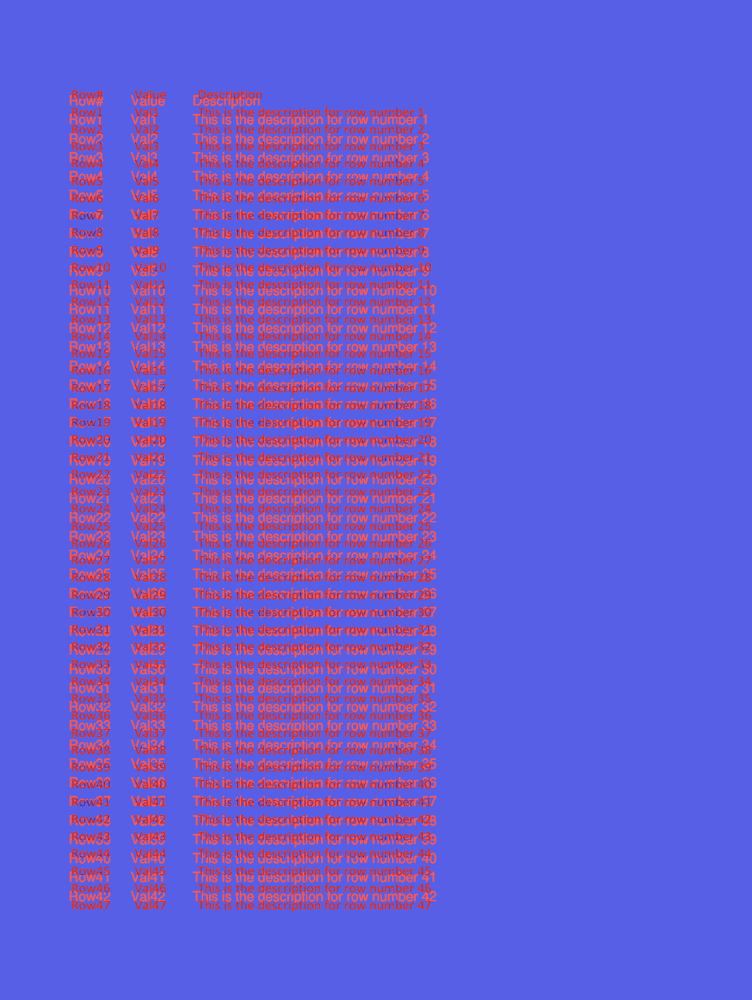</td>
  <td>changed: 270116 px (13.19%)<br>bbox: [115, 147, 721, 1505]<br>mean abs RGB: 20.3755<br>RMSE RGB: 63.2458<br>threshold: 12, gain: 5.0</td>
</tr>
<tr>
  <td><b>classic06_tall_table</b><br>Page 2</td>
  <td>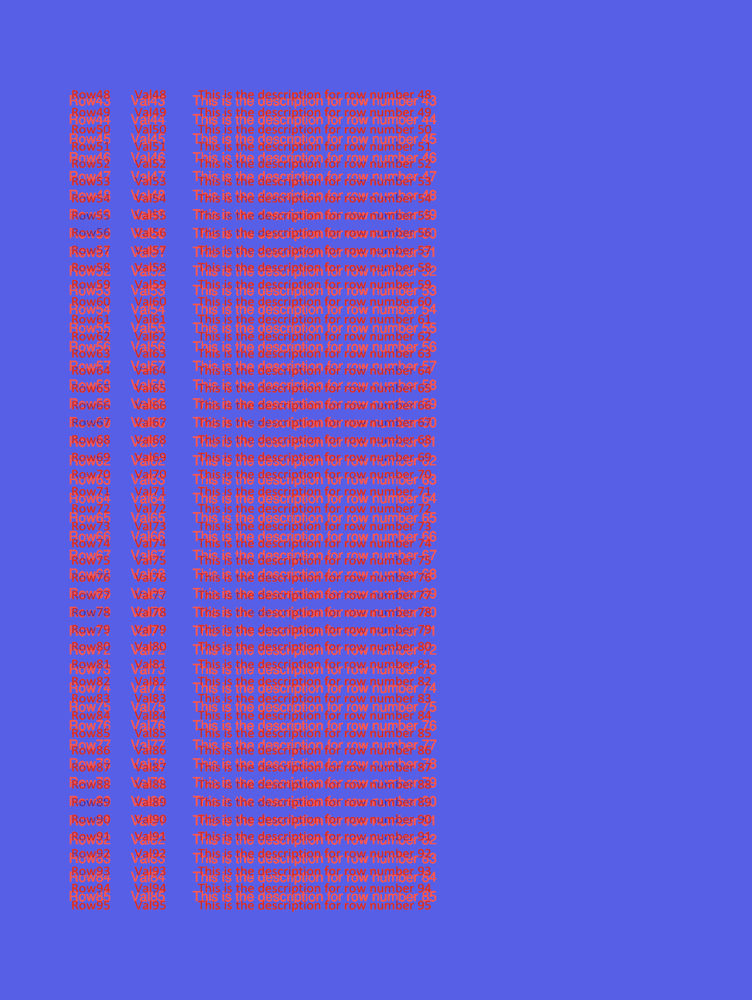</td>
  <td>changed: 280331 px (13.69%)<br>bbox: [115, 147, 721, 1505]<br>mean abs RGB: 21.1527<br>RMSE RGB: 64.4353<br>threshold: 12, gain: 5.0</td>
</tr>
<tr>
  <td><b>classic06_tall_table</b><br>Page 3</td>
  <td>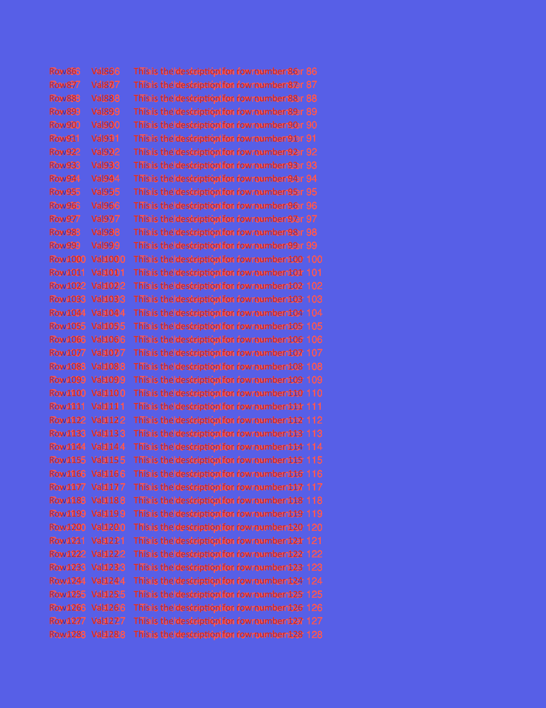</td>
  <td>changed: 293035 px (14.31%)<br>bbox: [115, 147, 733, 1505]<br>mean abs RGB: 22.0954<br>RMSE RGB: 65.8669<br>threshold: 12, gain: 5.0</td>
</tr>
<tr>
  <td><b>classic06_tall_table</b><br>Page 4</td>
  <td>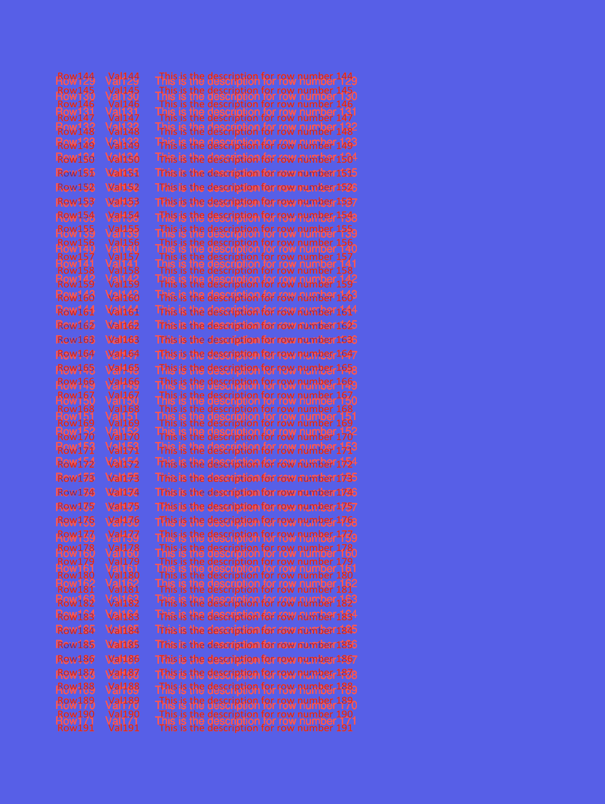</td>
  <td>changed: 296215 px (14.47%)<br>bbox: [115, 147, 733, 1505]<br>mean abs RGB: 22.3146<br>RMSE RGB: 66.1569<br>threshold: 12, gain: 5.0</td>
</tr>
<tr>
  <td><b>classic06_tall_table</b><br>Page 5</td>
  <td>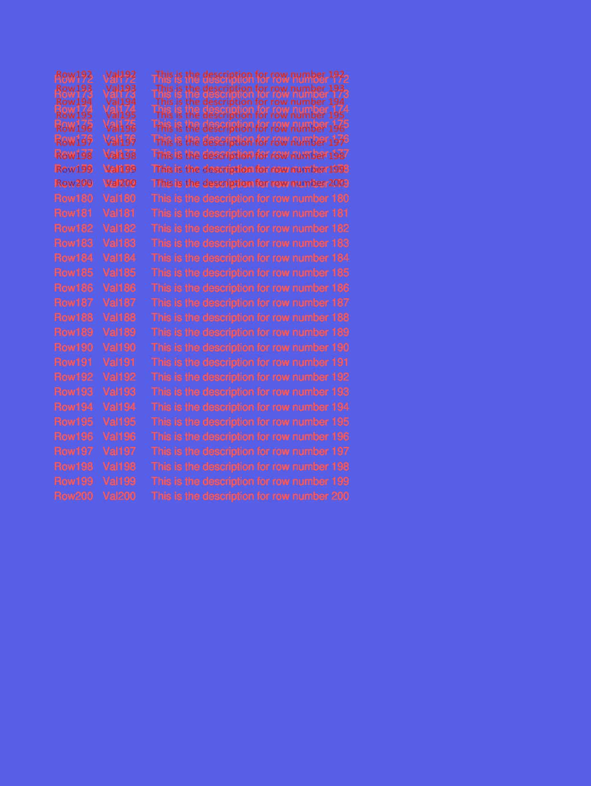</td>
  <td>changed: 143619 px (7.01%)<br>bbox: [115, 147, 733, 1054]<br>mean abs RGB: 11.123<br>RMSE RGB: 47.0983<br>threshold: 12, gain: 5.0</td>
</tr>
<tr>
  <td><b>classic07_numbers_only</b><br>Page 1</td>
  <td></td>
  <td>changed: 3361 px (0.16%)<br>bbox: [178, 148, 423, 269]<br>mean abs RGB: 0.2649<br>RMSE RGB: 7.306<br>threshold: 12, gain: 5.0</td>
</tr>
<tr>
  <td><b>classic08_mixed_text_and_numbers</b><br>Page 1</td>
  <td></td>
  <td>changed: 8186 px (0.40%)<br>bbox: [113, 148, 318, 331]<br>mean abs RGB: 0.6265<br>RMSE RGB: 11.1482<br>threshold: 12, gain: 5.0</td>
</tr>
<tr>
  <td><b>classic09_long_text</b><br>Page 1</td>
  <td></td>
  <td>changed: 46141 px (2.25%)<br>bbox: [113, 147, 1241, 299]<br>mean abs RGB: 3.6705<br>RMSE RGB: 27.3883<br>threshold: 12, gain: 5.0</td>
</tr>
<tr>
  <td><b>classic09_long_text</b><br>Page 2</td>
  <td></td>
  <td>changed: 19136 px (0.93%)<br>bbox: [114, 177, 1056, 277]<br>mean abs RGB: 1.5232<br>RMSE RGB: 17.6758<br>threshold: 12, gain: 5.0</td>
</tr>
<tr>
  <td><b>classic09_long_text</b><br>Page 3</td>
  <td></td>
  <td>changed: 19051 px (0.93%)<br>bbox: [114, 177, 1056, 277]<br>mean abs RGB: 1.5228<br>RMSE RGB: 17.6732<br>threshold: 12, gain: 5.0</td>
</tr>
<tr>
  <td><b>classic09_long_text</b><br>Page 4</td>
  <td></td>
  <td>changed: 19353 px (0.95%)<br>bbox: [114, 177, 1056, 277]<br>mean abs RGB: 1.5214<br>RMSE RGB: 17.6675<br>threshold: 12, gain: 5.0</td>
</tr>
<tr>
  <td><b>classic09_long_text</b><br>Page 5</td>
  <td></td>
  <td>changed: 20804 px (1.02%)<br>bbox: [114, 177, 1056, 277]<br>mean abs RGB: 1.6269<br>RMSE RGB: 18.2669<br>threshold: 12, gain: 5.0</td>
</tr>
<tr>
  <td><b>classic09_long_text</b><br>Page 6</td>
  <td></td>
  <td>changed: 20720 px (1.01%)<br>bbox: [114, 177, 1056, 277]<br>mean abs RGB: 1.6581<br>RMSE RGB: 18.4357<br>threshold: 12, gain: 5.0</td>
</tr>
<tr>
  <td><b>classic09_long_text</b><br>Page 7</td>
  <td></td>
  <td>changed: 13136 px (0.64%)<br>bbox: [114, 206, 1056, 277]<br>mean abs RGB: 1.0369<br>RMSE RGB: 14.5663<br>threshold: 12, gain: 5.0</td>
</tr>
<tr>
  <td><b>classic09_long_text</b><br>Page 8</td>
  <td></td>
  <td>changed: 5700 px (0.28%)<br>bbox: [114, 262, 1056, 277]<br>mean abs RGB: 0.4444<br>RMSE RGB: 9.5012<br>threshold: 12, gain: 5.0</td>
</tr>
<tr>
  <td><b>classic09_long_text</b><br>Page 9</td>
  <td></td>
  <td>changed: 5682 px (0.28%)<br>bbox: [114, 262, 1056, 277]<br>mean abs RGB: 0.4427<br>RMSE RGB: 9.4822<br>threshold: 12, gain: 5.0</td>
</tr>
<tr>
  <td><b>classic09_long_text</b><br>Page 10</td>
  <td></td>
  <td>changed: 5699 px (0.28%)<br>bbox: [114, 262, 1056, 277]<br>mean abs RGB: 0.4442<br>RMSE RGB: 9.4994<br>threshold: 12, gain: 5.0</td>
</tr>
<tr>
  <td><b>classic09_long_text</b><br>Page 11</td>
  <td></td>
  <td>changed: 5696 px (0.28%)<br>bbox: [114, 262, 1056, 277]<br>mean abs RGB: 0.4438<br>RMSE RGB: 9.494<br>threshold: 12, gain: 5.0</td>
</tr>
<tr>
  <td><b>classic09_long_text</b><br>Page 12</td>
  <td></td>
  <td>changed: 5470 px (0.27%)<br>bbox: [114, 262, 1019, 277]<br>mean abs RGB: 0.4264<br>RMSE RGB: 9.3063<br>threshold: 12, gain: 5.0</td>
</tr>
<tr>
  <td><b>classic10_special_xml_characters</b><br>Page 1</td>
  <td></td>
  <td>changed: 13139 px (0.64%)<br>bbox: [113, 147, 465, 367]<br>mean abs RGB: 0.9946<br>RMSE RGB: 14.0377<br>threshold: 12, gain: 5.0</td>
</tr>
<tr>
  <td><b>classic11_sparse_rows</b><br>Page 1</td>
  <td></td>
  <td>changed: 3499 px (0.17%)<br>bbox: [113, 148, 212, 769]<br>mean abs RGB: 0.2664<br>RMSE RGB: 7.2355<br>threshold: 12, gain: 5.0</td>
</tr>
<tr>
  <td><b>classic11_sparse_rows</b><br>Page 2</td>
  <td></td>
  <td>changed: 1057 px (0.05%)<br>bbox: [115, 176, 183, 331]<br>mean abs RGB: 0.0822<br>RMSE RGB: 4.0461<br>threshold: 12, gain: 5.0</td>
</tr>
<tr>
  <td><b>classic12_sparse_columns</b><br>Page 1</td>
  <td></td>
  <td>changed: 4845 px (0.24%)<br>bbox: [114, 147, 1099, 242]<br>mean abs RGB: 0.3785<br>RMSE RGB: 8.7279<br>threshold: 12, gain: 5.0</td>
</tr>
<tr>
  <td><b>classic13_date_strings</b><br>Page 1</td>
  <td></td>
  <td>changed: 13914 px (0.68%)<br>bbox: [114, 148, 344, 335]<br>mean abs RGB: 1.0696<br>RMSE RGB: 14.6384<br>threshold: 12, gain: 5.0</td>
</tr>
<tr>
  <td><b>classic14_decimal_numbers</b><br>Page 1</td>
  <td></td>
  <td>changed: 9750 px (0.48%)<br>bbox: [114, 147, 318, 335]<br>mean abs RGB: 0.7457<br>RMSE RGB: 12.1716<br>threshold: 12, gain: 5.0</td>
</tr>
<tr>
  <td><b>classic15_negative_numbers</b><br>Page 1</td>
  <td></td>
  <td>changed: 10252 px (0.50%)<br>bbox: [113, 147, 352, 367]<br>mean abs RGB: 0.7809<br>RMSE RGB: 12.4461<br>threshold: 12, gain: 5.0</td>
</tr>
<tr>
  <td><b>classic16_percentage_strings</b><br>Page 1</td>
  <td></td>
  <td>changed: 11363 px (0.55%)<br>bbox: [114, 148, 321, 331]<br>mean abs RGB: 0.8671<br>RMSE RGB: 13.1133<br>threshold: 12, gain: 5.0</td>
</tr>
<tr>
  <td><b>classic17_currency_strings</b><br>Page 1</td>
  <td></td>
  <td>changed: 14151 px (0.69%)<br>bbox: [113, 148, 334, 363]<br>mean abs RGB: 1.0797<br>RMSE RGB: 14.6172<br>threshold: 12, gain: 5.0</td>
</tr>
<tr>
  <td><b>classic18_large_dataset</b><br>Page 1</td>
  <td>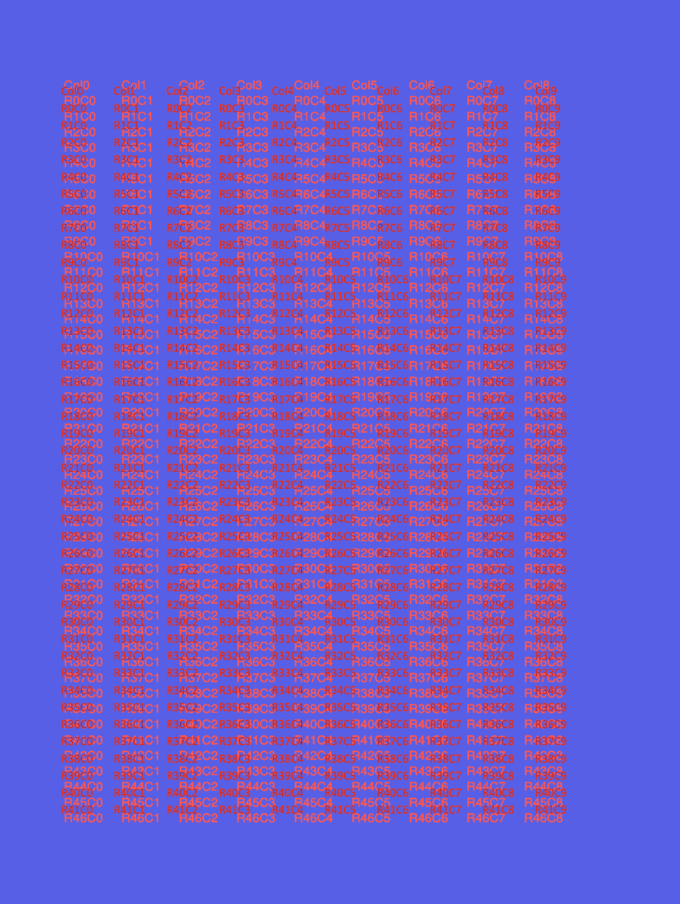</td>
  <td>changed: 322268 px (14.81%)<br>bbox: [117, 156, 1027, 1596]<br>mean abs RGB: 23.469<br>RMSE RGB: 68.8737<br>threshold: 12, gain: 5.0</td>
</tr>
<tr>
  <td><b>classic18_large_dataset</b><br>Page 2</td>
  <td>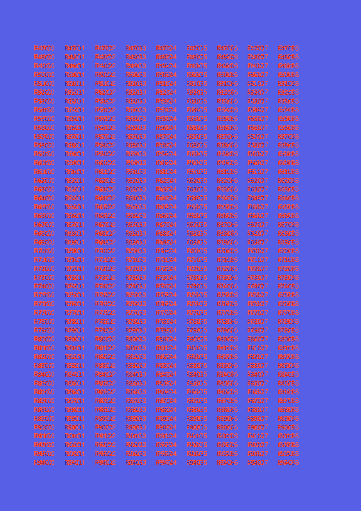</td>
  <td>changed: 343584 px (15.78%)<br>bbox: [118, 156, 1027, 1596]<br>mean abs RGB: 24.7739<br>RMSE RGB: 70.5492<br>threshold: 12, gain: 5.0</td>
</tr>
<tr>
  <td><b>classic18_large_dataset</b><br>Page 3</td>
  <td></td>
  <td>changed: 388582 px (17.85%)<br>bbox: [118, 156, 1040, 1596]<br>mean abs RGB: 28.64<br>RMSE RGB: 76.4157<br>threshold: 12, gain: 5.0</td>
</tr>
<tr>
  <td><b>classic18_large_dataset</b><br>Page 4</td>
  <td></td>
  <td>changed: 399953 px (18.37%)<br>bbox: [118, 156, 1040, 1596]<br>mean abs RGB: 29.4614<br>RMSE RGB: 77.5053<br>threshold: 12, gain: 5.0</td>
</tr>
<tr>
  <td><b>classic18_large_dataset</b><br>Page 5</td>
  <td></td>
  <td>changed: 397432 px (18.26%)<br>bbox: [118, 156, 1040, 1596]<br>mean abs RGB: 29.0788<br>RMSE RGB: 76.7078<br>threshold: 12, gain: 5.0</td>
</tr>
<tr>
  <td><b>classic18_large_dataset</b><br>Page 6</td>
  <td>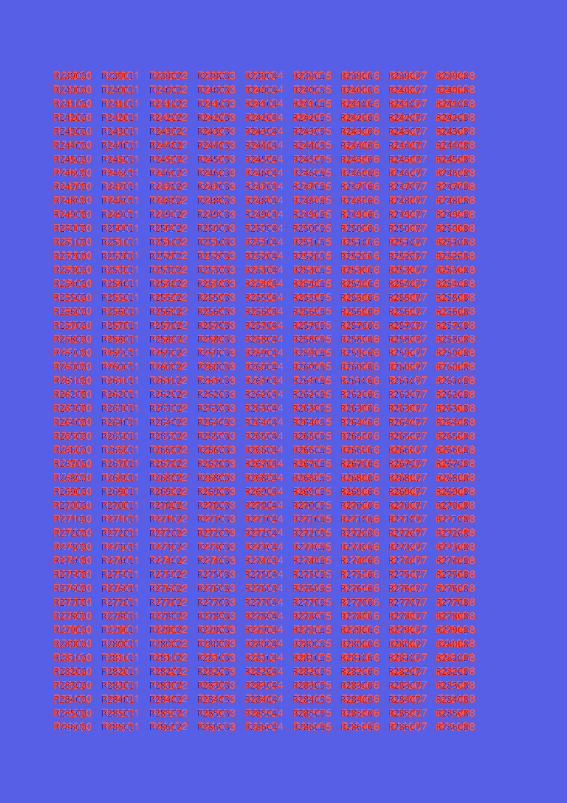</td>
  <td>changed: 401446 px (18.44%)<br>bbox: [118, 156, 1040, 1596]<br>mean abs RGB: 29.3159<br>RMSE RGB: 76.945<br>threshold: 12, gain: 5.0</td>
</tr>
<tr>
  <td><b>classic18_large_dataset</b><br>Page 7</td>
  <td>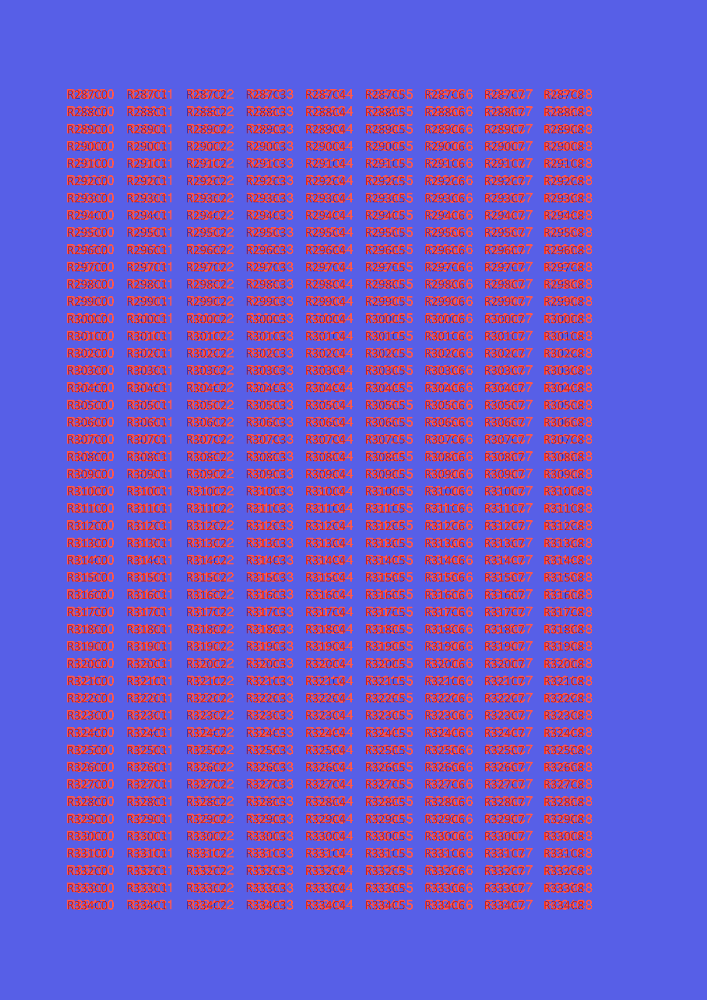</td>
  <td>changed: 405329 px (18.62%)<br>bbox: [118, 156, 1040, 1596]<br>mean abs RGB: 29.4131<br>RMSE RGB: 76.9459<br>threshold: 12, gain: 5.0</td>
</tr>
<tr>
  <td><b>classic18_large_dataset</b><br>Page 8</td>
  <td>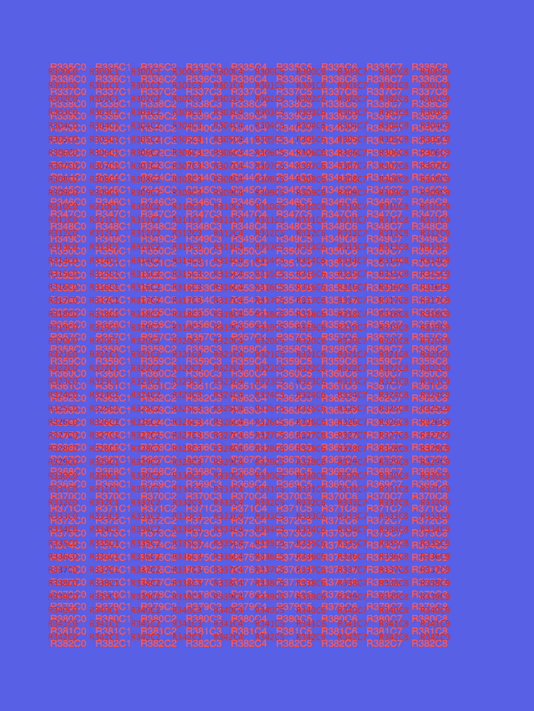</td>
  <td>changed: 410598 px (18.86%)<br>bbox: [118, 156, 1040, 1596]<br>mean abs RGB: 29.6482<br>RMSE RGB: 77.1798<br>threshold: 12, gain: 5.0</td>
</tr>
<tr>
  <td><b>classic18_large_dataset</b><br>Page 9</td>
  <td>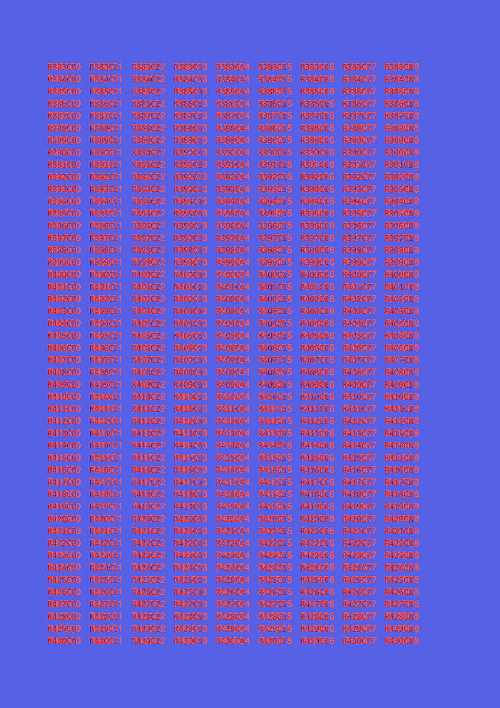</td>
  <td>changed: 405274 px (18.62%)<br>bbox: [118, 156, 1040, 1596]<br>mean abs RGB: 29.4912<br>RMSE RGB: 77.0541<br>threshold: 12, gain: 5.0</td>
</tr>
<tr>
  <td><b>classic18_large_dataset</b><br>Page 10</td>
  <td>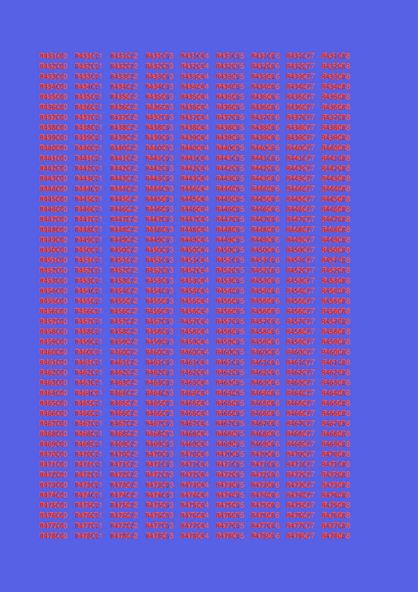</td>
  <td>changed: 404316 px (18.57%)<br>bbox: [118, 156, 1040, 1596]<br>mean abs RGB: 29.5159<br>RMSE RGB: 77.1363<br>threshold: 12, gain: 5.0</td>
</tr>
<tr>
  <td><b>classic18_large_dataset</b><br>Page 11</td>
  <td>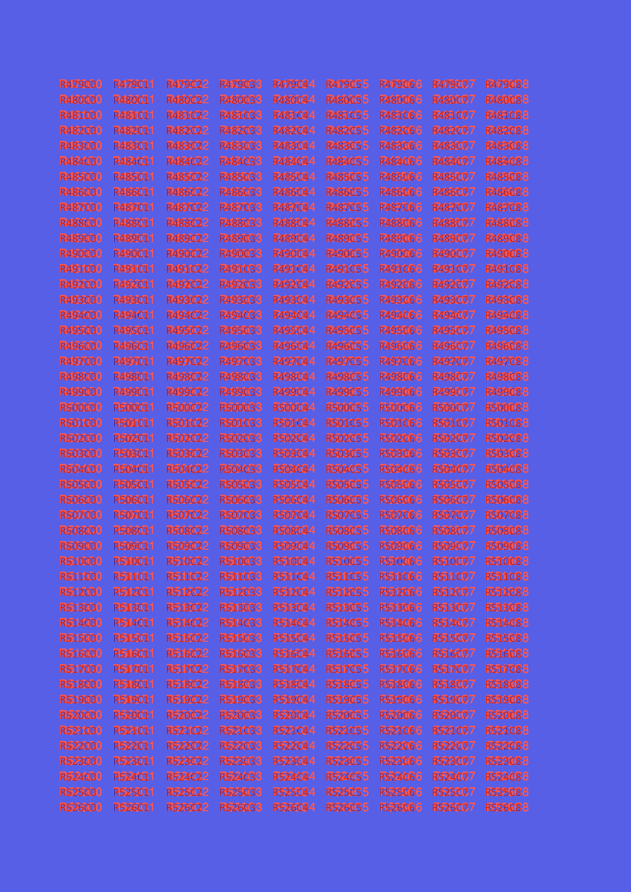</td>
  <td>changed: 407684 px (18.73%)<br>bbox: [118, 156, 1040, 1596]<br>mean abs RGB: 29.5939<br>RMSE RGB: 77.1625<br>threshold: 12, gain: 5.0</td>
</tr>
<tr>
  <td><b>classic18_large_dataset</b><br>Page 12</td>
  <td>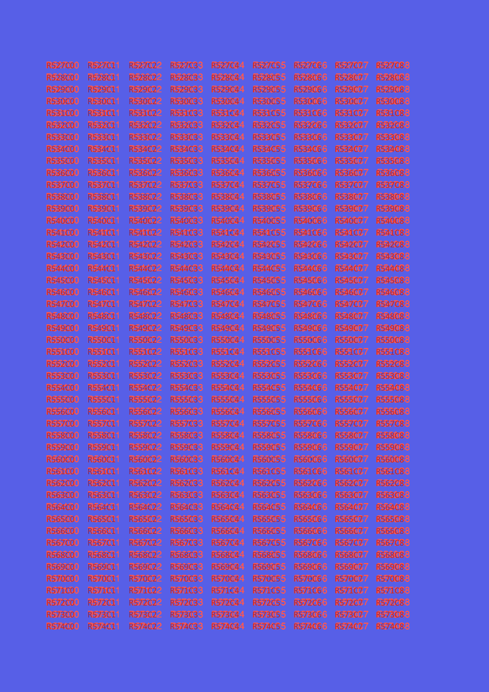</td>
  <td>changed: 411004 px (18.88%)<br>bbox: [118, 156, 1040, 1596]<br>mean abs RGB: 29.6773<br>RMSE RGB: 77.2029<br>threshold: 12, gain: 5.0</td>
</tr>
<tr>
  <td><b>classic18_large_dataset</b><br>Page 13</td>
  <td>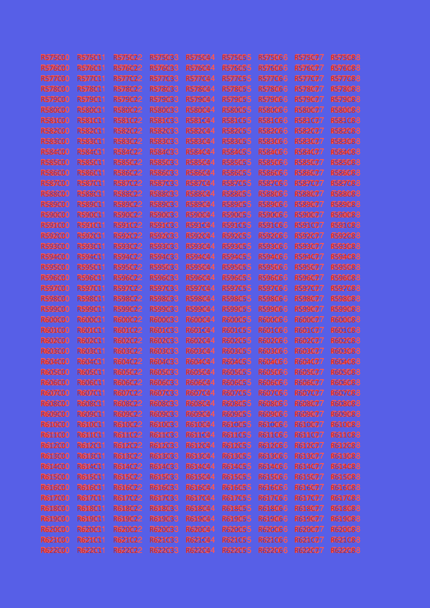</td>
  <td>changed: 410409 px (18.85%)<br>bbox: [118, 156, 1040, 1596]<br>mean abs RGB: 29.6072<br>RMSE RGB: 77.0925<br>threshold: 12, gain: 5.0</td>
</tr>
<tr>
  <td><b>classic18_large_dataset</b><br>Page 14</td>
  <td>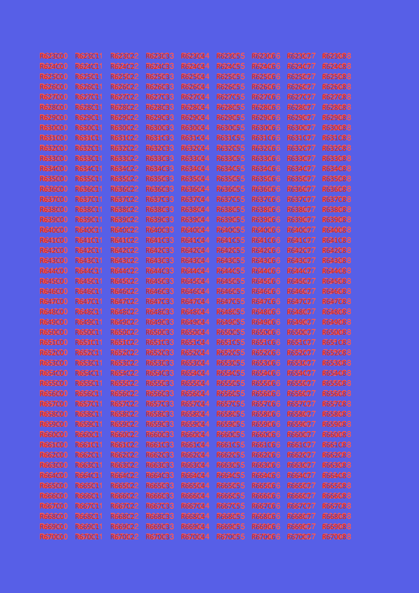</td>
  <td>changed: 410832 px (18.87%)<br>bbox: [118, 156, 1040, 1596]<br>mean abs RGB: 29.5855<br>RMSE RGB: 76.9912<br>threshold: 12, gain: 5.0</td>
</tr>
<tr>
  <td><b>classic18_large_dataset</b><br>Page 15</td>
  <td>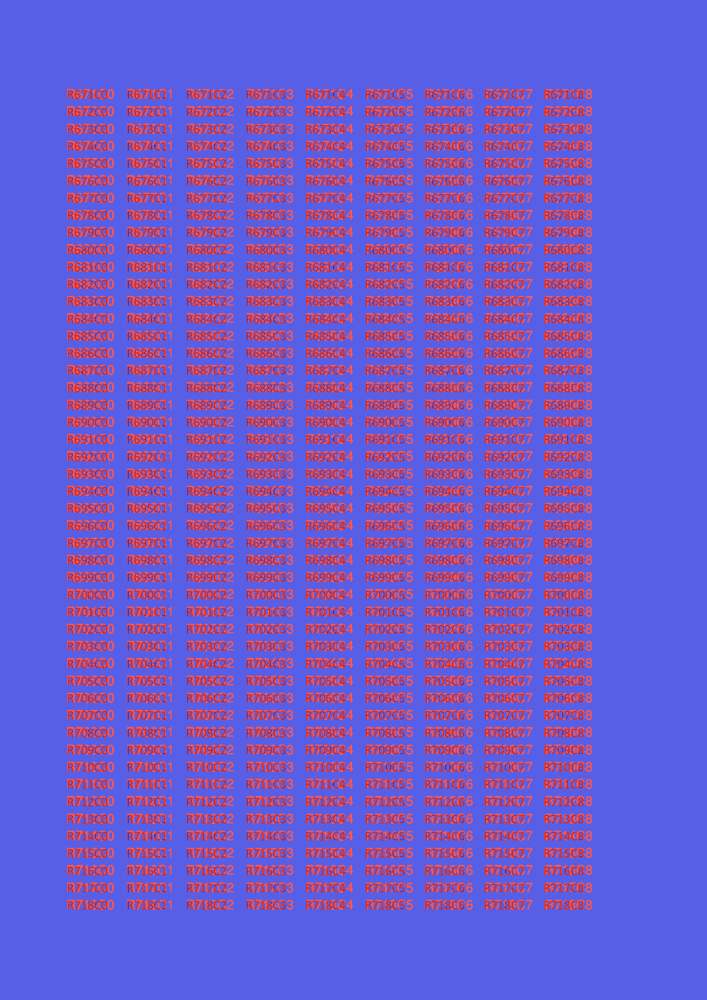</td>
  <td>changed: 405835 px (18.64%)<br>bbox: [118, 156, 1040, 1596]<br>mean abs RGB: 29.4031<br>RMSE RGB: 76.9454<br>threshold: 12, gain: 5.0</td>
</tr>
<tr>
  <td><b>classic19_single_column_list</b><br>Page 1</td>
  <td></td>
  <td>changed: 17001 px (0.83%)<br>bbox: [115, 148, 189, 800]<br>mean abs RGB: 1.2927<br>RMSE RGB: 15.8901<br>threshold: 12, gain: 5.0</td>
</tr>
<tr>
  <td><b>classic20_all_empty_cells</b><br>Page 1</td>
  <td></td>
  <td>changed: 0 px (0.00%)<br>bbox: None<br>mean abs RGB: 0.0<br>RMSE RGB: 0.0<br>threshold: 12, gain: 5.0</td>
</tr>
<tr>
  <td><b>classic21_header_only</b><br>Page 1</td>
  <td></td>
  <td>changed: 2990 px (0.15%)<br>bbox: [114, 147, 576, 175]<br>mean abs RGB: 0.2266<br>RMSE RGB: 6.7027<br>threshold: 12, gain: 5.0</td>
</tr>
<tr>
  <td><b>classic22_long_sheet_name</b><br>Page 1</td>
  <td></td>
  <td>changed: 4142 px (0.20%)<br>bbox: [115, 147, 318, 238]<br>mean abs RGB: 0.3257<br>RMSE RGB: 8.1078<br>threshold: 12, gain: 5.0</td>
</tr>
<tr>
  <td><b>classic23_unicode_text</b><br>Page 1</td>
  <td></td>
  <td>changed: 19892 px (0.97%)<br>bbox: [113, 148, 423, 367]<br>mean abs RGB: 1.534<br>RMSE RGB: 17.4656<br>threshold: 12, gain: 5.0</td>
</tr>
<tr>
  <td><b>classic24_red_text</b><br>Page 1</td>
  <td></td>
  <td>changed: 13216 px (0.65%)<br>bbox: [113, 148, 444, 273]<br>mean abs RGB: 0.7702<br>RMSE RGB: 12.2316<br>threshold: 12, gain: 5.0</td>
</tr>
<tr>
  <td><b>classic25_multiple_colors</b><br>Page 1</td>
  <td></td>
  <td>changed: 25738 px (1.26%)<br>bbox: [113, 147, 445, 429]<br>mean abs RGB: 1.1843<br>RMSE RGB: 14.9917<br>threshold: 12, gain: 5.0</td>
</tr>
<tr>
  <td><b>classic26_inline_strings</b><br>Page 1</td>
  <td></td>
  <td>changed: 7996 px (0.39%)<br>bbox: [113, 147, 391, 238]<br>mean abs RGB: 0.6166<br>RMSE RGB: 11.1038<br>threshold: 12, gain: 5.0</td>
</tr>
<tr>
  <td><b>classic27_single_row</b><br>Page 1</td>
  <td></td>
  <td>changed: 3646 px (0.18%)<br>bbox: [114, 147, 778, 175]<br>mean abs RGB: 0.2867<br>RMSE RGB: 7.5958<br>threshold: 12, gain: 5.0</td>
</tr>
<tr>
  <td><b>classic28_duplicate_values</b><br>Page 1</td>
  <td></td>
  <td>changed: 9067 px (0.44%)<br>bbox: [113, 148, 462, 300]<br>mean abs RGB: 0.7018<br>RMSE RGB: 11.875<br>threshold: 12, gain: 5.0</td>
</tr>
<tr>
  <td><b>classic29_formula_results</b><br>Page 1</td>
  <td></td>
  <td>changed: 9312 px (0.45%)<br>bbox: [113, 147, 527, 300]<br>mean abs RGB: 0.7209<br>RMSE RGB: 12.0325<br>threshold: 12, gain: 5.0</td>
</tr>
<tr>
  <td><b>classic30_mixed_empty_and_filled_sheets</b><br>Page 1</td>
  <td></td>
  <td>changed: 3752 px (0.18%)<br>bbox: [114, 147, 279, 239]<br>mean abs RGB: 0.2965<br>RMSE RGB: 7.7249<br>threshold: 12, gain: 5.0</td>
</tr>
<tr>
  <td><b>classic30_mixed_empty_and_filled_sheets</b><br>Page 2</td>
  <td></td>
  <td>changed: 3822 px (0.19%)<br>bbox: [114, 147, 422, 206]<br>mean abs RGB: 0.2962<br>RMSE RGB: 7.6977<br>threshold: 12, gain: 5.0</td>
</tr>
<tr>
  <td><b>classic31_bold_header_row</b><br>Page 1</td>
  <td></td>
  <td>changed: 17619 px (0.86%)<br>bbox: [114, 147, 548, 300]<br>mean abs RGB: 1.4109<br>RMSE RGB: 16.991<br>threshold: 12, gain: 5.0</td>
</tr>
<tr>
  <td><b>classic32_right_aligned_numbers</b><br>Page 1</td>
  <td></td>
  <td>changed: 8037 px (0.39%)<br>bbox: [114, 147, 318, 269]<br>mean abs RGB: 0.6248<br>RMSE RGB: 11.173<br>threshold: 12, gain: 5.0</td>
</tr>
<tr>
  <td><b>classic33_centered_text</b><br>Page 1</td>
  <td></td>
  <td>changed: 5398 px (0.26%)<br>bbox: [114, 147, 596, 238]<br>mean abs RGB: 0.424<br>RMSE RGB: 9.2532<br>threshold: 12, gain: 5.0</td>
</tr>
<tr>
  <td><b>classic34_explicit_column_widths</b><br>Page 1</td>
  <td></td>
  <td>changed: 13485 px (0.66%)<br>bbox: [115, 147, 662, 273]<br>mean abs RGB: 1.0452<br>RMSE RGB: 14.4685<br>threshold: 12, gain: 5.0</td>
</tr>
<tr>
  <td><b>classic35_explicit_row_heights</b><br>Page 1</td>
  <td></td>
  <td>changed: 6242 px (0.30%)<br>bbox: [113, 178, 375, 342]<br>mean abs RGB: 0.4848<br>RMSE RGB: 9.8718<br>threshold: 12, gain: 5.0</td>
</tr>
<tr>
  <td><b>classic36_merged_cells</b><br>Page 1</td>
  <td></td>
  <td>changed: 13223 px (0.65%)<br>bbox: [114, 147, 693, 269]<br>mean abs RGB: 1.0324<br>RMSE RGB: 14.4361<br>threshold: 12, gain: 5.0</td>
</tr>
<tr>
  <td><b>classic37_freeze_panes</b><br>Page 1</td>
  <td>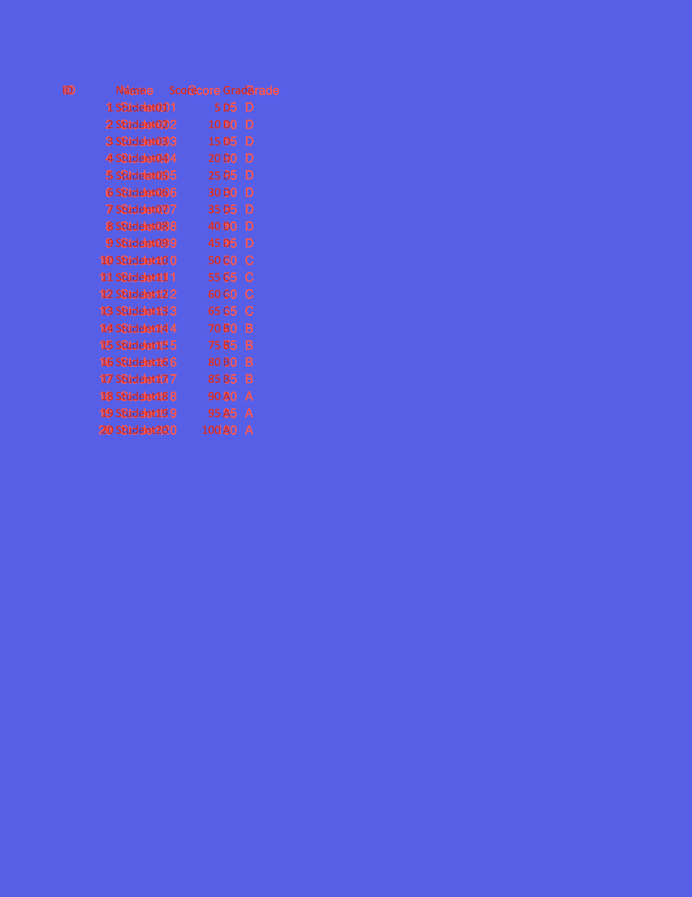</td>
  <td>changed: 46178 px (2.26%)<br>bbox: [115, 147, 501, 800]<br>mean abs RGB: 3.5132<br>RMSE RGB: 26.3773<br>threshold: 12, gain: 5.0</td>
</tr>
<tr>
  <td><b>classic38_hyperlink_cell</b><br>Page 1</td>
  <td></td>
  <td>changed: 9929 px (0.48%)<br>bbox: [113, 148, 483, 243]<br>mean abs RGB: 0.7242<br>RMSE RGB: 11.9472<br>threshold: 12, gain: 5.0</td>
</tr>
<tr>
  <td><b>classic39_financial_table</b><br>Page 1</td>
  <td></td>
  <td>changed: 21099 px (1.03%)<br>bbox: [113, 147, 527, 363]<br>mean abs RGB: 1.5654<br>RMSE RGB: 17.6308<br>threshold: 12, gain: 5.0</td>
</tr>
<tr>
  <td><b>classic40_scientific_notation</b><br>Page 1</td>
  <td></td>
  <td>changed: 15519 px (0.76%)<br>bbox: [113, 147, 415, 335]<br>mean abs RGB: 1.2045<br>RMSE RGB: 15.513<br>threshold: 12, gain: 5.0</td>
</tr>
<tr>
  <td><b>classic41_integer_vs_float</b><br>Page 1</td>
  <td></td>
  <td>changed: 12915 px (0.63%)<br>bbox: [113, 147, 331, 425]<br>mean abs RGB: 0.9735<br>RMSE RGB: 13.8576<br>threshold: 12, gain: 5.0</td>
</tr>
<tr>
  <td><b>classic42_boolean_values</b><br>Page 1</td>
  <td></td>
  <td>changed: 14043 px (0.69%)<br>bbox: [113, 147, 358, 331]<br>mean abs RGB: 1.0845<br>RMSE RGB: 14.7085<br>threshold: 12, gain: 5.0</td>
</tr>
<tr>
  <td><b>classic43_inventory_report</b><br>Page 1</td>
  <td></td>
  <td>changed: 43155 px (2.11%)<br>bbox: [114, 147, 800, 395]<br>mean abs RGB: 3.379<br>RMSE RGB: 26.1341<br>threshold: 12, gain: 5.0</td>
</tr>
<tr>
  <td><b>classic44_employee_roster</b><br>Page 1</td>
  <td></td>
  <td>changed: 67344 px (3.29%)<br>bbox: [115, 147, 1018, 429]<br>mean abs RGB: 5.1269<br>RMSE RGB: 31.8619<br>threshold: 12, gain: 5.0</td>
</tr>
<tr>
  <td><b>classic45_sales_by_region</b><br>Page 1</td>
  <td></td>
  <td>changed: 7262 px (0.35%)<br>bbox: [114, 147, 318, 301]<br>mean abs RGB: 0.563<br>RMSE RGB: 10.6314<br>threshold: 12, gain: 5.0</td>
</tr>
<tr>
  <td><b>classic45_sales_by_region</b><br>Page 2</td>
  <td></td>
  <td>changed: 7409 px (0.36%)<br>bbox: [114, 147, 318, 301]<br>mean abs RGB: 0.5746<br>RMSE RGB: 10.7389<br>threshold: 12, gain: 5.0</td>
</tr>
<tr>
  <td><b>classic45_sales_by_region</b><br>Page 3</td>
  <td></td>
  <td>changed: 7533 px (0.37%)<br>bbox: [114, 147, 318, 301]<br>mean abs RGB: 0.5834<br>RMSE RGB: 10.8084<br>threshold: 12, gain: 5.0</td>
</tr>
<tr>
  <td><b>classic45_sales_by_region</b><br>Page 4</td>
  <td></td>
  <td>changed: 7337 px (0.36%)<br>bbox: [114, 147, 318, 301]<br>mean abs RGB: 0.5678<br>RMSE RGB: 10.6657<br>threshold: 12, gain: 5.0</td>
</tr>
<tr>
  <td><b>classic46_grade_book</b><br>Page 1</td>
  <td></td>
  <td>changed: 27788 px (1.36%)<br>bbox: [113, 147, 801, 394]<br>mean abs RGB: 2.1528<br>RMSE RGB: 20.7668<br>threshold: 12, gain: 5.0</td>
</tr>
<tr>
  <td><b>classic47_time_series</b><br>Page 1</td>
  <td>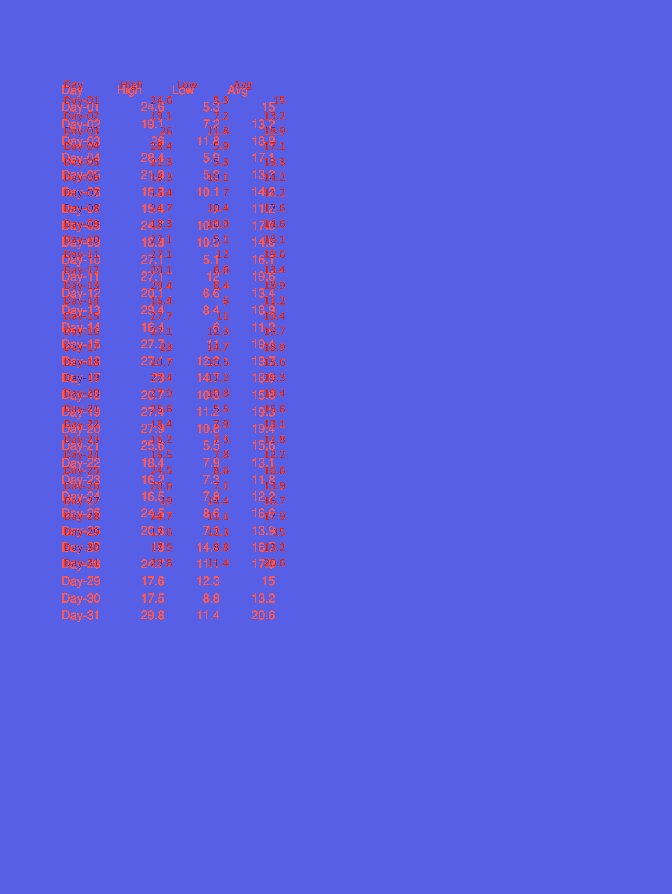</td>
  <td>changed: 72385 px (3.54%)<br>bbox: [115, 147, 527, 1148]<br>mean abs RGB: 5.4993<br>RMSE RGB: 32.9972<br>threshold: 12, gain: 5.0</td>
</tr>
<tr>
  <td><b>classic48_survey_results</b><br>Page 1</td>
  <td></td>
  <td>changed: 23466 px (1.15%)<br>bbox: [114, 147, 884, 331]<br>mean abs RGB: 1.8199<br>RMSE RGB: 19.0498<br>threshold: 12, gain: 5.0</td>
</tr>
<tr>
  <td><b>classic49_contact_list</b><br>Page 1</td>
  <td></td>
  <td>changed: 52748 px (2.58%)<br>bbox: [113, 147, 879, 398]<br>mean abs RGB: 4.0205<br>RMSE RGB: 28.2502<br>threshold: 12, gain: 5.0</td>
</tr>
<tr>
  <td><b>classic50_budget_vs_actuals</b><br>Page 1</td>
  <td></td>
  <td>changed: 35957 px (1.76%)<br>bbox: [114, 147, 736, 331]<br>mean abs RGB: 2.779<br>RMSE RGB: 23.5713<br>threshold: 12, gain: 5.0</td>
</tr>
<tr>
  <td><b>classic50_budget_vs_actuals</b><br>Page 2</td>
  <td></td>
  <td>changed: 35508 px (1.73%)<br>bbox: [114, 147, 736, 331]<br>mean abs RGB: 2.7465<br>RMSE RGB: 23.4388<br>threshold: 12, gain: 5.0</td>
</tr>
<tr>
  <td><b>classic50_budget_vs_actuals</b><br>Page 3</td>
  <td></td>
  <td>changed: 28514 px (1.39%)<br>bbox: [114, 147, 736, 331]<br>mean abs RGB: 2.2125<br>RMSE RGB: 21.0503<br>threshold: 12, gain: 5.0</td>
</tr>
<tr>
  <td><b>classic51_product_catalog</b><br>Page 1</td>
  <td>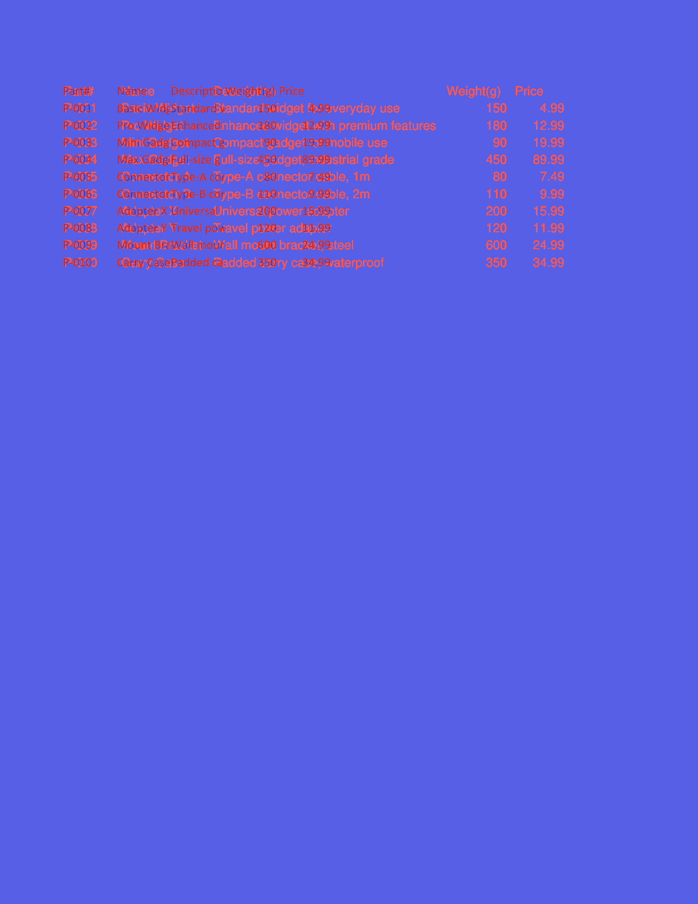</td>
  <td>changed: 66039 px (3.23%)<br>bbox: [115, 147, 1003, 492]<br>mean abs RGB: 5.0305<br>RMSE RGB: 31.5558<br>threshold: 12, gain: 5.0</td>
</tr>
<tr>
  <td><b>classic52_pivot_summary</b><br>Page 1</td>
  <td></td>
  <td>changed: 36528 px (1.78%)<br>bbox: [113, 147, 780, 331]<br>mean abs RGB: 2.902<br>RMSE RGB: 24.3425<br>threshold: 12, gain: 5.0</td>
</tr>
<tr>
  <td><b>classic53_invoice</b><br>Page 1</td>
  <td>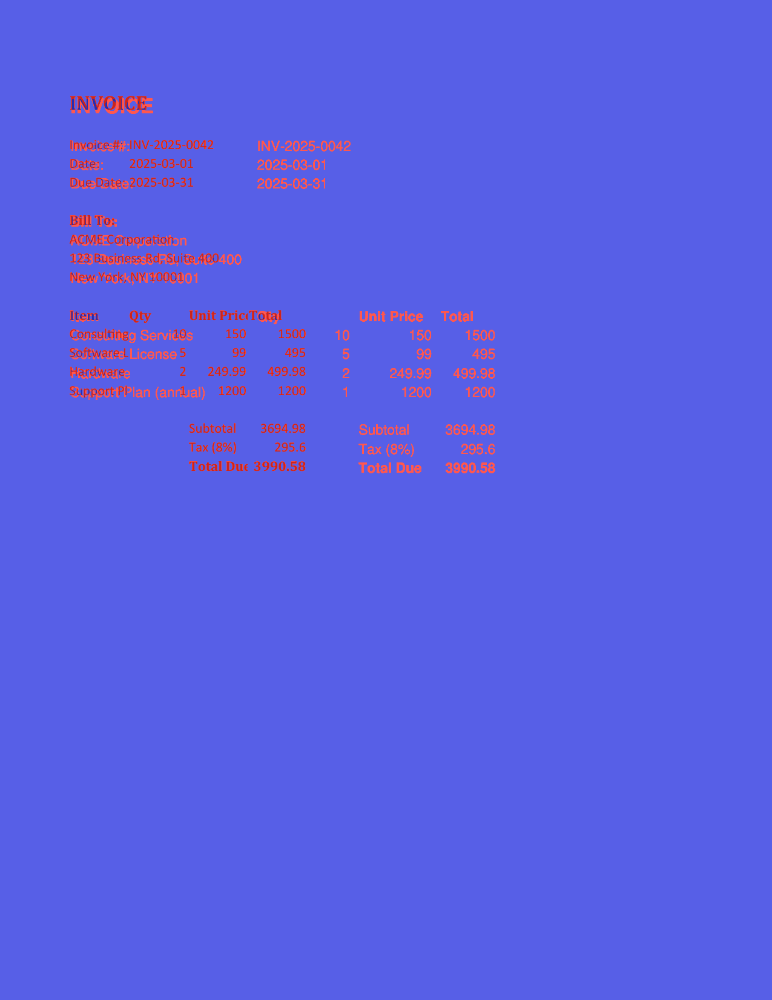</td>
  <td>changed: 47236 px (2.31%)<br>bbox: [113, 152, 796, 781]<br>mean abs RGB: 3.7841<br>RMSE RGB: 27.8633<br>threshold: 12, gain: 5.0</td>
</tr>
<tr>
  <td><b>classic54_multi_level_header</b><br>Page 1</td>
  <td></td>
  <td>changed: 27637 px (1.35%)<br>bbox: [114, 148, 841, 300]<br>mean abs RGB: 2.2411<br>RMSE RGB: 21.5096<br>threshold: 12, gain: 5.0</td>
</tr>
<tr>
  <td><b>classic55_error_values</b><br>Page 1</td>
  <td></td>
  <td>changed: 19454 px (0.95%)<br>bbox: [113, 147, 436, 367]<br>mean abs RGB: 1.5019<br>RMSE RGB: 17.3184<br>threshold: 12, gain: 5.0</td>
</tr>
<tr>
  <td><b>classic56_alternating_row_colors</b><br>Page 1</td>
  <td></td>
  <td>changed: 81401 px (3.98%)<br>bbox: [109, 147, 440, 494]<br>mean abs RGB: 2.1666<br>RMSE RGB: 17.1996<br>threshold: 12, gain: 5.0</td>
</tr>
<tr>
  <td><b>classic57_cjk_only</b><br>Page 1</td>
  <td></td>
  <td>changed: 16978 px (0.83%)<br>bbox: [114, 144, 539, 333]<br>mean abs RGB: 1.2015<br>RMSE RGB: 14.9061<br>threshold: 12, gain: 5.0</td>
</tr>
<tr>
  <td><b>classic58_mixed_numeric_formats</b><br>Page 1</td>
  <td></td>
  <td>changed: 20883 px (1.02%)<br>bbox: [113, 147, 415, 460]<br>mean abs RGB: 1.5926<br>RMSE RGB: 17.771<br>threshold: 12, gain: 5.0</td>
</tr>
<tr>
  <td><b>classic59_multi_sheet_summary</b><br>Page 1</td>
  <td></td>
  <td>changed: 13684 px (0.67%)<br>bbox: [115, 147, 422, 331]<br>mean abs RGB: 1.0588<br>RMSE RGB: 14.5673<br>threshold: 12, gain: 5.0</td>
</tr>
<tr>
  <td><b>classic59_multi_sheet_summary</b><br>Page 2</td>
  <td></td>
  <td>changed: 13684 px (0.67%)<br>bbox: [115, 147, 422, 331]<br>mean abs RGB: 1.0588<br>RMSE RGB: 14.5673<br>threshold: 12, gain: 5.0</td>
</tr>
<tr>
  <td><b>classic59_multi_sheet_summary</b><br>Page 3</td>
  <td></td>
  <td>changed: 13684 px (0.67%)<br>bbox: [115, 147, 422, 331]<br>mean abs RGB: 1.0588<br>RMSE RGB: 14.5673<br>threshold: 12, gain: 5.0</td>
</tr>
<tr>
  <td><b>classic59_multi_sheet_summary</b><br>Page 4</td>
  <td></td>
  <td>changed: 7435 px (0.36%)<br>bbox: [113, 147, 360, 269]<br>mean abs RGB: 0.5768<br>RMSE RGB: 10.7306<br>threshold: 12, gain: 5.0</td>
</tr>
<tr>
  <td><b>classic60_large_wide_table</b><br>Page 1</td>
  <td>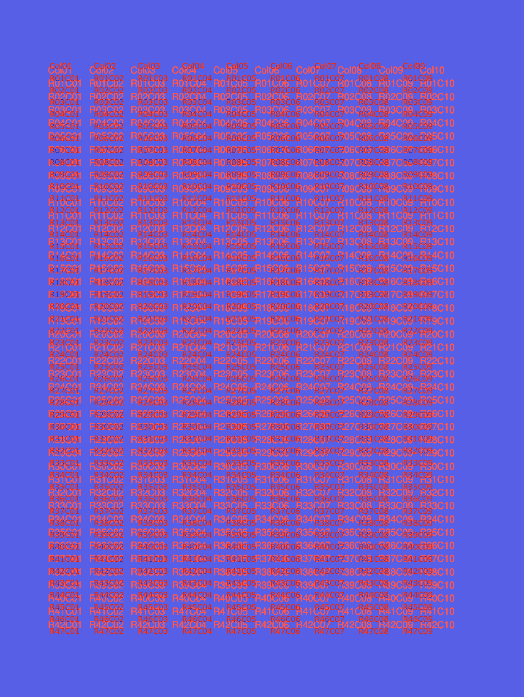</td>
  <td>changed: 468436 px (22.88%)<br>bbox: [114, 147, 1076, 1501]<br>mean abs RGB: 35.7938<br>RMSE RGB: 84.4366<br>threshold: 12, gain: 5.0</td>
</tr>
<tr>
  <td><b>classic60_large_wide_table</b><br>Page 2</td>
  <td></td>
  <td>changed: 69697 px (3.40%)<br>bbox: [115, 148, 1076, 394]<br>mean abs RGB: 5.5132<br>RMSE RGB: 33.4628<br>threshold: 12, gain: 5.0</td>
</tr>
<tr>
  <td><b>classic60_large_wide_table</b><br>Page 3</td>
  <td>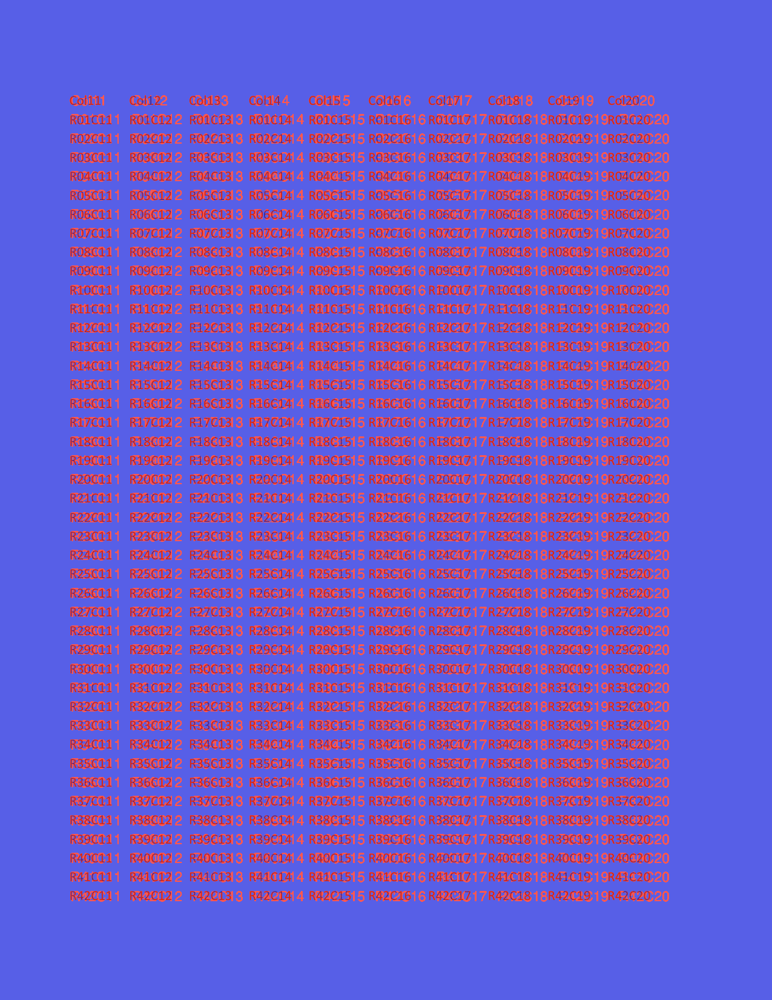</td>
  <td>changed: 445150 px (21.74%)<br>bbox: [114, 147, 1076, 1501]<br>mean abs RGB: 34.0461<br>RMSE RGB: 82.4091<br>threshold: 12, gain: 5.0</td>
</tr>
<tr>
  <td><b>classic60_large_wide_table</b><br>Page 4</td>
  <td>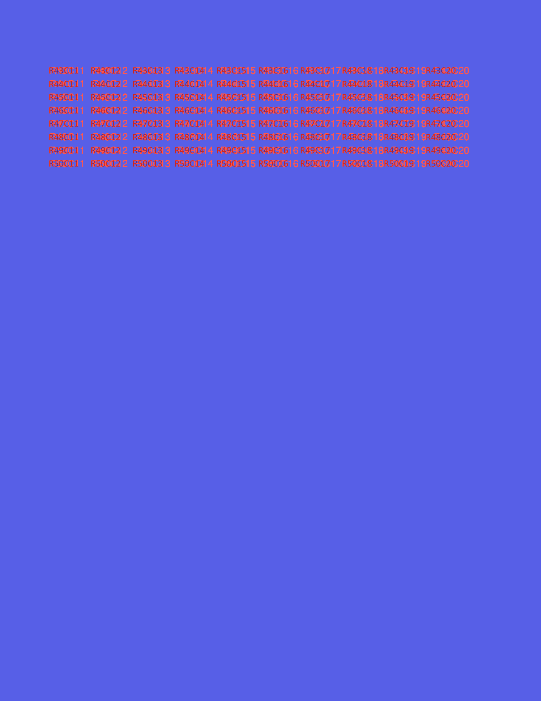</td>
  <td>changed: 65339 px (3.19%)<br>bbox: [115, 148, 1076, 394]<br>mean abs RGB: 5.18<br>RMSE RGB: 32.4707<br>threshold: 12, gain: 5.0</td>
</tr>
<tr>
  <td><b>classic61_product_card_with_image</b><br>Page 1</td>
  <td></td>
  <td>changed: 14713 px (0.72%)<br>bbox: [109, 141, 588, 442]<br>mean abs RGB: 1.0726<br>RMSE RGB: 14.2954<br>threshold: 12, gain: 5.0</td>
</tr>
<tr>
  <td><b>classic62_company_logo_header</b><br>Page 1</td>
  <td></td>
  <td>changed: 25503 px (1.25%)<br>bbox: [109, 141, 632, 429]<br>mean abs RGB: 2.0476<br>RMSE RGB: 20.3701<br>threshold: 12, gain: 5.0</td>
</tr>
<tr>
  <td><b>classic63_two_products_side_by_side</b><br>Page 1</td>
  <td></td>
  <td>changed: 24046 px (1.17%)<br>bbox: [109, 141, 567, 379]<br>mean abs RGB: 1.7842<br>RMSE RGB: 18.713<br>threshold: 12, gain: 5.0</td>
</tr>
<tr>
  <td><b>classic64_employee_directory_with_photo</b><br>Page 1</td>
  <td></td>
  <td>changed: 40940 px (2.00%)<br>bbox: [109, 142, 727, 404]<br>mean abs RGB: 2.9979<br>RMSE RGB: 23.8829<br>threshold: 12, gain: 5.0</td>
</tr>
<tr>
  <td><b>classic65_inventory_with_product_photos</b><br>Page 1</td>
  <td>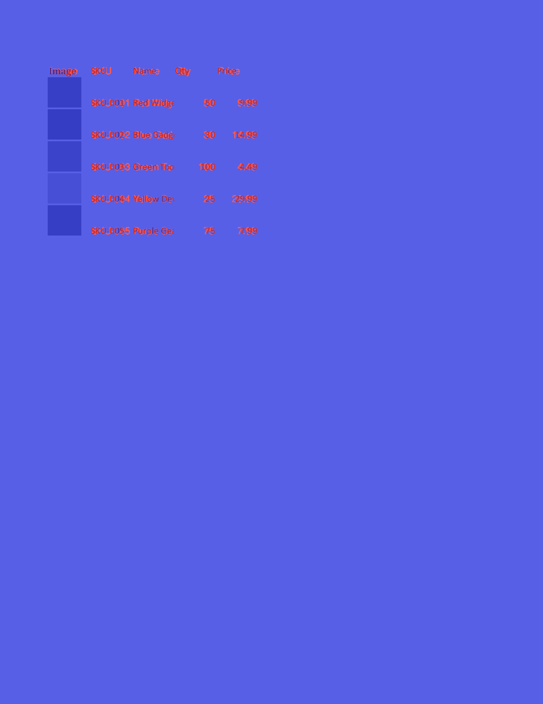</td>
  <td>changed: 36743 px (1.79%)<br>bbox: [109, 148, 631, 554]<br>mean abs RGB: 2.5993<br>RMSE RGB: 22.1285<br>threshold: 12, gain: 5.0</td>
</tr>
<tr>
  <td><b>classic66_invoice_with_logo</b><br>Page 1</td>
  <td>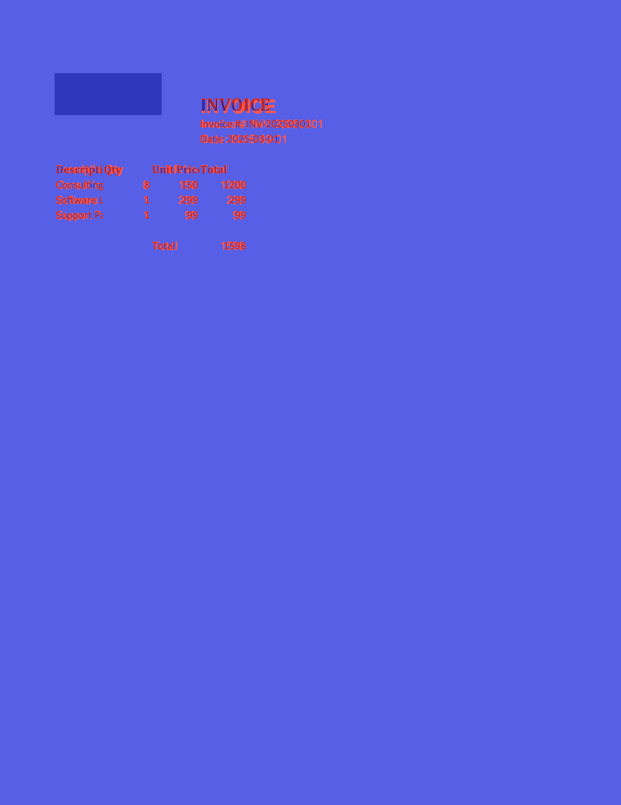</td>
  <td>changed: 28691 px (1.40%)<br>bbox: [109, 141, 660, 513]<br>mean abs RGB: 2.3655<br>RMSE RGB: 22.02<br>threshold: 12, gain: 5.0</td>
</tr>
<tr>
  <td><b>classic67_real_estate_listing</b><br>Page 1</td>
  <td></td>
  <td>changed: 25570 px (1.25%)<br>bbox: [109, 141, 640, 415]<br>mean abs RGB: 1.6889<br>RMSE RGB: 17.1518<br>threshold: 12, gain: 5.0</td>
</tr>
<tr>
  <td><b>classic68_restaurant_menu</b><br>Page 1</td>
  <td>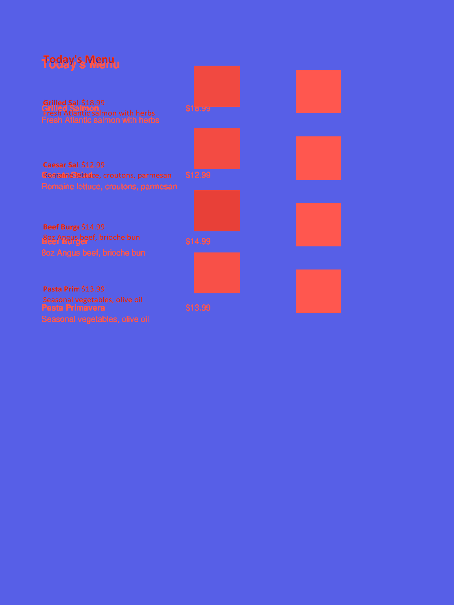</td>
  <td>changed: 89479 px (4.37%)<br>bbox: [113, 149, 656, 883]<br>mean abs RGB: 4.8168<br>RMSE RGB: 28.0813<br>threshold: 12, gain: 5.0</td>
</tr>
<tr>
  <td><b>classic69_image_only_sheet</b><br>Page 1</td>
  <td></td>
  <td>changed: 23221 px (1.13%)<br>bbox: [109, 141, 582, 463]<br>mean abs RGB: 1.6067<br>RMSE RGB: 16.4578<br>threshold: 12, gain: 5.0</td>
</tr>
<tr>
  <td><b>classic70_product_catalog_with_images</b><br>Page 1</td>
  <td>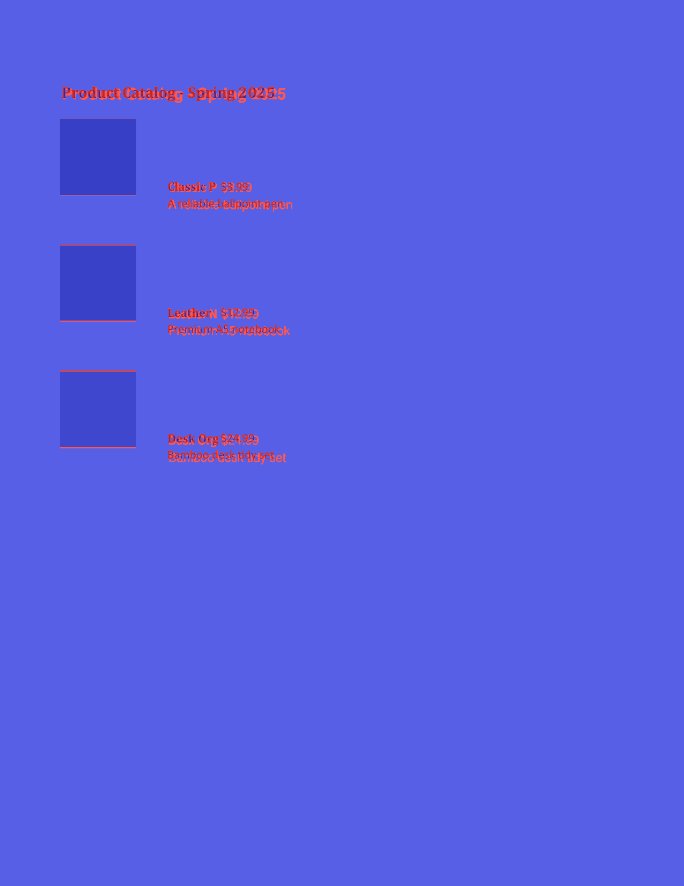</td>
  <td>changed: 56322 px (2.75%)<br>bbox: [109, 153, 542, 865]<br>mean abs RGB: 4.1894<br>RMSE RGB: 27.4086<br>threshold: 12, gain: 5.0</td>
</tr>
<tr>
  <td><b>classic71_multi_sheet_with_images</b><br>Page 1</td>
  <td></td>
  <td>changed: 9361 px (0.46%)<br>bbox: [109, 141, 318, 317]<br>mean abs RGB: 0.6834<br>RMSE RGB: 11.3039<br>threshold: 12, gain: 5.0</td>
</tr>
<tr>
  <td><b>classic71_multi_sheet_with_images</b><br>Page 2</td>
  <td></td>
  <td>changed: 8858 px (0.43%)<br>bbox: [109, 141, 318, 317]<br>mean abs RGB: 0.6476<br>RMSE RGB: 10.9302<br>threshold: 12, gain: 5.0</td>
</tr>
<tr>
  <td><b>classic71_multi_sheet_with_images</b><br>Page 3</td>
  <td></td>
  <td>changed: 8617 px (0.42%)<br>bbox: [109, 141, 324, 317]<br>mean abs RGB: 0.6212<br>RMSE RGB: 10.5122<br>threshold: 12, gain: 5.0</td>
</tr>
<tr>
  <td><b>classic72_bar_chart_image_with_data</b><br>Page 1</td>
  <td></td>
  <td>changed: 21662 px (1.06%)<br>bbox: [113, 149, 423, 429]<br>mean abs RGB: 1.8491<br>RMSE RGB: 18.6596<br>threshold: 12, gain: 5.0</td>
</tr>
<tr>
  <td><b>classic73_event_flyer_with_banner</b><br>Page 1</td>
  <td>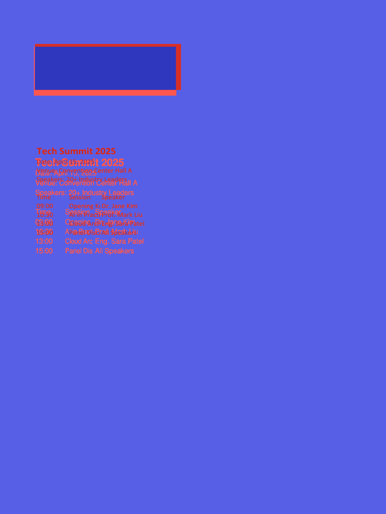</td>
  <td>changed: 49214 px (2.40%)<br>bbox: [109, 141, 582, 818]<br>mean abs RGB: 3.9346<br>RMSE RGB: 27.8488<br>threshold: 12, gain: 5.0</td>
</tr>
<tr>
  <td><b>classic74_dashboard_with_kpi_image</b><br>Page 1</td>
  <td></td>
  <td>changed: 50239 px (2.45%)<br>bbox: [114, 149, 917, 376]<br>mean abs RGB: 2.1531<br>RMSE RGB: 20.7245<br>threshold: 12, gain: 5.0</td>
</tr>
<tr>
  <td><b>classic75_certificate_with_seal</b><br>Page 1</td>
  <td></td>
  <td>changed: 43168 px (2.11%)<br>bbox: [209, 181, 785, 401]<br>mean abs RGB: 3.4762<br>RMSE RGB: 27.0449<br>threshold: 12, gain: 5.0</td>
</tr>
<tr>
  <td><b>classic76_product_image_grid</b><br>Page 1</td>
  <td></td>
  <td>changed: 54401 px (2.66%)<br>bbox: [109, 149, 683, 532]<br>mean abs RGB: 3.6503<br>RMSE RGB: 25.7925<br>threshold: 12, gain: 5.0</td>
</tr>
<tr>
  <td><b>classic77_news_article_with_hero_image</b><br>Page 1</td>
  <td></td>
  <td>changed: 63329 px (3.09%)<br>bbox: [109, 141, 872, 877]<br>mean abs RGB: 4.5438<br>RMSE RGB: 28.8215<br>threshold: 12, gain: 5.0</td>
</tr>
<tr>
  <td><b>classic78_small_icon_per_row</b><br>Page 1</td>
  <td></td>
  <td>changed: 25317 px (1.24%)<br>bbox: [109, 147, 534, 387]<br>mean abs RGB: 1.862<br>RMSE RGB: 19.1625<br>threshold: 12, gain: 5.0</td>
</tr>
<tr>
  <td><b>classic79_wide_panoramic_banner</b><br>Page 1</td>
  <td>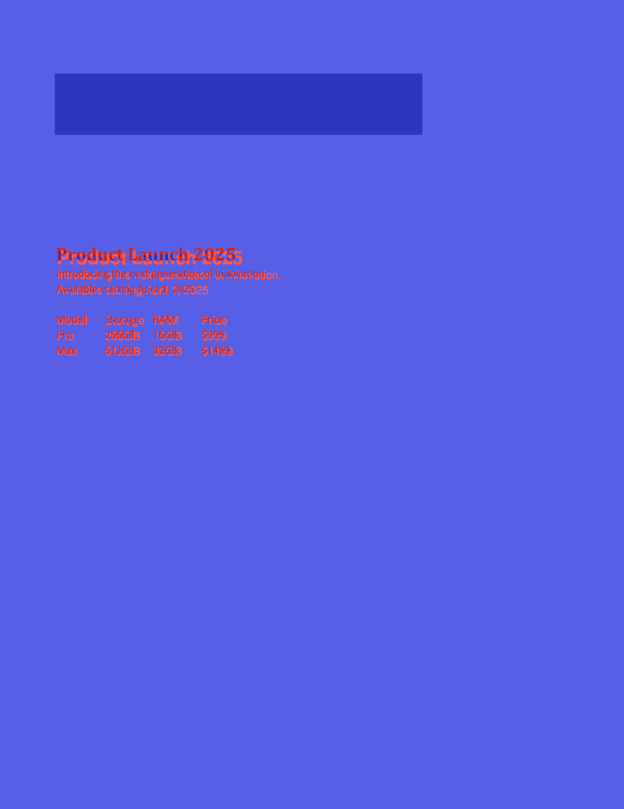</td>
  <td>changed: 50473 px (2.46%)<br>bbox: [109, 141, 863, 728]<br>mean abs RGB: 4.3165<br>RMSE RGB: 29.7263<br>threshold: 12, gain: 5.0</td>
</tr>
<tr>
  <td><b>classic80_portrait_tall_image</b><br>Page 1</td>
  <td></td>
  <td>changed: 29283 px (1.43%)<br>bbox: [109, 141, 740, 432]<br>mean abs RGB: 1.8875<br>RMSE RGB: 18.788<br>threshold: 12, gain: 5.0</td>
</tr>
<tr>
  <td><b>classic81_step_by_step_with_images</b><br>Page 1</td>
  <td>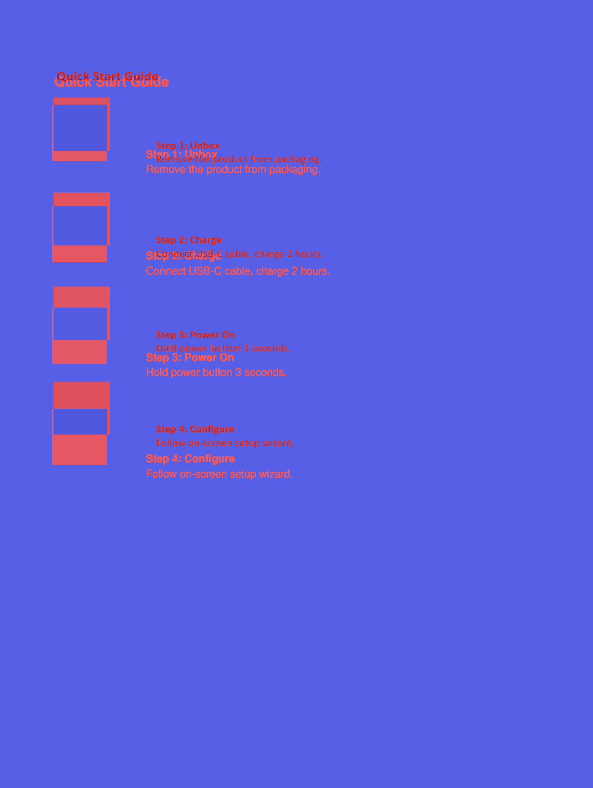</td>
  <td>changed: 71977 px (3.52%)<br>bbox: [109, 149, 690, 1005]<br>mean abs RGB: 3.175<br>RMSE RGB: 24.0992<br>threshold: 12, gain: 5.0</td>
</tr>
<tr>
  <td><b>classic82_before_after_images</b><br>Page 1</td>
  <td>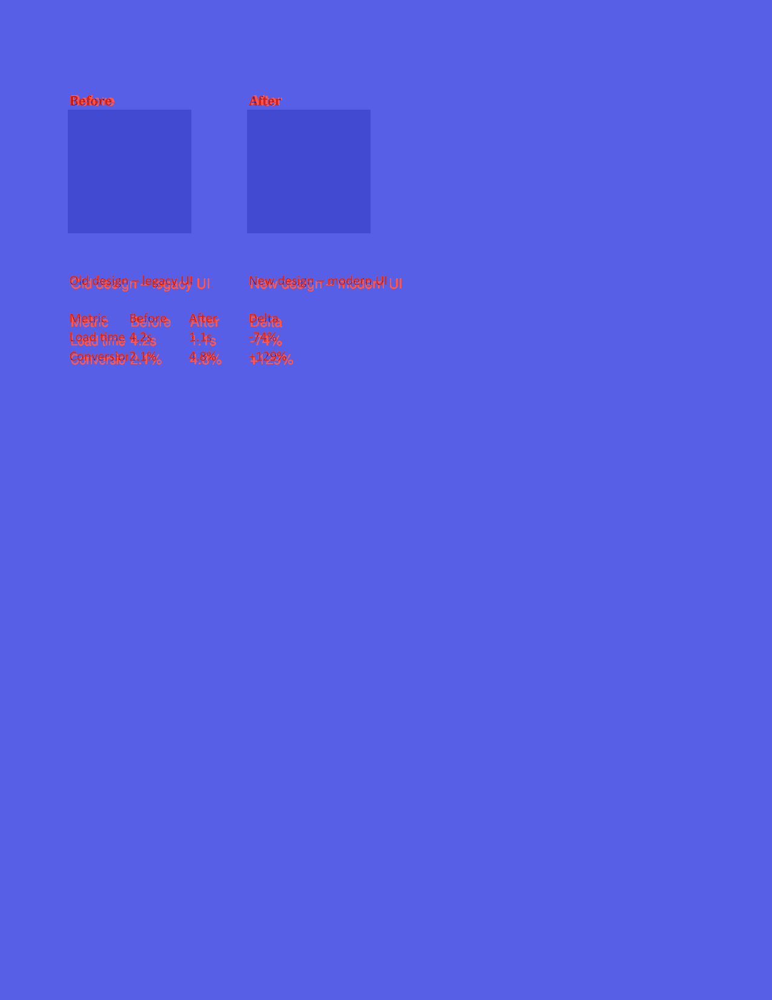</td>
  <td>changed: 45415 px (2.22%)<br>bbox: [109, 147, 660, 602]<br>mean abs RGB: 2.7834<br>RMSE RGB: 20.833<br>threshold: 12, gain: 5.0</td>
</tr>
<tr>
  <td><b>classic83_color_swatch_palette</b><br>Page 1</td>
  <td>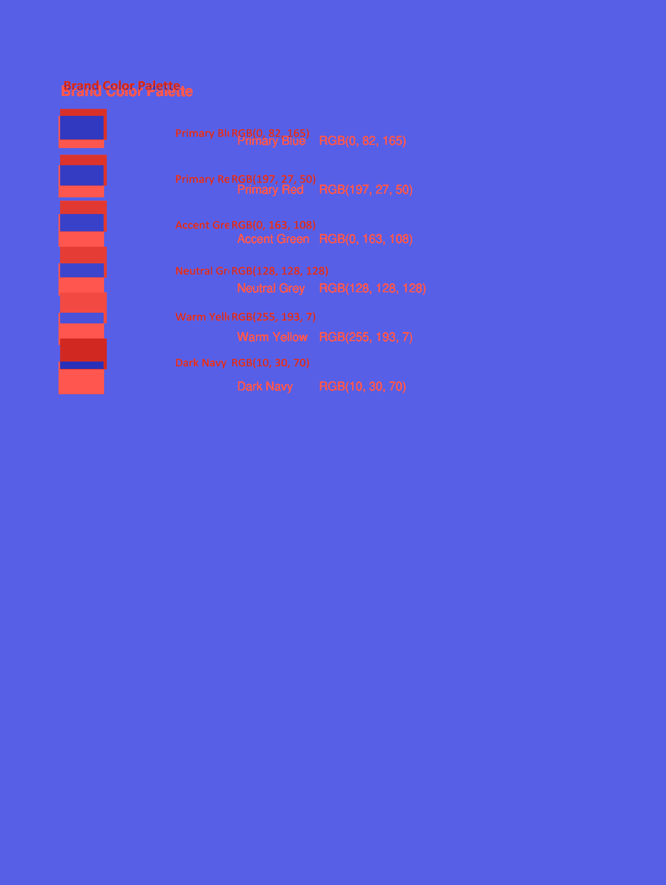</td>
  <td>changed: 57585 px (2.81%)<br>bbox: [109, 149, 611, 735]<br>mean abs RGB: 4.4474<br>RMSE RGB: 29.6935<br>threshold: 12, gain: 5.0</td>
</tr>
<tr>
  <td><b>classic85_lab_results_with_image</b><br>Page 1</td>
  <td></td>
  <td>changed: 41520 px (2.03%)<br>bbox: [114, 149, 718, 402]<br>mean abs RGB: 2.3633<br>RMSE RGB: 21.0051<br>threshold: 12, gain: 5.0</td>
</tr>
<tr>
  <td><b>classic86_software_screenshot_features</b><br>Page 1</td>
  <td></td>
  <td>changed: 19442 px (0.95%)<br>bbox: [109, 141, 684, 398]<br>mean abs RGB: 0.7104<br>RMSE RGB: 11.5379<br>threshold: 12, gain: 5.0</td>
</tr>
<tr>
  <td><b>classic87_sports_results_with_logos</b><br>Page 1</td>
  <td>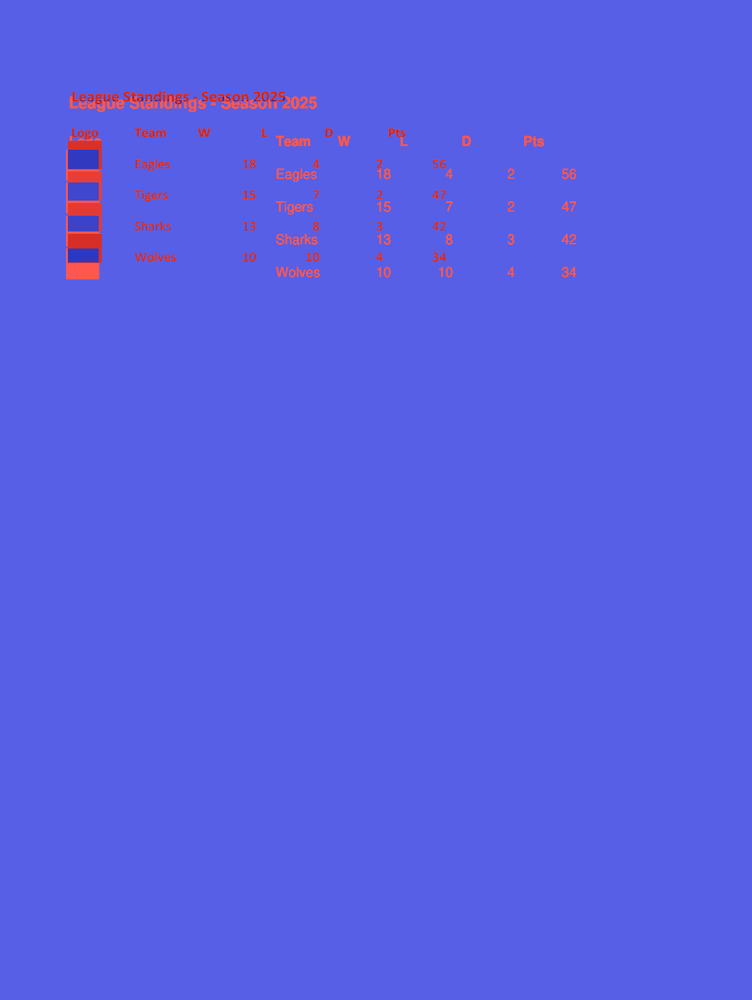</td>
  <td>changed: 26024 px (1.27%)<br>bbox: [109, 149, 736, 461]<br>mean abs RGB: 2.1089<br>RMSE RGB: 20.7458<br>threshold: 12, gain: 5.0</td>
</tr>
<tr>
  <td><b>classic88_image_after_data</b><br>Page 1</td>
  <td></td>
  <td>changed: 46637 px (2.28%)<br>bbox: [109, 147, 678, 494]<br>mean abs RGB: 2.1928<br>RMSE RGB: 20.3138<br>threshold: 12, gain: 5.0</td>
</tr>
<tr>
  <td><b>classic89_nutrition_label_with_image</b><br>Page 1</td>
  <td>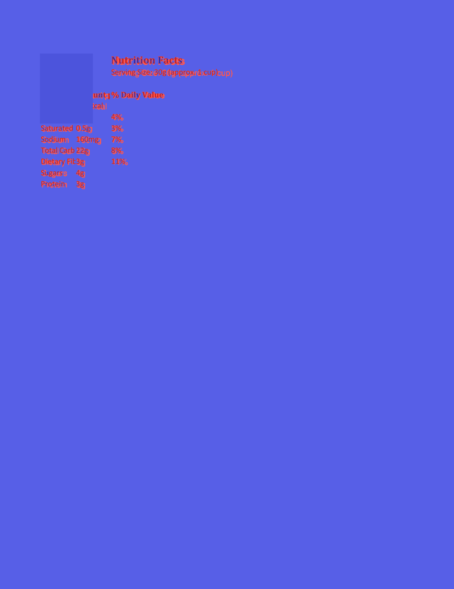</td>
  <td>changed: 28011 px (1.37%)<br>bbox: [109, 141, 636, 530]<br>mean abs RGB: 1.925<br>RMSE RGB: 19.222<br>threshold: 12, gain: 5.0</td>
</tr>
<tr>
  <td><b>classic90_project_status_with_milestones</b><br>Page 1</td>
  <td>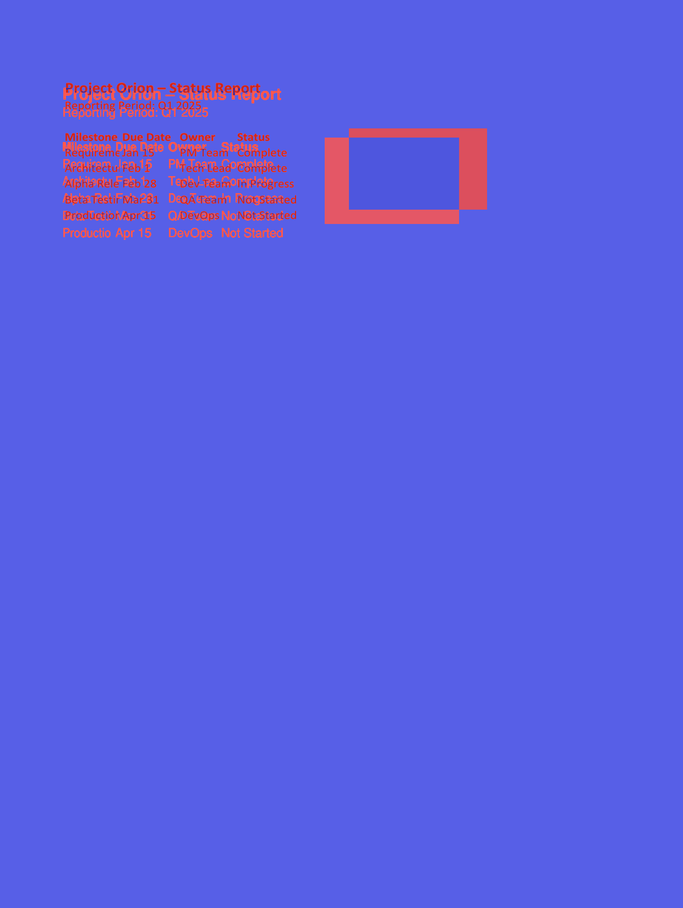</td>
  <td>changed: 59960 px (2.93%)<br>bbox: [113, 149, 885, 436]<br>mean abs RGB: 3.4804<br>RMSE RGB: 25.0509<br>threshold: 12, gain: 5.0</td>
</tr>
<tr>
  <td><b>classic91_simple_bar_chart</b><br>Page 1</td>
  <td>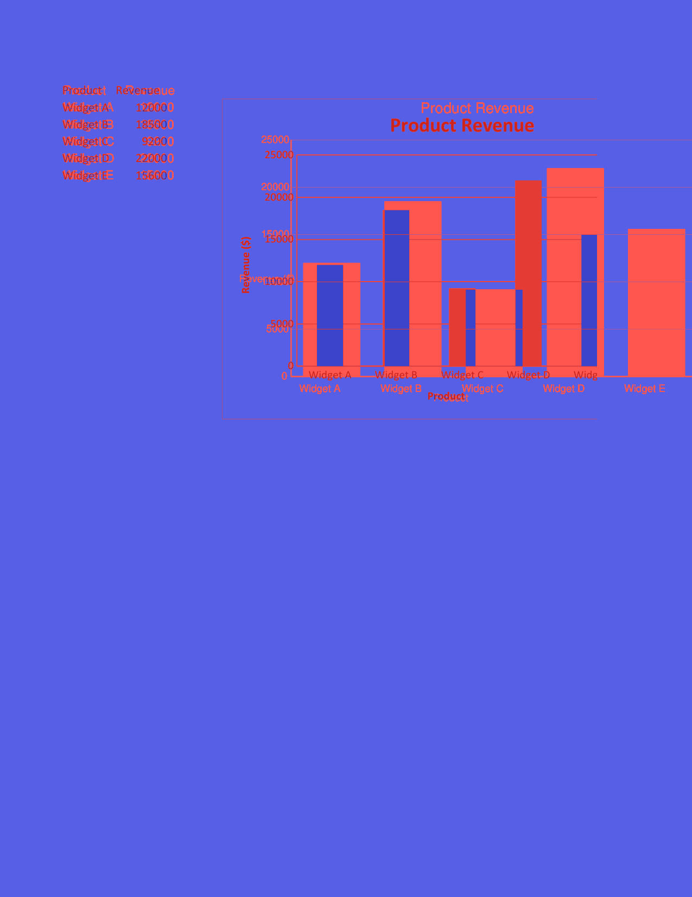</td>
  <td>changed: 235335 px (11.49%)<br>bbox: [113, 147, 1241, 739]<br>mean abs RGB: 14.0635<br>RMSE RGB: 45.2391<br>threshold: 12, gain: 5.0</td>
</tr>
<tr>
  <td><b>classic91_simple_bar_chart</b><br>Page 2</td>
  <td></td>
  <td>changed: 25462 px (1.24%)<br>bbox: [112, 168, 372, 726]<br>mean abs RGB: 1.3783<br>RMSE RGB: 13.9949<br>threshold: 12, gain: 5.0</td>
</tr>
<tr>
  <td><b>classic92_horizontal_bar_chart</b><br>Page 1</td>
  <td>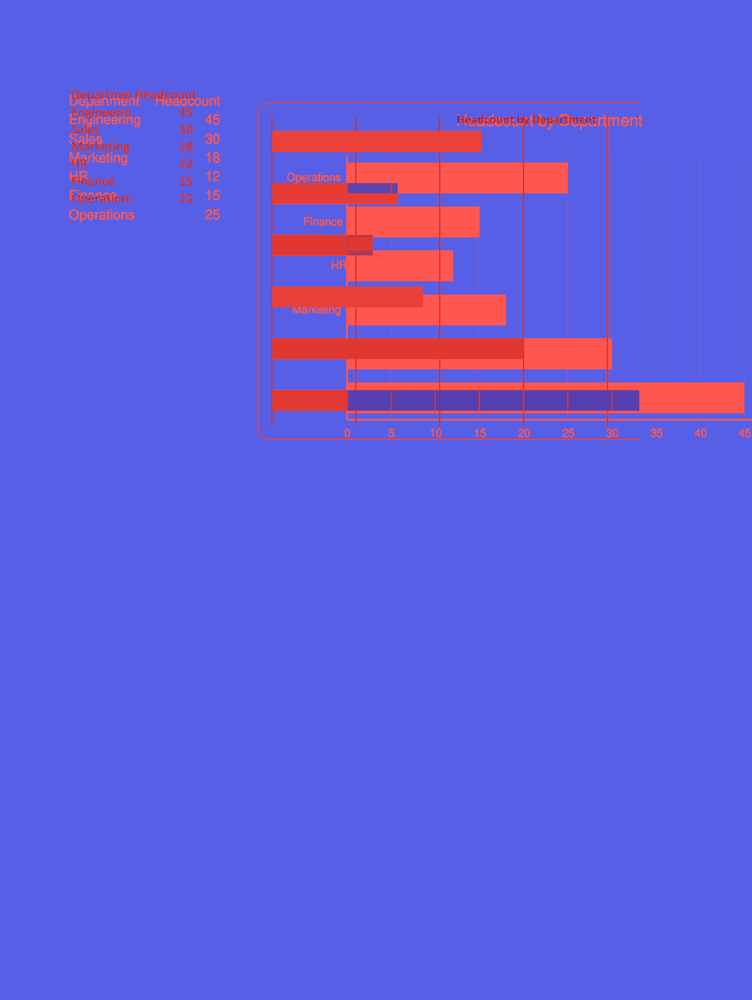</td>
  <td>changed: 179710 px (8.78%)<br>bbox: [114, 147, 1241, 726]<br>mean abs RGB: 9.595<br>RMSE RGB: 37.3529<br>threshold: 12, gain: 5.0</td>
</tr>
<tr>
  <td><b>classic92_horizontal_bar_chart</b><br>Page 2</td>
  <td>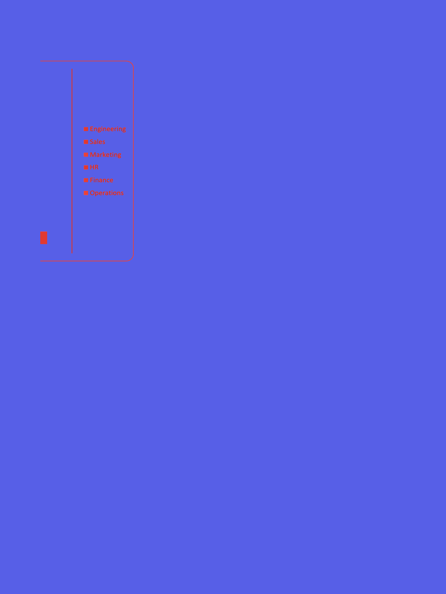</td>
  <td>changed: 8189 px (0.40%)<br>bbox: [112, 168, 372, 726]<br>mean abs RGB: 0.4937<br>RMSE RGB: 9.0256<br>threshold: 12, gain: 5.0</td>
</tr>
<tr>
  <td><b>classic93_line_chart</b><br>Page 1</td>
  <td>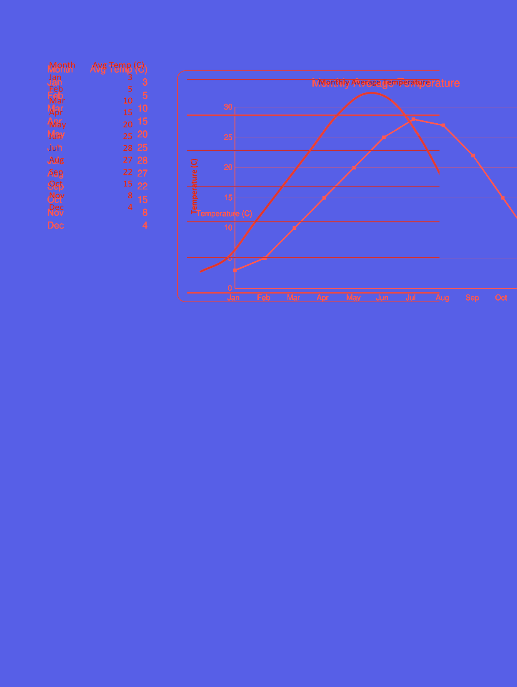</td>
  <td>changed: 54147 px (2.64%)<br>bbox: [113, 147, 1241, 726]<br>mean abs RGB: 3.3332<br>RMSE RGB: 24.2257<br>threshold: 12, gain: 5.0</td>
</tr>
<tr>
  <td><b>classic93_line_chart</b><br>Page 2</td>
  <td></td>
  <td>changed: 13286 px (0.65%)<br>bbox: [112, 168, 432, 726]<br>mean abs RGB: 0.7547<br>RMSE RGB: 10.998<br>threshold: 12, gain: 5.0</td>
</tr>
<tr>
  <td><b>classic94_pie_chart</b><br>Page 1</td>
  <td>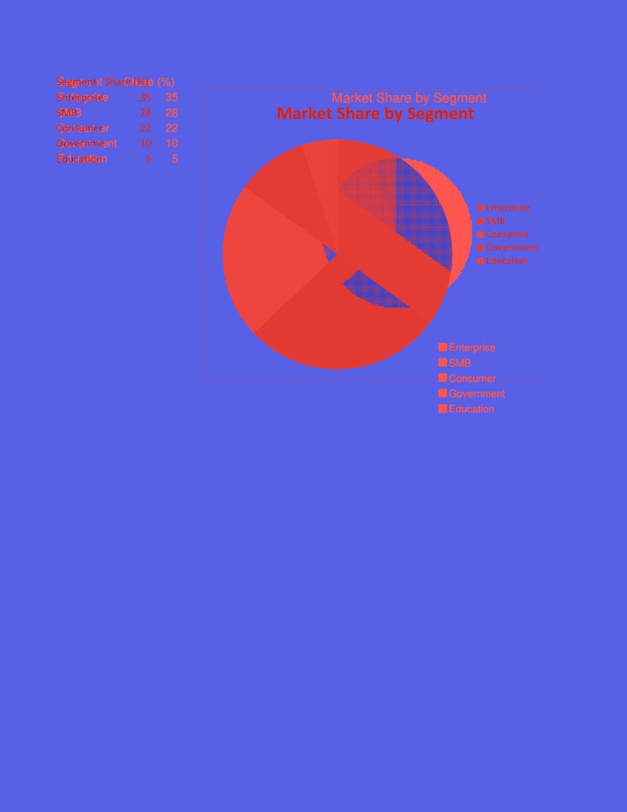</td>
  <td>changed: 213495 px (10.43%)<br>bbox: [114, 147, 1055, 839]<br>mean abs RGB: 11.1992<br>RMSE RGB: 39.8098<br>threshold: 12, gain: 5.0</td>
</tr>
<tr>
  <td><b>classic94_pie_chart</b><br>Page 2</td>
  <td></td>
  <td>changed: 2593 px (0.13%)<br>bbox: [112, 168, 195, 726]<br>mean abs RGB: 0.1472<br>RMSE RGB: 4.6978<br>threshold: 12, gain: 5.0</td>
</tr>
<tr>
  <td><b>classic95_area_chart</b><br>Page 1</td>
  <td>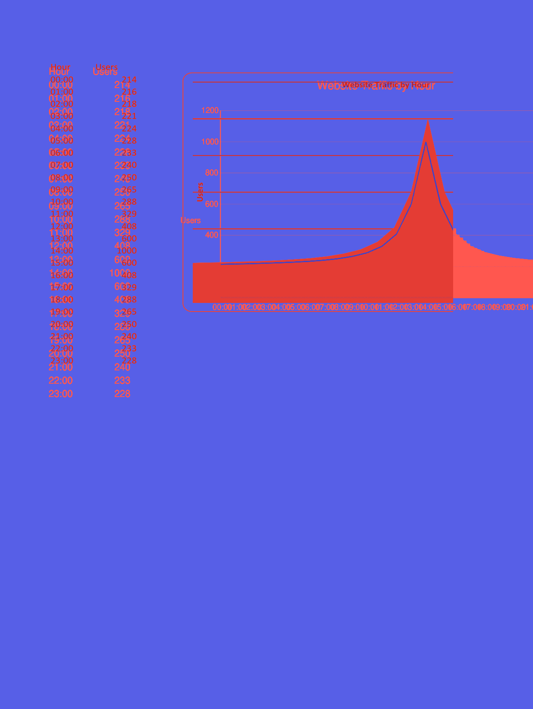</td>
  <td>changed: 171460 px (8.37%)<br>bbox: [114, 148, 1241, 925]<br>mean abs RGB: 8.1578<br>RMSE RGB: 34.2017<br>threshold: 12, gain: 5.0</td>
</tr>
<tr>
  <td><b>classic95_area_chart</b><br>Page 2</td>
  <td></td>
  <td>changed: 44355 px (2.17%)<br>bbox: [112, 168, 432, 726]<br>mean abs RGB: 2.6268<br>RMSE RGB: 19.3211<br>threshold: 12, gain: 5.0</td>
</tr>
<tr>
  <td><b>classic96_scatter_chart</b><br>Page 1</td>
  <td>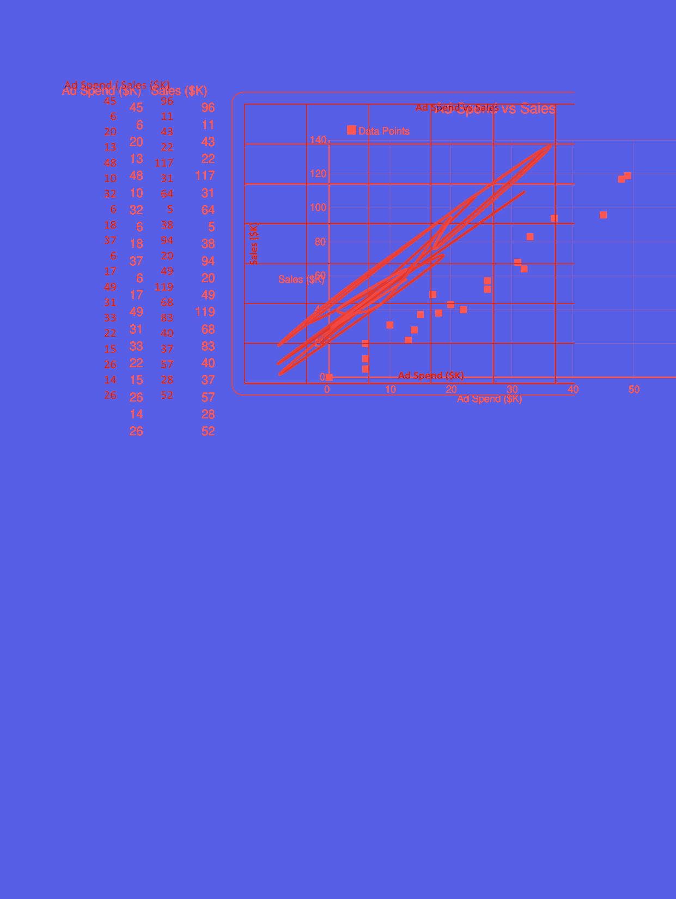</td>
  <td>changed: 84278 px (4.12%)<br>bbox: [113, 146, 1241, 800]<br>mean abs RGB: 5.1552<br>RMSE RGB: 29.8836<br>threshold: 12, gain: 5.0</td>
</tr>
<tr>
  <td><b>classic96_scatter_chart</b><br>Page 2</td>
  <td></td>
  <td>changed: 10026 px (0.49%)<br>bbox: [112, 168, 313, 726]<br>mean abs RGB: 0.627<br>RMSE RGB: 10.223<br>threshold: 12, gain: 5.0</td>
</tr>
<tr>
  <td><b>classic97_doughnut_chart</b><br>Page 1</td>
  <td></td>
  <td>changed: 217263 px (10.61%)<br>bbox: [114, 148, 1055, 839]<br>mean abs RGB: 11.8016<br>RMSE RGB: 40.7614<br>threshold: 12, gain: 5.0</td>
</tr>
<tr>
  <td><b>classic97_doughnut_chart</b><br>Page 2</td>
  <td></td>
  <td>changed: 2431 px (0.12%)<br>bbox: [112, 168, 195, 726]<br>mean abs RGB: 0.1366<br>RMSE RGB: 4.4796<br>threshold: 12, gain: 5.0</td>
</tr>
<tr>
  <td><b>classic98_radar_chart</b><br>Page 1</td>
  <td>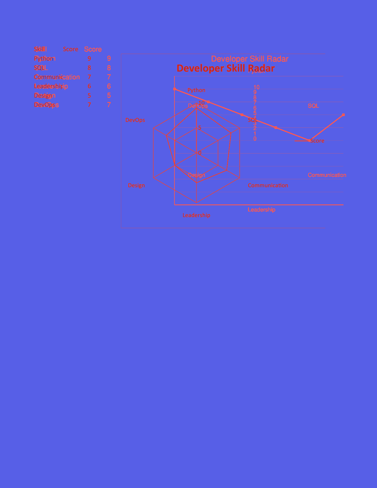</td>
  <td>changed: 51818 px (2.53%)<br>bbox: [114, 147, 1139, 726]<br>mean abs RGB: 3.0741<br>RMSE RGB: 23.2298<br>threshold: 12, gain: 5.0</td>
</tr>
<tr>
  <td><b>classic98_radar_chart</b><br>Page 2</td>
  <td></td>
  <td>changed: 1983 px (0.10%)<br>bbox: [112, 168, 195, 726]<br>mean abs RGB: 0.1044<br>RMSE RGB: 3.7132<br>threshold: 12, gain: 5.0</td>
</tr>
<tr>
  <td><b>classic99_bubble_chart</b><br>Page 1</td>
  <td>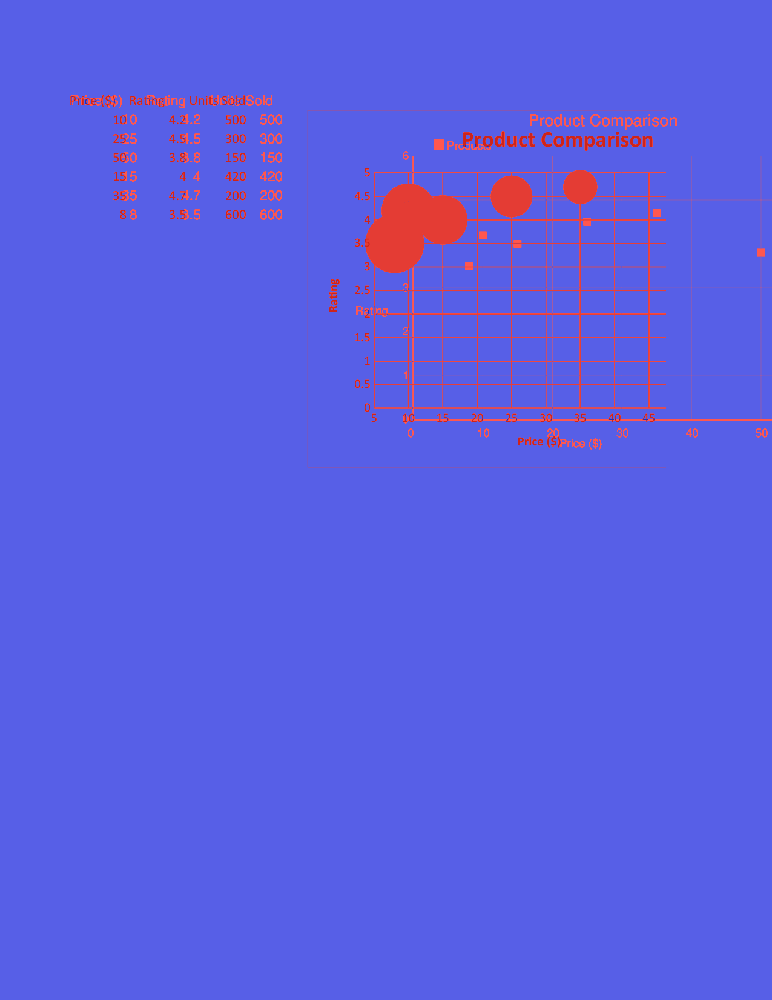</td>
  <td>changed: 81233 px (3.97%)<br>bbox: [115, 146, 1241, 742]<br>mean abs RGB: 5.0276<br>RMSE RGB: 29.171<br>threshold: 12, gain: 5.0</td>
</tr>
<tr>
  <td><b>classic99_bubble_chart</b><br>Page 2</td>
  <td></td>
  <td>changed: 14476 px (0.71%)<br>bbox: [112, 168, 418, 726]<br>mean abs RGB: 0.9653<br>RMSE RGB: 12.7907<br>threshold: 12, gain: 5.0</td>
</tr>
<tr>
  <td><b>classic100_stacked_bar_chart</b><br>Page 1</td>
  <td>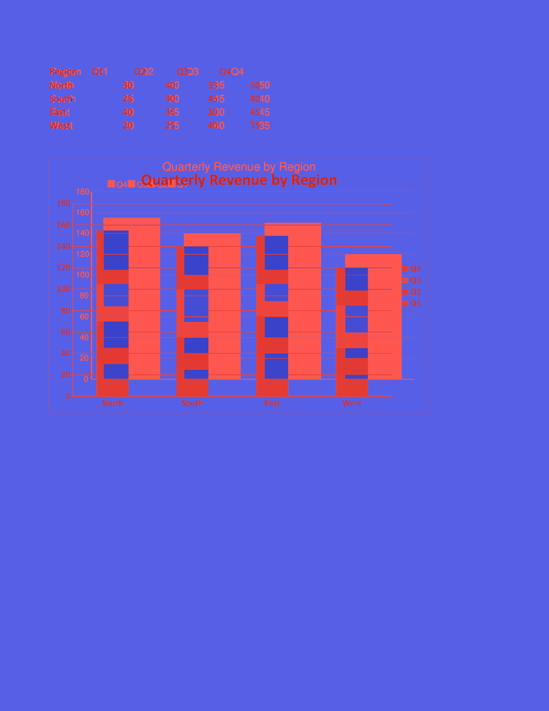</td>
  <td>changed: 224541 px (10.97%)<br>bbox: [112, 148, 999, 909]<br>mean abs RGB: 13.0188<br>RMSE RGB: 43.6177<br>threshold: 12, gain: 5.0</td>
</tr>
<tr>
  <td><b>classic101_percent_stacked_bar</b><br>Page 1</td>
  <td>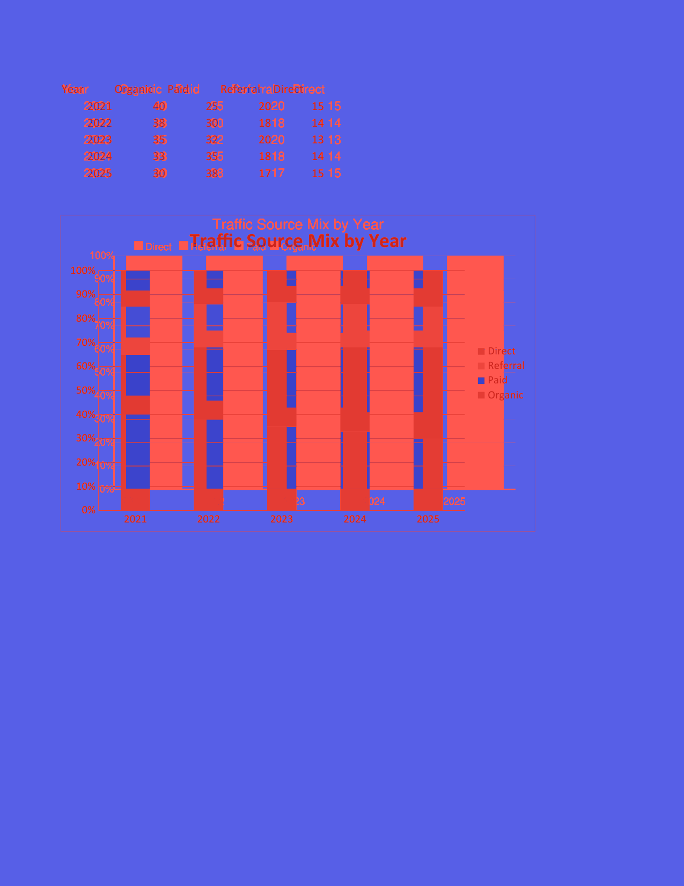</td>
  <td>changed: 289064 px (14.12%)<br>bbox: [112, 147, 999, 941]<br>mean abs RGB: 16.6662<br>RMSE RGB: 49.2705<br>threshold: 12, gain: 5.0</td>
</tr>
<tr>
  <td><b>classic102_line_chart_with_markers</b><br>Page 1</td>
  <td>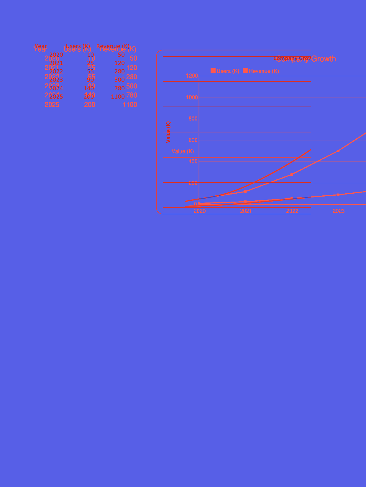</td>
  <td>changed: 51232 px (2.50%)<br>bbox: [113, 147, 1241, 726]<br>mean abs RGB: 3.1612<br>RMSE RGB: 23.7183<br>threshold: 12, gain: 5.0</td>
</tr>
<tr>
  <td><b>classic102_line_chart_with_markers</b><br>Page 2</td>
  <td></td>
  <td>changed: 15855 px (0.77%)<br>bbox: [112, 168, 536, 726]<br>mean abs RGB: 0.9851<br>RMSE RGB: 12.7226<br>threshold: 12, gain: 5.0</td>
</tr>
<tr>
  <td><b>classic103_pie_chart_with_labels</b><br>Page 1</td>
  <td>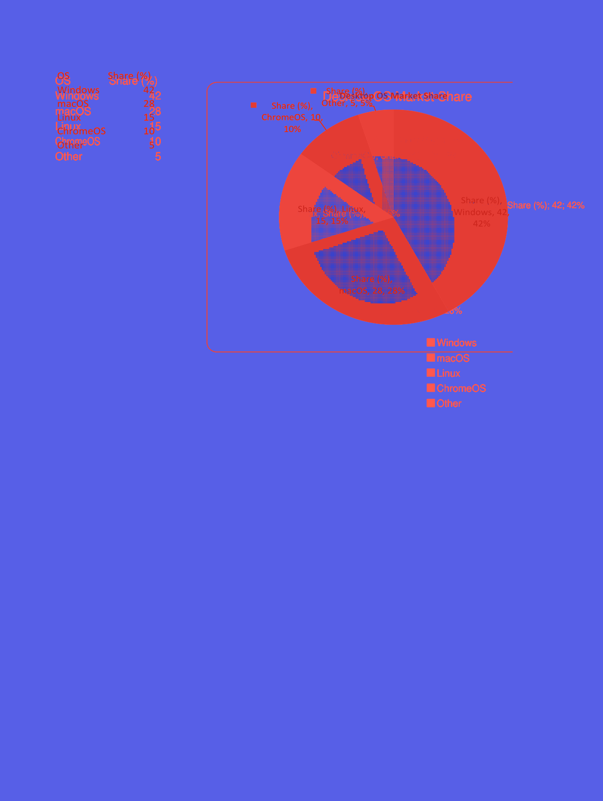</td>
  <td>changed: 164868 px (8.05%)<br>bbox: [113, 147, 1203, 839]<br>mean abs RGB: 8.2372<br>RMSE RGB: 34.0699<br>threshold: 12, gain: 5.0</td>
</tr>
<tr>
  <td><b>classic103_pie_chart_with_labels</b><br>Page 2</td>
  <td></td>
  <td>changed: 4499 px (0.22%)<br>bbox: [112, 168, 254, 726]<br>mean abs RGB: 0.2628<br>RMSE RGB: 6.4411<br>threshold: 12, gain: 5.0</td>
</tr>
<tr>
  <td><b>classic104_combo_bar_line_chart</b><br>Page 1</td>
  <td></td>
  <td>changed: 156955 px (7.67%)<br>bbox: [113, 147, 1241, 726]<br>mean abs RGB: 9.3331<br>RMSE RGB: 37.1549<br>threshold: 12, gain: 5.0</td>
</tr>
<tr>
  <td><b>classic104_combo_bar_line_chart</b><br>Page 2</td>
  <td></td>
  <td>changed: 82060 px (4.01%)<br>bbox: [112, 168, 536, 726]<br>mean abs RGB: 4.9762<br>RMSE RGB: 26.8316<br>threshold: 12, gain: 5.0</td>
</tr>
<tr>
  <td><b>classic105_3d_bar_chart</b><br>Page 1</td>
  <td></td>
  <td>changed: 161272 px (7.88%)<br>bbox: [113, 148, 1241, 726]<br>mean abs RGB: 9.3354<br>RMSE RGB: 37.5822<br>threshold: 12, gain: 5.0</td>
</tr>
<tr>
  <td><b>classic105_3d_bar_chart</b><br>Page 2</td>
  <td></td>
  <td>changed: 67576 px (3.30%)<br>bbox: [112, 168, 477, 726]<br>mean abs RGB: 4.6556<br>RMSE RGB: 27.6628<br>threshold: 12, gain: 5.0</td>
</tr>
<tr>
  <td><b>classic106_3d_pie_chart</b><br>Page 1</td>
  <td>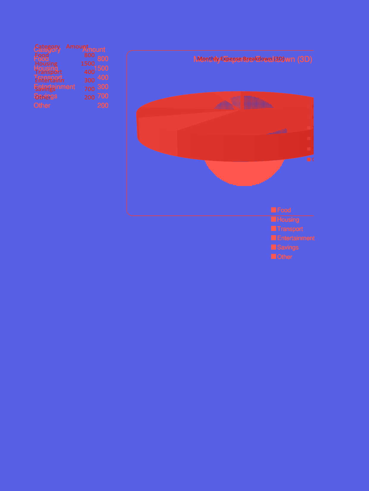</td>
  <td>changed: 169296 px (8.27%)<br>bbox: [113, 148, 1058, 871]<br>mean abs RGB: 10.1161<br>RMSE RGB: 39.3366<br>threshold: 12, gain: 5.0</td>
</tr>
<tr>
  <td><b>classic106_3d_pie_chart</b><br>Page 2</td>
  <td></td>
  <td>changed: 19112 px (0.93%)<br>bbox: [112, 168, 254, 726]<br>mean abs RGB: 1.6761<br>RMSE RGB: 18.1513<br>threshold: 12, gain: 5.0</td>
</tr>
<tr>
  <td><b>classic107_multi_series_line</b><br>Page 1</td>
  <td></td>
  <td>changed: 114154 px (5.57%)<br>bbox: [115, 148, 1241, 804]<br>mean abs RGB: 7.7814<br>RMSE RGB: 38.2263<br>threshold: 12, gain: 5.0</td>
</tr>
<tr>
  <td><b>classic107_multi_series_line</b><br>Page 2</td>
  <td></td>
  <td>changed: 33639 px (1.64%)<br>bbox: [112, 168, 759, 726]<br>mean abs RGB: 2.0681<br>RMSE RGB: 18.6389<br>threshold: 12, gain: 5.0</td>
</tr>
<tr>
  <td><b>classic108_stacked_area_chart</b><br>Page 1</td>
  <td></td>
  <td>changed: 390101 px (19.05%)<br>bbox: [112, 147, 1055, 976]<br>mean abs RGB: 16.5015<br>RMSE RGB: 44.7095<br>threshold: 12, gain: 5.0</td>
</tr>
<tr>
  <td><b>classic109_scatter_with_trendline</b><br>Page 1</td>
  <td></td>
  <td>changed: 72926 px (3.56%)<br>bbox: [114, 147, 1241, 739]<br>mean abs RGB: 4.4124<br>RMSE RGB: 27.6662<br>threshold: 12, gain: 5.0</td>
</tr>
<tr>
  <td><b>classic109_scatter_with_trendline</b><br>Page 2</td>
  <td></td>
  <td>changed: 9890 px (0.48%)<br>bbox: [112, 168, 313, 726]<br>mean abs RGB: 0.671<br>RMSE RGB: 11.0044<br>threshold: 12, gain: 5.0</td>
</tr>
<tr>
  <td><b>classic110_chart_with_legend</b><br>Page 1</td>
  <td></td>
  <td>changed: 138190 px (6.75%)<br>bbox: [114, 147, 1241, 726]<br>mean abs RGB: 8.207<br>RMSE RGB: 35.3842<br>threshold: 12, gain: 5.0</td>
</tr>
<tr>
  <td><b>classic110_chart_with_legend</b><br>Page 2</td>
  <td></td>
  <td>changed: 17654 px (0.86%)<br>bbox: [112, 168, 477, 726]<br>mean abs RGB: 1.1368<br>RMSE RGB: 13.5585<br>threshold: 12, gain: 5.0</td>
</tr>
<tr>
  <td><b>classic111_chart_with_axis_labels</b><br>Page 1</td>
  <td></td>
  <td>changed: 126167 px (6.16%)<br>bbox: [113, 147, 1241, 742]<br>mean abs RGB: 6.5359<br>RMSE RGB: 31.4988<br>threshold: 12, gain: 5.0</td>
</tr>
<tr>
  <td><b>classic111_chart_with_axis_labels</b><br>Page 2</td>
  <td></td>
  <td>changed: 10593 px (0.52%)<br>bbox: [112, 168, 432, 726]<br>mean abs RGB: 0.667<br>RMSE RGB: 10.5314<br>threshold: 12, gain: 5.0</td>
</tr>
<tr>
  <td><b>classic112_multiple_charts</b><br>Page 1</td>
  <td></td>
  <td>changed: 151079 px (7.38%)<br>bbox: [113, 147, 1241, 1167]<br>mean abs RGB: 8.9375<br>RMSE RGB: 37.1749<br>threshold: 12, gain: 5.0</td>
</tr>
<tr>
  <td><b>classic112_multiple_charts</b><br>Page 2</td>
  <td></td>
  <td>changed: 82134 px (4.01%)<br>bbox: [112, 168, 522, 1126]<br>mean abs RGB: 5.117<br>RMSE RGB: 27.9615<br>threshold: 12, gain: 5.0</td>
</tr>
<tr>
  <td><b>classic113_chart_sheet</b><br>Page 1</td>
  <td></td>
  <td>changed: 220898 px (10.79%)<br>bbox: [114, 148, 1241, 840]<br>mean abs RGB: 11.9237<br>RMSE RGB: 40.2526<br>threshold: 12, gain: 5.0</td>
</tr>
<tr>
  <td><b>classic113_chart_sheet</b><br>Page 2</td>
  <td></td>
  <td>changed: 79234 px (3.87%)<br>bbox: [112, 168, 550, 838]<br>mean abs RGB: 4.6492<br>RMSE RGB: 25.0261<br>threshold: 12, gain: 5.0</td>
</tr>
<tr>
  <td><b>classic114_chart_large_dataset</b><br>Page 1</td>
  <td></td>
  <td>changed: 97708 px (4.77%)<br>bbox: [115, 147, 1241, 1501]<br>mean abs RGB: 6.5027<br>RMSE RGB: 34.8044<br>threshold: 12, gain: 5.0</td>
</tr>
<tr>
  <td><b>classic114_chart_large_dataset</b><br>Page 2</td>
  <td></td>
  <td>changed: 43829 px (2.14%)<br>bbox: [177, 148, 318, 1501]<br>mean abs RGB: 3.3452<br>RMSE RGB: 25.806<br>threshold: 12, gain: 5.0</td>
</tr>
<tr>
  <td><b>classic114_chart_large_dataset</b><br>Page 3</td>
  <td></td>
  <td>changed: 11585 px (0.57%)<br>bbox: [166, 148, 318, 613]<br>mean abs RGB: 0.9053<br>RMSE RGB: 13.512<br>threshold: 12, gain: 5.0</td>
</tr>
<tr>
  <td><b>classic114_chart_large_dataset</b><br>Page 4</td>
  <td></td>
  <td>changed: 22857 px (1.12%)<br>bbox: [112, 168, 668, 726]<br>mean abs RGB: 1.3144<br>RMSE RGB: 14.7143<br>threshold: 12, gain: 5.0</td>
</tr>
<tr>
  <td><b>classic115_chart_negative_values</b><br>Page 1</td>
  <td></td>
  <td>changed: 135558 px (6.62%)<br>bbox: [113, 146, 1241, 726]<br>mean abs RGB: 8.0217<br>RMSE RGB: 34.9074<br>threshold: 12, gain: 5.0</td>
</tr>
<tr>
  <td><b>classic115_chart_negative_values</b><br>Page 2</td>
  <td></td>
  <td>changed: 16431 px (0.80%)<br>bbox: [112, 168, 372, 726]<br>mean abs RGB: 0.8624<br>RMSE RGB: 11.0281<br>threshold: 12, gain: 5.0</td>
</tr>
<tr>
  <td><b>classic116_percent_stacked_area</b><br>Page 1</td>
  <td></td>
  <td>changed: 489289 px (23.90%)<br>bbox: [112, 147, 1055, 972]<br>mean abs RGB: 20.2514<br>RMSE RGB: 48.0962<br>threshold: 12, gain: 5.0</td>
</tr>
<tr>
  <td><b>classic117_stock_ohlc_chart</b><br>Page 1</td>
  <td></td>
  <td>changed: 183492 px (8.96%)<br>bbox: [115, 147, 1241, 726]<br>mean abs RGB: 10.8104<br>RMSE RGB: 41.0241<br>threshold: 12, gain: 5.0</td>
</tr>
<tr>
  <td><b>classic117_stock_ohlc_chart</b><br>Page 2</td>
  <td></td>
  <td>changed: 184296 px (9.00%)<br>bbox: [112, 168, 863, 726]<br>mean abs RGB: 11.1653<br>RMSE RGB: 39.8082<br>threshold: 12, gain: 5.0</td>
</tr>
<tr>
  <td><b>classic118_bar_chart_custom_colors</b><br>Page 1</td>
  <td></td>
  <td>changed: 171378 px (8.37%)<br>bbox: [113, 148, 1241, 726]<br>mean abs RGB: 10.7157<br>RMSE RGB: 41.9119<br>threshold: 12, gain: 5.0</td>
</tr>
<tr>
  <td><b>classic118_bar_chart_custom_colors</b><br>Page 2</td>
  <td></td>
  <td>changed: 9954 px (0.49%)<br>bbox: [112, 168, 372, 726]<br>mean abs RGB: 0.6375<br>RMSE RGB: 10.5745<br>threshold: 12, gain: 5.0</td>
</tr>
<tr>
  <td><b>classic119_dashboard_multi_charts</b><br>Page 1</td>
  <td></td>
  <td>changed: 267577 px (13.07%)<br>bbox: [114, 149, 1241, 1134]<br>mean abs RGB: 15.7995<br>RMSE RGB: 48.8105<br>threshold: 12, gain: 5.0</td>
</tr>
<tr>
  <td><b>classic119_dashboard_multi_charts</b><br>Page 2</td>
  <td></td>
  <td>changed: 39319 px (1.92%)<br>bbox: [112, 175, 300, 1021]<br>mean abs RGB: 2.401<br>RMSE RGB: 18.9385<br>threshold: 12, gain: 5.0</td>
</tr>
<tr>
  <td><b>classic120_chart_with_date_axis</b><br>Page 1</td>
  <td></td>
  <td>changed: 78653 px (3.84%)<br>bbox: [114, 147, 1241, 739]<br>mean abs RGB: 4.9986<br>RMSE RGB: 30.2134<br>threshold: 12, gain: 5.0</td>
</tr>
<tr>
  <td><b>classic120_chart_with_date_axis</b><br>Page 2</td>
  <td></td>
  <td>changed: 22718 px (1.11%)<br>bbox: [112, 168, 550, 726]<br>mean abs RGB: 1.4036<br>RMSE RGB: 15.5358<br>threshold: 12, gain: 5.0</td>
</tr>
<tr>
  <td><b>classic121_thin_borders</b><br>Page 1</td>
  <td></td>
  <td>changed: 31093 px (1.52%)<br>bbox: [109, 140, 533, 338]<br>mean abs RGB: 2.255<br>RMSE RGB: 20.8178<br>threshold: 12, gain: 5.0</td>
</tr>
<tr>
  <td><b>classic122_thick_outer_thin_inner</b><br>Page 1</td>
  <td></td>
  <td>changed: 38535 px (1.88%)<br>bbox: [107, 139, 535, 339]<br>mean abs RGB: 3.1458<br>RMSE RGB: 25.5166<br>threshold: 12, gain: 5.0</td>
</tr>
<tr>
  <td><b>classic123_dashed_borders</b><br>Page 1</td>
  <td></td>
  <td>changed: 22273 px (1.09%)<br>bbox: [113, 147, 421, 339]<br>mean abs RGB: 1.6703<br>RMSE RGB: 18.1363<br>threshold: 12, gain: 5.0</td>
</tr>
<tr>
  <td><b>classic124_colored_borders</b><br>Page 1</td>
  <td></td>
  <td>changed: 36781 px (1.80%)<br>bbox: [113, 147, 545, 370]<br>mean abs RGB: 2.6949<br>RMSE RGB: 23.0126<br>threshold: 12, gain: 5.0</td>
</tr>
<tr>
  <td><b>classic125_solid_fills</b><br>Page 1</td>
  <td></td>
  <td>changed: 55739 px (2.72%)<br>bbox: [114, 147, 399, 432]<br>mean abs RGB: 2.4027<br>RMSE RGB: 20.3486<br>threshold: 12, gain: 5.0</td>
</tr>
<tr>
  <td><b>classic126_dark_header</b><br>Page 1</td>
  <td></td>
  <td>changed: 40700 px (1.99%)<br>bbox: [109, 142, 623, 331]<br>mean abs RGB: 3.0289<br>RMSE RGB: 23.9743<br>threshold: 12, gain: 5.0</td>
</tr>
<tr>
  <td><b>classic127_font_styles</b><br>Page 1</td>
  <td></td>
  <td>changed: 42540 px (2.08%)<br>bbox: [114, 147, 605, 429]<br>mean abs RGB: 3.2459<br>RMSE RGB: 25.6704<br>threshold: 12, gain: 5.0</td>
</tr>
<tr>
  <td><b>classic128_font_sizes</b><br>Page 1</td>
  <td></td>
  <td>changed: 28581 px (1.40%)<br>bbox: [114, 147, 479, 583]<br>mean abs RGB: 2.4354<br>RMSE RGB: 22.7981<br>threshold: 12, gain: 5.0</td>
</tr>
<tr>
  <td><b>classic129_alignment_combos</b><br>Page 1</td>
  <td></td>
  <td>changed: 19923 px (0.97%)<br>bbox: [113, 147, 849, 429]<br>mean abs RGB: 1.589<br>RMSE RGB: 18.0262<br>threshold: 12, gain: 5.0</td>
</tr>
<tr>
  <td><b>classic130_wrap_and_indent</b><br>Page 1</td>
  <td></td>
  <td>changed: 22950 px (1.12%)<br>bbox: [113, 147, 660, 436]<br>mean abs RGB: 1.7965<br>RMSE RGB: 19.0172<br>threshold: 12, gain: 5.0</td>
</tr>
<tr>
  <td><b>classic131_number_formats</b><br>Page 1</td>
  <td></td>
  <td>changed: 38624 px (1.89%)<br>bbox: [113, 147, 838, 488]<br>mean abs RGB: 2.9724<br>RMSE RGB: 24.3527<br>threshold: 12, gain: 5.0</td>
</tr>
<tr>
  <td><b>classic132_striped_table</b><br>Page 1</td>
  <td></td>
  <td>changed: 124009 px (6.06%)<br>bbox: [109, 141, 583, 494]<br>mean abs RGB: 3.969<br>RMSE RGB: 24.185<br>threshold: 12, gain: 5.0</td>
</tr>
<tr>
  <td><b>classic133_gradient_rows</b><br>Page 1</td>
  <td></td>
  <td>changed: 109796 px (5.36%)<br>bbox: [109, 147, 493, 494]<br>mean abs RGB: 4.8883<br>RMSE RGB: 32.2242<br>threshold: 12, gain: 5.0</td>
</tr>
<tr>
  <td><b>classic134_heatmap</b><br>Page 1</td>
  <td></td>
  <td>changed: 123582 px (6.04%)<br>bbox: [114, 147, 846, 400]<br>mean abs RGB: 6.1049<br>RMSE RGB: 32.2774<br>threshold: 12, gain: 5.0</td>
</tr>
<tr>
  <td><b>classic135_bottom_border_only</b><br>Page 1</td>
  <td></td>
  <td>changed: 20084 px (0.98%)<br>bbox: [109, 149, 558, 345]<br>mean abs RGB: 1.6917<br>RMSE RGB: 18.8116<br>threshold: 12, gain: 5.0</td>
</tr>
<tr>
  <td><b>classic136_financial_report_styled</b><br>Page 1</td>
  <td></td>
  <td>changed: 84016 px (4.10%)<br>bbox: [109, 141, 761, 466]<br>mean abs RGB: 5.662<br>RMSE RGB: 32.3432<br>threshold: 12, gain: 5.0</td>
</tr>
<tr>
  <td><b>classic137_checkerboard</b><br>Page 1</td>
  <td></td>
  <td>changed: 102726 px (5.02%)<br>bbox: [109, 143, 584, 567]<br>mean abs RGB: 7.7851<br>RMSE RGB: 37.5375<br>threshold: 12, gain: 5.0</td>
</tr>
<tr>
  <td><b>classic138_color_grid</b><br>Page 1</td>
  <td></td>
  <td>changed: 59899 px (2.93%)<br>bbox: [109, 143, 608, 400]<br>mean abs RGB: 2.2956<br>RMSE RGB: 17.5381<br>threshold: 12, gain: 5.0</td>
</tr>
<tr>
  <td><b>classic139_pattern_fills</b><br>Page 1</td>
  <td></td>
  <td>changed: 102569 px (5.01%)<br>bbox: [113, 147, 584, 557]<br>mean abs RGB: 4.459<br>RMSE RGB: 25.6543<br>threshold: 12, gain: 5.0</td>
</tr>
<tr>
  <td><b>classic140_rotated_text</b><br>Page 1</td>
  <td></td>
  <td>changed: 20647 px (1.01%)<br>bbox: [113, 148, 421, 1092]<br>mean abs RGB: 1.6238<br>RMSE RGB: 18.1184<br>threshold: 12, gain: 5.0</td>
</tr>
<tr>
  <td><b>classic141_mixed_edge_borders</b><br>Page 1</td>
  <td></td>
  <td>changed: 35220 px (1.72%)<br>bbox: [113, 147, 705, 496]<br>mean abs RGB: 2.5389<br>RMSE RGB: 22.847<br>threshold: 12, gain: 5.0</td>
</tr>
<tr>
  <td><b>classic142_styled_invoice</b><br>Page 1</td>
  <td></td>
  <td>changed: 166422 px (8.13%)<br>bbox: [109, 143, 914, 615]<br>mean abs RGB: 7.4273<br>RMSE RGB: 35.3482<br>threshold: 12, gain: 5.0</td>
</tr>
<tr>
  <td><b>classic143_colored_tabs</b><br>Page 1</td>
  <td></td>
  <td>changed: 5654 px (0.28%)<br>bbox: [114, 147, 318, 238]<br>mean abs RGB: 0.4513<br>RMSE RGB: 9.6421<br>threshold: 12, gain: 5.0</td>
</tr>
<tr>
  <td><b>classic143_colored_tabs</b><br>Page 2</td>
  <td></td>
  <td>changed: 5463 px (0.27%)<br>bbox: [113, 147, 318, 242]<br>mean abs RGB: 0.4393<br>RMSE RGB: 9.495<br>threshold: 12, gain: 5.0</td>
</tr>
<tr>
  <td><b>classic143_colored_tabs</b><br>Page 3</td>
  <td></td>
  <td>changed: 5755 px (0.28%)<br>bbox: [114, 147, 318, 238]<br>mean abs RGB: 0.4695<br>RMSE RGB: 9.8543<br>threshold: 12, gain: 5.0</td>
</tr>
<tr>
  <td><b>classic143_colored_tabs</b><br>Page 4</td>
  <td></td>
  <td>changed: 5279 px (0.26%)<br>bbox: [114, 147, 318, 242]<br>mean abs RGB: 0.4276<br>RMSE RGB: 9.3904<br>threshold: 12, gain: 5.0</td>
</tr>
<tr>
  <td><b>classic144_note_style_cells</b><br>Page 1</td>
  <td></td>
  <td>changed: 50235 px (2.45%)<br>bbox: [113, 147, 761, 338]<br>mean abs RGB: 1.7336<br>RMSE RGB: 16.0221<br>threshold: 12, gain: 5.0</td>
</tr>
<tr>
  <td><b>classic145_status_badges</b><br>Page 1</td>
  <td></td>
  <td>changed: 97670 px (4.77%)<br>bbox: [109, 141, 855, 401]<br>mean abs RGB: 4.744<br>RMSE RGB: 27.5723<br>threshold: 12, gain: 5.0</td>
</tr>
<tr>
  <td><b>classic146_double_border_table</b><br>Page 1</td>
  <td></td>
  <td>changed: 44284 px (2.16%)<br>bbox: [109, 139, 681, 307]<br>mean abs RGB: 2.8324<br>RMSE RGB: 22.981<br>threshold: 12, gain: 5.0</td>
</tr>
<tr>
  <td><b>classic147_multi_sheet_styled</b><br>Page 1</td>
  <td></td>
  <td>changed: 27012 px (1.32%)<br>bbox: [109, 141, 491, 307]<br>mean abs RGB: 1.6635<br>RMSE RGB: 16.4793<br>threshold: 12, gain: 5.0</td>
</tr>
<tr>
  <td><b>classic147_multi_sheet_styled</b><br>Page 2</td>
  <td></td>
  <td>changed: 49022 px (2.39%)<br>bbox: [109, 141, 867, 307]<br>mean abs RGB: 2.9727<br>RMSE RGB: 21.7203<br>threshold: 12, gain: 5.0</td>
</tr>
<tr>
  <td><b>classic147_multi_sheet_styled</b><br>Page 3</td>
  <td></td>
  <td>changed: 35695 px (1.74%)<br>bbox: [109, 141, 679, 307]<br>mean abs RGB: 2.0166<br>RMSE RGB: 18.0489<br>threshold: 12, gain: 5.0</td>
</tr>
<tr>
  <td><b>classic148_frozen_styled_grid</b><br>Page 1</td>
  <td></td>
  <td>changed: 442365 px (21.60%)<br>bbox: [109, 141, 1102, 807]<br>mean abs RGB: 14.4056<br>RMSE RGB: 43.7985<br>threshold: 12, gain: 5.0</td>
</tr>
<tr>
  <td><b>classic149_merged_styled_sections</b><br>Page 1</td>
  <td></td>
  <td>changed: 150547 px (7.35%)<br>bbox: [109, 142, 867, 572]<br>mean abs RGB: 9.2635<br>RMSE RGB: 41.4028<br>threshold: 12, gain: 5.0</td>
</tr>
<tr>
  <td><b>classic150_kitchen_sink_styles</b><br>Page 1</td>
  <td></td>
  <td>changed: 118574 px (5.79%)<br>bbox: [109, 142, 996, 637]<br>mean abs RGB: 7.7257<br>RMSE RGB: 37.7341<br>threshold: 12, gain: 5.0</td>
</tr>
<tr>
  <td><b>classic151_multilingual_greetings</b><br>Page 1</td>
  <td></td>
  <td>changed: 38073 px (1.86%)<br>bbox: [113, 147, 979, 555]<br>mean abs RGB: 2.8201<br>RMSE RGB: 23.3674<br>threshold: 12, gain: 5.0</td>
</tr>
<tr>
  <td><b>classic152_emoji_sampler</b><br>Page 1</td>
  <td></td>
  <td>changed: 31579 px (1.54%)<br>bbox: [113, 148, 489, 429]<br>mean abs RGB: 2.3462<br>RMSE RGB: 21.3726<br>threshold: 12, gain: 5.0</td>
</tr>
<tr>
  <td><b>classic153_currency_symbols</b><br>Page 1</td>
  <td></td>
  <td>changed: 38067 px (1.86%)<br>bbox: [113, 147, 569, 550]<br>mean abs RGB: 2.8449<br>RMSE RGB: 23.6473<br>threshold: 12, gain: 5.0</td>
</tr>
<tr>
  <td><b>classic154_math_symbols</b><br>Page 1</td>
  <td></td>
  <td>changed: 26302 px (1.28%)<br>bbox: [113, 147, 781, 460]<br>mean abs RGB: 1.9167<br>RMSE RGB: 19.1756<br>threshold: 12, gain: 5.0</td>
</tr>
<tr>
  <td><b>classic155_diacritical_marks</b><br>Page 1</td>
  <td></td>
  <td>changed: 20801 px (1.02%)<br>bbox: [113, 147, 527, 493]<br>mean abs RGB: 1.5206<br>RMSE RGB: 17.1053<br>threshold: 12, gain: 5.0</td>
</tr>
<tr>
  <td><b>classic156_rtl_bidi_text</b><br>Page 1</td>
  <td></td>
  <td>changed: 9535 px (0.47%)<br>bbox: [113, 148, 803, 305]<br>mean abs RGB: 0.7263<br>RMSE RGB: 12.0125<br>threshold: 12, gain: 5.0</td>
</tr>
<tr>
  <td><b>classic157_cjk_extended</b><br>Page 1</td>
  <td></td>
  <td>changed: 46091 px (2.25%)<br>bbox: [113, 148, 975, 396]<br>mean abs RGB: 3.3588<br>RMSE RGB: 25.3573<br>threshold: 12, gain: 5.0</td>
</tr>
<tr>
  <td><b>classic158_emoji_skin_tones</b><br>Page 1</td>
  <td></td>
  <td>changed: 33588 px (1.64%)<br>bbox: [113, 147, 582, 335]<br>mean abs RGB: 2.4913<br>RMSE RGB: 22.0061<br>threshold: 12, gain: 5.0</td>
</tr>
<tr>
  <td><b>classic159_zwj_emoji</b><br>Page 1</td>
  <td></td>
  <td>changed: 27653 px (1.35%)<br>bbox: [113, 148, 479, 460]<br>mean abs RGB: 2.1278<br>RMSE RGB: 20.5965<br>threshold: 12, gain: 5.0</td>
</tr>
<tr>
  <td><b>classic160_punctuation_marks</b><br>Page 1</td>
  <td></td>
  <td>changed: 16798 px (0.82%)<br>bbox: [113, 147, 844, 398]<br>mean abs RGB: 1.2334<br>RMSE RGB: 15.4708<br>threshold: 12, gain: 5.0</td>
</tr>
<tr>
  <td><b>classic161_box_drawing</b><br>Page 1</td>
  <td></td>
  <td>changed: 27791 px (1.36%)<br>bbox: [113, 147, 683, 363]<br>mean abs RGB: 2.2596<br>RMSE RGB: 21.6118<br>threshold: 12, gain: 5.0</td>
</tr>
<tr>
  <td><b>classic162_cjk_emoji_styled</b><br>Page 1</td>
  <td></td>
  <td>changed: 27715 px (1.35%)<br>bbox: [109, 142, 678, 304]<br>mean abs RGB: 2.0313<br>RMSE RGB: 20.142<br>threshold: 12, gain: 5.0</td>
</tr>
<tr>
  <td><b>classic163_cyrillic_alphabets</b><br>Page 1</td>
  <td></td>
  <td>changed: 33058 px (1.61%)<br>bbox: [114, 147, 908, 336]<br>mean abs RGB: 2.3605<br>RMSE RGB: 21.0512<br>threshold: 12, gain: 5.0</td>
</tr>
<tr>
  <td><b>classic164_indic_scripts</b><br>Page 1</td>
  <td></td>
  <td>changed: 14029 px (0.69%)<br>bbox: [113, 147, 427, 335]<br>mean abs RGB: 1.0365<br>RMSE RGB: 14.1852<br>threshold: 12, gain: 5.0</td>
</tr>
<tr>
  <td><b>classic165_southeast_asian</b><br>Page 1</td>
  <td></td>
  <td>changed: 15049 px (0.73%)<br>bbox: [113, 147, 601, 331]<br>mean abs RGB: 1.1319<br>RMSE RGB: 14.8523<br>threshold: 12, gain: 5.0</td>
</tr>
<tr>
  <td><b>classic166_emoji_progress</b><br>Page 1</td>
  <td></td>
  <td>changed: 54620 px (2.67%)<br>bbox: [113, 147, 818, 367]<br>mean abs RGB: 3.6867<br>RMSE RGB: 25.7137<br>threshold: 12, gain: 5.0</td>
</tr>
<tr>
  <td><b>classic167_musical_symbols</b><br>Page 1</td>
  <td></td>
  <td>changed: 22717 px (1.11%)<br>bbox: [113, 147, 752, 335]<br>mean abs RGB: 1.6945<br>RMSE RGB: 18.094<br>threshold: 12, gain: 5.0</td>
</tr>
<tr>
  <td><b>classic168_mixed_ltr_rtl_styled</b><br>Page 1</td>
  <td></td>
  <td>changed: 42303 px (2.07%)<br>bbox: [109, 141, 797, 307]<br>mean abs RGB: 2.3271<br>RMSE RGB: 18.8567<br>threshold: 12, gain: 5.0</td>
</tr>
<tr>
  <td><b>classic169_korean_invoice</b><br>Page 1</td>
  <td></td>
  <td>changed: 40266 px (1.97%)<br>bbox: [116, 144, 868, 466]<br>mean abs RGB: 3.1633<br>RMSE RGB: 25.2733<br>threshold: 12, gain: 5.0</td>
</tr>
<tr>
  <td><b>classic170_emoji_dashboard</b><br>Page 1</td>
  <td></td>
  <td>changed: 46630 px (2.28%)<br>bbox: [115, 147, 671, 369]<br>mean abs RGB: 2.8078<br>RMSE RGB: 22.1428<br>threshold: 12, gain: 5.0</td>
</tr>
<tr>
  <td><b>classic171_ipa_phonetic</b><br>Page 1</td>
  <td></td>
  <td>changed: 25566 px (1.25%)<br>bbox: [113, 147, 862, 399]<br>mean abs RGB: 1.8906<br>RMSE RGB: 19.1458<br>threshold: 12, gain: 5.0</td>
</tr>
<tr>
  <td><b>classic172_emoji_timeline</b><br>Page 1</td>
  <td></td>
  <td>changed: 43835 px (2.14%)<br>bbox: [114, 147, 704, 429]<br>mean abs RGB: 3.525<br>RMSE RGB: 26.9215<br>threshold: 12, gain: 5.0</td>
</tr>
<tr>
  <td><b>classic173_african_languages</b><br>Page 1</td>
  <td></td>
  <td>changed: 32138 px (1.57%)<br>bbox: [113, 148, 830, 398]<br>mean abs RGB: 2.4417<br>RMSE RGB: 21.9461<br>threshold: 12, gain: 5.0</td>
</tr>
<tr>
  <td><b>classic174_technical_symbols</b><br>Page 1</td>
  <td></td>
  <td>changed: 38045 px (1.86%)<br>bbox: [113, 146, 950, 426]<br>mean abs RGB: 2.816<br>RMSE RGB: 23.3733<br>threshold: 12, gain: 5.0</td>
</tr>
<tr>
  <td><b>classic175_multiscript_catalog</b><br>Page 1</td>
  <td></td>
  <td>changed: 49914 px (2.44%)<br>bbox: [109, 142, 1007, 429]<br>mean abs RGB: 3.2734<br>RMSE RGB: 24.3866<br>threshold: 12, gain: 5.0</td>
</tr>
<tr>
  <td><b>classic176_combining_characters</b><br>Page 1</td>
  <td></td>
  <td>changed: 27138 px (1.33%)<br>bbox: [113, 147, 761, 367]<br>mean abs RGB: 2.0193<br>RMSE RGB: 19.7927<br>threshold: 12, gain: 5.0</td>
</tr>
<tr>
  <td><b>classic177_emoji_calendar</b><br>Page 1</td>
  <td></td>
  <td>changed: 41666 px (2.03%)<br>bbox: [113, 147, 550, 554]<br>mean abs RGB: 3.1753<br>RMSE RGB: 25.0626<br>threshold: 12, gain: 5.0</td>
</tr>
<tr>
  <td><b>classic178_caucasus_ethiopic</b><br>Page 1</td>
  <td></td>
  <td>changed: 29807 px (1.46%)<br>bbox: [113, 147, 741, 335]<br>mean abs RGB: 2.263<br>RMSE RGB: 21.164<br>threshold: 12, gain: 5.0</td>
</tr>
<tr>
  <td><b>classic179_emoji_inventory</b><br>Page 1</td>
  <td></td>
  <td>changed: 55670 px (2.72%)<br>bbox: [109, 143, 843, 492]<br>mean abs RGB: 3.7394<br>RMSE RGB: 25.845<br>threshold: 12, gain: 5.0</td>
</tr>
<tr>
  <td><b>classic180_polyglot_paragraph</b><br>Page 1</td>
  <td></td>
  <td>changed: 25929 px (1.27%)<br>bbox: [113, 148, 770, 429]<br>mean abs RGB: 1.9071<br>RMSE RGB: 19.1569<br>threshold: 12, gain: 5.0</td>
</tr>
<tr>
  <td><b>classic181_feedback_tracker_with_images</b><br>Page 1</td>
  <td></td>
  <td>changed: 85126 px (4.16%)<br>bbox: [109, 143, 1014, 1379]<br>mean abs RGB: 6.6541<br>RMSE RGB: 36.0685<br>threshold: 12, gain: 5.0</td>
</tr>
<tr>
  <td><b>classic181_feedback_tracker_with_images</b><br>Page 2</td>
  <td></td>
  <td>changed: 133321 px (6.51%)<br>bbox: [109, 143, 373, 1365]<br>mean abs RGB: 7.1474<br>RMSE RGB: 31.5748<br>threshold: 12, gain: 5.0</td>
</tr>
<tr>
  <td><b>classic182_dense_long_text_columns</b><br>Page 1</td>
  <td></td>
  <td>changed: 72887 px (3.56%)<br>bbox: [114, 147, 956, 429]<br>mean abs RGB: 5.5993<br>RMSE RGB: 33.4209<br>threshold: 12, gain: 5.0</td>
</tr>
<tr>
  <td><b>classic182_dense_long_text_columns</b><br>Page 2</td>
  <td></td>
  <td>changed: 82071 px (4.01%)<br>bbox: [112, 147, 1006, 429]<br>mean abs RGB: 6.1832<br>RMSE RGB: 34.9438<br>threshold: 12, gain: 5.0</td>
</tr>
<tr>
  <td><b>classic183_mixed_content_grid</b><br>Page 1</td>
  <td></td>
  <td>changed: 82668 px (4.04%)<br>bbox: [113, 147, 990, 629]<br>mean abs RGB: 5.6682<br>RMSE RGB: 31.6416<br>threshold: 12, gain: 5.0</td>
</tr>
<tr>
  <td><b>classic184_wide_narrow_columns</b><br>Page 1</td>
  <td></td>
  <td>changed: 160833 px (7.85%)<br>bbox: [109, 143, 937, 800]<br>mean abs RGB: 12.1448<br>RMSE RGB: 48.6194<br>threshold: 12, gain: 5.0</td>
</tr>
<tr>
  <td><b>classic185_tall_rows_vertical_align</b><br>Page 1</td>
  <td></td>
  <td>changed: 40635 px (1.98%)<br>bbox: [113, 149, 1012, 614]<br>mean abs RGB: 3.2057<br>RMSE RGB: 25.4867<br>threshold: 12, gain: 5.0</td>
</tr>
<tr>
  <td><b>classic186_multi_sheet_image_report</b><br>Page 1</td>
  <td></td>
  <td>changed: 18614 px (0.91%)<br>bbox: [114, 148, 620, 331]<br>mean abs RGB: 1.4643<br>RMSE RGB: 17.208<br>threshold: 12, gain: 5.0</td>
</tr>
<tr>
  <td><b>classic186_multi_sheet_image_report</b><br>Page 2</td>
  <td></td>
  <td>changed: 93442 px (4.56%)<br>bbox: [113, 147, 802, 779]<br>mean abs RGB: 5.9849<br>RMSE RGB: 32.6534<br>threshold: 12, gain: 5.0</td>
</tr>
<tr>
  <td><b>classic187_bug_report_with_screenshots</b><br>Page 1</td>
  <td></td>
  <td>changed: 157169 px (7.68%)<br>bbox: [109, 143, 1101, 744]<br>mean abs RGB: 10.9536<br>RMSE RGB: 44.7944<br>threshold: 12, gain: 5.0</td>
</tr>
<tr>
  <td><b>classic188_merged_header_with_images</b><br>Page 1</td>
  <td></td>
  <td>changed: 68706 px (3.36%)<br>bbox: [113, 161, 891, 606]<br>mean abs RGB: 4.2212<br>RMSE RGB: 26.6277<br>threshold: 12, gain: 5.0</td>
</tr>
<tr>
  <td><b>classic189_alternating_image_text_rows</b><br>Page 1</td>
  <td></td>
  <td>changed: 185036 px (9.04%)<br>bbox: [114, 147, 871, 1080]<br>mean abs RGB: 12.026<br>RMSE RGB: 45.172<br>threshold: 12, gain: 5.0</td>
</tr>
<tr>
  <td><b>classic190_dashboard_kpi_images</b><br>Page 1</td>
  <td></td>
  <td>changed: 76732 px (3.75%)<br>bbox: [109, 178, 919, 638]<br>mean abs RGB: 5.829<br>RMSE RGB: 33.8203<br>threshold: 12, gain: 5.0</td>
</tr>
<tr>
  <td><b>classic191_payroll_calculator</b><br>Page 1</td>
  <td></td>
  <td>changed: 218446 px (10.67%)<br>bbox: [109, 142, 1090, 511]<br>mean abs RGB: 6.1041<br>RMSE RGB: 28.649<br>threshold: 12, gain: 5.0</td>
</tr>
<tr>
  <td><b>classic191_payroll_calculator</b><br>Page 2</td>
  <td></td>
  <td>changed: 249153 px (12.17%)<br>bbox: [109, 142, 1124, 511]<br>mean abs RGB: 8.3206<br>RMSE RGB: 34.1658<br>threshold: 12, gain: 5.0</td>
</tr>
<tr>
  <td><b>classic191_payroll_calculator</b><br>Page 3</td>
  <td></td>
  <td>changed: 212067 px (10.36%)<br>bbox: [109, 142, 996, 511]<br>mean abs RGB: 6.6313<br>RMSE RGB: 29.6892<br>threshold: 12, gain: 5.0</td>
</tr>
<tr>
  <td><b>classic191_payroll_calculator</b><br>Page 4</td>
  <td></td>
  <td>changed: 225401 px (11.01%)<br>bbox: [109, 143, 1102, 542]<br>mean abs RGB: 6.0529<br>RMSE RGB: 27.9615<br>threshold: 12, gain: 5.0</td>
</tr>
<tr>
  <td><b>classic191_payroll_calculator</b><br>Page 5</td>
  <td></td>
  <td>changed: 270401 px (13.21%)<br>bbox: [109, 143, 1102, 542]<br>mean abs RGB: 8.1177<br>RMSE RGB: 32.8043<br>threshold: 12, gain: 5.0</td>
</tr>
<tr>
  <td><b>classic191_payroll_calculator</b><br>Page 6</td>
  <td></td>
  <td>changed: 257778 px (12.59%)<br>bbox: [109, 143, 1102, 542]<br>mean abs RGB: 8.2673<br>RMSE RGB: 33.6604<br>threshold: 12, gain: 5.0</td>
</tr>
<tr>
  <td><b>classic191_payroll_calculator</b><br>Page 7</td>
  <td></td>
  <td>changed: 89297 px (4.36%)<br>bbox: [109, 143, 444, 542]<br>mean abs RGB: 2.5428<br>RMSE RGB: 17.8475<br>threshold: 12, gain: 5.0</td>
</tr>
<tr>
  <td><b>classic191_payroll_calculator</b><br>Page 8</td>
  <td></td>
  <td>changed: 221494 px (10.82%)<br>bbox: [109, 241, 1126, 744]<br>mean abs RGB: 6.8752<br>RMSE RGB: 30.3705<br>threshold: 12, gain: 5.0</td>
</tr>
<tr>
  <td><b>classic191_payroll_calculator</b><br>Page 9</td>
  <td></td>
  <td>changed: 121325 px (5.93%)<br>bbox: [109, 149, 750, 752]<br>mean abs RGB: 4.0937<br>RMSE RGB: 24.4395<br>threshold: 12, gain: 5.0</td>
</tr>
<tr>
  <td><b>Event budget1</b><br>Page 1</td>
  <td></td>
  <td>changed: 86995 px (4.00%)<br>bbox: [72, 153, 1168, 766]<br>mean abs RGB: 5.9811<br>RMSE RGB: 34.5962<br>threshold: 12, gain: 5.0</td>
</tr>
<tr>
  <td><b>Event budget1</b><br>Page 2</td>
  <td></td>
  <td>changed: 959697 px (44.09%)<br>bbox: [66, 143, 1173, 1625]<br>mean abs RGB: 17.7407<br>RMSE RGB: 43.0033<br>threshold: 12, gain: 5.0</td>
</tr>
<tr>
  <td><b>Event budget1</b><br>Page 3</td>
  <td></td>
  <td>changed: 1001860 px (46.03%)<br>bbox: [66, 114, 1172, 1600]<br>mean abs RGB: 15.3596<br>RMSE RGB: 35.9734<br>threshold: 12, gain: 5.0</td>
</tr>
<tr>
  <td><b>Event budget1</b><br>Page 4</td>
  <td></td>
  <td>changed: 1398323 px (64.24%)<br>bbox: [61, 141, 1179, 1603]<br>mean abs RGB: 24.9144<br>RMSE RGB: 48.8821<br>threshold: 12, gain: 5.0</td>
</tr>
<tr>
  <td><b>Expense report basic1</b><br>Page 1</td>
  <td></td>
  <td>changed: 305490 px (14.92%)<br>bbox: [60, 59, 1590, 853]<br>mean abs RGB: 6.2418<br>RMSE RGB: 24.5587<br>threshold: 12, gain: 5.0</td>
</tr>
<tr>
  <td><b>Grocery list1</b><br>Page 1</td>
  <td></td>
  <td>changed: 400643 px (19.57%)<br>bbox: [43, 72, 1198, 967]<br>mean abs RGB: 11.2726<br>RMSE RGB: 36.4474<br>threshold: 12, gain: 5.0</td>
</tr>
<tr>
  <td><b>Issue202609031340</b><br>Page 1</td>
  <td></td>
  <td>changed: 444245 px (20.41%)<br>bbox: [43, 29, 1195, 1754]<br>mean abs RGB: 27.6568<br>RMSE RGB: 71.4265<br>threshold: 12, gain: 5.0</td>
</tr>
<tr>
  <td><b>Issue202609031340</b><br>Page 2</td>
  <td></td>
  <td>changed: 63529 px (2.92%)<br>bbox: [43, 725, 1217, 1014]<br>mean abs RGB: 4.3159<br>RMSE RGB: 28.1847<br>threshold: 12, gain: 5.0</td>
</tr>
<tr>
  <td><b>Issue202609031340</b><br>Page 3</td>
  <td></td>
  <td>changed: 176239 px (8.10%)<br>bbox: [42, 40, 1196, 1754]<br>mean abs RGB: 10.4512<br>RMSE RGB: 43.9019<br>threshold: 12, gain: 5.0</td>
</tr>
<tr>
  <td><b>Issue202609031340</b><br>Page 4</td>
  <td></td>
  <td>changed: 18149 px (0.83%)<br>bbox: [42, 743, 1196, 1009]<br>mean abs RGB: 1.166<br>RMSE RGB: 14.6026<br>threshold: 12, gain: 5.0</td>
</tr>
<tr>
  <td><b>payroll-calculator_f</b><br>Page 1</td>
  <td></td>
  <td>changed: 822523 px (37.79%)<br>bbox: [23, 29, 1679, 1160]<br>mean abs RGB: 18.3103<br>RMSE RGB: 41.3801<br>threshold: 12, gain: 5.0</td>
</tr>
<tr>
  <td><b>payroll-calculator_f</b><br>Page 2</td>
  <td></td>
  <td>changed: 394601 px (18.13%)<br>bbox: [23, 29, 1679, 1160]<br>mean abs RGB: 19.4962<br>RMSE RGB: 53.1586<br>threshold: 12, gain: 5.0</td>
</tr>
<tr>
  <td><b>payroll-calculator_f</b><br>Page 3</td>
  <td></td>
  <td>changed: 511817 px (23.51%)<br>bbox: [23, 29, 1439, 1160]<br>mean abs RGB: 19.8013<br>RMSE RGB: 53.861<br>threshold: 12, gain: 5.0</td>
</tr>
<tr>
  <td><b>payroll-calculator_f</b><br>Page 4</td>
  <td></td>
  <td>changed: 1208764 px (55.53%)<br>bbox: [23, 29, 1689, 1160]<br>mean abs RGB: 36.1312<br>RMSE RGB: 59.6997<br>threshold: 12, gain: 5.0</td>
</tr>
<tr>
  <td><b>payroll-calculator_f</b><br>Page 5</td>
  <td></td>
  <td>changed: 1276611 px (58.65%)<br>bbox: [23, 29, 1730, 1166]<br>mean abs RGB: 38.1812<br>RMSE RGB: 61.2643<br>threshold: 12, gain: 5.0</td>
</tr>
<tr>
  <td><b>payroll-calculator_f</b><br>Page 6</td>
  <td></td>
  <td>changed: 616002 px (28.30%)<br>bbox: [23, 29, 1730, 1166]<br>mean abs RGB: 20.9643<br>RMSE RGB: 48.8791<br>threshold: 12, gain: 5.0</td>
</tr>
<tr>
  <td><b>payroll-calculator_f</b><br>Page 7</td>
  <td></td>
  <td>changed: 331914 px (15.25%)<br>bbox: [23, 29, 1730, 1166]<br>mean abs RGB: 11.7702<br>RMSE RGB: 38.0425<br>threshold: 12, gain: 5.0</td>
</tr>
<tr>
  <td><b>payroll-calculator_f</b><br>Page 8</td>
  <td></td>
  <td>changed: 352505 px (22.89%)<br>bbox: [16, 27, 1224, 1166]<br>mean abs RGB: 17.1395<br>RMSE RGB: 47.838<br>threshold: 12, gain: 5.0</td>
</tr>
<tr>
  <td><b>payroll-calculator_f</b><br>Page 9</td>
  <td></td>
  <td>changed: 1079547 px (70.10%)<br>bbox: [19, 28, 1196, 1190]<br>mean abs RGB: 46.693<br>RMSE RGB: 70.2842<br>threshold: 12, gain: 5.0</td>
</tr>
<tr>
  <td><b>payroll-calculator_f</b><br>Page 10</td>
  <td></td>
  <td>changed: 789907 px (36.29%)<br>bbox: [23, 29, 1730, 1196]<br>mean abs RGB: 22.4943<br>RMSE RGB: 49.1305<br>threshold: 12, gain: 5.0</td>
</tr>
<tr>
  <td><b>payroll-calculator_f</b><br>Page 11</td>
  <td></td>
  <td>changed: 543507 px (24.97%)<br>bbox: [23, 29, 1730, 1196]<br>mean abs RGB: 7.7626<br>RMSE RGB: 18.2136<br>threshold: 12, gain: 5.0</td>
</tr>
<tr>
  <td><b>payroll-calculator_f</b><br>Page 12</td>
  <td></td>
  <td>changed: 1058917 px (48.65%)<br>bbox: [23, 29, 1730, 1196]<br>mean abs RGB: 24.0614<br>RMSE RGB: 39.7296<br>threshold: 12, gain: 5.0</td>
</tr>
<tr>
  <td><b>payroll-calculator_f</b><br>Page 13</td>
  <td></td>
  <td>changed: 809331 px (37.18%)<br>bbox: [23, 29, 1730, 1196]<br>mean abs RGB: 23.0002<br>RMSE RGB: 46.8206<br>threshold: 12, gain: 5.0</td>
</tr>
<tr>
  <td><b>payroll-calculator_f</b><br>Page 14</td>
  <td></td>
  <td>changed: 257203 px (11.82%)<br>bbox: [27, 30, 1730, 1196]<br>mean abs RGB: 7.8484<br>RMSE RGB: 27.9836<br>threshold: 12, gain: 5.0</td>
</tr>
<tr>
  <td><b>payroll-calculator_f</b><br>Page 15</td>
  <td></td>
  <td>changed: 680014 px (44.15%)<br>bbox: [19, 30, 1160, 1190]<br>mean abs RGB: 23.9955<br>RMSE RGB: 47.8798<br>threshold: 12, gain: 5.0</td>
</tr>
<tr>
  <td><b>PO_anonymized</b><br>Page 1</td>
  <td></td>
  <td>changed: 448925 px (20.62%)<br>bbox: [61, 44, 1173, 1719]<br>mean abs RGB: 27.9548<br>RMSE RGB: 73.6511<br>threshold: 12, gain: 5.0</td>
</tr>
<tr>
  <td><b>PO_anonymized</b><br>Page 2</td>
  <td></td>
  <td>changed: 625770 px (28.75%)<br>bbox: [61, 44, 1172, 1719]<br>mean abs RGB: 35.0956<br>RMSE RGB: 81.4495<br>threshold: 12, gain: 5.0</td>
</tr>
<tr>
  <td><b>PO_anonymized</b><br>Page 3</td>
  <td></td>
  <td>changed: 127118 px (5.84%)<br>bbox: [61, 44, 1171, 1719]<br>mean abs RGB: 8.432<br>RMSE RGB: 42.4447<br>threshold: 12, gain: 5.0</td>
</tr>
<tr>
  <td><b>PO_anonymized</b><br>Page 4</td>
  <td></td>
  <td>changed: 65911 px (3.03%)<br>bbox: [61, 44, 1156, 1719]<br>mean abs RGB: 3.5434<br>RMSE RGB: 25.0638<br>threshold: 12, gain: 5.0</td>
</tr>
<tr>
  <td><b>PO_anonymized</b><br>Page 5</td>
  <td></td>
  <td>changed: 65847 px (3.03%)<br>bbox: [61, 44, 1155, 1719]<br>mean abs RGB: 3.5679<br>RMSE RGB: 25.1348<br>threshold: 12, gain: 5.0</td>
</tr>
<tr>
  <td><b>PO_anonymized</b><br>Page 6</td>
  <td></td>
  <td>changed: 62554 px (2.87%)<br>bbox: [61, 44, 1156, 1719]<br>mean abs RGB: 3.4644<br>RMSE RGB: 24.9353<br>threshold: 12, gain: 5.0</td>
</tr>
<tr>
  <td><b>PO_anonymized</b><br>Page 7</td>
  <td></td>
  <td>changed: 67416 px (3.10%)<br>bbox: [61, 44, 1156, 1719]<br>mean abs RGB: 3.6065<br>RMSE RGB: 25.1672<br>threshold: 12, gain: 5.0</td>
</tr>
<tr>
  <td><b>PO_anonymized</b><br>Page 8</td>
  <td></td>
  <td>changed: 62610 px (2.88%)<br>bbox: [61, 44, 1154, 1719]<br>mean abs RGB: 3.4659<br>RMSE RGB: 24.9196<br>threshold: 12, gain: 5.0</td>
</tr>
<tr>
  <td><b>PO_anonymized</b><br>Page 9</td>
  <td></td>
  <td>changed: 63140 px (2.90%)<br>bbox: [61, 44, 1155, 1719]<br>mean abs RGB: 3.4829<br>RMSE RGB: 24.9777<br>threshold: 12, gain: 5.0</td>
</tr>
<tr>
  <td><b>Simple invoice1</b><br>Page 1</td>
  <td></td>
  <td>changed: 747383 px (36.50%)<br>bbox: [41, 107, 1198, 1442]<br>mean abs RGB: 23.0345<br>RMSE RGB: 63.2998<br>threshold: 12, gain: 5.0</td>
</tr>
<tr>
  <td><b>Small business cash flow forecast1</b><br>Page 1</td>
  <td></td>
  <td>changed: 745315 px (36.40%)<br>bbox: [66, 72, 1173, 1572]<br>mean abs RGB: 16.5288<br>RMSE RGB: 41.4774<br>threshold: 12, gain: 5.0</td>
</tr>
<tr>
  <td><b>Small business cash flow forecast1</b><br>Page 2</td>
  <td></td>
  <td>changed: 668473 px (32.65%)<br>bbox: [99, 109, 1621, 1098]<br>mean abs RGB: 34.0506<br>RMSE RGB: 74.0781<br>threshold: 12, gain: 5.0</td>
</tr>
<tr>
  <td><b>Wedding_timeline_planner1_copy</b><br>Page 1</td>
  <td></td>
  <td>changed: 336645 px (16.44%)<br>bbox: [102, 112, 1139, 1526]<br>mean abs RGB: 17.4349<br>RMSE RGB: 50.2683<br>threshold: 12, gain: 5.0</td>
</tr>
<tr>
  <td><b>Wedding_timeline_planner1_copy</b><br>Page 2</td>
  <td></td>
  <td>changed: 315838 px (15.42%)<br>bbox: [102, 112, 1139, 1520]<br>mean abs RGB: 17.1991<br>RMSE RGB: 50.1538<br>threshold: 12, gain: 5.0</td>
</tr>
<tr>
  <td><b>Wedding_timeline_planner1_copy</b><br>Page 3</td>
  <td></td>
  <td>changed: 304938 px (14.89%)<br>bbox: [102, 112, 1139, 1491]<br>mean abs RGB: 17.0127<br>RMSE RGB: 50.2294<br>threshold: 12, gain: 5.0</td>
</tr>
<tr>
  <td><b>Wedding_timeline_planner1_copy</b><br>Page 4</td>
  <td></td>
  <td>changed: 187227 px (9.14%)<br>bbox: [102, 112, 1139, 763]<br>mean abs RGB: 10.0655<br>RMSE RGB: 37.4344<br>threshold: 12, gain: 5.0</td>
</tr>
<tr>
  <td><b>Weekly schedule planner1</b><br>Page 1</td>
  <td></td>
  <td>changed: 556975 px (27.20%)<br>bbox: [171, 93, 1478, 1171]<br>mean abs RGB: 22.0585<br>RMSE RGB: 56.7644<br>threshold: 12, gain: 5.0</td>
</tr>
<tr>
  <td><b>XlsxIssue75</b><br>Page 1</td>
  <td></td>
  <td>changed: 141428 px (6.91%)<br>bbox: [109, 107, 1092, 1551]<br>mean abs RGB: 9.8383<br>RMSE RGB: 43.3859<br>threshold: 12, gain: 5.0</td>
</tr>
<tr>
  <td><b>XlsxIssue75</b><br>Page 2</td>
  <td></td>
  <td>changed: 131958 px (6.44%)<br>bbox: [114, 113, 1067, 1551]<br>mean abs RGB: 10.0546<br>RMSE RGB: 44.6493<br>threshold: 12, gain: 5.0</td>
</tr>
<tr>
  <td><b>XlsxIssue75</b><br>Page 3</td>
  <td></td>
  <td>changed: 127416 px (6.22%)<br>bbox: [114, 113, 1067, 1551]<br>mean abs RGB: 9.6609<br>RMSE RGB: 43.7313<br>threshold: 12, gain: 5.0</td>
</tr>
<tr>
  <td><b>XlsxIssue75</b><br>Page 4</td>
  <td></td>
  <td>changed: 119654 px (5.84%)<br>bbox: [113, 113, 1067, 1551]<br>mean abs RGB: 9.0148<br>RMSE RGB: 42.1531<br>threshold: 12, gain: 5.0</td>
</tr>
<tr>
  <td><b>XlsxIssue75</b><br>Page 5</td>
  <td></td>
  <td>changed: 112649 px (5.50%)<br>bbox: [115, 113, 1067, 1551]<br>mean abs RGB: 8.4408<br>RMSE RGB: 40.7202<br>threshold: 12, gain: 5.0</td>
</tr>
<tr>
  <td><b>XlsxIssue75</b><br>Page 6</td>
  <td></td>
  <td>changed: 120223 px (5.87%)<br>bbox: [114, 113, 1067, 1551]<br>mean abs RGB: 9.0464<br>RMSE RGB: 42.1862<br>threshold: 12, gain: 5.0</td>
</tr>
<tr>
  <td><b>XlsxIssue75</b><br>Page 7</td>
  <td></td>
  <td>changed: 125301 px (6.12%)<br>bbox: [114, 113, 1031, 1551]<br>mean abs RGB: 9.4485<br>RMSE RGB: 43.0784<br>threshold: 12, gain: 5.0</td>
</tr>
<tr>
  <td><b>XlsxIssue75</b><br>Page 8</td>
  <td></td>
  <td>changed: 119535 px (5.84%)<br>bbox: [114, 113, 1011, 1551]<br>mean abs RGB: 8.9698<br>RMSE RGB: 41.9067<br>threshold: 12, gain: 5.0</td>
</tr>
<tr>
  <td><b>XlsxIssue75</b><br>Page 9</td>
  <td></td>
  <td>changed: 121180 px (5.92%)<br>bbox: [114, 113, 1067, 1551]<br>mean abs RGB: 9.1102<br>RMSE RGB: 42.2592<br>threshold: 12, gain: 5.0</td>
</tr>
<tr>
  <td><b>XlsxIssue75</b><br>Page 10</td>
  <td></td>
  <td>changed: 123040 px (6.01%)<br>bbox: [114, 113, 1067, 1551]<br>mean abs RGB: 9.2254<br>RMSE RGB: 42.5471<br>threshold: 12, gain: 5.0</td>
</tr>
<tr>
  <td><b>XlsxIssue75</b><br>Page 11</td>
  <td></td>
  <td>changed: 122503 px (5.98%)<br>bbox: [114, 113, 1067, 1551]<br>mean abs RGB: 9.1858<br>RMSE RGB: 42.4451<br>threshold: 12, gain: 5.0</td>
</tr>
<tr>
  <td><b>XlsxIssue75</b><br>Page 12</td>
  <td></td>
  <td>changed: 122598 px (5.99%)<br>bbox: [114, 113, 1067, 1551]<br>mean abs RGB: 9.1832<br>RMSE RGB: 42.4321<br>threshold: 12, gain: 5.0</td>
</tr>
<tr>
  <td><b>XlsxIssue75</b><br>Page 13</td>
  <td></td>
  <td>changed: 122663 px (5.99%)<br>bbox: [114, 113, 1067, 1551]<br>mean abs RGB: 9.1965<br>RMSE RGB: 42.4477<br>threshold: 12, gain: 5.0</td>
</tr>
<tr>
  <td><b>XlsxIssue75</b><br>Page 14</td>
  <td></td>
  <td>changed: 134319 px (6.56%)<br>bbox: [113, 113, 1031, 1551]<br>mean abs RGB: 10.2559<br>RMSE RGB: 45.0849<br>threshold: 12, gain: 5.0</td>
</tr>
<tr>
  <td><b>XlsxIssue75</b><br>Page 15</td>
  <td></td>
  <td>changed: 141613 px (6.92%)<br>bbox: [114, 113, 1011, 1551]<br>mean abs RGB: 10.6158<br>RMSE RGB: 45.6921<br>threshold: 12, gain: 5.0</td>
</tr>
<tr>
  <td><b>XlsxIssue77_MergedCellAlignment</b><br>Page 1</td>
  <td></td>
  <td>changed: 583742 px (28.51%)<br>bbox: [35, 44, 1163, 1539]<br>mean abs RGB: 38.5978<br>RMSE RGB: 87.3681<br>threshold: 12, gain: 5.0</td>
</tr>
<tr>
  <td><b>XlsxIssue77_MergedCellAlignment</b><br>Page 2</td>
  <td></td>
  <td>changed: 551548 px (26.94%)<br>bbox: [35, 83, 1163, 1614]<br>mean abs RGB: 34.8339<br>RMSE RGB: 82.0667<br>threshold: 12, gain: 5.0</td>
</tr>
<tr>
  <td><b>XlsxIssue77_Template1</b><br>Page 1</td>
  <td></td>
  <td>changed: 421613 px (20.59%)<br>bbox: [82, 92, 1157, 1550]<br>mean abs RGB: 23.3594<br>RMSE RGB: 65.7283<br>threshold: 12, gain: 5.0</td>
</tr>
<tr>
  <td><b>XlsxIssue77_Template1</b><br>Page 2</td>
  <td></td>
  <td>changed: 421520 px (20.59%)<br>bbox: [82, 91, 1157, 1550]<br>mean abs RGB: 23.2194<br>RMSE RGB: 65.4556<br>threshold: 12, gain: 5.0</td>
</tr>
<tr>
  <td><b>XlsxIssue77_Template1</b><br>Page 3</td>
  <td></td>
  <td>changed: 421165 px (20.57%)<br>bbox: [82, 91, 1157, 1550]<br>mean abs RGB: 23.149<br>RMSE RGB: 65.3119<br>threshold: 12, gain: 5.0</td>
</tr>
<tr>
  <td><b>XlsxIssue77_Template1</b><br>Page 4</td>
  <td></td>
  <td>changed: 421169 px (20.57%)<br>bbox: [82, 91, 1157, 1550]<br>mean abs RGB: 23.1465<br>RMSE RGB: 65.3043<br>threshold: 12, gain: 5.0</td>
</tr>
<tr>
  <td><b>XlsxIssue77_Template1</b><br>Page 5</td>
  <td></td>
  <td>changed: 421167 px (20.57%)<br>bbox: [82, 91, 1157, 1550]<br>mean abs RGB: 23.108<br>RMSE RGB: 65.2275<br>threshold: 12, gain: 5.0</td>
</tr>
<tr>
  <td><b>XlsxIssue77_Template1</b><br>Page 6</td>
  <td></td>
  <td>changed: 341986 px (16.70%)<br>bbox: [82, 91, 1157, 1419]<br>mean abs RGB: 16.7025<br>RMSE RGB: 54.5861<br>threshold: 12, gain: 5.0</td>
</tr>
<tr>
  <td><b>XlsxIssue77_Template2_Workaround</b><br>Page 1</td>
  <td></td>
  <td>changed: 424304 px (20.72%)<br>bbox: [78, 92, 1153, 1556]<br>mean abs RGB: 23.3351<br>RMSE RGB: 65.5217<br>threshold: 12, gain: 5.0</td>
</tr>
<tr>
  <td><b>XlsxIssue77_Template2_Workaround</b><br>Page 2</td>
  <td></td>
  <td>changed: 423869 px (20.70%)<br>bbox: [78, 91, 1153, 1556]<br>mean abs RGB: 23.1717<br>RMSE RGB: 65.2068<br>threshold: 12, gain: 5.0</td>
</tr>
<tr>
  <td><b>XlsxIssue77_Template2_Workaround</b><br>Page 3</td>
  <td></td>
  <td>changed: 423342 px (20.67%)<br>bbox: [78, 91, 1153, 1556]<br>mean abs RGB: 23.1019<br>RMSE RGB: 65.0614<br>threshold: 12, gain: 5.0</td>
</tr>
<tr>
  <td><b>XlsxIssue77_Template2_Workaround</b><br>Page 4</td>
  <td></td>
  <td>changed: 423883 px (20.70%)<br>bbox: [78, 91, 1153, 1556]<br>mean abs RGB: 23.1303<br>RMSE RGB: 65.1174<br>threshold: 12, gain: 5.0</td>
</tr>
<tr>
  <td><b>XlsxIssue77_Template2_Workaround</b><br>Page 5</td>
  <td></td>
  <td>changed: 423883 px (20.70%)<br>bbox: [78, 91, 1153, 1556]<br>mean abs RGB: 23.1304<br>RMSE RGB: 65.113<br>threshold: 12, gain: 5.0</td>
</tr>
<tr>
  <td><b>XlsxIssue77_Template2_Workaround</b><br>Page 6</td>
  <td></td>
  <td>changed: 338754 px (16.54%)<br>bbox: [78, 91, 1153, 1425]<br>mean abs RGB: 16.6558<br>RMSE RGB: 54.5247<br>threshold: 12, gain: 5.0</td>
</tr>
<tr>
  <td><b>XlsxIssue81_LayoutOptions</b><br>Page 1</td>
  <td></td>
  <td>changed: 584081 px (28.52%)<br>bbox: [36, 74, 1033, 1575]<br>mean abs RGB: 34.4965<br>RMSE RGB: 79.7222<br>threshold: 12, gain: 5.0</td>
</tr>
<tr>
  <td><b>XlsxIssue81_LayoutOptions</b><br>Page 2</td>
  <td></td>
  <td>changed: 585002 px (28.57%)<br>bbox: [36, 74, 1033, 1575]<br>mean abs RGB: 34.587<br>RMSE RGB: 79.8389<br>threshold: 12, gain: 5.0</td>
</tr>
<tr>
  <td><b>XlsxIssue81_LayoutOptions</b><br>Page 3</td>
  <td></td>
  <td>changed: 583800 px (28.51%)<br>bbox: [36, 74, 1033, 1575]<br>mean abs RGB: 34.4811<br>RMSE RGB: 79.7133<br>threshold: 12, gain: 5.0</td>
</tr>
<tr>
  <td><b>XlsxIssue81_LayoutOptions</b><br>Page 4</td>
  <td></td>
  <td>changed: 129305 px (6.31%)<br>bbox: [36, 74, 1033, 386]<br>mean abs RGB: 8.1571<br>RMSE RGB: 37.6656<br>threshold: 12, gain: 5.0</td>
</tr>
<tr>
  <td><b>XlsxIssue81_LayoutOptions</b><br>Page 5</td>
  <td></td>
  <td>changed: 472374 px (23.07%)<br>bbox: [36, 74, 1033, 1575]<br>mean abs RGB: 25.1901<br>RMSE RGB: 67.4092<br>threshold: 12, gain: 5.0</td>
</tr>
<tr>
  <td><b>XlsxIssue81_LayoutOptions</b><br>Page 6</td>
  <td></td>
  <td>changed: 475963 px (23.24%)<br>bbox: [36, 74, 1033, 1575]<br>mean abs RGB: 25.4746<br>RMSE RGB: 67.8377<br>threshold: 12, gain: 5.0</td>
</tr>
<tr>
  <td><b>XlsxIssue81_LayoutOptions</b><br>Page 7</td>
  <td></td>
  <td>changed: 479196 px (23.40%)<br>bbox: [36, 74, 1033, 1575]<br>mean abs RGB: 25.6867<br>RMSE RGB: 68.1322<br>threshold: 12, gain: 5.0</td>
</tr>
<tr>
  <td><b>XlsxIssue81_LayoutOptions</b><br>Page 8</td>
  <td></td>
  <td>changed: 116195 px (5.67%)<br>bbox: [36, 74, 1033, 386]<br>mean abs RGB: 7.1044<br>RMSE RGB: 34.8391<br>threshold: 12, gain: 5.0</td>
</tr>
<tr>
  <td><b>XlsxIssue81_LayoutOptions</b><br>Page 9</td>
  <td></td>
  <td>changed: 630231 px (30.78%)<br>bbox: [36, 74, 1241, 1575]<br>mean abs RGB: 41.0122<br>RMSE RGB: 88.3066<br>threshold: 12, gain: 5.0</td>
</tr>
<tr>
  <td><b>XlsxIssue81_LayoutOptions</b><br>Page 10</td>
  <td></td>
  <td>changed: 630598 px (30.80%)<br>bbox: [36, 74, 1241, 1575]<br>mean abs RGB: 41.0176<br>RMSE RGB: 88.3055<br>threshold: 12, gain: 5.0</td>
</tr>
<tr>
  <td><b>XlsxIssue81_LayoutOptions</b><br>Page 11</td>
  <td></td>
  <td>changed: 630084 px (30.77%)<br>bbox: [36, 74, 1241, 1575]<br>mean abs RGB: 40.9758<br>RMSE RGB: 88.1913<br>threshold: 12, gain: 5.0</td>
</tr>
<tr>
  <td><b>XlsxIssue81_LayoutOptions</b><br>Page 12</td>
  <td></td>
  <td>changed: 116390 px (5.68%)<br>bbox: [36, 74, 1241, 386]<br>mean abs RGB: 7.6665<br>RMSE RGB: 36.965<br>threshold: 12, gain: 5.0</td>
</tr>
<tr>
  <td><b>XlsxIssue81_LayoutOptions</b><br>Page 13</td>
  <td></td>
  <td>changed: 568690 px (27.77%)<br>bbox: [36, 74, 997, 1575]<br>mean abs RGB: 37.0952<br>RMSE RGB: 83.8865<br>threshold: 12, gain: 5.0</td>
</tr>
<tr>
  <td><b>XlsxIssue81_LayoutOptions</b><br>Page 14</td>
  <td></td>
  <td>changed: 568791 px (27.78%)<br>bbox: [36, 74, 997, 1575]<br>mean abs RGB: 37.1206<br>RMSE RGB: 83.9187<br>threshold: 12, gain: 5.0</td>
</tr>
<tr>
  <td><b>XlsxIssue81_LayoutOptions</b><br>Page 15</td>
  <td></td>
  <td>changed: 567769 px (27.73%)<br>bbox: [36, 74, 997, 1575]<br>mean abs RGB: 37.0327<br>RMSE RGB: 83.8099<br>threshold: 12, gain: 5.0</td>
</tr>
<tr>
  <td><b>XlsxIssue82_5mb</b><br>Page 1</td>
  <td></td>
  <td>changed: 551587 px (25.34%)<br>bbox: [109, 118, 1241, 1610]<br>mean abs RGB: 41.3254<br>RMSE RGB: 91.9788<br>threshold: 12, gain: 5.0</td>
</tr>
<tr>
  <td><b>XlsxIssue82_5mb</b><br>Page 2</td>
  <td></td>
  <td>changed: 549980 px (25.27%)<br>bbox: [109, 118, 1241, 1610]<br>mean abs RGB: 41.1535<br>RMSE RGB: 91.7456<br>threshold: 12, gain: 5.0</td>
</tr>
<tr>
  <td><b>XlsxIssue82_5mb</b><br>Page 3</td>
  <td></td>
  <td>changed: 551078 px (25.32%)<br>bbox: [109, 118, 1241, 1610]<br>mean abs RGB: 41.1954<br>RMSE RGB: 91.7925<br>threshold: 12, gain: 5.0</td>
</tr>
<tr>
  <td><b>XlsxIssue82_5mb</b><br>Page 4</td>
  <td></td>
  <td>changed: 548725 px (25.21%)<br>bbox: [109, 118, 1241, 1610]<br>mean abs RGB: 41.0564<br>RMSE RGB: 91.6382<br>threshold: 12, gain: 5.0</td>
</tr>
<tr>
  <td><b>XlsxIssue82_5mb</b><br>Page 5</td>
  <td></td>
  <td>changed: 550203 px (25.28%)<br>bbox: [109, 118, 1241, 1610]<br>mean abs RGB: 41.2399<br>RMSE RGB: 91.9091<br>threshold: 12, gain: 5.0</td>
</tr>
<tr>
  <td><b>XlsxIssue82_5mb</b><br>Page 6</td>
  <td></td>
  <td>changed: 554143 px (25.46%)<br>bbox: [109, 118, 1241, 1610]<br>mean abs RGB: 41.4324<br>RMSE RGB: 92.0416<br>threshold: 12, gain: 5.0</td>
</tr>
<tr>
  <td><b>XlsxIssue82_5mb</b><br>Page 7</td>
  <td></td>
  <td>changed: 555925 px (25.54%)<br>bbox: [109, 118, 1241, 1610]<br>mean abs RGB: 41.604<br>RMSE RGB: 92.2656<br>threshold: 12, gain: 5.0</td>
</tr>
<tr>
  <td><b>XlsxIssue82_5mb</b><br>Page 8</td>
  <td></td>
  <td>changed: 549478 px (25.24%)<br>bbox: [109, 118, 1241, 1610]<br>mean abs RGB: 41.1241<br>RMSE RGB: 91.7439<br>threshold: 12, gain: 5.0</td>
</tr>
<tr>
  <td><b>XlsxIssue82_5mb</b><br>Page 9</td>
  <td></td>
  <td>changed: 550748 px (25.30%)<br>bbox: [109, 118, 1241, 1610]<br>mean abs RGB: 41.2441<br>RMSE RGB: 91.8875<br>threshold: 12, gain: 5.0</td>
</tr>
<tr>
  <td><b>XlsxIssue82_5mb</b><br>Page 10</td>
  <td></td>
  <td>changed: 553963 px (25.45%)<br>bbox: [109, 118, 1241, 1610]<br>mean abs RGB: 41.5253<br>RMSE RGB: 92.2278<br>threshold: 12, gain: 5.0</td>
</tr>
<tr>
  <td><b>XlsxIssue82_5mb</b><br>Page 11</td>
  <td></td>
  <td>changed: 554133 px (25.46%)<br>bbox: [109, 118, 1241, 1609]<br>mean abs RGB: 41.4921<br>RMSE RGB: 92.1672<br>threshold: 12, gain: 5.0</td>
</tr>
<tr>
  <td><b>XlsxIssue82_5mb</b><br>Page 12</td>
  <td></td>
  <td>changed: 552395 px (25.38%)<br>bbox: [109, 118, 1241, 1610]<br>mean abs RGB: 41.2637<br>RMSE RGB: 91.8627<br>threshold: 12, gain: 5.0</td>
</tr>
<tr>
  <td><b>XlsxIssue82_5mb</b><br>Page 13</td>
  <td></td>
  <td>changed: 556991 px (25.59%)<br>bbox: [109, 118, 1241, 1610]<br>mean abs RGB: 41.6928<br>RMSE RGB: 92.3686<br>threshold: 12, gain: 5.0</td>
</tr>
<tr>
  <td><b>XlsxIssue82_5mb</b><br>Page 14</td>
  <td></td>
  <td>changed: 552930 px (25.40%)<br>bbox: [109, 118, 1241, 1610]<br>mean abs RGB: 41.43<br>RMSE RGB: 92.0877<br>threshold: 12, gain: 5.0</td>
</tr>
<tr>
  <td><b>XlsxIssue82_5mb</b><br>Page 15</td>
  <td></td>
  <td>changed: 552394 px (25.38%)<br>bbox: [109, 118, 1241, 1610]<br>mean abs RGB: 41.3167<br>RMSE RGB: 91.9421<br>threshold: 12, gain: 5.0</td>
</tr>
<tr>
  <td><b>XlsxIssue82_SampleTestData5mb</b><br>Page 1</td>
  <td></td>
  <td>changed: 317604 px (14.59%)<br>bbox: [118, 156, 1050, 1600]<br>mean abs RGB: 23.3776<br>RMSE RGB: 68.7987<br>threshold: 12, gain: 5.0</td>
</tr>
<tr>
  <td><b>XlsxIssue82_SampleTestData5mb</b><br>Page 2</td>
  <td></td>
  <td>changed: 329378 px (15.13%)<br>bbox: [182, 156, 1050, 1600]<br>mean abs RGB: 24.1773<br>RMSE RGB: 69.9264<br>threshold: 12, gain: 5.0</td>
</tr>
<tr>
  <td><b>XlsxIssue82_SampleTestData5mb</b><br>Page 3</td>
  <td></td>
  <td>changed: 329138 px (15.12%)<br>bbox: [171, 156, 1050, 1600]<br>mean abs RGB: 24.1452<br>RMSE RGB: 69.8702<br>threshold: 12, gain: 5.0</td>
</tr>
<tr>
  <td><b>XlsxIssue82_SampleTestData5mb</b><br>Page 4</td>
  <td></td>
  <td>changed: 335761 px (15.43%)<br>bbox: [171, 156, 1050, 1600]<br>mean abs RGB: 24.6539<br>RMSE RGB: 70.6242<br>threshold: 12, gain: 5.0</td>
</tr>
<tr>
  <td><b>XlsxIssue82_SampleTestData5mb</b><br>Page 5</td>
  <td></td>
  <td>changed: 339471 px (15.60%)<br>bbox: [169, 156, 1050, 1600]<br>mean abs RGB: 24.8195<br>RMSE RGB: 70.7753<br>threshold: 12, gain: 5.0</td>
</tr>
<tr>
  <td><b>XlsxIssue82_SampleTestData5mb</b><br>Page 6</td>
  <td></td>
  <td>changed: 338693 px (15.56%)<br>bbox: [169, 156, 1050, 1600]<br>mean abs RGB: 24.8709<br>RMSE RGB: 70.9192<br>threshold: 12, gain: 5.0</td>
</tr>
<tr>
  <td><b>XlsxIssue82_SampleTestData5mb</b><br>Page 7</td>
  <td></td>
  <td>changed: 337267 px (15.49%)<br>bbox: [169, 156, 1050, 1600]<br>mean abs RGB: 24.6243<br>RMSE RGB: 70.4156<br>threshold: 12, gain: 5.0</td>
</tr>
<tr>
  <td><b>XlsxIssue82_SampleTestData5mb</b><br>Page 8</td>
  <td></td>
  <td>changed: 343323 px (15.77%)<br>bbox: [169, 156, 1050, 1600]<br>mean abs RGB: 25.0164<br>RMSE RGB: 70.9494<br>threshold: 12, gain: 5.0</td>
</tr>
<tr>
  <td><b>XlsxIssue82_SampleTestData5mb</b><br>Page 9</td>
  <td></td>
  <td>changed: 336653 px (15.47%)<br>bbox: [169, 156, 1050, 1600]<br>mean abs RGB: 24.6222<br>RMSE RGB: 70.4672<br>threshold: 12, gain: 5.0</td>
</tr>
<tr>
  <td><b>XlsxIssue82_SampleTestData5mb</b><br>Page 10</td>
  <td></td>
  <td>changed: 334617 px (15.37%)<br>bbox: [169, 156, 1050, 1600]<br>mean abs RGB: 24.5685<br>RMSE RGB: 70.4525<br>threshold: 12, gain: 5.0</td>
</tr>
<tr>
  <td><b>XlsxIssue82_SampleTestData5mb</b><br>Page 11</td>
  <td></td>
  <td>changed: 339344 px (15.59%)<br>bbox: [169, 156, 1050, 1600]<br>mean abs RGB: 24.8177<br>RMSE RGB: 70.7609<br>threshold: 12, gain: 5.0</td>
</tr>
<tr>
  <td><b>XlsxIssue82_SampleTestData5mb</b><br>Page 12</td>
  <td></td>
  <td>changed: 346135 px (15.90%)<br>bbox: [169, 156, 1050, 1600]<br>mean abs RGB: 25.258<br>RMSE RGB: 71.3179<br>threshold: 12, gain: 5.0</td>
</tr>
<tr>
  <td><b>XlsxIssue82_SampleTestData5mb</b><br>Page 13</td>
  <td></td>
  <td>changed: 340612 px (15.65%)<br>bbox: [169, 156, 1050, 1600]<br>mean abs RGB: 24.8681<br>RMSE RGB: 70.7944<br>threshold: 12, gain: 5.0</td>
</tr>
<tr>
  <td><b>XlsxIssue82_SampleTestData5mb</b><br>Page 14</td>
  <td></td>
  <td>changed: 342215 px (15.72%)<br>bbox: [169, 156, 1050, 1600]<br>mean abs RGB: 25.1058<br>RMSE RGB: 71.1846<br>threshold: 12, gain: 5.0</td>
</tr>
<tr>
  <td><b>XlsxIssue82_SampleTestData5mb</b><br>Page 15</td>
  <td></td>
  <td>changed: 340898 px (15.66%)<br>bbox: [169, 156, 1050, 1600]<br>mean abs RGB: 24.9457<br>RMSE RGB: 70.943<br>threshold: 12, gain: 5.0</td>
</tr>
<tr>
  <td><b>XlsxIssue82_WideTable</b><br>Page 1</td>
  <td></td>
  <td>changed: 367881 px (17.49%)<br>bbox: [51, 74, 1464, 1201]<br>mean abs RGB: 23.7874<br>RMSE RGB: 67.8497<br>threshold: 12, gain: 5.0</td>
</tr>
<tr>
  <td><b>XlsxIssue82_WideTable</b><br>Page 2</td>
  <td></td>
  <td>changed: 373301 px (17.74%)<br>bbox: [51, 74, 1464, 1201]<br>mean abs RGB: 23.9879<br>RMSE RGB: 68.1167<br>threshold: 12, gain: 5.0</td>
</tr>
<tr>
  <td><b>XlsxIssue82_WideTable</b><br>Page 3</td>
  <td></td>
  <td>changed: 370066 px (17.59%)<br>bbox: [51, 74, 1464, 1201]<br>mean abs RGB: 23.9384<br>RMSE RGB: 68.0417<br>threshold: 12, gain: 5.0</td>
</tr>
<tr>
  <td><b>XlsxIssue82_WideTable</b><br>Page 4</td>
  <td></td>
  <td>changed: 164357 px (7.81%)<br>bbox: [51, 74, 1464, 576]<br>mean abs RGB: 10.346<br>RMSE RGB: 44.6173<br>threshold: 12, gain: 5.0</td>
</tr>
<tr>
  <td><b>XlsxIssue82_WideTable</b><br>Page 5</td>
  <td></td>
  <td>changed: 370924 px (17.63%)<br>bbox: [51, 74, 1349, 1201]<br>mean abs RGB: 24.2597<br>RMSE RGB: 68.5948<br>threshold: 12, gain: 5.0</td>
</tr>
<tr>
  <td><b>XlsxIssue82_WideTable</b><br>Page 6</td>
  <td></td>
  <td>changed: 376262 px (17.89%)<br>bbox: [51, 74, 1349, 1201]<br>mean abs RGB: 24.5079<br>RMSE RGB: 68.9385<br>threshold: 12, gain: 5.0</td>
</tr>
<tr>
  <td><b>XlsxIssue82_WideTable</b><br>Page 7</td>
  <td></td>
  <td>changed: 374268 px (17.79%)<br>bbox: [51, 74, 1349, 1201]<br>mean abs RGB: 24.5363<br>RMSE RGB: 68.9847<br>threshold: 12, gain: 5.0</td>
</tr>
<tr>
  <td><b>XlsxIssue82_WideTable</b><br>Page 8</td>
  <td></td>
  <td>changed: 167559 px (7.96%)<br>bbox: [51, 74, 1349, 576]<br>mean abs RGB: 10.7622<br>RMSE RGB: 45.6295<br>threshold: 12, gain: 5.0</td>
</tr>
<tr>
  <td><b>XlsxIssue82_WideTable</b><br>Page 9</td>
  <td></td>
  <td>changed: 340317 px (16.18%)<br>bbox: [51, 74, 998, 1201]<br>mean abs RGB: 24.2937<br>RMSE RGB: 69.3811<br>threshold: 12, gain: 5.0</td>
</tr>
<tr>
  <td><b>XlsxIssue82_WideTable</b><br>Page 10</td>
  <td></td>
  <td>changed: 343628 px (16.33%)<br>bbox: [51, 74, 998, 1201]<br>mean abs RGB: 24.6331<br>RMSE RGB: 69.9451<br>threshold: 12, gain: 5.0</td>
</tr>
<tr>
  <td><b>XlsxIssue82_WideTable</b><br>Page 11</td>
  <td></td>
  <td>changed: 344098 px (16.36%)<br>bbox: [51, 74, 1010, 1201]<br>mean abs RGB: 24.6595<br>RMSE RGB: 69.9211<br>threshold: 12, gain: 5.0</td>
</tr>
<tr>
  <td><b>XlsxIssue82_WideTable</b><br>Page 12</td>
  <td></td>
  <td>changed: 151505 px (7.20%)<br>bbox: [51, 74, 1010, 576]<br>mean abs RGB: 10.6422<br>RMSE RGB: 45.7499<br>threshold: 12, gain: 5.0</td>
</tr>
<tr>
  <td><b>XlsxIssue82_WideTable</b><br>Page 13</td>
  <td></td>
  <td>changed: 258399 px (12.28%)<br>bbox: [55, 82, 1070, 1042]<br>mean abs RGB: 19.481<br>RMSE RGB: 62.6685<br>threshold: 12, gain: 5.0</td>
</tr>
</table>

## Visual Comparison

<table>
<tr><th>MiniPdf</th><th>LibreOffice Reference</th></tr>
<tr>
  <td><b>Academic Achievement Summary Table<br><small>format: xlsx | case: Academic Achievement Summary Table | scope: xlsx-all</small></b></td>
  <td colspan="1">Academic Achievement Summary Table <span style="color:#3fb950">⬤</span> 95.4%</td>
</tr>
<tr>
  <td></td>
  <td></td>
</tr>
<tr>
  <td></td>
  <td></td>
</tr>
<tr>
  <td><b>AcademicAchievement_temp<br><small>format: xlsx | case: AcademicAchievement_temp | scope: xlsx-all</small></b></td>
  <td colspan="1">AcademicAchievement_temp <span style="color:#3fb950">⬤</span> 95.4%</td>
</tr>
<tr>
  <td></td>
  <td></td>
</tr>
<tr>
  <td></td>
  <td></td>
</tr>
<tr>
  <td><b>Business expense budget1<br><small>format: xlsx | case: Business expense budget1 | scope: xlsx-all</small></b></td>
  <td colspan="1">Business expense budget1 <span style="color:#3fb950">⬤</span> 94.4%</td>
</tr>
<tr>
  <td></td>
  <td></td>
</tr>
<tr>
  <td></td>
  <td></td>
</tr>
<tr>
  <td></td>
  <td></td>
</tr>
<tr>
  <td></td>
  <td></td>
</tr>
<tr>
  <td><b>Business expenses budget2<br><small>format: xlsx | case: Business expenses budget2 | scope: xlsx-all</small></b></td>
  <td colspan="1">Business expenses budget2 <span style="color:#d29922">⬤</span> 85.7%</td>
</tr>
<tr>
  <td></td>
  <td></td>
</tr>
<tr>
  <td></td>
  <td></td>
</tr>
<tr>
  <td></td>
  <td></td>
</tr>
<tr>
  <td></td>
  <td></td>
</tr>
<tr>
  <td><b>Business plan checklist with SWOT analysis1<br><small>format: xlsx | case: Business plan checklist with SWOT analysis1 | scope: xlsx-all</small></b></td>
  <td colspan="1">Business plan checklist with SWOT analysis1 <span style="color:#d29922">⬤</span> 82.1%</td>
</tr>
<tr>
  <td></td>
  <td></td>
</tr>
<tr>
  <td><b>classic01_basic_table_with_headers<br><small>format: xlsx | case: classic01_basic_table_with_headers | scope: xlsx-all</small></b></td>
  <td colspan="1">classic01_basic_table_with_headers <span style="color:#3fb950">⬤</span> 99.9%</td>
</tr>
<tr>
  <td></td>
  <td></td>
</tr>
<tr>
  <td><b>classic02_multiple_worksheets<br><small>format: xlsx | case: classic02_multiple_worksheets | scope: xlsx-all</small></b></td>
  <td colspan="1">classic02_multiple_worksheets <span style="color:#3fb950">⬤</span> 99.7%</td>
</tr>
<tr>
  <td></td>
  <td></td>
</tr>
<tr>
  <td></td>
  <td></td>
</tr>
<tr>
  <td></td>
  <td></td>
</tr>
<tr>
  <td><b>classic03_empty_workbook<br><small>format: xlsx | case: classic03_empty_workbook | scope: xlsx-all</small></b></td>
  <td colspan="1">classic03_empty_workbook <span style="color:#3fb950">⬤</span> 100.0%</td>
</tr>
<tr>
  <td></td>
  <td></td>
</tr>
<tr>
  <td><b>classic04_single_cell<br><small>format: xlsx | case: classic04_single_cell | scope: xlsx-all</small></b></td>
  <td colspan="1">classic04_single_cell <span style="color:#3fb950">⬤</span> 100.0%</td>
</tr>
<tr>
  <td></td>
  <td></td>
</tr>
<tr>
  <td><b>classic05_wide_table<br><small>format: xlsx | case: classic05_wide_table | scope: xlsx-all</small></b></td>
  <td colspan="1">classic05_wide_table <span style="color:#3fb950">⬤</span> 95.0%</td>
</tr>
<tr>
  <td></td>
  <td></td>
</tr>
<tr>
  <td></td>
  <td></td>
</tr>
<tr>
  <td></td>
  <td></td>
</tr>
<tr>
  <td><b>classic06_tall_table<br><small>format: xlsx | case: classic06_tall_table | scope: xlsx-all</small></b></td>
  <td colspan="1">classic06_tall_table <span style="color:#3fb950">⬤</span> 96.9%</td>
</tr>
<tr>
  <td></td>
  <td></td>
</tr>
<tr>
  <td></td>
  <td></td>
</tr>
<tr>
  <td></td>
  <td></td>
</tr>
<tr>
  <td></td>
  <td></td>
</tr>
<tr>
  <td></td>
  <td></td>
</tr>
<tr>
  <td><b>classic07_numbers_only<br><small>format: xlsx | case: classic07_numbers_only | scope: xlsx-all</small></b></td>
  <td colspan="1">classic07_numbers_only <span style="color:#3fb950">⬤</span> 99.9%</td>
</tr>
<tr>
  <td></td>
  <td></td>
</tr>
<tr>
  <td><b>classic08_mixed_text_and_numbers<br><small>format: xlsx | case: classic08_mixed_text_and_numbers | scope: xlsx-all</small></b></td>
  <td colspan="1">classic08_mixed_text_and_numbers <span style="color:#3fb950">⬤</span> 99.9%</td>
</tr>
<tr>
  <td></td>
  <td></td>
</tr>
<tr>
  <td><b>classic09_long_text<br><small>format: xlsx | case: classic09_long_text | scope: xlsx-all</small></b></td>
  <td colspan="1">classic09_long_text <span style="color:#f85149">⬤</span> 62.9%</td>
</tr>
<tr>
  <td></td>
  <td></td>
</tr>
<tr>
  <td></td>
  <td></td>
</tr>
<tr>
  <td></td>
  <td></td>
</tr>
<tr>
  <td></td>
  <td></td>
</tr>
<tr>
  <td></td>
  <td></td>
</tr>
<tr>
  <td></td>
  <td></td>
</tr>
<tr>
  <td></td>
  <td></td>
</tr>
<tr>
  <td></td>
  <td></td>
</tr>
<tr>
  <td></td>
  <td></td>
</tr>
<tr>
  <td></td>
  <td></td>
</tr>
<tr>
  <td></td>
  <td></td>
</tr>
<tr>
  <td></td>
  <td></td>
</tr>
<tr>
  <td><b>classic10_special_xml_characters<br><small>format: xlsx | case: classic10_special_xml_characters | scope: xlsx-all</small></b></td>
  <td colspan="1">classic10_special_xml_characters <span style="color:#3fb950">⬤</span> 99.8%</td>
</tr>
<tr>
  <td></td>
  <td></td>
</tr>
<tr>
  <td><b>classic11_sparse_rows<br><small>format: xlsx | case: classic11_sparse_rows | scope: xlsx-all</small></b></td>
  <td colspan="1">classic11_sparse_rows <span style="color:#3fb950">⬤</span> 99.9%</td>
</tr>
<tr>
  <td></td>
  <td></td>
</tr>
<tr>
  <td></td>
  <td></td>
</tr>
<tr>
  <td><b>classic12_sparse_columns<br><small>format: xlsx | case: classic12_sparse_columns | scope: xlsx-all</small></b></td>
  <td colspan="1">classic12_sparse_columns <span style="color:#f85149">⬤</span> 69.9%</td>
</tr>
<tr>
  <td></td>
  <td></td>
</tr>
<tr>
  <td><i>missing</i></td>
  <td></td>
</tr>
<tr>
  <td><b>classic13_date_strings<br><small>format: xlsx | case: classic13_date_strings | scope: xlsx-all</small></b></td>
  <td colspan="1">classic13_date_strings <span style="color:#3fb950">⬤</span> 98.8%</td>
</tr>
<tr>
  <td></td>
  <td></td>
</tr>
<tr>
  <td><b>classic14_decimal_numbers<br><small>format: xlsx | case: classic14_decimal_numbers | scope: xlsx-all</small></b></td>
  <td colspan="1">classic14_decimal_numbers <span style="color:#3fb950">⬤</span> 99.9%</td>
</tr>
<tr>
  <td></td>
  <td></td>
</tr>
<tr>
  <td><b>classic15_negative_numbers<br><small>format: xlsx | case: classic15_negative_numbers | scope: xlsx-all</small></b></td>
  <td colspan="1">classic15_negative_numbers <span style="color:#3fb950">⬤</span> 97.3%</td>
</tr>
<tr>
  <td></td>
  <td></td>
</tr>
<tr>
  <td><b>classic16_percentage_strings<br><small>format: xlsx | case: classic16_percentage_strings | scope: xlsx-all</small></b></td>
  <td colspan="1">classic16_percentage_strings <span style="color:#3fb950">⬤</span> 99.6%</td>
</tr>
<tr>
  <td></td>
  <td></td>
</tr>
<tr>
  <td><b>classic17_currency_strings<br><small>format: xlsx | case: classic17_currency_strings | scope: xlsx-all</small></b></td>
  <td colspan="1">classic17_currency_strings <span style="color:#3fb950">⬤</span> 99.8%</td>
</tr>
<tr>
  <td></td>
  <td></td>
</tr>
<tr>
  <td><b>classic18_large_dataset<br><small>format: xlsx | case: classic18_large_dataset | scope: xlsx-all</small></b></td>
  <td colspan="1">classic18_large_dataset <span style="color:#3fb950">⬤</span> 95.9%</td>
</tr>
<tr>
  <td></td>
  <td></td>
</tr>
<tr>
  <td></td>
  <td></td>
</tr>
<tr>
  <td></td>
  <td></td>
</tr>
<tr>
  <td></td>
  <td></td>
</tr>
<tr>
  <td></td>
  <td></td>
</tr>
<tr>
  <td></td>
  <td></td>
</tr>
<tr>
  <td></td>
  <td></td>
</tr>
<tr>
  <td></td>
  <td></td>
</tr>
<tr>
  <td></td>
  <td></td>
</tr>
<tr>
  <td></td>
  <td></td>
</tr>
<tr>
  <td></td>
  <td></td>
</tr>
<tr>
  <td></td>
  <td></td>
</tr>
<tr>
  <td></td>
  <td></td>
</tr>
<tr>
  <td></td>
  <td></td>
</tr>
<tr>
  <td></td>
  <td></td>
</tr>
<tr>
  <td><b>classic19_single_column_list<br><small>format: xlsx | case: classic19_single_column_list | scope: xlsx-all</small></b></td>
  <td colspan="1">classic19_single_column_list <span style="color:#3fb950">⬤</span> 99.8%</td>
</tr>
<tr>
  <td></td>
  <td></td>
</tr>
<tr>
  <td><b>classic20_all_empty_cells<br><small>format: xlsx | case: classic20_all_empty_cells | scope: xlsx-all</small></b></td>
  <td colspan="1">classic20_all_empty_cells <span style="color:#3fb950">⬤</span> 100.0%</td>
</tr>
<tr>
  <td></td>
  <td></td>
</tr>
<tr>
  <td><b>classic21_header_only<br><small>format: xlsx | case: classic21_header_only | scope: xlsx-all</small></b></td>
  <td colspan="1">classic21_header_only <span style="color:#3fb950">⬤</span> 99.9%</td>
</tr>
<tr>
  <td></td>
  <td></td>
</tr>
<tr>
  <td><b>classic22_long_sheet_name<br><small>format: xlsx | case: classic22_long_sheet_name | scope: xlsx-all</small></b></td>
  <td colspan="1">classic22_long_sheet_name <span style="color:#3fb950">⬤</span> 99.9%</td>
</tr>
<tr>
  <td></td>
  <td></td>
</tr>
<tr>
  <td><b>classic23_unicode_text<br><small>format: xlsx | case: classic23_unicode_text | scope: xlsx-all</small></b></td>
  <td colspan="1">classic23_unicode_text <span style="color:#3fb950">⬤</span> 95.6%</td>
</tr>
<tr>
  <td></td>
  <td></td>
</tr>
<tr>
  <td><b>classic24_red_text<br><small>format: xlsx | case: classic24_red_text | scope: xlsx-all</small></b></td>
  <td colspan="1">classic24_red_text <span style="color:#3fb950">⬤</span> 99.8%</td>
</tr>
<tr>
  <td></td>
  <td></td>
</tr>
<tr>
  <td><b>classic25_multiple_colors<br><small>format: xlsx | case: classic25_multiple_colors | scope: xlsx-all</small></b></td>
  <td colspan="1">classic25_multiple_colors <span style="color:#3fb950">⬤</span> 99.6%</td>
</tr>
<tr>
  <td></td>
  <td></td>
</tr>
<tr>
  <td><b>classic26_inline_strings<br><small>format: xlsx | case: classic26_inline_strings | scope: xlsx-all</small></b></td>
  <td colspan="1">classic26_inline_strings <span style="color:#3fb950">⬤</span> 99.8%</td>
</tr>
<tr>
  <td></td>
  <td></td>
</tr>
<tr>
  <td><b>classic27_single_row<br><small>format: xlsx | case: classic27_single_row | scope: xlsx-all</small></b></td>
  <td colspan="1">classic27_single_row <span style="color:#3fb950">⬤</span> 99.9%</td>
</tr>
<tr>
  <td></td>
  <td></td>
</tr>
<tr>
  <td><b>classic28_duplicate_values<br><small>format: xlsx | case: classic28_duplicate_values | scope: xlsx-all</small></b></td>
  <td colspan="1">classic28_duplicate_values <span style="color:#3fb950">⬤</span> 99.8%</td>
</tr>
<tr>
  <td></td>
  <td></td>
</tr>
<tr>
  <td><b>classic29_formula_results<br><small>format: xlsx | case: classic29_formula_results | scope: xlsx-all</small></b></td>
  <td colspan="1">classic29_formula_results <span style="color:#3fb950">⬤</span> 99.8%</td>
</tr>
<tr>
  <td></td>
  <td></td>
</tr>
<tr>
  <td><b>classic30_mixed_empty_and_filled_sheets<br><small>format: xlsx | case: classic30_mixed_empty_and_filled_sheets | scope: xlsx-all</small></b></td>
  <td colspan="1">classic30_mixed_empty_and_filled_sheets <span style="color:#3fb950">⬤</span> 99.9%</td>
</tr>
<tr>
  <td></td>
  <td></td>
</tr>
<tr>
  <td></td>
  <td></td>
</tr>
<tr>
  <td><b>classic31_bold_header_row<br><small>format: xlsx | case: classic31_bold_header_row | scope: xlsx-all</small></b></td>
  <td colspan="1">classic31_bold_header_row <span style="color:#3fb950">⬤</span> 99.7%</td>
</tr>
<tr>
  <td></td>
  <td></td>
</tr>
<tr>
  <td><b>classic32_right_aligned_numbers<br><small>format: xlsx | case: classic32_right_aligned_numbers | scope: xlsx-all</small></b></td>
  <td colspan="1">classic32_right_aligned_numbers <span style="color:#3fb950">⬤</span> 99.9%</td>
</tr>
<tr>
  <td></td>
  <td></td>
</tr>
<tr>
  <td><b>classic33_centered_text<br><small>format: xlsx | case: classic33_centered_text | scope: xlsx-all</small></b></td>
  <td colspan="1">classic33_centered_text <span style="color:#3fb950">⬤</span> 99.9%</td>
</tr>
<tr>
  <td></td>
  <td></td>
</tr>
<tr>
  <td><b>classic34_explicit_column_widths<br><small>format: xlsx | case: classic34_explicit_column_widths | scope: xlsx-all</small></b></td>
  <td colspan="1">classic34_explicit_column_widths <span style="color:#3fb950">⬤</span> 99.8%</td>
</tr>
<tr>
  <td></td>
  <td></td>
</tr>
<tr>
  <td><b>classic35_explicit_row_heights<br><small>format: xlsx | case: classic35_explicit_row_heights | scope: xlsx-all</small></b></td>
  <td colspan="1">classic35_explicit_row_heights <span style="color:#3fb950">⬤</span> 98.2%</td>
</tr>
<tr>
  <td></td>
  <td></td>
</tr>
<tr>
  <td><b>classic36_merged_cells<br><small>format: xlsx | case: classic36_merged_cells | scope: xlsx-all</small></b></td>
  <td colspan="1">classic36_merged_cells <span style="color:#3fb950">⬤</span> 98.3%</td>
</tr>
<tr>
  <td></td>
  <td></td>
</tr>
<tr>
  <td><b>classic37_freeze_panes<br><small>format: xlsx | case: classic37_freeze_panes | scope: xlsx-all</small></b></td>
  <td colspan="1">classic37_freeze_panes <span style="color:#3fb950">⬤</span> 99.4%</td>
</tr>
<tr>
  <td></td>
  <td></td>
</tr>
<tr>
  <td><b>classic38_hyperlink_cell<br><small>format: xlsx | case: classic38_hyperlink_cell | scope: xlsx-all</small></b></td>
  <td colspan="1">classic38_hyperlink_cell <span style="color:#3fb950">⬤</span> 99.7%</td>
</tr>
<tr>
  <td></td>
  <td></td>
</tr>
<tr>
  <td><b>classic39_financial_table<br><small>format: xlsx | case: classic39_financial_table | scope: xlsx-all</small></b></td>
  <td colspan="1">classic39_financial_table <span style="color:#3fb950">⬤</span> 99.7%</td>
</tr>
<tr>
  <td></td>
  <td></td>
</tr>
<tr>
  <td><b>classic40_scientific_notation<br><small>format: xlsx | case: classic40_scientific_notation | scope: xlsx-all</small></b></td>
  <td colspan="1">classic40_scientific_notation <span style="color:#3fb950">⬤</span> 94.3%</td>
</tr>
<tr>
  <td></td>
  <td></td>
</tr>
<tr>
  <td><b>classic41_integer_vs_float<br><small>format: xlsx | case: classic41_integer_vs_float | scope: xlsx-all</small></b></td>
  <td colspan="1">classic41_integer_vs_float <span style="color:#3fb950">⬤</span> 99.8%</td>
</tr>
<tr>
  <td></td>
  <td></td>
</tr>
<tr>
  <td><b>classic42_boolean_values<br><small>format: xlsx | case: classic42_boolean_values | scope: xlsx-all</small></b></td>
  <td colspan="1">classic42_boolean_values <span style="color:#3fb950">⬤</span> 98.7%</td>
</tr>
<tr>
  <td></td>
  <td></td>
</tr>
<tr>
  <td><b>classic43_inventory_report<br><small>format: xlsx | case: classic43_inventory_report | scope: xlsx-all</small></b></td>
  <td colspan="1">classic43_inventory_report <span style="color:#3fb950">⬤</span> 99.3%</td>
</tr>
<tr>
  <td></td>
  <td></td>
</tr>
<tr>
  <td><b>classic44_employee_roster<br><small>format: xlsx | case: classic44_employee_roster | scope: xlsx-all</small></b></td>
  <td colspan="1">classic44_employee_roster <span style="color:#3fb950">⬤</span> 91.2%</td>
</tr>
<tr>
  <td></td>
  <td></td>
</tr>
<tr>
  <td><b>classic45_sales_by_region<br><small>format: xlsx | case: classic45_sales_by_region | scope: xlsx-all</small></b></td>
  <td colspan="1">classic45_sales_by_region <span style="color:#3fb950">⬤</span> 99.9%</td>
</tr>
<tr>
  <td></td>
  <td></td>
</tr>
<tr>
  <td></td>
  <td></td>
</tr>
<tr>
  <td></td>
  <td></td>
</tr>
<tr>
  <td></td>
  <td></td>
</tr>
<tr>
  <td><b>classic46_grade_book<br><small>format: xlsx | case: classic46_grade_book | scope: xlsx-all</small></b></td>
  <td colspan="1">classic46_grade_book <span style="color:#3fb950">⬤</span> 99.6%</td>
</tr>
<tr>
  <td></td>
  <td></td>
</tr>
<tr>
  <td><b>classic47_time_series<br><small>format: xlsx | case: classic47_time_series | scope: xlsx-all</small></b></td>
  <td colspan="1">classic47_time_series <span style="color:#3fb950">⬤</span> 99.0%</td>
</tr>
<tr>
  <td></td>
  <td></td>
</tr>
<tr>
  <td><b>classic48_survey_results<br><small>format: xlsx | case: classic48_survey_results | scope: xlsx-all</small></b></td>
  <td colspan="1">classic48_survey_results <span style="color:#3fb950">⬤</span> 98.9%</td>
</tr>
<tr>
  <td></td>
  <td></td>
</tr>
<tr>
  <td><b>classic49_contact_list<br><small>format: xlsx | case: classic49_contact_list | scope: xlsx-all</small></b></td>
  <td colspan="1">classic49_contact_list <span style="color:#d29922">⬤</span> 85.6%</td>
</tr>
<tr>
  <td></td>
  <td></td>
</tr>
<tr>
  <td><b>classic50_budget_vs_actuals<br><small>format: xlsx | case: classic50_budget_vs_actuals | scope: xlsx-all</small></b></td>
  <td colspan="1">classic50_budget_vs_actuals <span style="color:#3fb950">⬤</span> 99.2%</td>
</tr>
<tr>
  <td></td>
  <td></td>
</tr>
<tr>
  <td></td>
  <td></td>
</tr>
<tr>
  <td></td>
  <td></td>
</tr>
<tr>
  <td><b>classic51_product_catalog<br><small>format: xlsx | case: classic51_product_catalog | scope: xlsx-all</small></b></td>
  <td colspan="1">classic51_product_catalog <span style="color:#d29922">⬤</span> 83.9%</td>
</tr>
<tr>
  <td></td>
  <td></td>
</tr>
<tr>
  <td><b>classic52_pivot_summary<br><small>format: xlsx | case: classic52_pivot_summary | scope: xlsx-all</small></b></td>
  <td colspan="1">classic52_pivot_summary <span style="color:#3fb950">⬤</span> 99.3%</td>
</tr>
<tr>
  <td></td>
  <td></td>
</tr>
<tr>
  <td><b>classic53_invoice<br><small>format: xlsx | case: classic53_invoice | scope: xlsx-all</small></b></td>
  <td colspan="1">classic53_invoice <span style="color:#3fb950">⬤</span> 96.9%</td>
</tr>
<tr>
  <td></td>
  <td></td>
</tr>
<tr>
  <td><b>classic54_multi_level_header<br><small>format: xlsx | case: classic54_multi_level_header | scope: xlsx-all</small></b></td>
  <td colspan="1">classic54_multi_level_header <span style="color:#3fb950">⬤</span> 99.6%</td>
</tr>
<tr>
  <td></td>
  <td></td>
</tr>
<tr>
  <td><b>classic55_error_values<br><small>format: xlsx | case: classic55_error_values | scope: xlsx-all</small></b></td>
  <td colspan="1">classic55_error_values <span style="color:#3fb950">⬤</span> 99.7%</td>
</tr>
<tr>
  <td></td>
  <td></td>
</tr>
<tr>
  <td><b>classic56_alternating_row_colors<br><small>format: xlsx | case: classic56_alternating_row_colors | scope: xlsx-all</small></b></td>
  <td colspan="1">classic56_alternating_row_colors <span style="color:#3fb950">⬤</span> 99.1%</td>
</tr>
<tr>
  <td></td>
  <td></td>
</tr>
<tr>
  <td><b>classic57_cjk_only<br><small>format: xlsx | case: classic57_cjk_only | scope: xlsx-all</small></b></td>
  <td colspan="1">classic57_cjk_only <span style="color:#3fb950">⬤</span> 99.4%</td>
</tr>
<tr>
  <td></td>
  <td></td>
</tr>
<tr>
  <td><b>classic58_mixed_numeric_formats<br><small>format: xlsx | case: classic58_mixed_numeric_formats | scope: xlsx-all</small></b></td>
  <td colspan="1">classic58_mixed_numeric_formats <span style="color:#3fb950">⬤</span> 98.5%</td>
</tr>
<tr>
  <td></td>
  <td></td>
</tr>
<tr>
  <td><b>classic59_multi_sheet_summary<br><small>format: xlsx | case: classic59_multi_sheet_summary | scope: xlsx-all</small></b></td>
  <td colspan="1">classic59_multi_sheet_summary <span style="color:#3fb950">⬤</span> 99.8%</td>
</tr>
<tr>
  <td></td>
  <td></td>
</tr>
<tr>
  <td></td>
  <td></td>
</tr>
<tr>
  <td></td>
  <td></td>
</tr>
<tr>
  <td></td>
  <td></td>
</tr>
<tr>
  <td><b>classic60_large_wide_table<br><small>format: xlsx | case: classic60_large_wide_table | scope: xlsx-all</small></b></td>
  <td colspan="1">classic60_large_wide_table <span style="color:#f85149">⬤</span> 68.1%</td>
</tr>
<tr>
  <td></td>
  <td></td>
</tr>
<tr>
  <td></td>
  <td></td>
</tr>
<tr>
  <td></td>
  <td></td>
</tr>
<tr>
  <td></td>
  <td></td>
</tr>
<tr>
  <td><i>missing</i></td>
  <td></td>
</tr>
<tr>
  <td><i>missing</i></td>
  <td></td>
</tr>
<tr>
  <td><b>classic61_product_card_with_image<br><small>format: xlsx | case: classic61_product_card_with_image | scope: xlsx-all</small></b></td>
  <td colspan="1">classic61_product_card_with_image <span style="color:#3fb950">⬤</span> 99.6%</td>
</tr>
<tr>
  <td></td>
  <td></td>
</tr>
<tr>
  <td><b>classic62_company_logo_header<br><small>format: xlsx | case: classic62_company_logo_header | scope: xlsx-all</small></b></td>
  <td colspan="1">classic62_company_logo_header <span style="color:#3fb950">⬤</span> 99.1%</td>
</tr>
<tr>
  <td></td>
  <td></td>
</tr>
<tr>
  <td><b>classic63_two_products_side_by_side<br><small>format: xlsx | case: classic63_two_products_side_by_side | scope: xlsx-all</small></b></td>
  <td colspan="1">classic63_two_products_side_by_side <span style="color:#3fb950">⬤</span> 99.3%</td>
</tr>
<tr>
  <td></td>
  <td></td>
</tr>
<tr>
  <td><b>classic64_employee_directory_with_photo<br><small>format: xlsx | case: classic64_employee_directory_with_photo | scope: xlsx-all</small></b></td>
  <td colspan="1">classic64_employee_directory_with_photo <span style="color:#3fb950">⬤</span> 98.5%</td>
</tr>
<tr>
  <td></td>
  <td></td>
</tr>
<tr>
  <td><b>classic65_inventory_with_product_photos<br><small>format: xlsx | case: classic65_inventory_with_product_photos | scope: xlsx-all</small></b></td>
  <td colspan="1">classic65_inventory_with_product_photos <span style="color:#3fb950">⬤</span> 98.7%</td>
</tr>
<tr>
  <td></td>
  <td></td>
</tr>
<tr>
  <td><b>classic66_invoice_with_logo<br><small>format: xlsx | case: classic66_invoice_with_logo | scope: xlsx-all</small></b></td>
  <td colspan="1">classic66_invoice_with_logo <span style="color:#3fb950">⬤</span> 98.7%</td>
</tr>
<tr>
  <td></td>
  <td></td>
</tr>
<tr>
  <td><b>classic67_real_estate_listing<br><small>format: xlsx | case: classic67_real_estate_listing | scope: xlsx-all</small></b></td>
  <td colspan="1">classic67_real_estate_listing <span style="color:#3fb950">⬤</span> 99.2%</td>
</tr>
<tr>
  <td></td>
  <td></td>
</tr>
<tr>
  <td><b>classic68_restaurant_menu<br><small>format: xlsx | case: classic68_restaurant_menu | scope: xlsx-all</small></b></td>
  <td colspan="1">classic68_restaurant_menu <span style="color:#3fb950">⬤</span> 97.5%</td>
</tr>
<tr>
  <td></td>
  <td></td>
</tr>
<tr>
  <td><b>classic69_image_only_sheet<br><small>format: xlsx | case: classic69_image_only_sheet | scope: xlsx-all</small></b></td>
  <td colspan="1">classic69_image_only_sheet <span style="color:#3fb950">⬤</span> 99.1%</td>
</tr>
<tr>
  <td></td>
  <td></td>
</tr>
<tr>
  <td><b>classic70_product_catalog_with_images<br><small>format: xlsx | case: classic70_product_catalog_with_images | scope: xlsx-all</small></b></td>
  <td colspan="1">classic70_product_catalog_with_images <span style="color:#3fb950">⬤</span> 98.1%</td>
</tr>
<tr>
  <td></td>
  <td></td>
</tr>
<tr>
  <td><b>classic71_multi_sheet_with_images<br><small>format: xlsx | case: classic71_multi_sheet_with_images | scope: xlsx-all</small></b></td>
  <td colspan="1">classic71_multi_sheet_with_images <span style="color:#3fb950">⬤</span> 99.3%</td>
</tr>
<tr>
  <td></td>
  <td></td>
</tr>
<tr>
  <td></td>
  <td></td>
</tr>
<tr>
  <td></td>
  <td></td>
</tr>
<tr>
  <td><b>classic72_bar_chart_image_with_data<br><small>format: xlsx | case: classic72_bar_chart_image_with_data | scope: xlsx-all</small></b></td>
  <td colspan="1">classic72_bar_chart_image_with_data <span style="color:#3fb950">⬤</span> 98.6%</td>
</tr>
<tr>
  <td></td>
  <td></td>
</tr>
<tr>
  <td><b>classic73_event_flyer_with_banner<br><small>format: xlsx | case: classic73_event_flyer_with_banner | scope: xlsx-all</small></b></td>
  <td colspan="1">classic73_event_flyer_with_banner <span style="color:#3fb950">⬤</span> 96.1%</td>
</tr>
<tr>
  <td></td>
  <td></td>
</tr>
<tr>
  <td><b>classic74_dashboard_with_kpi_image<br><small>format: xlsx | case: classic74_dashboard_with_kpi_image | scope: xlsx-all</small></b></td>
  <td colspan="1">classic74_dashboard_with_kpi_image <span style="color:#3fb950">⬤</span> 98.3%</td>
</tr>
<tr>
  <td></td>
  <td></td>
</tr>
<tr>
  <td><b>classic75_certificate_with_seal<br><small>format: xlsx | case: classic75_certificate_with_seal | scope: xlsx-all</small></b></td>
  <td colspan="1">classic75_certificate_with_seal <span style="color:#3fb950">⬤</span> 99.3%</td>
</tr>
<tr>
  <td></td>
  <td></td>
</tr>
<tr>
  <td><b>classic76_product_image_grid<br><small>format: xlsx | case: classic76_product_image_grid | scope: xlsx-all</small></b></td>
  <td colspan="1">classic76_product_image_grid <span style="color:#3fb950">⬤</span> 98.8%</td>
</tr>
<tr>
  <td></td>
  <td></td>
</tr>
<tr>
  <td><b>classic77_news_article_with_hero_image<br><small>format: xlsx | case: classic77_news_article_with_hero_image | scope: xlsx-all</small></b></td>
  <td colspan="1">classic77_news_article_with_hero_image <span style="color:#3fb950">⬤</span> 98.5%</td>
</tr>
<tr>
  <td></td>
  <td></td>
</tr>
<tr>
  <td><b>classic78_small_icon_per_row<br><small>format: xlsx | case: classic78_small_icon_per_row | scope: xlsx-all</small></b></td>
  <td colspan="1">classic78_small_icon_per_row <span style="color:#3fb950">⬤</span> 98.8%</td>
</tr>
<tr>
  <td></td>
  <td></td>
</tr>
<tr>
  <td><b>classic79_wide_panoramic_banner<br><small>format: xlsx | case: classic79_wide_panoramic_banner | scope: xlsx-all</small></b></td>
  <td colspan="1">classic79_wide_panoramic_banner <span style="color:#3fb950">⬤</span> 98.4%</td>
</tr>
<tr>
  <td></td>
  <td></td>
</tr>
<tr>
  <td><b>classic80_portrait_tall_image<br><small>format: xlsx | case: classic80_portrait_tall_image | scope: xlsx-all</small></b></td>
  <td colspan="1">classic80_portrait_tall_image <span style="color:#3fb950">⬤</span> 99.5%</td>
</tr>
<tr>
  <td></td>
  <td></td>
</tr>
<tr>
  <td><b>classic81_step_by_step_with_images<br><small>format: xlsx | case: classic81_step_by_step_with_images | scope: xlsx-all</small></b></td>
  <td colspan="1">classic81_step_by_step_with_images <span style="color:#3fb950">⬤</span> 98.7%</td>
</tr>
<tr>
  <td></td>
  <td></td>
</tr>
<tr>
  <td><b>classic82_before_after_images<br><small>format: xlsx | case: classic82_before_after_images | scope: xlsx-all</small></b></td>
  <td colspan="1">classic82_before_after_images <span style="color:#3fb950">⬤</span> 98.3%</td>
</tr>
<tr>
  <td></td>
  <td></td>
</tr>
<tr>
  <td><b>classic83_color_swatch_palette<br><small>format: xlsx | case: classic83_color_swatch_palette | scope: xlsx-all</small></b></td>
  <td colspan="1">classic83_color_swatch_palette <span style="color:#3fb950">⬤</span> 98.0%</td>
</tr>
<tr>
  <td></td>
  <td></td>
</tr>
<tr>
  <td><b>classic84_travel_destination_cards<br><small>format: xlsx | case: classic84_travel_destination_cards | scope: xlsx-classic</small></b></td>
  <td colspan="1">classic84_travel_destination_cards <span style="color:#3fb950">⬤</span> 99.6%</td>
</tr>
<tr>
  <td></td>
  <td></td>
</tr>
<tr>
  <td><b>classic85_lab_results_with_image<br><small>format: xlsx | case: classic85_lab_results_with_image | scope: xlsx-all</small></b></td>
  <td colspan="1">classic85_lab_results_with_image <span style="color:#3fb950">⬤</span> 98.8%</td>
</tr>
<tr>
  <td></td>
  <td></td>
</tr>
<tr>
  <td><b>classic86_software_screenshot_features<br><small>format: xlsx | case: classic86_software_screenshot_features | scope: xlsx-all</small></b></td>
  <td colspan="1">classic86_software_screenshot_features <span style="color:#3fb950">⬤</span> 98.6%</td>
</tr>
<tr>
  <td></td>
  <td></td>
</tr>
<tr>
  <td><b>classic87_sports_results_with_logos<br><small>format: xlsx | case: classic87_sports_results_with_logos | scope: xlsx-all</small></b></td>
  <td colspan="1">classic87_sports_results_with_logos <span style="color:#3fb950">⬤</span> 99.5%</td>
</tr>
<tr>
  <td></td>
  <td></td>
</tr>
<tr>
  <td><b>classic88_image_after_data<br><small>format: xlsx | case: classic88_image_after_data | scope: xlsx-all</small></b></td>
  <td colspan="1">classic88_image_after_data <span style="color:#3fb950">⬤</span> 99.0%</td>
</tr>
<tr>
  <td></td>
  <td></td>
</tr>
<tr>
  <td><b>classic89_nutrition_label_with_image<br><small>format: xlsx | case: classic89_nutrition_label_with_image | scope: xlsx-all</small></b></td>
  <td colspan="1">classic89_nutrition_label_with_image <span style="color:#3fb950">⬤</span> 98.8%</td>
</tr>
<tr>
  <td></td>
  <td></td>
</tr>
<tr>
  <td><b>classic90_project_status_with_milestones<br><small>format: xlsx | case: classic90_project_status_with_milestones | scope: xlsx-all</small></b></td>
  <td colspan="1">classic90_project_status_with_milestones <span style="color:#3fb950">⬤</span> 97.9%</td>
</tr>
<tr>
  <td></td>
  <td></td>
</tr>
<tr>
  <td><b>classic91_simple_bar_chart<br><small>format: xlsx | case: classic91_simple_bar_chart | scope: xlsx-all</small></b></td>
  <td colspan="1">classic91_simple_bar_chart <span style="color:#d29922">⬤</span> 84.4%</td>
</tr>
<tr>
  <td></td>
  <td></td>
</tr>
<tr>
  <td></td>
  <td></td>
</tr>
<tr>
  <td><b>classic92_horizontal_bar_chart<br><small>format: xlsx | case: classic92_horizontal_bar_chart | scope: xlsx-all</small></b></td>
  <td colspan="1">classic92_horizontal_bar_chart <span style="color:#d29922">⬤</span> 77.2%</td>
</tr>
<tr>
  <td></td>
  <td></td>
</tr>
<tr>
  <td></td>
  <td></td>
</tr>
<tr>
  <td><b>classic93_line_chart<br><small>format: xlsx | case: classic93_line_chart | scope: xlsx-all</small></b></td>
  <td colspan="1">classic93_line_chart <span style="color:#d29922">⬤</span> 85.4%</td>
</tr>
<tr>
  <td></td>
  <td></td>
</tr>
<tr>
  <td></td>
  <td></td>
</tr>
<tr>
  <td><b>classic94_pie_chart<br><small>format: xlsx | case: classic94_pie_chart | scope: xlsx-all</small></b></td>
  <td colspan="1">classic94_pie_chart <span style="color:#d29922">⬤</span> 89.7%</td>
</tr>
<tr>
  <td></td>
  <td></td>
</tr>
<tr>
  <td></td>
  <td></td>
</tr>
<tr>
  <td><b>classic95_area_chart<br><small>format: xlsx | case: classic95_area_chart | scope: xlsx-all</small></b></td>
  <td colspan="1">classic95_area_chart <span style="color:#d29922">⬤</span> 86.1%</td>
</tr>
<tr>
  <td></td>
  <td></td>
</tr>
<tr>
  <td></td>
  <td></td>
</tr>
<tr>
  <td><b>classic96_scatter_chart<br><small>format: xlsx | case: classic96_scatter_chart | scope: xlsx-all</small></b></td>
  <td colspan="1">classic96_scatter_chart <span style="color:#d29922">⬤</span> 81.4%</td>
</tr>
<tr>
  <td></td>
  <td></td>
</tr>
<tr>
  <td></td>
  <td></td>
</tr>
<tr>
  <td><b>classic97_doughnut_chart<br><small>format: xlsx | case: classic97_doughnut_chart | scope: xlsx-all</small></b></td>
  <td colspan="1">classic97_doughnut_chart <span style="color:#d29922">⬤</span> 88.5%</td>
</tr>
<tr>
  <td></td>
  <td></td>
</tr>
<tr>
  <td></td>
  <td></td>
</tr>
<tr>
  <td><b>classic98_radar_chart<br><small>format: xlsx | case: classic98_radar_chart | scope: xlsx-all</small></b></td>
  <td colspan="1">classic98_radar_chart <span style="color:#d29922">⬤</span> 88.7%</td>
</tr>
<tr>
  <td></td>
  <td></td>
</tr>
<tr>
  <td></td>
  <td></td>
</tr>
<tr>
  <td><b>classic99_bubble_chart<br><small>format: xlsx | case: classic99_bubble_chart | scope: xlsx-all</small></b></td>
  <td colspan="1">classic99_bubble_chart <span style="color:#d29922">⬤</span> 83.7%</td>
</tr>
<tr>
  <td></td>
  <td></td>
</tr>
<tr>
  <td></td>
  <td></td>
</tr>
<tr>
  <td><b>classic100_stacked_bar_chart<br><small>format: xlsx | case: classic100_stacked_bar_chart | scope: xlsx-all</small></b></td>
  <td colspan="1">classic100_stacked_bar_chart <span style="color:#d29922">⬤</span> 89.2%</td>
</tr>
<tr>
  <td></td>
  <td></td>
</tr>
<tr>
  <td><b>classic101_percent_stacked_bar<br><small>format: xlsx | case: classic101_percent_stacked_bar | scope: xlsx-all</small></b></td>
  <td colspan="1">classic101_percent_stacked_bar <span style="color:#d29922">⬤</span> 88.6%</td>
</tr>
<tr>
  <td></td>
  <td></td>
</tr>
<tr>
  <td><b>classic102_line_chart_with_markers<br><small>format: xlsx | case: classic102_line_chart_with_markers | scope: xlsx-all</small></b></td>
  <td colspan="1">classic102_line_chart_with_markers <span style="color:#d29922">⬤</span> 80.6%</td>
</tr>
<tr>
  <td></td>
  <td></td>
</tr>
<tr>
  <td></td>
  <td></td>
</tr>
<tr>
  <td><b>classic103_pie_chart_with_labels<br><small>format: xlsx | case: classic103_pie_chart_with_labels | scope: xlsx-all</small></b></td>
  <td colspan="1">classic103_pie_chart_with_labels <span style="color:#d29922">⬤</span> 79.6%</td>
</tr>
<tr>
  <td></td>
  <td></td>
</tr>
<tr>
  <td></td>
  <td></td>
</tr>
<tr>
  <td><b>classic104_combo_bar_line_chart<br><small>format: xlsx | case: classic104_combo_bar_line_chart | scope: xlsx-all</small></b></td>
  <td colspan="1">classic104_combo_bar_line_chart <span style="color:#d29922">⬤</span> 79.2%</td>
</tr>
<tr>
  <td></td>
  <td></td>
</tr>
<tr>
  <td></td>
  <td></td>
</tr>
<tr>
  <td><b>classic105_3d_bar_chart<br><small>format: xlsx | case: classic105_3d_bar_chart | scope: xlsx-all</small></b></td>
  <td colspan="1">classic105_3d_bar_chart <span style="color:#d29922">⬤</span> 77.1%</td>
</tr>
<tr>
  <td></td>
  <td></td>
</tr>
<tr>
  <td></td>
  <td></td>
</tr>
<tr>
  <td><b>classic106_3d_pie_chart<br><small>format: xlsx | case: classic106_3d_pie_chart | scope: xlsx-all</small></b></td>
  <td colspan="1">classic106_3d_pie_chart <span style="color:#d29922">⬤</span> 87.0%</td>
</tr>
<tr>
  <td></td>
  <td></td>
</tr>
<tr>
  <td></td>
  <td></td>
</tr>
<tr>
  <td><b>classic107_multi_series_line<br><small>format: xlsx | case: classic107_multi_series_line | scope: xlsx-all</small></b></td>
  <td colspan="1">classic107_multi_series_line <span style="color:#d29922">⬤</span> 84.0%</td>
</tr>
<tr>
  <td></td>
  <td></td>
</tr>
<tr>
  <td></td>
  <td></td>
</tr>
<tr>
  <td><b>classic108_stacked_area_chart<br><small>format: xlsx | case: classic108_stacked_area_chart | scope: xlsx-all</small></b></td>
  <td colspan="1">classic108_stacked_area_chart <span style="color:#f85149">⬤</span> 61.2%</td>
</tr>
<tr>
  <td></td>
  <td></td>
</tr>
<tr>
  <td><i>missing</i></td>
  <td></td>
</tr>
<tr>
  <td><b>classic109_scatter_with_trendline<br><small>format: xlsx | case: classic109_scatter_with_trendline | scope: xlsx-all</small></b></td>
  <td colspan="1">classic109_scatter_with_trendline <span style="color:#d29922">⬤</span> 79.2%</td>
</tr>
<tr>
  <td></td>
  <td></td>
</tr>
<tr>
  <td></td>
  <td></td>
</tr>
<tr>
  <td><b>classic110_chart_with_legend<br><small>format: xlsx | case: classic110_chart_with_legend | scope: xlsx-all</small></b></td>
  <td colspan="1">classic110_chart_with_legend <span style="color:#d29922">⬤</span> 80.2%</td>
</tr>
<tr>
  <td></td>
  <td></td>
</tr>
<tr>
  <td></td>
  <td></td>
</tr>
<tr>
  <td><b>classic111_chart_with_axis_labels<br><small>format: xlsx | case: classic111_chart_with_axis_labels | scope: xlsx-all</small></b></td>
  <td colspan="1">classic111_chart_with_axis_labels <span style="color:#d29922">⬤</span> 80.2%</td>
</tr>
<tr>
  <td></td>
  <td></td>
</tr>
<tr>
  <td></td>
  <td></td>
</tr>
<tr>
  <td><b>classic112_multiple_charts<br><small>format: xlsx | case: classic112_multiple_charts | scope: xlsx-all</small></b></td>
  <td colspan="1">classic112_multiple_charts <span style="color:#d29922">⬤</span> 76.5%</td>
</tr>
<tr>
  <td></td>
  <td></td>
</tr>
<tr>
  <td></td>
  <td></td>
</tr>
<tr>
  <td><b>classic113_chart_sheet<br><small>format: xlsx | case: classic113_chart_sheet | scope: xlsx-all</small></b></td>
  <td colspan="1">classic113_chart_sheet <span style="color:#d29922">⬤</span> 79.0%</td>
</tr>
<tr>
  <td></td>
  <td></td>
</tr>
<tr>
  <td></td>
  <td></td>
</tr>
<tr>
  <td><b>classic114_chart_large_dataset<br><small>format: xlsx | case: classic114_chart_large_dataset | scope: xlsx-all</small></b></td>
  <td colspan="1">classic114_chart_large_dataset <span style="color:#3fb950">⬤</span> 92.7%</td>
</tr>
<tr>
  <td></td>
  <td></td>
</tr>
<tr>
  <td></td>
  <td></td>
</tr>
<tr>
  <td></td>
  <td></td>
</tr>
<tr>
  <td></td>
  <td></td>
</tr>
<tr>
  <td><b>classic115_chart_negative_values<br><small>format: xlsx | case: classic115_chart_negative_values | scope: xlsx-all</small></b></td>
  <td colspan="1">classic115_chart_negative_values <span style="color:#d29922">⬤</span> 84.0%</td>
</tr>
<tr>
  <td></td>
  <td></td>
</tr>
<tr>
  <td></td>
  <td></td>
</tr>
<tr>
  <td><b>classic116_percent_stacked_area<br><small>format: xlsx | case: classic116_percent_stacked_area | scope: xlsx-all</small></b></td>
  <td colspan="1">classic116_percent_stacked_area <span style="color:#f85149">⬤</span> 59.9%</td>
</tr>
<tr>
  <td></td>
  <td></td>
</tr>
<tr>
  <td><i>missing</i></td>
  <td></td>
</tr>
<tr>
  <td><b>classic117_stock_ohlc_chart<br><small>format: xlsx | case: classic117_stock_ohlc_chart | scope: xlsx-all</small></b></td>
  <td colspan="1">classic117_stock_ohlc_chart <span style="color:#d29922">⬤</span> 79.9%</td>
</tr>
<tr>
  <td></td>
  <td></td>
</tr>
<tr>
  <td></td>
  <td></td>
</tr>
<tr>
  <td><b>classic118_bar_chart_custom_colors<br><small>format: xlsx | case: classic118_bar_chart_custom_colors | scope: xlsx-all</small></b></td>
  <td colspan="1">classic118_bar_chart_custom_colors <span style="color:#d29922">⬤</span> 83.5%</td>
</tr>
<tr>
  <td></td>
  <td></td>
</tr>
<tr>
  <td></td>
  <td></td>
</tr>
<tr>
  <td><b>classic119_dashboard_multi_charts<br><small>format: xlsx | case: classic119_dashboard_multi_charts | scope: xlsx-all</small></b></td>
  <td colspan="1">classic119_dashboard_multi_charts <span style="color:#d29922">⬤</span> 80.1%</td>
</tr>
<tr>
  <td></td>
  <td></td>
</tr>
<tr>
  <td></td>
  <td></td>
</tr>
<tr>
  <td><b>classic120_chart_with_date_axis<br><small>format: xlsx | case: classic120_chart_with_date_axis | scope: xlsx-all</small></b></td>
  <td colspan="1">classic120_chart_with_date_axis <span style="color:#d29922">⬤</span> 82.4%</td>
</tr>
<tr>
  <td></td>
  <td></td>
</tr>
<tr>
  <td></td>
  <td></td>
</tr>
<tr>
  <td><b>classic121_thin_borders<br><small>format: xlsx | case: classic121_thin_borders | scope: xlsx-all</small></b></td>
  <td colspan="1">classic121_thin_borders <span style="color:#3fb950">⬤</span> 99.2%</td>
</tr>
<tr>
  <td></td>
  <td></td>
</tr>
<tr>
  <td><b>classic122_thick_outer_thin_inner<br><small>format: xlsx | case: classic122_thick_outer_thin_inner | scope: xlsx-all</small></b></td>
  <td colspan="1">classic122_thick_outer_thin_inner <span style="color:#3fb950">⬤</span> 99.1%</td>
</tr>
<tr>
  <td></td>
  <td></td>
</tr>
<tr>
  <td><b>classic123_dashed_borders<br><small>format: xlsx | case: classic123_dashed_borders | scope: xlsx-all</small></b></td>
  <td colspan="1">classic123_dashed_borders <span style="color:#3fb950">⬤</span> 98.3%</td>
</tr>
<tr>
  <td></td>
  <td></td>
</tr>
<tr>
  <td><b>classic124_colored_borders<br><small>format: xlsx | case: classic124_colored_borders | scope: xlsx-all</small></b></td>
  <td colspan="1">classic124_colored_borders <span style="color:#3fb950">⬤</span> 99.5%</td>
</tr>
<tr>
  <td></td>
  <td></td>
</tr>
<tr>
  <td><b>classic125_solid_fills<br><small>format: xlsx | case: classic125_solid_fills | scope: xlsx-all</small></b></td>
  <td colspan="1">classic125_solid_fills <span style="color:#3fb950">⬤</span> 98.4%</td>
</tr>
<tr>
  <td></td>
  <td></td>
</tr>
<tr>
  <td><b>classic126_dark_header<br><small>format: xlsx | case: classic126_dark_header | scope: xlsx-all</small></b></td>
  <td colspan="1">classic126_dark_header <span style="color:#3fb950">⬤</span> 98.8%</td>
</tr>
<tr>
  <td></td>
  <td></td>
</tr>
<tr>
  <td><b>classic127_font_styles<br><small>format: xlsx | case: classic127_font_styles | scope: xlsx-all</small></b></td>
  <td colspan="1">classic127_font_styles <span style="color:#3fb950">⬤</span> 96.1%</td>
</tr>
<tr>
  <td></td>
  <td></td>
</tr>
<tr>
  <td><b>classic128_font_sizes<br><small>format: xlsx | case: classic128_font_sizes | scope: xlsx-all</small></b></td>
  <td colspan="1">classic128_font_sizes <span style="color:#3fb950">⬤</span> 99.6%</td>
</tr>
<tr>
  <td></td>
  <td></td>
</tr>
<tr>
  <td><b>classic129_alignment_combos<br><small>format: xlsx | case: classic129_alignment_combos | scope: xlsx-all</small></b></td>
  <td colspan="1">classic129_alignment_combos <span style="color:#3fb950">⬤</span> 99.6%</td>
</tr>
<tr>
  <td></td>
  <td></td>
</tr>
<tr>
  <td><b>classic130_wrap_and_indent<br><small>format: xlsx | case: classic130_wrap_and_indent | scope: xlsx-all</small></b></td>
  <td colspan="1">classic130_wrap_and_indent <span style="color:#3fb950">⬤</span> 99.5%</td>
</tr>
<tr>
  <td></td>
  <td></td>
</tr>
<tr>
  <td><b>classic131_number_formats<br><small>format: xlsx | case: classic131_number_formats | scope: xlsx-all</small></b></td>
  <td colspan="1">classic131_number_formats <span style="color:#3fb950">⬤</span> 99.4%</td>
</tr>
<tr>
  <td></td>
  <td></td>
</tr>
<tr>
  <td><b>classic132_striped_table<br><small>format: xlsx | case: classic132_striped_table | scope: xlsx-all</small></b></td>
  <td colspan="1">classic132_striped_table <span style="color:#3fb950">⬤</span> 98.2%</td>
</tr>
<tr>
  <td></td>
  <td></td>
</tr>
<tr>
  <td><b>classic133_gradient_rows<br><small>format: xlsx | case: classic133_gradient_rows | scope: xlsx-all</small></b></td>
  <td colspan="1">classic133_gradient_rows <span style="color:#3fb950">⬤</span> 98.9%</td>
</tr>
<tr>
  <td></td>
  <td></td>
</tr>
<tr>
  <td><b>classic134_heatmap<br><small>format: xlsx | case: classic134_heatmap | scope: xlsx-all</small></b></td>
  <td colspan="1">classic134_heatmap <span style="color:#3fb950">⬤</span> 97.6%</td>
</tr>
<tr>
  <td></td>
  <td></td>
</tr>
<tr>
  <td><b>classic135_bottom_border_only<br><small>format: xlsx | case: classic135_bottom_border_only | scope: xlsx-all</small></b></td>
  <td colspan="1">classic135_bottom_border_only <span style="color:#3fb950">⬤</span> 99.5%</td>
</tr>
<tr>
  <td></td>
  <td></td>
</tr>
<tr>
  <td><b>classic136_financial_report_styled<br><small>format: xlsx | case: classic136_financial_report_styled | scope: xlsx-all</small></b></td>
  <td colspan="1">classic136_financial_report_styled <span style="color:#3fb950">⬤</span> 98.3%</td>
</tr>
<tr>
  <td></td>
  <td></td>
</tr>
<tr>
  <td><b>classic137_checkerboard<br><small>format: xlsx | case: classic137_checkerboard | scope: xlsx-all</small></b></td>
  <td colspan="1">classic137_checkerboard <span style="color:#3fb950">⬤</span> 98.2%</td>
</tr>
<tr>
  <td></td>
  <td></td>
</tr>
<tr>
  <td><b>classic138_color_grid<br><small>format: xlsx | case: classic138_color_grid | scope: xlsx-all</small></b></td>
  <td colspan="1">classic138_color_grid <span style="color:#3fb950">⬤</span> 98.7%</td>
</tr>
<tr>
  <td></td>
  <td></td>
</tr>
<tr>
  <td><b>classic139_pattern_fills<br><small>format: xlsx | case: classic139_pattern_fills | scope: xlsx-all</small></b></td>
  <td colspan="1">classic139_pattern_fills <span style="color:#3fb950">⬤</span> 98.4%</td>
</tr>
<tr>
  <td></td>
  <td></td>
</tr>
<tr>
  <td><b>classic140_rotated_text<br><small>format: xlsx | case: classic140_rotated_text | scope: xlsx-all</small></b></td>
  <td colspan="1">classic140_rotated_text <span style="color:#3fb950">⬤</span> 98.0%</td>
</tr>
<tr>
  <td></td>
  <td></td>
</tr>
<tr>
  <td><b>classic141_mixed_edge_borders<br><small>format: xlsx | case: classic141_mixed_edge_borders | scope: xlsx-all</small></b></td>
  <td colspan="1">classic141_mixed_edge_borders <span style="color:#3fb950">⬤</span> 99.4%</td>
</tr>
<tr>
  <td></td>
  <td></td>
</tr>
<tr>
  <td><b>classic142_styled_invoice<br><small>format: xlsx | case: classic142_styled_invoice | scope: xlsx-all</small></b></td>
  <td colspan="1">classic142_styled_invoice <span style="color:#3fb950">⬤</span> 97.7%</td>
</tr>
<tr>
  <td></td>
  <td></td>
</tr>
<tr>
  <td><b>classic143_colored_tabs<br><small>format: xlsx | case: classic143_colored_tabs | scope: xlsx-all</small></b></td>
  <td colspan="1">classic143_colored_tabs <span style="color:#3fb950">⬤</span> 99.5%</td>
</tr>
<tr>
  <td></td>
  <td></td>
</tr>
<tr>
  <td></td>
  <td></td>
</tr>
<tr>
  <td></td>
  <td></td>
</tr>
<tr>
  <td></td>
  <td></td>
</tr>
<tr>
  <td><b>classic144_note_style_cells<br><small>format: xlsx | case: classic144_note_style_cells | scope: xlsx-all</small></b></td>
  <td colspan="1">classic144_note_style_cells <span style="color:#3fb950">⬤</span> 98.6%</td>
</tr>
<tr>
  <td></td>
  <td></td>
</tr>
<tr>
  <td><b>classic145_status_badges<br><small>format: xlsx | case: classic145_status_badges | scope: xlsx-all</small></b></td>
  <td colspan="1">classic145_status_badges <span style="color:#3fb950">⬤</span> 98.0%</td>
</tr>
<tr>
  <td></td>
  <td></td>
</tr>
<tr>
  <td><b>classic146_double_border_table<br><small>format: xlsx | case: classic146_double_border_table | scope: xlsx-all</small></b></td>
  <td colspan="1">classic146_double_border_table <span style="color:#3fb950">⬤</span> 98.7%</td>
</tr>
<tr>
  <td></td>
  <td></td>
</tr>
<tr>
  <td><b>classic147_multi_sheet_styled<br><small>format: xlsx | case: classic147_multi_sheet_styled | scope: xlsx-all</small></b></td>
  <td colspan="1">classic147_multi_sheet_styled <span style="color:#3fb950">⬤</span> 99.0%</td>
</tr>
<tr>
  <td></td>
  <td></td>
</tr>
<tr>
  <td></td>
  <td></td>
</tr>
<tr>
  <td></td>
  <td></td>
</tr>
<tr>
  <td><b>classic148_frozen_styled_grid<br><small>format: xlsx | case: classic148_frozen_styled_grid | scope: xlsx-all</small></b></td>
  <td colspan="1">classic148_frozen_styled_grid <span style="color:#3fb950">⬤</span> 94.3%</td>
</tr>
<tr>
  <td></td>
  <td></td>
</tr>
<tr>
  <td><b>classic149_merged_styled_sections<br><small>format: xlsx | case: classic149_merged_styled_sections | scope: xlsx-all</small></b></td>
  <td colspan="1">classic149_merged_styled_sections <span style="color:#3fb950">⬤</span> 97.0%</td>
</tr>
<tr>
  <td></td>
  <td></td>
</tr>
<tr>
  <td><b>classic150_kitchen_sink_styles<br><small>format: xlsx | case: classic150_kitchen_sink_styles | scope: xlsx-all</small></b></td>
  <td colspan="1">classic150_kitchen_sink_styles <span style="color:#3fb950">⬤</span> 97.4%</td>
</tr>
<tr>
  <td></td>
  <td></td>
</tr>
<tr>
  <td><b>classic151_multilingual_greetings<br><small>format: xlsx | case: classic151_multilingual_greetings | scope: xlsx-all</small></b></td>
  <td colspan="1">classic151_multilingual_greetings <span style="color:#3fb950">⬤</span> 96.3%</td>
</tr>
<tr>
  <td></td>
  <td></td>
</tr>
<tr>
  <td><b>classic152_emoji_sampler<br><small>format: xlsx | case: classic152_emoji_sampler | scope: xlsx-all</small></b></td>
  <td colspan="1">classic152_emoji_sampler <span style="color:#3fb950">⬤</span> 98.3%</td>
</tr>
<tr>
  <td></td>
  <td></td>
</tr>
<tr>
  <td><b>classic153_currency_symbols<br><small>format: xlsx | case: classic153_currency_symbols | scope: xlsx-all</small></b></td>
  <td colspan="1">classic153_currency_symbols <span style="color:#3fb950">⬤</span> 99.2%</td>
</tr>
<tr>
  <td></td>
  <td></td>
</tr>
<tr>
  <td><b>classic154_math_symbols<br><small>format: xlsx | case: classic154_math_symbols | scope: xlsx-all</small></b></td>
  <td colspan="1">classic154_math_symbols <span style="color:#3fb950">⬤</span> 99.1%</td>
</tr>
<tr>
  <td></td>
  <td></td>
</tr>
<tr>
  <td><b>classic155_diacritical_marks<br><small>format: xlsx | case: classic155_diacritical_marks | scope: xlsx-all</small></b></td>
  <td colspan="1">classic155_diacritical_marks <span style="color:#3fb950">⬤</span> 99.7%</td>
</tr>
<tr>
  <td></td>
  <td></td>
</tr>
<tr>
  <td><b>classic156_rtl_bidi_text<br><small>format: xlsx | case: classic156_rtl_bidi_text | scope: xlsx-all</small></b></td>
  <td colspan="1">classic156_rtl_bidi_text <span style="color:#d29922">⬤</span> 83.5%</td>
</tr>
<tr>
  <td></td>
  <td></td>
</tr>
<tr>
  <td><b>classic157_cjk_extended<br><small>format: xlsx | case: classic157_cjk_extended | scope: xlsx-all</small></b></td>
  <td colspan="1">classic157_cjk_extended <span style="color:#3fb950">⬤</span> 99.1%</td>
</tr>
<tr>
  <td></td>
  <td></td>
</tr>
<tr>
  <td><b>classic158_emoji_skin_tones<br><small>format: xlsx | case: classic158_emoji_skin_tones | scope: xlsx-all</small></b></td>
  <td colspan="1">classic158_emoji_skin_tones <span style="color:#3fb950">⬤</span> 99.2%</td>
</tr>
<tr>
  <td></td>
  <td></td>
</tr>
<tr>
  <td><b>classic159_zwj_emoji<br><small>format: xlsx | case: classic159_zwj_emoji | scope: xlsx-all</small></b></td>
  <td colspan="1">classic159_zwj_emoji <span style="color:#3fb950">⬤</span> 96.4%</td>
</tr>
<tr>
  <td></td>
  <td></td>
</tr>
<tr>
  <td><b>classic160_punctuation_marks<br><small>format: xlsx | case: classic160_punctuation_marks | scope: xlsx-all</small></b></td>
  <td colspan="1">classic160_punctuation_marks <span style="color:#3fb950">⬤</span> 99.4%</td>
</tr>
<tr>
  <td></td>
  <td></td>
</tr>
<tr>
  <td><b>classic161_box_drawing<br><small>format: xlsx | case: classic161_box_drawing | scope: xlsx-all</small></b></td>
  <td colspan="1">classic161_box_drawing <span style="color:#3fb950">⬤</span> 99.4%</td>
</tr>
<tr>
  <td></td>
  <td></td>
</tr>
<tr>
  <td><b>classic162_cjk_emoji_styled<br><small>format: xlsx | case: classic162_cjk_emoji_styled | scope: xlsx-all</small></b></td>
  <td colspan="1">classic162_cjk_emoji_styled <span style="color:#3fb950">⬤</span> 99.5%</td>
</tr>
<tr>
  <td></td>
  <td></td>
</tr>
<tr>
  <td><b>classic163_cyrillic_alphabets<br><small>format: xlsx | case: classic163_cyrillic_alphabets | scope: xlsx-all</small></b></td>
  <td colspan="1">classic163_cyrillic_alphabets <span style="color:#3fb950">⬤</span> 97.5%</td>
</tr>
<tr>
  <td></td>
  <td></td>
</tr>
<tr>
  <td><b>classic164_indic_scripts<br><small>format: xlsx | case: classic164_indic_scripts | scope: xlsx-all</small></b></td>
  <td colspan="1">classic164_indic_scripts <span style="color:#3fb950">⬤</span> 98.5%</td>
</tr>
<tr>
  <td></td>
  <td></td>
</tr>
<tr>
  <td><b>classic165_southeast_asian<br><small>format: xlsx | case: classic165_southeast_asian | scope: xlsx-all</small></b></td>
  <td colspan="1">classic165_southeast_asian <span style="color:#3fb950">⬤</span> 90.1%</td>
</tr>
<tr>
  <td></td>
  <td></td>
</tr>
<tr>
  <td><b>classic166_emoji_progress<br><small>format: xlsx | case: classic166_emoji_progress | scope: xlsx-all</small></b></td>
  <td colspan="1">classic166_emoji_progress <span style="color:#3fb950">⬤</span> 99.0%</td>
</tr>
<tr>
  <td></td>
  <td></td>
</tr>
<tr>
  <td><b>classic167_musical_symbols<br><small>format: xlsx | case: classic167_musical_symbols | scope: xlsx-all</small></b></td>
  <td colspan="1">classic167_musical_symbols <span style="color:#3fb950">⬤</span> 99.4%</td>
</tr>
<tr>
  <td></td>
  <td></td>
</tr>
<tr>
  <td><b>classic168_mixed_ltr_rtl_styled<br><small>format: xlsx | case: classic168_mixed_ltr_rtl_styled | scope: xlsx-all</small></b></td>
  <td colspan="1">classic168_mixed_ltr_rtl_styled <span style="color:#3fb950">⬤</span> 93.6%</td>
</tr>
<tr>
  <td></td>
  <td></td>
</tr>
<tr>
  <td><b>classic169_korean_invoice<br><small>format: xlsx | case: classic169_korean_invoice | scope: xlsx-all</small></b></td>
  <td colspan="1">classic169_korean_invoice <span style="color:#3fb950">⬤</span> 99.4%</td>
</tr>
<tr>
  <td></td>
  <td></td>
</tr>
<tr>
  <td><b>classic170_emoji_dashboard<br><small>format: xlsx | case: classic170_emoji_dashboard | scope: xlsx-all</small></b></td>
  <td colspan="1">classic170_emoji_dashboard <span style="color:#3fb950">⬤</span> 99.1%</td>
</tr>
<tr>
  <td></td>
  <td></td>
</tr>
<tr>
  <td><b>classic171_ipa_phonetic<br><small>format: xlsx | case: classic171_ipa_phonetic | scope: xlsx-all</small></b></td>
  <td colspan="1">classic171_ipa_phonetic <span style="color:#3fb950">⬤</span> 98.5%</td>
</tr>
<tr>
  <td></td>
  <td></td>
</tr>
<tr>
  <td><b>classic172_emoji_timeline<br><small>format: xlsx | case: classic172_emoji_timeline | scope: xlsx-all</small></b></td>
  <td colspan="1">classic172_emoji_timeline <span style="color:#3fb950">⬤</span> 99.4%</td>
</tr>
<tr>
  <td></td>
  <td></td>
</tr>
<tr>
  <td><b>classic173_african_languages<br><small>format: xlsx | case: classic173_african_languages | scope: xlsx-all</small></b></td>
  <td colspan="1">classic173_african_languages <span style="color:#3fb950">⬤</span> 98.5%</td>
</tr>
<tr>
  <td></td>
  <td></td>
</tr>
<tr>
  <td><b>classic174_technical_symbols<br><small>format: xlsx | case: classic174_technical_symbols | scope: xlsx-all</small></b></td>
  <td colspan="1">classic174_technical_symbols <span style="color:#3fb950">⬤</span> 99.3%</td>
</tr>
<tr>
  <td></td>
  <td></td>
</tr>
<tr>
  <td><b>classic175_multiscript_catalog<br><small>format: xlsx | case: classic175_multiscript_catalog | scope: xlsx-all</small></b></td>
  <td colspan="1">classic175_multiscript_catalog <span style="color:#3fb950">⬤</span> 97.7%</td>
</tr>
<tr>
  <td></td>
  <td></td>
</tr>
<tr>
  <td><b>classic176_combining_characters<br><small>format: xlsx | case: classic176_combining_characters | scope: xlsx-all</small></b></td>
  <td colspan="1">classic176_combining_characters <span style="color:#3fb950">⬤</span> 97.4%</td>
</tr>
<tr>
  <td></td>
  <td></td>
</tr>
<tr>
  <td><b>classic177_emoji_calendar<br><small>format: xlsx | case: classic177_emoji_calendar | scope: xlsx-all</small></b></td>
  <td colspan="1">classic177_emoji_calendar <span style="color:#3fb950">⬤</span> 99.3%</td>
</tr>
<tr>
  <td></td>
  <td></td>
</tr>
<tr>
  <td><b>classic178_caucasus_ethiopic<br><small>format: xlsx | case: classic178_caucasus_ethiopic | scope: xlsx-all</small></b></td>
  <td colspan="1">classic178_caucasus_ethiopic <span style="color:#3fb950">⬤</span> 99.3%</td>
</tr>
<tr>
  <td></td>
  <td></td>
</tr>
<tr>
  <td><b>classic179_emoji_inventory<br><small>format: xlsx | case: classic179_emoji_inventory | scope: xlsx-all</small></b></td>
  <td colspan="1">classic179_emoji_inventory <span style="color:#3fb950">⬤</span> 98.8%</td>
</tr>
<tr>
  <td></td>
  <td></td>
</tr>
<tr>
  <td><b>classic180_polyglot_paragraph<br><small>format: xlsx | case: classic180_polyglot_paragraph | scope: xlsx-all</small></b></td>
  <td colspan="1">classic180_polyglot_paragraph <span style="color:#3fb950">⬤</span> 97.8%</td>
</tr>
<tr>
  <td></td>
  <td></td>
</tr>
<tr>
  <td><b>classic181_feedback_tracker_with_images<br><small>format: xlsx | case: classic181_feedback_tracker_with_images | scope: xlsx-all</small></b></td>
  <td colspan="1">classic181_feedback_tracker_with_images <span style="color:#3fb950">⬤</span> 97.8%</td>
</tr>
<tr>
  <td></td>
  <td></td>
</tr>
<tr>
  <td></td>
  <td></td>
</tr>
<tr>
  <td><b>classic182_dense_long_text_columns<br><small>format: xlsx | case: classic182_dense_long_text_columns | scope: xlsx-all</small></b></td>
  <td colspan="1">classic182_dense_long_text_columns <span style="color:#3fb950">⬤</span> 96.2%</td>
</tr>
<tr>
  <td></td>
  <td></td>
</tr>
<tr>
  <td></td>
  <td></td>
</tr>
<tr>
  <td><b>classic183_mixed_content_grid<br><small>format: xlsx | case: classic183_mixed_content_grid | scope: xlsx-all</small></b></td>
  <td colspan="1">classic183_mixed_content_grid <span style="color:#3fb950">⬤</span> 98.4%</td>
</tr>
<tr>
  <td></td>
  <td></td>
</tr>
<tr>
  <td><b>classic184_wide_narrow_columns<br><small>format: xlsx | case: classic184_wide_narrow_columns | scope: xlsx-all</small></b></td>
  <td colspan="1">classic184_wide_narrow_columns <span style="color:#3fb950">⬤</span> 97.8%</td>
</tr>
<tr>
  <td></td>
  <td></td>
</tr>
<tr>
  <td><b>classic185_tall_rows_vertical_align<br><small>format: xlsx | case: classic185_tall_rows_vertical_align | scope: xlsx-all</small></b></td>
  <td colspan="1">classic185_tall_rows_vertical_align <span style="color:#3fb950">⬤</span> 99.3%</td>
</tr>
<tr>
  <td></td>
  <td></td>
</tr>
<tr>
  <td><b>classic186_multi_sheet_image_report<br><small>format: xlsx | case: classic186_multi_sheet_image_report | scope: xlsx-all</small></b></td>
  <td colspan="1">classic186_multi_sheet_image_report <span style="color:#3fb950">⬤</span> 98.9%</td>
</tr>
<tr>
  <td></td>
  <td></td>
</tr>
<tr>
  <td></td>
  <td></td>
</tr>
<tr>
  <td><b>classic187_bug_report_with_screenshots<br><small>format: xlsx | case: classic187_bug_report_with_screenshots | scope: xlsx-all</small></b></td>
  <td colspan="1">classic187_bug_report_with_screenshots <span style="color:#3fb950">⬤</span> 97.2%</td>
</tr>
<tr>
  <td></td>
  <td></td>
</tr>
<tr>
  <td><b>classic188_merged_header_with_images<br><small>format: xlsx | case: classic188_merged_header_with_images | scope: xlsx-all</small></b></td>
  <td colspan="1">classic188_merged_header_with_images <span style="color:#3fb950">⬤</span> 98.9%</td>
</tr>
<tr>
  <td></td>
  <td></td>
</tr>
<tr>
  <td><b>classic189_alternating_image_text_rows<br><small>format: xlsx | case: classic189_alternating_image_text_rows | scope: xlsx-all</small></b></td>
  <td colspan="1">classic189_alternating_image_text_rows <span style="color:#3fb950">⬤</span> 95.8%</td>
</tr>
<tr>
  <td></td>
  <td></td>
</tr>
<tr>
  <td><b>classic190_dashboard_kpi_images<br><small>format: xlsx | case: classic190_dashboard_kpi_images | scope: xlsx-all</small></b></td>
  <td colspan="1">classic190_dashboard_kpi_images <span style="color:#3fb950">⬤</span> 98.6%</td>
</tr>
<tr>
  <td></td>
  <td></td>
</tr>
<tr>
  <td><b>classic191_payroll_calculator<br><small>format: xlsx | case: classic191_payroll_calculator | scope: xlsx-all</small></b></td>
  <td colspan="1">classic191_payroll_calculator <span style="color:#d29922">⬤</span> 87.2%</td>
</tr>
<tr>
  <td></td>
  <td></td>
</tr>
<tr>
  <td></td>
  <td></td>
</tr>
<tr>
  <td></td>
  <td></td>
</tr>
<tr>
  <td></td>
  <td></td>
</tr>
<tr>
  <td></td>
  <td></td>
</tr>
<tr>
  <td></td>
  <td></td>
</tr>
<tr>
  <td></td>
  <td></td>
</tr>
<tr>
  <td></td>
  <td></td>
</tr>
<tr>
  <td></td>
  <td></td>
</tr>
<tr>
  <td><b>Event budget1<br><small>format: xlsx | case: Event budget1 | scope: xlsx-all</small></b></td>
  <td colspan="1">Event budget1 <span style="color:#f85149">⬤</span> 67.8%</td>
</tr>
<tr>
  <td></td>
  <td></td>
</tr>
<tr>
  <td></td>
  <td></td>
</tr>
<tr>
  <td></td>
  <td></td>
</tr>
<tr>
  <td></td>
  <td></td>
</tr>
<tr>
  <td><i>missing</i></td>
  <td></td>
</tr>
<tr>
  <td><b>Expense report basic1<br><small>format: xlsx | case: Expense report basic1 | scope: xlsx-all</small></b></td>
  <td colspan="1">Expense report basic1 <span style="color:#3fb950">⬤</span> 90.5%</td>
</tr>
<tr>
  <td></td>
  <td></td>
</tr>
<tr>
  <td><b>Grocery list1<br><small>format: xlsx | case: Grocery list1 | scope: xlsx-all</small></b></td>
  <td colspan="1">Grocery list1 <span style="color:#3fb950">⬤</span> 93.2%</td>
</tr>
<tr>
  <td></td>
  <td></td>
</tr>
<tr>
  <td><b>Issue202609031340<br><small>format: xlsx | case: Issue202609031340 | scope: xlsx-all</small></b></td>
  <td colspan="1">Issue202609031340 <span style="color:#3fb950">⬤</span> 93.4%</td>
</tr>
<tr>
  <td></td>
  <td></td>
</tr>
<tr>
  <td></td>
  <td></td>
</tr>
<tr>
  <td></td>
  <td></td>
</tr>
<tr>
  <td></td>
  <td></td>
</tr>
<tr>
  <td><b>payroll-calculator_f<br><small>format: xlsx | case: payroll-calculator_f | scope: xlsx-all</small></b></td>
  <td colspan="1">payroll-calculator_f <span style="color:#f85149">⬤</span> 59.7%</td>
</tr>
<tr>
  <td></td>
  <td></td>
</tr>
<tr>
  <td></td>
  <td></td>
</tr>
<tr>
  <td></td>
  <td></td>
</tr>
<tr>
  <td></td>
  <td></td>
</tr>
<tr>
  <td></td>
  <td></td>
</tr>
<tr>
  <td></td>
  <td></td>
</tr>
<tr>
  <td></td>
  <td></td>
</tr>
<tr>
  <td></td>
  <td></td>
</tr>
<tr>
  <td></td>
  <td></td>
</tr>
<tr>
  <td></td>
  <td></td>
</tr>
<tr>
  <td></td>
  <td></td>
</tr>
<tr>
  <td></td>
  <td></td>
</tr>
<tr>
  <td></td>
  <td></td>
</tr>
<tr>
  <td></td>
  <td></td>
</tr>
<tr>
  <td></td>
  <td></td>
</tr>
<tr>
  <td><b>PO_anonymized<br><small>format: xlsx | case: PO_anonymized | scope: xlsx-all</small></b></td>
  <td colspan="1">PO_anonymized <span style="color:#3fb950">⬤</span> 95.2%</td>
</tr>
<tr>
  <td></td>
  <td></td>
</tr>
<tr>
  <td></td>
  <td></td>
</tr>
<tr>
  <td></td>
  <td></td>
</tr>
<tr>
  <td></td>
  <td></td>
</tr>
<tr>
  <td></td>
  <td></td>
</tr>
<tr>
  <td></td>
  <td></td>
</tr>
<tr>
  <td></td>
  <td></td>
</tr>
<tr>
  <td></td>
  <td></td>
</tr>
<tr>
  <td></td>
  <td></td>
</tr>
<tr>
  <td><b>Simple invoice1<br><small>format: xlsx | case: Simple invoice1 | scope: xlsx-all</small></b></td>
  <td colspan="1">Simple invoice1 <span style="color:#d29922">⬤</span> 84.7%</td>
</tr>
<tr>
  <td></td>
  <td></td>
</tr>
<tr>
  <td><b>Small business cash flow forecast1<br><small>format: xlsx | case: Small business cash flow forecast1 | scope: xlsx-all</small></b></td>
  <td colspan="1">Small business cash flow forecast1 <span style="color:#f85149">⬤</span> 56.4%</td>
</tr>
<tr>
  <td></td>
  <td></td>
</tr>
<tr>
  <td></td>
  <td></td>
</tr>
<tr>
  <td><i>missing</i></td>
  <td></td>
</tr>
<tr>
  <td><i>missing</i></td>
  <td></td>
</tr>
<tr>
  <td><i>missing</i></td>
  <td></td>
</tr>
<tr>
  <td><b>Wedding_timeline_planner1_copy<br><small>format: xlsx | case: Wedding_timeline_planner1_copy | scope: xlsx-all</small></b></td>
  <td colspan="1">Wedding_timeline_planner1_copy <span style="color:#f85149">⬤</span> 64.2%</td>
</tr>
<tr>
  <td></td>
  <td></td>
</tr>
<tr>
  <td></td>
  <td></td>
</tr>
<tr>
  <td></td>
  <td></td>
</tr>
<tr>
  <td></td>
  <td></td>
</tr>
<tr>
  <td><i>missing</i></td>
  <td></td>
</tr>
<tr>
  <td><i>missing</i></td>
  <td></td>
</tr>
<tr>
  <td><i>missing</i></td>
  <td></td>
</tr>
<tr>
  <td><i>missing</i></td>
  <td></td>
</tr>
<tr>
  <td><b>Weekly schedule planner1<br><small>format: xlsx | case: Weekly schedule planner1 | scope: xlsx-all</small></b></td>
  <td colspan="1">Weekly schedule planner1 <span style="color:#d29922">⬤</span> 85.1%</td>
</tr>
<tr>
  <td></td>
  <td></td>
</tr>
<tr>
  <td><b>XlsxIssue75<br><small>format: xlsx | case: XlsxIssue75 | scope: xlsx-all</small></b></td>
  <td colspan="1">XlsxIssue75 <span style="color:#d29922">⬤</span> 87.0%</td>
</tr>
<tr>
  <td></td>
  <td></td>
</tr>
<tr>
  <td></td>
  <td></td>
</tr>
<tr>
  <td></td>
  <td></td>
</tr>
<tr>
  <td></td>
  <td></td>
</tr>
<tr>
  <td></td>
  <td></td>
</tr>
<tr>
  <td></td>
  <td></td>
</tr>
<tr>
  <td></td>
  <td></td>
</tr>
<tr>
  <td></td>
  <td></td>
</tr>
<tr>
  <td></td>
  <td></td>
</tr>
<tr>
  <td></td>
  <td></td>
</tr>
<tr>
  <td></td>
  <td></td>
</tr>
<tr>
  <td></td>
  <td></td>
</tr>
<tr>
  <td></td>
  <td></td>
</tr>
<tr>
  <td></td>
  <td></td>
</tr>
<tr>
  <td></td>
  <td></td>
</tr>
<tr>
  <td><b>XlsxIssue77_MergedCellAlignment<br><small>format: xlsx | case: XlsxIssue77_MergedCellAlignment | scope: xlsx-all</small></b></td>
  <td colspan="1">XlsxIssue77_MergedCellAlignment <span style="color:#3fb950">⬤</span> 92.0%</td>
</tr>
<tr>
  <td></td>
  <td></td>
</tr>
<tr>
  <td></td>
  <td></td>
</tr>
<tr>
  <td><b>XlsxIssue77_Template1<br><small>format: xlsx | case: XlsxIssue77_Template1 | scope: xlsx-all</small></b></td>
  <td colspan="1">XlsxIssue77_Template1 <span style="color:#3fb950">⬤</span> 94.3%</td>
</tr>
<tr>
  <td></td>
  <td></td>
</tr>
<tr>
  <td></td>
  <td></td>
</tr>
<tr>
  <td></td>
  <td></td>
</tr>
<tr>
  <td></td>
  <td></td>
</tr>
<tr>
  <td></td>
  <td></td>
</tr>
<tr>
  <td></td>
  <td></td>
</tr>
<tr>
  <td><b>XlsxIssue77_Template2_Workaround<br><small>format: xlsx | case: XlsxIssue77_Template2_Workaround | scope: xlsx-all</small></b></td>
  <td colspan="1">XlsxIssue77_Template2_Workaround <span style="color:#3fb950">⬤</span> 94.1%</td>
</tr>
<tr>
  <td></td>
  <td></td>
</tr>
<tr>
  <td></td>
  <td></td>
</tr>
<tr>
  <td></td>
  <td></td>
</tr>
<tr>
  <td></td>
  <td></td>
</tr>
<tr>
  <td></td>
  <td></td>
</tr>
<tr>
  <td></td>
  <td></td>
</tr>
<tr>
  <td><b>XlsxIssue81_LayoutOptions<br><small>format: xlsx | case: XlsxIssue81_LayoutOptions | scope: xlsx-all</small></b></td>
  <td colspan="1">XlsxIssue81_LayoutOptions <span style="color:#d29922">⬤</span> 85.5%</td>
</tr>
<tr>
  <td></td>
  <td></td>
</tr>
<tr>
  <td></td>
  <td></td>
</tr>
<tr>
  <td></td>
  <td></td>
</tr>
<tr>
  <td></td>
  <td></td>
</tr>
<tr>
  <td></td>
  <td></td>
</tr>
<tr>
  <td></td>
  <td></td>
</tr>
<tr>
  <td></td>
  <td></td>
</tr>
<tr>
  <td></td>
  <td></td>
</tr>
<tr>
  <td></td>
  <td></td>
</tr>
<tr>
  <td></td>
  <td></td>
</tr>
<tr>
  <td></td>
  <td></td>
</tr>
<tr>
  <td></td>
  <td></td>
</tr>
<tr>
  <td></td>
  <td></td>
</tr>
<tr>
  <td></td>
  <td></td>
</tr>
<tr>
  <td></td>
  <td></td>
</tr>
<tr>
  <td><b>XlsxIssue82_5mb<br><small>format: xlsx | case: XlsxIssue82_5mb | scope: xlsx-all</small></b></td>
  <td colspan="1">XlsxIssue82_5mb <span style="color:#f85149">⬤</span> 48.1%</td>
</tr>
<tr>
  <td></td>
  <td></td>
</tr>
<tr>
  <td></td>
  <td></td>
</tr>
<tr>
  <td></td>
  <td></td>
</tr>
<tr>
  <td></td>
  <td></td>
</tr>
<tr>
  <td></td>
  <td></td>
</tr>
<tr>
  <td></td>
  <td></td>
</tr>
<tr>
  <td></td>
  <td></td>
</tr>
<tr>
  <td></td>
  <td></td>
</tr>
<tr>
  <td></td>
  <td></td>
</tr>
<tr>
  <td></td>
  <td></td>
</tr>
<tr>
  <td></td>
  <td></td>
</tr>
<tr>
  <td></td>
  <td></td>
</tr>
<tr>
  <td></td>
  <td></td>
</tr>
<tr>
  <td></td>
  <td></td>
</tr>
<tr>
  <td></td>
  <td></td>
</tr>
<tr>
  <td><b>XlsxIssue82_SampleTestData5mb<br><small>format: xlsx | case: XlsxIssue82_SampleTestData5mb | scope: xlsx-all</small></b></td>
  <td colspan="1">XlsxIssue82_SampleTestData5mb <span style="color:#f85149">⬤</span> 60.9%</td>
</tr>
<tr>
  <td></td>
  <td></td>
</tr>
<tr>
  <td></td>
  <td></td>
</tr>
<tr>
  <td></td>
  <td></td>
</tr>
<tr>
  <td></td>
  <td></td>
</tr>
<tr>
  <td></td>
  <td></td>
</tr>
<tr>
  <td></td>
  <td></td>
</tr>
<tr>
  <td></td>
  <td></td>
</tr>
<tr>
  <td></td>
  <td></td>
</tr>
<tr>
  <td></td>
  <td></td>
</tr>
<tr>
  <td></td>
  <td></td>
</tr>
<tr>
  <td></td>
  <td></td>
</tr>
<tr>
  <td></td>
  <td></td>
</tr>
<tr>
  <td></td>
  <td></td>
</tr>
<tr>
  <td></td>
  <td></td>
</tr>
<tr>
  <td></td>
  <td></td>
</tr>
<tr>
  <td><b>XlsxIssue82_WideTable<br><small>format: xlsx | case: XlsxIssue82_WideTable | scope: xlsx-all</small></b></td>
  <td colspan="1">XlsxIssue82_WideTable <span style="color:#3fb950">⬤</span> 95.9%</td>
</tr>
<tr>
  <td></td>
  <td></td>
</tr>
<tr>
  <td></td>
  <td></td>
</tr>
<tr>
  <td></td>
  <td></td>
</tr>
<tr>
  <td></td>
  <td></td>
</tr>
<tr>
  <td></td>
  <td></td>
</tr>
<tr>
  <td></td>
  <td></td>
</tr>
<tr>
  <td></td>
  <td></td>
</tr>
<tr>
  <td></td>
  <td></td>
</tr>
<tr>
  <td></td>
  <td></td>
</tr>
<tr>
  <td></td>
  <td></td>
</tr>
<tr>
  <td></td>
  <td></td>
</tr>
<tr>
  <td></td>
  <td></td>
</tr>
<tr>
  <td></td>
  <td></td>
</tr>
</table>

## Detailed Results

### Academic Achievement Summary Table

- **Case Metadata:** format: xlsx | case: Academic Achievement Summary Table | scope: xlsx-all
- **Source:** tests/Issue_Files/xlsx/Academic Achievement Summary Table.xlsx
- **Text Similarity:** 0.9436
- **Visual Average:** 0.9425
- **Overall Score:** 0.9544
- **Pages:** MiniPdf=2, Reference=2
- **File Size:** MiniPdf=373982 bytes, Reference=151877 bytes

<details><summary>Text Diff</summary>

```diff
--- minipdf/Academic Achievement Summary Table.pdf
+++ reference/Academic Achievement Summary Table.pdf
@@ -1,11 +1,11 @@
 附件3

-学 术业绩汇总 表

+学术业绩汇总表

 报考岗位： 报考岗位代码： 考生姓名：

 博士论文题目： 博士论文研究方向：

-公开 发 表的主要 论文情况

-角色 转载刊物、转载字数及转 是否为代表作

+公开发表的主要论文情况

+角色 转载刊物、转载字数及 是否为代表作

 序号 题目 刊物名称 核心期刊情况 刊号 发表时间

-（排名） 载时间等 （指定1篇）

+（排名） 转载时间等 （指定1篇）

 1

 2

 3

@@ -19,19 +19,19 @@
 11

 12

 ---PAGE---

-公开出版的主要 专 （ 译 ）著、教材情况

-角色 全书文字 本人写作 转载刊物、转载字数及转

+公开出版的主要专（译）著、教材情况

+角色 全书文 本人写 转载刊物、转载字数及

 序号 题目 出版社名称 出版号 出版时间 备注

-（排名） 数 量 载时间等

+（排名） 字数 作量 转载时间等

 1

 2

-获 批的决策咨 询 报 告情况

+获批的决策咨询报告情况

 序号 题目 批示领导级别 获批时间 角色（排名） 备注

 1

 2

 3

 4

-承担的主要科研 课 题情况

+承担的主要科研课题情况

 项目

 序号 课题名称 项目来源 课题编号 角色（排名） 起止时间 成果鉴定（评价） 备注

 级别

@@ -39,9 +39,9 @@
 2

 3

 4

-本人承 诺 以上情况属 实 ，并有相 应证 明。如有不 实 之 处 ，愿意承担相 应责 任。

-报名人 员签 名：

+本人承诺以上情况属实，并有相应证明。如有不实之处，愿意承担相应责任。

+报名人员签名：

 日期：    年   月   日

-填表 说 明：1. 请 将各 类 学 术 成果按等 级、 层 次及水平自高到低 顺 序填写。不加行、减行，不加 页 、减 页 ，本表采用A4正反面打印。

-2.核心期刊是指北京大学 图 书 馆 “中文核心期刊”、南京大学“中文社会科学引文索引（CSSCI）来源期刊”（含 扩 展版、集刊）、中国科学技 术 信息研究所

-“中国科技 论文 统计 源期刊”和科学引文索引（SCI）、社会科学引文索引（SSCI）。其中，被SCI、SSCI收 录 的期刊要求 进 入所在学科 领 域Q1、Q2。
+填表说明：1.请将各类学术成果按等级、层次及水平自高到低顺序填写。不加行、减行，不加页、减页，本表采用A4正反面打印。

+2.核心期刊是指北京大学图书馆“中文核心期刊”、南京大学“中文社会科学引文索引（CSSCI）来源期刊”（含扩展版、集刊）、中国科学技术信息研究所

+“中国科技论文统计源期刊”和科学引文索引（SCI）、社会科学引文索引（SSCI）。其中，被SCI、SSCI收录的期刊要求进入所在学科领域Q1、Q2。
```
</details>

### AcademicAchievement_temp

- **Case Metadata:** format: xlsx | case: AcademicAchievement_temp | scope: xlsx-all
- **Source:** tests/Issue_Files/xlsx/AcademicAchievement_temp.xlsx
- **Text Similarity:** 0.9436
- **Visual Average:** 0.9425
- **Overall Score:** 0.9544
- **Pages:** MiniPdf=2, Reference=2
- **File Size:** MiniPdf=373982 bytes, Reference=151877 bytes

<details><summary>Text Diff</summary>

```diff
--- minipdf/AcademicAchievement_temp.pdf
+++ reference/AcademicAchievement_temp.pdf
@@ -1,11 +1,11 @@
 附件3

-学 术业绩汇总 表

+学术业绩汇总表

 报考岗位： 报考岗位代码： 考生姓名：

 博士论文题目： 博士论文研究方向：

-公开 发 表的主要 论文情况

-角色 转载刊物、转载字数及转 是否为代表作

+公开发表的主要论文情况

+角色 转载刊物、转载字数及 是否为代表作

 序号 题目 刊物名称 核心期刊情况 刊号 发表时间

-（排名） 载时间等 （指定1篇）

+（排名） 转载时间等 （指定1篇）

 1

 2

 3

@@ -19,19 +19,19 @@
 11

 12

 ---PAGE---

-公开出版的主要 专 （ 译 ）著、教材情况

-角色 全书文字 本人写作 转载刊物、转载字数及转

+公开出版的主要专（译）著、教材情况

+角色 全书文 本人写 转载刊物、转载字数及

 序号 题目 出版社名称 出版号 出版时间 备注

-（排名） 数 量 载时间等

+（排名） 字数 作量 转载时间等

 1

 2

-获 批的决策咨 询 报 告情况

+获批的决策咨询报告情况

 序号 题目 批示领导级别 获批时间 角色（排名） 备注

 1

 2

 3

 4

-承担的主要科研 课 题情况

+承担的主要科研课题情况

 项目

 序号 课题名称 项目来源 课题编号 角色（排名） 起止时间 成果鉴定（评价） 备注

 级别

@@ -39,9 +39,9 @@
 2

 3

 4

-本人承 诺 以上情况属 实 ，并有相 应证 明。如有不 实 之 处 ，愿意承担相 应责 任。

-报名人 员签 名：

+本人承诺以上情况属实，并有相应证明。如有不实之处，愿意承担相应责任。

+报名人员签名：

 日期：    年   月   日

-填表 说 明：1. 请 将各 类 学 术 成果按等 级、 层 次及水平自高到低 顺 序填写。不加行、减行，不加 页 、减 页 ，本表采用A4正反面打印。

-2.核心期刊是指北京大学 图 书 馆 “中文核心期刊”、南京大学“中文社会科学引文索引（CSSCI）来源期刊”（含 扩 展版、集刊）、中国科学技 术 信息研究所

-“中国科技 论文 统计 源期刊”和科学引文索引（SCI）、社会科学引文索引（SSCI）。其中，被SCI、SSCI收 录 的期刊要求 进 入所在学科 领 域Q1、Q2。
+填表说明：1.请将各类学术成果按等级、层次及水平自高到低顺序填写。不加行、减行，不加页、减页，本表采用A4正反面打印。

+2.核心期刊是指北京大学图书馆“中文核心期刊”、南京大学“中文社会科学引文索引（CSSCI）来源期刊”（含扩展版、集刊）、中国科学技术信息研究所

+“中国科技论文统计源期刊”和科学引文索引（SCI）、社会科学引文索引（SSCI）。其中，被SCI、SSCI收录的期刊要求进入所在学科领域Q1、Q2。
```
</details>

### Business expense budget1

- **Case Metadata:** format: xlsx | case: Business expense budget1 | scope: xlsx-all
- **Source:** tests/Issue_Files/xlsx/Business expense budget1.xlsx
- **Text Similarity:** 0.9539
- **Visual Average:** 0.9057
- **Overall Score:** 0.9438
- **Pages:** MiniPdf=4, Reference=4
- **File Size:** MiniPdf=78717 bytes, Reference=159864 bytes

<details><summary>Text Diff</summary>

```diff
--- minipdf/Business expense budget1.pdf
+++ reference/Business expense budget1.pdf
@@ -41,17 +41,7 @@
 Travel & Entertainment 24700 22100

 Professional Services 24600 23400

 Budget vs Actual by Category

-Total Budget Total Actual

-140000

-120000

-100000

-80000

-60000

 Amount (\$)

-40000

-20000

-0

-Personnel Operations Marketing Travel & Entertainment Professional Services

 Category

 ---PAGE---

 Q2 ACTUAL VARIANCE

@@ -83,4 +73,5 @@
 12,600.00 1,200.00

 ---PAGE---

 121,600.00 6,350.00

-ertainment Professional Services
+Total Budget

+Total Actual
```
</details>

### Business expenses budget2

- **Case Metadata:** format: xlsx | case: Business expenses budget2 | scope: xlsx-all
- **Source:** tests/Issue_Files/xlsx/Business expenses budget2.xlsx
- **Text Similarity:** 0.9809
- **Visual Average:** 0.6613
- **Overall Score:** 0.8569
- **Pages:** MiniPdf=4, Reference=4
- **File Size:** MiniPdf=641382 bytes, Reference=376973 bytes

<details><summary>Text Diff</summary>

```diff
--- minipdf/Business expenses budget2.pdf
+++ reference/Business expenses budget2.pdf
@@ -1,109 +1,109 @@
 Market Financial Consulting

 PLANNED EXPENSES

 January February March April May June July August September October November December Total

-EMPLOYEE COSTS $ 107,950.00 $ 107,950.00 $ 107,950.00 $ 111,125.00 $ 111,125.00 $ 111,125.00 $ 111,125.00 $ 117,348.00 $ 117,348.00 $ 117,348.00 $ 117,348.00 $ 117,348.00 $1,355,090.00

-Wages $ 85,000.00 $ 85,000.00 $ 85,000.00 $ 87,500.00 $ 87,500.00 $ 87,500.00 $ 87,500.00 $ 92,400.00 $ 92,400.00 $ 92,400.00 $ 92,400.00 $ 92,400.00 $1,067,000.00

+EMPLOYEE COSTS $ 107,950.00 $ 107,950.00 $ 107,950.00 $ 111,125.00 $ 111,125.00 $ 111,125.00 $ 111,125.00 $ 117,348.00 $ 117,348.00 $ 117,348.00 $ 117,348.00 $ 117,348.00 $ 1,355,090.00

+Wages $ 85,000.00 $ 85,000.00 $ 85,000.00 $ 87,500.00 $ 87,500.00 $ 87,500.00 $ 87,500.00 $ 92,400.00 $ 92,400.00 $ 92,400.00 $ 92,400.00 $ 92,400.00 $ 1,067,000.00

 Benefits $ 22,950.00 $ 22,950.00 $ 22,950.00 $ 23,625.00 $ 23,625.00 $ 23,625.00 $ 23,625.00 $ 24,948.00 $ 24,948.00 $ 24,948.00 $ 24,948.00 $ 24,948.00 $ 288,090.00

 OFFICE COSTS $ 11,370.00 $ 11,770.00 $ 11,770.00 $ 11,470.00 $ 11,470.00 $ 11,470.00 $ 11,470.00 $ 11,470.00 $ 11,470.00 $ 11,470.00 $ 11,770.00 $ 11,770.00 $ 138,740.00

-Office lease $ 9,800.00  $ 9,800.00  $ 9,800.00  $ 9,800.00  $ 9,800.00  $ 9,800.00  $ 9,800.00  $ 9,800.00  $ 9,800.00  $ 9,800.00  $ 9,800.00  $ 9,800.00  $ 117,600.00

-Gas $ -    $ 400.00  $ 400.00  $ 100.00  $ 100.00  $ 100.00  $ 100.00  $ 100.00  $ 100.00  $ 100.00  $ 400.00  $ 400.00  $ 2,300.00

-Electric $ 300.00  $ 300.00  $ 300.00  $ 300.00  $ 300.00  $ 300.00  $ 300.00  $ 300.00  $ 300.00  $ 300.00  $ 300.00  $ 300.00  $ 3,600.00

-Water $ 40.00  $ 40.00  $ 40.00  $ 40.00  $ 40.00  $ 40.00  $ 40.00  $ 40.00  $ 40.00  $ 40.00  $ 40.00  $ 40.00  $ 480.00

-Telephone $ 250.00  $ 250.00  $ 250.00  $ 250.00  $ 250.00  $ 250.00  $ 250.00  $ 250.00  $ 250.00  $ 250.00  $ 250.00  $ 250.00  $ 3,000.00

-Internet access $ 180.00  $ 180.00  $ 180.00  $ 180.00  $ 180.00  $ 180.00  $ 180.00  $ 180.00  $ 180.00  $ 180.00  $ 180.00  $ 180.00  $ 2,160.00

-Office supplies $ 200.00  $ 200.00  $ 200.00  $ 200.00  $ 200.00  $ 200.00  $ 200.00  $ 200.00  $ 200.00  $ 200.00  $ 200.00  $ 200.00  $ 2,400.00

-Security $ 600.00  $ 600.00  $ 600.00  $ 600.00  $ 600.00  $ 600.00  $ 600.00  $ 600.00  $ 600.00  $ 600.00  $ 600.00  $ 600.00  $ 7,200.00

-MARKETING COSTS $ 8,100.00  $ 3,100.00  $ 3,100.00  $ 11,100.00 $ 3,100.00  $ 3,900.00  $ 8,100.00  $ 6,100.00  $ 3,100.00  $ 8,100.00  $ 3,100.00  $ 6,900.00  $ 67,800.00

-Web site hosting $ 500.00  $ 500.00  $ 500.00  $ 500.00  $ 500.00  $ 500.00  $ 500.00  $ 500.00  $ 500.00  $ 500.00  $ 500.00  $ 500.00  $ 6,000.00

-Web site updates $ 200.00  $ 200.00  $ 200.00  $ 200.00  $ 200.00  $ 1,000.00  $ 200.00  $ 200.00  $ 200.00  $ 200.00  $ 200.00  $ 1,000.00  $ 4,000.00

-Collateral preparation $ 5,000.00  $ -    $ -    $ 5,000.00  $ -
... (13461 more characters)

```
</details>

### Business plan checklist with SWOT analysis1

- **Case Metadata:** format: xlsx | case: Business plan checklist with SWOT analysis1 | scope: xlsx-all
- **Source:** tests/Issue_Files/xlsx/Business plan checklist with SWOT analysis1.xlsx
- **Text Similarity:** 1.0
- **Visual Average:** 0.5527
- **Overall Score:** 0.8211
- **Pages:** MiniPdf=1, Reference=1
- **File Size:** MiniPdf=43874 bytes, Reference=64252 bytes

<details><summary>Text Diff</summary>

```diff
--- minipdf/Business plan checklist with SWOT analysis1.pdf
+++ reference/Business plan checklist with SWOT analysis1.pdf
@@ -13,8 +13,10 @@
 Kristin Orav 1/16/2023

 how it will differentiate itself within the marketplace.

 Weaknesses: Identify any barriers to market entry (for

-example, capital requirements, technical barriers, patents, Flora Berggren 1/6/2023

-and process barriers) that the company needs to overcome.

+example, capital requirements, technical barriers, patents,

+Flora Berggren 1/6/2023

+and process barriers) that the company needs to

+overcome.

 Weaknesses: Identify any risks inherent to the

 organization that need to be mitigated so that the company Flora Berggren 1/6/2023

 can realize the business plan.
```
</details>

### classic01_basic_table_with_headers

- **Case Metadata:** format: xlsx | case: classic01_basic_table_with_headers | scope: xlsx-all
- **Source:** tests/MiniPdf.Scripts/output/classic01_basic_table_with_headers.xlsx
- **Text Similarity:** 1.0
- **Visual Average:** 0.9965
- **Overall Score:** 0.9986
- **Pages:** MiniPdf=1, Reference=1
- **File Size:** MiniPdf=2049 bytes, Reference=51282 bytes

Text content: ✅ Identical

### classic02_multiple_worksheets

- **Case Metadata:** format: xlsx | case: classic02_multiple_worksheets | scope: xlsx-all
- **Source:** tests/MiniPdf.Scripts/output/classic02_multiple_worksheets.xlsx
- **Text Similarity:** 0.9942
- **Visual Average:** 0.9972
- **Overall Score:** 0.9966
- **Pages:** MiniPdf=3, Reference=3
- **File Size:** MiniPdf=3347 bytes, Reference=56518 bytes

<details><summary>Text Diff</summary>

```diff
--- minipdf/classic02_multiple_worksheets.pdf
+++ reference/classic02_multiple_worksheets.pdf
@@ -10,6 +10,6 @@
 Utilities 200

 ---PAGE---

 Metric Value

-Total Rev 1130

-Total Cost 3700

+Total Reve 1130

+Total Costs 3700

 Net -2570
```
</details>

### classic03_empty_workbook

- **Case Metadata:** format: xlsx | case: classic03_empty_workbook | scope: xlsx-all
- **Source:** tests/MiniPdf.Scripts/output/classic03_empty_workbook.xlsx
- **Text Similarity:** 1.0
- **Visual Average:** 1.0
- **Overall Score:** 1.0
- **Pages:** MiniPdf=1, Reference=1
- **File Size:** MiniPdf=986 bytes, Reference=25793 bytes

Text content: ✅ Identical

### classic04_single_cell

- **Case Metadata:** format: xlsx | case: classic04_single_cell | scope: xlsx-all
- **Source:** tests/MiniPdf.Scripts/output/classic04_single_cell.xlsx
- **Text Similarity:** 1.0
- **Visual Average:** 0.9994
- **Overall Score:** 0.9998
- **Pages:** MiniPdf=1, Reference=1
- **File Size:** MiniPdf=1056 bytes, Reference=27469 bytes

Text content: ✅ Identical

### classic05_wide_table

- **Case Metadata:** format: xlsx | case: classic05_wide_table | scope: xlsx-all
- **Source:** tests/MiniPdf.Scripts/output/classic05_wide_table.xlsx
- **Text Similarity:** 0.8846
- **Visual Average:** 0.9899
- **Overall Score:** 0.9498
- **Pages:** MiniPdf=3, Reference=3
- **File Size:** MiniPdf=12325 bytes, Reference=60760 bytes

<details><summary>Text Diff</summary>

```diff
--- minipdf/classic05_wide_table.pdf
+++ reference/classic05_wide_table.pdf
@@ -1,20 +1,20 @@
-A B C D E F G H I J

-A1 B1 C1 D1 E1 F1 G1 H1 I1 J1

-A2 B2 C2 D2 E2 F2 G2 H2 I2 J2

-A3 B3 C3 D3 E3 F3 G3 H3 I3 J3

-A4 B4 C4 D4 E4 F4 G4 H4 I4 J4

-A5 B5 C5 D5 E5 F5 G5 H5 I5 J5

+A B C D E F G H I

+A1 B1 C1 D1 E1 F1 G1 H1 I1

+A2 B2 C2 D2 E2 F2 G2 H2 I2

+A3 B3 C3 D3 E3 F3 G3 H3 I3

+A4 B4 C4 D4 E4 F4 G4 H4 I4

+A5 B5 C5 D5 E5 F5 G5 H5 I5

 ---PAGE---

-K L M N O P Q R S T

-K1 L1 M1 N1 O1 P1 Q1 R1 S1 T1

-K2 L2 M2 N2 O2 P2 Q2 R2 S2 T2

-K3 L3 M3 N3 O3 P3 Q3 R3 S3 T3

-K4 L4 M4 N4 O4 P4 Q4 R4 S4 T4

-K5 L5 M5 N5 O5 P5 Q5 R5 S5 T5

+J K L M N O P Q R

+J1 K1 L1 M1 N1 O1 P1 Q1 R1

+J2 K2 L2 M2 N2 O2 P2 Q2 R2

+J3 K3 L3 M3 N3 O3 P3 Q3 R3

+J4 K4 L4 M4 N4 O4 P4 Q4 R4

+J5 K5 L5 M5 N5 O5 P5 Q5 R5

 ---PAGE---

-U V W X Y Z

-U1 V1 W1 X1 Y1 Z1

-U2 V2 W2 X2 Y2 Z2

-U3 V3 W3 X3 Y3 Z3

-U4 V4 W4 X4 Y4 Z4

-U5 V5 W5 X5 Y5 Z5
+S T U V W X Y Z

+S1 T1 U1 V1 W1 X1 Y1 Z1

+S2 T2 U2 V2 W2 X2 Y2 Z2

+S3 T3 U3 V3 W3 X3 Y3 Z3

+S4 T4 U4 V4 W4 X4 Y4 Z4

+S5 T5 U5 V5 W5 X5 Y5 Z5
```
</details>

### classic06_tall_table

- **Case Metadata:** format: xlsx | case: classic06_tall_table | scope: xlsx-all
- **Source:** tests/MiniPdf.Scripts/output/classic06_tall_table.xlsx
- **Text Similarity:** 1.0
- **Visual Average:** 0.9226
- **Overall Score:** 0.969
- **Pages:** MiniPdf=5, Reference=5
- **File Size:** MiniPdf=52715 bytes, Reference=116996 bytes

<details><summary>Text Diff</summary>

```diff
--- minipdf/classic06_tall_table.pdf
+++ reference/classic06_tall_table.pdf
@@ -41,12 +41,12 @@
 Row40 Val40 This is the description for row number 40

 Row41 Val41 This is the description for row number 41

 Row42 Val42 This is the description for row number 42

----PAGE---

 Row43 Val43 This is the description for row number 43

 Row44 Val44 This is the description for row number 44

 Row45 Val45 This is the description for row number 45

 Row46 Val46 This is the description for row number 46

 Row47 Val47 This is the description for row number 47

+---PAGE---

 Row48 Val48 This is the description for row number 48

 Row49 Val49 This is the description for row number 49

 Row50 Val50 This is the description for row number 50

@@ -85,7 +85,6 @@
 Row83 Val83 This is the description for row number 83

 Row84 Val84 This is the description for row number 84

 Row85 Val85 This is the description for row number 85

----PAGE---

 Row86 Val86 This is the description for row number 86

 Row87 Val87 This is the description for row number 87

 Row88 Val88 This is the description for row number 88

@@ -96,6 +95,7 @@
 Row93 Val93 This is the description for row number 93

 Row94 Val94 This is the description for row number 94

 Row95 Val95 This is the description for row number 95

+---PAGE---

 Row96 Val96 This is the description for row number 96

 Row97 Val97 This is the description for row number 97

 Row98 Val98 This is the description for row number 98

@@ -129,7 +129,6 @@
 Row126 Val126 This is the description for row number 126

 Row127 Val127 This is the description for row number 127

 Row128 Val128 This is the description for row number 128

----PAGE---

 Row129 Val129 This is the description for row number 129

 Row130 Val130 This is the description for row number 130

 Row131 Val131 This is the description for row number 131

@@ -145,6 +144,7 @@
 Row141 Val141 This is the description for row number 141

 Row142 Val142 This is the description for row number 142

 Row143 Val143 This is the description for row number 143

+---PAGE---

 Row144 Val144 This is the description for row number 144

 Row145 Val145 This is the description for row number 145

 Row146 Val146 This is the description for row number 146

@@ -173,7 +173,6 @@
 Row169 Val169 This is the description for row number 169

 Row170 Val170 This is the description for row number 170

 Row171 Val171 This is the description for row number 171

----PAGE---

 Row172 Val172 This is the description for row number 172

 Row173 Val173 This is the description for row number 173

 Row174 Val174 This is the description for row number 174

@@ -194,6 +193,7 @@
 Row189 Val189 This is the description for row number 189

 Row190 Val190 This is the description for row number 190

 Row191 Val191 This is the description for row number 191

+---PAGE---

 Row192 Val192 This is the description for row number 192

 Row193 Val193 This is the description for row number 193

 Row194 Val194 This is the description
... (19 more characters)

```
</details>

### classic07_numbers_only

- **Case Metadata:** format: xlsx | case: classic07_numbers_only | scope: xlsx-all
- **Source:** tests/MiniPdf.Scripts/output/classic07_numbers_only.xlsx
- **Text Similarity:** 1.0
- **Visual Average:** 0.9976
- **Overall Score:** 0.999
- **Pages:** MiniPdf=1, Reference=1
- **File Size:** MiniPdf=1818 bytes, Reference=42110 bytes

Text content: ✅ Identical

### classic08_mixed_text_and_numbers

- **Case Metadata:** format: xlsx | case: classic08_mixed_text_and_numbers | scope: xlsx-all
- **Source:** tests/MiniPdf.Scripts/output/classic08_mixed_text_and_numbers.xlsx
- **Text Similarity:** 1.0
- **Visual Average:** 0.9969
- **Overall Score:** 0.9988
- **Pages:** MiniPdf=1, Reference=1
- **File Size:** MiniPdf=1829 bytes, Reference=44923 bytes

Text content: ✅ Identical

### classic09_long_text

- **Case Metadata:** format: xlsx | case: classic09_long_text | scope: xlsx-all
- **Source:** tests/MiniPdf.Scripts/output/classic09_long_text.xlsx
- **Text Similarity:** 0.2972
- **Visual Average:** 0.7757
- **Overall Score:** 0.6292
- **Pages:** MiniPdf=12, Reference=12
- **File Size:** MiniPdf=4447 bytes, Reference=44367 bytes

<details><summary>Text Diff</summary>

```diff
--- minipdf/classic09_long_text.pdf
+++ reference/classic09_long_text.pdf
@@ -1,26 +1,38 @@
 Long Text Column

-XXXXXXXXXXXXXXXXXXXXXXXXXXXXXXXXXXXXXXXXXXXXXXXXXXXXXXXXXXXXXXXXXXXXXXXXXXXX

-AAAAAAAAAAAAAAAAAAAAAAAAAAAAAAAAAAAAAAAAAAAAAAAAAAAAAAAAAAAAAAAAAAAAAAAAAAAA

+XXXXXXXXXXXXXXXXXXXXXXXXXXXXXXXXXXXXXXXXXXXXXXXXXXXXXXXXXXXXXXXXXXXXXXXXXXXXXXX

+AAAAAAAAAAAAAAAAAAAAAAAAAAAAAAAAAAAAAAAAAAAAAAAAAAAAAAAAAAAAAAAAAAAAAAA

 Short

-YYYYYYYYYYYYYYYYYYYYYYYYYYYYYYYYYYYYYYYYYYYYYYYYYYYYYYYYYYYYYYYYYYYYYYYYYYYY

+YYYYYYYYYYYYYYYYYYYYYYYYYYYYYYYYYYYYYYYYYYYYYYYYYYYYYYYYYYYYYYYYYYYYYYYYYYYYYYYYYYYY

 ---PAGE---

-

+XXXXXXXXXXXXXXXXXXXXXXXXXXXXXXXXXXXXXXXXXXXXXXXXXXXXXXXXXXXXXXXXXXXXXXXXXXXXXXX

+AAAAAAAAAAAAAAAAAAAAAAAAAAAAAAAAAAAAAAAAAAAAAAAAAAAAAAAAAAAAAAAAAAAAAAAA

+YYYYYYYYYYYYYYYYYYYYYYYYYYYYYYYYYYYYYYYYYYYYYYYYYYYYYYYYYYYYYYYYYYYYYYYYYYYYYYYYYYYY

 ---PAGE---

-

+XXXXXXXXXXXXXXXXXXXXXXXXXXXXXXXXXXXXXXXXXXXXXXXXXXXXXXXXXXXXXXXXXXXXXXXXXXXXXXX

+AAAAAAAAAAAAAAAAAAAAAAAAAAAAAAAAAAAAAAAAAAAAAAAAAAAAAAAAAAAAAAAAAAAAAAAA

+YYYYYYYYYYYYYYYYYYYYYYYYYYYYYYYYYYYYYYYYYYYYYYYYYYYYYYYYYYYYYYYYYYYYYYYYYYYYYYYYYYYY

 ---PAGE---

-

+XXXXXXXXXXXXXXXXXXXXXXXXXXXXXXXXXXXXXXXXXXXXXXXXXXXXXXXXXXXXXXXXXXXXXXXXXXXXXXXX

+AAAAAAAAAAAAAAAAAAAAAAAAAAAAAAAAAAAAAAAAAAAAAAAAAAAAAAAAAAAAAAAAAAAAAAAA

+YYYYYYYYYYYYYYYYYYYYYYYYYYYYYYYYYYYYYYYYYYYYYYYYYYYYYYYYYYYYYYYYYYYYYYYYYYYYYYYYYYYYY

 ---PAGE---

-

+XXXXXXXXXXXXXXXXXXXXXXXXXXXXXXXXXXXXXXXXXXXXXXXXXXXXXXXXXXXXXXXXXXXXXXXXXXXXXXX

+AAAAAAAAAAAAAAAAA BBBBBBBBBBBBBBBBBBBBBBBBBBBBBBBBBBBBBBBBBBBBBBBBBBBBBBBBBB

+YYYYYYYYYYYYYYYYYYYYYYYYYYYYYYYYYYYYYYYYYYYYYYYYYYYYYYYYYYYYYYYYYYYYYYYYYYYYYYYYYYYY

 ---PAGE---

-

+XXXXXXXXXXXXXXXXXXXXXXXXXXXXXXXXXXXXXXXXXXXXXXXXXXXXXXXXXXXXXXXXXXXXXXXXXXXXXXXX

+BBBBBBBBBBBBBBBBBBBBBBBBBBBBBBBBBBBBBBBBBBBBBBBBBBBBBBBBBBBBBBBBBBBBBBBBBBBB

+YYYYYYYYYYYYYYYYYYYYYYYYYYYYYYYYYYYYYYYYYYYYYYYYYYYYYYYYYYYYYYYYYYYYYYYYYYYYYYYYYYYYY

 ---PAGE---

-

+BBBBBBBBBBBBBBBBBBBBBBBBBBBBBBBBBBBBBBBBBBBBBBBBBBBBBBBBBBBBBBBBBBB

+YYYYYYYYYYYYYYYYYYYYYYYYYYYYYYYYYYYYYYYYYYYYYYYYYYYYYYYYYYYYYYYYYYYYYYYYYYYYYYYYYYYYY

 ---PAGE---

-

+YYYYYYYYYYYYYYYYYYYYYYYYYYYYYYYYYYYYYYYYYYYYYYYYYYYYYYYYYYYYYYYYYYYYYYYYYYYYYYYYYYYY

 ---PAGE---

-

+YYYYYYYYYYYYYYYYYYYYYYYYYYYYYYYYYYYYYYYYYYYYYYYYYYYYYYYYYYYYYYYYYYYYYYYYYYYYYYYYYYYYY

 ---PAGE---

-

+YYYYYYYYYYYYYYYYYYYYYYYYYYYYYYYYYYYYYYYYYYYYYYYYYYYYYYYYYYYYYYYYYYYYYYYYYYYYYYYYYYYY

 ---PAGE---

-

----PAGE---
+YYYYYYYYYYYYYYYYYYYYYYYYYYYYYYYYYYYYYYYYYYYYYYYYYYYYYYYYYYYYYYYYYYYYYYYYYYYYYYYYYYYYY

+---PAGE---

+YYYYYYYYYYYYYYYYYYYYYYYYYYYYYYYYYYYYYYYYYYYYYYYYYYYYYYYYYYYYYYYYYYYYYYYYYYYYYYYYY
```
</details>

### classic10_special_xml_characters

- **Case Metadata:** format: xlsx | case: classic10_special_xml_characters | scope: xlsx-all
- **Source:** tests/MiniPdf.Scripts/output/classic10_special_xml_characters.xlsx
- **Text Similarity:** 1.0
- **Visual Average:** 0.9951
- **Overall Score:** 0.998
- **Pages:** MiniPdf=1, Reference=1
- **File Size:** MiniPdf=1540 bytes, Reference=43022 bytes

Text content: ✅ Identical

### classic11_sparse_rows

- **Case Metadata:** format: xlsx | case: classic11_sparse_rows | scope: xlsx-all
- **Source:** tests/MiniPdf.Scripts/output/classic11_sparse_rows.xlsx
- **Text Similarity:** 1.0
- **Visual Average:** 0.9982
- **Overall Score:** 0.9993
- **Pages:** MiniPdf=2, Reference=2
- **File Size:** MiniPdf=1601 bytes, Reference=34964 bytes

Text content: ✅ Identical

### classic12_sparse_columns

- **Case Metadata:** format: xlsx | case: classic12_sparse_columns | scope: xlsx-all
- **Source:** tests/MiniPdf.Scripts/output/classic12_sparse_columns.xlsx
- **Text Similarity:** 1.0
- **Visual Average:** 0.4976
- **Overall Score:** 0.699
- **Pages:** MiniPdf=1, Reference=2
- **File Size:** MiniPdf=1418 bytes, Reference=41546 bytes

<details><summary>Text Diff</summary>

```diff
--- minipdf/classic12_sparse_columns.pdf
+++ reference/classic12_sparse_columns.pdf
@@ -1,3 +1,5 @@
 Left Right

 Data1 FarRight

-Row3 VeryFar
+Row3

+---PAGE---

+VeryFar
```
</details>

### classic13_date_strings

- **Case Metadata:** format: xlsx | case: classic13_date_strings | scope: xlsx-all
- **Source:** tests/MiniPdf.Scripts/output/classic13_date_strings.xlsx
- **Text Similarity:** 0.9751
- **Visual Average:** 0.9952
- **Overall Score:** 0.9881
- **Pages:** MiniPdf=1, Reference=1
- **File Size:** MiniPdf=1855 bytes, Reference=49430 bytes

<details><summary>Text Diff</summary>

```diff
--- minipdf/classic13_date_strings.pdf
+++ reference/classic13_date_strings.pdf
@@ -1,6 +1,6 @@
 Date Event

-2025-01-15 Launch

-2025-06-30 Release

-2025-12-25 Holiday

-2026-01-01 New Year

-2026-02-23 Today
+2025-01-15Launch

+2025-06-30Release

+2025-12-25Holiday

+2026-01-01New Year

+2026-02-23Today
```
</details>

### classic14_decimal_numbers

- **Case Metadata:** format: xlsx | case: classic14_decimal_numbers | scope: xlsx-all
- **Source:** tests/MiniPdf.Scripts/output/classic14_decimal_numbers.xlsx
- **Text Similarity:** 1.0
- **Visual Average:** 0.9962
- **Overall Score:** 0.9985
- **Pages:** MiniPdf=1, Reference=1
- **File Size:** MiniPdf=1853 bytes, Reference=52898 bytes

Text content: ✅ Identical

### classic15_negative_numbers

- **Case Metadata:** format: xlsx | case: classic15_negative_numbers | scope: xlsx-all
- **Source:** tests/MiniPdf.Scripts/output/classic15_negative_numbers.xlsx
- **Text Similarity:** 0.9375
- **Visual Average:** 0.9954
- **Overall Score:** 0.9732
- **Pages:** MiniPdf=1, Reference=1
- **File Size:** MiniPdf=1974 bytes, Reference=42915 bytes

<details><summary>Text Diff</summary>

```diff
--- minipdf/classic15_negative_numbers.pdf
+++ reference/classic15_negative_numbers.pdf
@@ -3,5 +3,5 @@
 Small Loss -0.5

 Zero 0

 Gain 50

-Big Loss -99999.99

+Big Loss -100000

 Tiny -0.001
```
</details>

### classic16_percentage_strings

- **Case Metadata:** format: xlsx | case: classic16_percentage_strings | scope: xlsx-all
- **Source:** tests/MiniPdf.Scripts/output/classic16_percentage_strings.xlsx
- **Text Similarity:** 0.9939
- **Visual Average:** 0.9953
- **Overall Score:** 0.9957
- **Pages:** MiniPdf=1, Reference=1
- **File Size:** MiniPdf=1834 bytes, Reference=52564 bytes

<details><summary>Text Diff</summary>

```diff
--- minipdf/classic16_percentage_strings.pdf
+++ reference/classic16_percentage_strings.pdf
@@ -1,5 +1,5 @@
 Metric Rate

-Conversion 12.5%

+Conversion12.5%

 Bounce 45.3%

 Retention 88.7%

 Churn 3.2%
```
</details>

### classic17_currency_strings

- **Case Metadata:** format: xlsx | case: classic17_currency_strings | scope: xlsx-all
- **Source:** tests/MiniPdf.Scripts/output/classic17_currency_strings.xlsx
- **Text Similarity:** 1.0
- **Visual Average:** 0.9946
- **Overall Score:** 0.9978
- **Pages:** MiniPdf=1, Reference=1
- **File Size:** MiniPdf=1981 bytes, Reference=52509 bytes

Text content: ✅ Identical

### classic18_large_dataset

- **Case Metadata:** format: xlsx | case: classic18_large_dataset | scope: xlsx-all
- **Source:** tests/MiniPdf.Scripts/output/classic18_large_dataset.xlsx
- **Text Similarity:** 1.0
- **Visual Average:** 0.898
- **Overall Score:** 0.9592
- **Pages:** MiniPdf=42, Reference=42
- **File Size:** MiniPdf=765444 bytes, Reference=920992 bytes

Text content: ✅ Identical

### classic19_single_column_list

- **Case Metadata:** format: xlsx | case: classic19_single_column_list | scope: xlsx-all
- **Source:** tests/MiniPdf.Scripts/output/classic19_single_column_list.xlsx
- **Text Similarity:** 1.0
- **Visual Average:** 0.9947
- **Overall Score:** 0.9979
- **Pages:** MiniPdf=1, Reference=1
- **File Size:** MiniPdf=2470 bytes, Reference=47524 bytes

Text content: ✅ Identical

### classic20_all_empty_cells

- **Case Metadata:** format: xlsx | case: classic20_all_empty_cells | scope: xlsx-all
- **Source:** tests/MiniPdf.Scripts/output/classic20_all_empty_cells.xlsx
- **Text Similarity:** 1.0
- **Visual Average:** 1.0
- **Overall Score:** 1.0
- **Pages:** MiniPdf=1, Reference=1
- **File Size:** MiniPdf=986 bytes, Reference=25793 bytes

Text content: ✅ Identical

### classic21_header_only

- **Case Metadata:** format: xlsx | case: classic21_header_only | scope: xlsx-all
- **Source:** tests/MiniPdf.Scripts/output/classic21_header_only.xlsx
- **Text Similarity:** 1.0
- **Visual Average:** 0.9977
- **Overall Score:** 0.9991
- **Pages:** MiniPdf=1, Reference=1
- **File Size:** MiniPdf=1344 bytes, Reference=35519 bytes

Text content: ✅ Identical

### classic22_long_sheet_name

- **Case Metadata:** format: xlsx | case: classic22_long_sheet_name | scope: xlsx-all
- **Source:** tests/MiniPdf.Scripts/output/classic22_long_sheet_name.xlsx
- **Text Similarity:** 1.0
- **Visual Average:** 0.9969
- **Overall Score:** 0.9988
- **Pages:** MiniPdf=1, Reference=1
- **File Size:** MiniPdf=1407 bytes, Reference=36175 bytes

Text content: ✅ Identical

### classic23_unicode_text

- **Case Metadata:** format: xlsx | case: classic23_unicode_text | scope: xlsx-all
- **Source:** tests/MiniPdf.Scripts/output/classic23_unicode_text.xlsx
- **Text Similarity:** 0.8971
- **Visual Average:** 0.9919
- **Overall Score:** 0.9556
- **Pages:** MiniPdf=1, Reference=1
- **File Size:** MiniPdf=450127 bytes, Reference=121984 bytes

<details><summary>Text Diff</summary>

```diff
--- minipdf/classic23_unicode_text.pdf
+++ reference/classic23_unicode_text.pdf
@@ -1,7 +1,7 @@
 Language Greeting Extra

 English Hello World

 Chinese 你好 世界

-Japanese こんにちは 世界

-Korean 안녕하세요 세계

-Arabic ﺎﺒﺣﺮﻣ ﻢﻟﺎﻌﻟﺍ

+Japanese こんにちは世界

+Korean 안녕하세요세계

+Arabicمرحبا العالم

 Emoji 😀🎉 ✅❌
```
</details>

### classic24_red_text

- **Case Metadata:** format: xlsx | case: classic24_red_text | scope: xlsx-all
- **Source:** tests/MiniPdf.Scripts/output/classic24_red_text.xlsx
- **Text Similarity:** 1.0
- **Visual Average:** 0.9959
- **Overall Score:** 0.9984
- **Pages:** MiniPdf=1, Reference=1
- **File Size:** MiniPdf=1655 bytes, Reference=41978 bytes

Text content: ✅ Identical

### classic25_multiple_colors

- **Case Metadata:** format: xlsx | case: classic25_multiple_colors | scope: xlsx-all
- **Source:** tests/MiniPdf.Scripts/output/classic25_multiple_colors.xlsx
- **Text Similarity:** 0.9978
- **Visual Average:** 0.9925
- **Overall Score:** 0.9961
- **Pages:** MiniPdf=1, Reference=1
- **File Size:** MiniPdf=2549 bytes, Reference=44930 bytes

<details><summary>Text Diff</summary>

```diff
--- minipdf/classic25_multiple_colors.pdf
+++ reference/classic25_multiple_colors.pdf
@@ -1,4 +1,4 @@
-Color Name Sample Text

+Color Nam Sample Text

 Red This is red text

 Green This is green text

 Blue This is blue text
```
</details>

### classic26_inline_strings

- **Case Metadata:** format: xlsx | case: classic26_inline_strings | scope: xlsx-all
- **Source:** tests/MiniPdf.Scripts/output/classic26_inline_strings.xlsx
- **Text Similarity:** 1.0
- **Visual Average:** 0.9945
- **Overall Score:** 0.9978
- **Pages:** MiniPdf=1, Reference=1
- **File Size:** MiniPdf=1643 bytes, Reference=39664 bytes

Text content: ✅ Identical

### classic27_single_row

- **Case Metadata:** format: xlsx | case: classic27_single_row | scope: xlsx-all
- **Source:** tests/MiniPdf.Scripts/output/classic27_single_row.xlsx
- **Text Similarity:** 1.0
- **Visual Average:** 0.9972
- **Overall Score:** 0.9989
- **Pages:** MiniPdf=1, Reference=1
- **File Size:** MiniPdf=1482 bytes, Reference=33233 bytes

Text content: ✅ Identical

### classic28_duplicate_values

- **Case Metadata:** format: xlsx | case: classic28_duplicate_values | scope: xlsx-all
- **Source:** tests/MiniPdf.Scripts/output/classic28_duplicate_values.xlsx
- **Text Similarity:** 1.0
- **Visual Average:** 0.996
- **Overall Score:** 0.9984
- **Pages:** MiniPdf=1, Reference=1
- **File Size:** MiniPdf=2375 bytes, Reference=30315 bytes

Text content: ✅ Identical

### classic29_formula_results

- **Case Metadata:** format: xlsx | case: classic29_formula_results | scope: xlsx-all
- **Source:** tests/MiniPdf.Scripts/output/classic29_formula_results.xlsx
- **Text Similarity:** 1.0
- **Visual Average:** 0.9956
- **Overall Score:** 0.9982
- **Pages:** MiniPdf=1, Reference=1
- **File Size:** MiniPdf=2252 bytes, Reference=42240 bytes

Text content: ✅ Identical

### classic30_mixed_empty_and_filled_sheets

- **Case Metadata:** format: xlsx | case: classic30_mixed_empty_and_filled_sheets | scope: xlsx-all
- **Source:** tests/MiniPdf.Scripts/output/classic30_mixed_empty_and_filled_sheets.xlsx
- **Text Similarity:** 1.0
- **Visual Average:** 0.9973
- **Overall Score:** 0.9989
- **Pages:** MiniPdf=2, Reference=2
- **File Size:** MiniPdf=2096 bytes, Reference=40960 bytes

Text content: ✅ Identical

### classic31_bold_header_row

- **Case Metadata:** format: xlsx | case: classic31_bold_header_row | scope: xlsx-all
- **Source:** tests/MiniPdf.Scripts/output/classic31_bold_header_row.xlsx
- **Text Similarity:** 1.0
- **Visual Average:** 0.9927
- **Overall Score:** 0.9971
- **Pages:** MiniPdf=1, Reference=1
- **File Size:** MiniPdf=2441 bytes, Reference=77301 bytes

Text content: ✅ Identical

### classic32_right_aligned_numbers

- **Case Metadata:** format: xlsx | case: classic32_right_aligned_numbers | scope: xlsx-all
- **Source:** tests/MiniPdf.Scripts/output/classic32_right_aligned_numbers.xlsx
- **Text Similarity:** 1.0
- **Visual Average:** 0.9969
- **Overall Score:** 0.9988
- **Pages:** MiniPdf=1, Reference=1
- **File Size:** MiniPdf=1560 bytes, Reference=50644 bytes

Text content: ✅ Identical

### classic33_centered_text

- **Case Metadata:** format: xlsx | case: classic33_centered_text | scope: xlsx-all
- **Source:** tests/MiniPdf.Scripts/output/classic33_centered_text.xlsx
- **Text Similarity:** 1.0
- **Visual Average:** 0.9962
- **Overall Score:** 0.9985
- **Pages:** MiniPdf=1, Reference=1
- **File Size:** MiniPdf=2031 bytes, Reference=41368 bytes

Text content: ✅ Identical

### classic34_explicit_column_widths

- **Case Metadata:** format: xlsx | case: classic34_explicit_column_widths | scope: xlsx-all
- **Source:** tests/MiniPdf.Scripts/output/classic34_explicit_column_widths.xlsx
- **Text Similarity:** 1.0
- **Visual Average:** 0.9939
- **Overall Score:** 0.9976
- **Pages:** MiniPdf=1, Reference=1
- **File Size:** MiniPdf=1879 bytes, Reference=47831 bytes

Text content: ✅ Identical

### classic35_explicit_row_heights

- **Case Metadata:** format: xlsx | case: classic35_explicit_row_heights | scope: xlsx-all
- **Source:** tests/MiniPdf.Scripts/output/classic35_explicit_row_heights.xlsx
- **Text Similarity:** 0.9574
- **Visual Average:** 0.9968
- **Overall Score:** 0.9817
- **Pages:** MiniPdf=1, Reference=1
- **File Size:** MiniPdf=1429 bytes, Reference=40677 bytes

<details><summary>Text Diff</summary>

```diff
--- minipdf/classic35_explicit_row_heights.pdf
+++ reference/classic35_explicit_row_heights.pdf
@@ -1,3 +1,3 @@
-Tall Header Value

-Extra Tall Row 42

-Normal Row 10
+Tall Heade Value

+Extra Tall R 42

+Normal Ro 10
```
</details>

### classic36_merged_cells

- **Case Metadata:** format: xlsx | case: classic36_merged_cells | scope: xlsx-all
- **Source:** tests/MiniPdf.Scripts/output/classic36_merged_cells.xlsx
- **Text Similarity:** 0.9643
- **Visual Average:** 0.993
- **Overall Score:** 0.9829
- **Pages:** MiniPdf=1, Reference=1
- **File Size:** MiniPdf=1731 bytes, Reference=43920 bytes

<details><summary>Text Diff</summary>

```diff
--- minipdf/classic36_merged_cells.pdf
+++ reference/classic36_merged_cells.pdf
@@ -1,4 +1,4 @@
-Merged Header Spanning Three Columns

+Merged Header Spanning Three C

 Col1 Col2 Col3

 Row2A Row2B Row2C

 Row3A Row3B Row3C
```
</details>

### classic37_freeze_panes

- **Case Metadata:** format: xlsx | case: classic37_freeze_panes | scope: xlsx-all
- **Source:** tests/MiniPdf.Scripts/output/classic37_freeze_panes.xlsx
- **Text Similarity:** 1.0
- **Visual Average:** 0.9852
- **Overall Score:** 0.9941
- **Pages:** MiniPdf=1, Reference=1
- **File Size:** MiniPdf=6956 bytes, Reference=58159 bytes

Text content: ✅ Identical

### classic38_hyperlink_cell

- **Case Metadata:** format: xlsx | case: classic38_hyperlink_cell | scope: xlsx-all
- **Source:** tests/MiniPdf.Scripts/output/classic38_hyperlink_cell.xlsx
- **Text Similarity:** 1.0
- **Visual Average:** 0.9932
- **Overall Score:** 0.9973
- **Pages:** MiniPdf=1, Reference=1
- **File Size:** MiniPdf=1518 bytes, Reference=41405 bytes

Text content: ✅ Identical

### classic39_financial_table

- **Case Metadata:** format: xlsx | case: classic39_financial_table | scope: xlsx-all
- **Source:** tests/MiniPdf.Scripts/output/classic39_financial_table.xlsx
- **Text Similarity:** 1.0
- **Visual Average:** 0.9924
- **Overall Score:** 0.997
- **Pages:** MiniPdf=1, Reference=1
- **File Size:** MiniPdf=3050 bytes, Reference=52570 bytes

Text content: ✅ Identical

### classic40_scientific_notation

- **Case Metadata:** format: xlsx | case: classic40_scientific_notation | scope: xlsx-all
- **Source:** tests/MiniPdf.Scripts/output/classic40_scientific_notation.xlsx
- **Text Similarity:** 0.8636
- **Visual Average:** 0.9928
- **Overall Score:** 0.9426
- **Pages:** MiniPdf=1, Reference=1
- **File Size:** MiniPdf=1888 bytes, Reference=60659 bytes

<details><summary>Text Diff</summary>

```diff
--- minipdf/classic40_scientific_notation.pdf
+++ reference/classic40_scientific_notation.pdf
@@ -1,6 +1,6 @@
 Label Value

-Avogadro 6.022E+23

-Planck 6.626E-34

-Speed of Light 299800000

-Electron mass 9.109E-31

-Pi approx 3.141592654
+Avogadro 6.02E+23

+Planck 6.63E-34

+Speed of Li 3E+08

+Electron m 9.11E-31

+Pi approx 3.141593
```
</details>

### classic41_integer_vs_float

- **Case Metadata:** format: xlsx | case: classic41_integer_vs_float | scope: xlsx-all
- **Source:** tests/MiniPdf.Scripts/output/classic41_integer_vs_float.xlsx
- **Text Similarity:** 1.0
- **Visual Average:** 0.9957
- **Overall Score:** 0.9983
- **Pages:** MiniPdf=1, Reference=1
- **File Size:** MiniPdf=2245 bytes, Reference=46475 bytes

Text content: ✅ Identical

### classic42_boolean_values

- **Case Metadata:** format: xlsx | case: classic42_boolean_values | scope: xlsx-all
- **Source:** tests/MiniPdf.Scripts/output/classic42_boolean_values.xlsx
- **Text Similarity:** 0.9744
- **Visual Average:** 0.9938
- **Overall Score:** 0.9873
- **Pages:** MiniPdf=1, Reference=1
- **File Size:** MiniPdf=1870 bytes, Reference=44451 bytes

<details><summary>Text Diff</summary>

```diff
--- minipdf/classic42_boolean_values.pdf
+++ reference/classic42_boolean_values.pdf
@@ -1,6 +1,6 @@
 Feature Enabled

 Dark Mode TRUE

-Notifications FALSE

+Notificatio FALSE

 Auto-save TRUE

 Analytics FALSE

-Beta Features TRUE
+Beta Featu TRUE
```
</details>

### classic43_inventory_report

- **Case Metadata:** format: xlsx | case: classic43_inventory_report | scope: xlsx-all
- **Source:** tests/MiniPdf.Scripts/output/classic43_inventory_report.xlsx
- **Text Similarity:** 1.0
- **Visual Average:** 0.9833
- **Overall Score:** 0.9933
- **Pages:** MiniPdf=1, Reference=1
- **File Size:** MiniPdf=4464 bytes, Reference=89289 bytes

Text content: ✅ Identical

### classic44_employee_roster

- **Case Metadata:** format: xlsx | case: classic44_employee_roster | scope: xlsx-all
- **Source:** tests/MiniPdf.Scripts/output/classic44_employee_roster.xlsx
- **Text Similarity:** 0.8067
- **Visual Average:** 0.9727
- **Overall Score:** 0.9118
- **Pages:** MiniPdf=1, Reference=1
- **File Size:** MiniPdf=5084 bytes, Reference=69090 bytes

<details><summary>Text Diff</summary>

```diff
--- minipdf/classic44_employee_roster.pdf
+++ reference/classic44_employee_roster.pdf
@@ -1,9 +1,9 @@
 EmpID First Last Dept Title Email

-1001 Alice Smith Engineering Senior Engineer alice@example.com

-1002 Bob Jones Marketing Marketing Manager bob@example.com

-1003 Carol Williams HR HR Specialist carol@example.com

-1004 David Brown Engineering Junior Engineer david@example.com

-1005 Eve Davis Finance Financial Analyst eve@example.com

-1006 Frank Miller Sales Sales Representative frank@example.com

-1007 Grace Wilson Engineering Tech Lead grace@example.com

-1008 Henry Moore Support Support Specialist henry@example.com
+1001 Alice Smith Engineerin Senior Eng alice@example.com

+1002 Bob Jones Marketing Marketing bob@example.com

+1003 Carol Williams HR HR Specialicarol@example.com

+1004 David Brown Engineerin Junior Engidavid@example.com

+1005 Eve Davis Finance Financial A eve@example.com

+1006 Frank Miller Sales Sales Reprefrank@example.com

+1007 Grace Wilson Engineerin Tech Lead grace@example.com

+1008 Henry Moore Support Support Sphenry@example.com
```
</details>

### classic45_sales_by_region

- **Case Metadata:** format: xlsx | case: classic45_sales_by_region | scope: xlsx-all
- **Source:** tests/MiniPdf.Scripts/output/classic45_sales_by_region.xlsx
- **Text Similarity:** 1.0
- **Visual Average:** 0.9972
- **Overall Score:** 0.9989
- **Pages:** MiniPdf=4, Reference=4
- **File Size:** MiniPdf=4576 bytes, Reference=52603 bytes

Text content: ✅ Identical

### classic46_grade_book

- **Case Metadata:** format: xlsx | case: classic46_grade_book | scope: xlsx-all
- **Source:** tests/MiniPdf.Scripts/output/classic46_grade_book.xlsx
- **Text Similarity:** 1.0
- **Visual Average:** 0.9889
- **Overall Score:** 0.9956
- **Pages:** MiniPdf=1, Reference=1
- **File Size:** MiniPdf=4912 bytes, Reference=60464 bytes

Text content: ✅ Identical

### classic47_time_series

- **Case Metadata:** format: xlsx | case: classic47_time_series | scope: xlsx-all
- **Source:** tests/MiniPdf.Scripts/output/classic47_time_series.xlsx
- **Text Similarity:** 1.0
- **Visual Average:** 0.9748
- **Overall Score:** 0.9899
- **Pages:** MiniPdf=1, Reference=1
- **File Size:** MiniPdf=10059 bytes, Reference=60034 bytes

Text content: ✅ Identical

### classic48_survey_results

- **Case Metadata:** format: xlsx | case: classic48_survey_results | scope: xlsx-all
- **Source:** tests/MiniPdf.Scripts/output/classic48_survey_results.xlsx
- **Text Similarity:** 0.9831
- **Visual Average:** 0.9885
- **Overall Score:** 0.9886
- **Pages:** MiniPdf=1, Reference=1
- **File Size:** MiniPdf=3544 bytes, Reference=57959 bytes

<details><summary>Text Diff</summary>

```diff
--- minipdf/classic48_survey_results.pdf
+++ reference/classic48_survey_results.pdf
@@ -1,6 +1,6 @@
-Question StrongAgree Agree Neutral Disagree StrongDisagree

+Question StrongAgreAgree Neutral Disagree StrongDisagree

 Easy to use 30 45 15 7 3

-Recommend 25 40 20 10 5

+Recommen 25 40 20 10 5

 Fair price 20 35 25 15 5

-Good support 35 40 15 7 3

+Good supp 35 40 15 7 3

 Satisfied 28 42 18 8 4
```
</details>

### classic49_contact_list

- **Case Metadata:** format: xlsx | case: classic49_contact_list | scope: xlsx-all
- **Source:** tests/MiniPdf.Scripts/output/classic49_contact_list.xlsx
- **Text Similarity:** 0.6658
- **Visual Average:** 0.9751
- **Overall Score:** 0.8564
- **Pages:** MiniPdf=1, Reference=1
- **File Size:** MiniPdf=4041 bytes, Reference=72007 bytes

<details><summary>Text Diff</summary>

```diff
--- minipdf/classic49_contact_list.pdf
+++ reference/classic49_contact_list.pdf
@@ -1,8 +1,8 @@
 Name Phone Email City Country

-Alice Smith +1-555-0101 alice@example.com New York USA

-Bob Jones +44-20-7946-0958 bob@example.co.uk London UK

-Carol Wang +86-10-1234-5678 carol@example.cn Beijing China

-David Muller +49-30-1234567 david@example.de Berlin Germany

-Eve Martin +33-1-23-45-67-89 eve@example.fr Paris France

-Frank Tanaka +81-3-1234-5678 frank@example.jp Tokyo Japan

-Grace Kim +82-2-1234-5678 grace@example.kr Seoul Korea
+Alice Smith+1-555-010alice@examNew York USA

+Bob Jones +44-20-794bob@examLondon UK

+Carol Wang+86-10-123carol@exa Beijing China

+David Mull +49-30-123david@exaBerlin Germany

+Eve Martin+33-1-23-4eve@examParis France

+Frank Tana+81-3-1234frank@exaTokyo Japan

+Grace Kim +82-2-1234grace@exaSeoul Korea
```
</details>

### classic50_budget_vs_actuals

- **Case Metadata:** format: xlsx | case: classic50_budget_vs_actuals | scope: xlsx-all
- **Source:** tests/MiniPdf.Scripts/output/classic50_budget_vs_actuals.xlsx
- **Text Similarity:** 0.9933
- **Visual Average:** 0.9874
- **Overall Score:** 0.9923
- **Pages:** MiniPdf=3, Reference=3
- **File Size:** MiniPdf=9287 bytes, Reference=65935 bytes

<details><summary>Text Diff</summary>

```diff
--- minipdf/classic50_budget_vs_actuals.pdf
+++ reference/classic50_budget_vs_actuals.pdf
@@ -1,19 +1,19 @@
-Departme Q1 Q2 Q3 Q4 Annual

-Engineeri 200000 200000 210000 220000 830000

+DepartmenQ1 Q2 Q3 Q4 Annual

+Engineerin 200000 200000 210000 220000 830000

 Marketing 80000 90000 85000 95000 350000

 Sales 120000 130000 140000 150000 540000

 HR 40000 40000 42000 43000 165000

 Finance 35000 35000 37000 38000 145000

 ---PAGE---

-Departme Q1 Q2 Q3 Q4 Annual

-Engineeri 195000 205000 215000 225000 840000

+DepartmenQ1 Q2 Q3 Q4 Annual

+Engineerin 195000 205000 215000 225000 840000

 Marketing 82000 88000 91000 97000 358000

 Sales 118000 135000 142000 148000 543000

 HR 39000 41000 41500 44000 165500

 Finance 34000 36000 37500 39000 146500

 ---PAGE---

-Departme Q1 Q2 Q3 Q4 Annual

-Engineeri -5000 5000 5000 5000 10000

+DepartmenQ1 Q2 Q3 Q4 Annual

+Engineerin -5000 5000 5000 5000 10000

 Marketing 2000 -2000 6000 2000 8000

 Sales -2000 5000 2000 -2000 3000

 HR -1000 1000 -500 1000 500
```
</details>

### classic51_product_catalog

- **Case Metadata:** format: xlsx | case: classic51_product_catalog | scope: xlsx-all
- **Source:** tests/MiniPdf.Scripts/output/classic51_product_catalog.xlsx
- **Text Similarity:** 0.6341
- **Visual Average:** 0.9633
- **Overall Score:** 0.839
- **Pages:** MiniPdf=1, Reference=1
- **File Size:** MiniPdf=5242 bytes, Reference=72763 bytes

<details><summary>Text Diff</summary>

```diff
--- minipdf/classic51_product_catalog.pdf
+++ reference/classic51_product_catalog.pdf
@@ -1,11 +1,11 @@
-Part# Name Description Weight(g) Price

-P-001 Basic Widget Standard widget for everyday use 150 4.99

-P-002 Pro Widget Enhanced widget with premium features 180 12.99

-P-003 Mini Gadget Compact gadget for mobile use 90 19.99

-P-004 Max Gadget Full-size gadget, industrial grade 450 89.99

-P-005 Connector A Type-A connector cable, 1m 80 7.49

-P-006 Connector B Type-B connector cable, 2m 110 9.99

-P-007 Adapter X Universal power adapter 200 15.99

-P-008 Adapter Y Travel power adapter 120 11.99

-P-009 Mount Bracket Wall mount bracket, steel 600 24.99

-P-010 Carry Case Padded carry case, waterproof 350 34.99
+Part# Name DescriptionWeight(g) Price

+P-001 Basic WidgStandard w 150 4.99

+P-002 Pro WidgetEnhanced w 180 12.99

+P-003 Mini GadgeCompact g 90 19.99

+P-004 Max GadgeFull-size ga 450 89.99

+P-005 Connector Type-A con 80 7.49

+P-006 Connector Type-B con 110 9.99

+P-007 Adapter X Universal p 200 15.99

+P-008 Adapter Y Travel pow 120 11.99

+P-009 Mount Bra Wall moun 600 24.99

+P-010 Carry Case Padded car 350 34.99
```
</details>

### classic52_pivot_summary

- **Case Metadata:** format: xlsx | case: classic52_pivot_summary | scope: xlsx-all
- **Source:** tests/MiniPdf.Scripts/output/classic52_pivot_summary.xlsx
- **Text Similarity:** 0.9978
- **Visual Average:** 0.9858
- **Overall Score:** 0.9934
- **Pages:** MiniPdf=1, Reference=1
- **File Size:** MiniPdf=3599 bytes, Reference=88958 bytes

<details><summary>Text Diff</summary>

```diff
--- minipdf/classic52_pivot_summary.pdf
+++ reference/classic52_pivot_summary.pdf
@@ -1,4 +1,4 @@
-Region Electronics Furniture Clothing Food Total

+Region ElectronicsFurniture Clothing Food Total

 North 45000 12000 8000 22000 87000

 South 38000 15000 11000 25000 89000

 East 52000 9000 14000 18000 93000
```
</details>

### classic53_invoice

- **Case Metadata:** format: xlsx | case: classic53_invoice | scope: xlsx-all
- **Source:** tests/MiniPdf.Scripts/output/classic53_invoice.xlsx
- **Text Similarity:** 0.9444
- **Visual Average:** 0.9773
- **Overall Score:** 0.9687
- **Pages:** MiniPdf=1, Reference=1
- **File Size:** MiniPdf=3819 bytes, Reference=105898 bytes

<details><summary>Text Diff</summary>

```diff
--- minipdf/classic53_invoice.pdf
+++ reference/classic53_invoice.pdf
@@ -7,10 +7,10 @@
 123 Business Rd, Suite 400

 New York, NY 10001

 Item Qty Unit Price Total

-Consulting Services 10 150 1500

-Software License 5 99 495

+Consulting 10 150 1500

+Software L 5 99 495

 Hardware 2 249.99 499.98

-Support Plan (annual) 1 1200 1200

+Support Pla 1 1200 1200

 Subtotal 3694.98

 Tax (8%) 295.6

 Total Due 3990.58
```
</details>

### classic54_multi_level_header

- **Case Metadata:** format: xlsx | case: classic54_multi_level_header | scope: xlsx-all
- **Source:** tests/MiniPdf.Scripts/output/classic54_multi_level_header.xlsx
- **Text Similarity:** 1.0
- **Visual Average:** 0.9892
- **Overall Score:** 0.9957
- **Pages:** MiniPdf=1, Reference=1
- **File Size:** MiniPdf=3229 bytes, Reference=73000 bytes

Text content: ✅ Identical

### classic55_error_values

- **Case Metadata:** format: xlsx | case: classic55_error_values | scope: xlsx-all
- **Source:** tests/MiniPdf.Scripts/output/classic55_error_values.xlsx
- **Text Similarity:** 1.0
- **Visual Average:** 0.9931
- **Overall Score:** 0.9972
- **Pages:** MiniPdf=1, Reference=1
- **File Size:** MiniPdf=2511 bytes, Reference=60359 bytes

Text content: ✅ Identical

### classic56_alternating_row_colors

- **Case Metadata:** format: xlsx | case: classic56_alternating_row_colors | scope: xlsx-all
- **Source:** tests/MiniPdf.Scripts/output/classic56_alternating_row_colors.xlsx
- **Text Similarity:** 1.0
- **Visual Average:** 0.9765
- **Overall Score:** 0.9906
- **Pages:** MiniPdf=1, Reference=1
- **File Size:** MiniPdf=3639 bytes, Reference=50296 bytes

Text content: ✅ Identical

### classic57_cjk_only

- **Case Metadata:** format: xlsx | case: classic57_cjk_only | scope: xlsx-all
- **Source:** tests/MiniPdf.Scripts/output/classic57_cjk_only.xlsx
- **Text Similarity:** 0.9945
- **Visual Average:** 0.9904
- **Overall Score:** 0.994
- **Pages:** MiniPdf=1, Reference=1
- **File Size:** MiniPdf=80632 bytes, Reference=54240 bytes

<details><summary>Text Diff</summary>

```diff
--- minipdf/classic57_cjk_only.pdf
+++ reference/classic57_cjk_only.pdf
@@ -1,4 +1,4 @@
-序号 产品名称 价格 库存

+序号 产品名称价格 库存

 1 笔记本电脑 5999 100

 2 智能手机 2999 250

 3 平板电脑 1999 150
```
</details>

### classic58_mixed_numeric_formats

- **Case Metadata:** format: xlsx | case: classic58_mixed_numeric_formats | scope: xlsx-all
- **Source:** tests/MiniPdf.Scripts/output/classic58_mixed_numeric_formats.xlsx
- **Text Similarity:** 0.9726
- **Visual Average:** 0.9908
- **Overall Score:** 0.9854
- **Pages:** MiniPdf=1, Reference=1
- **File Size:** MiniPdf=2460 bytes, Reference=56245 bytes

<details><summary>Text Diff</summary>

```diff
--- minipdf/classic58_mixed_numeric_formats.pdf
+++ reference/classic58_mixed_numeric_formats.pdf
@@ -2,9 +2,9 @@
 Integer 1000000

 Float 2dp 3.14

 Float 5dp 3.14159

-Negative int -42

-Negative float -3.14

+Negative in -42

+Negative fl -3.14

 Very small 0.0001

 Very large 10000000

 Zero 0

-Scientific approx 1.23E+10
+Scientific a 1.23E+10
```
</details>

### classic59_multi_sheet_summary

- **Case Metadata:** format: xlsx | case: classic59_multi_sheet_summary | scope: xlsx-all
- **Source:** tests/MiniPdf.Scripts/output/classic59_multi_sheet_summary.xlsx
- **Text Similarity:** 1.0
- **Visual Average:** 0.9955
- **Overall Score:** 0.9982
- **Pages:** MiniPdf=4, Reference=4
- **File Size:** MiniPdf=6201 bytes, Reference=61161 bytes

Text content: ✅ Identical

### classic60_large_wide_table

- **Case Metadata:** format: xlsx | case: classic60_large_wide_table | scope: xlsx-all
- **Source:** tests/MiniPdf.Scripts/output/classic60_large_wide_table.xlsx
- **Text Similarity:** 0.852
- **Visual Average:** 0.6012
- **Overall Score:** 0.6813
- **Pages:** MiniPdf=4, Reference=6
- **File Size:** MiniPdf=76587 bytes, Reference=130804 bytes

<details><summary>Text Diff</summary>

```diff
--- minipdf/classic60_large_wide_table.pdf
+++ reference/classic60_large_wide_table.pdf
@@ -1,105 +1,158 @@
-Col01 Col02 Col03 Col04 Col05 Col06 Col07 Col08 Col09 Col10

-R01C01 R01C02 R01C03 R01C04 R01C05 R01C06 R01C07 R01C08 R01C09 R01C10

-R02C01 R02C02 R02C03 R02C04 R02C05 R02C06 R02C07 R02C08 R02C09 R02C10

-R03C01 R03C02 R03C03 R03C04 R03C05 R03C06 R03C07 R03C08 R03C09 R03C10

-R04C01 R04C02 R04C03 R04C04 R04C05 R04C06 R04C07 R04C08 R04C09 R04C10

-R05C01 R05C02 R05C03 R05C04 R05C05 R05C06 R05C07 R05C08 R05C09 R05C10

-R06C01 R06C02 R06C03 R06C04 R06C05 R06C06 R06C07 R06C08 R06C09 R06C10

-R07C01 R07C02 R07C03 R07C04 R07C05 R07C06 R07C07 R07C08 R07C09 R07C10

-R08C01 R08C02 R08C03 R08C04 R08C05 R08C06 R08C07 R08C08 R08C09 R08C10

-R09C01 R09C02 R09C03 R09C04 R09C05 R09C06 R09C07 R09C08 R09C09 R09C10

-R10C01 R10C02 R10C03 R10C04 R10C05 R10C06 R10C07 R10C08 R10C09 R10C10

-R11C01 R11C02 R11C03 R11C04 R11C05 R11C06 R11C07 R11C08 R11C09 R11C10

-R12C01 R12C02 R12C03 R12C04 R12C05 R12C06 R12C07 R12C08 R12C09 R12C10

-R13C01 R13C02 R13C03 R13C04 R13C05 R13C06 R13C07 R13C08 R13C09 R13C10

-R14C01 R14C02 R14C03 R14C04 R14C05 R14C06 R14C07 R14C08 R14C09 R14C10

-R15C01 R15C02 R15C03 R15C04 R15C05 R15C06 R15C07 R15C08 R15C09 R15C10

-R16C01 R16C02 R16C03 R16C04 R16C05 R16C06 R16C07 R16C08 R16C09 R16C10

-R17C01 R17C02 R17C03 R17C04 R17C05 R17C06 R17C07 R17C08 R17C09 R17C10

-R18C01 R18C02 R18C03 R18C04 R18C05 R18C06 R18C07 R18C08 R18C09 R18C10

-R19C01 R19C02 R19C03 R19C04 R19C05 R19C06 R19C07 R19C08 R19C09 R19C10

-R20C01 R20C02 R20C03 R20C04 R20C05 R20C06 R20C07 R20C08 R20C09 R20C10

-R21C01 R21C02 R21C03 R21C04 R21C05 R21C06 R21C07 R21C08 R21C09 R21C10

-R22C01 R22C02 R22C03 R22C04 R22C05 R22C06 R22C07 R22C08 R22C09 R22C10

-R23C01 R23C02 R23C03 R23C04 R23C05 R23C06 R23C07 R23C08 R23C09 R23C10

-R24C01 R24C02 R24C03 R24C04 R24C05 R24C06 R24C07 R24C08 R24C09 R24C10

-R25C01 R25C02 R25C03 R25C04 R25C05 R25C06 R25C07 R25C08 R25C09 R25C10

-R26C01 R26C02 R26C03 R26C04 R26C05 R26C06 R26C07 R26C08 R26C09 R26C10

-R27C01 R27C02 R27C03 R27C04 R27C05 R27C06 R27C07 R27C08 R27C09 R27C10

-R28C01 R28C02 R28C03 R28C04 R28C05 R28C06 R28C07 R28C08 R28C09 R28C10

-R29C01 R29C02 R29C03 R29C04 R29C05 R29C06 R29C07 R29C08 R29C09 R29C10

-R30C01 R30C02 R30C03 R30C04 R30C05 R30C06 R30C07 R30C08 R30C09 R30C10

-R31C01 R31C02 R31C03 R31C04 R31C05 R31C06 R31C07 R31C08 R31C09 R31C10

-R32C01 R32C02 R32C03 R32C04 R32C05 R32C06 R32C07 R32C08 R32C09 R32C10

-R33C01 R33C02 R33C03 R33C04 R33C05 R33C06 R33C07 R33C08 R33C09 R33C10

-R34C01 R34C02 R34C03 R34C04 R34C05 R34C06 R34C07 R34C08 R34C09 R34C10

-R35C01 R35C02 R35C03 R35C04 R35C05 R35C06 R35C07 R35C08 R35C09 R35C10

-R36C01 R36C02 R36C03 R36C04 R36C05 R36C06 R36C07 R36C08 R36C09 R36C10

-R37C01 R37C02 R37C03 R37C04 R37C05 R37C06 R37C07 R37C08 R37C09 R37C10

-R38C01 R38C02 R38C03 R38C04 R38C05 R38C06 R38C07 R38C08 R38C09 R38C10

-R39C01 R39C02 R39C03 R39C04 R39C05 R39C06 R39C07 R39C08 R39C09 R39C10

-R40C01 R40C02 R40C03
... (11920 more characters)

```
</details>

### classic61_product_card_with_image

- **Case Metadata:** format: xlsx | case: classic61_product_card_with_image | scope: xlsx-all
- **Source:** tests/MiniPdf.Scripts/output/classic61_product_card_with_image.xlsx
- **Text Similarity:** 1.0
- **Visual Average:** 0.9889
- **Overall Score:** 0.9956
- **Pages:** MiniPdf=1, Reference=1
- **File Size:** MiniPdf=2590 bytes, Reference=71701 bytes

Text content: ✅ Identical

### classic62_company_logo_header

- **Case Metadata:** format: xlsx | case: classic62_company_logo_header | scope: xlsx-all
- **Source:** tests/MiniPdf.Scripts/output/classic62_company_logo_header.xlsx
- **Text Similarity:** 0.9879
- **Visual Average:** 0.9893
- **Overall Score:** 0.9909
- **Pages:** MiniPdf=1, Reference=1
- **File Size:** MiniPdf=3615 bytes, Reference=79788 bytes

<details><summary>Text Diff</summary>

```diff
--- minipdf/classic62_company_logo_header.pdf
+++ reference/classic62_company_logo_header.pdf
@@ -1,6 +1,6 @@
 ACME Corporation

 Annual Report 2025

-Departme Q1 Q2 Q3 Q4

+DepartmenQ1 Q2 Q3 Q4

 Sales 120 135 142 160

-Engineeri 85 90 95 100

+Engineerin 85 90 95 100

 Marketing 60 65 70 75
```
</details>

### classic63_two_products_side_by_side

- **Case Metadata:** format: xlsx | case: classic63_two_products_side_by_side | scope: xlsx-all
- **Source:** tests/MiniPdf.Scripts/output/classic63_two_products_side_by_side.xlsx
- **Text Similarity:** 1.0
- **Visual Average:** 0.9823
- **Overall Score:** 0.9929
- **Pages:** MiniPdf=1, Reference=1
- **File Size:** MiniPdf=3610 bytes, Reference=46024 bytes

Text content: ✅ Identical

### classic64_employee_directory_with_photo

- **Case Metadata:** format: xlsx | case: classic64_employee_directory_with_photo | scope: xlsx-all
- **Source:** tests/MiniPdf.Scripts/output/classic64_employee_directory_with_photo.xlsx
- **Text Similarity:** 0.9803
- **Visual Average:** 0.9825
- **Overall Score:** 0.9851
- **Pages:** MiniPdf=1, Reference=1
- **File Size:** MiniPdf=5216 bytes, Reference=71738 bytes

<details><summary>Text Diff</summary>

```diff
--- minipdf/classic64_employee_directory_with_photo.pdf
+++ reference/classic64_employee_directory_with_photo.pdf
@@ -1,4 +1,4 @@
-Photo Name Title Departme Email

-Alice Che Engineer R&D alice@example.com

+Photo Name Title DepartmenEmail

+Alice Chen Engineer R&D alice@example.com

 Bob Smith Manager Sales bob@example.com

-Carol Wa Designer UX carol@example.com
+Carol WangDesigner UX carol@example.com
```
</details>

### classic65_inventory_with_product_photos

- **Case Metadata:** format: xlsx | case: classic65_inventory_with_product_photos | scope: xlsx-all
- **Source:** tests/MiniPdf.Scripts/output/classic65_inventory_with_product_photos.xlsx
- **Text Similarity:** 0.9809
- **Visual Average:** 0.987
- **Overall Score:** 0.9872
- **Pages:** MiniPdf=1, Reference=1
- **File Size:** MiniPdf=7501 bytes, Reference=81216 bytes

<details><summary>Text Diff</summary>

```diff
--- minipdf/classic65_inventory_with_product_photos.pdf
+++ reference/classic65_inventory_with_product_photos.pdf
@@ -1,6 +1,6 @@
 Image SKU Name Qty Price

-SKU-001 Red Widg 50 9.99

-SKU-002 Blue Gad 30 14.99

-SKU-003 Green To 100 4.49

-SKU-004 Yellow De 25 29.99

-SKU-005 Purple Ge 75 7.99
+SKU-001 Red Widge 50 9.99

+SKU-002 Blue Gadge 30 14.99

+SKU-003 Green Too 100 4.49

+SKU-004 Yellow Dev 25 29.99

+SKU-005 Purple Gea 75 7.99
```
</details>

### classic66_invoice_with_logo

- **Case Metadata:** format: xlsx | case: classic66_invoice_with_logo | scope: xlsx-all
- **Source:** tests/MiniPdf.Scripts/output/classic66_invoice_with_logo.xlsx
- **Text Similarity:** 0.9801
- **Visual Average:** 0.9866
- **Overall Score:** 0.9867
- **Pages:** MiniPdf=1, Reference=1
- **File Size:** MiniPdf=3562 bytes, Reference=87535 bytes

<details><summary>Text Diff</summary>

```diff
--- minipdf/classic66_invoice_with_logo.pdf
+++ reference/classic66_invoice_with_logo.pdf
@@ -1,8 +1,8 @@
 INVOICE

 Invoice #: INV-20250301

 Date: 2025-03-01

-Descriptio Qty Unit Price Total

-Consultin 8 150 1200

-Software 1 299 299

-Support P 1 99 99

+DescriptionQty Unit Price Total

+Consulting 8 150 1200

+Software L 1 299 299

+Support Pa 1 99 99

 Total 1598
```
</details>

### classic67_real_estate_listing

- **Case Metadata:** format: xlsx | case: classic67_real_estate_listing | scope: xlsx-all
- **Source:** tests/MiniPdf.Scripts/output/classic67_real_estate_listing.xlsx
- **Text Similarity:** 0.9966
- **Visual Average:** 0.9839
- **Overall Score:** 0.9922
- **Pages:** MiniPdf=1, Reference=1
- **File Size:** MiniPdf=3475 bytes, Reference=95016 bytes

<details><summary>Text Diff</summary>

```diff
--- minipdf/classic67_real_estate_listing.pdf
+++ reference/classic67_real_estate_listing.pdf
@@ -3,7 +3,7 @@
 List Price: $485,000

 Feature Detail

 Bedrooms 4

-Bathroom 2.5

+Bathrooms 2.5

 Sq Ft 2100

 Lot Size 0.25 acres

 Year Built 1998
```
</details>

### classic68_restaurant_menu

- **Case Metadata:** format: xlsx | case: classic68_restaurant_menu | scope: xlsx-all
- **Source:** tests/MiniPdf.Scripts/output/classic68_restaurant_menu.xlsx
- **Text Similarity:** 0.9858
- **Visual Average:** 0.9516
- **Overall Score:** 0.975
- **Pages:** MiniPdf=1, Reference=1
- **File Size:** MiniPdf=5960 bytes, Reference=89964 bytes

<details><summary>Text Diff</summary>

```diff
--- minipdf/classic68_restaurant_menu.pdf
+++ reference/classic68_restaurant_menu.pdf
@@ -1,9 +1,9 @@
 Today's Menu

-Grilled Sal $18.99

+Grilled Salm $18.99

 Fresh Atlantic salmon with herbs

-Caesar S $12.99

+Caesar Sala $12.99

 Romaine lettuce, croutons, parmesan

-Beef Burg $14.99

+Beef Burge $14.99

 8oz Angus beef, brioche bun

-Pasta Pri $13.99

+Pasta Prim $13.99

 Seasonal vegetables, olive oil
```
</details>

### classic69_image_only_sheet

- **Case Metadata:** format: xlsx | case: classic69_image_only_sheet | scope: xlsx-all
- **Source:** tests/MiniPdf.Scripts/output/classic69_image_only_sheet.xlsx
- **Text Similarity:** 1.0
- **Visual Average:** 0.9767
- **Overall Score:** 0.9907
- **Pages:** MiniPdf=1, Reference=1
- **File Size:** MiniPdf=2871 bytes, Reference=6125 bytes

Text content: ✅ Identical

### classic70_product_catalog_with_images

- **Case Metadata:** format: xlsx | case: classic70_product_catalog_with_images | scope: xlsx-all
- **Source:** tests/MiniPdf.Scripts/output/classic70_product_catalog_with_images.xlsx
- **Text Similarity:** 0.9829
- **Visual Average:** 0.9693
- **Overall Score:** 0.9809
- **Pages:** MiniPdf=1, Reference=1
- **File Size:** MiniPdf=5026 bytes, Reference=85583 bytes

<details><summary>Text Diff</summary>

```diff
--- minipdf/classic70_product_catalog_with_images.pdf
+++ reference/classic70_product_catalog_with_images.pdf
@@ -1,7 +1,7 @@
 Product Catalog - Spring 2025

-Classic P $3.99

+Classic Pen $3.99

 A reliable ballpoint pen

-Leather N $12.99

+Leather No $12.99

 Premium A5 notebook

-Desk Org $24.99

+Desk Organ $24.99

 Bamboo desk tidy set
```
</details>

### classic71_multi_sheet_with_images

- **Case Metadata:** format: xlsx | case: classic71_multi_sheet_with_images | scope: xlsx-all
- **Source:** tests/MiniPdf.Scripts/output/classic71_multi_sheet_with_images.xlsx
- **Text Similarity:** 0.9896
- **Visual Average:** 0.9925
- **Overall Score:** 0.9928
- **Pages:** MiniPdf=3, Reference=3
- **File Size:** MiniPdf=5898 bytes, Reference=56101 bytes

<details><summary>Text Diff</summary>

```diff
--- minipdf/classic71_multi_sheet_with_images.pdf
+++ reference/classic71_multi_sheet_with_images.pdf
@@ -6,6 +6,6 @@
 Digital 50000

 Print 20000

 ---PAGE---

-Departme Headcount

-Engineeri 45

+DepartmenHeadcount

+Engineerin 45

 Sales 30
```
</details>

### classic72_bar_chart_image_with_data

- **Case Metadata:** format: xlsx | case: classic72_bar_chart_image_with_data | scope: xlsx-all
- **Source:** tests/MiniPdf.Scripts/output/classic72_bar_chart_image_with_data.xlsx
- **Text Similarity:** 1.0
- **Visual Average:** 0.9655
- **Overall Score:** 0.9862
- **Pages:** MiniPdf=1, Reference=1
- **File Size:** MiniPdf=4032 bytes, Reference=74026 bytes

Text content: ✅ Identical

### classic73_event_flyer_with_banner

- **Case Metadata:** format: xlsx | case: classic73_event_flyer_with_banner | scope: xlsx-all
- **Source:** tests/MiniPdf.Scripts/output/classic73_event_flyer_with_banner.xlsx
- **Text Similarity:** 0.9344
- **Visual Average:** 0.9672
- **Overall Score:** 0.9606
- **Pages:** MiniPdf=1, Reference=1
- **File Size:** MiniPdf=3945 bytes, Reference=87466 bytes

<details><summary>Text Diff</summary>

```diff
--- minipdf/classic73_event_flyer_with_banner.pdf
+++ reference/classic73_event_flyer_with_banner.pdf
@@ -3,7 +3,7 @@
 Venue: Convention Center Hall A

 Speakers: 20+ Industry Leaders

 Time Session Speaker

-09:00 Opening Dr. Jane Kim

-10:30 AI in Pract Prof. Mark Liu

-13:00 Cloud Arc Eng. Sara Patel

-15:00 Panel Dis All Speakers
+09:00 Opening KeDr. Jane Kim

+10:30 AI in Practi Prof. Mark Liu

+13:00 Cloud ArchEng. Sara Patel

+15:00 Panel DiscuAll Speakers
```
</details>

### classic74_dashboard_with_kpi_image

- **Case Metadata:** format: xlsx | case: classic74_dashboard_with_kpi_image | scope: xlsx-all
- **Source:** tests/MiniPdf.Scripts/output/classic74_dashboard_with_kpi_image.xlsx
- **Text Similarity:** 0.9874
- **Visual Average:** 0.9704
- **Overall Score:** 0.9831
- **Pages:** MiniPdf=1, Reference=1
- **File Size:** MiniPdf=182298 bytes, Reference=99265 bytes

<details><summary>Text Diff</summary>

```diff
--- minipdf/classic74_dashboard_with_kpi_image.pdf
+++ reference/classic74_dashboard_with_kpi_image.pdf
@@ -1,6 +1,6 @@
 Executive Dashboard Q1 2025

 KPI Target Actual Status

 Revenue 500000 523000 ✓ Above

-New Cust 200 187 ✗ Below

-NPS Scor 70 74 ✓ Above

-Churn Rat < 3% 2.8% ✓ Above
+New Custo 200 187 ✗ Below

+NPS Score 70 74 ✓ Above

+Churn Rate< 3% 2.8% ✓ Above
```
</details>

### classic75_certificate_with_seal

- **Case Metadata:** format: xlsx | case: classic75_certificate_with_seal | scope: xlsx-all
- **Source:** tests/MiniPdf.Scripts/output/classic75_certificate_with_seal.xlsx
- **Text Similarity:** 1.0
- **Visual Average:** 0.982
- **Overall Score:** 0.9928
- **Pages:** MiniPdf=1, Reference=1
- **File Size:** MiniPdf=2508 bytes, Reference=77570 bytes

Text content: ✅ Identical

### classic76_product_image_grid

- **Case Metadata:** format: xlsx | case: classic76_product_image_grid | scope: xlsx-all
- **Source:** tests/MiniPdf.Scripts/output/classic76_product_image_grid.xlsx
- **Text Similarity:** 1.0
- **Visual Average:** 0.9698
- **Overall Score:** 0.9879
- **Pages:** MiniPdf=1, Reference=1
- **File Size:** MiniPdf=5634 bytes, Reference=67180 bytes

Text content: ✅ Identical

### classic77_news_article_with_hero_image

- **Case Metadata:** format: xlsx | case: classic77_news_article_with_hero_image | scope: xlsx-all
- **Source:** tests/MiniPdf.Scripts/output/classic77_news_article_with_hero_image.xlsx
- **Text Similarity:** 1.0
- **Visual Average:** 0.9627
- **Overall Score:** 0.9851
- **Pages:** MiniPdf=1, Reference=1
- **File Size:** MiniPdf=3270 bytes, Reference=112553 bytes

Text content: ✅ Identical

### classic78_small_icon_per_row

- **Case Metadata:** format: xlsx | case: classic78_small_icon_per_row | scope: xlsx-all
- **Source:** tests/MiniPdf.Scripts/output/classic78_small_icon_per_row.xlsx
- **Text Similarity:** 0.9797
- **Visual Average:** 0.9897
- **Overall Score:** 0.9878
- **Pages:** MiniPdf=1, Reference=1
- **File Size:** MiniPdf=6873 bytes, Reference=76703 bytes

<details><summary>Text Diff</summary>

```diff
--- minipdf/classic78_small_icon_per_row.pdf
+++ reference/classic78_small_icon_per_row.pdf
@@ -1,6 +1,6 @@
 Icon Task Assignee Status

-Fix login b Alice Done

+Fix login buAlice Done

 Write unit Bob In Progress

-Deploy to Carol Pending

-Code revi Alice Done

-Update do Dave In Progress
+Deploy to sCarol Pending

+Code revie Alice Done

+Update docDave In Progress
```
</details>

### classic79_wide_panoramic_banner

- **Case Metadata:** format: xlsx | case: classic79_wide_panoramic_banner | scope: xlsx-all
- **Source:** tests/MiniPdf.Scripts/output/classic79_wide_panoramic_banner.xlsx
- **Text Similarity:** 1.0
- **Visual Average:** 0.9599
- **Overall Score:** 0.984
- **Pages:** MiniPdf=1, Reference=1
- **File Size:** MiniPdf=3672 bytes, Reference=87926 bytes

Text content: ✅ Identical

### classic80_portrait_tall_image

- **Case Metadata:** format: xlsx | case: classic80_portrait_tall_image | scope: xlsx-all
- **Source:** tests/MiniPdf.Scripts/output/classic80_portrait_tall_image.xlsx
- **Text Similarity:** 1.0
- **Visual Average:** 0.987
- **Overall Score:** 0.9948
- **Pages:** MiniPdf=1, Reference=1
- **File Size:** MiniPdf=2896 bytes, Reference=71550 bytes

Text content: ✅ Identical

### classic81_step_by_step_with_images

- **Case Metadata:** format: xlsx | case: classic81_step_by_step_with_images | scope: xlsx-all
- **Source:** tests/MiniPdf.Scripts/output/classic81_step_by_step_with_images.xlsx
- **Text Similarity:** 1.0
- **Visual Average:** 0.9663
- **Overall Score:** 0.9865
- **Pages:** MiniPdf=1, Reference=1
- **File Size:** MiniPdf=5727 bytes, Reference=93150 bytes

Text content: ✅ Identical

### classic82_before_after_images

- **Case Metadata:** format: xlsx | case: classic82_before_after_images | scope: xlsx-all
- **Source:** tests/MiniPdf.Scripts/output/classic82_before_after_images.xlsx
- **Text Similarity:** 0.9926
- **Visual Average:** 0.9653
- **Overall Score:** 0.9832
- **Pages:** MiniPdf=1, Reference=1
- **File Size:** MiniPdf=4590 bytes, Reference=79534 bytes

<details><summary>Text Diff</summary>

```diff
--- minipdf/classic82_before_after_images.pdf
+++ reference/classic82_before_after_images.pdf
@@ -2,4 +2,4 @@
 Old design – legacy UI New design – modern UI

 Metric Before After Delta

 Load time 4.2s 1.1s -74%

-Conversio 2.1% 4.8% +129%
+Conversion2.1% 4.8% +129%
```
</details>

### classic83_color_swatch_palette

- **Case Metadata:** format: xlsx | case: classic83_color_swatch_palette | scope: xlsx-all
- **Source:** tests/MiniPdf.Scripts/output/classic83_color_swatch_palette.xlsx
- **Text Similarity:** 0.9699
- **Visual Average:** 0.9798
- **Overall Score:** 0.9799
- **Pages:** MiniPdf=1, Reference=1
- **File Size:** MiniPdf=7624 bytes, Reference=82749 bytes

<details><summary>Text Diff</summary>

```diff
--- minipdf/classic83_color_swatch_palette.pdf
+++ reference/classic83_color_swatch_palette.pdf
@@ -1,7 +1,7 @@
 Brand Color Palette

-Primary Bl RGB(0, 82, 165)

-Primary R RGB(197, 27, 50)

-Accent Gr RGB(0, 163, 108)

-Neutral Gr RGB(128, 128, 128)

-Warm Yell RGB(255, 193, 7)

-Dark Nav RGB(10, 30, 70)
+Primary BluRGB(0, 82, 165)

+Primary ReRGB(197, 27, 50)

+Accent GreRGB(0, 163, 108)

+Neutral GreRGB(128, 128, 128)

+Warm YelloRGB(255, 193, 7)

+Dark Navy RGB(10, 30, 70)
```
</details>

### classic84_travel_destination_cards

- **Case Metadata:** format: xlsx | case: classic84_travel_destination_cards | scope: xlsx-classic
- **Source:** tests/MiniPdf.Scripts/output/classic84_travel_destination_cards.xlsx
- **Text Similarity:** 1.0
- **Visual Average:** 0.9907
- **Overall Score:** 0.9963
- **Pages:** MiniPdf=1, Reference=1
- **File Size:** MiniPdf=4971 bytes, Reference=83209 bytes

Text content: ✅ Identical

### classic85_lab_results_with_image

- **Case Metadata:** format: xlsx | case: classic85_lab_results_with_image | scope: xlsx-all
- **Source:** tests/MiniPdf.Scripts/output/classic85_lab_results_with_image.xlsx
- **Text Similarity:** 0.9911
- **Visual Average:** 0.978
- **Overall Score:** 0.9876
- **Pages:** MiniPdf=1, Reference=1
- **File Size:** MiniPdf=4386 bytes, Reference=91041 bytes

<details><summary>Text Diff</summary>

```diff
--- minipdf/classic85_lab_results_with_image.pdf
+++ reference/classic85_lab_results_with_image.pdf
@@ -1,7 +1,7 @@
 Sample Analysis Report

-Paramete Value Unit Reference Flag

-pH 7.35 7.35 – 7.4 Normal

+Parameter Value Unit Reference Flag

+pH 7.35 7.35 – 7.45Normal

 Glucose 5.2 mmol/L 3.9 – 5.5 Normal

 Sodium 142 mEq/L 136 – 145 Normal

-Potassiu 5 mEq/L 3.5 – 5.0 Normal

+Potassium 5 mEq/L 3.5 – 5.0 Normal

 Creatinine 1.4 mg/dL 0.6 – 1.2 High
```
</details>

### classic86_software_screenshot_features

- **Case Metadata:** format: xlsx | case: classic86_software_screenshot_features | scope: xlsx-all
- **Source:** tests/MiniPdf.Scripts/output/classic86_software_screenshot_features.xlsx
- **Text Similarity:** 0.9797
- **Visual Average:** 0.9849
- **Overall Score:** 0.9858
- **Pages:** MiniPdf=1, Reference=1
- **File Size:** MiniPdf=3595 bytes, Reference=75924 bytes

<details><summary>Text Diff</summary>

```diff
--- minipdf/classic86_software_screenshot_features.pdf
+++ reference/classic86_software_screenshot_features.pdf
@@ -1,9 +1,9 @@
 MiniApp v2.0

 The fastest lightweight app

 Feature Available

-Dark Mod Yes

+Dark ModeYes

 Auto Save Yes

-Cloud Syn Yes

+Cloud SyncYes

 Offline Mo Yes

-API Acces Pro only

-Export to Yes
+API Access Pro only

+Export to PYes
```
</details>

### classic87_sports_results_with_logos

- **Case Metadata:** format: xlsx | case: classic87_sports_results_with_logos | scope: xlsx-all
- **Source:** tests/MiniPdf.Scripts/output/classic87_sports_results_with_logos.xlsx
- **Text Similarity:** 1.0
- **Visual Average:** 0.9885
- **Overall Score:** 0.9954
- **Pages:** MiniPdf=1, Reference=1
- **File Size:** MiniPdf=6651 bytes, Reference=84228 bytes

Text content: ✅ Identical

### classic88_image_after_data

- **Case Metadata:** format: xlsx | case: classic88_image_after_data | scope: xlsx-all
- **Source:** tests/MiniPdf.Scripts/output/classic88_image_after_data.xlsx
- **Text Similarity:** 1.0
- **Visual Average:** 0.9742
- **Overall Score:** 0.9897
- **Pages:** MiniPdf=1, Reference=1
- **File Size:** MiniPdf=3759 bytes, Reference=84797 bytes

Text content: ✅ Identical

### classic89_nutrition_label_with_image

- **Case Metadata:** format: xlsx | case: classic89_nutrition_label_with_image | scope: xlsx-all
- **Source:** tests/MiniPdf.Scripts/output/classic89_nutrition_label_with_image.xlsx
- **Text Similarity:** 0.9806
- **Visual Average:** 0.9881
- **Overall Score:** 0.9875
- **Pages:** MiniPdf=1, Reference=1
- **File Size:** MiniPdf=4125 bytes, Reference=90810 bytes

<details><summary>Text Diff</summary>

```diff
--- minipdf/classic89_nutrition_label_with_image.pdf
+++ reference/classic89_nutrition_label_with_image.pdf
@@ -1,11 +1,11 @@
 Nutrition Facts

 Serving Size: 30g (approx. 1 cup)

-Nutrient Amount p % Daily Value

+Nutrient Amount pe% Daily Value

 Calories 120 kcal

 Total Fat 3g 4%

-Saturated 0.5g 3%

+Saturated F0.5g 3%

 Sodium 160mg 7%

-Total Car 22g 8%

-Dietary Fi 3g 11%

+Total Carbo22g 8%

+Dietary Fib3g 11%

 Sugars 4g

 Protein 3g
```
</details>

### classic90_project_status_with_milestones

- **Case Metadata:** format: xlsx | case: classic90_project_status_with_milestones | scope: xlsx-all
- **Source:** tests/MiniPdf.Scripts/output/classic90_project_status_with_milestones.xlsx
- **Text Similarity:** 0.9813
- **Visual Average:** 0.9671
- **Overall Score:** 0.9794
- **Pages:** MiniPdf=1, Reference=1
- **File Size:** MiniPdf=4204 bytes, Reference=88752 bytes

<details><summary>Text Diff</summary>

```diff
--- minipdf/classic90_project_status_with_milestones.pdf
+++ reference/classic90_project_status_with_milestones.pdf
@@ -1,8 +1,8 @@
 Project Orion – Status Report

 Reporting Period: Q1 2025

 Milestone Due Date Owner Status

-Requirem Jan 15 PM Team Complete

-Architectu Feb 1 Tech Lea Complete

-Alpha Rel Feb 28 Dev Team In Progress

-Beta Testi Mar 31 QA Team Not Started

-Productio Apr 15 DevOps Not Started
+RequiremeJan 15 PM Team Complete

+ArchitecturFeb 1 Tech Lead Complete

+Alpha Rele Feb 28 Dev Team In Progress

+Beta TestinMar 31 QA Team Not Started

+ProductionApr 15 DevOps Not Started
```
</details>

### classic91_simple_bar_chart

- **Case Metadata:** format: xlsx | case: classic91_simple_bar_chart | scope: xlsx-all
- **Source:** tests/MiniPdf.Scripts/output/classic91_simple_bar_chart.xlsx
- **Text Similarity:** 0.8732
- **Visual Average:** 0.7369
- **Overall Score:** 0.844
- **Pages:** MiniPdf=2, Reference=2
- **File Size:** MiniPdf=4050 bytes, Reference=76902 bytes

<details><summary>Text Diff</summary>

```diff
--- minipdf/classic91_simple_bar_chart.pdf
+++ reference/classic91_simple_bar_chart.pdf
@@ -2,16 +2,14 @@
 Widget A 12000

 Product Revenue

 Widget B 18500

-25000

 Widget C 9200

 Widget D 22000

 Widget E 15600

-20000

-15000

 Revenue ($)

-10000

-5000

-0

-Widget A Widget B Widget C Widget D Widget E

 Product

----PAGE---
+---PAGE---

+Widget A

+Widget B

+Widget C

+Widget D

+Widget E
```
</details>

### classic92_horizontal_bar_chart

- **Case Metadata:** format: xlsx | case: classic92_horizontal_bar_chart | scope: xlsx-all
- **Source:** tests/MiniPdf.Scripts/output/classic92_horizontal_bar_chart.xlsx
- **Text Similarity:** 0.6833
- **Visual Average:** 0.7472
- **Overall Score:** 0.7722
- **Pages:** MiniPdf=2, Reference=2
- **File Size:** MiniPdf=4866 bytes, Reference=78581 bytes

<details><summary>Text Diff</summary>

```diff
--- minipdf/classic92_horizontal_bar_chart.pdf
+++ reference/classic92_horizontal_bar_chart.pdf
@@ -1,15 +1,15 @@
-Department Headcount

-Engineering 45

+DepartmenHeadcount

+Engineerin 45

 Headcount by Department

 Sales 30

 Marketing 18

-HR 12 Operations

+HR 12

 Finance 15

 Operations 25

+---PAGE---

+Engineering

+Sales

+Marketing

+HR

 Finance

-HR

-Marketing

-Sales

-Engineering

-0 5 10 15 20 25 30 35 40 45

----PAGE---
+Operations
```
</details>

### classic93_line_chart

- **Case Metadata:** format: xlsx | case: classic93_line_chart | scope: xlsx-all
- **Source:** tests/MiniPdf.Scripts/output/classic93_line_chart.xlsx
- **Text Similarity:** 0.8542
- **Visual Average:** 0.7805
- **Overall Score:** 0.8539
- **Pages:** MiniPdf=2, Reference=2
- **File Size:** MiniPdf=6697 bytes, Reference=85633 bytes

<details><summary>Text Diff</summary>

```diff
--- minipdf/classic93_line_chart.pdf
+++ reference/classic93_line_chart.pdf
@@ -2,22 +2,27 @@
 Jan 3

 Monthly Average Temperature

 Feb 5

-30

 Mar 10

 Apr 15

 May 20

-25

 Jun 25

 Jul 28

-20

 Aug 27

 Sep 22

-15

 Oct 15

-Nov 8 Temperature (C)

+Nov 8

 Dec 4

-10

-5

-0

-Jan Feb Mar Apr May Jun Jul Aug Sep Oct

----PAGE---
+Temperature (C)

+---PAGE---

+Jan

+Feb

+Mar

+Apr

+May

+Jun

+Jul

+Aug

+Sep

+Oct

+Nov

+Dec
```
</details>

### classic94_pie_chart

- **Case Metadata:** format: xlsx | case: classic94_pie_chart | scope: xlsx-all
- **Source:** tests/MiniPdf.Scripts/output/classic94_pie_chart.xlsx
- **Text Similarity:** 0.8679
- **Visual Average:** 0.8744
- **Overall Score:** 0.8969
- **Pages:** MiniPdf=2, Reference=2
- **File Size:** MiniPdf=404665 bytes, Reference=78532 bytes

<details><summary>Text Diff</summary>

```diff
--- minipdf/classic94_pie_chart.pdf
+++ reference/classic94_pie_chart.pdf
@@ -3,11 +3,15 @@
 Market Share by Segment

 SMB 28

 Consumer 22

-Government 10

+Governme 10

 Education 5

-Enterprise

+Enterp

 SMB

-Consumer

-Government

-Education

----PAGE---
+Consu

+Gover

+Educa

+---PAGE---

+prise

+umer

+rnment

+ation
```
</details>

### classic95_area_chart

- **Case Metadata:** format: xlsx | case: classic95_area_chart | scope: xlsx-all
- **Source:** tests/MiniPdf.Scripts/output/classic95_area_chart.xlsx
- **Text Similarity:** 0.9
- **Visual Average:** 0.7524
- **Overall Score:** 0.861
- **Pages:** MiniPdf=2, Reference=2
- **File Size:** MiniPdf=14891 bytes, Reference=80677 bytes

<details><summary>Text Diff</summary>

```diff
--- minipdf/classic95_area_chart.pdf
+++ reference/classic95_area_chart.pdf
@@ -2,29 +2,22 @@
 00:00 214

 Website Traffic by Hour

 01:00 216

-1200

 02:00 218

 03:00 221

 04:00 224

-1000

 05:00 228

 06:00 233

-800

 07:00 240

 08:00 250

-600

 09:00 265

-10:00 288 Users

+Users

+10:00 288

 11:00 329

-400

 12:00 408

 13:00 600

-200

 14:00 1000

 15:00 600

-0

 16:00 408

-00:001:002:003:004:005:006:007:008:009:0010:0011:0012:0013:0014:0015:0016:0017:0018:0019:0020:0021:0

 17:00 329

 18:00 288

 19:00 265

@@ -32,4 +25,5 @@
 21:00 240

 22:00 233

 23:00 228

----PAGE---
+---PAGE---

+Users
```
</details>

### classic96_scatter_chart

- **Case Metadata:** format: xlsx | case: classic96_scatter_chart | scope: xlsx-all
- **Source:** tests/MiniPdf.Scripts/output/classic96_scatter_chart.xlsx
- **Text Similarity:** 0.7626
- **Visual Average:** 0.7733
- **Overall Score:** 0.8144
- **Pages:** MiniPdf=2, Reference=2
- **File Size:** MiniPdf=8047 bytes, Reference=82367 bytes

<details><summary>Text Diff</summary>

```diff
--- minipdf/classic96_scatter_chart.pdf
+++ reference/classic96_scatter_chart.pdf
@@ -1,33 +1,39 @@
-Ad Spend ($K) Sales ($K)

+Ad Spend ( Sales ($K)

 45 96

 Ad Spend vs Sales

 6 11

-Data Points

-140

 20 43

 13 22

-120

 48 117

 10 31

-100

 32 64

 6 5

-80

 18 38

 37 94

-60

-6 20 Sales ($K)

+6 20

+Sales ($K)

 17 49

-40

 49 119

 31 68

-20

 33 83

 22 40

-0

 15 37

-0 10 20 30 40 50

-26 57 Ad Spend ($K)

+26 57

+Ad Spend ($K)

 14 28

 26 52

----PAGE---
+---PAGE---

+45

+6

+20

+13

+48

+10

+32

+6

+18

+37

+6

+17

+49

+31
```
</details>

### classic97_doughnut_chart

- **Case Metadata:** format: xlsx | case: classic97_doughnut_chart | scope: xlsx-all
- **Source:** tests/MiniPdf.Scripts/output/classic97_doughnut_chart.xlsx
- **Text Similarity:** 0.872
- **Visual Average:** 0.8415
- **Overall Score:** 0.8854
- **Pages:** MiniPdf=2, Reference=2
- **File Size:** MiniPdf=303290 bytes, Reference=76024 bytes

<details><summary>Text Diff</summary>

```diff
--- minipdf/classic97_doughnut_chart.pdf
+++ reference/classic97_doughnut_chart.pdf
@@ -5,9 +5,14 @@
 Marketing 8000

 R&D 15000

 Other 5000

-Salaries

-Rent

-Marketing

+Sala

+Ren

+Ma

 R&D

-Other

----PAGE---
+Oth

+---PAGE---

+aries

+nt

+rketing

+D

+her
```
</details>

### classic98_radar_chart

- **Case Metadata:** format: xlsx | case: classic98_radar_chart | scope: xlsx-all
- **Source:** tests/MiniPdf.Scripts/output/classic98_radar_chart.xlsx
- **Text Similarity:** 0.7305
- **Visual Average:** 0.9869
- **Overall Score:** 0.887
- **Pages:** MiniPdf=2, Reference=2
- **File Size:** MiniPdf=5200 bytes, Reference=75968 bytes

<details><summary>Text Diff</summary>

```diff
--- minipdf/classic98_radar_chart.pdf
+++ reference/classic98_radar_chart.pdf
@@ -2,21 +2,16 @@
 Python 9

 Developer Skill Radar

 SQL 8

+Communic 7

+Leadership 6

+Design 5

+DevOps 7

 Python

-Communication 7

-Leadership 6 10

-9

-Design 5

-8

-7

-DevOps 7 DevOps SQL

-6

-5

-4

-3

-2

-1

-0

-Design Communication

-Leadership

----PAGE---
+SQL

+Commun

+Leadersh

+Design

+DevOps

+---PAGE---

+nication

+hip
```
</details>

### classic99_bubble_chart

- **Case Metadata:** format: xlsx | case: classic99_bubble_chart | scope: xlsx-all
- **Source:** tests/MiniPdf.Scripts/output/classic99_bubble_chart.xlsx
- **Text Similarity:** 0.8278
- **Visual Average:** 0.7655
- **Overall Score:** 0.8373
- **Pages:** MiniPdf=2, Reference=2
- **File Size:** MiniPdf=5575 bytes, Reference=86738 bytes

<details><summary>Text Diff</summary>

```diff
--- minipdf/classic99_bubble_chart.pdf
+++ reference/classic99_bubble_chart.pdf
@@ -2,19 +2,16 @@
 10 4.2 500

 Product Comparison

 25 4.5 300

-Products

-6

 50 3.8 150

 15 4 420

 35 4.7 200

-5

 8 3.5 600

-4

-3

 Rating

-2

-1

-0

-0 10 20 30 40 50

 Price ($)

----PAGE---
+---PAGE---

+10

+25

+50

+15

+35

+8
```
</details>

### classic100_stacked_bar_chart

- **Case Metadata:** format: xlsx | case: classic100_stacked_bar_chart | scope: xlsx-all
- **Source:** tests/MiniPdf.Scripts/output/classic100_stacked_bar_chart.xlsx
- **Text Similarity:** 0.825
- **Visual Average:** 0.9056
- **Overall Score:** 0.8922
- **Pages:** MiniPdf=1, Reference=1
- **File Size:** MiniPdf=6049 bytes, Reference=75642 bytes

<details><summary>Text Diff</summary>

```diff
--- minipdf/classic100_stacked_bar_chart.pdf
+++ reference/classic100_stacked_bar_chart.pdf
@@ -4,15 +4,7 @@
 East 40 35 30 45

 West 20 25 40 35

 Quarterly Revenue by Region

-Q4 Q3 Q2 Q1

-180

-160

-140

-120

-100

-80

-60

-40

-20

-0

-North South East West
+Q4

+Q3

+Q2

+Q1
```
</details>

### classic101_percent_stacked_bar

- **Case Metadata:** format: xlsx | case: classic101_percent_stacked_bar | scope: xlsx-all
- **Source:** tests/MiniPdf.Scripts/output/classic101_percent_stacked_bar.xlsx
- **Text Similarity:** 0.8298
- **Visual Average:** 0.8863
- **Overall Score:** 0.8864
- **Pages:** MiniPdf=1, Reference=1
- **File Size:** MiniPdf=6888 bytes, Reference=78650 bytes

<details><summary>Text Diff</summary>

```diff
--- minipdf/classic101_percent_stacked_bar.pdf
+++ reference/classic101_percent_stacked_bar.pdf
@@ -5,16 +5,7 @@
 2024 33 35 18 14

 2025 30 38 17 15

 Traffic Source Mix by Year

-Direct Referral Paid Organic

-100%

-90%

-80%

-70%

-60%

-50%

-40%

-30%

-20%

-10%

-0%

-2021 2022 2023 2024 2025
+Direct

+Referral

+Paid

+Organic
```
</details>

### classic102_line_chart_with_markers

- **Case Metadata:** format: xlsx | case: classic102_line_chart_with_markers | scope: xlsx-all
- **Source:** tests/MiniPdf.Scripts/output/classic102_line_chart_with_markers.xlsx
- **Text Similarity:** 0.7322
- **Visual Average:** 0.7822
- **Overall Score:** 0.8058
- **Pages:** MiniPdf=2, Reference=2
- **File Size:** MiniPdf=6148 bytes, Reference=78986 bytes

<details><summary>Text Diff</summary>

```diff
--- minipdf/classic102_line_chart_with_markers.pdf
+++ reference/classic102_line_chart_with_markers.pdf
@@ -1,19 +1,13 @@
 Year Users (K) Revenue (K)

 2020 10 50

-Company Growth

+Company Grow

 2021 25 120

-Users (K) Revenue (K)

-1200

 2022 55 280

 2023 90 500

 2024 140 780

-1000

 2025 200 1100

-800

-600

 Value (K)

-400

-200

-0

-2020 2021 2022 2023

----PAGE---
+---PAGE---

+wth

+Users (K)

+Revenue (K)
```
</details>

### classic103_pie_chart_with_labels

- **Case Metadata:** format: xlsx | case: classic103_pie_chart_with_labels | scope: xlsx-all
- **Source:** tests/MiniPdf.Scripts/output/classic103_pie_chart_with_labels.xlsx
- **Text Similarity:** 0.5474
- **Visual Average:** 0.9425
- **Overall Score:** 0.796
- **Pages:** MiniPdf=2, Reference=2
- **File Size:** MiniPdf=405116 bytes, Reference=76626 bytes

<details><summary>Text Diff</summary>

```diff
--- minipdf/classic103_pie_chart_with_labels.pdf
+++ reference/classic103_pie_chart_with_labels.pdf
@@ -1,18 +1,23 @@
 OS Share (%)

 Windows 42

+Share (%),

 Desktop OS Market Share

-macOS 28

-Linux 15

-Other; Share (%); 5; 5%

+macOS 28 Other, 5, 5%

+Share (%),

+Linux 15 ChromeOS, 10,

+10%

 ChromeOS 10

-ChromeOS; Share (%); 10; 10%

 Other 5

-Windows; Share (%); 42; 42%

-Linux; Share (%); 15; 15%

-macOS; Share (%); 28; 28%

+Share (%),

+Share (%), Linux,

+Windows, 42,

+15, 15%

+42%

+Share (%),

+macOS, 28, 28%

+---PAGE---

 Windows

 macOS

 Linux

 ChromeOS

-Other

----PAGE---
+Other
```
</details>

### classic104_combo_bar_line_chart

- **Case Metadata:** format: xlsx | case: classic104_combo_bar_line_chart | scope: xlsx-all
- **Source:** tests/MiniPdf.Scripts/output/classic104_combo_bar_line_chart.xlsx
- **Text Similarity:** 0.7402
- **Visual Average:** 0.7388
- **Overall Score:** 0.7916
- **Pages:** MiniPdf=2, Reference=2
- **File Size:** MiniPdf=5810 bytes, Reference=76509 bytes

<details><summary>Text Diff</summary>

```diff
--- minipdf/classic104_combo_bar_line_chart.pdf
+++ reference/classic104_combo_bar_line_chart.pdf
@@ -1,19 +1,12 @@
 Month Sales Target

 Jan 42 45

-Sales vs Target

+Sales vs Targe

 Feb 48 47

-Sales Target

-70

 Mar 51 50

 Apr 45 50

-60

 May 56 54

 Jun 62 60

-50

-40

-30

-20

-10

-0

-Jan Feb Mar Apr May

----PAGE---
+---PAGE---

+et

+Sales

+Target
```
</details>

### classic105_3d_bar_chart

- **Case Metadata:** format: xlsx | case: classic105_3d_bar_chart | scope: xlsx-all
- **Source:** tests/MiniPdf.Scripts/output/classic105_3d_bar_chart.xlsx
- **Text Similarity:** 0.6962
- **Visual Average:** 0.7309
- **Overall Score:** 0.7708
- **Pages:** MiniPdf=2, Reference=2
- **File Size:** MiniPdf=5130 bytes, Reference=103065 bytes

<details><summary>Text Diff</summary>

```diff
--- minipdf/classic105_3d_bar_chart.pdf
+++ reference/classic105_3d_bar_chart.pdf
@@ -1,20 +1,10 @@
 Region 2024 2025

 APAC 120 145

-Revenue by Region (3D)

+Revenue by Region (3

 EMEA 95 110

-2024 2025

-200

 Americas 150 175

 LATAM 40 55

-180

-160

-140

-120

-100

-80

-60

-40

-20

-0

-APAC EMEA Americas LATAM

----PAGE---
+---PAGE---

+3D)

+2024

+2025
```
</details>

### classic106_3d_pie_chart

- **Case Metadata:** format: xlsx | case: classic106_3d_pie_chart | scope: xlsx-all
- **Source:** tests/MiniPdf.Scripts/output/classic106_3d_pie_chart.xlsx
- **Text Similarity:** 0.929
- **Visual Average:** 0.7468
- **Overall Score:** 0.8703
- **Pages:** MiniPdf=2, Reference=2
- **File Size:** MiniPdf=404956 bytes, Reference=113696 bytes

<details><summary>Text Diff</summary>

```diff
--- minipdf/classic106_3d_pie_chart.pdf
+++ reference/classic106_3d_pie_chart.pdf
@@ -3,13 +3,19 @@
 Monthly Expense Breakdown (3D)

 Housing 1500

 Transport 400

-Entertainment 300

+Entertainm 300

 Savings 700

 Other 200

+F

+H

+T

+E

+S

+O

+---PAGE---

 Food

 Housing

 Transport

 Entertainment

 Savings

-Other

----PAGE---
+Other
```
</details>

### classic107_multi_series_line

- **Case Metadata:** format: xlsx | case: classic107_multi_series_line | scope: xlsx-all
- **Source:** tests/MiniPdf.Scripts/output/classic107_multi_series_line.xlsx
- **Text Similarity:** 0.8379
- **Visual Average:** 0.7608
- **Overall Score:** 0.8395
- **Pages:** MiniPdf=2, Reference=2
- **File Size:** MiniPdf=18408 bytes, Reference=91236 bytes

<details><summary>Text Diff</summary>

```diff
--- minipdf/classic107_multi_series_line.pdf
+++ reference/classic107_multi_series_line.pdf
@@ -1,33 +1,28 @@
 Day AAPL GOOG MSFT

 Day 1 178.48 140.49 402.83

-Stock Price Trend (20 Day

+S

 Day 2 179.43 140.38 401.69

-AAPL GOOG MSFT

-450

 Day 3 177.25 143.38 403.21

 Day 4 175.75 143.94 404.47

-400

 Day 5 178.19 142.62 403.35

-Day 6 176.32 143.16 405.88 350

+Day 6 176.32 143.16 405.88

 Day 7 177.72 141 405.11

-300

 Day 8 175.18 138.97 405.07

-Day 9 173.1 137.59 403.53 250

+Day 9 173.1 137.59 403.53

 Day 10 172.64 139.72 401.94

-200

-Day 11 173.32 139.12 400.69 Price ($)

+Day 11 173.32 139.12 400.69

+Price ($)

 Day 12 172.11 140.8 402.75

-150

 Day 13 173.5 143.13 404.12

-100

 Day 14 172.29 141.53 404.52

 Day 15 172.95 143.24 406.95

-50

 Day 16 174.74 146.1 408

-0

 Day 17 175.83 147.89 407.98

-Day 1Day 2Day 3Day 4Day 5Day 6Day 7Day 8Day 9Day 10Day 11Day 12D

 Day 18 177.62 150.15 408.05

 Day 19 176.68 149.43 408.73

 Day 20 177.07 149.4 408.07

----PAGE---
+---PAGE---

+Stock Price Trend (20 Days)

+AAPL

+GOOG

+MSFT
```
</details>

### classic108_stacked_area_chart

- **Case Metadata:** format: xlsx | case: classic108_stacked_area_chart | scope: xlsx-all
- **Source:** tests/MiniPdf.Scripts/output/classic108_stacked_area_chart.xlsx
- **Text Similarity:** 0.8431
- **Visual Average:** 0.4364
- **Overall Score:** 0.6118
- **Pages:** MiniPdf=1, Reference=2
- **File Size:** MiniPdf=12748 bytes, Reference=86751 bytes

<details><summary>Text Diff</summary>

```diff
--- minipdf/classic108_stacked_area_chart.pdf
+++ reference/classic108_stacked_area_chart.pdf
@@ -6,14 +6,8 @@
 May 150 130 240 125

 Jun 160 140 260 130

 Traffic by Channel (Stacked)

-Direct Search Social Email

-800

-700

-600

-500

-400

-300

-200

-100

-0

-Jan Feb Mar Apr May Jun
+Direct

+Search

+Social

+Email

+---PAGE---
```
</details>

### classic109_scatter_with_trendline

- **Case Metadata:** format: xlsx | case: classic109_scatter_with_trendline | scope: xlsx-all
- **Source:** tests/MiniPdf.Scripts/output/classic109_scatter_with_trendline.xlsx
- **Text Similarity:** 0.7037
- **Visual Average:** 0.7764
- **Overall Score:** 0.792
- **Pages:** MiniPdf=2, Reference=2
- **File Size:** MiniPdf=6773 bytes, Reference=86322 bytes

<details><summary>Text Diff</summary>

```diff
--- minipdf/classic109_scatter_with_trendline.pdf
+++ reference/classic109_scatter_with_trendline.pdf
@@ -1,28 +1,25 @@
-Study Hours Exam Score

+Study HourExam Score

 5 59

 Study Hours vs Exam Score

 8 90

-Students

-120

 9 85

+y = 8.1272x + 20.8

 2 35

+R² = 0.9586

 9 99

-100

 5 68

 2 35

-80

 8 92

 5 65

-60

 3 45

-9 100 Score

+Score

+9 100

 6 62

-40

 9 89

 1 30

-20

 10 98

-0

-0 2 4 6 8 10

 Hours

----PAGE---
+---PAGE---

+828

+Students

+Linear (Students)
```
</details>

### classic110_chart_with_legend

- **Case Metadata:** format: xlsx | case: classic110_chart_with_legend | scope: xlsx-all
- **Source:** tests/MiniPdf.Scripts/output/classic110_chart_with_legend.xlsx
- **Text Similarity:** 0.7447
- **Visual Average:** 0.7603
- **Overall Score:** 0.802
- **Pages:** MiniPdf=2, Reference=2
- **File Size:** MiniPdf=5187 bytes, Reference=88129 bytes

<details><summary>Text Diff</summary>

```diff
--- minipdf/classic110_chart_with_legend.pdf
+++ reference/classic110_chart_with_legend.pdf
@@ -1,19 +1,12 @@
 Browser 2024 (%) 2025 (%)

 Chrome 65 62

-Browser Market Share Comparison

+Browser Market Share Com

 Safari 18 20

-2024 (%) 2025 (%)

-70

 Firefox 8 7

 Edge 6 8

-60

 Other 3 3

-50

-40

-30

 Market Share (%)

-20

-10

-0

-Chrome Safari Firefox Edge O

----PAGE---
+2024 (%) 2025 (

+---PAGE---

+mparison

+(%)
```
</details>

### classic111_chart_with_axis_labels

- **Case Metadata:** format: xlsx | case: classic111_chart_with_axis_labels | scope: xlsx-all
- **Source:** tests/MiniPdf.Scripts/output/classic111_chart_with_axis_labels.xlsx
- **Text Similarity:** 0.735
- **Visual Average:** 0.7691
- **Overall Score:** 0.8016
- **Pages:** MiniPdf=2, Reference=2
- **File Size:** MiniPdf=4470 bytes, Reference=79609 bytes

<details><summary>Text Diff</summary>

```diff
--- minipdf/classic111_chart_with_axis_labels.pdf
+++ reference/classic111_chart_with_axis_labels.pdf
@@ -3,14 +3,15 @@
 CO2 Emissions by Country

 USA 5000

 India 2700

-Russia 1700 Germany

+Russia 1700

 Japan 1100

 Germany 700

+Country

+CO2 Emissions (Megatons)

+---PAGE---

+China

+USA

+India

+Russia

 Japan

-Russia

-CO2 Emissions (Megatons) India

-USA

-China

-0 2,000 4,000 6,000 8,000 10,000

-Country

----PAGE---
+Germany
```
</details>

### classic112_multiple_charts

- **Case Metadata:** format: xlsx | case: classic112_multiple_charts | scope: xlsx-all
- **Source:** tests/MiniPdf.Scripts/output/classic112_multiple_charts.xlsx
- **Text Similarity:** 0.6715
- **Visual Average:** 0.7402
- **Overall Score:** 0.7647
- **Pages:** MiniPdf=2, Reference=2
- **File Size:** MiniPdf=8568 bytes, Reference=86399 bytes

<details><summary>Text Diff</summary>

```diff
--- minipdf/classic112_multiple_charts.pdf
+++ reference/classic112_multiple_charts.pdf
@@ -1,30 +1,20 @@
 Month Revenue Costs Profit

 Jan 50 30 20

-Revenue & Costs

+Revenue

 Feb 55 32 23

-Revenue Costs

-80

 Mar 60 35 25

 Apr 52 28 24

-70

 May 70 40 30

-60

 Jun 75 42 33

-50

-40

-30

-20

-10

-0

-Jan Feb Mar Apr May

-Profit Trend

-35

-30

-25

-20

-15

-10

-5

-0

-Jan Feb Mar Apr M

----PAGE---
+Profit T

+---PAGE---

+& Costs

+Revenue

+Costs

+Trend

+Jan

+Feb

+Mar

+Apr

+May

+Jun
```
</details>

### classic113_chart_sheet

- **Case Metadata:** format: xlsx | case: classic113_chart_sheet | scope: xlsx-all
- **Source:** tests/MiniPdf.Scripts/output/classic113_chart_sheet.xlsx
- **Text Similarity:** 0.7442
- **Visual Average:** 0.7306
- **Overall Score:** 0.7899
- **Pages:** MiniPdf=2, Reference=2
- **File Size:** MiniPdf=4129 bytes, Reference=68612 bytes

<details><summary>Text Diff</summary>

```diff
--- minipdf/classic113_chart_sheet.pdf
+++ reference/classic113_chart_sheet.pdf
@@ -2,17 +2,10 @@
 Q1 250

 Quarterly Revenue

 Q2 310

-450

 Q3 285

 Q4 400

-400

-350

-300

-250

-200

-150

-100

-50

-0

-Q1 Q2 Q3 Q4

----PAGE---
+---PAGE---

+Q1

+Q2

+Q3

+Q4
```
</details>

### classic114_chart_large_dataset

- **Case Metadata:** format: xlsx | case: classic114_chart_large_dataset | scope: xlsx-all
- **Source:** tests/MiniPdf.Scripts/output/classic114_chart_large_dataset.xlsx
- **Text Similarity:** 0.9379
- **Visual Average:** 0.879
- **Overall Score:** 0.9268
- **Pages:** MiniPdf=4, Reference=4
- **File Size:** MiniPdf=37593 bytes, Reference=97214 bytes

<details><summary>Text Diff</summary>

```diff
--- minipdf/classic114_chart_large_dataset.pdf
+++ reference/classic114_chart_large_dataset.pdf
@@ -1,30 +1,22 @@
 Day Value

 1 97.7

-100-Day Value Trend

+100-Day Value

 2 93.7

-160

 3 96.1

 4 93.7

-140

 5 95.6

 6 92.3

-120

 7 98.1

-8 100.5 100

+8 100.5

 9 98.7

-80

 10 94.4

 11 98.6

-60

 12 103.5

 13 102.2

-40

 14 98.4

-15 104.2 20

+15 104.2

 16 109

-0

 17 109.1

-1234567891011213141516171819202122324252627282930313233435363738394041424344546474849505152535455657585960616263646566768697071727374757677879808182838485868788

 18 105.3

 19 108.6

 20 114.2

@@ -50,12 +42,12 @@
 40 131

 41 131.7

 42 137.3

----PAGE---

 43 137.6

 44 133.5

 45 130

 46 128.3

 47 127

+---PAGE---

 48 124.3

 49 120.2

 50 118.9

@@ -94,7 +86,6 @@
 83 111.2

 84 107

 85 112.6

----PAGE---

 86 114.8

 87 118

 88 118.9

@@ -105,9 +96,25 @@
 93 129.2

 94 126.2

 95 131.7

+---PAGE---

 96 133.1

 97 129.3

 98 133.6

 99 138

 100 142.1

----PAGE---
+---PAGE---

+Trend

+1

+2

+3

+4

+5

+6

+7

+8

+9

+10

+11

+12

+13

+14
```
</details>

### classic115_chart_negative_values

- **Case Metadata:** format: xlsx | case: classic115_chart_negative_values | scope: xlsx-all
- **Source:** tests/MiniPdf.Scripts/output/classic115_chart_negative_values.xlsx
- **Text Similarity:** 0.8421
- **Visual Average:** 0.759
- **Overall Score:** 0.8404
- **Pages:** MiniPdf=2, Reference=2
- **File Size:** MiniPdf=5421 bytes, Reference=85182 bytes

<details><summary>Text Diff</summary>

```diff
--- minipdf/classic115_chart_negative_values.pdf
+++ reference/classic115_chart_negative_values.pdf
@@ -2,22 +2,19 @@
 Jan 15

 Monthly Profit & Loss

 Feb -8

-35

 Mar 22

 Apr -3

-30

 May 30

-25

 Jun -12

-Jul 18 20

+Jul 18

 Aug 5

-15

-10

 Amount ($K)

-5

-0

--5

--10

--15

-Jan Feb Mar Apr May Jun Jul Aug

----PAGE---
+---PAGE---

+Jan

+Feb

+Mar

+Apr

+May

+Jun

+Jul

+Aug
```
</details>

### classic116_percent_stacked_area

- **Case Metadata:** format: xlsx | case: classic116_percent_stacked_area | scope: xlsx-all
- **Source:** tests/MiniPdf.Scripts/output/classic116_percent_stacked_area.xlsx
- **Text Similarity:** 0.8235
- **Visual Average:** 0.4232
- **Overall Score:** 0.5987
- **Pages:** MiniPdf=1, Reference=2
- **File Size:** MiniPdf=13028 bytes, Reference=80966 bytes

<details><summary>Text Diff</summary>

```diff
--- minipdf/classic116_percent_stacked_area.pdf
+++ reference/classic116_percent_stacked_area.pdf
@@ -6,16 +6,8 @@
 2023 20 26 17 37

 2025 15 24 16 45

 Energy Mix Transition

-Renewable Nuclear Gas Coal

-100%

-90%

-80%

-70%

-60%

-50%

-40%

-30%

-20%

-10%

-0%

-2015 2017 2019 2021 2023 2025
+Renewable

+Nuclear

+Gas

+Coal

+---PAGE---
```
</details>

### classic117_stock_ohlc_chart

- **Case Metadata:** format: xlsx | case: classic117_stock_ohlc_chart | scope: xlsx-all
- **Source:** tests/MiniPdf.Scripts/output/classic117_stock_ohlc_chart.xlsx
- **Text Similarity:** 0.7882
- **Visual Average:** 0.7103
- **Overall Score:** 0.7994
- **Pages:** MiniPdf=2, Reference=2
- **File Size:** MiniPdf=10510 bytes, Reference=91947 bytes

<details><summary>Text Diff</summary>

```diff
--- minipdf/classic117_stock_ohlc_chart.pdf
+++ reference/classic117_stock_ohlc_chart.pdf
@@ -1,24 +1,18 @@
 Day Open High Low Close

 Day 1 148.96 149.78 146.96 147.41

-Stock OHLC (1

 Day 2 147.04 147.63 144.4 146.23

-Open High Low Close

-180

 Day 3 145.63 149.68 145.47 149.58

 Day 4 149.32 150.14 147.39 148.55

-160

 Day 5 146.58 150.1 143.38 147.36

-Day 6 147.91 152.44 145.49 149.32 140

+Day 6 147.91 152.44 145.49 149.32

 Day 7 151.08 155.51 150.22 150.81

-120

 Day 8 152.42 155.53 152.31 152.99

-Day 9 152.32 154.36 151.02 152.05 100

+Day 9 152.32 154.36 151.02 152.05

 Day 10 152.27 156.85 148.76 156.35

-80

 Price ($)

-60

-40

-20

-0

-Day 1 Day 2 Day 3 Day 4 Day 5

----PAGE---
+---PAGE---

+Stock OHLC (10 Days)

+Open

+High

+Low

+Close
```
</details>

### classic118_bar_chart_custom_colors

- **Case Metadata:** format: xlsx | case: classic118_bar_chart_custom_colors | scope: xlsx-all
- **Source:** tests/MiniPdf.Scripts/output/classic118_bar_chart_custom_colors.xlsx
- **Text Similarity:** 0.8344
- **Visual Average:** 0.7529
- **Overall Score:** 0.8349
- **Pages:** MiniPdf=2, Reference=2
- **File Size:** MiniPdf=4574 bytes, Reference=78458 bytes

<details><summary>Text Diff</summary>

```diff
--- minipdf/classic118_bar_chart_custom_colors.pdf
+++ reference/classic118_bar_chart_custom_colors.pdf
@@ -2,19 +2,12 @@
 Excellent 45

 Customer Satisfaction Survey

 Good 30

-50

 Average 15

 Poor 7

-45

 Very Poor 3

-40

-35

-30

-25

-20

-15

-10

-5

-0

-Excellent Good Average Poor Very Poor

----PAGE---
+---PAGE---

+Excellent

+Good

+Average

+Poor

+Very Poor
```
</details>

### classic119_dashboard_multi_charts

- **Case Metadata:** format: xlsx | case: classic119_dashboard_multi_charts | scope: xlsx-all
- **Source:** tests/MiniPdf.Scripts/output/classic119_dashboard_multi_charts.xlsx
- **Text Similarity:** 0.7958
- **Visual Average:** 0.7056
- **Overall Score:** 0.8006
- **Pages:** MiniPdf=2, Reference=2
- **File Size:** MiniPdf=219801 bytes, Reference=94742 bytes

<details><summary>Text Diff</summary>

```diff
--- minipdf/classic119_dashboard_multi_charts.pdf
+++ reference/classic119_dashboard_multi_charts.pdf
@@ -1,25 +1,19 @@
 KPI Dashboard - Q4 2025

 Revenue vs Expenses

 Month Revenue Expenses

-Revenue Expenses

-120

 Oct 85 60

 Nov 92 65

-100

 Dec 110 70

-80

-60

 Segment Share

-40

 Enterprise 45

 SMB 30

-20

 Consumer 25

-0

-Oct Nov Dec

 Revenue by Segment

-Enterprise

+Enter

 SMB

-Consumer

-Slice4

----PAGE---
+Cons

+---PAGE---

+Revenue

+Expenses

+rprise

+sumer
```
</details>

### classic120_chart_with_date_axis

- **Case Metadata:** format: xlsx | case: classic120_chart_with_date_axis | scope: xlsx-all
- **Source:** tests/MiniPdf.Scripts/output/classic120_chart_with_date_axis.xlsx
- **Text Similarity:** 0.7917
- **Visual Average:** 0.7689
- **Overall Score:** 0.8242
- **Pages:** MiniPdf=2, Reference=2
- **File Size:** MiniPdf=7360 bytes, Reference=82299 bytes

<details><summary>Text Diff</summary>

```diff
--- minipdf/classic120_chart_with_date_axis.pdf
+++ reference/classic120_chart_with_date_axis.pdf
@@ -1,25 +1,30 @@
 Date Downloads

 2025-01-01 581

-Monthly Downloads (2025)

+Monthly Downloads (202

 2025-01-31 594

-900

 2025-03-02 592

 2025-04-01 692

-800

 2025-05-01 760

-2025-05-31 733 700

+2025-05-31 733

 2025-06-30 763

-600

 2025-07-30 767

-2025-08-29 774 500

+2025-08-29 774

 2025-09-28 788

-400

-2025-10-28 820 Downloads

+2025-10-28 820

+Downloads

 2025-11-27 865

-300

-200

-100

-0

-2025-01-01 2025-01-31 2025-03-02 2025-04-01 2025-05-01 2025-05-31 2025-06-30 2025-07-30 2025-08-29 20

 Date

----PAGE---
+---PAGE---

+25)

+2025-01-01

+2025-01-31

+2025-03-02

+2025-04-01

+2025-05-01

+2025-05-31

+2025-06-30

+2025-07-30

+2025-08-29

+2025-09-28

+2025-10-28

+2025-11-27
```
</details>

### classic121_thin_borders

- **Case Metadata:** format: xlsx | case: classic121_thin_borders | scope: xlsx-all
- **Source:** tests/MiniPdf.Scripts/output/classic121_thin_borders.xlsx
- **Text Similarity:** 1.0
- **Visual Average:** 0.9808
- **Overall Score:** 0.9923
- **Pages:** MiniPdf=1, Reference=1
- **File Size:** MiniPdf=9765 bytes, Reference=74465 bytes

Text content: ✅ Identical

### classic122_thick_outer_thin_inner

- **Case Metadata:** format: xlsx | case: classic122_thick_outer_thin_inner | scope: xlsx-all
- **Source:** tests/MiniPdf.Scripts/output/classic122_thick_outer_thin_inner.xlsx
- **Text Similarity:** 1.0
- **Visual Average:** 0.9762
- **Overall Score:** 0.9905
- **Pages:** MiniPdf=1, Reference=1
- **File Size:** MiniPdf=9773 bytes, Reference=78822 bytes

Text content: ✅ Identical

### classic123_dashed_borders

- **Case Metadata:** format: xlsx | case: classic123_dashed_borders | scope: xlsx-all
- **Source:** tests/MiniPdf.Scripts/output/classic123_dashed_borders.xlsx
- **Text Similarity:** 0.9655
- **Visual Average:** 0.9911
- **Overall Score:** 0.9826
- **Pages:** MiniPdf=1, Reference=1
- **File Size:** MiniPdf=3623 bytes, Reference=61720 bytes

<details><summary>Text Diff</summary>

```diff
--- minipdf/classic123_dashed_borders.pdf
+++ reference/classic123_dashed_borders.pdf
@@ -1,6 +1,6 @@
-Border Style Sample

+Border Sty Sample

 dashed Bordered cell

 dotted Bordered cell

 dashDot Bordered cell

-dashDotDot Bordered cell

-mediumDashed Bordered cell
+dashDotDoBordered cell

+mediumDaBordered cell
```
</details>

### classic124_colored_borders

- **Case Metadata:** format: xlsx | case: classic124_colored_borders | scope: xlsx-all
- **Source:** tests/MiniPdf.Scripts/output/classic124_colored_borders.xlsx
- **Text Similarity:** 1.0
- **Visual Average:** 0.9868
- **Overall Score:** 0.9947
- **Pages:** MiniPdf=1, Reference=1
- **File Size:** MiniPdf=4365 bytes, Reference=63553 bytes

Text content: ✅ Identical

### classic125_solid_fills

- **Case Metadata:** format: xlsx | case: classic125_solid_fills | scope: xlsx-all
- **Source:** tests/MiniPdf.Scripts/output/classic125_solid_fills.xlsx
- **Text Similarity:** 0.9873
- **Visual Average:** 0.9736
- **Overall Score:** 0.9844
- **Pages:** MiniPdf=1, Reference=1
- **File Size:** MiniPdf=2810 bytes, Reference=69321 bytes

<details><summary>Text Diff</summary>

```diff
--- minipdf/classic125_solid_fills.pdf
+++ reference/classic125_solid_fills.pdf
@@ -1,9 +1,9 @@
 Fill Name Filled Cell

 Light Blue Background

-Light Green Background

-Light Yellow Background

+Light GreenBackground

+Light YellowBackground

 Light Red Background

-Light Purple Background

-Light Orange Background

+Light Purpl Background

+Light OrangBackground

 Gray 25% Background

 Sky Blue Background
```
</details>

### classic126_dark_header

- **Case Metadata:** format: xlsx | case: classic126_dark_header | scope: xlsx-all
- **Source:** tests/MiniPdf.Scripts/output/classic126_dark_header.xlsx
- **Text Similarity:** 0.9908
- **Visual Average:** 0.9795
- **Overall Score:** 0.9881
- **Pages:** MiniPdf=1, Reference=1
- **File Size:** MiniPdf=2911 bytes, Reference=83023 bytes

<details><summary>Text Diff</summary>

```diff
--- minipdf/classic126_dark_header.pdf
+++ reference/classic126_dark_header.pdf
@@ -1,6 +1,6 @@
-Employee Department Salary Start Date

-Alice Smith Engineering 95000 2020-03-15

+EmployeeDepartment Salary Start Date

+Alice SmithEngineerin 95000 2020-03-15

 Bob Jones Marketing 72000 2019-07-01

 Carol Lee Finance 88000 2021-01-10

-David Kim Engineering 102000 2018-11-20

+David Kim Engineerin 102000 2018-11-20

 Eva Chen HR 68000 2022-05-03
```
</details>

### classic127_font_styles

- **Case Metadata:** format: xlsx | case: classic127_font_styles | scope: xlsx-all
- **Source:** tests/MiniPdf.Scripts/output/classic127_font_styles.xlsx
- **Text Similarity:** 0.9195
- **Visual Average:** 0.9827
- **Overall Score:** 0.9609
- **Pages:** MiniPdf=1, Reference=1
- **File Size:** MiniPdf=2738 bytes, Reference=121281 bytes

<details><summary>Text Diff</summary>

```diff
--- minipdf/classic127_font_styles.pdf
+++ reference/classic127_font_styles.pdf
@@ -2,8 +2,8 @@
 Bold Sample Bold text

 Italic Sample Italic text

 Underline Sample Underline text

-Strikethrough Sample Strikethrough text

+StrikethrouSample Strikethrough text

 Bold Italic Sample Bold Italic text

-Bold Underline Sample Bold Underline text

-Double Underline Sample Double Underline text

+Bold Under Sample Bold Underline text

+Double Un Sample Double Underline text

 Bold + Red Sample Bold + Red text
```
</details>

### classic128_font_sizes

- **Case Metadata:** format: xlsx | case: classic128_font_sizes | scope: xlsx-all
- **Source:** tests/MiniPdf.Scripts/output/classic128_font_sizes.xlsx
- **Text Similarity:** 1.0
- **Visual Average:** 0.9904
- **Overall Score:** 0.9962
- **Pages:** MiniPdf=1, Reference=1
- **File Size:** MiniPdf=2643 bytes, Reference=66894 bytes

Text content: ✅ Identical

### classic129_alignment_combos

- **Case Metadata:** format: xlsx | case: classic129_alignment_combos | scope: xlsx-all
- **Source:** tests/MiniPdf.Scripts/output/classic129_alignment_combos.xlsx
- **Text Similarity:** 1.0
- **Visual Average:** 0.9907
- **Overall Score:** 0.9963
- **Pages:** MiniPdf=1, Reference=1
- **File Size:** MiniPdf=2124 bytes, Reference=65763 bytes

Text content: ✅ Identical

### classic130_wrap_and_indent

- **Case Metadata:** format: xlsx | case: classic130_wrap_and_indent | scope: xlsx-all
- **Source:** tests/MiniPdf.Scripts/output/classic130_wrap_and_indent.xlsx
- **Text Similarity:** 1.0
- **Visual Average:** 0.9885
- **Overall Score:** 0.9954
- **Pages:** MiniPdf=1, Reference=1
- **File Size:** MiniPdf=1828 bytes, Reference=70816 bytes

Text content: ✅ Identical

### classic131_number_formats

- **Case Metadata:** format: xlsx | case: classic131_number_formats | scope: xlsx-all
- **Source:** tests/MiniPdf.Scripts/output/classic131_number_formats.xlsx
- **Text Similarity:** 1.0
- **Visual Average:** 0.9849
- **Overall Score:** 0.994
- **Pages:** MiniPdf=1, Reference=1
- **File Size:** MiniPdf=3426 bytes, Reference=77127 bytes

Text content: ✅ Identical

### classic132_striped_table

- **Case Metadata:** format: xlsx | case: classic132_striped_table | scope: xlsx-all
- **Source:** tests/MiniPdf.Scripts/output/classic132_striped_table.xlsx
- **Text Similarity:** 0.9984
- **Visual Average:** 0.9571
- **Overall Score:** 0.9822
- **Pages:** MiniPdf=1, Reference=1
- **File Size:** MiniPdf=18534 bytes, Reference=84504 bytes

<details><summary>Text Diff</summary>

```diff
--- minipdf/classic132_striped_table.pdf
+++ reference/classic132_striped_table.pdf
@@ -8,4 +8,4 @@
 Product 7 Sports 399.94 4.5

 Product 8 Sports 281.79 2.5

 Product 9 Sports 445.84 1.8

-Product 10 Electronics 276.34 3.4
+Product 10Electronics 276.34 3.4
```
</details>

### classic133_gradient_rows

- **Case Metadata:** format: xlsx | case: classic133_gradient_rows | scope: xlsx-all
- **Source:** tests/MiniPdf.Scripts/output/classic133_gradient_rows.xlsx
- **Text Similarity:** 1.0
- **Visual Average:** 0.9716
- **Overall Score:** 0.9886
- **Pages:** MiniPdf=1, Reference=1
- **File Size:** MiniPdf=4093 bytes, Reference=75810 bytes

Text content: ✅ Identical

### classic134_heatmap

- **Case Metadata:** format: xlsx | case: classic134_heatmap | scope: xlsx-all
- **Source:** tests/MiniPdf.Scripts/output/classic134_heatmap.xlsx
- **Text Similarity:** 1.0
- **Visual Average:** 0.9409
- **Overall Score:** 0.9764
- **Pages:** MiniPdf=1, Reference=1
- **File Size:** MiniPdf=7526 bytes, Reference=78105 bytes

Text content: ✅ Identical

### classic135_bottom_border_only

- **Case Metadata:** format: xlsx | case: classic135_bottom_border_only | scope: xlsx-all
- **Source:** tests/MiniPdf.Scripts/output/classic135_bottom_border_only.xlsx
- **Text Similarity:** 1.0
- **Visual Average:** 0.9882
- **Overall Score:** 0.9953
- **Pages:** MiniPdf=1, Reference=1
- **File Size:** MiniPdf=1898 bytes, Reference=58955 bytes

Text content: ✅ Identical

### classic136_financial_report_styled

- **Case Metadata:** format: xlsx | case: classic136_financial_report_styled | scope: xlsx-all
- **Source:** tests/MiniPdf.Scripts/output/classic136_financial_report_styled.xlsx
- **Text Similarity:** 1.0
- **Visual Average:** 0.9575
- **Overall Score:** 0.983
- **Pages:** MiniPdf=1, Reference=1
- **File Size:** MiniPdf=10262 bytes, Reference=100226 bytes

Text content: ✅ Identical

### classic137_checkerboard

- **Case Metadata:** format: xlsx | case: classic137_checkerboard | scope: xlsx-all
- **Source:** tests/MiniPdf.Scripts/output/classic137_checkerboard.xlsx
- **Text Similarity:** 1.0
- **Visual Average:** 0.9557
- **Overall Score:** 0.9823
- **Pages:** MiniPdf=1, Reference=1
- **File Size:** MiniPdf=9310 bytes, Reference=31191 bytes

Text content: ✅ Identical

### classic138_color_grid

- **Case Metadata:** format: xlsx | case: classic138_color_grid | scope: xlsx-all
- **Source:** tests/MiniPdf.Scripts/output/classic138_color_grid.xlsx
- **Text Similarity:** 1.0
- **Visual Average:** 0.9683
- **Overall Score:** 0.9873
- **Pages:** MiniPdf=1, Reference=1
- **File Size:** MiniPdf=2542 bytes, Reference=45006 bytes

Text content: ✅ Identical

### classic139_pattern_fills

- **Case Metadata:** format: xlsx | case: classic139_pattern_fills | scope: xlsx-all
- **Source:** tests/MiniPdf.Scripts/output/classic139_pattern_fills.xlsx
- **Text Similarity:** 1.0
- **Visual Average:** 0.9589
- **Overall Score:** 0.9836
- **Pages:** MiniPdf=1, Reference=1
- **File Size:** MiniPdf=3609 bytes, Reference=80842 bytes

Text content: ✅ Identical

### classic140_rotated_text

- **Case Metadata:** format: xlsx | case: classic140_rotated_text | scope: xlsx-all
- **Source:** tests/MiniPdf.Scripts/output/classic140_rotated_text.xlsx
- **Text Similarity:** 0.9583
- **Visual Average:** 0.9911
- **Overall Score:** 0.9798
- **Pages:** MiniPdf=1, Reference=1
- **File Size:** MiniPdf=2702 bytes, Reference=68994 bytes

<details><summary>Text Diff</summary>

```diff
--- minipdf/classic140_rotated_text.pdf
+++ reference/classic140_rotated_text.pdf
@@ -1,12 +1,22 @@
 Rotation Text

 0 Rotated

-15 Rotated

-30 Rotated

-45 Rotated

-60 Rotated

-90 Rotated

-105 Rotated

-120 Rotated

-135 Rotated

-150 Rotated

-180 Rotated
+15

+Rotated

+30

+Rotated

+45

+Rotated

+60

+Rotated

+90

+Rotated

+Rotated

+105

+Rotated

+120

+Rotated

+135

+Rotated

+150

+Rotated

+180
```
</details>

### classic141_mixed_edge_borders

- **Case Metadata:** format: xlsx | case: classic141_mixed_edge_borders | scope: xlsx-all
- **Source:** tests/MiniPdf.Scripts/output/classic141_mixed_edge_borders.xlsx
- **Text Similarity:** 1.0
- **Visual Average:** 0.9853
- **Overall Score:** 0.9941
- **Pages:** MiniPdf=1, Reference=1
- **File Size:** MiniPdf=3046 bytes, Reference=66621 bytes

Text content: ✅ Identical

### classic142_styled_invoice

- **Case Metadata:** format: xlsx | case: classic142_styled_invoice | scope: xlsx-all
- **Source:** tests/MiniPdf.Scripts/output/classic142_styled_invoice.xlsx
- **Text Similarity:** 1.0
- **Visual Average:** 0.9421
- **Overall Score:** 0.9768
- **Pages:** MiniPdf=1, Reference=1
- **File Size:** MiniPdf=12189 bytes, Reference=105680 bytes

Text content: ✅ Identical

### classic143_colored_tabs

- **Case Metadata:** format: xlsx | case: classic143_colored_tabs | scope: xlsx-all
- **Source:** tests/MiniPdf.Scripts/output/classic143_colored_tabs.xlsx
- **Text Similarity:** 0.9916
- **Visual Average:** 0.9964
- **Overall Score:** 0.9952
- **Pages:** MiniPdf=4, Reference=4
- **File Size:** MiniPdf=3481 bytes, Reference=74632 bytes

<details><summary>Text Diff</summary>

```diff
--- minipdf/classic143_colored_tabs.pdf
+++ reference/classic143_colored_tabs.pdf
@@ -11,5 +11,5 @@
 Cost 30000

 ---PAGE---

 Label Value

-Employee 50

-Open Rol 5
+Employees 50

+Open Roles 5
```
</details>

### classic144_note_style_cells

- **Case Metadata:** format: xlsx | case: classic144_note_style_cells | scope: xlsx-all
- **Source:** tests/MiniPdf.Scripts/output/classic144_note_style_cells.xlsx
- **Text Similarity:** 1.0
- **Visual Average:** 0.9658
- **Overall Score:** 0.9863
- **Pages:** MiniPdf=1, Reference=1
- **File Size:** MiniPdf=3746 bytes, Reference=94925 bytes

Text content: ✅ Identical

### classic145_status_badges

- **Case Metadata:** format: xlsx | case: classic145_status_badges | scope: xlsx-all
- **Source:** tests/MiniPdf.Scripts/output/classic145_status_badges.xlsx
- **Text Similarity:** 1.0
- **Visual Average:** 0.9501
- **Overall Score:** 0.98
- **Pages:** MiniPdf=1, Reference=1
- **File Size:** MiniPdf=13576 bytes, Reference=89140 bytes

Text content: ✅ Identical

### classic146_double_border_table

- **Case Metadata:** format: xlsx | case: classic146_double_border_table | scope: xlsx-all
- **Source:** tests/MiniPdf.Scripts/output/classic146_double_border_table.xlsx
- **Text Similarity:** 1.0
- **Visual Average:** 0.9678
- **Overall Score:** 0.9871
- **Pages:** MiniPdf=1, Reference=1
- **File Size:** MiniPdf=8546 bytes, Reference=77024 bytes

Text content: ✅ Identical

### classic147_multi_sheet_styled

- **Case Metadata:** format: xlsx | case: classic147_multi_sheet_styled | scope: xlsx-all
- **Source:** tests/MiniPdf.Scripts/output/classic147_multi_sheet_styled.xlsx
- **Text Similarity:** 1.0
- **Visual Average:** 0.9748
- **Overall Score:** 0.9899
- **Pages:** MiniPdf=3, Reference=3
- **File Size:** MiniPdf=18627 bytes, Reference=97561 bytes

Text content: ✅ Identical

### classic148_frozen_styled_grid

- **Case Metadata:** format: xlsx | case: classic148_frozen_styled_grid | scope: xlsx-all
- **Source:** tests/MiniPdf.Scripts/output/classic148_frozen_styled_grid.xlsx
- **Text Similarity:** 1.0
- **Visual Average:** 0.8586
- **Overall Score:** 0.9434
- **Pages:** MiniPdf=1, Reference=1
- **File Size:** MiniPdf=51253 bytes, Reference=90882 bytes

Text content: ✅ Identical

### classic149_merged_styled_sections

- **Case Metadata:** format: xlsx | case: classic149_merged_styled_sections | scope: xlsx-all
- **Source:** tests/MiniPdf.Scripts/output/classic149_merged_styled_sections.xlsx
- **Text Similarity:** 1.0
- **Visual Average:** 0.9251
- **Overall Score:** 0.97
- **Pages:** MiniPdf=1, Reference=1
- **File Size:** MiniPdf=13282 bytes, Reference=93062 bytes

Text content: ✅ Identical

### classic150_kitchen_sink_styles

- **Case Metadata:** format: xlsx | case: classic150_kitchen_sink_styles | scope: xlsx-all
- **Source:** tests/MiniPdf.Scripts/output/classic150_kitchen_sink_styles.xlsx
- **Text Similarity:** 0.9839
- **Visual Average:** 0.9506
- **Overall Score:** 0.9738
- **Pages:** MiniPdf=1, Reference=1
- **File Size:** MiniPdf=4522 bytes, Reference=121318 bytes

<details><summary>Text Diff</summary>

```diff
--- minipdf/classic150_kitchen_sink_styles.pdf
+++ reference/classic150_kitchen_sink_styles.pdf
@@ -10,5 +10,4 @@
 This text wraps in the cell nicely

 Wrap + Center Multi-line

 Pattern Fill Gray pattern Hatched

-Large Font Size 24

-BIG
+Large Font BIG Size 24
```
</details>

### classic151_multilingual_greetings

- **Case Metadata:** format: xlsx | case: classic151_multilingual_greetings | scope: xlsx-all
- **Source:** tests/MiniPdf.Scripts/output/classic151_multilingual_greetings.xlsx
- **Text Similarity:** 0.9225
- **Visual Average:** 0.9845
- **Overall Score:** 0.9628
- **Pages:** MiniPdf=1, Reference=1
- **File Size:** MiniPdf=451781 bytes, Reference=108265 bytes

<details><summary>Text Diff</summary>

```diff
--- minipdf/classic151_multilingual_greetings.pdf
+++ reference/classic151_multilingual_greetings.pdf
@@ -3,11 +3,11 @@
 Chinese 你好 谢谢

 Japanese こんにちは ありがとう

 Korean 안녕하세요 감사합니다

-Thai สวั สดี ขอบคุ ณ

-Hindi नमस् ते धन् यवाद

-Arabic ﺎﺒﺣﺮﻣ ﺍﺮﻜﺷ

-Hebrew םולש הדות

-Greek Γεια σου Ευχαριστ ώ

+Thai สวัสดี ขอบคุณ

+Hindi नमस्ते धन्यवाद

+Arabicمرحبا شكرا

+Hebrewשלום תודה

+Greek Γεια σου Ευχαριστώ

 Russian Привет Спасибо

-Vietnamese Xin chào C ả m ơ n

-Turkish Merhaba Te ş ekkürler
+Vietnamese Xin chào Cảm ơn

+Turkish Merhaba Teşekkürler
```
</details>

### classic152_emoji_sampler

- **Case Metadata:** format: xlsx | case: classic152_emoji_sampler | scope: xlsx-all
- **Source:** tests/MiniPdf.Scripts/output/classic152_emoji_sampler.xlsx
- **Text Similarity:** 0.9707
- **Visual Average:** 0.987
- **Overall Score:** 0.9831
- **Pages:** MiniPdf=1, Reference=1
- **File Size:** MiniPdf=192925 bytes, Reference=105280 bytes

<details><summary>Text Diff</summary>

```diff
--- minipdf/classic152_emoji_sampler.pdf
+++ reference/classic152_emoji_sampler.pdf
@@ -1,9 +1,9 @@
 Category Emoji

 Faces 😀😃😄😁😆

-Hearts ❤ 🧡💛💚💙

+Hearts ❤️🧡💛💚💙

 Animals 🐶🐱🐭🐹🐰

 Food 🍎🍐🍊🍋🍌

-Travel ✈ 🚗🚌🚂🚀

+Travel ✈️🚗🚌🚂🚀

 Sports ⚽🏀🏈⚾🎾

-Symbols ✅❌⚠ 🔴🟢

-Hands 👍👎👏🤝✌
+Symbols ✅❌⚠️🔴🟢

+Hands 👍👎👏🤝✌️
```
</details>

### classic153_currency_symbols

- **Case Metadata:** format: xlsx | case: classic153_currency_symbols | scope: xlsx-all
- **Source:** tests/MiniPdf.Scripts/output/classic153_currency_symbols.xlsx
- **Text Similarity:** 0.9918
- **Visual Average:** 0.987
- **Overall Score:** 0.9915
- **Pages:** MiniPdf=1, Reference=1
- **File Size:** MiniPdf=334641 bytes, Reference=66698 bytes

<details><summary>Text Diff</summary>

```diff
--- minipdf/classic153_currency_symbols.pdf
+++ reference/classic153_currency_symbols.pdf
@@ -5,9 +5,9 @@
 Japanese Yen ¥ ¥123,456

 Chinese Yuan ¥ ¥1,234.56

 Korean Won ₩ ₩1,234,560

-Indian Rupee ₹ ₹ 1,23,456

-Thai Baht ฿ ฿ 1,234.56

-Russian Ruble ₽ ₽ 1 234,56

-Turkish Lira ₺ ₺ 1.234,56

-Bitcoin ₿ ₿ 0.05

+Indian Rupee ₹ ₹1,23,456

+Thai Baht ฿ ฿1,234.56

+Russian Ruble ₽ ₽1 234,56

+Turkish Lira ₺ ₺1.234,56

+Bitcoin ₿ ₿0.05

 Swiss Franc CHF CHF 1'234.56
```
</details>

### classic154_math_symbols

- **Case Metadata:** format: xlsx | case: classic154_math_symbols | scope: xlsx-all
- **Source:** tests/MiniPdf.Scripts/output/classic154_math_symbols.xlsx
- **Text Similarity:** 0.9881
- **Visual Average:** 0.99
- **Overall Score:** 0.9912
- **Pages:** MiniPdf=1, Reference=1
- **File Size:** MiniPdf=923997 bytes, Reference=85712 bytes

<details><summary>Text Diff</summary>

```diff
--- minipdf/classic154_math_symbols.pdf
+++ reference/classic154_math_symbols.pdf
@@ -6,5 +6,5 @@
 Calculus ∫ ∬ ∮ ∂ ∇ ∑ ∏ √

 Arrows → ← ↑ ↓ ↔ ⇒ ⇐ ⇔

 Misc ∞ ℏ ℝ ℤ ℚ ℕ ℂ

-Superscripts x² y³ a ⁿ e ⁱ

-Subscripts H ₂ O CO ₂ x ₙ a ᵢ
+Superscripts x² y³ aⁿ eⁱ

+Subscripts H₂O CO₂ x ₙ aᵢ
```
</details>

### classic155_diacritical_marks

- **Case Metadata:** format: xlsx | case: classic155_diacritical_marks | scope: xlsx-all
- **Source:** tests/MiniPdf.Scripts/output/classic155_diacritical_marks.xlsx
- **Text Similarity:** 1.0
- **Visual Average:** 0.9921
- **Overall Score:** 0.9968
- **Pages:** MiniPdf=1, Reference=1
- **File Size:** MiniPdf=498366 bytes, Reference=63383 bytes

Text content: ✅ Identical

### classic156_rtl_bidi_text

- **Case Metadata:** format: xlsx | case: classic156_rtl_bidi_text | scope: xlsx-all
- **Source:** tests/MiniPdf.Scripts/output/classic156_rtl_bidi_text.xlsx
- **Text Similarity:** 0.5912
- **Visual Average:** 0.995
- **Overall Score:** 0.8345
- **Pages:** MiniPdf=1, Reference=1
- **File Size:** MiniPdf=236377 bytes, Reference=47337 bytes

<details><summary>Text Diff</summary>

```diff
--- minipdf/classic156_rtl_bidi_text.pdf
+++ reference/classic156_rtl_bidi_text.pdf
@@ -1,5 +1,5 @@
 Script Text

-Arabic ﺎﺒﺣﺮﻣ ﻢﻟﺎﻌﻟﺎﺑ

-Hebrew םולש םלוע

-Persian ﻡﻼﺳ ﺍیﻥﺩ

-Urdu ﻮﻟیہ ﺍیﻥﺩ
+Arabicمرحبا بالعالم

+Hebrewשלום עולם

+Persianسالم دنیا

+Urduہیلو دنیا
```
</details>

### classic157_cjk_extended

- **Case Metadata:** format: xlsx | case: classic157_cjk_extended | scope: xlsx-all
- **Source:** tests/MiniPdf.Scripts/output/classic157_cjk_extended.xlsx
- **Text Similarity:** 1.0
- **Visual Average:** 0.9775
- **Overall Score:** 0.991
- **Pages:** MiniPdf=1, Reference=1
- **File Size:** MiniPdf=187431 bytes, Reference=118156 bytes

Text content: ✅ Identical

### classic158_emoji_skin_tones

- **Case Metadata:** format: xlsx | case: classic158_emoji_skin_tones | scope: xlsx-all
- **Source:** tests/MiniPdf.Scripts/output/classic158_emoji_skin_tones.xlsx
- **Text Similarity:** 1.0
- **Visual Average:** 0.9791
- **Overall Score:** 0.9916
- **Pages:** MiniPdf=1, Reference=1
- **File Size:** MiniPdf=183927 bytes, Reference=99585 bytes

Text content: ✅ Identical

### classic159_zwj_emoji

- **Case Metadata:** format: xlsx | case: classic159_zwj_emoji | scope: xlsx-all
- **Source:** tests/MiniPdf.Scripts/output/classic159_zwj_emoji.xlsx
- **Text Similarity:** 0.9231
- **Visual Average:** 0.9878
- **Overall Score:** 0.9644
- **Pages:** MiniPdf=1, Reference=1
- **File Size:** MiniPdf=345152 bytes, Reference=106035 bytes

<details><summary>Text Diff</summary>

```diff
--- minipdf/classic159_zwj_emoji.pdf
+++ reference/classic159_zwj_emoji.pdf
@@ -1,10 +1,10 @@
 Description Emoji

-Family 👨 ‍ 👩 ‍ 👧 ‍ 👦

-Couple with heart 👩 ‍ ❤ ‍ 👨

-Woman technologist 👩 ‍ 💻

-Man cook 👨 ‍ 🍳

-Rainbow flag 🏳 ‍ 🌈

-Trans flag 🏳 ‍ ⚧

-Firefighter 🧑 ‍ 🚒

-Health worker 🧑 ‍ ⚕

-Service dog 🐕 ‍ 🦺
+Family 👨‍👩‍👧‍👦

+Couple with heart 👩‍❤️‍👨

+Woman technologist 👩‍💻

+Man cook 👨‍🍳

+Rainbow flag 🏳️‍🌈

+Trans flag 🏳️‍⚧️

+Firefighter 🧑‍🚒

+Health worker 🧑‍⚕️

+Service dog 🐕‍🦺
```
</details>

### classic160_punctuation_marks

- **Case Metadata:** format: xlsx | case: classic160_punctuation_marks | scope: xlsx-all
- **Source:** tests/MiniPdf.Scripts/output/classic160_punctuation_marks.xlsx
- **Text Similarity:** 0.9915
- **Visual Average:** 0.9937
- **Overall Score:** 0.9941
- **Pages:** MiniPdf=1, Reference=1
- **File Size:** MiniPdf=450195 bytes, Reference=110515 bytes

<details><summary>Text Diff</summary>

```diff
--- minipdf/classic160_punctuation_marks.pdf
+++ reference/classic160_punctuation_marks.pdf
@@ -1,7 +1,7 @@
 Type Characters

 Latin . , ; : ! ? … — – ' '  « »

 CJK 。、；：！？「」『』【】（）

-Arabic ، ؛٪ ؟ ﷽

+Arabic ، ؛ ؟ ٪ ﷽

 Devanagari । ॥ ꣸ ꣹ ꣺

 Thai ฯ ๆ ๏ ๚ ๛

 Misc brackets ⟨⟩ ⟪⟫ ⌈⌉ ⌊⌋ ‖
```
</details>

### classic161_box_drawing

- **Case Metadata:** format: xlsx | case: classic161_box_drawing | scope: xlsx-all
- **Source:** tests/MiniPdf.Scripts/output/classic161_box_drawing.xlsx
- **Text Similarity:** 0.9976
- **Visual Average:** 0.9867
- **Overall Score:** 0.9937
- **Pages:** MiniPdf=1, Reference=1
- **File Size:** MiniPdf=213243 bytes, Reference=94886 bytes

<details><summary>Text Diff</summary>

```diff
--- minipdf/classic161_box_drawing.pdf
+++ reference/classic161_box_drawing.pdf
@@ -2,6 +2,6 @@
 Light box ┌──┬──┐│  │  │├──┼──┤└──┴──┘

 Heavy box ┏━━┳━━┓┃  ┃  ┃┣━━╋━━┫┗━━┻━━┛

 Double box ╔══╦══╗║  ║  ║╠══╬══╣╚══╩══╝

-Blocks ▀ ▁▂▃ ▄ ▅▆▇ █ ░▒▓

+Blocks ▀ ▁ ▂▃ ▄ ▅▆▇ █ ░▒▓

 Geometric ■□▪▫▲ △ ▼ ▽◆◇ ○● ◎

 Braille ⠁⠂⠃⠄⠅⠆⠇⠈⠉⠊
```
</details>

### classic162_cjk_emoji_styled

- **Case Metadata:** format: xlsx | case: classic162_cjk_emoji_styled | scope: xlsx-all
- **Source:** tests/MiniPdf.Scripts/output/classic162_cjk_emoji_styled.xlsx
- **Text Similarity:** 1.0
- **Visual Average:** 0.9872
- **Overall Score:** 0.9949
- **Pages:** MiniPdf=1, Reference=1
- **File Size:** MiniPdf=184861 bytes, Reference=133693 bytes

Text content: ✅ Identical

### classic163_cyrillic_alphabets

- **Case Metadata:** format: xlsx | case: classic163_cyrillic_alphabets | scope: xlsx-all
- **Source:** tests/MiniPdf.Scripts/output/classic163_cyrillic_alphabets.xlsx
- **Text Similarity:** 0.9519
- **Visual Average:** 0.9849
- **Overall Score:** 0.9747
- **Pages:** MiniPdf=1, Reference=1
- **File Size:** MiniPdf=336814 bytes, Reference=56100 bytes

<details><summary>Text Diff</summary>

```diff
--- minipdf/classic163_cyrillic_alphabets.pdf
+++ reference/classic163_cyrillic_alphabets.pdf
@@ -1,6 +1,6 @@
 Language Sample Text

-Russian Съешь ещё этих мягких французских булок , да выпей чаю .

-Ukrainian Жебракують ф і лософи при ґ анку церкви в Гадяч і .

-Serbian Ђ ура ђ Бранкови ћ ј е био владар Срби ј е .

-Bulgarian Щъркел яде бялата жаба .

-Mongolian Би монгол хэл дээр бичиж байна .
+Russian Съешь ещё этих мягких французских булок, да выпей чаю.

+Ukrainian Жебракують філософи при ґанку церкви в Гадячі.

+Serbian Ђурађ Бранковић је био владар Србије.

+Bulgarian Щъркел яде бялата жаба.

+Mongolian Би монгол хэл дээр бичиж байна.
```
</details>

### classic164_indic_scripts

- **Case Metadata:** format: xlsx | case: classic164_indic_scripts | scope: xlsx-all
- **Source:** tests/MiniPdf.Scripts/output/classic164_indic_scripts.xlsx
- **Text Similarity:** 0.9688
- **Visual Average:** 0.9947
- **Overall Score:** 0.9854
- **Pages:** MiniPdf=1, Reference=1
- **File Size:** MiniPdf=77409 bytes, Reference=53352 bytes

<details><summary>Text Diff</summary>

```diff
--- minipdf/classic164_indic_scripts.pdf
+++ reference/classic164_indic_scripts.pdf
@@ -1,6 +1,6 @@
 Script Sample

-Devanagari नमस् ते

-Tamil வணக் கம்

-Bengali নমস্ কার

-Telugu నమస్ కా రం

-Gujarati નમસ્ તે
+Devanagari नमस्ते

+Tamil வணக்கம்

+Bengali নমস্কার

+Telugu నమస్కారం

+Gujarati નમસ્તે
```
</details>

### classic165_southeast_asian

- **Case Metadata:** format: xlsx | case: classic165_southeast_asian | scope: xlsx-all
- **Source:** tests/MiniPdf.Scripts/output/classic165_southeast_asian.xlsx
- **Text Similarity:** 0.9347
- **Visual Average:** 0.8185
- **Overall Score:** 0.9013
- **Pages:** MiniPdf=1, Reference=1
- **File Size:** MiniPdf=72682 bytes, Reference=94767 bytes

<details><summary>Text Diff</summary>

```diff
--- minipdf/classic165_southeast_asian.pdf
+++ reference/classic165_southeast_asian.pdf
@@ -1,6 +1,6 @@
 Script Sample

-Thai ภาษาไทยเป็ นภาษาที่ มี วรรณยุ กต์

-Lao ພາສາລາວເປັ ນພາສາທີ່ ສວຍງາມ

-Myanmar မြန် မာဘာသာစကားသည် လှ ပသည်

-Khmer ភាសាខ្ មែរជាភាសាចំ ណាស់

-Tibetan བོ ད་ཀྱི ་སྐ ད་ཡི ག་ནི ་གལ་ཆེ ན་པོ ་ཡི ན།
+Thai ภาษาไทยเป็นภาษาที่มีวรรณยุกต์

+Lao ພາສາລາວເປັນພາສາທ ີ່ສວຍງາມ

+Myanmar မြန်ြာဘာသာစကာားသည် လှပသည်

+Khmer ភាសាខ្មែរជាភាសាចំណាស់

+Tibetan བོད་ཀྱི་སྐད་ཡྱིག་ནྱི་གལ་ཆེན་པོ་ཡྱིན།
```
</details>

### classic166_emoji_progress

- **Case Metadata:** format: xlsx | case: classic166_emoji_progress | scope: xlsx-all
- **Source:** tests/MiniPdf.Scripts/output/classic166_emoji_progress.xlsx
- **Text Similarity:** 1.0
- **Visual Average:** 0.9761
- **Overall Score:** 0.9904
- **Pages:** MiniPdf=1, Reference=1
- **File Size:** MiniPdf=181806 bytes, Reference=101519 bytes

Text content: ✅ Identical

### classic167_musical_symbols

- **Case Metadata:** format: xlsx | case: classic167_musical_symbols | scope: xlsx-all
- **Source:** tests/MiniPdf.Scripts/output/classic167_musical_symbols.xlsx
- **Text Similarity:** 1.0
- **Visual Average:** 0.9843
- **Overall Score:** 0.9937
- **Pages:** MiniPdf=1, Reference=1
- **File Size:** MiniPdf=387134 bytes, Reference=107225 bytes

Text content: ✅ Identical

### classic168_mixed_ltr_rtl_styled

- **Case Metadata:** format: xlsx | case: classic168_mixed_ltr_rtl_styled | scope: xlsx-all
- **Source:** tests/MiniPdf.Scripts/output/classic168_mixed_ltr_rtl_styled.xlsx
- **Text Similarity:** 0.8696
- **Visual Average:** 0.9695
- **Overall Score:** 0.9356
- **Pages:** MiniPdf=1, Reference=1
- **File Size:** MiniPdf=290557 bytes, Reference=83592 bytes

<details><summary>Text Diff</summary>

```diff
--- minipdf/classic168_mixed_ltr_rtl_styled.pdf
+++ reference/classic168_mixed_ltr_rtl_styled.pdf
@@ -1,5 +1,5 @@
 Code Name Price

 EN-001 Programming Book $29.99

 FR-002 Livre de code €25.00

-AR-003ﺔﺠﻣﺮﺑ ﺏﺎﺘﻛ50 SAR

-HE-004דוק רפס₪120
+AR-003كتاب برمجة50 SAR

+HE-004ספר קוד₪120
```
</details>

### classic169_korean_invoice

- **Case Metadata:** format: xlsx | case: classic169_korean_invoice | scope: xlsx-all
- **Source:** tests/MiniPdf.Scripts/output/classic169_korean_invoice.xlsx
- **Text Similarity:** 1.0
- **Visual Average:** 0.9839
- **Overall Score:** 0.9936
- **Pages:** MiniPdf=1, Reference=1
- **File Size:** MiniPdf=188028 bytes, Reference=118888 bytes

Text content: ✅ Identical

### classic170_emoji_dashboard

- **Case Metadata:** format: xlsx | case: classic170_emoji_dashboard | scope: xlsx-all
- **Source:** tests/MiniPdf.Scripts/output/classic170_emoji_dashboard.xlsx
- **Text Similarity:** 1.0
- **Visual Average:** 0.9778
- **Overall Score:** 0.9911
- **Pages:** MiniPdf=1, Reference=1
- **File Size:** MiniPdf=111917 bytes, Reference=137376 bytes

Text content: ✅ Identical

### classic171_ipa_phonetic

- **Case Metadata:** format: xlsx | case: classic171_ipa_phonetic | scope: xlsx-all
- **Source:** tests/MiniPdf.Scripts/output/classic171_ipa_phonetic.xlsx
- **Text Similarity:** 0.9703
- **Visual Average:** 0.9911
- **Overall Score:** 0.9846
- **Pages:** MiniPdf=1, Reference=1
- **File Size:** MiniPdf=590869 bytes, Reference=76615 bytes

<details><summary>Text Diff</summary>

```diff
--- minipdf/classic171_ipa_phonetic.pdf
+++ reference/classic171_ipa_phonetic.pdf
@@ -5,4 +5,4 @@
 Vowels i y ɨ ʉ ɯ u e ø ɘ ɵ ɤ o ɛ œ ɜ ɞ ʌ ɔ æ a ɶ ɑ ɒ

 Tones ˥ ˦ ˧ ˨ ˩ ˥˩ ˩˥

 Diacritics ʰ ʷ ʲ ˠ ˤ ⁿ ˡ

-Example word / ˌ ɪ nt əˈ næ ʃ ə n ə l/ (international)
+Example word /ˌɪntəˈnæʃənəl/ (international)
```
</details>

### classic172_emoji_timeline

- **Case Metadata:** format: xlsx | case: classic172_emoji_timeline | scope: xlsx-all
- **Source:** tests/MiniPdf.Scripts/output/classic172_emoji_timeline.xlsx
- **Text Similarity:** 1.0
- **Visual Average:** 0.9849
- **Overall Score:** 0.994
- **Pages:** MiniPdf=1, Reference=1
- **File Size:** MiniPdf=114572 bytes, Reference=117160 bytes

Text content: ✅ Identical

### classic173_african_languages

- **Case Metadata:** format: xlsx | case: classic173_african_languages | scope: xlsx-all
- **Source:** tests/MiniPdf.Scripts/output/classic173_african_languages.xlsx
- **Text Similarity:** 0.9783
- **Visual Average:** 0.9847
- **Overall Score:** 0.9852
- **Pages:** MiniPdf=1, Reference=1
- **File Size:** MiniPdf=236434 bytes, Reference=64361 bytes

<details><summary>Text Diff</summary>

```diff
--- minipdf/classic173_african_languages.pdf
+++ reference/classic173_african_languages.pdf
@@ -1,8 +1,8 @@
 Language Greeting Region

 Swahili Habari! Karibu sana. East Africa

-Amharic ሰላም! እንኳን ደህና መጣህ. Ethiopia

-Yoruba Ẹ kú àár ọ̀ ! Ẹ kú al ẹ́ ! Nigeria

+Amharic ሰላም ! እንኳን ደህና መጣህ . Ethiopia

+Yoruba Ẹ kú àárọ̀! Ẹ kú alẹ́! Nigeria

 Zulu Sawubona! Unjani? South Africa

 Hausa Sannu! Barka da zuwa. West Africa

-Igbo Nn ọọ ! Ked ụ ? Nigeria

-Tigrinya ሰላም! ከመይ ኣለኻ? Eritrea
+Igbo Nnọọ! Kedụ? Nigeria

+Tigrinya ሰላም ! ከመይ ኣለኻ ? Eritrea
```
</details>

### classic174_technical_symbols

- **Case Metadata:** format: xlsx | case: classic174_technical_symbols | scope: xlsx-all
- **Source:** tests/MiniPdf.Scripts/output/classic174_technical_symbols.xlsx
- **Text Similarity:** 0.9971
- **Visual Average:** 0.9848
- **Overall Score:** 0.9928
- **Pages:** MiniPdf=1, Reference=1
- **File Size:** MiniPdf=294430 bytes, Reference=81967 bytes

<details><summary>Text Diff</summary>

```diff
--- minipdf/classic174_technical_symbols.pdf
+++ reference/classic174_technical_symbols.pdf
@@ -6,4 +6,4 @@
 Temp 100°C = 212°F = 373.15 K

 Copyright © 2025 Company™ — All Rights Reserved®

 Fractions ½ ⅓ ¼ ⅕ ⅙ ⅛ ⅔ ¾ ⅘

-Roman nums Ⅰ Ⅱ Ⅲ Ⅳ Ⅴ Ⅵ Ⅶ Ⅷ Ⅸ Ⅹ Ⅺ Ⅻ
+Roman nums Ⅰ Ⅱ Ⅲ Ⅳ Ⅴ Ⅵ Ⅶ Ⅷ Ⅸ Ⅹ Ⅺ Ⅺ
```
</details>

### classic175_multiscript_catalog

- **Case Metadata:** format: xlsx | case: classic175_multiscript_catalog | scope: xlsx-all
- **Source:** tests/MiniPdf.Scripts/output/classic175_multiscript_catalog.xlsx
- **Text Similarity:** 0.9664
- **Visual Average:** 0.9771
- **Overall Score:** 0.9774
- **Pages:** MiniPdf=1, Reference=1
- **File Size:** MiniPdf=553956 bytes, Reference=191190 bytes

<details><summary>Text Diff</summary>

```diff
--- minipdf/classic175_multiscript_catalog.pdf
+++ reference/classic175_multiscript_catalog.pdf
@@ -1,9 +1,9 @@
 # Product (EN) Product (Local) Price Icon

 1 Green Tea 緑茶 ¥500 🍵

 2 Kimchi 김치 ₩3,000 🥬

-3 Samosa समोसा ₹ 50 🥟

+3 Samosa समोसा ₹50 🥟

 4 Croissant Croissant €2.50 🥐

 5 Taco Taco $3.99 🌮

-6 Borscht Борщ ₽ 250 🍲

-7 Falafel ﻞﻓﻼﻓ ₪15 🧆

-8 Pad Thai ผั ดไทย ฿ 80 🍜
+6 Borscht Борщ ₽250 🍲

+7 Falafelفالفل₪15 🧆

+8 Pad Thai ผัดไทย ฿80 🍜
```
</details>

### classic176_combining_characters

- **Case Metadata:** format: xlsx | case: classic176_combining_characters | scope: xlsx-all
- **Source:** tests/MiniPdf.Scripts/output/classic176_combining_characters.xlsx
- **Text Similarity:** 0.9469
- **Visual Average:** 0.9886
- **Overall Score:** 0.9742
- **Pages:** MiniPdf=1, Reference=1
- **File Size:** MiniPdf=344230 bytes, Reference=68236 bytes

<details><summary>Text Diff</summary>

```diff
--- minipdf/classic176_combining_characters.pdf
+++ reference/classic176_combining_characters.pdf
@@ -1,7 +1,7 @@
 Type Examples

-Single combining é = e + ́ ñ = n +

-Double combining ệ = e + ̣ +

+Single combining é = e + ́   ñ = n + ̃

+Double combining ệ = e + ̣ + ̂

 Vietnamese ắ ằ ẵ ẳ ặ ố ồ ỗ ổ ộ ứ ừ ữ ử ự

-Zalgo-like H e ̵̖̘ ̷̝̣ l l ̶̤ o ̴̥

-Precomposed vs decomposed ü (precomposed) vs u (decomposed) ̈

+Zalgo-like H ̵̖̘e ̣l ̶̤l ̴̥o ̸̮

+Precomposed vs decomposed ü (precomposed) vs ü (decomposed)

 Hangul Jamo ㅎ ㅏ ㄴ ㄱ ㅡ ㄹ → 한글
```
</details>

### classic177_emoji_calendar

- **Case Metadata:** format: xlsx | case: classic177_emoji_calendar | scope: xlsx-all
- **Source:** tests/MiniPdf.Scripts/output/classic177_emoji_calendar.xlsx
- **Text Similarity:** 0.9965
- **Visual Average:** 0.9864
- **Overall Score:** 0.9932
- **Pages:** MiniPdf=1, Reference=1
- **File Size:** MiniPdf=186933 bytes, Reference=107156 bytes

<details><summary>Text Diff</summary>

```diff
--- minipdf/classic177_emoji_calendar.pdf
+++ reference/classic177_emoji_calendar.pdf
@@ -4,9 +4,9 @@
 March 🌸 Spring Equinox

 April 🐣 Easter

 May 👩 Mother's Day

-June ☀ Summer Solstice

+June ☀️ Summer Solstice

 July 🎆 Independence Day

-August 🏖 Vacation Season

+August 🏖️ Vacation Season

 September 📚 Back to School

 October 🎃 Halloween

 November 🦃 Thanksgiving
```
</details>

### classic178_caucasus_ethiopic

- **Case Metadata:** format: xlsx | case: classic178_caucasus_ethiopic | scope: xlsx-all
- **Source:** tests/MiniPdf.Scripts/output/classic178_caucasus_ethiopic.xlsx
- **Text Similarity:** 0.9936
- **Visual Average:** 0.9887
- **Overall Score:** 0.9929
- **Pages:** MiniPdf=1, Reference=1
- **File Size:** MiniPdf=244561 bytes, Reference=58144 bytes

<details><summary>Text Diff</summary>

```diff
--- minipdf/classic178_caucasus_ethiopic.pdf
+++ reference/classic178_caucasus_ethiopic.pdf
@@ -1,6 +1,6 @@
 Script Sample Text

-Georgian საქართველო არის ძველი ცივილიზაცია .

-Armenian Հայաստանը հին քաղաքակրթություն ունի .

+Georgian საქართველო არის ძველი ცივილიზაცია.

+Armenian Հայաստանը հին քաղաքակրթություն ունի.

 Ethiopic ኢትዮጵያ የጥንታዊ ሥልጣኔ ምድር ናት።

-Georgian mkhedr ა ბ გ დ ე ვ ზ თ ი კ ლ მ ნ ო პ

+Georgian mkhedrა ბ გ დ ე ვ ზ თ ი კ ლ მ ნ ო პ

 Armenian alphab Ա Բ Գ Դ Ե Զ Է Ը Թ Ժ Ի Լ Խ Ծ Կ
```
</details>

### classic179_emoji_inventory

- **Case Metadata:** format: xlsx | case: classic179_emoji_inventory | scope: xlsx-all
- **Source:** tests/MiniPdf.Scripts/output/classic179_emoji_inventory.xlsx
- **Text Similarity:** 0.9924
- **Visual Average:** 0.9782
- **Overall Score:** 0.9882
- **Pages:** MiniPdf=1, Reference=1
- **File Size:** MiniPdf=187375 bytes, Reference=138581 bytes

<details><summary>Text Diff</summary>

```diff
--- minipdf/classic179_emoji_inventory.pdf
+++ reference/classic179_emoji_inventory.pdf
@@ -1,11 +1,11 @@
 Icon Item Stock Min Status

 📱 Smartphone 150 50 🟢 OK

 💻 Laptop 42 30 🟡 Low

-🖨 Printer 8 10 🔴 Reorder

+🖨️ Printer 8 10 🔴 Reorder

 🎧 Headphones 200 40 🟢 OK

-⌨ Keyboard 75 25 🟢 OK

-🖱 Mouse 18 20 🔴 Reorder

+⌨️ Keyboard 75 25 🟢 OK

+🖱️ Mouse 18 20 🔴 Reorder

 📷 Camera 12 10 🟡 Low

 🔌 Charger 300 100 🟢 OK

 💾 USB Drive 5 15 🔴 Reorder

-🖥 Monitor 35 20 🟢 OK
+🖥️ Monitor 35 20 🟢 OK
```
</details>

### classic180_polyglot_paragraph

- **Case Metadata:** format: xlsx | case: classic180_polyglot_paragraph | scope: xlsx-all
- **Source:** tests/MiniPdf.Scripts/output/classic180_polyglot_paragraph.xlsx
- **Text Similarity:** 0.9552
- **Visual Average:** 0.9892
- **Overall Score:** 0.9778
- **Pages:** MiniPdf=1, Reference=1
- **File Size:** MiniPdf=391333 bytes, Reference=153951 bytes

<details><summary>Text Diff</summary>

```diff
--- minipdf/classic180_polyglot_paragraph.pdf
+++ reference/classic180_polyglot_paragraph.pdf
@@ -2,8 +2,8 @@
 English The quick brown fox.

 Japanese 速い茶色の狐。

 Korean 빠른 갈색 여우 .

-Russian Быстрая бурая лиса .

-Greek Η γρ ή γορη αλεπο ύ .

-Thai สุ นั ขจิ้ งจอกสี น้ ำตาล

-Hindi ते ज़ भू री लोमड़ ी

-Emoji 🦊 ➡ 🐕
+Russian Быстрая бурая лиса.

+Greek Η γρήγορη αλεπού.

+Thai สุนัขจิ้งจอกสีน ้ำตำล

+Hindi तेज़ भूरी लोमडी

+Emoji 🦊 ➡️ 🐕
```
</details>

### classic181_feedback_tracker_with_images

- **Case Metadata:** format: xlsx | case: classic181_feedback_tracker_with_images | scope: xlsx-all
- **Source:** tests/MiniPdf.Scripts/output/classic181_feedback_tracker_with_images.xlsx
- **Text Similarity:** 0.9865
- **Visual Average:** 0.9574
- **Overall Score:** 0.9776
- **Pages:** MiniPdf=2, Reference=2
- **File Size:** MiniPdf=12691 bytes, Reference=93919 bytes

<details><summary>Text Diff</summary>

```diff
--- minipdf/classic181_feedback_tracker_with_images.pdf
+++ reference/classic181_feedback_tracker_with_images.pdf
@@ -6,6 +6,7 @@
 2026-03-03 Eve Wrong checklist used for application

 2026-03-03 Frank Name and contact details missing on cover letter

 2026-03-04 Grace Unable to scroll and read the privacy policy

-2026-03-04 Hank Applicant has three children, only one birth cert uploaded

+2026-03-04 Hank Applicant has three children, only one birth cert up

 ---PAGE---

-Screenshot
+Screenshot

+ploaded
```
</details>

### classic182_dense_long_text_columns

- **Case Metadata:** format: xlsx | case: classic182_dense_long_text_columns | scope: xlsx-all
- **Source:** tests/MiniPdf.Scripts/output/classic182_dense_long_text_columns.xlsx
- **Text Similarity:** 0.9311
- **Visual Average:** 0.9738
- **Overall Score:** 0.962
- **Pages:** MiniPdf=2, Reference=2
- **File Size:** MiniPdf=7147 bytes, Reference=105199 bytes

<details><summary>Text Diff</summary>

```diff
--- minipdf/classic182_dense_long_text_columns.pdf
+++ reference/classic182_dense_long_text_columns.pdf
@@ -3,17 +3,17 @@
 1002 Magdalena Kowalczyk Human Resource HR Business Partner Lead

 1003 Christopher O'Sullivan Finance Chief Financial Analyst

 1004 Priyanka Ramasubrama Marketing Digital Marketing Strategist

-1005 Jean-Pierre Beaumont Sales Regional Sales Director (EMEA)

+1005 Jean-Pierre Beaumont Sales Regional Sales Director (EM

 1006 Anastasia Volkov Engineering Principal Data Scientist

-1007 Mohammed Al-Rashidi Operations Supply Chain Optimization Manager

+1007 Mohammed Al-Rashidi Operations Supply Chain Optimization

 1008 Guadalupe Hernandez Legal Senior Corporate Counsel

 ---PAGE---

 Email Address Phone Notes

-alexander.papadopoulos@example. +1-555-0101 Transferred from Athens office in Q2

-magdalena.kowalczyk@example.co +1-555-0102 Fluent in Polish, German, and English

-christopher.osullivan@example.com +1-555-0103 CPA certified, MBA from Wharton

+alexander.papadopoulos@example+1-555-0101 Transferred from Athens office in Q2

+magdalena.kowalczyk@example.co+1-555-0102 Fluent in Polish, German, and English

+christopher.osullivan@example.co +1-555-0103 CPA certified, MBA from Wharton

 priyanka.r@example.com +1-555-0104 Led rebranding campaign for APAC region

-jean-pierre.beaumont@example.co +1-555-0105 15+ years experience in B2B SaaS

+jean-pierre.beaumont@example.co+1-555-0105 15+ years experience in B2B SaaS

 anastasia.volkov@example.com +1-555-0106 PhD in Machine Learning, Stanford

-mohammed.alrashidi@example.co +1-555-0107 Six Sigma Black Belt certified

-guadalupe.hernandez@example.co +1-555-0108 Bar admitted in CA, NY, TX
+mohammed.alrashidi@example.co+1-555-0107 Six Sigma Black Belt certified

+guadalupe.hernandez@example.co+1-555-0108 Bar admitted in CA, NY, TX
```
</details>

### classic183_mixed_content_grid

- **Case Metadata:** format: xlsx | case: classic183_mixed_content_grid | scope: xlsx-all
- **Source:** tests/MiniPdf.Scripts/output/classic183_mixed_content_grid.xlsx
- **Text Similarity:** 1.0
- **Visual Average:** 0.961
- **Overall Score:** 0.9844
- **Pages:** MiniPdf=1, Reference=1
- **File Size:** MiniPdf=5985 bytes, Reference=79725 bytes

Text content: ✅ Identical

### classic184_wide_narrow_columns

- **Case Metadata:** format: xlsx | case: classic184_wide_narrow_columns | scope: xlsx-all
- **Source:** tests/MiniPdf.Scripts/output/classic184_wide_narrow_columns.xlsx
- **Text Similarity:** 1.0
- **Visual Average:** 0.945
- **Overall Score:** 0.978
- **Pages:** MiniPdf=1, Reference=1
- **File Size:** MiniPdf=16134 bytes, Reference=102871 bytes

Text content: ✅ Identical

### classic185_tall_rows_vertical_align

- **Case Metadata:** format: xlsx | case: classic185_tall_rows_vertical_align | scope: xlsx-all
- **Source:** tests/MiniPdf.Scripts/output/classic185_tall_rows_vertical_align.xlsx
- **Text Similarity:** 1.0
- **Visual Average:** 0.9817
- **Overall Score:** 0.9927
- **Pages:** MiniPdf=1, Reference=1
- **File Size:** MiniPdf=2496 bytes, Reference=72408 bytes

Text content: ✅ Identical

### classic186_multi_sheet_image_report

- **Case Metadata:** format: xlsx | case: classic186_multi_sheet_image_report | scope: xlsx-all
- **Source:** tests/MiniPdf.Scripts/output/classic186_multi_sheet_image_report.xlsx
- **Text Similarity:** 1.0
- **Visual Average:** 0.9734
- **Overall Score:** 0.9894
- **Pages:** MiniPdf=2, Reference=2
- **File Size:** MiniPdf=8140 bytes, Reference=92322 bytes

Text content: ✅ Identical

### classic187_bug_report_with_screenshots

- **Case Metadata:** format: xlsx | case: classic187_bug_report_with_screenshots | scope: xlsx-all
- **Source:** tests/MiniPdf.Scripts/output/classic187_bug_report_with_screenshots.xlsx
- **Text Similarity:** 1.0
- **Visual Average:** 0.9306
- **Overall Score:** 0.9722
- **Pages:** MiniPdf=1, Reference=1
- **File Size:** MiniPdf=8414 bytes, Reference=94413 bytes

Text content: ✅ Identical

### classic188_merged_header_with_images

- **Case Metadata:** format: xlsx | case: classic188_merged_header_with_images | scope: xlsx-all
- **Source:** tests/MiniPdf.Scripts/output/classic188_merged_header_with_images.xlsx
- **Text Similarity:** 1.0
- **Visual Average:** 0.9723
- **Overall Score:** 0.9889
- **Pages:** MiniPdf=1, Reference=1
- **File Size:** MiniPdf=8078 bytes, Reference=81139 bytes

Text content: ✅ Identical

### classic189_alternating_image_text_rows

- **Case Metadata:** format: xlsx | case: classic189_alternating_image_text_rows | scope: xlsx-all
- **Source:** tests/MiniPdf.Scripts/output/classic189_alternating_image_text_rows.xlsx
- **Text Similarity:** 0.9713
- **Visual Average:** 0.9224
- **Overall Score:** 0.9575
- **Pages:** MiniPdf=1, Reference=1
- **File Size:** MiniPdf=9994 bytes, Reference=93481 bytes

<details><summary>Text Diff</summary>

```diff
--- minipdf/classic189_alternating_image_text_rows.pdf
+++ reference/classic189_alternating_image_text_rows.pdf
@@ -1,7 +1,7 @@
 Step Action Expected Result Evidence

 Step 1 Open login page Login form is displayed with e See below

-Step 2 Enter valid credentials Dashboard loads within 3 seco See below

-Step 3 Click export button CSV file downloads with all visi See below

-Step 4 Apply date filter Table updates to show only m See below

+Step 2 Enter valid credentials Dashboard loads within 3 secoSee below

+Step 3 Click export button CSV file downloads with all visSee below

+Step 4 Apply date filter Table updates to show only mSee below

 Step 5 Resize browser window Layout remains responsive at See below

-Step 6 Toggle dark mode All components switch to dark t See below
+Step 6 Toggle dark mode All components switch to darkSee below
```
</details>

### classic190_dashboard_kpi_images

- **Case Metadata:** format: xlsx | case: classic190_dashboard_kpi_images | scope: xlsx-all
- **Source:** tests/MiniPdf.Scripts/output/classic190_dashboard_kpi_images.xlsx
- **Text Similarity:** 1.0
- **Visual Average:** 0.9637
- **Overall Score:** 0.9855
- **Pages:** MiniPdf=1, Reference=1
- **File Size:** MiniPdf=7177 bytes, Reference=96601 bytes

Text content: ✅ Identical

### classic191_payroll_calculator

- **Case Metadata:** format: xlsx | case: classic191_payroll_calculator | scope: xlsx-all
- **Source:** tests/MiniPdf.Scripts/output/classic191_payroll_calculator.xlsx
- **Text Similarity:** 0.8377
- **Visual Average:** 0.8429
- **Overall Score:** 0.8722
- **Pages:** MiniPdf=9, Reference=9
- **File Size:** MiniPdf=114659 bytes, Reference=189742 bytes

<details><summary>Text Diff</summary>

```diff
--- minipdf/classic191_payroll_calculator.pdf
+++ reference/classic191_payroll_calculator.pdf
@@ -1,64 +1,66 @@
 Employee Register

 Information contained in this employee register is highly confidential

-ID Employee's Name M/F Hire Date Occupation

-1 Adam Jones M 2013-02-15 Senior Accountant

-2 Nichola Brown F 2011-09-28 CR Manager

-3 Benny Erwin M 2011-05-11 Applications PM

-4 Rachel Kim F 2016-08-03 HR Specialist

-5 Carlos Ruiz M 2019-11-20 Sales Rep

+ID Employee's Name M/F Hire Date

+1 Adam Jones M 2013-02-15

+2 Nichola Brown F 2011-09-28

+3 Benny Erwin M 2011-05-11

+4 Rachel Kim F 2016-08-03

+5 Carlos Ruiz M 2019-11-20

 ---PAGE---

 Regular Hourly Overtime Hourly Exempt from

-Annual Salary ($) Pay Frequency W-4 Form

+Occupation Annual Salary ($)

 Rate ($) Rate ($) Overtime

-42,000.00 20.19 30.29 Yes Monthly W-4 (2020+)

-54,481.00 26.19 39.29 Yes Monthly W-4 (2020+)

-48,785.00 23.45 35.18 No Monthly W-4 (pre-2020)

-39,500.00 19.00 28.50 Yes Bi-Weekly W-4 (2020+)

-51,200.00 24.62 36.92 No Monthly W-4 (2020+)

+Senior Accountant 42,000.00 20.19 30.29 Yes

+CR Manager 54,481.00 26.19 39.29 Yes

+Applications PM 48,785.00 23.45 35.18 No

+HR Specialist 39,500.00 19.00 28.50 Yes

+Sales Rep 51,200.00 24.62 36.92 No

 ---PAGE---

-Additional Withhold

-Filing Status Federal Allowance

-($)

-Exempt 2 50.00

-Married 4 0.00

-Married 4 0.00

-Single 1 25.00

-Single 0 0.00

+Additional

+Pay Frequency W-4 Form Filing Status Federal Allowance

+Withhold ($)

+Monthly W-4 (2020+) Exempt 2 50.00

+Monthly W-4 (2020+) Married 4 0.00

+Monthly W-4 (pre-2020) Married 4 0.00

+Bi-Weekly W-4 (2020+) Single 1 25.00

+Monthly W-4 (2020+) Single 0 0.00

 ---PAGE---

 Payroll Calculator

-Pay Period Hours

-ID Employee Name From To Regular Hours Holiday Hours

-1 Adam Jones 2020-12-01 2020-12-31 173.33 0.00

-2 Nichola Brown 2020-12-01 2020-12-31 173.33 0.00

-3 Benny Erwin 2020-12-01 2020-12-31 173.33 0.00

-4 Rachel Kim 2020-12-01 2020-12-31 80.00 8.00

-5 Carlos Ruiz 2020-12-01 2020-12-31 173.33 0.00

+Pay Period

+ID Employee Name From To Regular Hours

+1 Adam Jones 2020-12-01 2020-12-31 173.33

+2 Nichola Brown 2020-12-01 2020-12-31 173.33

+3 Benny Erwin 2020-12-01 2020-12-31 173.33

+4 Rachel Kim 2020-12-01 2020-12-31 80.00

+5 Carlos Ruiz 2020-12-01 2020-12-31 173.33

 ---PAGE---

-Taxable Pre-Tax Deduction Post-Tax

-Vacation Hours Sick Hours Overtime Hours

-Compensation s Reimbursements

-0.00 0.00 0.00 500.00 0.00 500.00

+Hours

+Taxable Pre-Tax

+Holiday Hours Vacation Hours Sick Hours Overtime Hours

+Compensation Deductions

+0.00 0.00 0.00 0.00 500.00 0.00

 0.00 0.00 0.00 0.00 0.00 0.00

-0.00 0.00 8.00 0.00 0.00 0.00

-0.00 0.00 0.00 0.00 0.00 0.00

-16.00 0.00 4.00 200.00 0.00 200.00

+0.00 0.00 0.00 8.00 0.00 0.00

+8.00 0.00 0.00 0.00 0.00 0.00

+0.00 16.00 0.00 4.00 200.00 0.00

 ---PAGE---

-Pre-Tax Adjustments Withholdings

-Tax Deferral Plan

-Gross Pay Health Insurance Other Federal Tax State Tax

-(401k)

-3,999
... (741 more characters)

```
</details>

### Event budget1

- **Case Metadata:** format: xlsx | case: Event budget1 | scope: xlsx-all
- **Source:** tests/Issue_Files/xlsx/Event budget1.xlsx
- **Text Similarity:** 0.9547
- **Visual Average:** 0.4893
- **Overall Score:** 0.6776
- **Pages:** MiniPdf=4, Reference=5
- **File Size:** MiniPdf=136813 bytes, Reference=121223 bytes

<details><summary>Text Diff</summary>

```diff
--- minipdf/Event budget1.pdf
+++ reference/Event budget1.pdf
@@ -1,16 +1,16 @@
 ABOUT THIS TEMPLATE

-Use this event budget workbook to track expenses incurred on and income earned from an event.

+Use this event budget workbook to track expenses incurred on and income earned from an

+event.

 Enter details in tables in expenses worksheet and income worksheet.

 Total expenses and total income are auto-calculated.

 Profit & loss summary and chart are auto-updated in profit-loss summary worksheet.

 Note:

-Additional instructions have been provided in column A in each worksheet. This text has been intentionally hidden. To

-remove text, select column A, then select DELETE.

-To learn more about tables, press SHIFT and then F10 within a table, select the TABLE option, and then select

-ALTERNATIVE TEXT

+Additional instructions have been provided in column A in each worksheet. This text has been

+intentionally hidden. To remove text, select column A, then select DELETE.

+To learn more about tables, press SHIFT and then F10 within a table, select the TABLE option, and

+then select ALTERNATIVE TEXT

 ---PAGE---

-EXPENSES

-Event budget

+Event budget EXPENSES

 Estimated Actual

 TOTAL EXPENSES

 $882.00 $333.00

@@ -39,8 +39,9 @@
 Fax services

 Total $12.00 $13.00

 ---PAGE---

-INCOME

-Event budget

+

+---PAGE---

+Event budget INCOME

 Estimated Actual

 TOTAL INCOME

 $1,936.00 $1,831.00

@@ -70,13 +71,15 @@
 Items @ $0.00 $0.00

 Total $0.00 $0.00

 ---PAGE---

-PROFIT

-Event budget

-Total expenses Total income

+Event budget PROFIT

+Total income

 LOSS SUMMARY

+Total expenses

+Estimated Actual

 $1,831 $333

-Total Estimated Actual

+ACT U AL

 Total income $1,936.00 $1,831.00

+Total expenses $882.00 $333.00

 $1,936 $882

-Total expenses $882.00 $333.00

-Total profit (or loss) $1,054.00 $1,498.00
+Total profit (or loss) $1,054.00 $1,498.00

+E ST I M AT E D
```
</details>

### Expense report basic1

- **Case Metadata:** format: xlsx | case: Expense report basic1 | scope: xlsx-all
- **Source:** tests/Issue_Files/xlsx/Expense report basic1.xlsx
- **Text Similarity:** 1.0
- **Visual Average:** 0.7628
- **Overall Score:** 0.9051
- **Pages:** MiniPdf=1, Reference=1
- **File Size:** MiniPdf=60490 bytes, Reference=47896 bytes

Text content: ✅ Identical

### Grocery list1

- **Case Metadata:** format: xlsx | case: Grocery list1 | scope: xlsx-all
- **Source:** tests/Issue_Files/xlsx/Grocery list1.xlsx
- **Text Similarity:** 0.9915
- **Visual Average:** 0.8384
- **Overall Score:** 0.932
- **Pages:** MiniPdf=1, Reference=1
- **File Size:** MiniPdf=219268 bytes, Reference=71396 bytes

<details><summary>Text Diff</summary>

```diff
--- minipdf/Grocery list1.pdf
+++ reference/Grocery list1.pdf
@@ -1,8 +1,8 @@
 ORCHARD GROCERY HOME DELIVERY LOCAL MARKET OTHER GRAND TOTAL

 GROCERY LIST

-Customize this list. Replace the entries above with your own to track your most frequently

+Customize this list. Replace the entries above with your own to track your

 $11.95 $6.12 $31.85 $216.60 $3.99 $270.51

-used categories.

+most frequently used categories.

 DONE? ITEM STORE CATEGORY QTY UNIT UNIT PRICE TOTAL NOTE

 Yes Peaches Azure River Farm ORCHARD 2 lbs $2.99 $5.98

 Yes Apples Azure River Farm ORCHARD 3 lbs $1.99 $5.97 Have coupon
```
</details>

### Issue202609031340

- **Case Metadata:** format: xlsx | case: Issue202609031340 | scope: xlsx-all
- **Source:** tests/Issue_Files/xlsx/Issue202609031340.xlsx
- **Text Similarity:** 0.8828
- **Visual Average:** 0.9524
- **Overall Score:** 0.9341
- **Pages:** MiniPdf=4, Reference=4
- **File Size:** MiniPdf=470835 bytes, Reference=346206 bytes

<details><summary>Text Diff</summary>

```diff
--- minipdf/Issue202609031340.pdf
+++ reference/Issue202609031340.pdf
@@ -1,37 +1,34 @@
 表单编号 XXX-XXX-051-01

-文件编号 QA-SIPI-XXXX-01-1-1

-XXXXXX有限公司

+XXXXXX有限公司 文件编号QA-SIPI-XXXX-01-1-1

 发行日期 2025-04-11

 文件版本 03 修订日期 2025-11-25

 产品穴号 详见注意事项 产品单重 20.45±1.05 g

+注塑制程检验标准书

 ￠1.18*10MM(320度加强

-注塑制程检验标准书

 附件编号 / 销钉规格

 型)

 产品型号 XXXX 部件名称 盖塑胶件 抽样计划 ANSI/ASQ Z1.4Ⅱ 巡检频率 2H/次

-MO25XXXX0100/MO25

+MO25XXXX0100/MO

 模具编号 部件材质 PETG 允收水准 CR: 0    MA:1.0    MI: 2.0

-XXXX0110

+25XXXX0110

 检验条件 检验光源角度:45°-90°,检验距离30cm,光照900~1200lux

 参考 图纸文件编号：XXXX系列  内部图纸 2025.4.10

 项目 检验工具 巡检内容

 图 部件图纸编号：HKXXXX-01-RB

-目视、图纸 1、首件样品整模结构符合图纸设计、同PPS结构一致；

-结

-构

-、PPS 2、制程巡检整模产品结构需同首件结构一致。

-目视、限度 1、首件样品颜色需无限接近限度样中的标准样；

-颜

-色

-样 2、制程巡检产品颜色需同首件颜色一致。

-目视、限度 1、注塑成型外观缺陷大小不可超出限度样板；

-外

-观

-样 2、其它外观缺陷无限度样的按常规通用标准判定。

+结 目视、图 1、首件样品整模结构符合图纸设计、同PPS结构一致；

+构 纸、PPS 2、制程巡检整模产品结构需同首件结构一致。

+颜 目视、限 1、首件样品颜色需无限接近限度样中的标准样；

+色 度样 2、制程巡检产品颜色需同首件颜色一致。

+外 目视、限 1、注塑成型外观缺陷大小不可超出限度样板；

+观 度样 2、其它外观缺陷无限度样的按常规通用标准判定。

 包装 目视 参照注塑作业指导书（SOP）

 仪器 项目 管控标准(mm) 测量位置 频率

-卡尺 A 68.16 ＋0.05/－0.17 外形最长距离 1次/班

-卡尺 B 62.03 ＋0.05/－0.20 外形最宽距离 1次/班

+1次/

+卡尺 A 68.16 ＋0.05/－0.17 外形最长距离

+班

+1次/

+卡尺 B 62.03 ＋0.05/－0.20 外形最宽距离

+班

 卡尺 C 27.9 ＋0.03/－0.05 顶部装饰片槽长度 首件

 卡尺 D 18.87 ＋0.00/－0.10 后钮侧面装饰片槽长度 首件

 卡尺 E 6.70＋0.00/－0.05 后钮侧面大卡槽宽度 首件

@@ -40,22 +37,44 @@
 寸 针规 G 1.20±0.02 针孔内径 6H

 投影仪 H 58.69＋0.02/－0.12 针孔中心至外形最宽距离 6H

 卡尺 I 8.35＋0.10/－0.05 口部平面至顶部高度 首件

-后钮针孔中分线中心点至前扣弧线中

+后钮针孔中分线中心点至前扣弧

 投影仪 J 53.93＋0.04/－0.03 6H

-心点距离

-卡尺 K 18.61±0.05 后钮针孔左右间距 1次/班

-高度规 L*2 4.65＋0.00/－0.10 后钮针孔中心至口部平面间距 1次/班

+线中心点距离

+1次/

+卡尺 K 18.61±0.05 后钮针孔左右间距

+班

+1次/

+高度规 L*2 4.65＋0.00/－0.10 后钮针孔中心至口部平面间距

+班

+产品后钮装饰片槽缺

+口竖边同卡尺贴紧

+68.16 mm 62.03 mm

+产品口部平面同

+产品口部平面同

+卡尺上平面平行

+卡尺上平面平行

+产品后钮装饰片槽缺

+口竖边同卡尺贴紧

+0.00 ~ 300mm卡尺

 参考资料/项目 代码 取样数量 频率 代码 取样数量 频率 注意事项及品质履历

-尺 1.MO25XXXX0100：1#~4#/MO25XXXX0110：5#~12#

+1.MO25XXXX0100：1#~4#/MO25XXXX0110：5#~12#

+尺

 寸

 组

-组装制程检验标准书

-1# 一模 1次/班 2# 一模 1次/班

+组装制程检验标

+1次/ 1次/

+准书 1# 一模 2# 一模

+班 班

 合

-XXXX-00组装成品 功

-3# 一模 1次/班 5# 一模 1次/班

+XXXX-

+功

+1次/ 1次/

+3# 一模 5# 一模

+00组装成品 班 班

 能

-6# 一模 1次/班

+1次/

+6# 一模

+班

 日期 版本 工程担当 品质担当 修    订    内    容

 2025/4/11 00 AAAA AAA 初版发行

 修

@@ -63,23 +82,20 @@
 修

 A：68.16 ＋0.05/－0.13改为68.16 ＋0.05/－0.17；B：62.03 ＋0.05/－0.10改为62.03 ＋0.05/－0.20；D：18.87

 订

+＋0.00/－0.05改为18.87

 2025/5/12 01 BBBB BBB

-记 ＋0.00/－0.05改为18.87 ＋0.00/－0.10；I：8.35＋0.00/－0.16改为8.35＋0.10/－0.05；J：53.93＋0.00/－0.10改为53.

-录

-93＋0.05/－0.10；L*2：4.65±0.05改成4.65＋0.00/－0.10；更新检验频率

+记

+＋0.00/－0.10；I：8.35＋0.00/－0.16改为8.35＋0.10/－0.05；J：53.93＋0.00/－0.10改为53.93＋0.05/－0.10；

+录 L*2：4.65±0.05改成4.65＋0.00/－0.10；更新检验频率

 2025/8/6 02 CCCC CCCC 新增模具编号：MO25XXXX0110

 2025/11/25 03 DDDD DDDD J：53.93＋0.05/－0.10改为53.93＋0.04/－0.03

+研 制

 制 品

-研 制

+审 发 审 造 审 审 制

 造 保

-发 造

-部 部 制

-工 工

-作

+核 工 核 工 核 核 作

+部 部

 程 程

-审 审

-核 核

-审 审

 ---PAGE---

 文件编号 QA-SIPI-XXXX-01-1-1 表单编号 QA-FM-051-01

 XXXXXX有限公司

@@ -90,8 +106,8 @@
 产品品质履历（SIP附件）

 版本 日期 问题
... (88 more characters)

```
</details>

### payroll-calculator_f

- **Case Metadata:** format: xlsx | case: payroll-calculator_f | scope: xlsx-all
- **Source:** tests/Issue_Files/xlsx/payroll-calculator_f.xlsx
- **Text Similarity:** 0.7233
- **Visual Average:** 0.5185
- **Overall Score:** 0.5967
- **Pages:** MiniPdf=25, Reference=29
- **File Size:** MiniPdf=3132488 bytes, Reference=605693 bytes

<details><summary>Text Diff</summary>

```diff
--- minipdf/payroll-calculator_f.pdf
+++ reference/payroll-calculator_f.pdf
@@ -1,73 +1,92 @@
 Employee Register

-Information contained in this employee register is highly confidential Filing Status (W-4 before 2020) Filing Status (W-4 from 2020 or later)

-Step 2 Step 3 Step 4

-Annual Regular Overtime Exempt dditional Amount to Withho

-(b)

-Pay Federal

-ID Employee's Name M/F Hire Date Occupation Salary Hourly Hourly from W-4 Form Filing Status (With every paycheck) Filing Status

-Dependents Other Deductions

-Frequency Allowance

-Box in (c)

-($) Rate ($) Rate ($) Overtime ($)

-Under Age 17 Dependents ($)

-1 Adam Jones M 15-Feb-13 Senior Accountant 42,000.00 20.19 30.29 Yes Monthly W-4 (2020 or later) Exempt 2 50 Single Not Checked 100

+Information contained in this employee register is highly confidential Filing Status (W-4 before 2020) Filing St

+Step 2

+Additional Amount to

+Annual Regular Overtime Exempt

+Pay Federal Withhold

+ID Employee's Name M/F Hire Date Occupation Salary Hourly Hourly from W-4 Form Filing Status Filing Status

+Frequency Allowance (With every paycheck)

+($) Rate ($) Rate ($) Overtime Box in (c)

+($)

+1 Adam Jones M 15-Feb-13 Senior Accountant 42,000.00 20.19 30.29 Yes Monthly W-4 (2020 or later) Exempt 2 50 Single Not Checked

 2 Nichola Brown F 28-Sep-11 CR Manager 54,481.00 26.19 39.29 Yes Monthly W-4 (2020 or later) Married 4 Single Not Checked

 3 Benny Erwin M 11-May-11 Applications PM 48,785.00 23.45 35.18 No Monthly W-4 (before 2020) Married 4

+When adding more rows, insert new rows above this one

+Page 1 of 29

 ---PAGE---

-When adding more rows, insert new rows above this one

----PAGE---

-© 2013 - 2026 Spreadsheet123 LTD

-Pre-Tax Adjustments Post-Tax Adjustments Post-Tax Deductions Payroll Calculator

-State Local Social

-(c)

-Deferral Plan (40 h Insurance Prem Other Withholding Exempt from Insurance Other Deduction

-Tax Tax Address Security

-Extra

-(%) ($) ($) FICA ($) ($)

-(%) (%) #

-withholding

+tatus (W-4 from 2020 or later) Pre-Tax Adjustments Post-Tax Adjustments Post-Tax Deductions

+Step 3 Step 4

+Tax Deferral Plan Health Insurance Other State Local Other Social

+(b) (c) Exempt from Insurance

+(401k) Premiums Withholdings Tax Tax Deductions Address Security

+Dependents Other Deductions Extra FICA ($)

+(%) ($) ($) (%) (%) ($) #

+Under Age 17 Dependents ($) withholding

 ($)

-50 4.00% - - Not Exempt 4.63% 0.00% 45.00 -

-111 Street, Town/City, ST, 00000 ***-**-6789

-3.00% - - Not Exempt 4.63% 0.00% 42.00 -

-111 Street, Town/City, ST, 00000 ***-**-4321

-4.50% - - Not Exempt 4.63% 0.00% 14.00 30.00

-111 Street, Town/City, ST, 00000 ***-**-0000

-Disclaimer:

-This template is provided as-is for informat

-The results provided by this calculator are

-Spreadsheet123 LTD strongly recommend

-Spreadsheet123 LTD reserves the right to

----PAGE---

-

----PAGE---

-Payroll Calculator

-Pay Period Hours Pre-Tax Adjustments Withholdings Post-Tax Ded

-Regular Holiday Va
... (10135 more characters)

```
</details>

### PO_anonymized

- **Case Metadata:** format: xlsx | case: PO_anonymized | scope: xlsx-all
- **Source:** tests/Issue_Files/xlsx/PO_anonymized.xlsx
- **Text Similarity:** 0.9836
- **Visual Average:** 0.8959
- **Overall Score:** 0.9518
- **Pages:** MiniPdf=9, Reference=9
- **File Size:** MiniPdf=445561 bytes, Reference=409049 bytes

<details><summary>Text Diff</summary>

```diff
--- minipdf/PO_anonymized.pdf
+++ reference/PO_anonymized.pdf
@@ -3,13 +3,13 @@
 XXX office: TX Inspector: Sam Davis XXX PO#: 21668732

 PM: Avery Wilson Inspection Site: Greenfield county, Metro city PO Quantity: N/A

 Project#: XXBFNO6 Inspection date: 24-Jan-2026 Batch Quantity: 88907PCS

-Date of Manufacture:    1/18/2026~1/21/2026 Lot ID: 9928-539898(1st lot)

+Date of Manufacture: 1/18/2026~1/21/2026 Lot ID: 9928-539898(1st lot)

 Item#: XX-ABC-68878-C

 Description: Standard Component Assembly with Seal Insert

 Sign-off sample: Yes Approved drawings Yes (Drawing#: K1VRJNVG REV: C )

 Ship mark Yes Approved ranges Yes Ship to TBA

 Inspection Result: Accept

-Re-i No

+Re-inspection: No

 ( Comment: )

 Inspection Result Summary

 Check points Sample size Comment Remark

@@ -53,7 +53,7 @@
 XXX office: TX Inspector: Sam Davis XXX PO#: 21668732

 PM: Avery Wilson Inspection Site: Greenfield county, Metro city PO Quantity: N/A

 Project#: XXBFNO6 Inspection date: 24-Jan-2026 Batch Quantity: 88907PCS

-Date of Manufacture:    1/18/2026~1/21/2026 Lot ID: 9928-539898(1st lot)

+Date of Manufacture: 1/18/2026~1/21/2026 Lot ID: 9928-539898(1st lot)

 Item#: XX-ABC-68878-C

 Description: Standard Component Assembly with Seal Insert

 Carton Check

@@ -61,7 +61,7 @@
 Quantity per carton: Part C & Insert 619

 Dimension of carton (cm): L x W X H x x 47 x 32 x 43

 Weight of carton (Kg): Gross/Net / 15.3 / 14

-Scan the barcode number: (Res N/A )

+Scan the barcode number: (Result: N/A )

 Dimension and Function check - Sampling level: S-2

 Sample size: 13+7

 Dimension chart

@@ -84,10 +84,10 @@
 21.49 21.04 20.84 20.86 20 21.08 21.4 21.08 20.41 20.89 20.43 21.64 21.52 21.44 20.8 20.45 21.49 21.62 20.53 21.01

 47.06±0.14(in)

 Part C ID

-126.15 131.5 131.5 126.6 129.3 129.91 127.6 132.2 128.9 127.2 129.8 131.3 127.2 128.0 133.2 130.6 129.0 129.7 126.6 127.4

+126.15 131.51 131.49 126.58 129.29 129.91 127.64 132.23 128.91 127.19 129.78 131.35 127.22 128.01 133.22 130.59 129.02 129.68 126.57 127.38

 19.14±0.17(mm)

 Part D Height

-checked by ø4.56 and ø4.64 pin gaug , all within spec.

+checked by ø4.56 and ø4.64 pin gauges , all within spec.

 35.23±0.18(cm)

 Part D Width

 46.81±0.47(mm)

@@ -132,7 +132,7 @@
 XXX office: TX Inspector: Sam Davis XXX PO#: 21668732

 PM: Avery Wilson Inspection Site: Greenfield county, Metro city PO Quantity: N/A

 Project#: XXBFNO6 Inspection date: 24-Jan-2026 Batch Quantity: 88907PCS

-Date of Manufacture:    1/18/2026~1/21/2026 Lot ID: 9928-539898(1st lot)

+Date of Manufacture: 1/18/2026~1/21/2026 Lot ID: 9928-539898(1st lot)

 Item#: XX-ABC-68878-C

 Description: Standard Component Assembly with Seal Insert

 Authorized QC Inspector of XXX
```
</details>

### Simple invoice1

- **Case Metadata:** format: xlsx | case: Simple invoice1 | scope: xlsx-all
- **Source:** tests/Issue_Files/xlsx/Simple invoice1.xlsx
- **Text Similarity:** 0.9417
- **Visual Average:** 0.6768
- **Overall Score:** 0.8474
- **Pages:** MiniPdf=1, Reference=1
- **File Size:** MiniPdf=63962 bytes, Reference=94130 bytes

<details><summary>Text Diff</summary>

```diff
--- minipdf/Simple invoice1.pdf
+++ reference/Simple invoice1.pdf
@@ -1,16 +1,12 @@
 Elegant INVOICE

 Invoice #: 10654

-Invoice date: 9/6/2026

-Embrace

+Embrace Invoice date: 9/6/2026

 Job: Wedding florals

-Hailey Clark

-345 W Main Bill to:

+345 W Main Bill to: Hailey Clark

 Los Angeles, CA 14151 Address: 123 Avenue A,

-Burbank, CA 56789

-P: 915-555-0195

+P: 915-555-0195 Burbank, CA 56789

 F: 915-555-0105 Phone: 805-555-0185

-elegantembrace@example.com NA

-Fax:

+elegantembrace@example.com Fax: NA

 Item # Description Qty Unit price Discount Price

 A875 Peonies 35 $1.05 $36.75

 K245 Tulips 25 $2.00 $50.00
```
</details>

### Small business cash flow forecast1

- **Case Metadata:** format: xlsx | case: Small business cash flow forecast1 | scope: xlsx-all
- **Source:** tests/Issue_Files/xlsx/Small business cash flow forecast1.xlsx
- **Text Similarity:** 0.8708
- **Visual Average:** 0.2893
- **Overall Score:** 0.564
- **Pages:** MiniPdf=2, Reference=5
- **File Size:** MiniPdf=380815 bytes, Reference=93263 bytes

<details><summary>Text Diff</summary>

```diff
--- minipdf/Small business cash flow forecast1.pdf
+++ reference/Small business cash flow forecast1.pdf
@@ -1,27 +1,27 @@
 ELBIDE REALTY

 Cash flow forecast

-Starting cash on hand $ 10,000.00 Starting date Apr 2026 Cash minimum balance alert $ 2,000.00

-Apr 2026 May 2026 Jun 2026 Jul 2026 Aug 2026 Sep 2026 Oct 2026 Nov 2026 Dec 2026 Jan 2027 Feb 2027 Mar 2027

+Starting cash on hand $ 10,000.00 Starting date Oct 2026 Cash minimum balance alert $ 2,000.00

+Oct 2026 Nov 2026 Dec 2026 Jan 2027 Feb 2027 Mar 2027 Apr 2027 May 2027 Jun 2027 Jul 2027 Aug 2027 Sep 2027

 Total

-Cash on hand (beginning of month) $ 10,000.00  $ 8,050.00  $ 9,350.00 $ 890.00 $ 2,190.00  $ 13,590.00  $ 13,790.00  $ 15,290.00  $ 16,410.00  $ 14,360.00  $ 16,560.00  $ 18,780.00

+Cash on hand (beginning of month) $ 10,000.00 $ 8,050.00 $ 9,350.00 $ 890.00 $ 2,190.00 $ 13,590.00 $ 13,790.00 $ 15,290.00 $ 16,410.00 $ 14,360.00 $ 16,560.00 $ 18,780.00

 Cash receipts

-Cash sales $ 2,500.00  $ 3,000.00  $ 3,600.00  $ 3,000.00  $ 14,000.00  $ 6,000.00  $ 3,000.00  $ 2,800.00  $ 3,500.00  $ 4,000.00  $ 3,800.00  $ 4,200.00  $ 53,400.00

+Cash sales $ 2,500.00 $ 3,000.00 $ 3,600.00 $ 3,000.00 $ 14,000.00 $ 6,000.00 $ 3,000.00 $ 2,800.00 $ 3,500.00 $ 4,000.00 $ 3,800.00 $ 4,200.00 $ 53,400.00

 Returns and allowances $ 200.00 $ 200.00

 Collections on accounts receivable $ -

 Interest, other income $ -

 Loan proceeds $ -

 Owner contributions $ -

 Other receipts $ -

-Total cash receipts $ 2,500.00  $ 3,000.00  $ 3,400.00  $ 3,000.00  $ 14,000.00  $ 6,000.00  $ 3,000.00  $ 2,800.00  $ 3,500.00  $ 4,000.00  $ 3,800.00  $ 4,200.00  $ 53,600.00

-Total cash available $ 12,500.00  $ 11,050.00  $ 12,750.00  $ 3,890.00  $ 16,190.00  $ 19,590.00  $ 16,790.00  $ 18,090.00  $ 19,910.00  $ 18,360.00  $ 20,360.00  $ 22,980.00

+Total cash receipts $ 2,500.00 $ 3,000.00 $ 3,400.00 $ 3,000.00 $ 14,000.00 $ 6,000.00 $ 3,000.00 $ 2,800.00 $ 3,500.00 $ 4,000.00 $ 3,800.00 $ 4,200.00 $ 53,600.00

+Total cash available $ 12,500.00 $ 11,050.00 $ 12,750.00 $ 3,890.00 $ 16,190.00 $ 19,590.00 $ 16,790.00 $ 18,090.00 $ 19,910.00 $ 18,360.00 $ 20,360.00 $ 22,980.00

 Cash paid out

 Advertising $ 3,000.00 $ 3,000.00

-Commissions and fees $ 250.00  $ 300.00  $ 360.00  $ 300.00  $ 1,400.00  $ 400.00  $ 300.00  $ 280.00  $ 350.00  $ 400.00  $ 380.00  $ 420.00  $ 5,140.00

-Contract labor $ 200.00 $ 200.00 $ 200.00 $ 200.00 $ 200.00 $ 200.00  $ 1,200.00

+Commissions and fees $ 250.00 $ 300.00 $ 360.00 $ 300.00 $ 1,400.00 $ 400.00 $ 300.00 $ 280.00 $ 350.00 $ 400.00 $ 380.00 $ 420.00 $ 5,140.00

+Contract labor $ 200.00 $ 200.00 $ 200.00 $ 200.00 $ 200.00 $ 200.00 $ 1,200.00

 Employee benefit programs $ -

-Insurance (other than health) $ 4,000.00 $ 4,000.00 $ 4,000.00 $ 4,000.00  $ 16,000.00

+Insurance (other than health) $ 4,000.00 $ 4,000.00 $ 4,000.00 $ 4,000.00 $ 16,000.00

 Interest expense $ -

-Materials and supplies (in COGS) $ 1,200.00  $ 1,200.00  $ 7,500.00  $ 1,200.00  $ 1,200.00  $ 1,20
... (2741 more characters)

```
</details>

### Wedding_timeline_planner1_copy

- **Case Metadata:** format: xlsx | case: Wedding_timeline_planner1_copy | scope: xlsx-all
- **Source:** tests/Issue_Files/xlsx/Wedding_timeline_planner1_copy.xlsx
- **Text Similarity:** 0.964
- **Visual Average:** 0.3903
- **Overall Score:** 0.6417
- **Pages:** MiniPdf=4, Reference=8
- **File Size:** MiniPdf=703240 bytes, Reference=180076 bytes

<details><summary>Text Diff</summary>

```diff
--- minipdf/Wedding_timeline_planner1_copy.pdf
+++ reference/Wedding_timeline_planner1_copy.pdf
@@ -1,37 +1,38 @@
 Wedding timeline planner

 DONE?

 ☐ Arrange a gathering for you and your parents.

+9 - 12

 ☐ Determine budget and how expenses will be shared.

-9 - 12

 MONTHS TO GO

 ☐ Discuss the size, style, location, and scope of the wedding you want.

-Choose a target wedding date and time. (The actual date will depend on

+Choose a target wedding date and time. (The actual date will depend

 ☐

-venue availability.)

+on venue availability.)

 Create a binder to store and organize ideas, worksheets, receipts,

 ☐

 brochures, etc.

 ☐ Visit and reserve wedding and reception sites.

 ☐ Meet with your officiant.

-Start compiling your guest list to estimate head count. Consider budget

+Start compiling your guest list to estimate head count. Consider

 ☐

-when thinking about “must-invites” versus “nice-to-invites.”

+budget when thinking about “must-invites” versus “nice-to-invites.”

 ☐ Begin shopping for the wedding gown.

 ☐ Choose the members of your wedding party.

+6 - 9

 ☐ Enroll in wedding/shower gift registries.

-6 - 9

-MONTHS TO GO ☐ Hire a photographer and a videographer.

+MONTHS TO GO

+☐ Hire a photographer and a videographer.

 Book an engagement photo session, especially if you plan to include a

 ☐

 professional engagement picture with Save-the-Date cards.

 ☐ Hire a caterer.

 ☐ Hire a florist.

 Make arrangements for music to be played at the ceremony and

-☐ reception. (Tasks might include booking a band or solo musician, hiring a

-DJ, choosing significant musical selections, and so on.).

-Reserve a block of hotel rooms for out-of-town guests. (Ask about group

+☐ reception. (Tasks might include booking a band or solo musician,

+hiring a DJ, choosing significant musical selections, and so on.).

+Reserve a block of hotel rooms for out-of-town guests. (Ask about

 ☐

-rates.)

+group rates.)

 Send out Save-the-Date cards. (Include lodging info and maps, as

 ☐

 possible.)

@@ -45,33 +46,41 @@
 ☐ Schedule wedding cake design appointments and tastings.

 ☐ Start planning your honeymoon.

 ☐ Finalize the guest list.

+4 - 6

 ☐ Order invitations and other wedding stationery.

-4 - 6

-MONTHS TO GO Plan wedding-day beauty preparations; ask your stylist how far in

-☐ advance they book wedding parties, and whether they are willing to work

-on the wedding site.

-Finalize all honeymoon plans. If traveling outside the country, arrange for

+MONTHS TO GO

+Plan wedding-day beauty preparations; ask your stylist how far in

+☐ advance they book wedding parties, and whether they are willing to

+work on the wedding site.

+Finalize all honeymoon plans. If traveling outside the country, arrange

 ☐

-visas, passports and inoculations.

-☐ Hire your wedding day transportation (carriage, limousine service, etc.).

+for visas, passports and inoculations.

+Hire your wedding day transportation (carriage, limousine service,

+☐
... (2865 more characters)

```
</details>

### Weekly schedule planner1

- **Case Metadata:** format: xlsx | case: Weekly schedule planner1 | scope: xlsx-all
- **Source:** tests/Issue_Files/xlsx/Weekly schedule planner1.xlsx
- **Text Similarity:** 0.8666
- **Visual Average:** 0.7616
- **Overall Score:** 0.8513
- **Pages:** MiniPdf=1, Reference=1
- **File Size:** MiniPdf=867002 bytes, Reference=148847 bytes

<details><summary>Text Diff</summary>

```diff
--- minipdf/Weekly schedule planner1.pdf
+++ reference/Weekly schedule planner1.pdf
@@ -1,12 +1,12 @@
 Weekly schedule planner

-Week of: 3/23/2026

+Week of: 8/31/2026

 Weekly objectives To do items Deadlines this week

 Run 3 miles Take FiFi to vet Presentation on Thursday

 Read 30 min/day Go grocery shopping

 Stretch Pick up dry cleaning

 Monday Tuesday Wednesday Thursday Friday Saturday Sunday

-23

-March 24 March 25 March 26 March 27 March 28 March 29 March

+31 01 02 03 04 05 06

+August September September September September September September

 ✔ Run ✔ Run ✖ Run Run Run Run Run

 ✖ Read ✔ Read ✔ Read Read Read Read Read

 ✔ Stretch ✔ Stretch ✖ Stretch Stretch Stretch Stretch Stretch
```
</details>

### XlsxIssue75

- **Case Metadata:** format: xlsx | case: XlsxIssue75 | scope: xlsx-all
- **Source:** tests/Issue_Files/xlsx/XlsxIssue75.xlsx
- **Text Similarity:** 0.9702
- **Visual Average:** 0.9554
- **Overall Score:** 0.8702
- **Pages:** MiniPdf=114, Reference=144
- **File Size:** MiniPdf=1955669 bytes, Reference=5896201 bytes

<details><summary>Text Diff</summary>

```diff
--- minipdf/XlsxIssue75.pdf
+++ reference/XlsxIssue75.pdf
@@ -8,14 +8,14 @@
 00198 Fred Invoice

 00198 Fred Invoice

 00198 Fred Invoice

-3991030        Fred Credit Memo

+3991030 Fred Credit Memo

 208 Fred Invoice

-3991014        Fred Invoice

-3991014        Fred Invoice

-3991014        Fred Invoice

-3991014        Fred Invoice

-3991014        Fred Invoice

-3991014        Fred Invoice

+3991014 Fred Invoice

+3991014 Fred Invoice

+3991014 Fred Invoice

+3991014 Fred Invoice

+3991014 Fred Invoice

+3991014 Fred Invoice

 32250 Fred Invoice

 32250 Fred Invoice

 95828 Fred Invoice

@@ -26,30 +26,30 @@
 91773 Fred Invoice

 0269 Fred Payment

 0269 Fred Payment

-3991032        Fred Invoice

-3991032        Fred Invoice

-3991032        Fred Invoice

-3991032        Fred Invoice

-3991032        Fred Invoice

-3991032        Fred Invoice

-3991032        Fred Invoice

+3991032 Fred Invoice

+3991032 Fred Invoice

+3991032 Fred Invoice

+3991032 Fred Invoice

+3991032 Fred Invoice

+3991032 Fred Invoice

+3991032 Fred Invoice

 04550 Fred Invoice

-3991293        Fred Invoice

-3991293        Fred Invoice

-3991293        Fred Invoice

-3991293        Fred Invoice

-3991293        Fred Invoice

-3991293        Fred Invoice

-3991293        Fred Invoice

-3991293        Fred Invoice

-3991293        Fred Invoice

-3991293        Fred Invoice

-30184 Fred Invoice

-30184 Fred Invoice

----PAGE---

-30184 Fred Invoice

-30184 Fred Invoice

-30184 Fred Invoice

+3991293 Fred Invoice

+3991293 Fred Invoice

+3991293 Fred Invoice

+3991293 Fred Invoice

+3991293 Fred Invoice

+3991293 Fred Invoice

+3991293 Fred Invoice

+3991293 Fred Invoice

+3991293 Fred Invoice

+3991293 Fred Invoice

+30184 Fred Invoice

+30184 Fred Invoice

+30184 Fred Invoice

+30184 Fred Invoice

+30184 Fred Invoice

+---PAGE---

 30184 Fred Invoice

 30184 Fred Invoice

 30184 Fred Invoice

@@ -95,13 +95,13 @@
 BLAC002 Fred Invoice

 BLAC002 Fred Invoice

 BLAC002 Fred Invoice

----PAGE---

 BLAC002 Fred Invoice

 BLAC002 Fred Credit Memo

 BLAC002 Fred Credit Memo

 BLAC002 Fred Invoice

 BLAC002 Fred Invoice

 BLAC002 Fred Invoice

+---PAGE---

 BLAC002 Fred Credit Memo

 BLAC002 Fred Invoice

 BLAC002 Fred Invoice

@@ -144,7 +144,6 @@
 26202 Fred Invoice

 26202 Fred Invoice

 26202 Fred Invoice

----PAGE---

 26202 Fred Invoice

 26202 Fred Invoice

 26202 Fred Invoice

@@ -154,6 +153,7 @@
 48105 Fred Credit Memo

 12112 Fred Invoice

 14449 Fred Invoice

+---PAGE---

 16668 Fred Invoice

 16668 Fred Credit Memo

 16668 Fred Credit Memo

@@ -193,19 +193,19 @@
 17957 Fred Invoice

 17957 Fred Invoice

 17957 Fred Invoice

----PAGE---

-17957 Fred Invoice

-17957 Fred Invoice

-17957 Fred Invoice

-17957 Fred Invoice

-17957 Fred Invoice

-17957 Fred Invoice

-17957 Fred Invoice

-17957 Fred Invoice

-17957 Fred Invoice

-17957 Fred Invoice

-17957 Fred Invoice

-17957 Fred Invoice

+17957 Fred Invoice

+17957 Fred Invoice

+17957 Fred Invoice

+17957 Fred Invoice

... (16169 more characters)

```
</details>

### XlsxIssue77_MergedCellAlignment

- **Case Metadata:** format: xlsx | case: XlsxIssue77_MergedCellAlignment | scope: xlsx-all
- **Source:** tests/Issue_Files/xlsx/XlsxIssue77_MergedCellAlignment.xlsx
- **Text Similarity:** 1.0
- **Visual Average:** 0.8013
- **Overall Score:** 0.9205
- **Pages:** MiniPdf=2, Reference=2
- **File Size:** MiniPdf=356213 bytes, Reference=172385 bytes

Text content: ✅ Identical

### XlsxIssue77_Template1

- **Case Metadata:** format: xlsx | case: XlsxIssue77_Template1 | scope: xlsx-all
- **Source:** tests/Issue_Files/xlsx/XlsxIssue77_Template1.xlsx
- **Text Similarity:** 1.0
- **Visual Average:** 0.8587
- **Overall Score:** 0.9435
- **Pages:** MiniPdf=6, Reference=6
- **File Size:** MiniPdf=308848 bytes, Reference=64464 bytes

<details><summary>Text Diff</summary>

```diff
--- minipdf/XlsxIssue77_Template1.pdf
+++ reference/XlsxIssue77_Template1.pdf
@@ -6,8 +6,8 @@
 Attn Customer:   Please return parts to the return address below.

 Customer Name Sales Person Requestor

 Return Address: Reason for Return:

-NOTE - All parts returned for credit must be in original factory condition, with clean factory label and scannable QR code, original

-factory packaging, with no extra labels or markings on the product.

+NOTE - All parts returned for credit must be in original factory condition, with clean factory label and scannable QR

+code, original factory packaging, with no extra labels or markings on the product.

 Original Qty

 Part No. Per Unit

 Invoice # Authorized

@@ -20,8 +20,8 @@
 Attn Customer:   Please return parts to the return address below.

 Customer Name Sales Person Requestor

 Return Address: Reason for Return:

-NOTE - All parts returned for credit must be in original factory condition, with clean factory label and scannable QR code, original

-factory packaging, with no extra labels or markings on the product.

+NOTE - All parts returned for credit must be in original factory condition, with clean factory label and scannable QR

+code, original factory packaging, with no extra labels or markings on the product.

 Original Qty

 Part No. Per Unit

 Invoice # Authorized

@@ -34,8 +34,8 @@
 Attn Customer:   Please return parts to the return address below.

 Customer Name Sales Person Requestor

 Return Address: Reason for Return:

-NOTE - All parts returned for credit must be in original factory condition, with clean factory label and scannable QR code, original

-factory packaging, with no extra labels or markings on the product.

+NOTE - All parts returned for credit must be in original factory condition, with clean factory label and scannable QR

+code, original factory packaging, with no extra labels or markings on the product.

 Original Qty

 Part No. Per Unit

 Invoice # Authorized

@@ -48,8 +48,8 @@
 Attn Customer:   Please return parts to the return address below.

 Customer Name Sales Person Requestor

 Return Address: Reason for Return:

-NOTE - All parts returned for credit must be in original factory condition, with clean factory label and scannable QR code, original

-factory packaging, with no extra labels or markings on the product.

+NOTE - All parts returned for credit must be in original factory condition, with clean factory label and scannable QR

+code, original factory packaging, with no extra labels or markings on the product.

 Original Qty

 Part No. Per Unit

 Invoice # Authorized

@@ -62,8 +62,8 @@
 Attn Customer:   Please return parts to the return address below.

 Customer Name Sales Person Requestor

 Return Address: Reason for Return:

-NOTE - All parts returned for credit must be in original factory condition, with clean factory label and scannable QR code, original

-factory packaging, with no extra labels or markings on the product.

+NOTE - All parts returned for credit
... (854 more characters)

```
</details>

### XlsxIssue77_Template2_Workaround

- **Case Metadata:** format: xlsx | case: XlsxIssue77_Template2_Workaround | scope: xlsx-all
- **Source:** tests/Issue_Files/xlsx/XlsxIssue77_Template2_Workaround.xlsx
- **Text Similarity:** 1.0
- **Visual Average:** 0.8519
- **Overall Score:** 0.9408
- **Pages:** MiniPdf=6, Reference=6
- **File Size:** MiniPdf=311241 bytes, Reference=64466 bytes

<details><summary>Text Diff</summary>

```diff
--- minipdf/XlsxIssue77_Template2_Workaround.pdf
+++ reference/XlsxIssue77_Template2_Workaround.pdf
@@ -6,8 +6,8 @@
 Attn Customer:   Please return parts to the return address below.

 Customer Name Sales Person Requestor

 Return Address: Reason for Return:

-NOTE - All parts returned for credit must be in original factory condition, with clean factory label and scannable QR code, original

-factory packaging, with no extra labels or markings on the product.

+NOTE - All parts returned for credit must be in original factory condition, with clean factory label and scannable QR

+code, original factory packaging, with no extra labels or markings on the product.

 Original Qty

 Part No. Per Unit

 Invoice # Authorized

@@ -20,8 +20,8 @@
 Attn Customer:   Please return parts to the return address below.

 Customer Name Sales Person Requestor

 Return Address: Reason for Return:

-NOTE - All parts returned for credit must be in original factory condition, with clean factory label and scannable QR code, original

-factory packaging, with no extra labels or markings on the product.

+NOTE - All parts returned for credit must be in original factory condition, with clean factory label and scannable QR

+code, original factory packaging, with no extra labels or markings on the product.

 Original Qty

 Part No. Per Unit

 Invoice # Authorized

@@ -34,8 +34,8 @@
 Attn Customer:   Please return parts to the return address below.

 Customer Name Sales Person Requestor

 Return Address: Reason for Return:

-NOTE - All parts returned for credit must be in original factory condition, with clean factory label and scannable QR code, original

-factory packaging, with no extra labels or markings on the product.

+NOTE - All parts returned for credit must be in original factory condition, with clean factory label and scannable QR

+code, original factory packaging, with no extra labels or markings on the product.

 Original Qty

 Part No. Per Unit

 Invoice # Authorized

@@ -48,8 +48,8 @@
 Attn Customer:   Please return parts to the return address below.

 Customer Name Sales Person Requestor

 Return Address: Reason for Return:

-NOTE - All parts returned for credit must be in original factory condition, with clean factory label and scannable QR code, original

-factory packaging, with no extra labels or markings on the product.

+NOTE - All parts returned for credit must be in original factory condition, with clean factory label and scannable QR

+code, original factory packaging, with no extra labels or markings on the product.

 Original Qty

 Part No. Per Unit

 Invoice # Authorized

@@ -62,8 +62,8 @@
 Attn Customer:   Please return parts to the return address below.

 Customer Name Sales Person Requestor

 Return Address: Reason for Return:

-NOTE - All parts returned for credit must be in original factory condition, with clean factory label and scannable QR code, original

-factory packaging, with no extra labels or markings on the product.

+NOTE - All par
... (876 more characters)

```
</details>

### XlsxIssue81_LayoutOptions

- **Case Metadata:** format: xlsx | case: XlsxIssue81_LayoutOptions | scope: xlsx-all
- **Source:** tests/Issue_Files/xlsx/XlsxIssue81_LayoutOptions.xlsx
- **Text Similarity:** 0.8266
- **Visual Average:** 0.8114
- **Overall Score:** 0.8552
- **Pages:** MiniPdf=16, Reference=16
- **File Size:** MiniPdf=581958 bytes, Reference=242251 bytes

<details><summary>Text Diff</summary>

```diff
--- minipdf/XlsxIssue81_LayoutOptions.pdf
+++ reference/XlsxIssue81_LayoutOptions.pdf
@@ -1,130 +1,130 @@
 Invoice Customer Region Owner

-INV-00001 Customer account with extended legal name Europe Operations owner 2

-INV-00002 Customer account with extended legal name Asia Pacific Operations owner 3

-INV-00003 Customer account with extended legal name Latin America Operations owner 4

-INV-00004 Customer account with extended legal name North America Operations owner 5

-INV-00005 Customer account with extended legal name Europe Operations owner 6

-INV-00006 Customer account with extended legal name Asia Pacific Operations owner 7

-INV-00007 Customer account with extended legal name Latin America Operations owner 8

-INV-00008 Customer account with extended legal name North America Operations owner 9

-INV-00009 Customer account with extended legal name Europe Operations owner 1

-INV-00010 Customer account with extended legal name Asia Pacific Operations owner 2

-INV-00011 Customer account with extended legal name Latin America Operations owner 3

-INV-00012 Customer account with extended legal name North America Operations owner 4

-INV-00013 Customer account with extended legal name Europe Operations owner 5

-INV-00014 Customer account with extended legal name Asia Pacific Operations owner 6

-INV-00015 Customer account with extended legal name Latin America Operations owner 7

-INV-00016 Customer account with extended legal name North America Operations owner 8

-INV-00017 Customer account with extended legal name Europe Operations owner 9

-INV-00018 Customer account with extended legal name Asia Pacific Operations owner 1

-INV-00019 Customer account with extended legal name Latin America Operations owner 2

-INV-00020 Customer account with extended legal name North America Operations owner 3

-INV-00021 Customer account with extended legal name Europe Operations owner 4

-INV-00022 Customer account with extended legal name Asia Pacific Operations owner 5

-INV-00023 Customer account with extended legal name Latin America Operations owner 6

-INV-00024 Customer account with extended legal name North America Operations owner 7

-INV-00025 Customer account with extended legal name Europe Operations owner 8

-INV-00026 Customer account with extended legal name Asia Pacific Operations owner 9

-INV-00027 Customer account with extended legal name Latin America Operations owner 1

-INV-00028 Customer account with extended legal name North America Operations owner 2

-INV-00029 Customer account with extended legal name Europe Operations owner 3

-INV-00030 Customer account with extended legal name Asia Pacific Operations owner 4

-INV-00031 Customer account with extended legal name Latin America Operations owner 5

-INV-00032 Customer account with extended legal name North America Operations owner 6

-INV-00033 Customer account with extended legal name Europe Operations owner 7

-INV-00034 Customer account with extended legal name Asia Paci
... (47600 more characters)

```
</details>

### XlsxIssue82_5mb

- **Case Metadata:** format: xlsx | case: XlsxIssue82_5mb | scope: xlsx-all
- **Source:** tests/Issue_Files/xlsx/XlsxIssue82_5mb.xlsx
- **Text Similarity:** 0.138
- **Visual Average:** 0.8144
- **Overall Score:** 0.481
- **Pages:** MiniPdf=722, Reference=766
- **File Size:** MiniPdf=13447950 bytes, Reference=21494385 bytes

<details><summary>Text Diff</summary>

```diff
--- minipdf/XlsxIssue82_5mb.pdf
+++ reference/XlsxIssue82_5mb.pdf
@@ -1,764 +1,719 @@
-Name Email Phone Address

-Quentin Hyatt oschiller@huels.com 573.920.9800 22808 Lueilwitz Street Apt. 357 Elysemouth,

-Lowell Olson eve.lind@braun.info 720.754.6402 67029 Deckow View Lake Marvin, NJ 39600

-Sydnee Crist gunnar.schowalter@hot 1.312812612E+10 908 Matteo Terrace Suite 323 Kirlintown, MA

-Tomasa Dietrich gerlach.arnold@gmail.co +1 (276) 970-4523 787 Rey Haven Keeblermouth, WA 08523-93

-Payton Kutch herman.bartell@yahoo.c 1-201-333-0688 53401 Hahn Drives Suite 920 North Jaquelinv

-Constantin Berge crist.elmer@runolfsson.i (551) 609-5462 32868 Kulas Via Randalltown, CA 90194

-Tad Hartmann kathryn04@gmail.com 1-928-434-0830 77833 Klein Islands Suite 594 Waelchiside, T

-Tristian Lindgren I little.bobbie@hotmail.co +1.870.923.9785 83843 Reed Hills Apt. 054 Douglasberg, MI 2

-Miss Tierra Cruickshank gpredovic@hayes.com 912-817-0782 310 Elliot Field Suite 766 Kaiachester, NJ 785

-Nicolette Stokes domenic43@dibbert.info +1-352-614-3553 13158 Stoltenberg Drive Suite 965 Gulgowsk

-Rosalind Franecki kimberly.price@gmail.co 1.678626965E+10 700 Hyatt Centers Apt. 867 O'Harahaven, NV

-Hector Brakus elarkin@schinner.com 1-458-225-2266 987 Isom Summit Apt. 782 New Michellebury

-Marjory Kertzmann brandyn.erdman@yahoo 1-210-606-6776 671 Kaci View Port Deron, LA 54797

-Forrest Turner IV wilmer93@ebert.net 216.242.5184 214 Bahringer Route Apt. 038 East Emily, VT

-Kennedy Walter IV gutkowski.david@funk.c +1.321.400.8611 693 Mossie Causeway East Jaunita, DC 1388

-Lysanne Hudson gebert@yahoo.com +1.272.473.2148 4137 Berge Vista Suite 831 Robbfort, AR 538

-Randall Davis greenholt.shaylee@gmai 1.702456784E+10 90795 Beier Street Suite 226 South Gracielab

-Chanelle Bartell sally46@gmail.com 1.443888922E+10 8856 Angelita Springs North Patricia, SC 653

-Mr. Gregorio Auer V udietrich@gmail.com 1-469-314-5762 750 Ebert Stravenue Apt. 791 Marlenemouth

-Rosalia Von donna.simonis@dibbert. 1.385346539E+10 9022 Cleta Points Catharinemouth, DC 0177

-Sigmund Thompson teresa93@marquardt.co +1.937.530.1251 2314 Crist Land Suite 521 West Bo, OH 6742

-Prof. Janice Medhurst IV ahettinger@mcglynn.info 312.745.3535 50901 Ludwig Shoal Suite 110 East Vergie, H

-Mr. Brad Feil lhickle@yahoo.com 856-513-7843 91499 Mossie Rest North Alexzander, AR 09

-Christop Graham dstrosin@considine.info (563) 429-4660 150 Bertrand Point Apt. 261 Powlowskimouth

-Dr. Toni Mohr II erling43@wintheiser.co +1-765-382-0838 6102 Assunta Wall Apt. 377 North Julianhave

-Reece Fadel V ekirlin@lowe.com 463.613.7214 9314 Sibyl Gardens Apt. 695 Angelicaport, O

-Izaiah Skiles Sr. hgoyette@huels.com 240-241-2622 8932 Bartoletti Lakes Hahnstad, SC 00025

-Mathilde Stiedemann III romaguera.marlin@hotm 1-218-298-8195 80599 Prohaska Turnpike Apt. 909 Schaeferv

-Mr. Jarred Heidenreich P dimitri.hayes@gmail.com 279.899.6723 6187 Conn Unions Suite 062 Lake Kellifort, C

-Kameron Pfannerstill simone.hyatt@hot
... (137961 more characters)

```
</details>

### XlsxIssue82_SampleTestData5mb

- **Case Metadata:** format: xlsx | case: XlsxIssue82_SampleTestData5mb | scope: xlsx-all
- **Source:** tests/Issue_Files/xlsx/XlsxIssue82_SampleTestData5mb.xlsx
- **Text Similarity:** 0.3692
- **Visual Average:** 0.9025
- **Overall Score:** 0.6087
- **Pages:** MiniPdf=834, Reference=1668
- **File Size:** MiniPdf=19513169 bytes, Reference=32924505 bytes

<details><summary>Text Diff</summary>

```diff
--- minipdf/XlsxIssue82_SampleTestData5mb.pdf
+++ reference/XlsxIssue82_SampleTestData5mb.pdf
@@ -1,734 +1,734 @@
-ID Name Email City Country Department

-1 User 1 user1@example.com Toronto UK IT

-2 User 2 user2@example.com Delhi Germany IT

-3 User 3 user3@example.com Sydney UK Finance

-4 User 4 user4@example.com Berlin Australia HR

-5 User 5 user5@example.com Berlin France HR

-6 User 6 user6@example.com Delhi Australia HR

-7 User 7 user7@example.com Toronto Australia Finance

-8 User 8 user8@example.com Tokyo USA Ops

-9 User 9 user9@example.com London Australia Ops

-10 User 10 user10@example.com Delhi Germany IT

-11 User 11 user11@example.com Sydney France Sales

-12 User 12 user12@example.com Tokyo Japan Sales

-13 User 13 user13@example.com Tokyo India Support

-14 User 14 user14@example.com New York Japan Ops

-15 User 15 user15@example.com Sydney Japan Ops

-16 User 16 user16@example.com Delhi Canada Ops

-17 User 17 user17@example.com Paris Australia Ops

-18 User 18 user18@example.com Tokyo Australia Ops

-19 User 19 user19@example.com Berlin France Finance

-20 User 20 user20@example.com London India Sales

-21 User 21 user21@example.com Tokyo India Finance

-22 User 22 user22@example.com New York UK IT

-23 User 23 user23@example.com Sydney Japan Ops

-24 User 24 user24@example.com London Germany Support

-25 User 25 user25@example.com London Canada Ops

-26 User 26 user26@example.com Tokyo Japan Support

-27 User 27 user27@example.com Delhi UK Ops

-28 User 28 user28@example.com Tokyo India Ops

-29 User 29 user29@example.com London India Sales

-30 User 30 user30@example.com Berlin UK Ops

-31 User 31 user31@example.com Sydney Canada Ops

-32 User 32 user32@example.com London Japan IT

-33 User 33 user33@example.com Tokyo Australia Finance

-34 User 34 user34@example.com New York Germany IT

-35 User 35 user35@example.com Paris India IT

-36 User 36 user36@example.com Sydney Canada Ops

-37 User 37 user37@example.com Berlin Germany Ops

-38 User 38 user38@example.com New York India Support

-39 User 39 user39@example.com London UK Ops

-40 User 40 user40@example.com Paris Canada IT

-41 User 41 user41@example.com Tokyo Australia HR

-42 User 42 user42@example.com Sydney Canada HR

-43 User 43 user43@example.com Sydney India IT

-44 User 44 user44@example.com New York Canada Sales

-45 User 45 user45@example.com Sydney Australia Ops

-46 User 46 user46@example.com Toronto Australia Sales

-47 User 47 user47@example.com Delhi France IT

----PAGE---

-48 User 48 user48@example.com Toronto Japan HR

-49 User 49 user49@example.com Berlin USA Finance

-50 User 50 user50@example.com Berlin India Support

-51 User 51 user51@example.com London Australia HR

-52 User 52 user52@example.com Tokyo USA Sales

-53 User 53 user53@example.com Sydney India Ops

-54 User 54 user54@example.com Berlin UK Ops

-55 User 55 user55@example.com Paris India Ops

-56 User 56 user56@example.com Tokyo India Sales

-57 User 57 user57@example.com New York Ja
... (84695 more characters)

```
</details>

### XlsxIssue82_WideTable

- **Case Metadata:** format: xlsx | case: XlsxIssue82_WideTable | scope: xlsx-all
- **Source:** tests/Issue_Files/xlsx/XlsxIssue82_WideTable.xlsx
- **Text Similarity:** 0.9986
- **Visual Average:** 0.8991
- **Overall Score:** 0.9591
- **Pages:** MiniPdf=13, Reference=13
- **File Size:** MiniPdf=631538 bytes, Reference=506241 bytes

<details><summary>Text Diff</summary>

```diff
--- minipdf/XlsxIssue82_WideTable.pdf
+++ reference/XlsxIssue82_WideTable.pdf
@@ -382,34 +382,34 @@
 Priority customer account; generated row 119 should remain readable without column overlap.

 Priority customer account; generated row 120 should remain readable without column overlap.

 ---PAGE---

-Record ID First Nam Last Nam Street Ad City Region Postal Co Phone

-ID-0001 Naveen Adhikari 2000 Wes Kathmand CA 90000 QA Automation Specialist

-ID-0002 Alicia Morrison 2001 Wes Seattle CA 90001 Senior Data Coordinator

-ID-0003 Marcus Chen 2002 Wes Austin CA 90002 Customer Success Manager

-ID-0004 Priya Patel 2003 Wes Toronto CA 90003 Field Operations Analyst

-ID-0005 Daniel Rodriguez 2004 Wes Singapore CA 90004 Principal Support Engineer

-ID-0006 Mei Tanaka 2005 Wes Dublin CA 90005 QA Automation Specialist

-ID-0007 Sofia Bennett 2006 Wes Melbourn CA 90006 Senior Data Coordinator

-ID-0008 Owen Singh 2007 Wes Berlin CA 90007 Customer Success Manager

-ID-0009 Ibrahim Kim 2008 Wes Kathmand CA 90008 Field Operations Analyst

-ID-0010 Caroline Olsen 2009 Wes Seattle CA 90009 Principal Support Engineer

-ID-0011 Naveen Adhikari 2010 Wes Austin CA 90010 QA Automation Specialist

-ID-0012 Alicia Morrison 2011 Wes Toronto CA 90011 Senior Data Coordinator

-ID-0013 Marcus Chen 2012 Wes Singapore CA 90012 Customer Success Manager

-ID-0014 Priya Patel 2013 Wes Dublin CA 90013 Field Operations Analyst

-ID-0015 Daniel Rodriguez 2014 Wes Melbourn CA 90014 Principal Support Engineer

-ID-0016 Mei Tanaka 2015 Wes Berlin CA 90015 QA Automation Specialist

-ID-0017 Sofia Bennett 2016 Wes Kathmand CA 90016 Senior Data Coordinator

-ID-0018 Owen Singh 2017 Wes Seattle CA 90017 Customer Success Manager

-ID-0019 Ibrahim Kim 2018 Wes Austin CA 90018 Field Operations Analyst

-ID-0020 Caroline Olsen 2019 Wes Toronto CA 90019 Principal Support Engineer

-ID-0021 Naveen Adhikari 2020 Wes Singapore CA 90020 QA Automation Specialist

-ID-0022 Alicia Morrison 2021 Wes Dublin CA 90021 Senior Data Coordinator

-ID-0023 Marcus Chen 2022 Wes Melbourn CA 90022 Customer Success Manager

-ID-0024 Priya Patel 2023 Wes Berlin CA 90023 Field Operations Analyst

-ID-0025 Daniel Rodriguez 2024 Wes Kathmand CA 90024 Principal Support Engineer

-ID-0026 Mei Tanaka 2025 Wes Seattle CA 90025 QA Automation Specialist

-ID-0027 Sofia Bennett 2026 Wes Austin CA 90026 Senior Data Coordinator

-ID-0028 Owen Singh 2027 Wes Toronto CA 90027 Customer Success Manager

-ID-0029 Ibrahim Kim 2028 Wes Singapore CA 90028 Field Operations Analyst

-ID-0030 Caroline Olsen 2029 Wes Dublin CA 90029 Principal Support Engineer
+Record IDFirst NamLast NamStreet AdCity Region Postal CoPhone

+ID-0001 Naveen Adhikari 2000 WestKathmandCA 90000 QA Automation Specialist

+ID-0002 Alicia Morrison 2001 WestSeattle CA 90001 Senior Data Coordinator

+ID-0003 Marcus Chen 2002 WestAustin CA 90002 Customer Success Manager

+ID-0004 Priya Patel 2003 WestToronto CA 90003 Field Operations Analyst

+ID-0005 Daniel Rodri
... (1923 more characters)

```
</details>

## Improvement Suggestions

### ⚠ Low-Score Test Cases (below 0.8)

1. **XlsxIssue82_5mb** (score: 0.481)
1. **Small business cash flow forecast1** (score: 0.564)
1. **payroll-calculator_f** (score: 0.5967)
1. **classic116_percent_stacked_area** (score: 0.5987)
1. **XlsxIssue82_SampleTestData5mb** (score: 0.6087)
1. **classic108_stacked_area_chart** (score: 0.6118)
1. **classic09_long_text** (score: 0.6292)
1. **Wedding_timeline_planner1_copy** (score: 0.6417)
1. **Event budget1** (score: 0.6776)
1. **classic60_large_wide_table** (score: 0.6813)
1. **classic12_sparse_columns** (score: 0.699)
1. **classic112_multiple_charts** (score: 0.7647)
1. **classic105_3d_bar_chart** (score: 0.7708)
1. **classic92_horizontal_bar_chart** (score: 0.7722)
1. **classic113_chart_sheet** (score: 0.7899)
1. **classic104_combo_bar_line_chart** (score: 0.7916)
1. **classic109_scatter_with_trendline** (score: 0.792)
1. **classic103_pie_chart_with_labels** (score: 0.796)
1. **classic117_stock_ohlc_chart** (score: 0.7994)

Review the text diffs and visual comparisons above to identify specific rendering issues.
